# Effects Plugin

Contains systems responsible for all visual effects applied to game entities. This plugin drives smooth translation tweens for moving entities, bounce and wave animations for beams and claimed tiles, color-flash feedback when a player takes damage, and death animations that hide entities after playback completes (kept alive for the round reset to restore).

## Plugin workflow

- Update phase (ordered: `apply_knockback` runs before `apply_translate_effect`)
    - `apply_knockback`:
        - Reacts to `Added<KnockbackEffect>` on non-dead entities
            - Reads current `Transform` (start position) and `GridCoords`
            - Reads `MapInfo` resource to validate target tile and compute destination
            - If target is on ground: mutates `GridCoords` to target and inserts a slide `TweenAnim` (position A → B)
            - Always removes `KnockbackEffect` from the entity
    - `apply_translate_effect`:
        - Reacts to `Changed<GridCoords>` on `TranslateEffectTarget` entities **without** `KnockbackEffect` (knockback entities handle their own tween)
            - Reads current `Transform` and new `GridCoords`
            - Reads `MapInfo` resource (for world-space coordinate conversion)
            - Writes a `TweenAnim` with a `TransformPositionLens` tween toward the destination
    - `apply_wave_effect`:
        - Reacts to `Changed<GridCoords>` on entities with `BounceEffect` (beam entities)
            - Reads `MapInfo` resource (to resolve `GridCoords` → claimed tile entity via `claimed_entities`)
            - Inserts `BounceEffectTarget` on the `WaveEffectTarget` entity at the same grid position
    - `apply_bounce_effect`:
        - Reacts to `Added<BounceEffectTarget>` on any entity
            - Plays a bounce tween on the entity
            - Removes `BounceEffectTarget` from the entity after initiating the tween
    - `apply_damage_effect`:
        - Reacts to `Changed<Health>` on `DamageEffectTarget` entities
            - Reads the first child sprite entity
            - Plays a red color-flash tween on the child sprite
    - `apply_death_effect`:
        - Reads `DamageableDied` messages
            - Inserts `BounceEffect`, `BounceEffectTarget`, and `IsDead` on the dying entity
    - `on_death_effect_completed`:
        - Reads `AnimCompletedEvent` events
            - Hides (sets `Visibility::Hidden`) and removes `BounceEffect` from entities that carry both `IsDead` and `BounceEffect` (i.e. entities whose death bounce animation has finished), keeping `IsDead`. The entity is **not** despawned — in a round-based match the loser survives to be restored by the round reset (see the Round plugin doc); only players carry `DamageEffectTarget`, so this only ever hides players.

## Plugin Systems

### Apply Knockback

Reacts to `Added<KnockbackEffect>` on entities that are not yet dead (`Without<IsDead>`). Computes the knockback target tile (`GridCoords + direction`), validates it with `MapInfo::on_ground`. If valid, mutates `GridCoords` to the target and inserts a slide `TweenAnim` (`TransformPositionLens`, built by the `create_movement_tween` helper over `config.effects.movement_tween_ms`, default `200`) to move the entity from its current world position to the destination. Running before `apply_translate_effect` and excluding the entity from that system (via `Without<KnockbackEffect>`) prevents a plain slide tween from overriding the knockback one. The `KnockbackEffect` component is removed unconditionally.

### Apply Translate Effect

Reacts to `Changed<GridCoords>` on entities that also carry a `TranslateEffectTarget` marker and do **not** carry `KnockbackEffect` (which handles its own tween). Computes the world-space destination using the `MapInfo` resource and sets a new `TransformPositionLens` tween (built by the `create_movement_tween` helper over `config.effects.movement_tween_ms`, default `200`) on the entity's `TweenAnim` component to smoothly interpolate the `Transform` from its current position to the destination. This provides smooth movement interpolation for players and beams without any coupling to the input or controller plugins.

### Apply Wave Effect

Reacts to `Changed<GridCoords>` on entities that carry a `BounceEffect` component (in practice, beam entities). Resolves the entity's current `GridCoords` to a claimed tile entity via `MapInfo::claimed_entities`, then inserts `BounceEffectTarget` on the `WaveEffectTarget` entity at that grid position. This causes the tile underneath the beam to "ripple" with a bounce effect as the beam passes over it.

### Apply Bounce Effect

Reacts to `Added<BounceEffectTarget>` — fires once whenever any entity receives the `BounceEffectTarget` marker. Plays a scale bounce tween on the entity, then removes `BounceEffectTarget` so the effect fires exactly once per insertion. Shared by multiple upstream systems: beam passage, tile claiming, and death animations all trigger bounces by inserting `BounceEffectTarget`.

### Apply Damage Effect

Reacts to `Changed<Health>` on entities that carry a `DamageEffectTarget` marker. Walks the entity's children to find the first child sprite entity and plays a short red color-flash tween on it (interpolating `Sprite::color` to red and back over `config.effects.damage_flash_ms`, default `150`). Provides immediate visual feedback whenever a player loses health.

### Apply Death Effect

Reads `DamageableDied` messages. For each message, inserts three components on the named entity: `BounceEffect` (to carry the death animation context), `BounceEffectTarget` (to immediately trigger `apply_bounce_effect`), and `IsDead` (to mark the entity as dead; it is hidden, not despawned, once the animation completes, so the round reset can revive it).

### On Death Effect Completed

Reads `AnimCompletedEvent` events emitted by the tweening system. For each event, checks whether the completed animation's target entity carries both `IsDead` and `BounceEffect`. If so, hides the entity (`Visibility::Hidden`) and removes its `BounceEffect`, keeping it alive and still marked `IsDead` so the round reset can revive it after the death bounce has played out.

## Components, Resources and Messages CRUD

### Query KnockbackEffect entities (knockback)

Used in the following systems:
- **apply_knockback**: reads `Transform`, `GridCoords`, and `KnockbackEffect` on newly knocked-back entities; mutates `GridCoords` and writes `TweenAnim`; removes `KnockbackEffect`

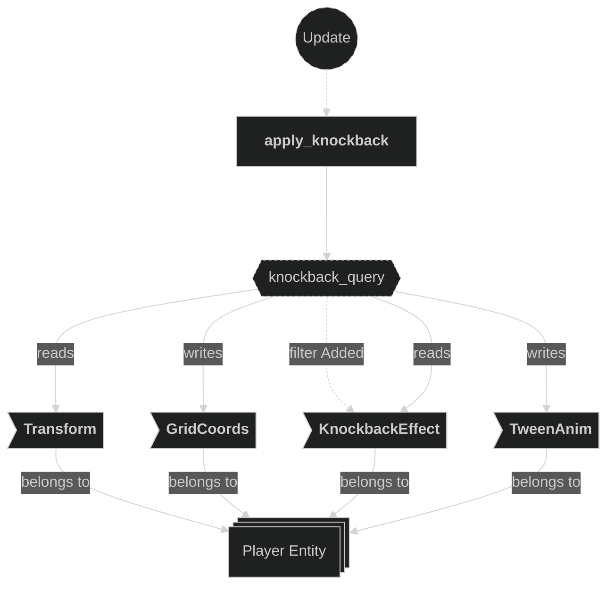
```mermaid
---
config:
  theme: dark
---

flowchart TD
classDef system-group stroke-dasharray: 5 5
classDef query stroke-dasharray: 3 3

update(("`Update`")):::system-group
apply_knockback["`**apply_knockback**`"]

update -.-> apply_knockback

knockback_query{{"`knockback_query`"}}:::query
apply_knockback ---> knockback_query

player_entity@{ shape: st-rect, label: "Player Entity" }

pe_transform>"`**Transform**`"] --> |belongs to| player_entity
pe_coords>"`**GridCoords**`"] --> |belongs to| player_entity
pe_knockback>"`**KnockbackEffect**`"] --> |belongs to| player_entity
pe_tween>"`**TweenAnim**`"] --> |belongs to| player_entity

knockback_query ---> |reads| pe_transform
knockback_query -..-> |filter Added| pe_knockback
knockback_query ---> |reads| pe_knockback
knockback_query ---> |writes| pe_coords
knockback_query ---> |writes| pe_tween
```

### Read MapInfo resource (knockback)

Used in the following systems:
- **apply_knockback**: validates the target tile with `on_ground` and converts `GridCoords` to world-space via `to_translation`

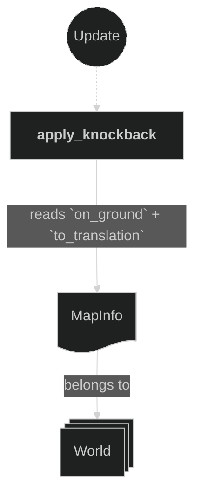
```mermaid
---
config:
  theme: dark
---

flowchart TD
classDef system-group stroke-dasharray: 5 5

update(("`Update`")):::system-group
apply_knockback["`**apply_knockback**`"]

update -.-> apply_knockback

world@{ shape: st-rect, label: "World" }
map_info_res@{ shape: doc, label: "MapInfo" }

map_info_res --> |belongs to| world

apply_knockback ---> |reads `on_ground` + `to_translation`| map_info_res
```

### Write commands (apply_knockback)

Used in the following systems:
- **apply_knockback**: inserts a chained translate+bounce `TweenAnim` on the entity and removes `KnockbackEffect`

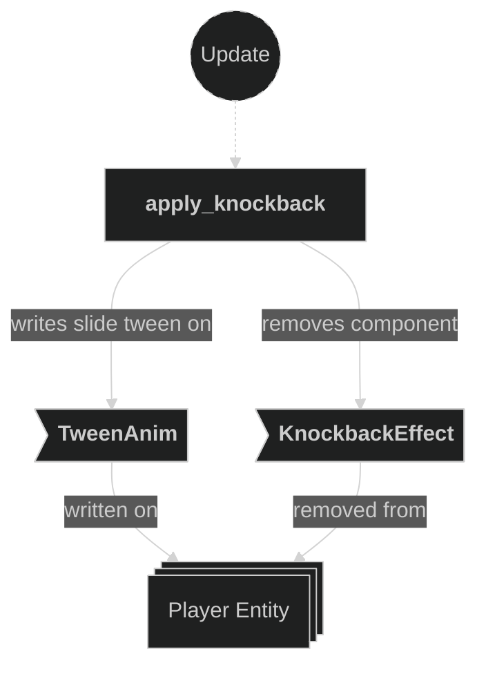
```mermaid
---
config:
  theme: dark
---

flowchart TD
classDef system-group stroke-dasharray: 5 5

update(("`Update`")):::system-group
apply_knockback["`**apply_knockback**`"]

update -.-> apply_knockback

player_entity@{ shape: st-rect, label: "Player Entity" }

pe_tween_anim>"`**TweenAnim**`"]
pe_knockback>"`**KnockbackEffect**`"]

pe_tween_anim --> |written on| player_entity
pe_knockback --> |removed from| player_entity

apply_knockback ---> |writes slide tween on| pe_tween_anim
apply_knockback ---> |removes component| pe_knockback
```

### Read DamageableDied messages

Used in the following systems:
- **apply_death_effect**: used to trigger the death animation sequence on the dying entity

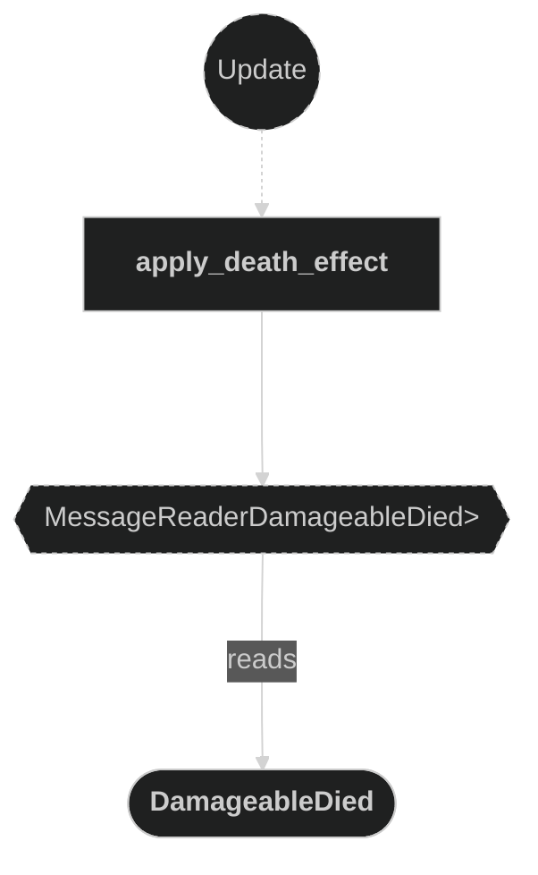
```mermaid
---
config:
  theme: dark
---

flowchart TD
classDef system-group stroke-dasharray: 5 5
classDef reader stroke-dasharray: 3 3

update(("`Update`")):::system-group
apply_death_effect["`**apply_death_effect**`"]

update -.-> apply_death_effect

message_reader{{"MessageReaderDamageableDied#62;"}}:::reader
apply_death_effect ---> message_reader

damageable_died_message(["`**DamageableDied**`"])

message_reader ---> |reads| damageable_died_message
```

### Read MapInfo resource (translate effect)

Used in the following systems:
- **apply_translate_effect**: used to convert `GridCoords` to world-space translation via `to_translation()`

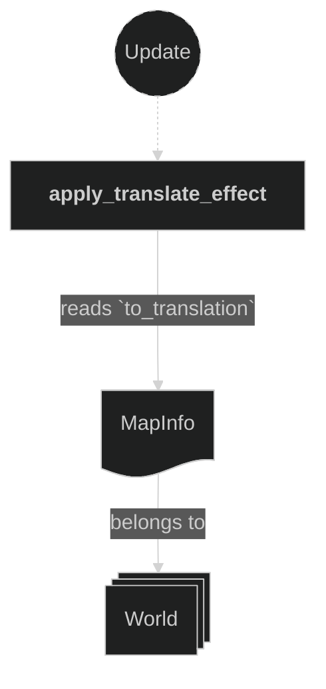
```mermaid
---
config:
  theme: dark
---

flowchart TD
classDef system-group stroke-dasharray: 5 5

update(("`Update`")):::system-group
apply_translate_effect["`**apply_translate_effect**`"]

update -.-> apply_translate_effect

world@{ shape: st-rect, label: "World" }
map_info_res@{ shape: doc, label: "MapInfo" }

map_info_res --> |belongs to| world

apply_translate_effect ---> |reads `to_translation`| map_info_res
```

### Read MapInfo resource (wave effect)

Used in the following systems:
- **apply_wave_effect**: used to resolve a beam's `GridCoords` to a `WaveEffectTarget` entity via `MapInfo::claimed_entities`

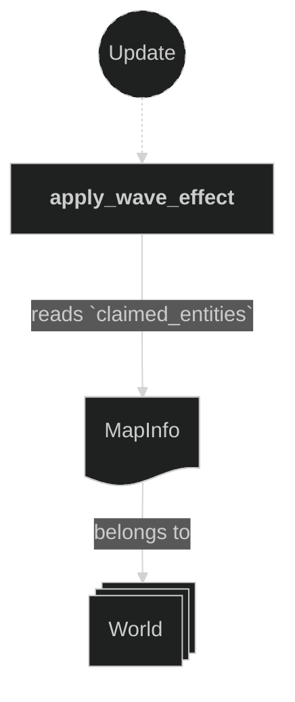
```mermaid
---
config:
  theme: dark
---

flowchart TD
classDef system-group stroke-dasharray: 5 5

update(("`Update`")):::system-group
apply_wave_effect["`**apply_wave_effect**`"]

update -.-> apply_wave_effect

world@{ shape: st-rect, label: "World" }
map_info_res@{ shape: doc, label: "MapInfo" }

map_info_res --> |belongs to| world

apply_wave_effect ---> |reads `claimed_entities`| map_info_res
```

### Query TranslateEffectTarget entities

Used in the following systems:
- **apply_translate_effect**: reads `Transform` and `GridCoords` on entities whose `GridCoords` has changed and that carry `TranslateEffectTarget`, then writes `TweenAnim`

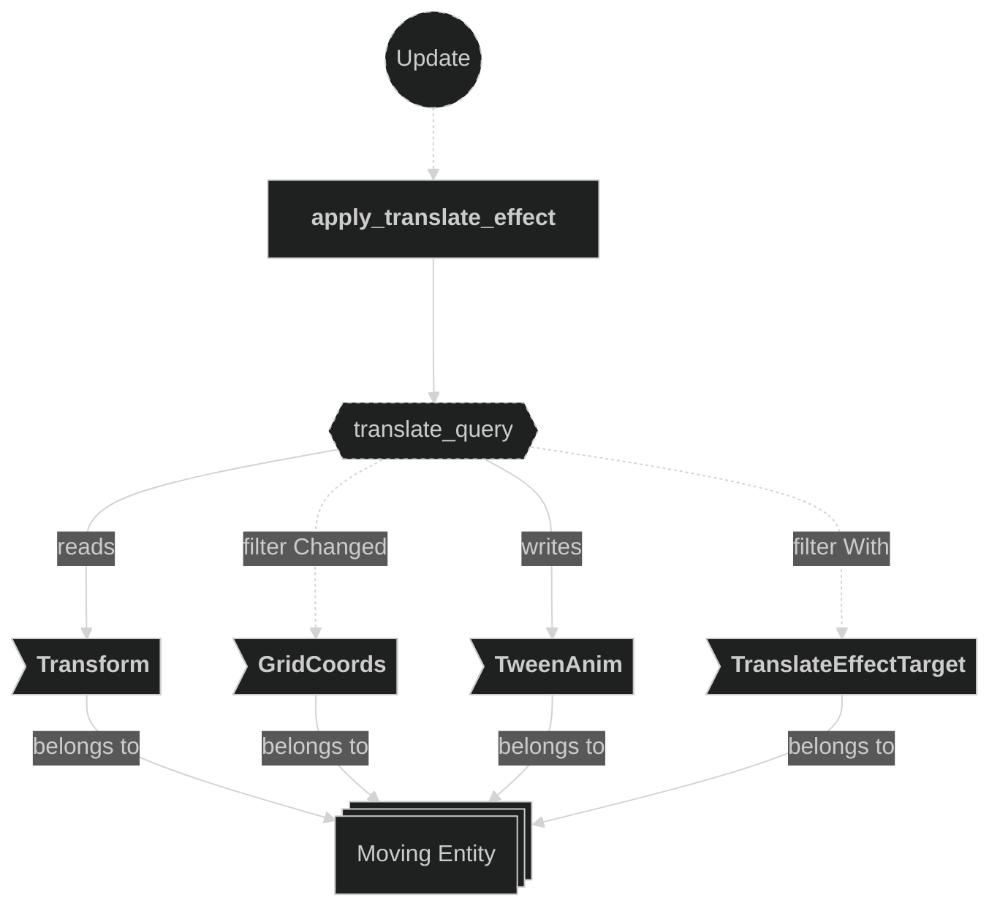
```mermaid
---
config:
  theme: dark
---

flowchart TD
classDef system-group stroke-dasharray: 5 5
classDef query stroke-dasharray: 3 3

update(("`Update`")):::system-group
apply_translate_effect["`**apply_translate_effect**`"]

update -.-> apply_translate_effect

translate_query{{"`translate_query`"}}:::query
apply_translate_effect ---> translate_query

moving_entity@{ shape: st-rect, label: "Moving Entity" }

me_transform>"`**Transform**`"] --> |belongs to| moving_entity
me_grid_coords>"`**GridCoords**`"] --> |belongs to| moving_entity
me_tween_anim>"`**TweenAnim**`"] --> |belongs to| moving_entity
me_marker>"`**TranslateEffectTarget**`"] --> |belongs to| moving_entity

translate_query ---> |reads| me_transform
translate_query -..-> |filter Changed| me_grid_coords
translate_query ---> |writes| me_tween_anim
translate_query -..-> |filter With| me_marker
```

### Query BounceEffect entities (wave effect)

Used in the following systems:
- **apply_wave_effect**: detects beam entities whose `GridCoords` changed and that carry `BounceEffect`, so it can propagate a bounce to the tile below

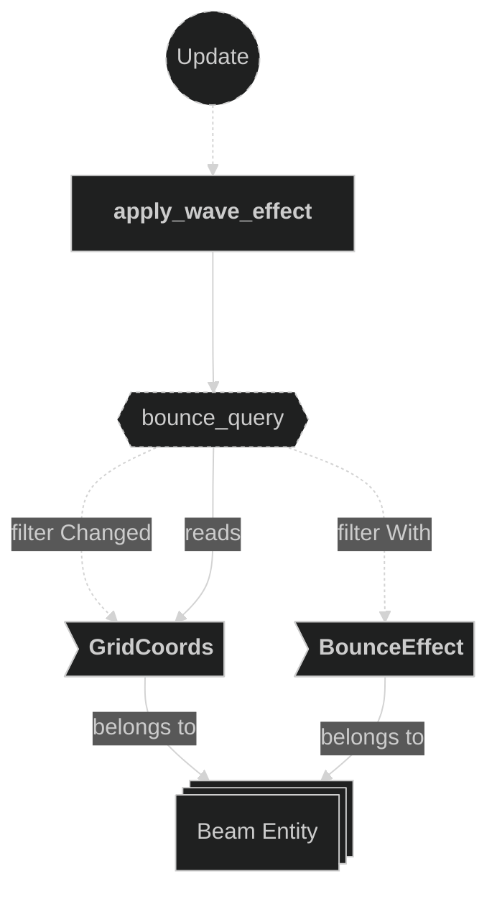
```mermaid
---
config:
  theme: dark
---

flowchart TD
classDef system-group stroke-dasharray: 5 5
classDef query stroke-dasharray: 3 3

update(("`Update`")):::system-group
apply_wave_effect["`**apply_wave_effect**`"]

update -.-> apply_wave_effect

bounce_query{{"`bounce_query`"}}:::query
apply_wave_effect ---> bounce_query

beam_entity@{ shape: st-rect, label: "Beam Entity" }

be_grid_coords>"`**GridCoords**`"] --> |belongs to| beam_entity
be_bounce>"`**BounceEffect**`"] --> |belongs to| beam_entity

bounce_query -..-> |filter Changed| be_grid_coords
bounce_query -..-> |filter With| be_bounce
bounce_query ---> |reads| be_grid_coords
```

### Query WaveEffectTarget entities

Used in the following systems:
- **apply_wave_effect**: looks up the `WaveEffectTarget` entity at the beam's current grid position and inserts `BounceEffectTarget` on it

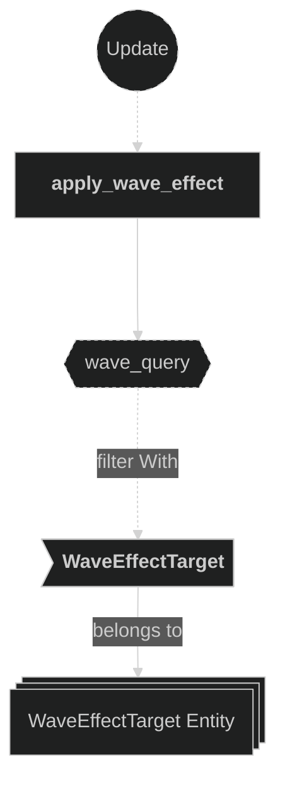
```mermaid
---
config:
  theme: dark
---

flowchart TD
classDef system-group stroke-dasharray: 5 5
classDef query stroke-dasharray: 3 3

update(("`Update`")):::system-group
apply_wave_effect["`**apply_wave_effect**`"]

update -.-> apply_wave_effect

wave_query{{"`wave_query`"}}:::query
apply_wave_effect ---> wave_query

wave_entity@{ shape: st-rect, label: "WaveEffectTarget Entity" }

we_marker>"`**WaveEffectTarget**`"] --> |belongs to| wave_entity

wave_query -..-> |filter With| we_marker
```

### Query BounceEffectTarget entities (bounce effect)

Used in the following systems:
- **apply_bounce_effect**: detects newly added `BounceEffectTarget` markers, plays the bounce tween, and removes the marker

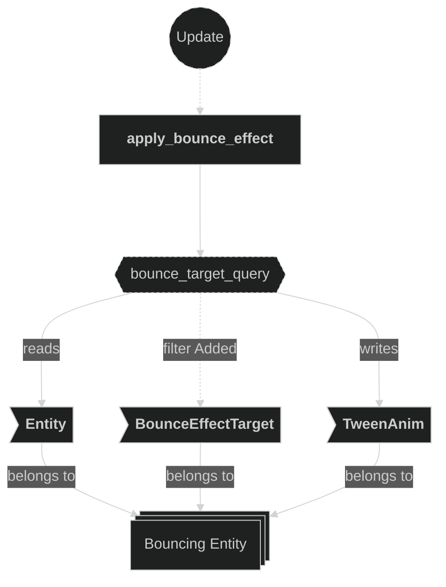
```mermaid
---
config:
  theme: dark
---

flowchart TD
classDef system-group stroke-dasharray: 5 5
classDef query stroke-dasharray: 3 3

update(("`Update`")):::system-group
apply_bounce_effect["`**apply_bounce_effect**`"]

update -.-> apply_bounce_effect

bounce_target_query{{"`bounce_target_query`"}}:::query
apply_bounce_effect ---> bounce_target_query

bounce_entity@{ shape: st-rect, label: "Bouncing Entity" }

be_entity>"`**Entity**`"] --> |belongs to| bounce_entity
be_target>"`**BounceEffectTarget**`"] --> |belongs to| bounce_entity
be_tween>"`**TweenAnim**`"] --> |belongs to| bounce_entity

bounce_target_query ---> |reads| be_entity
bounce_target_query -..-> |filter Added| be_target
bounce_target_query ---> |writes| be_tween
```

### Query DamageEffectTarget entities (damage effect)

Used in the following systems:
- **apply_damage_effect**: detects entities whose `Health` has changed and that carry `DamageEffectTarget`, then plays a color-flash tween on the first child sprite

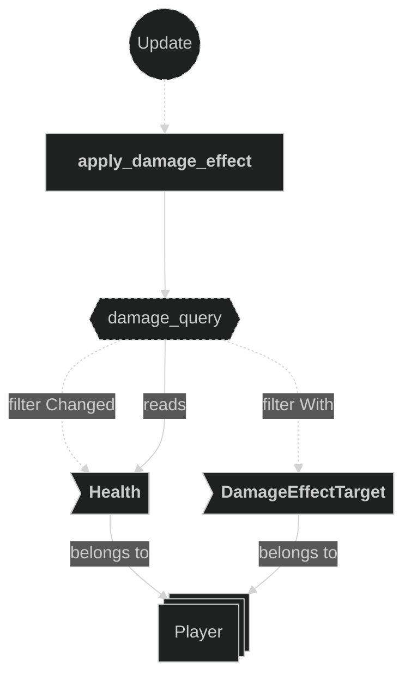
```mermaid
---
config:
  theme: dark
---

flowchart TD
classDef system-group stroke-dasharray: 5 5
classDef query stroke-dasharray: 3 3

update(("`Update`")):::system-group
apply_damage_effect["`**apply_damage_effect**`"]

update -.-> apply_damage_effect

damage_query{{"`damage_query`"}}:::query
apply_damage_effect ---> damage_query

player_entity@{ shape: st-rect, label: "Player" }

pe_health>"`**Health**`"] --> |belongs to| player_entity
pe_marker>"`**DamageEffectTarget**`"] --> |belongs to| player_entity

damage_query -..-> |filter Changed| pe_health
damage_query -..-> |filter With| pe_marker
damage_query ---> |reads| pe_health
```

### Query Children hierarchy (damage effect)

Used in the following systems:
- **apply_damage_effect**: walks descendants to find the first child entity carrying a `Sprite` on which to play the color-flash tween

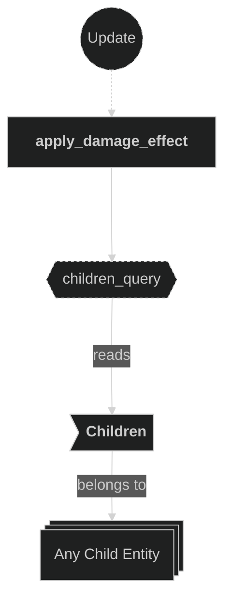
```mermaid
---
config:
  theme: dark
---

flowchart TD
classDef system-group stroke-dasharray: 5 5
classDef query stroke-dasharray: 3 3

update(("`Update`")):::system-group
apply_damage_effect["`**apply_damage_effect**`"]

update -.-> apply_damage_effect

children_query{{"`children_query`"}}:::query
apply_damage_effect ---> children_query

child_entity@{ shape: st-rect, label: "Any Child Entity" }

ch_children>"`**Children**`"] --> |belongs to| child_entity

children_query ---> |reads| ch_children
```

### Query child Sprite (damage effect)

Used in the following systems:
- **apply_damage_effect**: mutably accesses the `Sprite` on the first child entity to insert the red color-flash `TweenAnim`

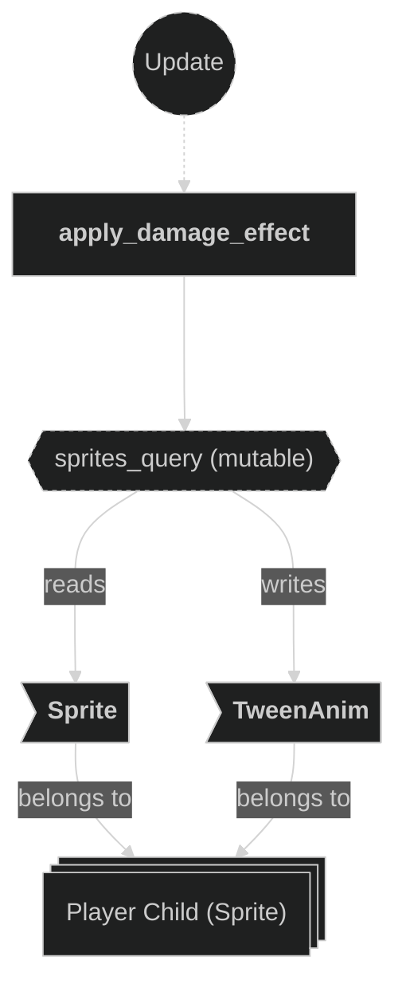
```mermaid
---
config:
  theme: dark
---

flowchart TD
classDef system-group stroke-dasharray: 5 5
classDef query stroke-dasharray: 3 3

update(("`Update`")):::system-group
apply_damage_effect["`**apply_damage_effect**`"]

update -.-> apply_damage_effect

sprites_query{{"`sprites_query (mutable)`"}}:::query
apply_damage_effect ---> sprites_query

child_entity@{ shape: st-rect, label: "Player Child (Sprite)" }

ce_sprite>"`**Sprite**`"] --> |belongs to| child_entity
ce_tween>"`**TweenAnim**`"] --> |belongs to| child_entity

sprites_query ---> |reads| ce_sprite
sprites_query ---> |writes| ce_tween
```

### Read AnimCompletedEvent (death effect)

Used in the following systems:
- **on_death_effect_completed**: reads tween completion events to know when a death bounce animation has finished so the entity can be hidden

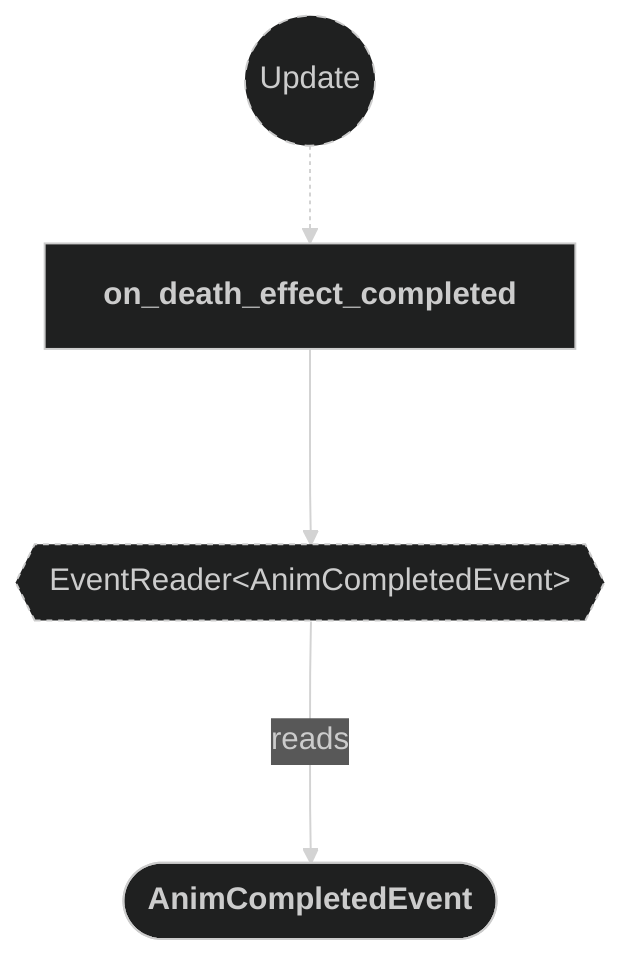
```mermaid
---
config:
  theme: dark
---

flowchart TD
classDef system-group stroke-dasharray: 5 5
classDef reader stroke-dasharray: 3 3

update(("`Update`")):::system-group
on_death_effect_completed["`**on_death_effect_completed**`"]

update -.-> on_death_effect_completed

event_reader{{"EventReader#60;AnimCompletedEvent#62;"}}:::reader
on_death_effect_completed ---> event_reader

anim_completed_event(["`**AnimCompletedEvent**`"])

event_reader ---> |reads| anim_completed_event
```

### Query IsDead entities (death completed)

Used in the following systems:
- **on_death_effect_completed**: checks whether the entity whose animation completed carries both `IsDead` and `BounceEffect` before hiding it

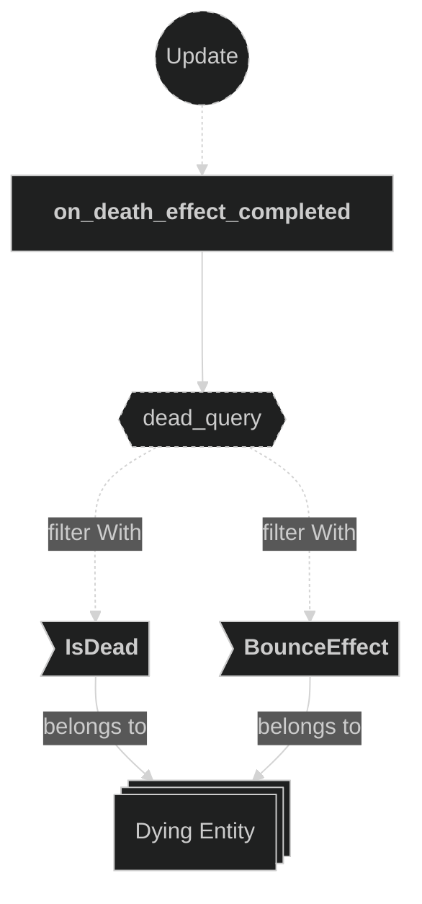
```mermaid
---
config:
  theme: dark
---

flowchart TD
classDef system-group stroke-dasharray: 5 5
classDef query stroke-dasharray: 3 3

update(("`Update`")):::system-group
on_death_effect_completed["`**on_death_effect_completed**`"]

update -.-> on_death_effect_completed

dead_query{{"`dead_query`"}}:::query
on_death_effect_completed ---> dead_query

dead_entity@{ shape: st-rect, label: "Dying Entity" }

de_is_dead>"`**IsDead**`"] --> |belongs to| dead_entity
de_bounce>"`**BounceEffect**`"] --> |belongs to| dead_entity

dead_query -..-> |filter With| de_is_dead
dead_query -..-> |filter With| de_bounce
```

### Write commands (apply_translate_effect)

Used in the following systems:
- **apply_translate_effect**: sets a new `TransformPositionLens` tween on the entity's `TweenAnim` to smoothly move it to its new grid-aligned world position

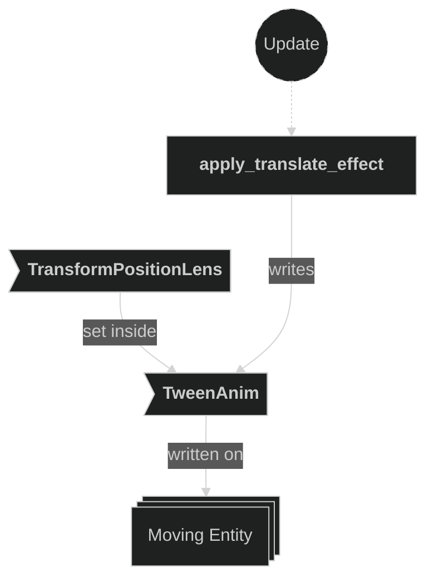
```mermaid
---
config:
  theme: dark
---

flowchart TD
classDef system-group stroke-dasharray: 5 5

update(("`Update`")):::system-group
apply_translate_effect["`**apply_translate_effect**`"]

update -.-> apply_translate_effect

moving_entity@{ shape: st-rect, label: "Moving Entity" }

me_tween_anim>"`**TweenAnim**`"]
me_tween_lens>"`**TransformPositionLens**`"]

me_tween_lens --> |set inside| me_tween_anim
me_tween_anim --> |written on| moving_entity

apply_translate_effect ---> |writes| me_tween_anim
```

### Write commands (apply_wave_effect)

Used in the following systems:
- **apply_wave_effect**: inserts `BounceEffectTarget` on the `WaveEffectTarget` entity at the beam's current grid position to trigger its bounce

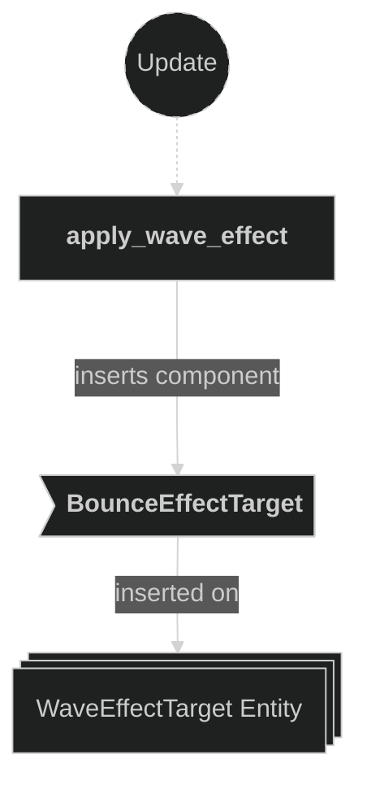
```mermaid
---
config:
  theme: dark
---

flowchart TD
classDef system-group stroke-dasharray: 5 5

update(("`Update`")):::system-group
apply_wave_effect["`**apply_wave_effect**`"]

update -.-> apply_wave_effect

wave_entity@{ shape: st-rect, label: "WaveEffectTarget Entity" }

we_bounce_target>"`**BounceEffectTarget**`"]

we_bounce_target --> |inserted on| wave_entity

apply_wave_effect ---> |inserts component| we_bounce_target
```

### Write commands (apply_bounce_effect)

Used in the following systems:
- **apply_bounce_effect**: plays a scale bounce tween on the entity and removes `BounceEffectTarget` after initiating the animation

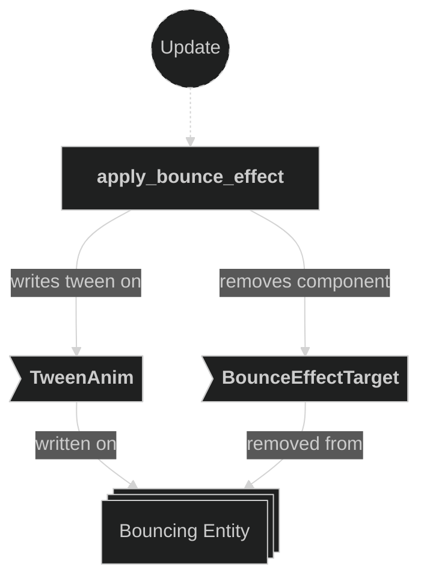
```mermaid
---
config:
  theme: dark
---

flowchart TD
classDef system-group stroke-dasharray: 5 5

update(("`Update`")):::system-group
apply_bounce_effect["`**apply_bounce_effect**`"]

update -.-> apply_bounce_effect

bounce_entity@{ shape: st-rect, label: "Bouncing Entity" }

be_tween_anim>"`**TweenAnim**`"]
be_target>"`**BounceEffectTarget**`"]

be_tween_anim --> |written on| bounce_entity
be_target --> |removed from| bounce_entity

apply_bounce_effect ---> |writes tween on| be_tween_anim
apply_bounce_effect ---> |removes component| be_target
```

### Write commands (apply_death_effect)

Used in the following systems:
- **apply_death_effect**: inserts `BounceEffect`, `BounceEffectTarget`, and `IsDead` on the entity named in the `DamageableDied` message

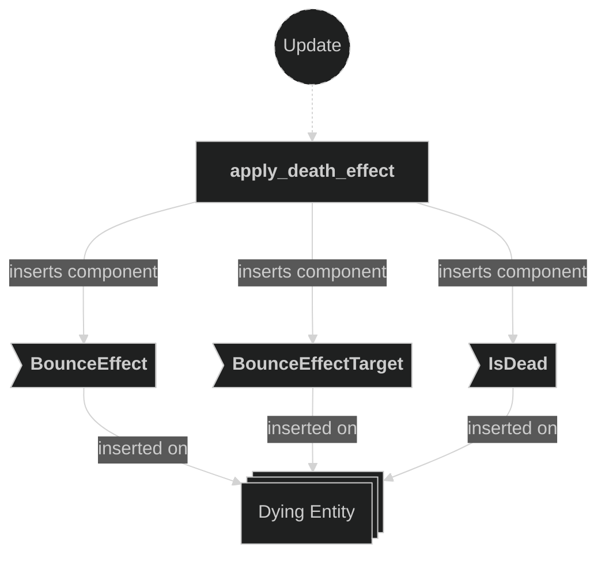
```mermaid
---
config:
  theme: dark
---

flowchart TD
classDef system-group stroke-dasharray: 5 5

update(("`Update`")):::system-group
apply_death_effect["`**apply_death_effect**`"]

update -.-> apply_death_effect

dying_entity@{ shape: st-rect, label: "Dying Entity" }

de_bounce_effect>"`**BounceEffect**`"]
de_bounce_target>"`**BounceEffectTarget**`"]
de_is_dead>"`**IsDead**`"]

de_bounce_effect --> |inserted on| dying_entity
de_bounce_target --> |inserted on| dying_entity
de_is_dead --> |inserted on| dying_entity

apply_death_effect ---> |inserts component| de_bounce_effect
apply_death_effect ---> |inserts component| de_bounce_target
apply_death_effect ---> |inserts component| de_is_dead
```

### Write commands (on_death_effect_completed)

Used in the following systems:
- **on_death_effect_completed**: hides the entity and removes its `BounceEffect` after its death bounce animation has completed (the entity survives for the round reset)

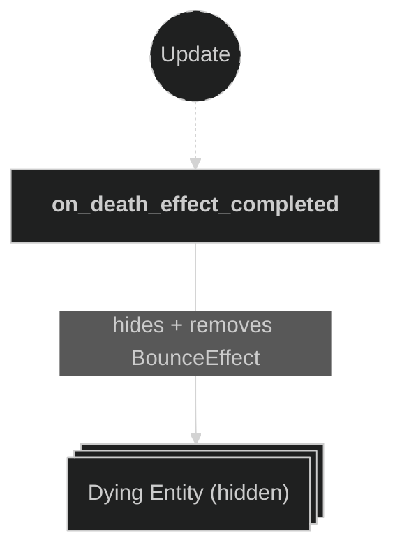
```mermaid
---
config:
  theme: dark
---

flowchart TD
classDef system-group stroke-dasharray: 5 5

update(("`Update`")):::system-group
on_death_effect_completed["`**on_death_effect_completed**`"]

update -.-> on_death_effect_completed

dead_entity@{ shape: st-rect, label: "Dying Entity (hidden)" }

on_death_effect_completed ---> |hides + removes BounceEffect| dead_entity
```
