# Effects Plugin

Contains systems responsible for all visual effects applied to game entities: smooth translation tweens for moving entities, knockback and death-bounce animations for players, bounce and wave animations for beams and claimed tiles, color-flash feedback when a player takes damage, and a beam-origin illumination telegraph that lights up each tile a beam crosses. Because knockback, death-bounce, movement-settle, and plain translation can all target the same player entity's `Transform` `TweenAnim` slot, this plugin also arbitrates ownership of that slot so a higher-priority effect is never silently overwritten mid-play, and so completion handlers act only on the effect that actually finished.

## Transform effect ownership

Four systems can write a player's `Transform` `TweenAnim`: `apply_bounce_effect`, `apply_knockback`, `apply_movement_settle`, `apply_translate_effect`. Only one tween can occupy the slot at a time, so ownership among them follows a fixed precedence — **Bounce > Knockback > {Settle, Translate}** — enforced structurally through query shape rather than a runtime priority comparison:
- `apply_bounce_effect` never checks for a competing effect: it fires on `Added<BounceEffectTarget>`, which is only ever inserted once the entity is already committed to bouncing — a death bounce (via `start_deferred_death_bounce` or directly from `apply_death_effect`) on a player, or a tile-claim bounce inserted by the Animations plugin's `animate_claimed_tile` on a claimed tile. This precedence rule matters only for players: a claimed tile has no competing `Transform` effect, so `ActiveTransformEffect(Bounce)` lands on it too but is never read back.
- `apply_knockback` reads `Has<IsDead>` in the system body rather than filtering the query on it, so `KnockbackEffect` is always removed even when the tween itself is skipped (see Apply Knockback below for why).
- `apply_movement_settle` reads `Has<IsDead>`, `Has<IsKnockedBack>`, and `Has<KnockbackEffect>` in the system body for the same reason, so `MovementSettle` is always removed even when the tween is skipped (see Apply Movement Settle below for why `KnockbackEffect` is checked alongside the other two).
- `apply_translate_effect` filters `Without<KnockbackEffect>`, `Without<IsKnockedBack>`, `Without<IsDead>` directly on the query, since it re-runs every frame the entity's `GridCoords` changes and has no request component of its own to strand.

Settle and Translate are not ordered against each other and nothing arbitrates between them; whichever system's `Commands` are applied later wins that frame.

Every system that wins the slot also tags the entity with `ActiveTransformEffect(TransformEffectKind)`, where `TransformEffectKind` is one of `Translate`, `Settle`, `Knockback`, `Bounce`. `AnimCompletedEvent` carries no identity of which tween finished, so `on_death_effect_completed` and `on_knockback_tween_completed` each read this tag before acting, only running their own cleanup when the tag names their own effect — an entity's tween completing no longer implies any specific effect finished; the tag is what confirms it. The tag itself is removed only by whichever completion handler consumes it, or by `reset_round`; an entity at rest otherwise keeps its most recent effect's tag until the next transform effect overwrites it.

Death and knockback cooperate rather than race for the slot: `apply_death_effect` checks whether a knockback is already in flight (`Has<IsKnockedBack>`) or about to start (a `KnockbackEffect` still pending resolution) and, if so, inserts `PendingDeathBounce` instead of `BounceEffectTarget` — parking the death bounce so the knockback slide is allowed to finish naturally instead of being clobbered mid-flight. `start_deferred_death_bounce` runs every frame and promotes any `PendingDeathBounce` entity to `BounceEffectTarget` the moment both `IsKnockedBack` and `KnockbackEffect` are absent, regardless of why they cleared — the knockback lock timer expiring via `tick_knockback_lock`, or the knockback never starting at all because the target tile was off the ground — which is what makes the deferral safe rather than a potential permanent stall.

## Plugin workflow

- Update phase (ordered)
    - `sync_resting_translation` (before `apply_bounce_effect` and `apply_wave_effect`):
        - Reacts to `Changed<GridCoords>` on `TranslateEffectTarget` entities (players)
            - Writes `RestingTranslation` to the new grid position's world translation
    - `apply_knockback` (before `apply_translate_effect`):
        - Reacts to `Added<KnockbackEffect>`
            - Reads `Transform`, `GridCoords`, `Has<IsDead>`, and `MapInfo` to validate the target tile and compute the destination
            - If the target is on ground and the entity is not dead: mutates `GridCoords`, inserts a slide `TweenAnim`, `IsKnockedBack(Timer)` seeded from `config.effects.knockback_tween_ms`, and `ActiveTransformEffect(Knockback)`
            - Always removes `KnockbackEffect`
    - `apply_translate_effect`:
        - Reacts to `Changed<GridCoords>` on `TranslateEffectTarget` entities without `KnockbackEffect`, `IsKnockedBack`, or `IsDead`
            - Inserts a `TweenAnim` sized from the entity's `MovementSlide` (or `config.timing.move_repeat_rate_ms` if absent) and `ActiveTransformEffect(Translate)`
    - `apply_movement_settle`:
        - Reacts to `Added<MovementSettle>`
            - If not dead, not knocked back, and no `KnockbackEffect` pending: inserts an ease-out `TweenAnim` and `ActiveTransformEffect(Settle)`
            - Always removes `MovementSettle`
    - `apply_death_effect` (after `apply_knockback`, tagged `GameplaySet::Presentation`):
        - Reads `DamageableDied` messages, matched against entities without `IsDead`
            - Always inserts `BounceEffect` + `IsDead`
            - Inserts `PendingDeathBounce` if a knockback is in flight or about to start on that entity, otherwise inserts `BounceEffectTarget` directly
    - `start_deferred_death_bounce`:
        - Reacts every frame to `PendingDeathBounce` + `BounceEffect` entities without `IsKnockedBack`/`KnockbackEffect`
            - Promotes to `BounceEffectTarget`, removes `PendingDeathBounce`
    - `apply_wave_effect`:
        - Reacts to `Changed<GridCoords>` on entities carrying both `WaveSource` and `BounceEffect` (in practice, beams that are not lane-suppressed — see the Beam plugin doc)
            - Resolves the source's `GridCoords` to a `WaveEffectTarget` claimed-tile entity via `MapInfo::claimed_entities`
            - Inserts a bounce `TweenAnim` directly on that tile — no `ActiveTransformEffect` tag
    - `apply_bounce_effect`:
        - Reacts to `Added<BounceEffectTarget>` on any entity
            - Inserts a bounce `TweenAnim` and `ActiveTransformEffect(Bounce)`, removes `BounceEffectTarget`
    - `apply_damage_effect`:
        - Reacts to `Changed<Health>` on `DamageEffectTarget` entities
            - Plays a red color-flash tween on the first child sprite entity
    - `apply_illumination_effect`:
        - Reacts to `Changed<GridCoords>` on `Beam` entities (every step of the beam's travel, not just its origin)
            - Resolves the beam's position to an `IlluminationEffectTarget` tile via `MapInfo::get_claimed_entity_by_position`
            - Despawns any existing `IlluminationDriver` already targeting that tile (re-fire dedup), then spawns a fresh driver carrying a fade-in → hold → fade-out `TweenAnim` redirected at the tile's `Sprite`
    - `on_death_effect_completed`:
        - Reads `AnimCompletedEvent`; for entities with `IsDead` + `BounceEffect` whose `ActiveTransformEffect` reads `Bounce`, hides the entity and removes `BounceEffect` + `ActiveTransformEffect`
    - `on_knockback_tween_completed`:
        - Reads `AnimCompletedEvent`; for `IsKnockedBack` entities whose `ActiveTransformEffect` reads `Knockback`, removes only `ActiveTransformEffect` — cosmetic tag cleanup, since `IsKnockedBack` is no longer tied to tween completion
    - `tick_knockback_lock` (no ordering dependency; placed by registration order):
        - Runs every frame against every entity carrying `IsKnockedBack`
            - Ticks the entity's timer; once it finishes, removes `IsKnockedBack` — the sole removal path during normal play, independent of whatever the visual tween/tag is doing
    - `on_illumination_completed`:
        - Reads `AnimCompletedEvent`; despawns the `IlluminationDriver` entity whose tween finished
- `OnExit(RoundPhase::Playing)`
    - `clear_illumination_drivers`: force-resets any tile still mid-tint back to `Color::WHITE` and despawns its driver, so a round boundary can't strand a tinted tile

## Plugin Systems

### Apply Knockback

Reacts to `Added<KnockbackEffect>`. Computes the knockback target tile (`GridCoords + direction`) and validates it with `MapInfo::on_ground`. If valid and `Has<IsDead>` reads false, mutates `GridCoords` to the target and inserts a slide `TweenAnim` (`TransformPositionLens`, built by the `create_movement_tween` helper over `config.effects.knockback_tween_ms`, default `200`) plus `IsKnockedBack(Timer::new(config.effects.knockback_tween_ms, TimerMode::Once))` and `ActiveTransformEffect(TransformEffectKind::Knockback)` (see the `IsKnockedBack` lifecycle section below for how the lock is cleared). `KnockbackEffect` is removed unconditionally — even when dead or blocked — because leaving it stranded would permanently block all future `Transform` effects on that entity.

### Apply Translate Effect

Reacts to `Changed<GridCoords>` on entities that carry `TranslateEffectTarget` and none of `KnockbackEffect`, `IsKnockedBack`, `IsDead`. Computes the world-space destination via `MapInfo`, and sizes the tween's duration from the entity's `MovementSlide` component if present, otherwise `config.timing.move_repeat_rate_ms`. Sets a `TransformPositionLens` tween (`EaseFunction::Linear`, built by `create_movement_tween`) and `ActiveTransformEffect(TransformEffectKind::Translate)`. Provides smooth movement interpolation for players and beams without any coupling to the input or controller plugins.

### Apply Movement Settle

Reacts to `Added<MovementSettle>`. Reads `Has<IsKnockedBack>`, `Has<IsDead>`, and `Has<KnockbackEffect>` in the system body rather than filtering the query on them: if all three are false, inserts an ease-out `TweenAnim` (`EaseFunction::QuadraticOut`, over `config.timing.move_repeat_rate_ms`) toward the entity's current `GridCoords`, plus `ActiveTransformEffect(TransformEffectKind::Settle)`. `KnockbackEffect` is checked alongside the other two as a body-check for the same reason: a fresh knockback's `IsKnockedBack` insert can be one frame behind its `KnockbackEffect` marker becoming visible, and filtering the query on it instead would let a `MovementSettle` inserted in that window strand — this system only matches `Added<MovementSettle>`, so a filtered-out entity never gets a second chance to be picked up. `MovementSettle` is removed unconditionally in every case, since a filtered-out entity would never re-trigger this `Added<MovementSettle>`-gated system on its next release.

### Sync Resting Translation

Reacts to `Changed<GridCoords>` on `TranslateEffectTarget` entities — only players carry this marker, since claimed tiles never move and never receive a `RestingTranslation` component at all. Writes `RestingTranslation` to the world translation of the new `GridCoords`. Ordered before `apply_bounce_effect` and `apply_wave_effect`, both of which read a `RestingTranslation` when present (falling back to `Transform::translation` for tiles, which have none) so a bounce origin is always the authoritative resting position rather than a `Transform` that may still be mid-tween.

### Apply Wave Effect

Reacts to `Changed<GridCoords>` on entities that carry both `WaveSource` and `BounceEffect`. `WaveSource` is inserted only on beams (see the Beam plugin doc), and only on the same condition as `BounceEffect` itself — a lane-suppressed beam gets neither, so it never triggers a wave, though it still triggers illumination (`apply_illumination_effect` is gated only on `With<Beam>`). Resolves the source's `GridCoords` to a claimed tile entity via `MapInfo::claimed_entities`, then reads that tile's `Transform` and optional `RestingTranslation` (falling back to `Transform::translation` if absent) as the bounce origin, and inserts a bounce `TweenAnim` (built by `create_bounce_tween`) directly on the tile — no `ActiveTransformEffect` tag. This causes the tile underneath the beam to "ripple" as the beam passes over it.

### Apply Bounce Effect

Reacts to `Added<BounceEffectTarget>` — fires once whenever any entity receives the `BounceEffectTarget` marker. Reads the entity's `Transform` and optional `RestingTranslation` (falling back to `Transform::translation`) as the bounce origin, inserts a bounce `TweenAnim` and `ActiveTransformEffect(TransformEffectKind::Bounce)`, then removes `BounceEffectTarget` so the effect fires exactly once per insertion. Shared by multiple upstream systems: tile claiming and death animations both trigger bounces by inserting `BounceEffectTarget` (directly, or via `start_deferred_death_bounce`).

### Apply Damage Effect

Reacts to `Changed<Health>` on entities that carry a `DamageEffectTarget` marker. Walks the entity's children to find the first child sprite entity and plays a short red color-flash tween on it (interpolating `Sprite::color` to red and back over `config.effects.damage_flash_ms`, default `150`). Provides immediate visual feedback whenever a player loses health.

### Apply Death Effect

Reads `DamageableDied` messages, matched against a query filtered to entities without `IsDead` (so a duplicate death message on an already-dead entity is a no-op). For each message, always inserts `BounceEffect` and `IsDead` on the dying entity. Then reads `Has<IsKnockedBack>` on the entity and a separate `Query<(), With<KnockbackEffect>>` to check whether a knockback is already playing or about to start: if either is true, inserts `PendingDeathBounce` instead of triggering the bounce immediately; otherwise inserts `BounceEffectTarget` directly, which `apply_bounce_effect` picks up the same frame. It is tagged `.in_set(GameplaySet::Presentation)`, purely for its position relative to `GameplaySet::Damage`/`GameplaySet::RoundResolution` in the shared chain (`schedule.rs`) — the tag carries no `RoundPhase` gate of its own, so `apply_death_effect` remains as ungated as the rest of this plugin, letting it still catch and animate a `DamageableDied` message written on the last `Playing` frame before a kill ends the round, after the phase has already flipped to `Outcome`.

### Start Deferred Death Bounce

Runs every frame against entities with `PendingDeathBounce` + `BounceEffect` and neither `IsKnockedBack` nor `KnockbackEffect`. Promotes each match to `BounceEffectTarget` and removes `PendingDeathBounce` — the self-healing arm of the knockback-to-death-bounce handoff described under Transform effect ownership above.

### On Death Effect Completed

Reads `AnimCompletedEvent` events. For each, checks whether the completed animation's target entity carries both `IsDead` and `BounceEffect`; if so, reads its `ActiveTransformEffect` and only proceeds when the tag reads `TransformEffectKind::Bounce` (confirming the tween that just finished was actually the death bounce, not some other transform effect that happened to complete around the same time). On a match, hides the entity (`Visibility::Hidden`) and removes `BounceEffect` + `ActiveTransformEffect`, keeping it alive and still marked `IsDead` so the round reset can revive it. Only players carry `DamageEffectTarget`, so this only ever hides players.

### On Knockback Tween Completed

Reads `AnimCompletedEvent` events. For each, checks whether the completed animation's target entity carries `IsKnockedBack`; if so, reads its `ActiveTransformEffect` and only proceeds when the tag reads `TransformEffectKind::Knockback`. On a match, removes only `ActiveTransformEffect` — pure cosmetic bookkeeping so a completed Knockback-tagged tween doesn't leave a stale tag claiming ownership of the `Transform` channel. It no longer removes `IsKnockedBack`, which is timer-driven (see `tick_knockback_lock` and the `IsKnockedBack` lifecycle section below).

### Tick Knockback Lock

Runs every frame against every entity carrying `IsKnockedBack`, with no ordering dependency on any other system in this plugin. Ticks each entity's timer by `Res<Time>`'s delta, and once the timer finishes, removes `IsKnockedBack` — releasing the entity back to normal movement, and, if a death bounce was parked behind it, letting `start_deferred_death_bounce` promote it the same or next frame.

### Apply Illumination Effect

Reacts to `Changed<GridCoords>` on `Beam` entities — every tile a beam crosses, not only its spawn position. Also reads `&Beam` (for `owner`) and a `Query<&Player>` to resolve the firing player: looks up `owner.player_id` and selects `config.effects.beam_illumination_color_p1` for `0`, `beam_illumination_color_p2` for `1`, falling back to `beam_illumination_color_p1` for any other value rather than panicking, since this runs every frame on live beams. Resolves the beam's current `GridCoords` to a tile entity via `MapInfo::get_claimed_entity_by_position`, requiring that tile to carry both `IlluminationEffectTarget` and a `Sprite`. Despawns any existing `IlluminationDriver` already targeting that same tile (re-fire dedup), then spawns a new driver entity carrying `IlluminationDriver { tile }`, `AnimTarget::component::<Sprite>(tile)`, and a `TweenAnim` built by `create_illumination_tween` from the tile's live `sprite.color` to the resolved per-player color and back to `Color::WHITE`, over `beam_illumination_fade_in_ms` / `beam_illumination_hold_ms` / `beam_illumination_fade_out_ms`. `create_illumination_tween` clamps the fade-in/fade-out durations to a minimum of 1 ms (`bevy_tweening`'s `Tween` cannot have a zero duration) and omits the hold `Delay` stage entirely when `beam_illumination_hold_ms` is `0` (`Delay::new` panics on a zero duration), so a fully-zeroed hold plays as a direct fade-in-to-fade-out with no pause. See the `IlluminationDriver` lifecycle section below for why the tween is redirected at a proxy entity rather than living on the tile.

### On Illumination Completed

Reads `AnimCompletedEvent` events. For each, despawns the `IlluminationDriver` entity whose tween just finished. `bevy_tweening` removes the `TweenAnim` component on completion but not the entity itself, so this prevents driver entities from leaking indefinitely, one per beam tile-step.

### Clear Illumination Drivers

Runs on `OnExit(RoundPhase::Playing)`. For every `IlluminationDriver` still alive (a tint whose tween hadn't finished when the round left `Playing`), force-sets its target tile's `Sprite::color` back to `Color::WHITE` and despawns the driver.

## Components, Resources and Messages CRUD

### Query KnockbackEffect entities (knockback)

Used in the following systems:
- **apply_knockback**: reads `Transform`, `GridCoords`, `KnockbackEffect`, and `Has<IsDead>` on newly knocked-back entities; mutates `GridCoords`, writes `TweenAnim` + `ActiveTransformEffect`; removes `KnockbackEffect`

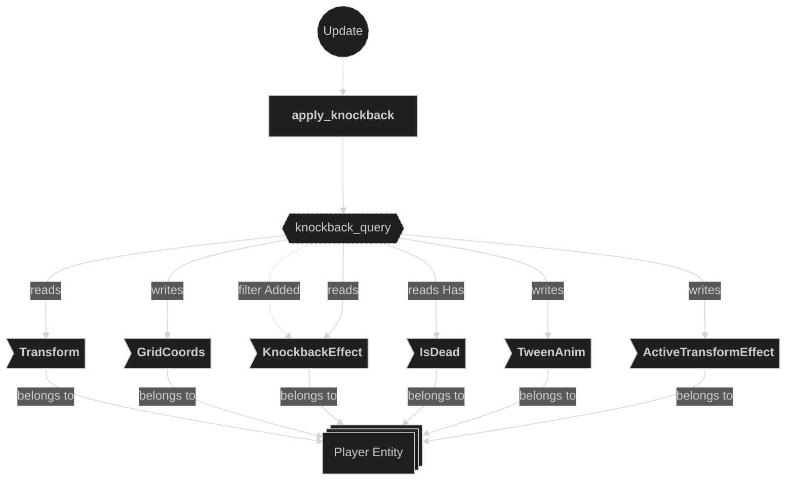
```mermaid
---
config:
  theme: dark
---

flowchart TD
classDef system-group stroke-dasharray: 5 5
classDef query stroke-dasharray: 3 3

update(("`Update`")):::system-group
apply_knockback["`**apply_knockback**`"]

update -.-> apply_knockback

knockback_query{{"`knockback_query`"}}:::query
apply_knockback ---> knockback_query

player_entity@{ shape: st-rect, label: "Player Entity" }

pe_transform>"`**Transform**`"] --> |belongs to| player_entity
pe_coords>"`**GridCoords**`"] --> |belongs to| player_entity
pe_knockback>"`**KnockbackEffect**`"] --> |belongs to| player_entity
pe_is_dead>"`**IsDead**`"] --> |belongs to| player_entity
pe_tween>"`**TweenAnim**`"] --> |belongs to| player_entity
pe_active>"`**ActiveTransformEffect**`"] --> |belongs to| player_entity

knockback_query ---> |reads| pe_transform
knockback_query -..-> |filter Added| pe_knockback
knockback_query ---> |reads| pe_knockback
knockback_query ---> |reads Has| pe_is_dead
knockback_query ---> |writes| pe_coords
knockback_query ---> |writes| pe_tween
knockback_query ---> |writes| pe_active
```

### Read MapInfo resource (knockback)

Used in the following systems:
- **apply_knockback**: validates the target tile with `on_ground` and converts `GridCoords` to world-space via `to_translation`

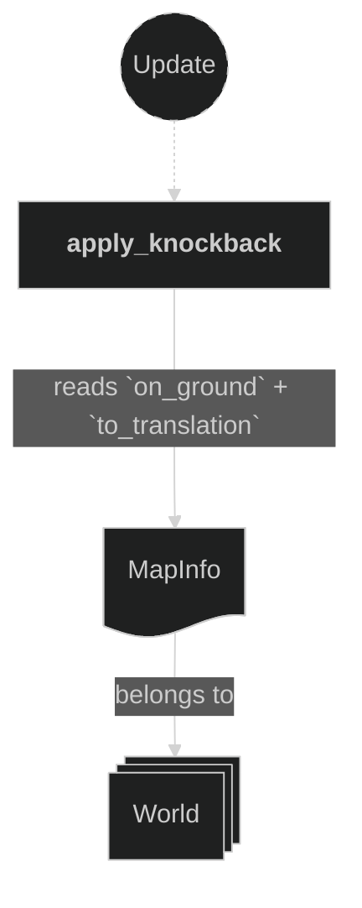
```mermaid
---
config:
  theme: dark
---

flowchart TD
classDef system-group stroke-dasharray: 5 5

update(("`Update`")):::system-group
apply_knockback["`**apply_knockback**`"]

update -.-> apply_knockback

world@{ shape: st-rect, label: "World" }
map_info_res@{ shape: doc, label: "MapInfo" }

map_info_res --> |belongs to| world

apply_knockback ---> |reads `on_ground` + `to_translation`| map_info_res
```

### Write commands (apply_knockback)

Used in the following systems:
- **apply_knockback**: inserts a slide `TweenAnim` + `ActiveTransformEffect(Knockback)` + `IsKnockedBack` on the entity when valid and not dead, and always removes `KnockbackEffect`

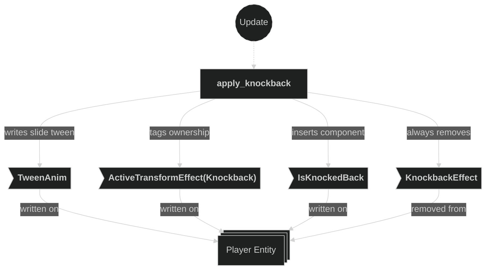
```mermaid
---
config:
  theme: dark
---

flowchart TD
classDef system-group stroke-dasharray: 5 5

update(("`Update`")):::system-group
apply_knockback["`**apply_knockback**`"]

update -.-> apply_knockback

player_entity@{ shape: st-rect, label: "Player Entity" }

pe_tween_anim>"`**TweenAnim**`"]
pe_active>"`**ActiveTransformEffect(Knockback)**`"]
pe_is_knocked>"`**IsKnockedBack**`"]
pe_knockback>"`**KnockbackEffect**`"]

pe_tween_anim --> |written on| player_entity
pe_active --> |written on| player_entity
pe_is_knocked --> |written on| player_entity
pe_knockback --> |removed from| player_entity

apply_knockback ---> |writes slide tween| pe_tween_anim
apply_knockback ---> |tags ownership| pe_active
apply_knockback ---> |inserts component| pe_is_knocked
apply_knockback ---> |always removes| pe_knockback
```

### Query TranslateEffectTarget entities

Used in the following systems:
- **apply_translate_effect**: reads `Transform`, `GridCoords`, and optional `MovementSlide` on entities whose `GridCoords` changed, that carry `TranslateEffectTarget` and none of `KnockbackEffect`/`IsKnockedBack`/`IsDead`; writes `TweenAnim` + `ActiveTransformEffect`

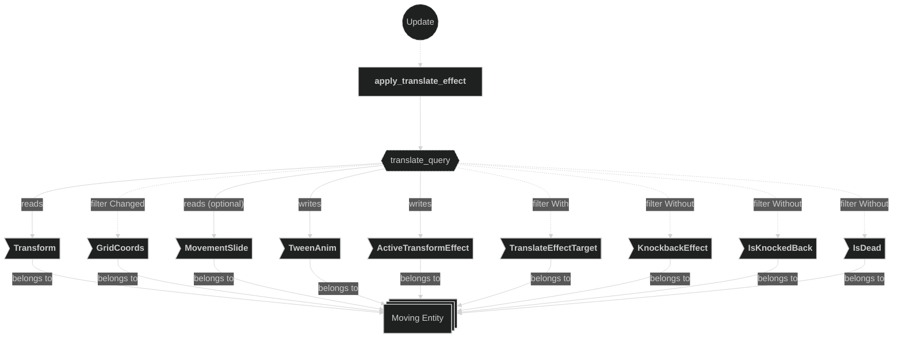
```mermaid
---
config:
  theme: dark
---

flowchart TD
classDef system-group stroke-dasharray: 5 5
classDef query stroke-dasharray: 3 3

update(("`Update`")):::system-group
apply_translate_effect["`**apply_translate_effect**`"]

update -.-> apply_translate_effect

translate_query{{"`translate_query`"}}:::query
apply_translate_effect ---> translate_query

moving_entity@{ shape: st-rect, label: "Moving Entity" }

me_transform>"`**Transform**`"] --> |belongs to| moving_entity
me_grid_coords>"`**GridCoords**`"] --> |belongs to| moving_entity
me_slide>"`**MovementSlide**`"] --> |belongs to| moving_entity
me_tween_anim>"`**TweenAnim**`"] --> |belongs to| moving_entity
me_active>"`**ActiveTransformEffect**`"] --> |belongs to| moving_entity
me_marker>"`**TranslateEffectTarget**`"] --> |belongs to| moving_entity
me_knockback>"`**KnockbackEffect**`"] --> |belongs to| moving_entity
me_is_knocked>"`**IsKnockedBack**`"] --> |belongs to| moving_entity
me_is_dead>"`**IsDead**`"] --> |belongs to| moving_entity

translate_query ---> |reads| me_transform
translate_query -..-> |filter Changed| me_grid_coords
translate_query ---> |"reads (optional)"| me_slide
translate_query ---> |writes| me_tween_anim
translate_query ---> |writes| me_active
translate_query -..-> |filter With| me_marker
translate_query -..-> |filter Without| me_knockback
translate_query -..-> |filter Without| me_is_knocked
translate_query -..-> |filter Without| me_is_dead
```

### Query MovementSettle entities

Used in the following systems:
- **apply_movement_settle**: reads `Transform`, `GridCoords`, `Has<IsKnockedBack>`, `Has<IsDead>`, `Has<KnockbackEffect>` on newly settled entities; conditionally writes `TweenAnim` + `ActiveTransformEffect`; always removes `MovementSettle`

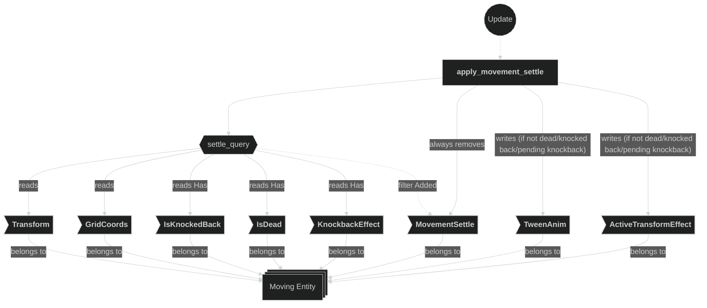
```mermaid
---
config:
  theme: dark
---

flowchart TD
classDef system-group stroke-dasharray: 5 5
classDef query stroke-dasharray: 3 3

update(("`Update`")):::system-group
apply_movement_settle["`**apply_movement_settle**`"]

update -.-> apply_movement_settle

settle_query{{"`settle_query`"}}:::query
apply_movement_settle ---> settle_query

moving_entity@{ shape: st-rect, label: "Moving Entity" }

me_transform>"`**Transform**`"] --> |belongs to| moving_entity
me_grid_coords>"`**GridCoords**`"] --> |belongs to| moving_entity
me_is_knocked>"`**IsKnockedBack**`"] --> |belongs to| moving_entity
me_is_dead>"`**IsDead**`"] --> |belongs to| moving_entity
me_knockback_effect>"`**KnockbackEffect**`"] --> |belongs to| moving_entity
me_settle>"`**MovementSettle**`"] --> |belongs to| moving_entity
me_tween>"`**TweenAnim**`"] --> |belongs to| moving_entity
me_active>"`**ActiveTransformEffect**`"] --> |belongs to| moving_entity

settle_query ---> |reads| me_transform
settle_query ---> |reads| me_grid_coords
settle_query ---> |reads Has| me_is_knocked
settle_query ---> |reads Has| me_is_dead
settle_query ---> |reads Has| me_knockback_effect
settle_query -..-> |filter Added| me_settle
apply_movement_settle ---> |"writes (if not dead/knocked back/pending knockback)"| me_tween
apply_movement_settle ---> |"writes (if not dead/knocked back/pending knockback)"| me_active
apply_movement_settle ---> |always removes| me_settle
```

### Sync Resting Translation

Used in the following systems:
- **sync_resting_translation**: reads `GridCoords`, writes `RestingTranslation`, on `TranslateEffectTarget` entities whose `GridCoords` changed; runs before `apply_bounce_effect` and `apply_wave_effect` so their bounce origin is never stale

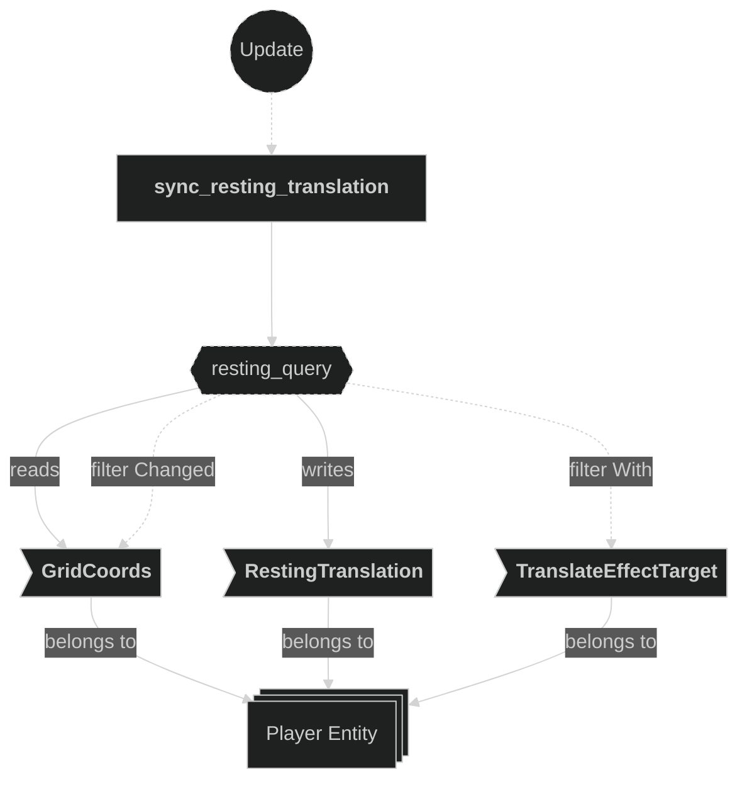
```mermaid
---
config:
  theme: dark
---

flowchart TD
classDef system-group stroke-dasharray: 5 5
classDef query stroke-dasharray: 3 3

update(("`Update`")):::system-group
sync_resting_translation["`**sync_resting_translation**`"]

update -.-> sync_resting_translation

resting_query{{"`resting_query`"}}:::query
sync_resting_translation ---> resting_query

player_entity@{ shape: st-rect, label: "Player Entity" }

pe_coords>"`**GridCoords**`"] --> |belongs to| player_entity
pe_resting>"`**RestingTranslation**`"] --> |belongs to| player_entity
pe_marker>"`**TranslateEffectTarget**`"] --> |belongs to| player_entity

resting_query ---> |reads| pe_coords
resting_query -..-> |filter Changed| pe_coords
resting_query -..-> |filter With| pe_marker
resting_query ---> |writes| pe_resting
```

### Query WaveSource + BounceEffect entities (wave effect)

Used in the following systems:
- **apply_wave_effect**: detects beam entities whose `GridCoords` changed and that carry both `WaveSource` and `BounceEffect`, so it can propagate a bounce to the tile below

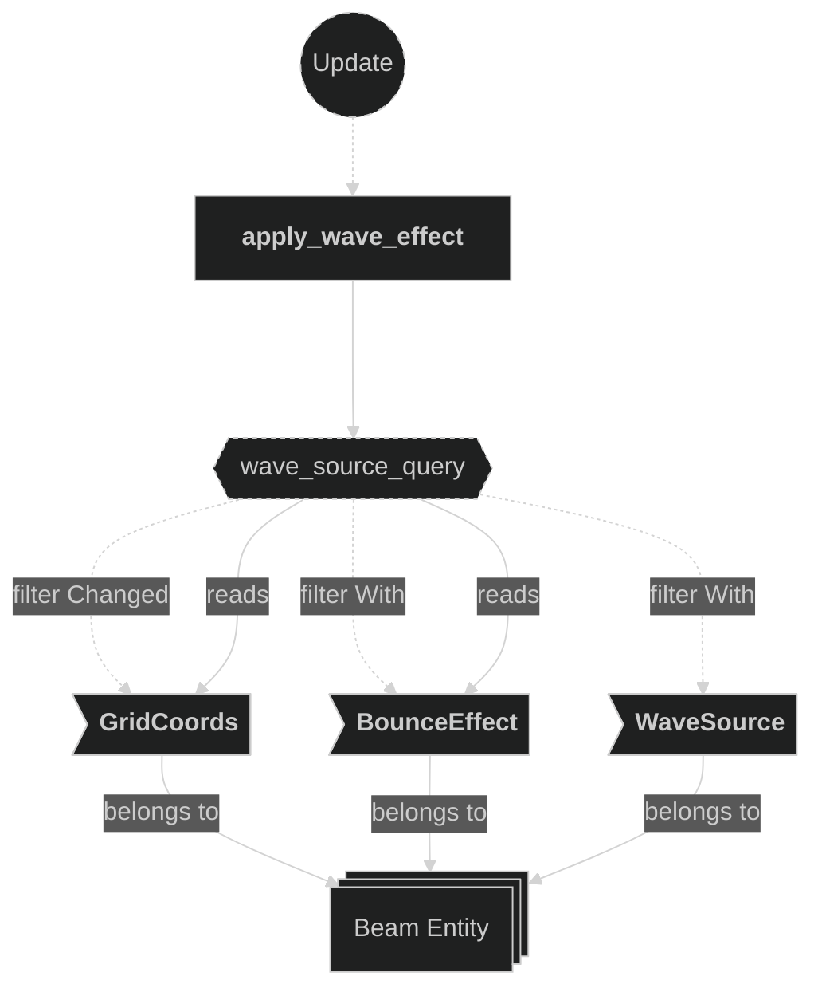
```mermaid
---
config:
  theme: dark
---

flowchart TD
classDef system-group stroke-dasharray: 5 5
classDef query stroke-dasharray: 3 3

update(("`Update`")):::system-group
apply_wave_effect["`**apply_wave_effect**`"]

update -.-> apply_wave_effect

bounce_query{{"`wave_source_query`"}}:::query
apply_wave_effect ---> bounce_query

beam_entity@{ shape: st-rect, label: "Beam Entity" }

be_grid_coords>"`**GridCoords**`"] --> |belongs to| beam_entity
be_bounce>"`**BounceEffect**`"] --> |belongs to| beam_entity
be_wave_source>"`**WaveSource**`"] --> |belongs to| beam_entity

bounce_query -..-> |filter Changed| be_grid_coords
bounce_query -..-> |filter With| be_bounce
bounce_query -..-> |filter With| be_wave_source
bounce_query ---> |reads| be_grid_coords
bounce_query ---> |reads| be_bounce
```

### Query WaveEffectTarget entities and write commands (wave effect)

Used in the following systems:
- **apply_wave_effect**: looks up the `WaveEffectTarget` entity at the source's current grid position via `MapInfo::claimed_entities`, reads its `Transform` and optional `RestingTranslation` as the bounce origin, and inserts a bounce `TweenAnim` directly on it (no `BounceEffectTarget` indirection, and no `ActiveTransformEffect` tag, since no completion handler needs to identify a wave bounce)

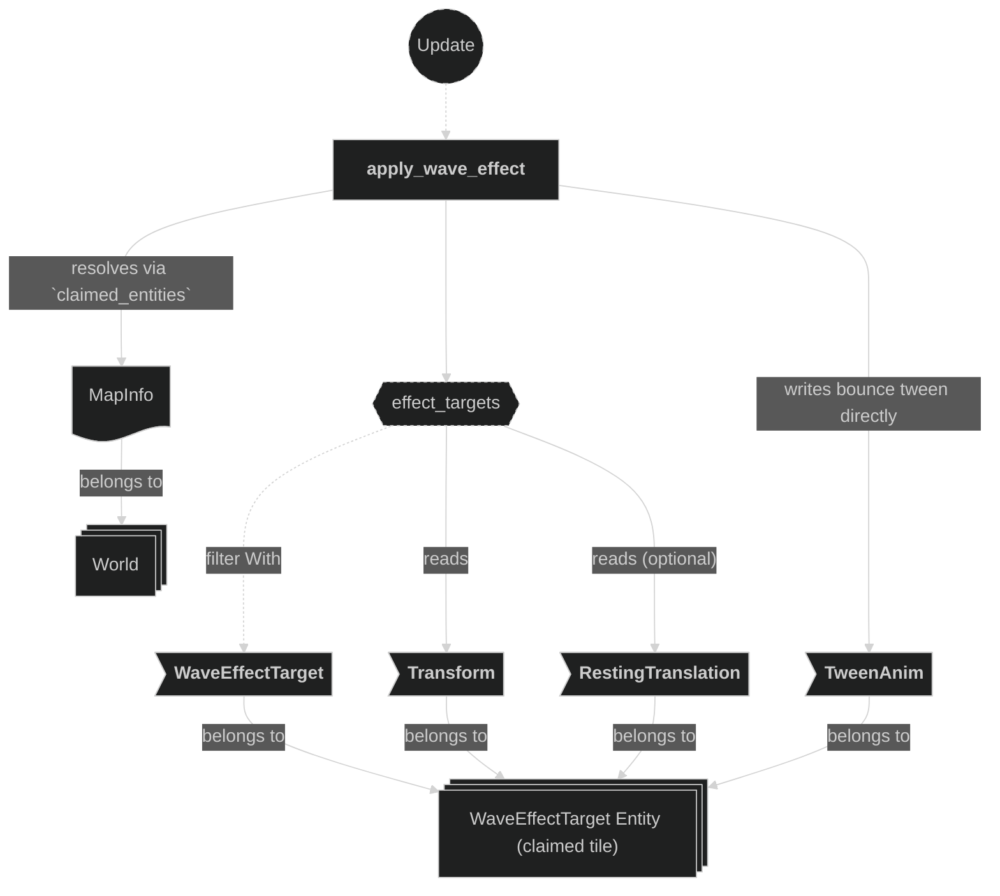
```mermaid
---
config:
  theme: dark
---

flowchart TD
classDef system-group stroke-dasharray: 5 5
classDef query stroke-dasharray: 3 3

update(("`Update`")):::system-group
apply_wave_effect["`**apply_wave_effect**`"]

update -.-> apply_wave_effect

wave_query{{"`effect_targets`"}}:::query
apply_wave_effect ---> wave_query

wave_entity@{ shape: st-rect, label: "WaveEffectTarget Entity (claimed tile)" }

we_marker>"`**WaveEffectTarget**`"] --> |belongs to| wave_entity
we_transform>"`**Transform**`"] --> |belongs to| wave_entity
we_resting>"`**RestingTranslation**`"] --> |belongs to| wave_entity
we_tween>"`**TweenAnim**`"] --> |belongs to| wave_entity

wave_query -..-> |filter With| we_marker
wave_query ---> |reads| we_transform
wave_query ---> |"reads (optional)"| we_resting
apply_wave_effect ---> |writes bounce tween directly| we_tween

world@{ shape: st-rect, label: "World" }
map_info_res@{ shape: doc, label: "MapInfo" }
map_info_res --> |belongs to| world
apply_wave_effect ---> |resolves via `claimed_entities`| map_info_res
```

### Query BounceEffectTarget entities (bounce effect)

Used in the following systems:
- **apply_bounce_effect**: detects newly added `BounceEffectTarget` markers, reads `Transform` and optional `RestingTranslation`, plays the bounce tween, tags `ActiveTransformEffect(Bounce)`, and removes the marker

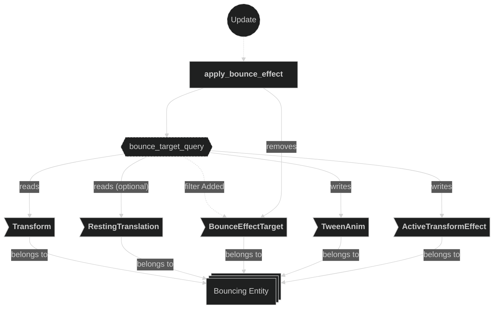
```mermaid
---
config:
  theme: dark
---

flowchart TD
classDef system-group stroke-dasharray: 5 5
classDef query stroke-dasharray: 3 3

update(("`Update`")):::system-group
apply_bounce_effect["`**apply_bounce_effect**`"]

update -.-> apply_bounce_effect

bounce_target_query{{"`bounce_target_query`"}}:::query
apply_bounce_effect ---> bounce_target_query

bounce_entity@{ shape: st-rect, label: "Bouncing Entity" }

be_transform>"`**Transform**`"] --> |belongs to| bounce_entity
be_resting>"`**RestingTranslation**`"] --> |belongs to| bounce_entity
be_target>"`**BounceEffectTarget**`"] --> |belongs to| bounce_entity
be_tween>"`**TweenAnim**`"] --> |belongs to| bounce_entity
be_active>"`**ActiveTransformEffect**`"] --> |belongs to| bounce_entity

bounce_target_query ---> |reads| be_transform
bounce_target_query ---> |"reads (optional)"| be_resting
bounce_target_query -..-> |filter Added| be_target
bounce_target_query ---> |writes| be_tween
bounce_target_query ---> |writes| be_active
apply_bounce_effect ---> |removes| be_target
```

### Query DamageEffectTarget entities (damage effect)

Used in the following systems:
- **apply_damage_effect**: detects entities whose `Health` has changed and that carry `DamageEffectTarget`, then plays a color-flash tween on the first child sprite

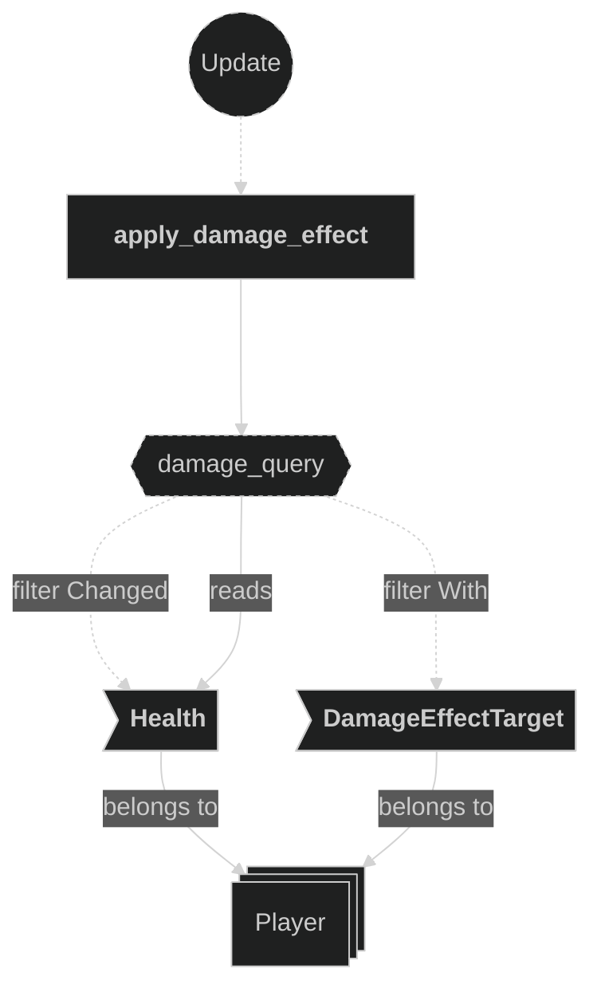
```mermaid
---
config:
  theme: dark
---

flowchart TD
classDef system-group stroke-dasharray: 5 5
classDef query stroke-dasharray: 3 3

update(("`Update`")):::system-group
apply_damage_effect["`**apply_damage_effect**`"]

update -.-> apply_damage_effect

damage_query{{"`damage_query`"}}:::query
apply_damage_effect ---> damage_query

player_entity@{ shape: st-rect, label: "Player" }

pe_health>"`**Health**`"] --> |belongs to| player_entity
pe_marker>"`**DamageEffectTarget**`"] --> |belongs to| player_entity

damage_query -..-> |filter Changed| pe_health
damage_query -..-> |filter With| pe_marker
damage_query ---> |reads| pe_health
```

### Query Children hierarchy (damage effect)

Used in the following systems:
- **apply_damage_effect**: walks descendants to find the first child entity carrying a `Sprite` on which to play the color-flash tween

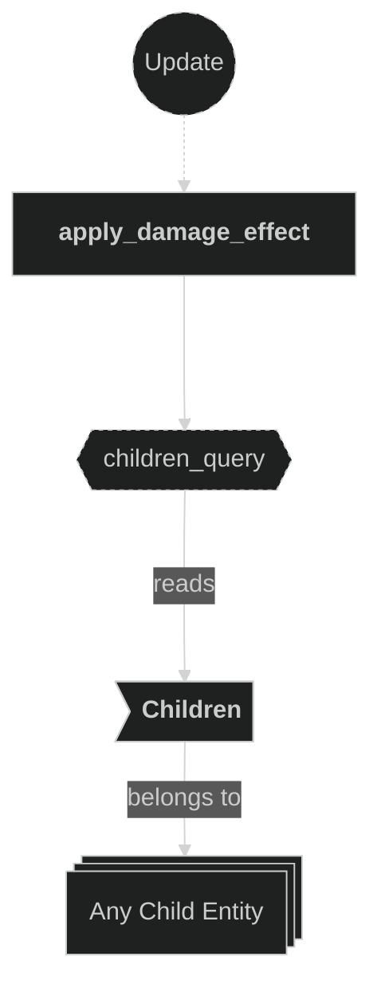
```mermaid
---
config:
  theme: dark
---

flowchart TD
classDef system-group stroke-dasharray: 5 5
classDef query stroke-dasharray: 3 3

update(("`Update`")):::system-group
apply_damage_effect["`**apply_damage_effect**`"]

update -.-> apply_damage_effect

children_query{{"`children_query`"}}:::query
apply_damage_effect ---> children_query

child_entity@{ shape: st-rect, label: "Any Child Entity" }

ch_children>"`**Children**`"] --> |belongs to| child_entity

children_query ---> |reads| ch_children
```

### Query child Sprite (damage effect)

Used in the following systems:
- **apply_damage_effect**: mutably accesses the `Sprite` on the first child entity to insert the red color-flash `TweenAnim`

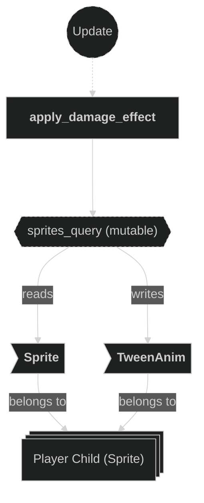
```mermaid
---
config:
  theme: dark
---

flowchart TD
classDef system-group stroke-dasharray: 5 5
classDef query stroke-dasharray: 3 3

update(("`Update`")):::system-group
apply_damage_effect["`**apply_damage_effect**`"]

update -.-> apply_damage_effect

sprites_query{{"`sprites_query (mutable)`"}}:::query
apply_damage_effect ---> sprites_query

child_entity@{ shape: st-rect, label: "Player Child (Sprite)" }

ce_sprite>"`**Sprite**`"] --> |belongs to| child_entity
ce_tween>"`**TweenAnim**`"] --> |belongs to| child_entity

sprites_query ---> |reads| ce_sprite
sprites_query ---> |writes| ce_tween
```

### Read DamageableDied messages

Used in the following systems:
- **apply_death_effect**: triggers the death animation sequence on the dying entity, matched against a query filtered `Without<IsDead>` so a duplicate death message is a no-op

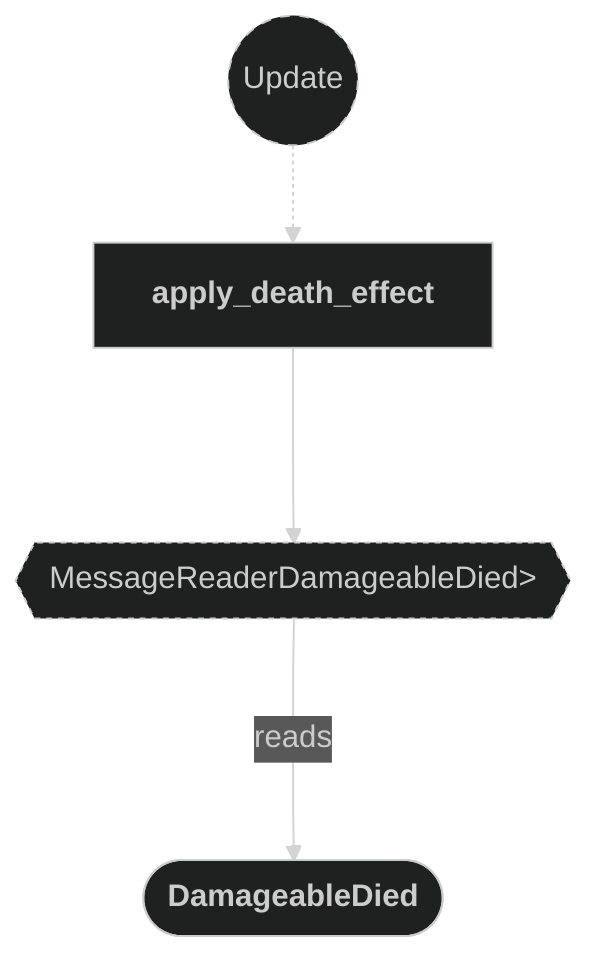
```mermaid
---
config:
  theme: dark
---

flowchart TD
classDef system-group stroke-dasharray: 5 5
classDef reader stroke-dasharray: 3 3

update(("`Update`")):::system-group
apply_death_effect["`**apply_death_effect**`"]

update -.-> apply_death_effect

message_reader{{"MessageReaderDamageableDied#62;"}}:::reader
apply_death_effect ---> message_reader

damageable_died_message(["`**DamageableDied**`"])

message_reader ---> |reads| damageable_died_message
```

### Query knockback state (apply_death_effect) and write commands

Used in the following systems:
- **apply_death_effect**: reads `Has<IsKnockedBack>` on the dying entity and a separate `Query<(), With<KnockbackEffect>>` to decide whether to defer the bounce; always inserts `BounceEffect` + `IsDead`, then inserts either `PendingDeathBounce` or `BounceEffectTarget`

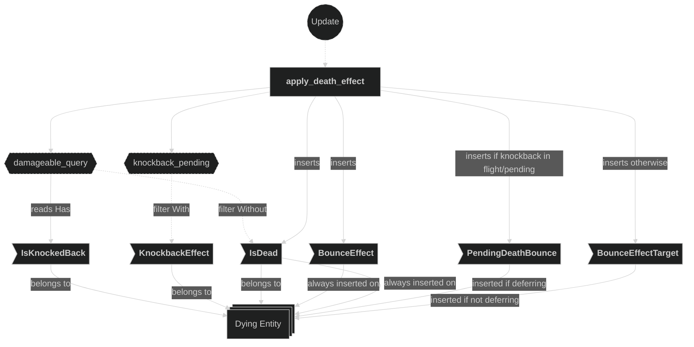
```mermaid
---
config:
  theme: dark
---

flowchart TD
classDef system-group stroke-dasharray: 5 5
classDef query stroke-dasharray: 3 3

update(("`Update`")):::system-group
apply_death_effect["`**apply_death_effect**`"]

update -.-> apply_death_effect

dying_query{{"`damageable_query`"}}:::query
pending_query{{"`knockback_pending`"}}:::query
apply_death_effect ---> dying_query
apply_death_effect ---> pending_query

dying_entity@{ shape: st-rect, label: "Dying Entity" }

de_is_knocked>"`**IsKnockedBack**`"] --> |belongs to| dying_entity
de_knockback_effect>"`**KnockbackEffect**`"] --> |belongs to| dying_entity
de_is_dead>"`**IsDead**`"] --> |belongs to| dying_entity
de_bounce_effect>"`**BounceEffect**`"]
de_pending>"`**PendingDeathBounce**`"]
de_bounce_target>"`**BounceEffectTarget**`"]

dying_query ---> |reads Has| de_is_knocked
dying_query -..-> |filter Without| de_is_dead
pending_query -..-> |filter With| de_knockback_effect

de_bounce_effect --> |always inserted on| dying_entity
de_is_dead --> |always inserted on| dying_entity
de_pending --> |"inserted if deferring"| dying_entity
de_bounce_target --> |"inserted if not deferring"| dying_entity

apply_death_effect ---> |inserts| de_bounce_effect
apply_death_effect ---> |inserts| de_is_dead
apply_death_effect ---> |inserts if knockback in flight/pending| de_pending
apply_death_effect ---> |"inserts otherwise"| de_bounce_target
```

### Query PendingDeathBounce entities (start_deferred_death_bounce)

Used in the following systems:
- **start_deferred_death_bounce**: promotes any `PendingDeathBounce` + `BounceEffect` entity without `IsKnockedBack`/`KnockbackEffect` to `BounceEffectTarget`, removing `PendingDeathBounce`

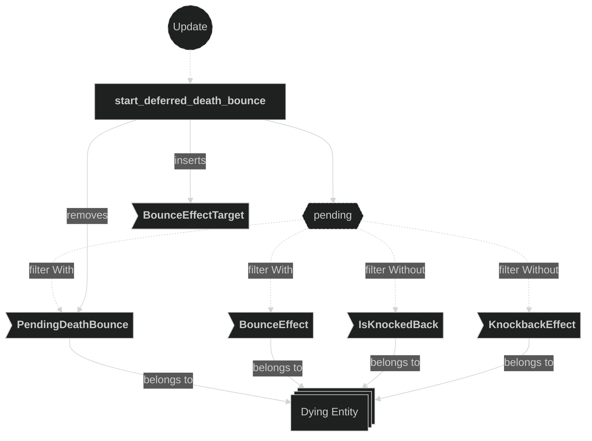
```mermaid
---
config:
  theme: dark
---

flowchart TD
classDef system-group stroke-dasharray: 5 5
classDef query stroke-dasharray: 3 3

update(("`Update`")):::system-group
start_deferred_death_bounce["`**start_deferred_death_bounce**`"]

update -.-> start_deferred_death_bounce

pending_query{{"`pending`"}}:::query
start_deferred_death_bounce ---> pending_query

dying_entity@{ shape: st-rect, label: "Dying Entity" }

de_pending>"`**PendingDeathBounce**`"] --> |belongs to| dying_entity
de_bounce_effect>"`**BounceEffect**`"] --> |belongs to| dying_entity
de_is_knocked>"`**IsKnockedBack**`"] --> |belongs to| dying_entity
de_knockback_effect>"`**KnockbackEffect**`"] --> |belongs to| dying_entity
de_bounce_target>"`**BounceEffectTarget**`"]

pending_query -..-> |filter With| de_pending
pending_query -..-> |filter With| de_bounce_effect
pending_query -..-> |filter Without| de_is_knocked
pending_query -..-> |filter Without| de_knockback_effect

start_deferred_death_bounce ---> |inserts| de_bounce_target
start_deferred_death_bounce ---> |removes| de_pending
```

### Read AnimCompletedEvent (death effect)

Used in the following systems:
- **on_death_effect_completed**: reads tween completion events, then confirms via `ActiveTransformEffect == Bounce` that the completed tween was the death bounce before hiding the entity

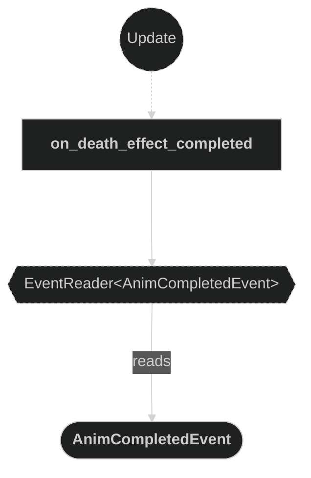
```mermaid
---
config:
  theme: dark
---

flowchart TD
classDef system-group stroke-dasharray: 5 5
classDef reader stroke-dasharray: 3 3

update(("`Update`")):::system-group
on_death_effect_completed["`**on_death_effect_completed**`"]

update -.-> on_death_effect_completed

event_reader{{"EventReader#60;AnimCompletedEvent#62;"}}:::reader
on_death_effect_completed ---> event_reader

anim_completed_event(["`**AnimCompletedEvent**`"])

event_reader ---> |reads| anim_completed_event
```

### Query IsDead entities (death completed)

Used in the following systems:
- **on_death_effect_completed**: checks whether the entity whose animation completed carries `IsDead` + `BounceEffect`, then reads `ActiveTransformEffect` to confirm the completed tween belongs to the death bounce, before hiding it

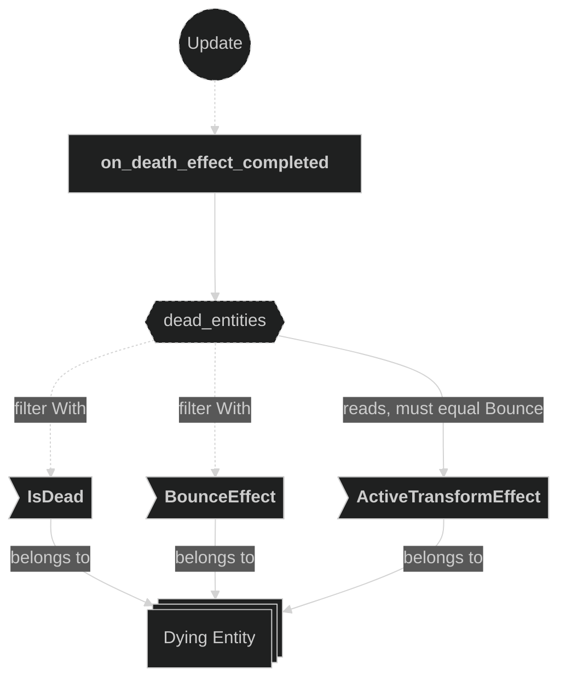
```mermaid
---
config:
  theme: dark
---

flowchart TD
classDef system-group stroke-dasharray: 5 5
classDef query stroke-dasharray: 3 3

update(("`Update`")):::system-group
on_death_effect_completed["`**on_death_effect_completed**`"]

update -.-> on_death_effect_completed

dead_query{{"`dead_entities`"}}:::query
on_death_effect_completed ---> dead_query

dead_entity@{ shape: st-rect, label: "Dying Entity" }

de_is_dead>"`**IsDead**`"] --> |belongs to| dead_entity
de_bounce>"`**BounceEffect**`"] --> |belongs to| dead_entity
de_active>"`**ActiveTransformEffect**`"] --> |belongs to| dead_entity

dead_query -..-> |filter With| de_is_dead
dead_query -..-> |filter With| de_bounce
dead_query ---> |reads, must equal Bounce| de_active
```

### Write commands (on_death_effect_completed)

Used in the following systems:
- **on_death_effect_completed**: hides the entity and removes its `BounceEffect` + `ActiveTransformEffect` after its death bounce animation has completed (the entity survives for the round reset)

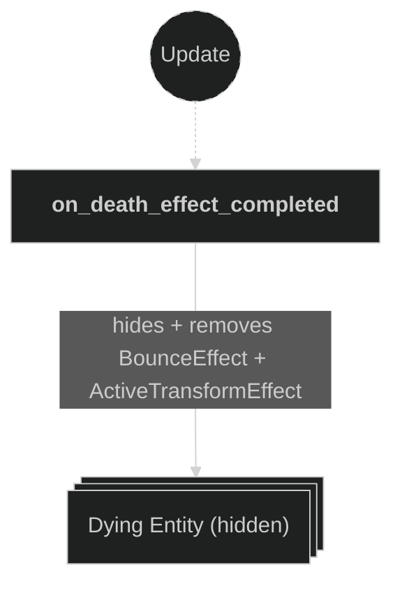
```mermaid
---
config:
  theme: dark
---

flowchart TD
classDef system-group stroke-dasharray: 5 5

update(("`Update`")):::system-group
on_death_effect_completed["`**on_death_effect_completed**`"]

update -.-> on_death_effect_completed

dead_entity@{ shape: st-rect, label: "Dying Entity (hidden)" }

on_death_effect_completed ---> |hides + removes BounceEffect + ActiveTransformEffect| dead_entity
```

### Read AnimCompletedEvent and query IsKnockedBack (on_knockback_tween_completed)

Used in the following systems:
- **on_knockback_tween_completed**: reads tween completion events, then confirms via `ActiveTransformEffect == Knockback` before clearing only `ActiveTransformEffect` — `IsKnockedBack` itself is timer-driven and is never removed here (see `tick_knockback_lock`)

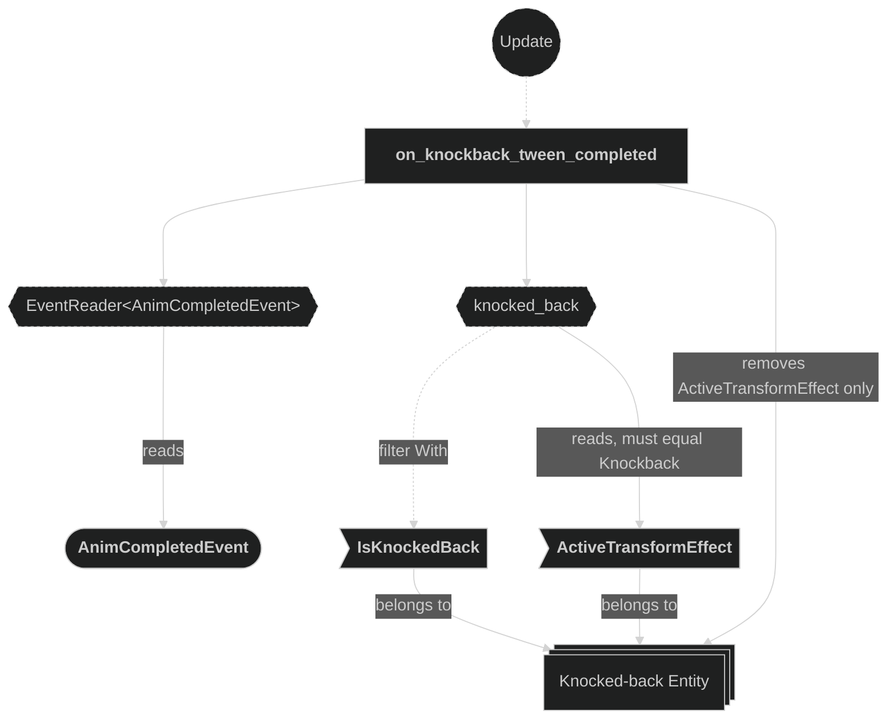
```mermaid
---
config:
  theme: dark
---

flowchart TD
classDef system-group stroke-dasharray: 5 5
classDef reader stroke-dasharray: 3 3
classDef query stroke-dasharray: 3 3

update(("`Update`")):::system-group
on_knockback_tween_completed["`**on_knockback_tween_completed**`"]

update -.-> on_knockback_tween_completed

event_reader{{"EventReader#60;AnimCompletedEvent#62;"}}:::reader
on_knockback_tween_completed ---> event_reader

anim_completed_event(["`**AnimCompletedEvent**`"])
event_reader ---> |reads| anim_completed_event

knocked_query{{"`knocked_back`"}}:::query
on_knockback_tween_completed ---> knocked_query

knocked_entity@{ shape: st-rect, label: "Knocked-back Entity" }

ke_is_knocked>"`**IsKnockedBack**`"] --> |belongs to| knocked_entity
ke_active>"`**ActiveTransformEffect**`"] --> |belongs to| knocked_entity

knocked_query -..-> |filter With| ke_is_knocked
knocked_query ---> |reads, must equal Knockback| ke_active

on_knockback_tween_completed ---> |removes ActiveTransformEffect only| knocked_entity
```

### Query IsKnockedBack entities and tick timer (tick_knockback_lock)

Used in the following systems:
- **tick_knockback_lock**: reads `Res<Time>`; ticks every `IsKnockedBack` entity's timer and removes `IsKnockedBack` once it finishes — the sole removal path during normal play, with no ordering dependency on any tween or completion event

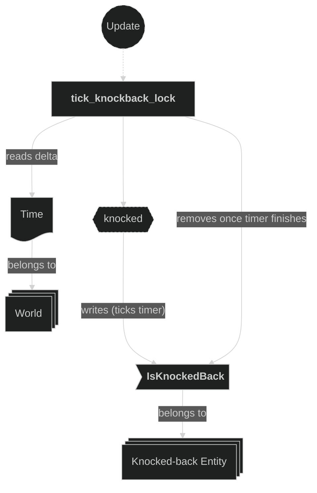
```mermaid
---
config:
  theme: dark
---

flowchart TD
classDef system-group stroke-dasharray: 5 5
classDef query stroke-dasharray: 3 3

update(("`Update`")):::system-group
tick_knockback_lock["`**tick_knockback_lock**`"]

update -.-> tick_knockback_lock

knocked_query{{"`knocked`"}}:::query
tick_knockback_lock ---> knocked_query

knocked_entity@{ shape: st-rect, label: "Knocked-back Entity" }

ke_is_knocked>"`**IsKnockedBack**`"] --> |belongs to| knocked_entity

knocked_query ---> |"writes (ticks timer)"| ke_is_knocked
tick_knockback_lock ---> |"removes once timer finishes"| ke_is_knocked

world@{ shape: st-rect, label: "World" }
time_res@{ shape: doc, label: "Time" }
time_res --> |belongs to| world

tick_knockback_lock ---> |reads delta| time_res
```

### ActiveTransformEffect component lifecycle

`ActiveTransformEffect(TransformEffectKind)` (`src/components/effects.rs`) tags which effect currently owns an entity's `Transform` `TweenAnim` slot. In practice this arbitration only matters for players, the only entities with more than one system competing for the slot. Its full lifecycle:
- **Inserted** by `apply_knockback` (`Knockback`), `apply_translate_effect` (`Translate`), `apply_movement_settle` (`Settle`), and `apply_bounce_effect` (`Bounce`) — each only when it also writes the competing `TweenAnim`, so the tag and the tween it identifies are always set together. `apply_bounce_effect` fires on `Added<BounceEffectTarget>` regardless of entity kind, so a claimed tile bounced by the Animations plugin's tile-claim bounce (`animate_claimed_tile`) also receives `ActiveTransformEffect(Bounce)` — harmlessly, since nothing ever reads or removes it from a tile.
- **Read** by `on_death_effect_completed` and `on_knockback_tween_completed`, each on every `AnimCompletedEvent`, to confirm the completed tween belongs to their own effect (`Bounce` / `Knockback` respectively) before acting.
- **Removed** by `on_death_effect_completed` (alongside `BounceEffect`, once confirmed `Bounce`), by `on_knockback_tween_completed` (alone, once confirmed `Knockback` — it no longer touches `IsKnockedBack`, see the `IsKnockedBack` lifecycle below), and by `reset_round` (Round plugin) unconditionally on every player round reset.
- Not removed on Settle/Translate completion, or on a tile's tile-claim bounce — there is no completion handler for those cases, so the tag simply persists, showing the most recent effect, until a later transform effect overwrites it (players) or indefinitely (tiles, which never receive a competing effect).

```mermaid
---
config:
  theme: dark
---

flowchart TD
classDef system-group stroke-dasharray: 5 5

update(("`Update`")):::system-group
apply_knockback["`**apply_knockback**`"]
apply_translate_effect["`**apply_translate_effect**`"]
apply_movement_settle["`**apply_movement_settle**`"]
apply_bounce_effect["`**apply_bounce_effect**`"]
on_death_effect_completed["`**on_death_effect_completed**`"]
on_knockback_tween_completed["`**on_knockback_tween_completed**`"]
reset_round["`**reset_round** (Round)`"]

update -.-> apply_knockback
update -.-> apply_translate_effect
update -.-> apply_movement_settle
update -.-> apply_bounce_effect
update -.-> on_death_effect_completed
update -.-> on_knockback_tween_completed

player_entity@{ shape: st-rect, label: "Player Entity" }
tile_entity@{ shape: st-rect, label: "ClaimedTile Entity" }
active_component@{ shape: doc, label: "ActiveTransformEffect" }

apply_knockback ---> |writes Knockback| active_component
apply_translate_effect ---> |writes Translate| active_component
apply_movement_settle ---> |writes Settle| active_component
apply_bounce_effect ---> |writes Bounce| active_component
on_death_effect_completed ---> |"removes (if Bounce)"| active_component
on_knockback_tween_completed ---> |"removes (if Knockback)"| active_component
reset_round ---> |always removes| active_component
active_component --> |belongs to| player_entity
active_component --> |"also lands on (tile-claim bounce, never read)"| tile_entity
```

### IsKnockedBack component lifecycle

`IsKnockedBack(Timer)` (`src/components/effects.rs`) is the authoritative input lock for a knocked-back entity — `handle_characters_input` (Input plugin) and `apply_translate_effect` both filter it `Without`. It carries its own `Timer` and its lifecycle is fully decoupled from the visual knockback tween's completion: a `Transform`-channel tween can be silently replaced by another effect without firing a completion event for the discarded one, so tween-completion identity is not a sound basis for the lock's duration. Its full lifecycle:
- **Inserted** by `apply_knockback`, seeded with `Timer::new(config.effects.knockback_tween_ms, TimerMode::Once)` — the same duration as the slide tween it accompanies, though the two run independently from that point on.
- **Ticked and removed** by `tick_knockback_lock`, every frame, purely once its timer finishes — the sole removal path during normal play. `on_knockback_tween_completed` reads it (to confirm the tag match) but never removes it.
- **Removed** by `reset_round` (Round plugin) unconditionally on every player round reset, alongside `ActiveTransformEffect` and the other transient effect components.

```mermaid
---
config:
  theme: dark
---

flowchart TD
classDef system-group stroke-dasharray: 5 5

update(("`Update`")):::system-group

apply_knockback["`**apply_knockback**`"]
tick_knockback_lock["`**tick_knockback_lock**`"]
reset_round["`**reset_round** (Round)`"]

update -.-> apply_knockback
update -.-> tick_knockback_lock

player_entity@{ shape: st-rect, label: "Player Entity" }
is_knocked_back@{ shape: doc, label: "IsKnockedBack" }

apply_knockback ---> |"inserts, timer seeded from knockback_tween_ms"| is_knocked_back
tick_knockback_lock ---> |ticks timer every frame| is_knocked_back
tick_knockback_lock ---> |"removes once timer finishes"| is_knocked_back
reset_round ---> |always removes| is_knocked_back
is_knocked_back --> |belongs to| player_entity
```

### Query Beam entities (illumination)

Used in the following systems:
- **apply_illumination_effect**: reacts to `Changed<GridCoords>` on `Beam` entities to resolve the current tile and (re)start its illumination tween

```mermaid
---
config:
  theme: dark
---

flowchart TD
classDef system-group stroke-dasharray: 5 5
classDef query stroke-dasharray: 3 3

update(("`Update`")):::system-group
apply_illumination_effect["`**apply_illumination_effect**`"]

update -.-> apply_illumination_effect

beams_query{{"`beams`"}}:::query
apply_illumination_effect ---> beams_query

beam_entity@{ shape: st-rect, label: "Beam Entity" }

be_beam>"`**Beam**`"] --> |belongs to| beam_entity
be_grid_coords>"`**GridCoords**`"] --> |belongs to| beam_entity

beams_query -..-> |filter With| be_beam
beams_query -..-> |filter Changed| be_grid_coords
beams_query ---> |reads| be_grid_coords

world@{ shape: st-rect, label: "World" }
map_info_res@{ shape: doc, label: "MapInfo" }
map_info_res --> |belongs to| world
apply_illumination_effect ---> |resolves via `get_claimed_entity_by_position`| map_info_res
```

### Write commands (apply_illumination_effect)

Used in the following systems:
- **apply_illumination_effect**: reads the target tile's `Sprite` and `IlluminationEffectTarget`, despawns any existing `IlluminationDriver` for that tile, then spawns a new driver carrying `AnimTarget::component::<Sprite>(tile)` and the fade tween

```mermaid
---
config:
  theme: dark
---

flowchart TD
classDef system-group stroke-dasharray: 5 5
classDef query stroke-dasharray: 3 3

update(("`Update`")):::system-group
apply_illumination_effect["`**apply_illumination_effect**`"]

update -.-> apply_illumination_effect

tile_query{{"`tile_sprites`"}}:::query
driver_query{{"`drivers`"}}:::query
apply_illumination_effect ---> tile_query
apply_illumination_effect ---> driver_query

tile_entity@{ shape: st-rect, label: "ClaimedTile Entity" }
te_sprite>"`**Sprite**`"] --> |belongs to| tile_entity
te_marker>"`**IlluminationEffectTarget**`"] --> |belongs to| tile_entity

tile_query -..-> |filter With| te_marker
tile_query ---> |reads| te_sprite

driver_entity@{ shape: st-rect, label: "IlluminationDriver (existing)" }
de_driver>"`**IlluminationDriver**`"] --> |belongs to| driver_entity
driver_query ---> |reads .tile| de_driver
apply_illumination_effect ---> |despawns matching driver| driver_entity

new_driver_entity@{ shape: st-rect, label: "IlluminationDriver (spawned)" }
nd_driver>"`**IlluminationDriver**`"]
nd_anim_target>"`**AnimTarget#60;Sprite#62;**`"]
nd_tween>"`**TweenAnim**`"]

nd_driver --> |spawned on| new_driver_entity
nd_anim_target --> |spawned on| new_driver_entity
nd_tween --> |spawned on| new_driver_entity

apply_illumination_effect ---> |spawns entity with| nd_driver
apply_illumination_effect ---> |spawns entity with| nd_anim_target
apply_illumination_effect ---> |spawns entity with| nd_tween
```

### IlluminationDriver component lifecycle

`IlluminationDriver { tile: Entity }` (`src/components/effects.rs`) is a transient proxy entity whose `TweenAnim` is redirected at `tile`'s `Sprite` via `AnimTarget::component::<Sprite>(tile)`, rather than living on the tile itself — the tile entity's own `TweenAnim` slot is already occupied by the wave-bounce effect's `Transform` tween, and `bevy_tweening` allows only one `TweenAnim` per `(entity, component)` pair. Its full lifecycle:
- **Spawned** by `apply_illumination_effect` (this plugin), one per beam grid-step, carrying a fade-in → hold → fade-out `TweenAnim`.
- **Despawned pre-emptively** by `apply_illumination_effect` itself, for any existing driver already targeting the same tile, before spawning the replacement — a beam re-crossing a tile (or two beams sharing one) never leaves two competing tweens on it.
- **Despawned on completion** by `on_illumination_completed`, reading `AnimCompletedEvent`; no color reset needed, since the tween's own final keyframe is already `Color::WHITE`.
- **Despawned on round boundary** by `clear_illumination_drivers`, on `OnExit(RoundPhase::Playing)`; this path does force-reset the tile's `Sprite::color` to `Color::WHITE`, since a driver caught mid-flight has not reached the tween's white end keyframe.

```mermaid
---
config:
  theme: dark
---

flowchart TD
classDef system-group stroke-dasharray: 5 5

update(("`Update`")):::system-group
state_transition(("`OnExit(Playing)`")):::system-group

apply_illumination_effect["`**apply_illumination_effect**`"]
on_illumination_completed["`**on_illumination_completed**`"]
clear_illumination_drivers["`**clear_illumination_drivers**`"]

update -.-> apply_illumination_effect
update -.-> on_illumination_completed
state_transition -.-> clear_illumination_drivers

driver_entity@{ shape: st-rect, label: "IlluminationDriver" }
tile_entity@{ shape: st-rect, label: "ClaimedTile (Sprite)" }

apply_illumination_effect ---> |spawns, targeting| driver_entity
apply_illumination_effect ---> |despawns stale driver for same tile| driver_entity
apply_illumination_effect ---> |animates via AnimTarget| tile_entity
on_illumination_completed ---> |despawns on AnimCompletedEvent| driver_entity
clear_illumination_drivers ---> |force-resets to WHITE| tile_entity
clear_illumination_drivers ---> |despawns| driver_entity
```
