# Effects Plugin

Contains systems responsible for all visual effects applied to game entities: smooth translation tweens for moving entities, knockback and death-bounce animations for players, bounce and wave animations for beams and claimed tiles, color-flash feedback when a player takes damage, a beam glow telegraph that crossfades each tile a beam crosses to a lit copy of its own colors (with a weaker glow on the four orthogonal neighbors and on the tile two steps ahead, and a matching glow on the floor under each of those tiles), and a scale punch that briefly enlarges a sprite (a landed parry is the current source). Every player effect tween (translate, settle, knockback, death bounce, damage flash, scale punch) runs as a driver entity, and one resolver decides which effect owns each animated channel. Claimed tiles keep direct `TweenAnim` inserts for their wave and claim bounces.

## Transform effect ownership

All player root-translation effects (Translate, Settle, Knockback, DeathBounce) are requests (`EffectRequest`) that `resolve_effect_requests` turns into driver entities. The resolver is the only writer of a player's position tween. It follows this policy table. The rows are the incoming effect. The columns are the effect that runs now on the `RootTranslation` channel.

| Incoming / current | none | Translate or Settle | Knockback | DeathBounce |
|---|---|---|---|---|
| Translate or Settle | Start | Replace | Queue | Drop |
| Knockback | Start | Replace | Replace | Drop |
| DeathBounce | Start | Replace | Queue | Drop |

- `Start`: spawn a driver.
- `Replace`: despawn the running driver and spawn the new one.
- `Queue`: keep the running driver and store the new effect as its `then`. It starts when the running driver completes.
- `Drop`: ignore the request.

`ScalePunch` and `DamageFlash` have their own channels and are always `Start` or `Replace`.

Fold rules (how the requests of one frame are combined):
- One queued slot per driver (`then`). `merge_queued` replaces the old queued effect when the new one has a higher or equal rank. A DeathBounce beats any queued movement. A later Translate or Settle replaces an earlier one.
- On `Replace`, the old `then` goes through `decide(old_then, Some(new_kind))`. `Queue` keeps it on the new driver. `Drop` discards it. So a DeathBounce queued behind a drag survives every drag step.
- Same frame: requests are grouped by (owner, channel) and stable-sorted by rank, lowest first. Requests of equal rank keep their write order, so the latest one wins. They are folded through `decide`, starting from the live (kind, then). At most one spawn happens per channel per frame. Examples: Translate and Knockback give Knockback. Knockback and DeathBounce give Knockback with DeathBounce queued. Settle and Translate give Settle.
- Owners with `IsDead`: every `RootTranslation` request except `DeathBounce` is dropped before the fold. Sprite flashes still play.
- Translate under Knockback is `Queue`, not `Drop`. The input lock timer and the knockback tween are not ordered, so input can unlock one frame before the slide ends. The queued Translate builds its tween from the current position when it starts. It does nothing visible if the player has not moved.

Death and knockback follow the same rules. A death bounce that arrives during a knockback is queued, so the slide finishes first. A lethal hit plays no slide, because `apply_knockback` skips it. `IsKnockedBack` is only the input lock and plays no part in these rules.

## Plugin workflow

- Update phase (ordered)
    - `sync_resting_translation` (before `apply_bounce_effect` and `apply_wave_effect`):
        - Reacts to `Changed<GridCoords>` on `TranslateEffectTarget` entities (players)
            - Writes `RestingTranslation` to the new grid position's world translation
    - `apply_knockback` (tagged `GameplaySet::Displacement`, before `apply_death_effect`):
        - Reacts to `Added<KnockbackEffect>`
            - Reads `Has<IsDead>`, `Option<&Health>`, and `MapInfo` to validate the target tile
            - If the target is on ground, the entity is not dead and its `Health.current` is above 0: mutates `GridCoords`, writes `EffectRequest { owner, kind: Knockback { ms } }`, and inserts `IsKnockedBack(Timer)` seeded from `config.effects.knockback_tween_ms`
            - Always removes `KnockbackEffect`
    - `apply_translate_effect` (`EffectsSet::Request`):
        - Reacts to `Changed<GridCoords>` on `TranslateEffectTarget` entities
            - Writes `EffectRequest { owner, kind: Translate { ms } }`, with `ms` from the entity's `MovementSlide` (or `config.timing.move_repeat_rate_ms` if absent)
    - `apply_movement_settle` (`EffectsSet::Request`):
        - Reads `MovementStopped` messages (written by the Input plugin)
            - Writes `EffectRequest { owner: entity, kind: Settle { ms } }` with `ms` from `config.timing.move_repeat_rate_ms`
    - `apply_death_effect` (`EffectsSet::Request`, after `apply_knockback`):
        - Reads `DamageableDied` messages, matched against entities with `DamageEffectTarget` and `Health` but without `IsDead`
            - Inserts `IsDead`
            - Writes `EffectRequest { owner, kind: DeathBounce { intensity: 8.0, bounce_count: 3, decay: 0.33 } }`
    - `apply_wave_effect`:
        - Reacts to `Changed<GridCoords>` on entities carrying both `WaveSource` and `BounceEffect` (in practice, beams that are not lane-suppressed — see the Beam plugin doc)
            - Resolves the source's `GridCoords` to a `WaveEffectTarget` claimed-tile entity via `MapInfo::claimed_entities`
            - Inserts a bounce `TweenAnim` directly on that tile
    - `apply_bounce_effect` (claim bounce, tiles only):
        - Reacts to `Added<BounceEffectTarget>`
            - Inserts a bounce `TweenAnim` directly on the tile and removes `BounceEffectTarget`
    - `apply_damage_effect` (`EffectsSet::Request`):
        - Reacts to `Changed<Health>` on `DamageEffectTarget` entities
            - Writes `EffectRequest { owner, kind: DamageFlash { sprite, ms } }` for the first child sprite entity
    - `spawn_sprite_lit_overlays`:
        - For every `GlowEffectTarget` tile that has a `Sprite` but no `LitOverlayLink`, spawns a persistent `SpriteLitOverlay` child (lit image, the tile's atlas, local z `SPRITE_LIT_OVERLAY_Z` = 0.5, `Visibility::Hidden`) and inserts the link on the tile; records the first tile's image as the `LitAtlases::tiles` source
    - `spawn_tilemap_lit_overlays` (Update, `run_if(resource_changed::<MapInfo>)`):
        - For every cell in `MapInfo::ground_entities` and `MapInfo::forbidden_areas` that has no `LitOverlayLink`, spawns a `TilemapLitOverlay` child of the cell's tilemap (ground lit image, one shared `TextureAtlasLayout`, the cell's `TileTextureIndex`, local z `TILEMAP_LIT_OVERLAY_Z` = 0.5, `Visibility::Hidden`) and inserts the link on the cell; records the tilemap's `TilemapTexture::Single` image as the `LitAtlases::ground` source
    - `build_lit_atlas`:
        - Rebuilds both the tile and the ground lit atlas images when the config lightness/chroma pair changes or an `AssetEvent<Image>` fires for the source image
    - `apply_glow_effect` (after `spawn_sprite_lit_overlays` and `spawn_tilemap_lit_overlays`):
        - Reacts to `Changed<GridCoords>` on `Beam` entities (every step of the beam's travel, not just its origin)
            - Pushes a peak-1.0 `GlowPulse` onto the overlay of the tile under the beam, and a `beam_glow_neighbor_peak` pulse (delayed by `beam_glow_neighbor_delay_ms`) onto each orthogonal neighbor and onto the tile two steps ahead along `Beam::direction` (skipped when the direction is zero); each pulse goes to both the claimed tile's overlay and the ground cell's overlay, even when the beam's own position has no claimed tile
    - `update_lit_overlays` (after `apply_glow_effect`):
        - Advances every overlay's pulses by the frame delta, sets the overlay alpha to the maximum pulse strength, prunes finished pulses, and toggles the overlay's visibility
    - `tick_knockback_lock` (no ordering dependency; placed by registration order):
        - Runs every frame against every entity carrying `IsKnockedBack`
            - Ticks the entity's timer; once it finishes, removes `IsKnockedBack`. This is the only removal path during normal play, and it is only the input lock
    - `trigger_parry_scale_effect` (`EffectsSet::Request`):
        - Reads `BeamParried` messages
            - Finds the parrier's sprite child with `sprite_child`; if found, writes `EffectRequest { owner: parrier, kind: ScalePunch { sprite, peak, secs } }`
    - `on_effect_completed` (`EffectsSet::Complete`):
        - Reads `AnimCompletedEvent`; despawns the `EffectDriver` entity whose tween finished and starts its queued `then` effect, if any
            - When the finished effect was a `DeathBounce`, inserts `Visibility::Hidden` on the owner
    - `resolve_effect_requests` (`EffectsSet::Resolve`, before `AnimationSystem::AnimationUpdate`):
        - Reads every `EffectRequest`, drops `RootTranslation` requests except `DeathBounce` on `IsDead` owners, groups by (owner, channel) and folds each group against the live driver with `fold_requests`
            - Spawns at most one new `EffectDriver` per owner and channel (despawning the old one), or updates the live driver's `then` in place
            - Builds root tweens when the driver starts, from the owner's `Transform`, `GridCoords`, `RestingTranslation` and `MapInfo`
- `PostUpdate` (after `AnimationSystemSet`)
    - `sync_lit_overlay_frames`: copies each visible overlay's atlas index from its tile's sprite (it queries only `SpriteLitOverlay`, so the `TilemapLitOverlay` floor overlays are never touched; floor cells do not animate)
- `OnExit(RoundPhase::Playing)`
    - `clear_glow`: empties every overlay's pulses, sets alpha to 0 and hides it, so a round boundary can't strand a lit tile
- `OnExit(RoundPhase::Outcome)`
    - `clear_root_effect_drivers`: despawns every `EffectDriver` on the `RootTranslation` channel, including any queued `then`, so no position tween or death bounce carries into the next round

## Plugin Systems

### Apply Knockback

Runs in `GameplaySet::Displacement`, so it sees a `KnockbackEffect` inserted in the same frame by `Movement` or `Damage`. It is ordered before `apply_death_effect`. Reacts to `Added<KnockbackEffect>`. This system is the gameplay half of knockback. It computes the target tile (`GridCoords + direction`) and checks it with `MapInfo::on_ground`. If the target is on ground, `Has<IsDead>` reads false and `Health.current` is above 0 (a lethal hit plays no slide), it does three things. It mutates `GridCoords` to the target. It writes a `Knockback { ms: config.effects.knockback_tween_ms }` `EffectRequest` (default `200`). It inserts `IsKnockedBack(Timer::new(config.effects.knockback_tween_ms, TimerMode::Once))`, the input lock (see the `IsKnockedBack` lifecycle section below). The tween itself is built later by the driver, not here. `KnockbackEffect` is removed unconditionally, even when dead, lethal or blocked, so the marker never strands.

### Apply Translate Effect

Runs in `EffectsSet::Request`. Reacts to `Changed<GridCoords>` on entities that carry `TranslateEffectTarget`. The query has no `Without` filters. The resolver decides what happens when a knockback or a death bounce is running. Writes a `Translate { ms }` `EffectRequest`, where `ms` is the entity's `MovementSlide` duration if present, otherwise `config.timing.move_repeat_rate_ms`. The driver builds a linear tween (`EaseFunction::Linear`, `create_movement_tween`) from the current `Transform` to the `GridCoords` position. This gives smooth movement for players without any coupling to the input or controller plugins.

### Apply Movement Settle

Runs in `EffectsSet::Request`. Reads `MovementStopped { entity }` messages. For each message, writes a `Settle { ms: config.timing.move_repeat_rate_ms }` `EffectRequest` with `owner` set to the message entity. The system has no query and no marker component, so nothing needs to be removed. It does not check `IsKnockedBack`, `IsDead` or `KnockbackEffect`. The resolver does this work: a Settle under a running Knockback is queued, and a Settle on a dead owner is dropped. The driver builds an ease-out tween (`EaseFunction::QuadraticOut`) toward the current `GridCoords` position.

### Sync Resting Translation

Reacts to `Changed<GridCoords>` on `TranslateEffectTarget` entities — only players carry this marker, since claimed tiles never move and never receive a `RestingTranslation` component at all. Writes `RestingTranslation` to the world translation of the new `GridCoords`. Ordered before `apply_bounce_effect` and `apply_wave_effect`, both of which read a `RestingTranslation` when present (falling back to `Transform::translation` for tiles, which have none) so a bounce origin is always the authoritative resting position rather than a `Transform` that may still be mid-tween.

### Apply Wave Effect

Reacts to `Changed<GridCoords>` on entities that carry both `WaveSource` and `BounceEffect`. `WaveSource` is inserted only on beams (see the Beam plugin doc), and only on the same condition as `BounceEffect` itself — a lane-suppressed beam gets neither, so it never triggers a wave, though it still triggers glow (`apply_glow_effect` is gated only on `With<Beam>`). Resolves the source's `GridCoords` to a claimed tile entity via `MapInfo::claimed_entities`, then reads that tile's `Transform` and optional `RestingTranslation` (falling back to `Transform::translation` if absent) as the bounce origin, and inserts a bounce `TweenAnim` (built by `create_bounce_tween`) directly on the tile. This causes the tile underneath the beam to "ripple" as the beam passes over it.

### Apply Bounce Effect

Reacts to `Added<BounceEffectTarget>`. This is the claim bounce for tiles only. Players do not use it, because their death bounce goes through the resolver. Reads the entity's `Transform` and optional `RestingTranslation` (falling back to `Transform::translation`) as the bounce origin, inserts a bounce `TweenAnim` directly on the tile, then removes `BounceEffectTarget` so the effect fires once per insertion. The Animations plugin inserts the marker when a tile is claimed. No tag is added to the tile.

### Apply Damage Effect

Reacts to `Changed<Health>` on entities that carry a `DamageEffectTarget` marker. Walks the entity's children to find the first child sprite entity and writes an `EffectRequest` with `EffectKind::DamageFlash { sprite, ms }` (`ms` is `config.effects.damage_flash_ms`, default `150`). The resolver then runs the red color-flash tween (`create_color_flash_tween`: `Sprite::color` to red over a quarter of `ms`, then back to white over `ms`). Runs in `EffectsSet::Request`. A second hit before the flash ends restarts it.

### Apply Death Effect

Runs in `EffectsSet::Request`, after `apply_knockback`. Reads `DamageableDied` messages, matched against a query filtered to entities with `DamageEffectTarget` and `Health` but without `IsDead` (so a duplicate death message on an already-dead entity is a no-op). For each message, inserts `IsDead` on the dying entity and writes a `DeathBounce { intensity: 8.0, bounce_count: 3, decay: 0.33 }` `EffectRequest`. The system does not check for a running knockback. The resolver queues the death bounce behind a knockback, so the slide finishes first. It has no `RoundPhase` gate, so it can still catch a `DamageableDied` message written on the last `Playing` frame, after the phase has changed to `Outcome`.

### Tick Knockback Lock

Runs every frame against every entity carrying `IsKnockedBack`, with no ordering dependency on any other system in this plugin. Ticks each entity's timer by `Res<Time>`'s delta, and once the timer finishes, removes `IsKnockedBack`. This releases the entity back to normal movement. The lock does not affect any driver.

### Spawn Sprite Lit Overlays

Runs every frame over `GlowEffectTarget` tiles that have a `Sprite` and no `LitOverlayLink`. For each, spawns one persistent child (`ChildOf(tile)`) carrying the `SpriteLitOverlay` marker, an empty `GlowPulses`, and a `Sprite` that uses the `LitAtlases::tiles` lit image handle and a clone of the tile's `TextureAtlas`, with a fully transparent color, a local `Transform` at z `SPRITE_LIT_OVERLAY_Z` (0.5, which must stay below 1.0, the spacing between tile rows), and `Visibility::Hidden`. Inserts `LitOverlayLink(overlay)` on the tile. Because the overlay is a child, it inherits the bounce and wave transforms of the tile. The first tile's `Sprite::image` becomes `LitAtlases::tiles.source`.

### Spawn Tilemap Lit Overlays

Runs when the `MapInfo` resource changed. For each entity in `MapInfo::ground_entities` and `MapInfo::forbidden_areas` without a `LitOverlayLink`, reads its `TilePos`, `TilemapId` and `TileTextureIndex`, and takes the image from the tilemap's `TilemapTexture::Single` (any other variant logs one warning and skips the cell). The first image becomes `LitAtlases::ground.source`. A single 12 by 12 `TextureAtlasLayout` (cell size from `MapInfo::tile_size`) is built once and stored in the resource. The overlay is a `ChildOf` the tilemap entity, with the `TilemapLitOverlay` marker, empty `GlowPulses`, a transparent `Sprite` using the ground lit image, the cell's atlas index, `Visibility::Hidden`, and a `Transform` at `GridCoords::to_world_pos` with z `TILEMAP_LIT_OVERLAY_Z` (0.5). The tilemap's own translation is only the tileset offset (zero for this map), so the world-space tile centre is also the tilemap-local position, the same assumption the `ClaimedTile` sprites rely on. Z of 0.5 sits above the floor and below the claimed tiles, because the layers are spaced 100 apart by `TiledMapLayerZOffset`.

### Build Lit Atlas

Runs every frame but only works when needed. For each of the tile and ground atlases (`LitAtlas::rebuild`), once `source` is known and the source image has loaded, it builds the lit image with `make_lit_image` whenever `built_with` differs from the current `(beam_glow_lightness, beam_glow_chroma)` pair, or an `AssetEvent<Image>` (modified or loaded) names the source image, which keeps RON tuning and `tiles.png` edits live. The result is stored with `Assets<Image>::insert` at the reserved lit handle id (an `Err` is logged). If the format is not `Rgba8UnormSrgb`/`Rgba8Unorm` or has no pixel data, it logs one warning and the overlay never shows.

`make_lit_image(&Image, lightness, chroma) -> Option<Image>` is a pure function: it clones the source (keeping sampler, format and usage), and for every pixel with non-zero alpha converts to `Oklcha`, applies `L += (1 - L) * lightness` and `C *= chroma`, converts back to `Srgba`, clamps the channels to 0..1 and restores the original alpha.

### Apply Glow Effect

Reacts to `Changed<GridCoords>` on `Beam` entities — every tile a beam crosses, not only its spawn position. For each beam, pushes a `GlowPulse` with peak `1.0` and no delay onto the overlay of the tile at the beam's position, and a pulse with peak `beam_glow_neighbor_peak` and delay `beam_glow_neighbor_delay_ms` onto each of the four orthogonal neighbors and onto the tile at `position + 2 * direction` (the lookahead, same peak and delay; skipped when `Beam::direction` is zero). Each position is resolved to the claimed tile (`MapInfo::get_claimed_entity_by_position`) and to the ground cell (`ground_entities`, else `forbidden_areas`), and the pulse goes onto the overlay linked from each; forbidden cells have no claimed tile but their floor still glows. A position with neither is skipped, but the neighbor pulses are still pushed when the beam's own position has none. The pulse timings come from `beam_glow_fade_in_ms` / `beam_glow_hold_ms` / `beam_glow_fade_out_ms`. There is no per-player tint: the effect is purely the lit crossfade.

### Update Lit Overlays

Runs every frame after `apply_glow_effect`. For each overlay with pulses (or one still visible), advances every pulse by `Time::delta_secs()` (virtual time, so hitstop slows it), computes each pulse's strength with `GlowPulse::alpha` (delay, then fade-in `QuadraticOut`, hold, fade-out `1 - QuadraticIn`; fades are clamped to at least 0.001 s; `None` means finished), prunes finished pulses, sets `Sprite::color` to white with the maximum strength as alpha, and sets the visibility to `Inherited` when the strength is above zero and `Hidden` otherwise. Both are written only when the value differs (`set_if_neq` for `Visibility`, a compare for the color), so idle values do not trigger change detection. Pulses never add up: a strong pulse fading below a weak one lets the weak one show again.

### Sync Lit Overlay Frames

Runs in `PostUpdate`, `.after(AnimationSystemSet)`. For each visible `SpriteLitOverlay` (the `TilemapLitOverlay` floor overlays are not queried, because floor cells do not animate), reads the tile through the overlay's `ChildOf` parent and copies its `TextureAtlas.index` to the overlay's atlas so the overlay matches the current flip-animation frame. The two `Sprite` queries are kept disjoint with `Without<SpriteLitOverlay>` on the tile side.

### Clear Glow

Runs on `OnExit(RoundPhase::Playing)`. Empties every overlay's `GlowPulses`, sets its sprite color alpha to 0 and sets it `Visibility::Hidden`.

### Trigger Parry Scale Effect

Runs in `EffectsSet::Request`. Reads `BeamParried` messages. For each one, it finds the parrier's sprite child with `sprite_child`. If a sprite child exists, it writes an `EffectRequest { owner: parrier, kind: ScalePunch { sprite, peak, secs } }`. The values come from `config.parry.scale_punch_peak` (default `1.3`) and `config.parry.scale_punch_secs` (default `0.25`, measured in hitstop-dilated time, per `assets/game_config.ron`). If the parrier has no sprite child, nothing is written. The request is written in the same frame as the message, so there is no marker and no frame delay. The resolver builds the tween with `create_scale_punch_tween`: a `TransformScaleLens` from the peak down to `Vec3::ONE` with `EaseFunction::CubicIn`. A second parry before the punch ends restarts it.

The scale punch is a generic effect. Any system can write a `ScalePunch` request for any sprite. The parry is only one source.

### Effect drivers and resolver

An effect driver is a carrier entity that runs one effect tween on an owner's channel. It carries `EffectDriver { kind, then }`, `DriverOf(owner)`, an `AnimTarget` pointing at the animated component, and the `TweenAnim`. The owner holds the matching `EffectDrivers` relationship target (`linked_spawn`, so despawning the owner despawns its drivers). The link does not use `ChildOf`, because `sprite_child` reads `Children::first()`.

Each driver owns one `EffectChannel`: `RootTranslation`, `SpriteScale` or `SpriteColor`. Two effects on the same sprite (a punch and a flash) run together, because they use different channels and different drivers. The channel of each kind:
- `RootTranslation`: `Translate`, `Settle`, `Knockback`, `DeathBounce`. The driver targets the owner `Transform`.
- `SpriteScale`: `ScalePunch`. The driver targets the sprite child `Transform`.
- `SpriteColor`: `DamageFlash`. The driver targets the sprite child `Sprite`.

Every write to a player's position tween goes through a driver. No other system inserts a `TweenAnim` on a player root. Tiles are the exception: `apply_wave_effect` and `apply_bounce_effect` insert `TweenAnim` directly on a claimed tile. A tile has one channel and every new bounce replaces the old one.

The three `EffectsSet` sets are chained inside `GameplaySet::Presentation`: `Request` (writers), `Complete`, `Resolve`. `Resolve` runs before `bevy_tweening::AnimationSystem::AnimationUpdate`. A sync point sits between `Complete` and `Resolve`, so the resolver sees drivers spawned by `on_effect_completed`.

`EffectRequest { owner, kind }` is a message internal to the effects plugin. It is registered in `effects::plugin` and declared in `src/plugins/effects.rs`, not in `messages.rs`.

Pure functions (unit-tested):
- `decide(incoming, current) -> Decision` (`Start`, `Replace`, `Queue`, `Drop`) implements the policy table in "Transform effect ownership" above. The sprite channels are always `Start` or `Replace`.
- `merge_queued(existing, incoming)` keeps one queued slot; a new item replaces the old one when its rank is higher or equal.
- `fold_requests(live, requests) -> ChannelPlan` stable-sorts the requests by rank, folds them through `decide` from the live (kind, then), and returns at most one spawn or one in-place `then` update. On `Replace`, the old `then` survives only if `decide(old_then, Some(new_kind))` is `Queue`.

Rank: Translate 0, Settle 1, Knockback 2, DeathBounce 3, sprite kinds 0.

Tween shapes (built in `start_effect` when the effect starts):
- `Translate`: linear, from the current `Transform` to the `GridCoords` position, over its `ms` (the `MovementSlide` duration).
- `Settle`: `QuadraticOut`, same start and end, over `config.timing.move_repeat_rate_ms`.
- `Knockback`: `QuadraticOut`, same start and end, over `config.effects.knockback_tween_ms`.
- `DeathBounce`: a bounce tween from `RestingTranslation` (or the current `Transform` if there is none).
- `ScalePunch`: `CubicIn` scale from the peak down to `Vec3::ONE`.
- `DamageFlash`: color to red over a quarter of `ms`, then back to white over `ms`.

### Resolver systems

`resolve_effect_requests` applies the drop rule for dead owners, groups the requests by (owner, channel), finds the live driver through `EffectDrivers`, and applies the plan. It despawns the old driver and calls `start_effect` for the new one, or updates `then` in place. `start_effect` spawns `(Name::new("Fx:<Kind>"), EffectDriver, DriverOf(owner), AnimTarget, TweenAnim)`. It builds the tween with the `RootTweenSources` system param: the owner `Transform`, `GridCoords`, `RestingTranslation` and the `MapInfo` resource. If the owner has none of the needed components, no driver is spawned.

`on_effect_completed` reads `AnimCompletedEvent`, despawns the finished driver, and starts its `then`. When the finished effect was a `DeathBounce`, it also inserts `Visibility::Hidden` on the owner. The owner stays alive and keeps `IsDead` until the round reset.

`clear_root_effect_drivers` runs on `OnExit(RoundPhase::Outcome)`. It despawns every driver on the `RootTranslation` channel, with its queued `then`. It does not need any order against `reset_round`. Sprite drivers are not cleared: despawning one halfway would leave the sprite red or scaled. In dev builds, `warn_duplicate_channel_drivers` logs a warning when an owner has two drivers on one channel.

### Tile effects and the resolver

Tiles do not use the resolver. The wave bounce and the claim bounce insert `TweenAnim` directly on the tile. Both animate the tile translation, start from `RestingTranslation`, and the latest one wins, which the single `TweenAnim` slot already gives.

Rule for new tile visuals: a tile must never get a second direct `TweenAnim` that animates a different value. An entity has one `TweenAnim` slot, so the next wave bounce would replace it. This is the same bug that commit `9770b6d` fixed for the player's punch and flash.

Use one of these instead:
- **A visual that lasts while a state is true** (for example an armed Landmine, an armed Barrier, a pending Contested Ground tile): a child overlay sprite on the tile, shown while the state holds, with its own animation or tween. This is the lit overlay pattern. The child has its own `TweenAnim` slot and moves with the tile.
- **A one-shot effect that competes with the bounce** (for example a Barrier hit, a regen pulse): move tiles onto the resolver. Add the `EffectKind` variants and a channel; `EffectRequest { owner, kind }` already works for any owner entity.

How an overlay splits between state and requests:
- **The overlay's existence and visibility come from state.** A system shows the overlay only while the state component is present (for example `LandmineArmed`), and re-reads it every frame. Do not start and stop it with requests: a missed stop (round reset, tile flip, despawn) would leave the marker stuck.
- **Animations on the overlay go through requests.** The owner is the tile and the target is the overlay sprite, the same way `ScalePunch` and `DamageFlash` target the player's sprite child. Use a channel for the overlay. This gives the replace, queue and drop rules, and `then` covers "play the hit flash, then go back to the armed loop". It needs two additions: looping tweens (they never send `AnimCompletedEvent`) and a way to stop a channel.
- **The beam glow stays separate.** `GlowPulses` keeps every pulse and shows the strongest one, while the resolver keeps one effect per channel, so a weak neighbor pulse would cut off a strong center pulse. The glow also pushes many pulses per beam step, which would mean many driver spawns.

Abilities in `DECKBUILDING.md` that will need this: Landmine (#17), Barrier (#33) and Bulwark (#34), Contested Ground (#15), and the regen pulse (§6 "Visuals"). Burst claims (Splitter, Chain Reaction, Full Draw, Ricochet, Juggernaut, Beachhead) may also want a small delay between bounces, like `GlowPulse.delay`.

## Components, Resources and Messages CRUD

### Query KnockbackEffect entities (knockback)

Used in the following systems:
- **apply_knockback**: reads `KnockbackEffect`, `Has<IsDead>`, and `Option<&Health>` on newly knocked-back entities; mutates `GridCoords`; removes `KnockbackEffect`

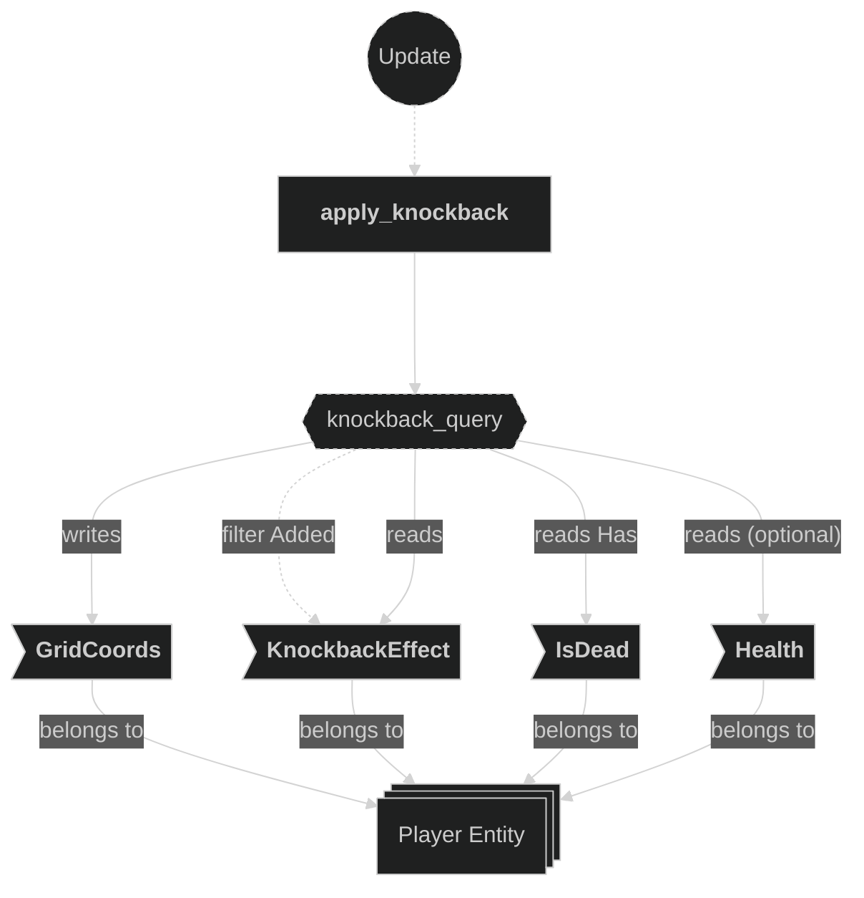
```mermaid
---
config:
  theme: dark
---

flowchart TD
classDef system-group stroke-dasharray: 5 5
classDef query stroke-dasharray: 3 3

update(("`Update`")):::system-group
apply_knockback["`**apply_knockback**`"]

update -.-> apply_knockback

knockback_query{{"`knockback_query`"}}:::query
apply_knockback ---> knockback_query

player_entity@{ shape: st-rect, label: "Player Entity" }

pe_coords>"`**GridCoords**`"] --> |belongs to| player_entity
pe_knockback>"`**KnockbackEffect**`"] --> |belongs to| player_entity
pe_is_dead>"`**IsDead**`"] --> |belongs to| player_entity
pe_health>"`**Health**`"] --> |belongs to| player_entity

knockback_query -..-> |filter Added| pe_knockback
knockback_query ---> |reads| pe_knockback
knockback_query ---> |reads Has| pe_is_dead
knockback_query ---> |"reads (optional)"| pe_health
knockback_query ---> |writes| pe_coords
```

### Read MapInfo resource (knockback)

Used in the following systems:
- **apply_knockback**: validates the target tile with `on_ground`

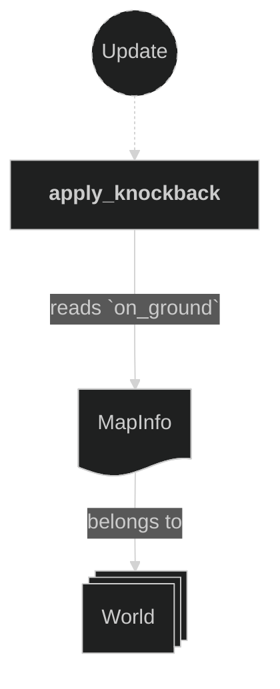
```mermaid
---
config:
  theme: dark
---

flowchart TD
classDef system-group stroke-dasharray: 5 5

update(("`Update`")):::system-group
apply_knockback["`**apply_knockback**`"]

update -.-> apply_knockback

world@{ shape: st-rect, label: "World" }
map_info_res@{ shape: doc, label: "MapInfo" }

map_info_res --> |belongs to| world

apply_knockback ---> |reads `on_ground`| map_info_res
```

### Write commands and EffectRequest (apply_knockback)

Used in the following systems:
- **apply_knockback**: when the target is valid, the entity is not dead and its health is above 0, writes a `Knockback` `EffectRequest` and inserts `IsKnockedBack`; always removes `KnockbackEffect`

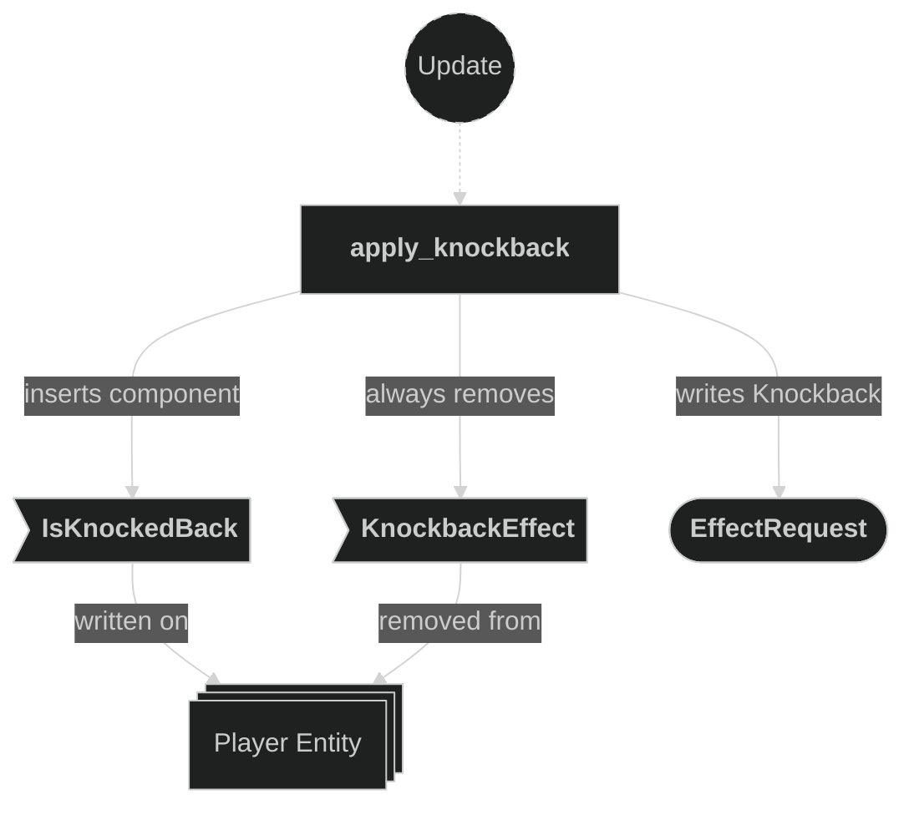
```mermaid
---
config:
  theme: dark
---

flowchart TD
classDef system-group stroke-dasharray: 5 5

update(("`Update`")):::system-group
apply_knockback["`**apply_knockback**`"]

update -.-> apply_knockback

player_entity@{ shape: st-rect, label: "Player Entity" }

pe_is_knocked>"`**IsKnockedBack**`"]
pe_knockback>"`**KnockbackEffect**`"]
effect_request(["`**EffectRequest**`"])

pe_is_knocked --> |written on| player_entity
pe_knockback --> |removed from| player_entity

apply_knockback ---> |writes Knockback| effect_request
apply_knockback ---> |inserts component| pe_is_knocked
apply_knockback ---> |always removes| pe_knockback
```

### Query TranslateEffectTarget entities

Used in the following systems:
- **apply_translate_effect**: reads the optional `MovementSlide` on entities whose `GridCoords` changed and that carry `TranslateEffectTarget`; writes a `Translate` `EffectRequest`

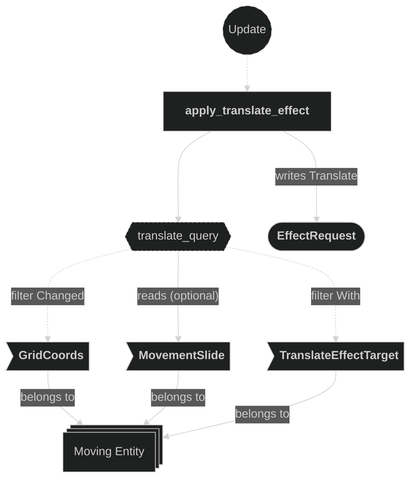
```mermaid
---
config:
  theme: dark
---

flowchart TD
classDef system-group stroke-dasharray: 5 5
classDef query stroke-dasharray: 3 3

update(("`Update`")):::system-group
apply_translate_effect["`**apply_translate_effect**`"]

update -.-> apply_translate_effect

translate_query{{"`translate_query`"}}:::query
apply_translate_effect ---> translate_query

moving_entity@{ shape: st-rect, label: "Moving Entity" }

me_grid_coords>"`**GridCoords**`"] --> |belongs to| moving_entity
me_slide>"`**MovementSlide**`"] --> |belongs to| moving_entity
me_marker>"`**TranslateEffectTarget**`"] --> |belongs to| moving_entity

translate_query -..-> |filter Changed| me_grid_coords
translate_query ---> |"reads (optional)"| me_slide
translate_query -..-> |filter With| me_marker

effect_request(["`**EffectRequest**`"])
apply_translate_effect ---> |writes Translate| effect_request
```

### Read MovementStopped messages

Used in the following systems:
- **apply_movement_settle**: reads `MovementStopped` messages from the Input plugin and writes a `Settle` `EffectRequest` for each one

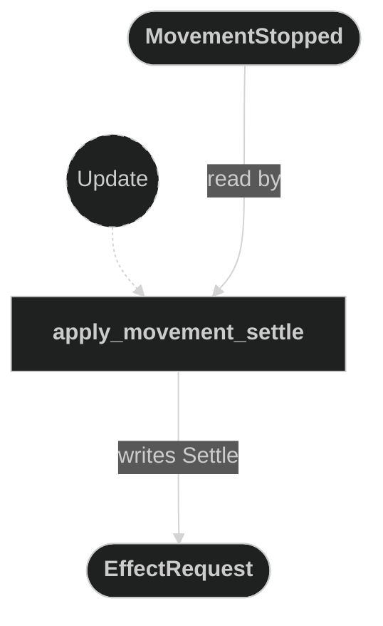
```mermaid
---
config:
  theme: dark
---

flowchart TD
classDef system-group stroke-dasharray: 5 5
classDef query stroke-dasharray: 3 3

update(("`Update`")):::system-group
apply_movement_settle["`**apply_movement_settle**`"]

update -.-> apply_movement_settle

movement_stopped_message(["`**MovementStopped**`"])
movement_stopped_message ---> |read by| apply_movement_settle

effect_request(["`**EffectRequest**`"])
apply_movement_settle ---> |writes Settle| effect_request
```

### Sync Resting Translation

Used in the following systems:
- **sync_resting_translation**: reads `GridCoords`, writes `RestingTranslation`, on `TranslateEffectTarget` entities whose `GridCoords` changed; runs before `apply_bounce_effect` and `apply_wave_effect` so their bounce origin is never stale

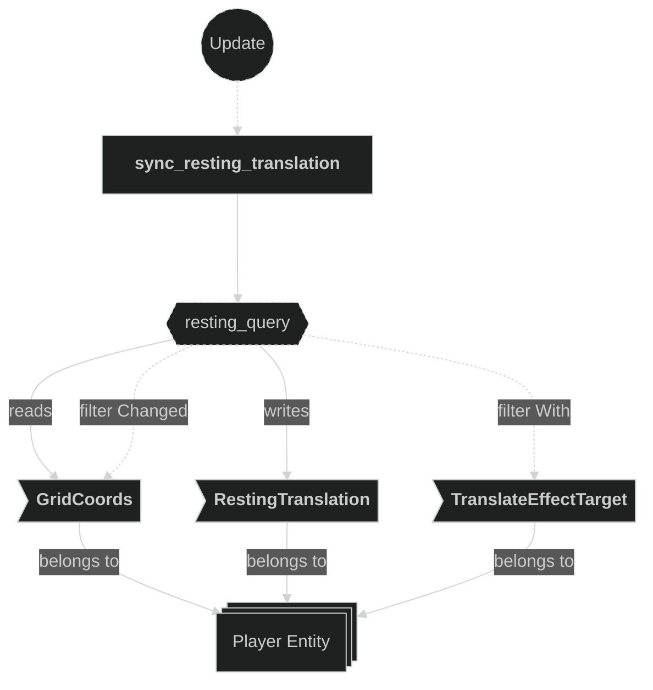
```mermaid
---
config:
  theme: dark
---

flowchart TD
classDef system-group stroke-dasharray: 5 5
classDef query stroke-dasharray: 3 3

update(("`Update`")):::system-group
sync_resting_translation["`**sync_resting_translation**`"]

update -.-> sync_resting_translation

resting_query{{"`resting_query`"}}:::query
sync_resting_translation ---> resting_query

player_entity@{ shape: st-rect, label: "Player Entity" }

pe_coords>"`**GridCoords**`"] --> |belongs to| player_entity
pe_resting>"`**RestingTranslation**`"] --> |belongs to| player_entity
pe_marker>"`**TranslateEffectTarget**`"] --> |belongs to| player_entity

resting_query ---> |reads| pe_coords
resting_query -..-> |filter Changed| pe_coords
resting_query -..-> |filter With| pe_marker
resting_query ---> |writes| pe_resting
```

### Query WaveSource + BounceEffect entities (wave effect)

Used in the following systems:
- **apply_wave_effect**: detects beam entities whose `GridCoords` changed and that carry both `WaveSource` and `BounceEffect`, so it can propagate a bounce to the tile below

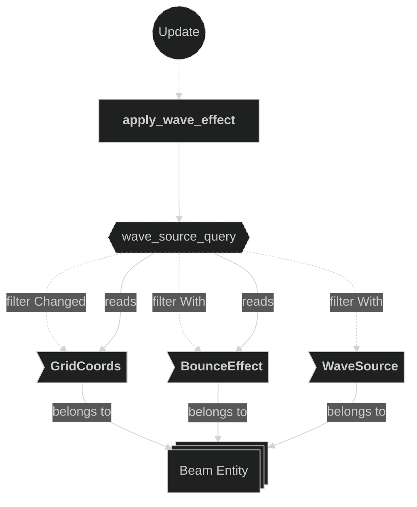
```mermaid
---
config:
  theme: dark
---

flowchart TD
classDef system-group stroke-dasharray: 5 5
classDef query stroke-dasharray: 3 3

update(("`Update`")):::system-group
apply_wave_effect["`**apply_wave_effect**`"]

update -.-> apply_wave_effect

bounce_query{{"`wave_source_query`"}}:::query
apply_wave_effect ---> bounce_query

beam_entity@{ shape: st-rect, label: "Beam Entity" }

be_grid_coords>"`**GridCoords**`"] --> |belongs to| beam_entity
be_bounce>"`**BounceEffect**`"] --> |belongs to| beam_entity
be_wave_source>"`**WaveSource**`"] --> |belongs to| beam_entity

bounce_query -..-> |filter Changed| be_grid_coords
bounce_query -..-> |filter With| be_bounce
bounce_query -..-> |filter With| be_wave_source
bounce_query ---> |reads| be_grid_coords
bounce_query ---> |reads| be_bounce
```

### Query WaveEffectTarget entities and write commands (wave effect)

Used in the following systems:
- **apply_wave_effect**: looks up the `WaveEffectTarget` entity at the source's current grid position via `MapInfo::claimed_entities`, reads its `Transform` and optional `RestingTranslation` as the bounce origin, and inserts a bounce `TweenAnim` directly on it (no `BounceEffectTarget` indirection)

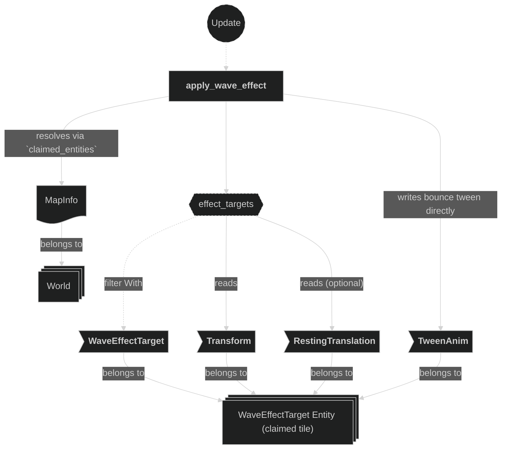
```mermaid
---
config:
  theme: dark
---

flowchart TD
classDef system-group stroke-dasharray: 5 5
classDef query stroke-dasharray: 3 3

update(("`Update`")):::system-group
apply_wave_effect["`**apply_wave_effect**`"]

update -.-> apply_wave_effect

wave_query{{"`effect_targets`"}}:::query
apply_wave_effect ---> wave_query

wave_entity@{ shape: st-rect, label: "WaveEffectTarget Entity (claimed tile)" }

we_marker>"`**WaveEffectTarget**`"] --> |belongs to| wave_entity
we_transform>"`**Transform**`"] --> |belongs to| wave_entity
we_resting>"`**RestingTranslation**`"] --> |belongs to| wave_entity
we_tween>"`**TweenAnim**`"] --> |belongs to| wave_entity

wave_query -..-> |filter With| we_marker
wave_query ---> |reads| we_transform
wave_query ---> |"reads (optional)"| we_resting
apply_wave_effect ---> |writes bounce tween directly| we_tween

world@{ shape: st-rect, label: "World" }
map_info_res@{ shape: doc, label: "MapInfo" }
map_info_res --> |belongs to| world
apply_wave_effect ---> |resolves via `claimed_entities`| map_info_res
```

### Query BounceEffectTarget entities (bounce effect)

Used in the following systems:
- **apply_bounce_effect**: detects newly added `BounceEffectTarget` markers (claimed tiles only), reads `Transform` and optional `RestingTranslation`, plays the bounce tween directly on the tile, and removes the marker

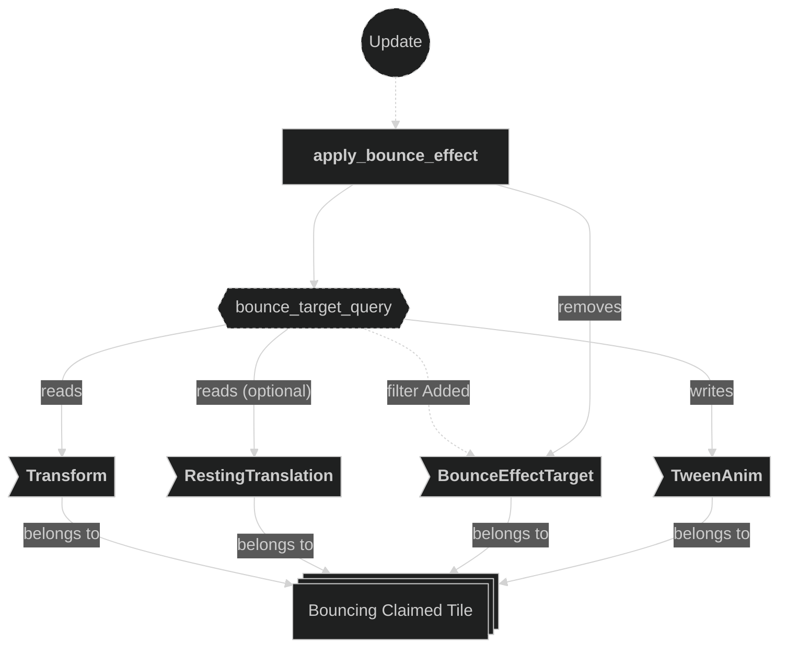
```mermaid
---
config:
  theme: dark
---

flowchart TD
classDef system-group stroke-dasharray: 5 5
classDef query stroke-dasharray: 3 3

update(("`Update`")):::system-group
apply_bounce_effect["`**apply_bounce_effect**`"]

update -.-> apply_bounce_effect

bounce_target_query{{"`bounce_target_query`"}}:::query
apply_bounce_effect ---> bounce_target_query

bounce_entity@{ shape: st-rect, label: "Bouncing Claimed Tile" }

be_transform>"`**Transform**`"] --> |belongs to| bounce_entity
be_resting>"`**RestingTranslation**`"] --> |belongs to| bounce_entity
be_target>"`**BounceEffectTarget**`"] --> |belongs to| bounce_entity
be_tween>"`**TweenAnim**`"] --> |belongs to| bounce_entity

bounce_target_query ---> |reads| be_transform
bounce_target_query ---> |"reads (optional)"| be_resting
bounce_target_query -..-> |filter Added| be_target
bounce_target_query ---> |writes| be_tween
apply_bounce_effect ---> |removes| be_target
```

### Query DamageEffectTarget entities (damage effect)

Used in the following systems:
- **apply_damage_effect**: detects entities whose `Health` has changed and that carry `DamageEffectTarget`, then requests a color-flash on the first child sprite

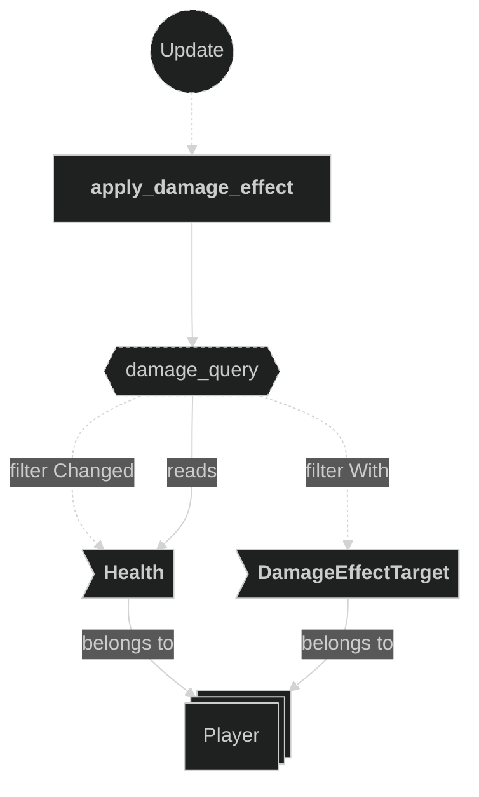
```mermaid
---
config:
  theme: dark
---

flowchart TD
classDef system-group stroke-dasharray: 5 5
classDef query stroke-dasharray: 3 3

update(("`Update`")):::system-group
apply_damage_effect["`**apply_damage_effect**`"]

update -.-> apply_damage_effect

damage_query{{"`damage_query`"}}:::query
apply_damage_effect ---> damage_query

player_entity@{ shape: st-rect, label: "Player" }

pe_health>"`**Health**`"] --> |belongs to| player_entity
pe_marker>"`**DamageEffectTarget**`"] --> |belongs to| player_entity

damage_query -..-> |filter Changed| pe_health
damage_query -..-> |filter With| pe_marker
damage_query ---> |reads| pe_health
```

### Query Children hierarchy (damage effect)

Used in the following systems:
- **apply_damage_effect**: walks descendants to find the first child entity carrying a `Sprite` for the color-flash request

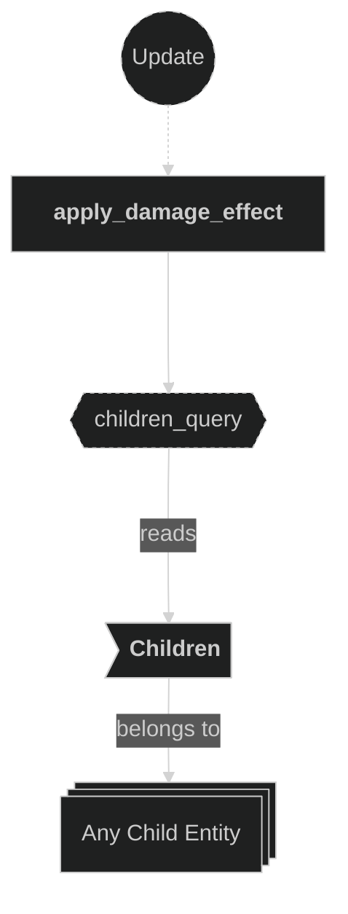
```mermaid
---
config:
  theme: dark
---

flowchart TD
classDef system-group stroke-dasharray: 5 5
classDef query stroke-dasharray: 3 3

update(("`Update`")):::system-group
apply_damage_effect["`**apply_damage_effect**`"]

update -.-> apply_damage_effect

children_query{{"`children_query`"}}:::query
apply_damage_effect ---> children_query

child_entity@{ shape: st-rect, label: "Any Child Entity" }

ch_children>"`**Children**`"] --> |belongs to| child_entity

children_query ---> |reads| ch_children
```

### Query child Sprite and write EffectRequest (damage effect)

Used in the following systems:
- **apply_damage_effect**: reads the `Sprite` on the first child entity to confirm it is a sprite, and writes an `EffectRequest` with `DamageFlash { sprite, ms }`

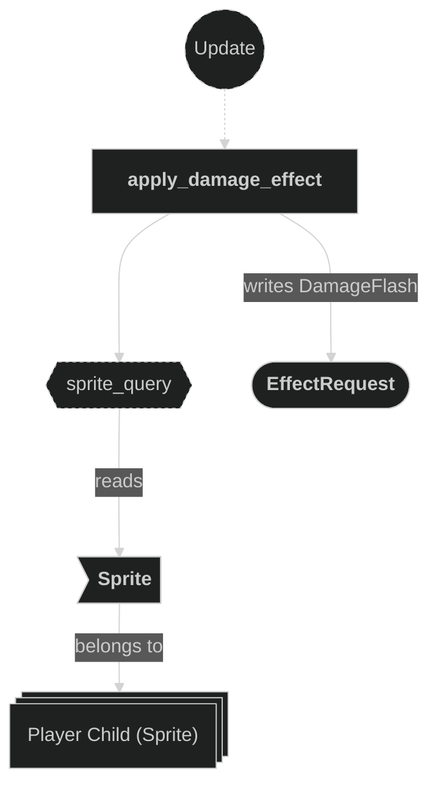
```mermaid
---
config:
  theme: dark
---

flowchart TD
classDef system-group stroke-dasharray: 5 5
classDef query stroke-dasharray: 3 3

update(("`Update`")):::system-group
apply_damage_effect["`**apply_damage_effect**`"]

update -.-> apply_damage_effect

sprites_query{{"`sprite_query`"}}:::query
apply_damage_effect ---> sprites_query

child_entity@{ shape: st-rect, label: "Player Child (Sprite)" }

ce_sprite>"`**Sprite**`"] --> |belongs to| child_entity

sprites_query ---> |reads| ce_sprite

effect_request(["`**EffectRequest**`"])
apply_damage_effect ---> |writes DamageFlash| effect_request
```

### Read DamageableDied messages

Used in the following systems:
- **apply_death_effect**: triggers the death animation sequence on the dying entity, matched against a query filtered `Without<IsDead>` so a duplicate death message is a no-op

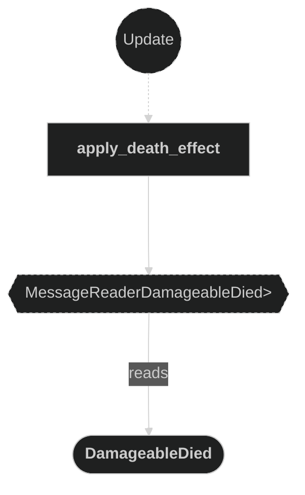
```mermaid
---
config:
  theme: dark
---

flowchart TD
classDef system-group stroke-dasharray: 5 5
classDef reader stroke-dasharray: 3 3

update(("`Update`")):::system-group
apply_death_effect["`**apply_death_effect**`"]

update -.-> apply_death_effect

message_reader{{"MessageReaderDamageableDied#62;"}}:::reader
apply_death_effect ---> message_reader

damageable_died_message(["`**DamageableDied**`"])

message_reader ---> |reads| damageable_died_message
```

### Write IsDead and EffectRequest (apply_death_effect)

Used in the following systems:
- **apply_death_effect**: inserts `IsDead` on the dying entity (matched by a query filtered `Without<IsDead>`) and writes an `EffectRequest` with `DeathBounce { intensity: 8.0, bounce_count: 3, decay: 0.33 }`

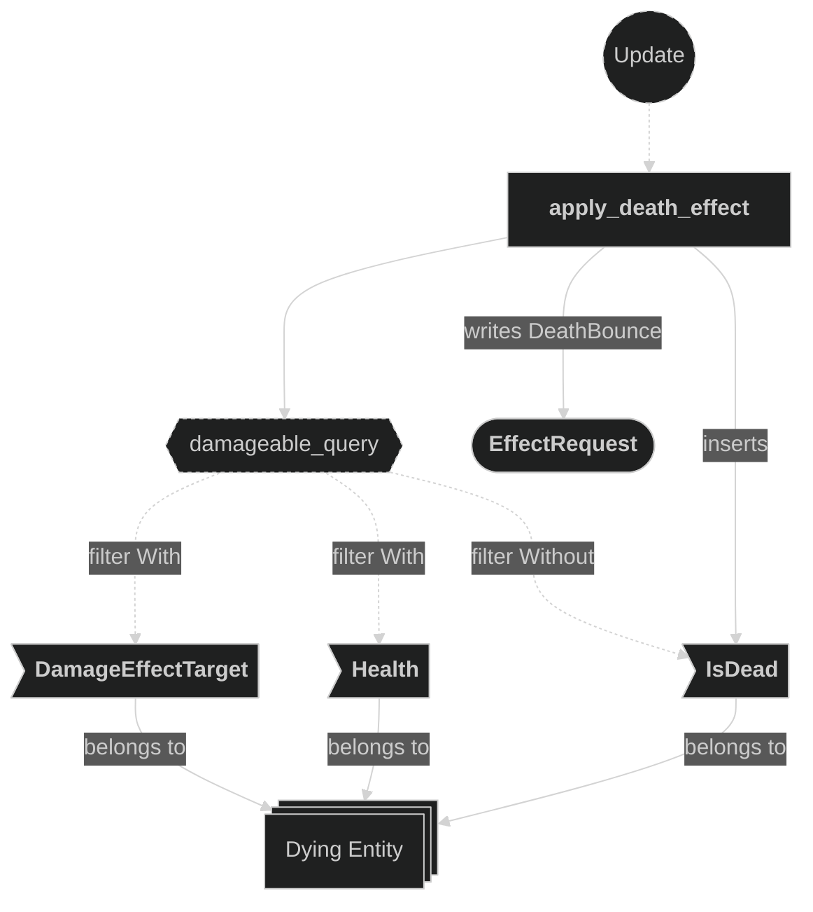
```mermaid
---
config:
  theme: dark
---

flowchart TD
classDef system-group stroke-dasharray: 5 5
classDef query stroke-dasharray: 3 3

update(("`Update`")):::system-group
apply_death_effect["`**apply_death_effect**`"]

update -.-> apply_death_effect

dying_query{{"`damageable_query`"}}:::query
apply_death_effect ---> dying_query

dying_entity@{ shape: st-rect, label: "Dying Entity" }

de_marker>"`**DamageEffectTarget**`"] --> |belongs to| dying_entity
de_health>"`**Health**`"] --> |belongs to| dying_entity
de_is_dead>"`**IsDead**`"] --> |belongs to| dying_entity

dying_query -..-> |filter With| de_marker
dying_query -..-> |filter With| de_health
dying_query -..-> |filter Without| de_is_dead

apply_death_effect ---> |inserts| de_is_dead

effect_request(["`**EffectRequest**`"])
apply_death_effect ---> |writes DeathBounce| effect_request
```

### Query IsKnockedBack entities and tick timer (tick_knockback_lock)

Used in the following systems:
- **tick_knockback_lock**: reads `Res<Time>`; ticks every `IsKnockedBack` entity's timer and removes `IsKnockedBack` once it finishes — the sole removal path during normal play, with no ordering dependency on any tween or completion event

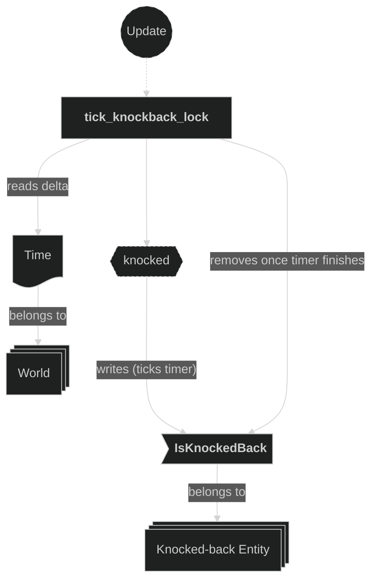
```mermaid
---
config:
  theme: dark
---

flowchart TD
classDef system-group stroke-dasharray: 5 5
classDef query stroke-dasharray: 3 3

update(("`Update`")):::system-group
tick_knockback_lock["`**tick_knockback_lock**`"]

update -.-> tick_knockback_lock

knocked_query{{"`knocked`"}}:::query
tick_knockback_lock ---> knocked_query

knocked_entity@{ shape: st-rect, label: "Knocked-back Entity" }

ke_is_knocked>"`**IsKnockedBack**`"] --> |belongs to| knocked_entity

knocked_query ---> |"writes (ticks timer)"| ke_is_knocked
tick_knockback_lock ---> |"removes once timer finishes"| ke_is_knocked

world@{ shape: st-rect, label: "World" }
time_res@{ shape: doc, label: "Time" }
time_res --> |belongs to| world

tick_knockback_lock ---> |reads delta| time_res
```

### IsKnockedBack component lifecycle

`IsKnockedBack(Timer)` (`src/components/effects.rs`) is only the input lock of a knocked-back entity. `handle_characters_input` (Input plugin) reads it. It does not change any tween: the resolver and the driver policy decide what the position tween does. Its lifecycle is separate from the knockback driver, and the two run on their own timers. Its full lifecycle:
- **Inserted** by `apply_knockback`, seeded with `Timer::new(config.effects.knockback_tween_ms, TimerMode::Once)`, the same duration as the knockback driver tween.
- **Ticked and removed** by `tick_knockback_lock`, every frame, once its timer finishes. This is the only removal path during normal play.
- **Removed** by `reset_round` (Round plugin) on every player round reset.

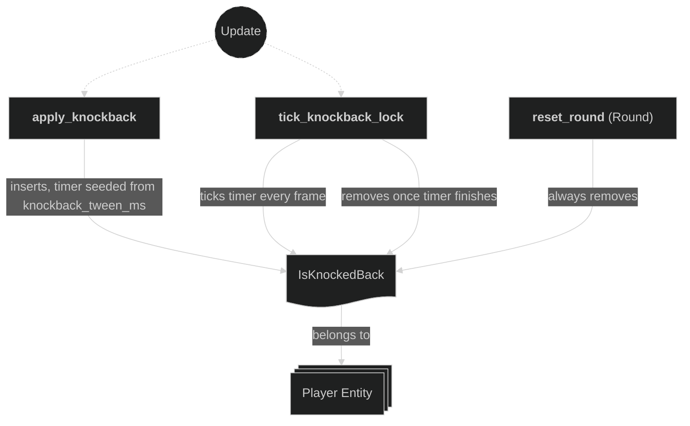
```mermaid
---
config:
  theme: dark
---

flowchart TD
classDef system-group stroke-dasharray: 5 5

update(("`Update`")):::system-group

apply_knockback["`**apply_knockback**`"]
tick_knockback_lock["`**tick_knockback_lock**`"]
reset_round["`**reset_round** (Round)`"]

update -.-> apply_knockback
update -.-> tick_knockback_lock

player_entity@{ shape: st-rect, label: "Player Entity" }
is_knocked_back@{ shape: doc, label: "IsKnockedBack" }

apply_knockback ---> |"inserts, timer seeded from knockback_tween_ms"| is_knocked_back
tick_knockback_lock ---> |ticks timer every frame| is_knocked_back
tick_knockback_lock ---> |"removes once timer finishes"| is_knocked_back
reset_round ---> |always removes| is_knocked_back
is_knocked_back --> |belongs to| player_entity
```

### Query Beam entities (glow)

Used in the following systems:
- **apply_glow_effect**: reacts to `Changed<GridCoords>` on `Beam` entities to find the tile under the beam, its four orthogonal neighbors and the tile two steps ahead, and pushes pulses onto their overlays

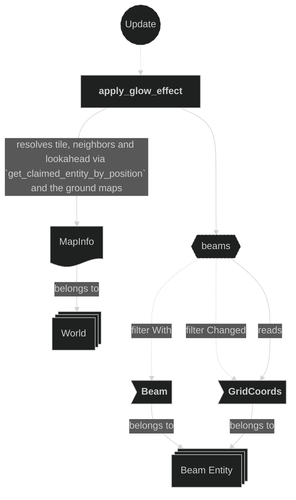
```mermaid
---
config:
  theme: dark
---

flowchart TD
classDef system-group stroke-dasharray: 5 5
classDef query stroke-dasharray: 3 3

update(("`Update`")):::system-group
apply_glow_effect["`**apply_glow_effect**`"]

update -.-> apply_glow_effect

beams_query{{"`beams`"}}:::query
apply_glow_effect ---> beams_query

beam_entity@{ shape: st-rect, label: "Beam Entity" }

be_beam>"`**Beam**`"] --> |belongs to| beam_entity
be_grid_coords>"`**GridCoords**`"] --> |belongs to| beam_entity

beams_query -..-> |filter With| be_beam
beams_query -..-> |filter Changed| be_grid_coords
beams_query ---> |reads| be_grid_coords

world@{ shape: st-rect, label: "World" }
map_info_res@{ shape: doc, label: "MapInfo" }
map_info_res --> |belongs to| world
apply_glow_effect ---> |resolves tile, neighbors and lookahead via `get_claimed_entity_by_position` and the ground maps| map_info_res
```

### Write GlowPulses (apply_glow_effect)

Used in the following systems:
- **apply_glow_effect**: reads `LitOverlayLink` on the resolved claimed tile and ground cell and pushes `GlowPulse` values onto the linked overlay's `GlowPulses`

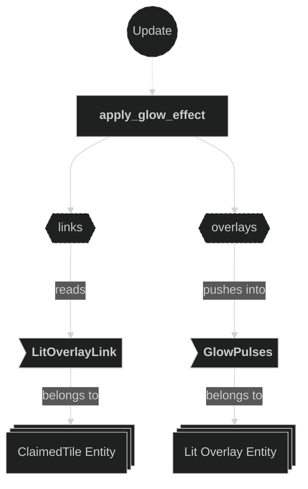
```mermaid
---
config:
  theme: dark
---

flowchart TD
classDef system-group stroke-dasharray: 5 5
classDef query stroke-dasharray: 3 3

update(("`Update`")):::system-group
apply_glow_effect["`**apply_glow_effect**`"]

update -.-> apply_glow_effect

links_query{{"`links`"}}:::query
overlays_query{{"`overlays`"}}:::query
apply_glow_effect ---> links_query
apply_glow_effect ---> overlays_query

tile_entity@{ shape: st-rect, label: "ClaimedTile Entity" }
te_link>"`**LitOverlayLink**`"] --> |belongs to| tile_entity
links_query ---> |reads| te_link

overlay_entity@{ shape: st-rect, label: "Lit Overlay Entity" }
oe_pulses>"`**GlowPulses**`"] --> |belongs to| overlay_entity
overlays_query ---> |pushes into| oe_pulses
```

### Read BeamParried messages

Used in the following systems:
- **trigger_parry_scale_effect**: reads `BeamParried` messages, finds the parrier's sprite child with `sprite_child` (reads `Children` and `Sprite`), and writes an `EffectRequest` with `ScalePunch`

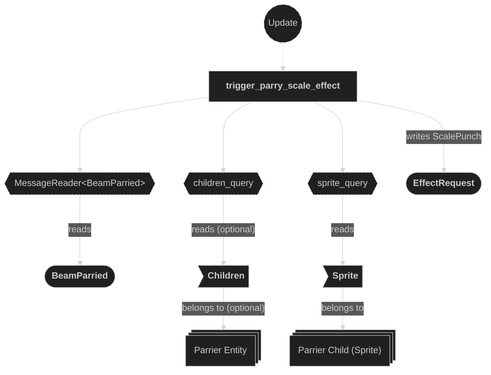
```mermaid
---
config:
  theme: dark
---

flowchart TD
classDef system-group stroke-dasharray: 5 5
classDef reader stroke-dasharray: 3 3
classDef query stroke-dasharray: 3 3

update(("`Update`")):::system-group
trigger_parry_scale_effect["`**trigger_parry_scale_effect**`"]

update -.-> trigger_parry_scale_effect

message_reader{{"MessageReader#60;BeamParried#62;"}}:::reader
trigger_parry_scale_effect ---> message_reader

beam_parried_message(["`**BeamParried**`"])

message_reader ---> |reads| beam_parried_message

children_query{{"`children_query`"}}:::query
sprite_query{{"`sprite_query`"}}:::query
trigger_parry_scale_effect ---> children_query
trigger_parry_scale_effect ---> sprite_query

parrier_entity@{ shape: st-rect, label: "Parrier Entity" }
pe_children>"`**Children**`"] --> |"belongs to (optional)"| parrier_entity
children_query ---> |"reads (optional)"| pe_children

sprite_entity@{ shape: st-rect, label: "Parrier Child (Sprite)" }
se_sprite>"`**Sprite**`"] --> |belongs to| sprite_entity
sprite_query ---> |reads| se_sprite

effect_request(["`**EffectRequest**`"])
trigger_parry_scale_effect ---> |writes ScalePunch| effect_request
```

### Read EffectRequest and spawn drivers (resolve_effect_requests)

Used in the following systems:
- **resolve_effect_requests**: reads every `EffectRequest`, finds the live driver per (owner, channel) through `EffectDrivers`, and spawns, replaces or updates drivers

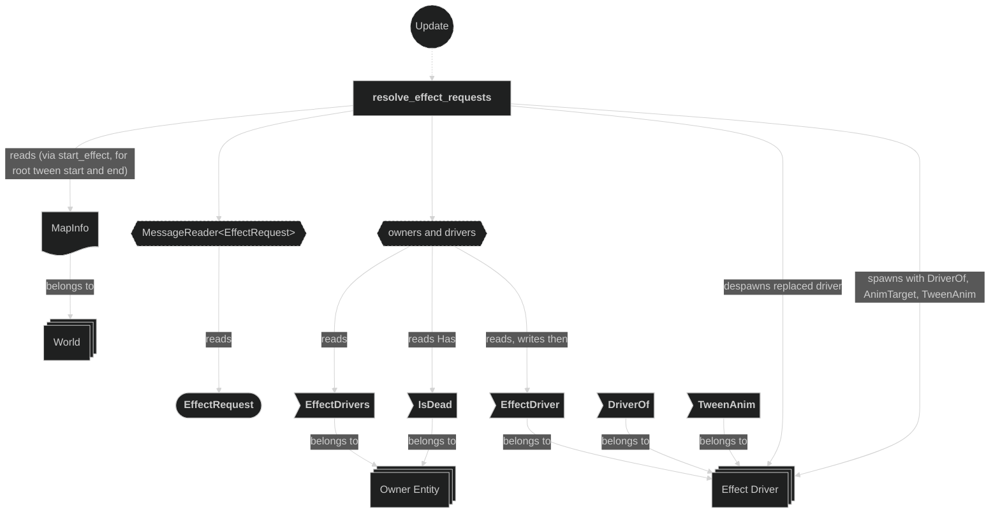
```mermaid
---
config:
  theme: dark
---

flowchart TD
classDef system-group stroke-dasharray: 5 5
classDef reader stroke-dasharray: 3 3
classDef query stroke-dasharray: 3 3

update(("`Update`")):::system-group
resolve_effect_requests["`**resolve_effect_requests**`"]

update -.-> resolve_effect_requests

request_reader{{"MessageReader#60;EffectRequest#62;"}}:::reader
resolve_effect_requests ---> request_reader

effect_request(["`**EffectRequest**`"])
request_reader ---> |reads| effect_request

owner_query{{"`owners and drivers`"}}:::query
resolve_effect_requests ---> owner_query

owner_entity@{ shape: st-rect, label: "Owner Entity" }
oe_drivers>"`**EffectDrivers**`"] --> |belongs to| owner_entity
oe_dead>"`**IsDead**`"] --> |belongs to| owner_entity
owner_query ---> |reads| oe_drivers
owner_query ---> |reads Has| oe_dead

driver_entity@{ shape: st-rect, label: "Effect Driver" }
de_driver>"`**EffectDriver**`"] --> |belongs to| driver_entity
de_link>"`**DriverOf**`"] --> |belongs to| driver_entity
de_tween>"`**TweenAnim**`"] --> |belongs to| driver_entity

owner_query ---> |reads, writes then| de_driver

world@{ shape: st-rect, label: "World" }
map_info_res@{ shape: doc, label: "MapInfo" }
map_info_res --> |belongs to| world
resolve_effect_requests ---> |"reads (via start_effect, for root tween start and end)"| map_info_res

resolve_effect_requests ---> |despawns replaced driver| driver_entity
resolve_effect_requests ---> |spawns with DriverOf, AnimTarget, TweenAnim| driver_entity
```

### Read AnimCompletedEvent (on_effect_completed)

Used in the following systems:
- **on_effect_completed**: despawns the `EffectDriver` entity whose tween just finished, inserts `Visibility::Hidden` on the owner when the finished effect was a `DeathBounce`, and starts the queued `then` effect (through `start_effect`, which reads `RootTweenSources`: owner `Transform`, `GridCoords`, `RestingTranslation` and `MapInfo`)

```mermaid
---
config:
  theme: dark
---

flowchart TD
classDef system-group stroke-dasharray: 5 5
classDef reader stroke-dasharray: 3 3
classDef query stroke-dasharray: 3 3

update(("`Update`")):::system-group
on_effect_completed["`**on_effect_completed**`"]

update -.-> on_effect_completed

event_reader{{"MessageReader#60;AnimCompletedEvent#62;"}}:::reader
on_effect_completed ---> event_reader

anim_completed_event(["`**AnimCompletedEvent**`"])
event_reader ---> |reads| anim_completed_event

driver_query{{"`drivers`"}}:::query
on_effect_completed ---> driver_query

driver_entity@{ shape: st-rect, label: "Effect Driver" }
de_driver>"`**EffectDriver**`"] --> |belongs to| driver_entity
driver_query ---> |reads| de_driver

on_effect_completed ---> |despawns| driver_entity
on_effect_completed ---> |spawns driver for then| driver_entity

owner_entity@{ shape: st-rect, label: "Owner Entity (after DeathBounce)" }
oe_visibility>"`**Visibility**`"] --> |belongs to| owner_entity
on_effect_completed ---> |inserts Hidden| oe_visibility
```

### Query EffectDriver entities (clear_root_effect_drivers)

Used in the following systems:
- **clear_root_effect_drivers**: reads every `EffectDriver` and despawns those whose kind is on the `RootTranslation` channel

```mermaid
---
config:
  theme: dark
---

flowchart TD
classDef system-group stroke-dasharray: 5 5
classDef query stroke-dasharray: 3 3

exit_outcome(("`OnExit(Outcome)`")):::system-group
clear_root_effect_drivers["`**clear_root_effect_drivers**`"]

exit_outcome -.-> clear_root_effect_drivers

driver_query{{"`drivers`"}}:::query
clear_root_effect_drivers ---> driver_query

driver_entity@{ shape: st-rect, label: "Effect Driver" }
de_driver>"`**EffectDriver**`"] --> |belongs to| driver_entity

driver_query ---> |"reads (kind channel must be RootTranslation)"| de_driver
clear_root_effect_drivers ---> |despawns| driver_entity
```

### SpriteLitOverlay and TilemapLitOverlay lifecycle

`SpriteLitOverlay` marks the lit overlay child of a claimed tile, and `TilemapLitOverlay` marks the lit overlay of a floor cell, spawned as a child of the ground tilemap (both in `src/components/effects.rs`). They exist because `Sprite::color` is multiplicative and cannot make a tile lit; the overlay shows a lit copy of the tile atlas on top of the tile instead. Its full lifecycle:
- **Spawned** once per tile by `spawn_sprite_lit_overlays`, with `GlowPulses` empty and `Visibility::Hidden`; the tile gets a `LitOverlayLink(overlay)`.
- **Fed** by `apply_glow_effect`, which pushes `GlowPulse { elapsed, delay, peak, fade_in, hold, fade_out }` values.
- **Driven** by `update_lit_overlays`, which advances pulses, sets alpha to the maximum strength, prunes finished pulses and toggles visibility; `sync_lit_overlay_frames` copies the tile's atlas index in `PostUpdate`.
- **Reset** on `OnExit(RoundPhase::Playing)` by `clear_glow` (pulses cleared, alpha 0, hidden). The overlay itself is never despawned.

`LitAtlases` (resource, private to the Effects plugin) holds two `LitAtlas` values, `tiles` and `ground`, and the shared `ground_layout` handle. Each `LitAtlas` holds the reserved `lit` image handle (created in `FromWorld`), the `source` image handle, and `built_with`, the `(lightness, chroma)` pair the current lit image was built with.

`TilemapLitOverlay` overlays follow the same lifecycle but are spawned by `spawn_tilemap_lit_overlays` as children of the ground tilemap, and are never frame-synced.

```mermaid
---
config:
  theme: dark
---

flowchart TD
classDef system-group stroke-dasharray: 5 5

update(("`Update`")):::system-group
post_update(("`PostUpdate`")):::system-group
state_transition(("`OnExit(Playing)`")):::system-group

spawn_sprite_lit_overlays["`**spawn_sprite_lit_overlays**`"]
spawn_tilemap_lit_overlays["`**spawn_tilemap_lit_overlays**`"]
build_lit_atlas["`**build_lit_atlas**`"]
apply_glow_effect["`**apply_glow_effect**`"]
update_lit_overlays["`**update_lit_overlays**`"]
sync_lit_overlay_frames["`**sync_lit_overlay_frames**`"]
clear_glow["`**clear_glow**`"]

update -.-> spawn_sprite_lit_overlays
update -.-> spawn_tilemap_lit_overlays
update -.-> build_lit_atlas
update -.-> apply_glow_effect
update -.-> update_lit_overlays
post_update -.-> sync_lit_overlay_frames
state_transition -.-> clear_glow

overlay_entity@{ shape: st-rect, label: "Lit Overlay" }
tile_entity@{ shape: st-rect, label: "ClaimedTile (Sprite)" }
lit_image@{ shape: doc, label: "Lit Image" }

spawn_sprite_lit_overlays ---> |spawns child, links| overlay_entity
spawn_tilemap_lit_overlays ---> |spawns tilemap child, links| overlay_entity
build_lit_atlas ---> |inserts lit pixels| lit_image
apply_glow_effect ---> |pushes pulses| overlay_entity
update_lit_overlays ---> |sets alpha, visibility| overlay_entity
sync_lit_overlay_frames ---> |copies atlas index from| tile_entity
sync_lit_overlay_frames ---> |writes index| overlay_entity
clear_glow ---> |clears pulses, hides| overlay_entity
```

### EffectDriver component lifecycle

`EffectDriver { kind, then }` (`src/components/effects.rs`) is a transient carrier entity whose `TweenAnim` is redirected at the animated component through `AnimTarget`, so several effects can run on one sprite without sharing a `TweenAnim` slot. Its full lifecycle:
- **Spawned** by `resolve_effect_requests` (or by `on_effect_completed` for a queued `then`) through `start_effect`, linked to its owner with `DriverOf`. Root effects build their tween at this moment, from the owner's current `Transform` to the `GridCoords` position (Translate, Settle, Knockback) or from `RestingTranslation` (DeathBounce).
- **Replaced** by `resolve_effect_requests` when a new effect on the same channel wins `decide` with `Replace`: the old driver is despawned and the new one spawned in the same frame, so a repeated hit, parry or drag step restarts its tween.
- **Updated in place** by `resolve_effect_requests` when a request is queued: only `then` changes.
- **Despawned on completion** by `on_effect_completed`, reading `AnimCompletedEvent`. A queued `then` starts at that moment. When a DeathBounce driver completes, the owner gets `Visibility::Hidden`.
- **Despawned on round end** by `clear_root_effect_drivers` (`OnExit(RoundPhase::Outcome)`), for root translation drivers only, including a queued `then`.
- **Not cleared on round end** for sprite drivers.

```mermaid
---
config:
  theme: dark
---

flowchart TD
classDef system-group stroke-dasharray: 5 5

update(("`Update`")):::system-group
exit_outcome(("`OnExit(Outcome)`")):::system-group

trigger_parry_scale_effect["`**trigger_parry_scale_effect**`"]
apply_damage_effect["`**apply_damage_effect**`"]
apply_translate_effect["`**apply_translate_effect**`"]
apply_movement_settle["`**apply_movement_settle**`"]
apply_knockback["`**apply_knockback**`"]
apply_death_effect["`**apply_death_effect**`"]
on_effect_completed["`**on_effect_completed**`"]
resolve_effect_requests["`**resolve_effect_requests**`"]
clear_root_effect_drivers["`**clear_root_effect_drivers**`"]

update -.-> trigger_parry_scale_effect
update -.-> apply_damage_effect
update -.-> apply_translate_effect
update -.-> apply_movement_settle
update -.-> apply_knockback
update -.-> apply_death_effect
update -.-> on_effect_completed
update -.-> resolve_effect_requests
exit_outcome -.-> clear_root_effect_drivers

effect_request(["`**EffectRequest**`"])
driver_entity@{ shape: st-rect, label: "Effect Driver" }
sprite_entity@{ shape: st-rect, label: "Owner Child (Sprite, Transform)" }
player_entity@{ shape: st-rect, label: "Player Entity (Transform)" }

trigger_parry_scale_effect ---> |writes ScalePunch| effect_request
apply_damage_effect ---> |writes DamageFlash| effect_request
apply_translate_effect ---> |writes Translate| effect_request
movement_stopped_message(["`**MovementStopped**`"])
movement_stopped_message ---> |read by| apply_movement_settle
apply_movement_settle ---> |writes Settle| effect_request
apply_knockback ---> |writes Knockback| effect_request
apply_death_effect ---> |writes DeathBounce| effect_request
effect_request ---> |read by| resolve_effect_requests
resolve_effect_requests ---> |spawns or replaces| driver_entity
driver_entity ---> |animates sprite effects via AnimTarget| sprite_entity
driver_entity ---> |animates root effects via AnimTarget| player_entity
on_effect_completed ---> |despawns on AnimCompletedEvent, starts then| driver_entity
on_effect_completed ---> |hides after DeathBounce| player_entity
clear_root_effect_drivers ---> |despawns root drivers| driver_entity
```
