# Effects Plugin

This plugin plays the visual effects of players and tiles. It also registers the `TweeningPlugin`.

## Key ideas

- An **effect request** (`EffectRequest`) asks for one player effect. Systems write requests. They never start a player tween themselves.
- An **effect driver** is a small entity that plays one tween for one player. It points at the animated component with `AnimTarget`.
- A **channel** is the value that an effect animates: `RootTranslation` (player position), `SpriteScale` or `SpriteColor`. A player has at most one driver per channel.
- `resolve_effect_requests` (the resolver) turns requests into drivers. It is the only system that starts a player tween.
- Tiles do not use requests. Their bounces put a `TweenAnim` directly on the tile.
- The glow uses a **lit overlay**: a brighter copy of the tile, drawn on top of it, that fades in and out. `Sprite::color` can only make a sprite darker, so the glow needs this copy.

## Position effect rules

The resolver uses this table for the `RootTranslation` channel. The rows are the new effect. The columns are the effect that runs now.

| New / running | none | Translate or Settle | Knockback | DeathBounce |
|---|---|---|---|---|
| Translate or Settle | Start | Replace | Queue | Drop |
| Knockback | Start | Replace | Replace | Drop |
| DeathBounce | Start | Replace | Queue | Drop |

- `Start`: start a new driver.
- `Replace`: stop the running driver and start the new one.
- `Queue`: keep the running driver. The new effect waits in its `then` slot and starts when the running one ends.
- `Drop`: ignore the request.
- `ScalePunch` and `DamageFlash` have their own channels. They always start or replace, so a new parry or hit restarts them.

How requests combine, in two examples. In one frame, the requests are sorted by rank (Translate 0, Settle 1, Knockback 2, DeathBounce 3) and go through the table one by one.

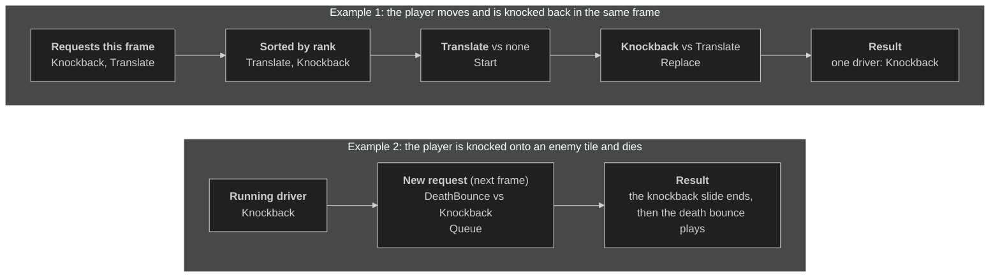
```mermaid
---
config:
  theme: dark
---

flowchart TD

subgraph ex1 ["Example 1: the player moves and is knocked back in the same frame"]
  e1_requests["`**Requests this frame**
  Knockback, Translate`"]
  e1_sorted["`**Sorted by rank**
  Translate, Knockback`"]
  e1_translate["`**Translate** vs none
  Start`"]
  e1_knockback["`**Knockback** vs Translate
  Replace`"]
  e1_result["`**Result**
  one driver: Knockback`"]
  e1_requests --> e1_sorted --> e1_translate --> e1_knockback --> e1_result
end

subgraph ex2 ["Example 2: the player is knocked onto an enemy tile and dies"]
  e2_running["`**Running driver**
  Knockback`"]
  e2_new["`**New request** (next frame)
  DeathBounce vs Knockback
  Queue`"]
  e2_result["`**Result**
  the knockback slide ends, then the death bounce plays`"]
  e2_running --> e2_new --> e2_result
end

ex1 ~~~ ex2
```

## Ordering

An arrow means "runs before". Systems with no arrow between them have no fixed order.

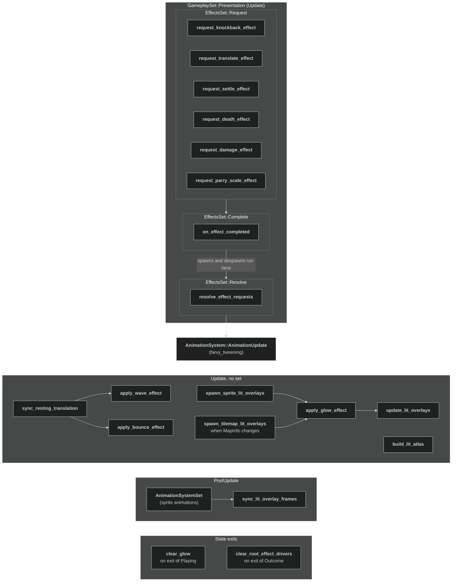
```mermaid
---
config:
  theme: dark
---

flowchart TD

subgraph presentation ["GameplaySet::Presentation (Update)"]
  subgraph request ["EffectsSet::Request"]
    request_knockback_effect["`**request_knockback_effect**`"]
    request_translate_effect["`**request_translate_effect**`"]
    request_settle_effect["`**request_settle_effect**`"]
    request_death_effect["`**request_death_effect**`"]
    request_damage_effect["`**request_damage_effect**`"]
    request_parry_scale_effect["`**request_parry_scale_effect**`"]
  end
  subgraph complete ["EffectsSet::Complete"]
    on_effect_completed["`**on_effect_completed**`"]
  end
  subgraph resolve ["EffectsSet::Resolve"]
    resolve_effect_requests["`**resolve_effect_requests**`"]
  end
  request --> complete --> |"spawns and despawns run here"| resolve
end

animation_update["`**AnimationSystem::AnimationUpdate**
(bevy_tweening)`"]
resolve --> animation_update

subgraph tiles ["Update, no set"]
  sync_resting_translation["`**sync_resting_translation**`"]
  apply_wave_effect["`**apply_wave_effect**`"]
  apply_bounce_effect["`**apply_bounce_effect**`"]
  sync_resting_translation --> apply_wave_effect
  sync_resting_translation --> apply_bounce_effect

  spawn_sprite_lit_overlays["`**spawn_sprite_lit_overlays**`"]
  spawn_tilemap_lit_overlays["`**spawn_tilemap_lit_overlays**
  when MapInfo changes`"]
  build_lit_atlas["`**build_lit_atlas**`"]
  apply_glow_effect["`**apply_glow_effect**`"]
  update_lit_overlays["`**update_lit_overlays**`"]
  spawn_sprite_lit_overlays --> apply_glow_effect
  spawn_tilemap_lit_overlays --> apply_glow_effect
  apply_glow_effect --> update_lit_overlays
end

subgraph post ["PostUpdate"]
  animation_system_set["`**AnimationSystemSet**
  (sprite animations)`"]
  sync_lit_overlay_frames["`**sync_lit_overlay_frames**`"]
  animation_system_set --> sync_lit_overlay_frames
end

subgraph exits ["State exits"]
  clear_glow["`**clear_glow**
  on exit of Playing`"]
  clear_root_effect_drivers["`**clear_root_effect_drivers**
  on exit of Outcome`"]
end

animation_update ~~~ tiles
apply_wave_effect ~~~ spawn_sprite_lit_overlays
tiles ~~~ post ~~~ exits
clear_glow ~~~ clear_root_effect_drivers
```

- When a tween ends, `on_effect_completed` despawns its driver and spawns a new driver for its `then` effect. Bevy runs these spawns and despawns between `Complete` and `Resolve`, so the resolver sees the new driver.
- No `Update` system here is gated on `RoundPhase`.

## Plugin Systems

### Request Knockback Effect

- Reads `EntityKnockedBack`. The Damage plugin writes it after it moves the player.
- Writes a `Knockback` request. Duration: `effects.knockback_tween_ms` (200 ms).
- The Damage plugin owns the move and the input lock. This system only asks for the slide.

### Request Translate Effect

- When a player's `GridCoords` changes, writes a `Translate` request.
- Duration: the player's `MovementSlide`, or `timing.move_repeat_rate_ms` if it has none.
- The tween is linear, from the current position to the new tile.

### Request Settle Effect

- Reads `MovementStopped` from the Input plugin. Writes a `Settle` request.
- The tween eases out (`QuadraticOut`) to the current tile, over `timing.move_repeat_rate_ms`.

### Sync Resting Translation

- When a player's `GridCoords` changes, writes `RestingTranslation`: the world position of the new tile.
- Bounces start from this position. The `Transform` can be in the middle of a tween, so it is not a safe start point.
- Tiles never move and have no `RestingTranslation`. Their bounces start from their `Transform`.

### Apply Wave Effect

- Runs when a beam with `WaveSource` and `BounceEffect` moves. Finds the claimed tile under it with `MapInfo::claimed_entities`.
- Puts a bounce `TweenAnim` on that tile. This makes the wave that follows the beam.
- A beam without `WaveSource` (see the Beam plugin doc) makes no wave. It still makes the glow.

### Apply Bounce Effect

- The claim bounce, for tiles only. The Animations plugin adds `BounceEffectTarget` when a tile is claimed.
- Puts a bounce `TweenAnim` on the tile, then removes the marker, so the bounce plays once.

### Request Damage Effect

- When a player's `Health` changes, writes a `DamageFlash` request for its first sprite child.
- The sprite turns red over a quarter of `effects.damage_flash_ms` (150 ms), then back to white over `damage_flash_ms`.

### Request Death Effect

- Reads `DamageableDied`. It skips players that already have `IsDead`, so a second death message does nothing.
- Adds `IsDead` and writes a `DeathBounce` request (intensity 8, 3 bounces, decay 0.33).
- It has no phase gate, so it still sees a death written on the last `Playing` frame.

### Request Parry Scale Effect

- Reads `BeamParried`. Writes a `ScalePunch` request for the sprite child of the parrier.
- The sprite starts at `parry.scale_punch_peak` (1.1) and shrinks to normal size over `parry.scale_punch_secs` (0.15 s, in hitstop time).
- Any system can write a `ScalePunch` request. The parry is the only source today.

### Resolve Effect Requests

- Reads all `EffectRequest` messages. Drops the position requests of dead players, except `DeathBounce`.
- Groups the requests by player and channel, and applies the rules above against the running driver.
- Starts, replaces or updates at most one driver per channel.
- `start_effect` builds the tween from the player's `Transform`, `GridCoords`, `RestingTranslation` and `MapInfo`. If these are missing, no driver starts.

### On Effect Completed

- Reads `AnimCompletedEvent`. Despawns the driver whose tween ended, then starts its `then` effect, if there is one.
- After a `DeathBounce`, it hides the player (`Visibility::Hidden`). The player keeps `IsDead` until the round reset.

### Clear Root Effect Drivers

- Runs on exit of `Outcome`. Despawns every position driver and its queued `then`. So no slide or death bounce goes into the next round.
- Sprite drivers stay. Stopping one halfway would leave the sprite red or too big.
- It needs no order against `reset_round`.
- In dev builds, `warn_duplicate_channel_drivers` logs a warning when a player has two drivers on one channel.

### Spawn Sprite Lit Overlays

- For each `GlowEffectTarget` tile with a `Sprite` and no `LitOverlayLink`: spawns a hidden overlay child (`SpriteLitOverlay`) and links it with `LitOverlayLink`.
- The overlay uses the lit tile image and the tile's atlas. It is a child, so it moves with the tile bounces.
- Its z is 0.5. It must stay below 1.0, the space between tile rows.

### Spawn Tilemap Lit Overlays

- Runs when `MapInfo` changes. For each ground and forbidden cell, spawns a hidden overlay (`TilemapLitOverlay`) as a child of the ground tilemap.
- It uses the lit floor image and the cell's texture index. Its z is 0.5: above the floor, below the claimed tiles.
- Only a tilemap with one image (`TilemapTexture::Single`) works. Any other kind logs one warning and is skipped.

### Build Lit Atlas

- Builds the lit images for tiles and floor with `make_lit_image`.
- Rebuilds when `beam_glow_lightness` or `beam_glow_chroma` changes, or when the source image changes. So tuning and `tiles.png` edits show live.
- `make_lit_image` makes each pixel lighter (`beam_glow_lightness`) and keeps part of its color strength (`beam_glow_chroma`). Alpha does not change.
- An unsupported image format logs one warning, and the glow never shows.

### Apply Glow Effect

- Runs each time a beam moves one tile. Adds a full-strength glow pulse (1.0) to the tile under the beam.
- Adds weaker pulses (`beam_glow_neighbor_peak`, after `beam_glow_neighbor_delay_ms`) to the four neighbor tiles and to the tile two steps ahead.
- Each pulse goes to the claimed tile overlay and to the floor overlay. Forbidden cells have only a floor overlay.
- Pulse timing: `beam_glow_fade_in_ms`, `beam_glow_hold_ms`, `beam_glow_fade_out_ms`. The glow has no player color.

### Update Lit Overlays

- Each frame, moves every pulse forward in time and removes the finished ones.
- The overlay alpha is the value of the strongest pulse. Pulses never add up.
- It uses game time, so hitstop slows the glow.
- Shows the overlay when the alpha is above zero and hides it otherwise. Values are written only when they change.

### Sync Lit Overlay Frames

- Copies the tile's animation frame to its visible overlay, so both match during the flip animation.
- Floor overlays are skipped, because floor cells do not animate.

### Clear Glow

- Runs on exit of `Playing`. Clears all pulses and hides every overlay. Overlays are never despawned.

## Effect drivers

- A driver has `EffectDriver { kind, then }`, `DriverOf(owner)`, `AnimTarget` and a `TweenAnim`.
- The player has `EffectDrivers`. Despawning the player also despawns its drivers.
- Drivers do not use `ChildOf`. `sprite_child` reads the first child, and a driver child would break it.
- `RootTranslation`: Translate, Settle, Knockback, DeathBounce. The driver animates the player `Transform`.
- `SpriteScale`: ScalePunch. The driver animates the `Transform` of the sprite child.
- `SpriteColor`: DamageFlash. The driver animates the `Sprite` of the sprite child.
- A punch and a flash can play together, because they use different channels.
- `EffectRequest` is internal to this plugin. It is declared in `effects.rs`.
- `decide`, `merge_queued` and `fold_requests` are pure functions with unit tests.

Tween shapes:

- Translate is linear. Settle and Knockback use `QuadraticOut`. All three go from the current position to the tile.
- DeathBounce is a bounce from `RestingTranslation`. ScalePunch uses `CubicIn`. DamageFlash goes to red, then back to white.

## Tile effects

- A tile has one `TweenAnim` slot. A new bounce replaces the old one. Both bounces move the tile, so this is fine.
- A tile must never get a second direct `TweenAnim` for another value. The next bounce would remove it. Commit `9770b6d` fixed the same bug on players.

For a new tile visual, use one of these:

- **A visual that lasts while a state is true** (armed Landmine, pending Contested Ground): a child overlay sprite, like the lit overlay. It has its own `TweenAnim` slot.
- **A one-shot effect** (Barrier hit, regen pulse): move tiles to the resolver. Add the `EffectKind` and a channel.

For an overlay:

- The state decides if it shows. A system reads the state component every frame. A start or stop message could be missed (round reset, tile flip, despawn).
- Its animations use requests, with the tile as owner and the overlay as target. This needs looping tweens and a way to stop a channel.
- The glow stays outside the resolver. It keeps many pulses and shows the strongest one. The resolver keeps only one effect per channel.

Abilities in `DECKBUILDING.md` that need this: Landmine (#17), Barrier (#33), Bulwark (#34), Contested Ground (#15) and the regen pulse. Burst claims may want a small delay between bounces, like `GlowPulse.delay`.

## Components, Resources and Messages CRUD

### Read EntityKnockedBack messages and write EffectRequest (request_knockback_effect)

Used in the following systems:
- **request_knockback_effect**: writes one `Knockback` request for each `EntityKnockedBack`. It touches no component.

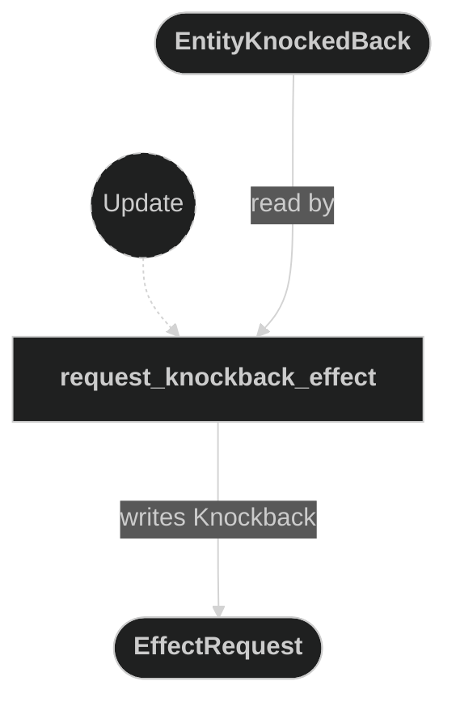
```mermaid
---
config:
  theme: dark
---

flowchart TD
classDef system-group stroke-dasharray: 5 5

update(("`Update`")):::system-group
request_knockback_effect["`**request_knockback_effect**`"]

update -.-> request_knockback_effect

entity_knocked_back_message(["`**EntityKnockedBack**`"])
effect_request(["`**EffectRequest**`"])

entity_knocked_back_message ---> |read by| request_knockback_effect
request_knockback_effect ---> |writes Knockback| effect_request
```

### Query TranslateEffectTarget entities

Used in the following systems:
- **request_translate_effect**: for each player that moved, reads `MovementSlide` (if present) and writes a `Translate` request.

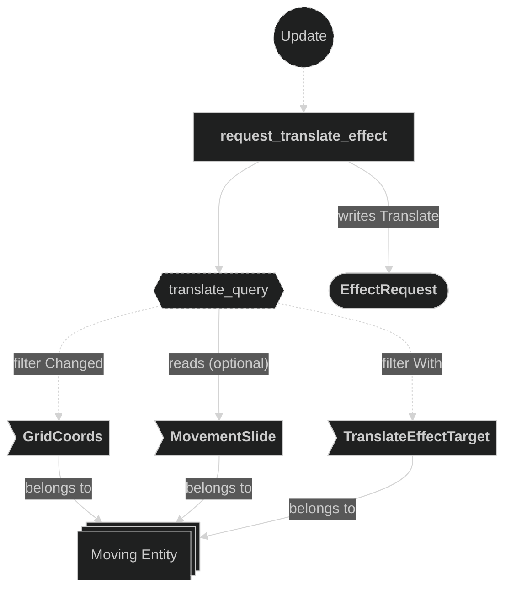
```mermaid
---
config:
  theme: dark
---

flowchart TD
classDef system-group stroke-dasharray: 5 5
classDef query stroke-dasharray: 3 3

update(("`Update`")):::system-group
request_translate_effect["`**request_translate_effect**`"]

update -.-> request_translate_effect

translate_query{{"`translate_query`"}}:::query
request_translate_effect ---> translate_query

moving_entity@{ shape: st-rect, label: "Moving Entity" }

me_grid_coords>"`**GridCoords**`"] --> |belongs to| moving_entity
me_slide>"`**MovementSlide**`"] --> |belongs to| moving_entity
me_marker>"`**TranslateEffectTarget**`"] --> |belongs to| moving_entity

translate_query -..-> |filter Changed| me_grid_coords
translate_query ---> |"reads (optional)"| me_slide
translate_query -..-> |filter With| me_marker

effect_request(["`**EffectRequest**`"])
request_translate_effect ---> |writes Translate| effect_request
```

### Read MovementStopped messages

Used in the following systems:
- **request_settle_effect**: writes one `Settle` request for each `MovementStopped`.

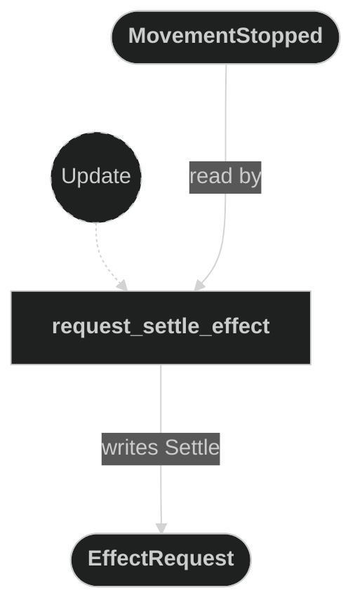
```mermaid
---
config:
  theme: dark
---

flowchart TD
classDef system-group stroke-dasharray: 5 5
classDef query stroke-dasharray: 3 3

update(("`Update`")):::system-group
request_settle_effect["`**request_settle_effect**`"]

update -.-> request_settle_effect

movement_stopped_message(["`**MovementStopped**`"])
movement_stopped_message ---> |read by| request_settle_effect

effect_request(["`**EffectRequest**`"])
request_settle_effect ---> |writes Settle| effect_request
```

### Sync Resting Translation

Used in the following systems:
- **sync_resting_translation**: for each player that moved, writes the new tile position to `RestingTranslation`.

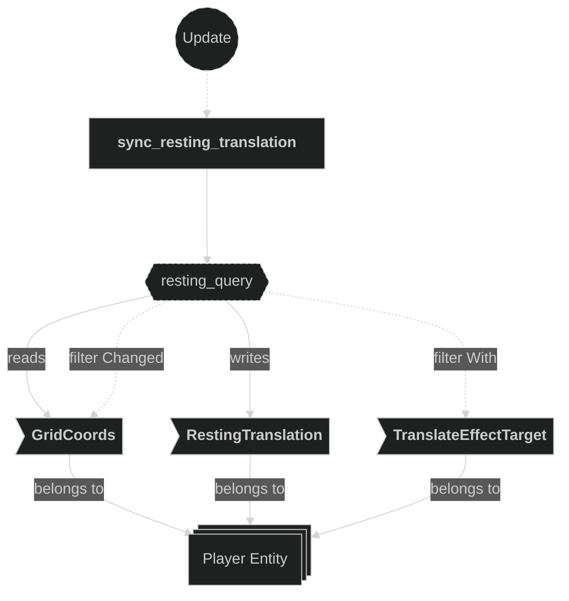
```mermaid
---
config:
  theme: dark
---

flowchart TD
classDef system-group stroke-dasharray: 5 5
classDef query stroke-dasharray: 3 3

update(("`Update`")):::system-group
sync_resting_translation["`**sync_resting_translation**`"]

update -.-> sync_resting_translation

resting_query{{"`resting_query`"}}:::query
sync_resting_translation ---> resting_query

player_entity@{ shape: st-rect, label: "Player Entity" }

pe_coords>"`**GridCoords**`"] --> |belongs to| player_entity
pe_resting>"`**RestingTranslation**`"] --> |belongs to| player_entity
pe_marker>"`**TranslateEffectTarget**`"] --> |belongs to| player_entity

resting_query ---> |reads| pe_coords
resting_query -..-> |filter Changed| pe_coords
resting_query -..-> |filter With| pe_marker
resting_query ---> |writes| pe_resting
```

### Query WaveSource + BounceEffect entities (wave effect)

Used in the following systems:
- **apply_wave_effect**: finds the beams that moved and have `WaveSource` and `BounceEffect`.

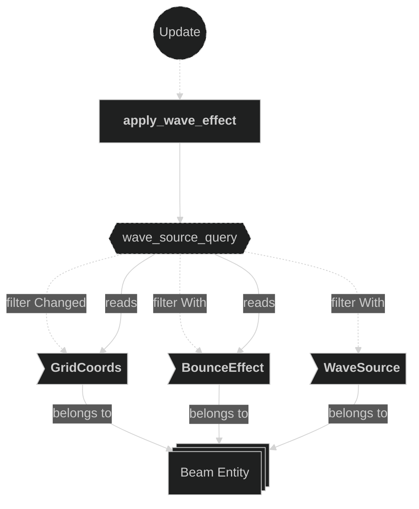
```mermaid
---
config:
  theme: dark
---

flowchart TD
classDef system-group stroke-dasharray: 5 5
classDef query stroke-dasharray: 3 3

update(("`Update`")):::system-group
apply_wave_effect["`**apply_wave_effect**`"]

update -.-> apply_wave_effect

bounce_query{{"`wave_source_query`"}}:::query
apply_wave_effect ---> bounce_query

beam_entity@{ shape: st-rect, label: "Beam Entity" }

be_grid_coords>"`**GridCoords**`"] --> |belongs to| beam_entity
be_bounce>"`**BounceEffect**`"] --> |belongs to| beam_entity
be_wave_source>"`**WaveSource**`"] --> |belongs to| beam_entity

bounce_query -..-> |filter Changed| be_grid_coords
bounce_query -..-> |filter With| be_bounce
bounce_query -..-> |filter With| be_wave_source
bounce_query ---> |reads| be_grid_coords
bounce_query ---> |reads| be_bounce
```

### Query WaveEffectTarget entities and write commands (wave effect)

Used in the following systems:
- **apply_wave_effect**: finds the tile under the beam and puts a bounce `TweenAnim` on it.

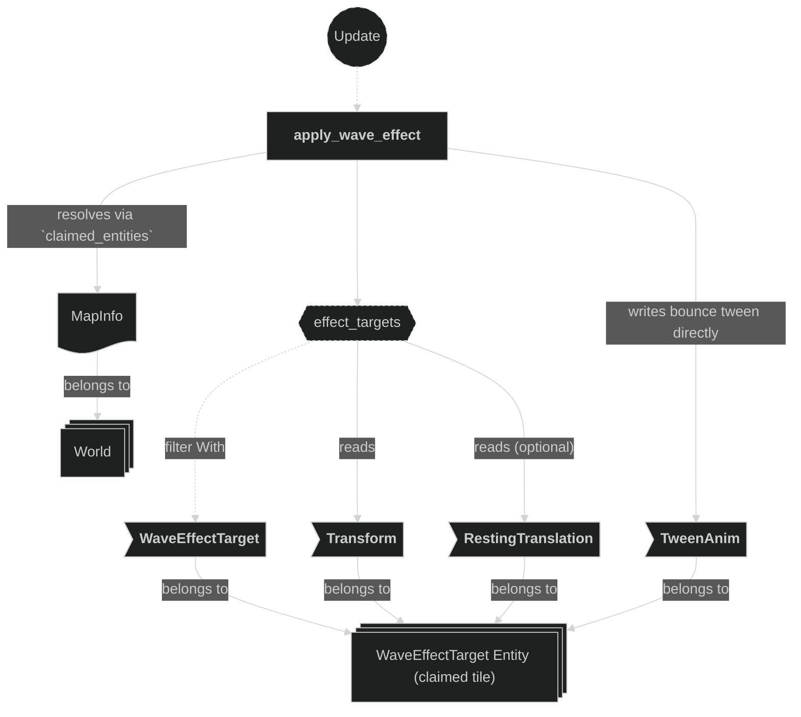
```mermaid
---
config:
  theme: dark
---

flowchart TD
classDef system-group stroke-dasharray: 5 5
classDef query stroke-dasharray: 3 3

update(("`Update`")):::system-group
apply_wave_effect["`**apply_wave_effect**`"]

update -.-> apply_wave_effect

wave_query{{"`effect_targets`"}}:::query
apply_wave_effect ---> wave_query

wave_entity@{ shape: st-rect, label: "WaveEffectTarget Entity (claimed tile)" }

we_marker>"`**WaveEffectTarget**`"] --> |belongs to| wave_entity
we_transform>"`**Transform**`"] --> |belongs to| wave_entity
we_resting>"`**RestingTranslation**`"] --> |belongs to| wave_entity
we_tween>"`**TweenAnim**`"] --> |belongs to| wave_entity

wave_query -..-> |filter With| we_marker
wave_query ---> |reads| we_transform
wave_query ---> |"reads (optional)"| we_resting
apply_wave_effect ---> |writes bounce tween directly| we_tween

world@{ shape: st-rect, label: "World" }
map_info_res@{ shape: doc, label: "MapInfo" }
map_info_res --> |belongs to| world
apply_wave_effect ---> |resolves via `claimed_entities`| map_info_res
```

### Query BounceEffectTarget entities (bounce effect)

Used in the following systems:
- **apply_bounce_effect**: puts a bounce `TweenAnim` on each newly marked tile, then removes the marker.

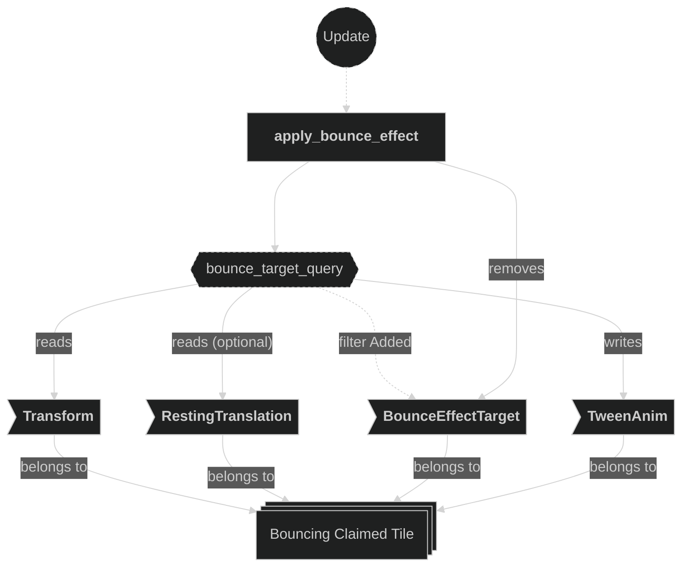
```mermaid
---
config:
  theme: dark
---

flowchart TD
classDef system-group stroke-dasharray: 5 5
classDef query stroke-dasharray: 3 3

update(("`Update`")):::system-group
apply_bounce_effect["`**apply_bounce_effect**`"]

update -.-> apply_bounce_effect

bounce_target_query{{"`bounce_target_query`"}}:::query
apply_bounce_effect ---> bounce_target_query

bounce_entity@{ shape: st-rect, label: "Bouncing Claimed Tile" }

be_transform>"`**Transform**`"] --> |belongs to| bounce_entity
be_resting>"`**RestingTranslation**`"] --> |belongs to| bounce_entity
be_target>"`**BounceEffectTarget**`"] --> |belongs to| bounce_entity
be_tween>"`**TweenAnim**`"] --> |belongs to| bounce_entity

bounce_target_query ---> |reads| be_transform
bounce_target_query ---> |"reads (optional)"| be_resting
bounce_target_query -..-> |filter Added| be_target
bounce_target_query ---> |writes| be_tween
apply_bounce_effect ---> |removes| be_target
```

### Query DamageEffectTarget entities (damage effect)

Used in the following systems:
- **request_damage_effect**: finds the players whose `Health` changed.

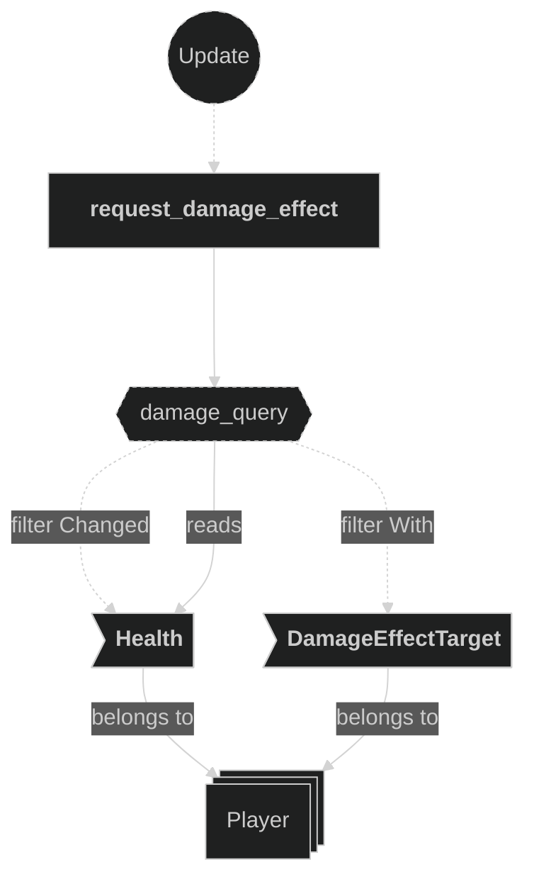
```mermaid
---
config:
  theme: dark
---

flowchart TD
classDef system-group stroke-dasharray: 5 5
classDef query stroke-dasharray: 3 3

update(("`Update`")):::system-group
request_damage_effect["`**request_damage_effect**`"]

update -.-> request_damage_effect

damage_query{{"`damage_query`"}}:::query
request_damage_effect ---> damage_query

player_entity@{ shape: st-rect, label: "Player" }

pe_health>"`**Health**`"] --> |belongs to| player_entity
pe_marker>"`**DamageEffectTarget**`"] --> |belongs to| player_entity

damage_query -..-> |filter Changed| pe_health
damage_query -..-> |filter With| pe_marker
damage_query ---> |reads| pe_health
```

### Query Children hierarchy (damage effect)

Used in the following systems:
- **request_damage_effect**: looks through the children to find the first sprite.

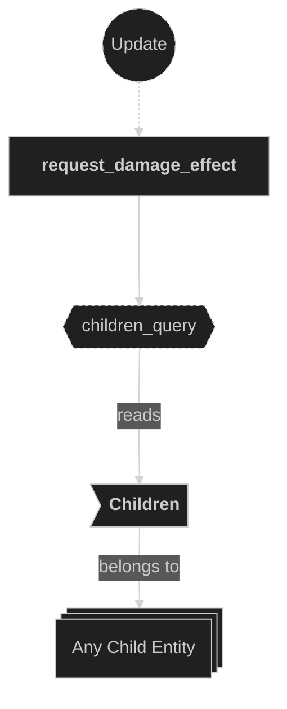
```mermaid
---
config:
  theme: dark
---

flowchart TD
classDef system-group stroke-dasharray: 5 5
classDef query stroke-dasharray: 3 3

update(("`Update`")):::system-group
request_damage_effect["`**request_damage_effect**`"]

update -.-> request_damage_effect

children_query{{"`children_query`"}}:::query
request_damage_effect ---> children_query

child_entity@{ shape: st-rect, label: "Any Child Entity" }

ch_children>"`**Children**`"] --> |belongs to| child_entity

children_query ---> |reads| ch_children
```

### Query child Sprite and write EffectRequest (damage effect)

Used in the following systems:
- **request_damage_effect**: checks that the child has a `Sprite`, then writes a `DamageFlash` request.

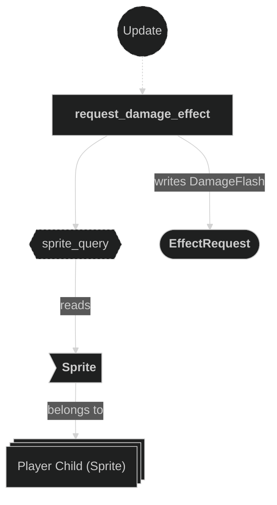
```mermaid
---
config:
  theme: dark
---

flowchart TD
classDef system-group stroke-dasharray: 5 5
classDef query stroke-dasharray: 3 3

update(("`Update`")):::system-group
request_damage_effect["`**request_damage_effect**`"]

update -.-> request_damage_effect

sprites_query{{"`sprite_query`"}}:::query
request_damage_effect ---> sprites_query

child_entity@{ shape: st-rect, label: "Player Child (Sprite)" }

ce_sprite>"`**Sprite**`"] --> |belongs to| child_entity

sprites_query ---> |reads| ce_sprite

effect_request(["`**EffectRequest**`"])
request_damage_effect ---> |writes DamageFlash| effect_request
```

### Read DamageableDied messages

Used in the following systems:
- **request_death_effect**: one death effect for each `DamageableDied`. Players already dead are skipped.

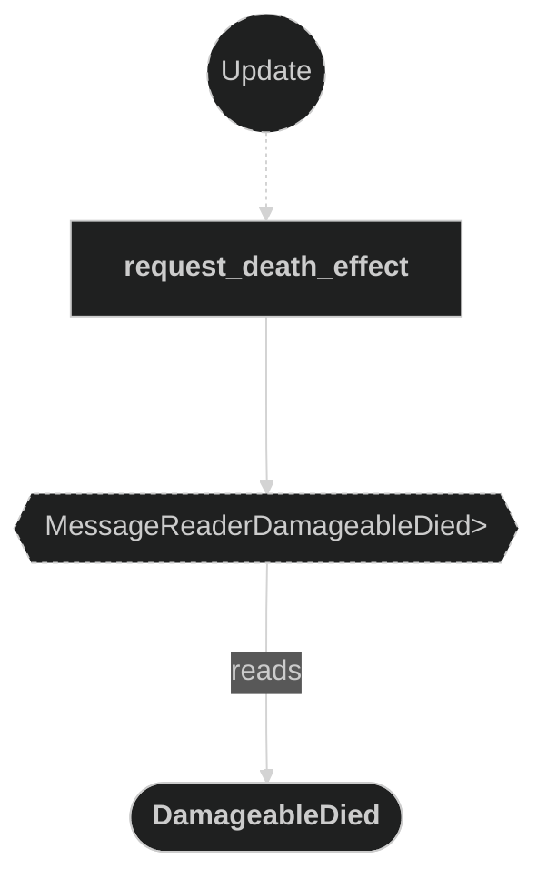
```mermaid
---
config:
  theme: dark
---

flowchart TD
classDef system-group stroke-dasharray: 5 5
classDef reader stroke-dasharray: 3 3

update(("`Update`")):::system-group
request_death_effect["`**request_death_effect**`"]

update -.-> request_death_effect

message_reader{{"MessageReaderDamageableDied#62;"}}:::reader
request_death_effect ---> message_reader

damageable_died_message(["`**DamageableDied**`"])

message_reader ---> |reads| damageable_died_message
```

### Write IsDead and EffectRequest (request_death_effect)

Used in the following systems:
- **request_death_effect**: adds `IsDead` and writes a `DeathBounce` request.

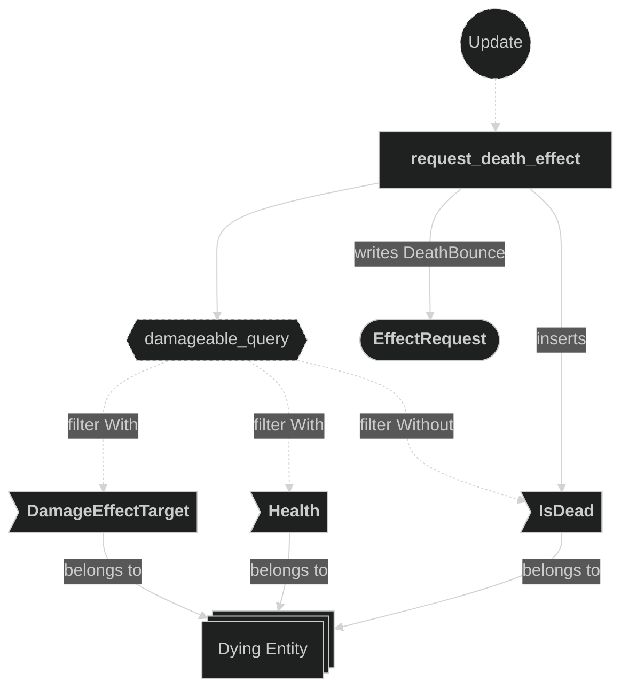
```mermaid
---
config:
  theme: dark
---

flowchart TD
classDef system-group stroke-dasharray: 5 5
classDef query stroke-dasharray: 3 3

update(("`Update`")):::system-group
request_death_effect["`**request_death_effect**`"]

update -.-> request_death_effect

dying_query{{"`damageable_query`"}}:::query
request_death_effect ---> dying_query

dying_entity@{ shape: st-rect, label: "Dying Entity" }

de_marker>"`**DamageEffectTarget**`"] --> |belongs to| dying_entity
de_health>"`**Health**`"] --> |belongs to| dying_entity
de_is_dead>"`**IsDead**`"] --> |belongs to| dying_entity

dying_query -..-> |filter With| de_marker
dying_query -..-> |filter With| de_health
dying_query -..-> |filter Without| de_is_dead

request_death_effect ---> |inserts| de_is_dead

effect_request(["`**EffectRequest**`"])
request_death_effect ---> |writes DeathBounce| effect_request
```

### Query Beam entities (glow)

Used in the following systems:
- **apply_glow_effect**: finds the beams that moved, then the tile under each beam, its four neighbors and the tile two steps ahead.

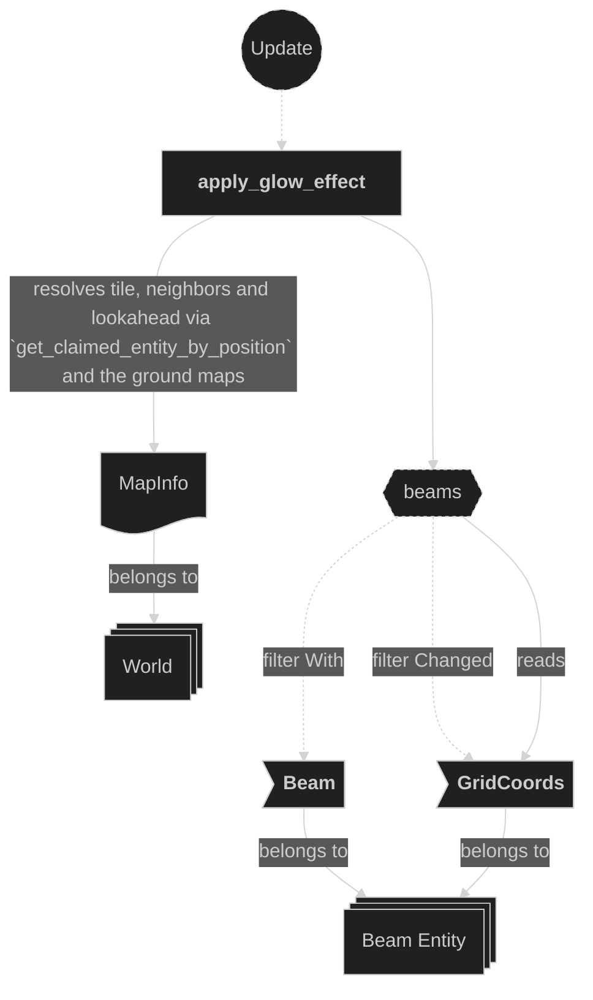
```mermaid
---
config:
  theme: dark
---

flowchart TD
classDef system-group stroke-dasharray: 5 5
classDef query stroke-dasharray: 3 3

update(("`Update`")):::system-group
apply_glow_effect["`**apply_glow_effect**`"]

update -.-> apply_glow_effect

beams_query{{"`beams`"}}:::query
apply_glow_effect ---> beams_query

beam_entity@{ shape: st-rect, label: "Beam Entity" }

be_beam>"`**Beam**`"] --> |belongs to| beam_entity
be_grid_coords>"`**GridCoords**`"] --> |belongs to| beam_entity

beams_query -..-> |filter With| be_beam
beams_query -..-> |filter Changed| be_grid_coords
beams_query ---> |reads| be_grid_coords

world@{ shape: st-rect, label: "World" }
map_info_res@{ shape: doc, label: "MapInfo" }
map_info_res --> |belongs to| world
apply_glow_effect ---> |resolves tile, neighbors and lookahead via `get_claimed_entity_by_position` and the ground maps| map_info_res
```

### Write GlowPulses (apply_glow_effect)

Used in the following systems:
- **apply_glow_effect**: follows `LitOverlayLink` from the tile and the floor cell, and adds pulses to the overlay's `GlowPulses`.

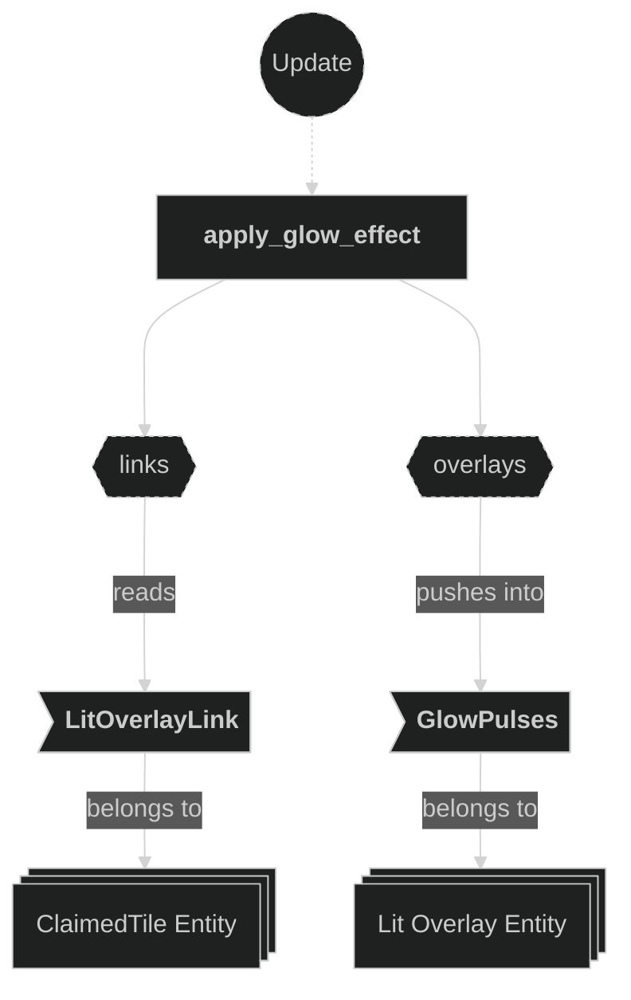
```mermaid
---
config:
  theme: dark
---

flowchart TD
classDef system-group stroke-dasharray: 5 5
classDef query stroke-dasharray: 3 3

update(("`Update`")):::system-group
apply_glow_effect["`**apply_glow_effect**`"]

update -.-> apply_glow_effect

links_query{{"`links`"}}:::query
overlays_query{{"`overlays`"}}:::query
apply_glow_effect ---> links_query
apply_glow_effect ---> overlays_query

tile_entity@{ shape: st-rect, label: "ClaimedTile Entity" }
te_link>"`**LitOverlayLink**`"] --> |belongs to| tile_entity
links_query ---> |reads| te_link

overlay_entity@{ shape: st-rect, label: "Lit Overlay Entity" }
oe_pulses>"`**GlowPulses**`"] --> |belongs to| overlay_entity
overlays_query ---> |pushes into| oe_pulses
```

### Read BeamParried messages

Used in the following systems:
- **request_parry_scale_effect**: finds the sprite child of the parrier and writes a `ScalePunch` request.

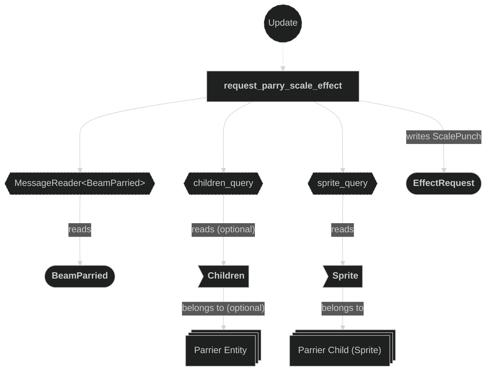
```mermaid
---
config:
  theme: dark
---

flowchart TD
classDef system-group stroke-dasharray: 5 5
classDef reader stroke-dasharray: 3 3
classDef query stroke-dasharray: 3 3

update(("`Update`")):::system-group
request_parry_scale_effect["`**request_parry_scale_effect**`"]

update -.-> request_parry_scale_effect

message_reader{{"MessageReader#60;BeamParried#62;"}}:::reader
request_parry_scale_effect ---> message_reader

beam_parried_message(["`**BeamParried**`"])

message_reader ---> |reads| beam_parried_message

children_query{{"`children_query`"}}:::query
sprite_query{{"`sprite_query`"}}:::query
request_parry_scale_effect ---> children_query
request_parry_scale_effect ---> sprite_query

parrier_entity@{ shape: st-rect, label: "Parrier Entity" }
pe_children>"`**Children**`"] --> |"belongs to (optional)"| parrier_entity
children_query ---> |"reads (optional)"| pe_children

sprite_entity@{ shape: st-rect, label: "Parrier Child (Sprite)" }
se_sprite>"`**Sprite**`"] --> |belongs to| sprite_entity
sprite_query ---> |reads| se_sprite

effect_request(["`**EffectRequest**`"])
request_parry_scale_effect ---> |writes ScalePunch| effect_request
```

### Read EffectRequest and spawn drivers (resolve_effect_requests)

Used in the following systems:
- **resolve_effect_requests**: finds the running driver of each player and channel, then starts, replaces or updates drivers.

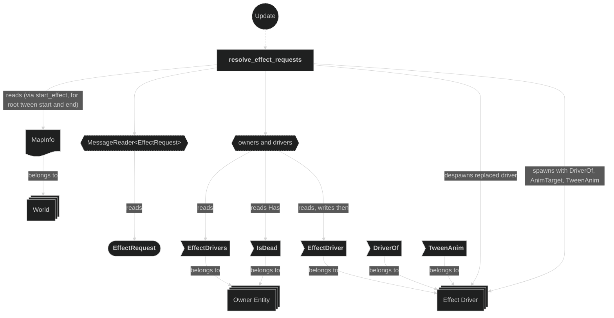
```mermaid
---
config:
  theme: dark
---

flowchart TD
classDef system-group stroke-dasharray: 5 5
classDef reader stroke-dasharray: 3 3
classDef query stroke-dasharray: 3 3

update(("`Update`")):::system-group
resolve_effect_requests["`**resolve_effect_requests**`"]

update -.-> resolve_effect_requests

request_reader{{"MessageReader#60;EffectRequest#62;"}}:::reader
resolve_effect_requests ---> request_reader

effect_request(["`**EffectRequest**`"])
request_reader ---> |reads| effect_request

owner_query{{"`owners and drivers`"}}:::query
resolve_effect_requests ---> owner_query

owner_entity@{ shape: st-rect, label: "Owner Entity" }
oe_drivers>"`**EffectDrivers**`"] --> |belongs to| owner_entity
oe_dead>"`**IsDead**`"] --> |belongs to| owner_entity
owner_query ---> |reads| oe_drivers
owner_query ---> |reads Has| oe_dead

driver_entity@{ shape: st-rect, label: "Effect Driver" }
de_driver>"`**EffectDriver**`"] --> |belongs to| driver_entity
de_link>"`**DriverOf**`"] --> |belongs to| driver_entity
de_tween>"`**TweenAnim**`"] --> |belongs to| driver_entity

owner_query ---> |reads, writes then| de_driver

world@{ shape: st-rect, label: "World" }
map_info_res@{ shape: doc, label: "MapInfo" }
map_info_res --> |belongs to| world
resolve_effect_requests ---> |"reads (via start_effect, for root tween start and end)"| map_info_res

resolve_effect_requests ---> |despawns replaced driver| driver_entity
resolve_effect_requests ---> |spawns with DriverOf, AnimTarget, TweenAnim| driver_entity
```

### Read AnimCompletedEvent (on_effect_completed)

Used in the following systems:
- **on_effect_completed**: despawns the finished driver, starts its `then` effect, and hides the player after a `DeathBounce`.

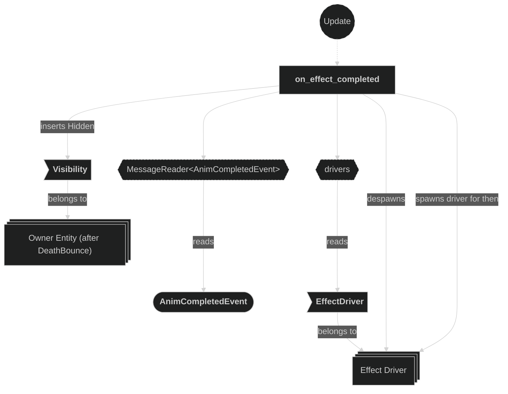
```mermaid
---
config:
  theme: dark
---

flowchart TD
classDef system-group stroke-dasharray: 5 5
classDef reader stroke-dasharray: 3 3
classDef query stroke-dasharray: 3 3

update(("`Update`")):::system-group
on_effect_completed["`**on_effect_completed**`"]

update -.-> on_effect_completed

event_reader{{"MessageReader#60;AnimCompletedEvent#62;"}}:::reader
on_effect_completed ---> event_reader

anim_completed_event(["`**AnimCompletedEvent**`"])
event_reader ---> |reads| anim_completed_event

driver_query{{"`drivers`"}}:::query
on_effect_completed ---> driver_query

driver_entity@{ shape: st-rect, label: "Effect Driver" }
de_driver>"`**EffectDriver**`"] --> |belongs to| driver_entity
driver_query ---> |reads| de_driver

on_effect_completed ---> |despawns| driver_entity
on_effect_completed ---> |spawns driver for then| driver_entity

owner_entity@{ shape: st-rect, label: "Owner Entity (after DeathBounce)" }
oe_visibility>"`**Visibility**`"] --> |belongs to| owner_entity
on_effect_completed ---> |inserts Hidden| oe_visibility
```

### Query EffectDriver entities (clear_root_effect_drivers)

Used in the following systems:
- **clear_root_effect_drivers**: despawns every driver on the `RootTranslation` channel.

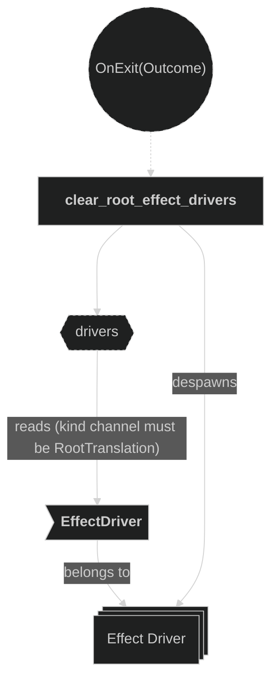
```mermaid
---
config:
  theme: dark
---

flowchart TD
classDef system-group stroke-dasharray: 5 5
classDef query stroke-dasharray: 3 3

exit_outcome(("`OnExit(Outcome)`")):::system-group
clear_root_effect_drivers["`**clear_root_effect_drivers**`"]

exit_outcome -.-> clear_root_effect_drivers

driver_query{{"`drivers`"}}:::query
clear_root_effect_drivers ---> driver_query

driver_entity@{ shape: st-rect, label: "Effect Driver" }
de_driver>"`**EffectDriver**`"] --> |belongs to| driver_entity

driver_query ---> |"reads (kind channel must be RootTranslation)"| de_driver
clear_root_effect_drivers ---> |despawns| driver_entity
```

### SpriteLitOverlay and TilemapLitOverlay lifecycle

- `SpriteLitOverlay` is the lit overlay of a claimed tile. `TilemapLitOverlay` is the lit overlay of a floor cell, a child of the ground tilemap.
- **Spawned** once per tile or cell, hidden and with no pulses. The tile or cell gets `LitOverlayLink(overlay)`.
- **Fed** by `apply_glow_effect`, which adds `GlowPulse` values.
- **Updated** by `update_lit_overlays` (alpha and visibility). `sync_lit_overlay_frames` copies the tile frame, for `SpriteLitOverlay` only.
- **Reset** on exit of `Playing` by `clear_glow`. An overlay is never despawned.
- `LitAtlases` is a resource of this plugin. It holds the `tiles` and `ground` lit images, their source images, the shared floor atlas layout, and the `(lightness, chroma)` pair each image was built with.

```mermaid
---
config:
  theme: dark
---

flowchart TD
classDef system-group stroke-dasharray: 5 5

update(("`Update`")):::system-group
post_update(("`PostUpdate`")):::system-group
state_transition(("`OnExit(Playing)`")):::system-group

spawn_sprite_lit_overlays["`**spawn_sprite_lit_overlays**`"]
spawn_tilemap_lit_overlays["`**spawn_tilemap_lit_overlays**`"]
build_lit_atlas["`**build_lit_atlas**`"]
apply_glow_effect["`**apply_glow_effect**`"]
update_lit_overlays["`**update_lit_overlays**`"]
sync_lit_overlay_frames["`**sync_lit_overlay_frames**`"]
clear_glow["`**clear_glow**`"]

update -.-> spawn_sprite_lit_overlays
update -.-> spawn_tilemap_lit_overlays
update -.-> build_lit_atlas
update -.-> apply_glow_effect
update -.-> update_lit_overlays
post_update -.-> sync_lit_overlay_frames
state_transition -.-> clear_glow

overlay_entity@{ shape: st-rect, label: "Lit Overlay" }
tile_entity@{ shape: st-rect, label: "ClaimedTile (Sprite)" }
lit_image@{ shape: doc, label: "Lit Image" }

spawn_sprite_lit_overlays ---> |spawns child, links| overlay_entity
spawn_tilemap_lit_overlays ---> |spawns tilemap child, links| overlay_entity
build_lit_atlas ---> |inserts lit pixels| lit_image
apply_glow_effect ---> |pushes pulses| overlay_entity
update_lit_overlays ---> |sets alpha, visibility| overlay_entity
sync_lit_overlay_frames ---> |copies atlas index from| tile_entity
sync_lit_overlay_frames ---> |writes index| overlay_entity
clear_glow ---> |clears pulses, hides| overlay_entity
```

### EffectDriver component lifecycle

- `EffectDriver { kind, then }` is on a driver entity. Its `TweenAnim` animates another component through `AnimTarget`. So several effects can play on one sprite.
- **Spawned** by `start_effect`, from the resolver or from `on_effect_completed` for a queued `then`. A position tween is built at this moment.
- **Replaced** when a new effect on the same channel gets `Replace`. A new hit, parry or knockback restarts the tween.
- **Updated** when a request is queued: only `then` changes.
- **Despawned** when its tween ends (`on_effect_completed`). Its queued `then` starts at this moment.
- **Despawned** on exit of `Outcome` (`clear_root_effect_drivers`), for position drivers only. Sprite drivers stay.

```mermaid
---
config:
  theme: dark
---

flowchart TD
classDef system-group stroke-dasharray: 5 5

update(("`Update`")):::system-group
exit_outcome(("`OnExit(Outcome)`")):::system-group

request_parry_scale_effect["`**request_parry_scale_effect**`"]
request_damage_effect["`**request_damage_effect**`"]
request_translate_effect["`**request_translate_effect**`"]
request_settle_effect["`**request_settle_effect**`"]
request_knockback_effect["`**request_knockback_effect**`"]
request_death_effect["`**request_death_effect**`"]
on_effect_completed["`**on_effect_completed**`"]
resolve_effect_requests["`**resolve_effect_requests**`"]
clear_root_effect_drivers["`**clear_root_effect_drivers**`"]

update -.-> request_parry_scale_effect
update -.-> request_damage_effect
update -.-> request_translate_effect
update -.-> request_settle_effect
update -.-> request_knockback_effect
update -.-> request_death_effect
update -.-> on_effect_completed
update -.-> resolve_effect_requests
exit_outcome -.-> clear_root_effect_drivers

effect_request(["`**EffectRequest**`"])
driver_entity@{ shape: st-rect, label: "Effect Driver" }
sprite_entity@{ shape: st-rect, label: "Owner Child (Sprite, Transform)" }
player_entity@{ shape: st-rect, label: "Player Entity (Transform)" }

request_parry_scale_effect ---> |writes ScalePunch| effect_request
request_damage_effect ---> |writes DamageFlash| effect_request
request_translate_effect ---> |writes Translate| effect_request
movement_stopped_message(["`**MovementStopped**`"])
movement_stopped_message ---> |read by| request_settle_effect
request_settle_effect ---> |writes Settle| effect_request
entity_knocked_back_message(["`**EntityKnockedBack**`"])
entity_knocked_back_message ---> |read by| request_knockback_effect
request_knockback_effect ---> |writes Knockback| effect_request
request_death_effect ---> |writes DeathBounce| effect_request
effect_request ---> |read by| resolve_effect_requests
resolve_effect_requests ---> |spawns or replaces| driver_entity
driver_entity ---> |animates sprite effects via AnimTarget| sprite_entity
driver_entity ---> |animates root effects via AnimTarget| player_entity
on_effect_completed ---> |despawns on AnimCompletedEvent, starts then| driver_entity
on_effect_completed ---> |hides after DeathBounce| player_entity
clear_root_effect_drivers ---> |despawns root drivers| driver_entity
```
