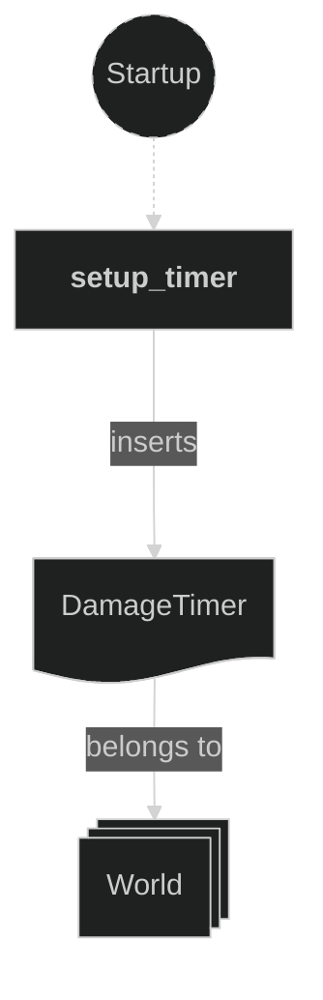
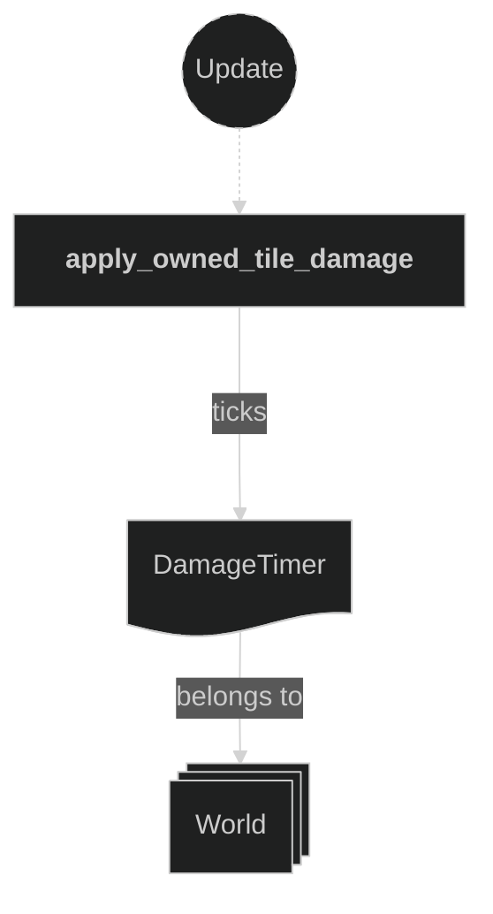
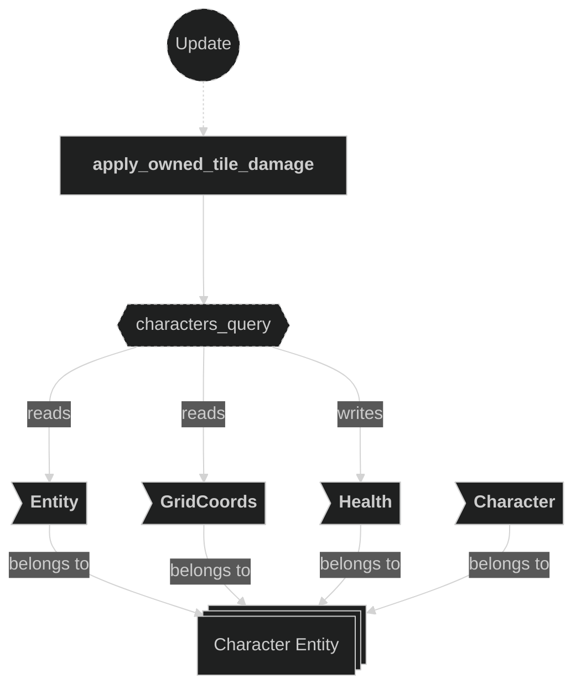
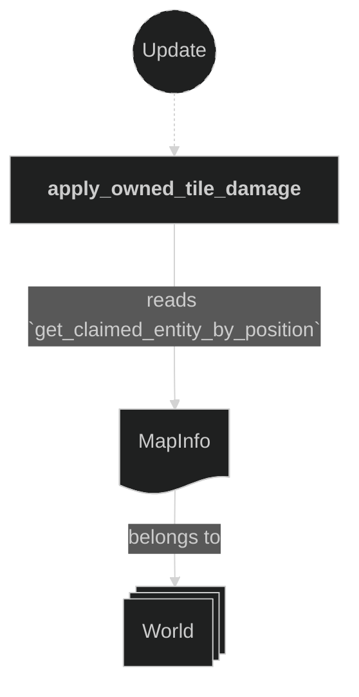
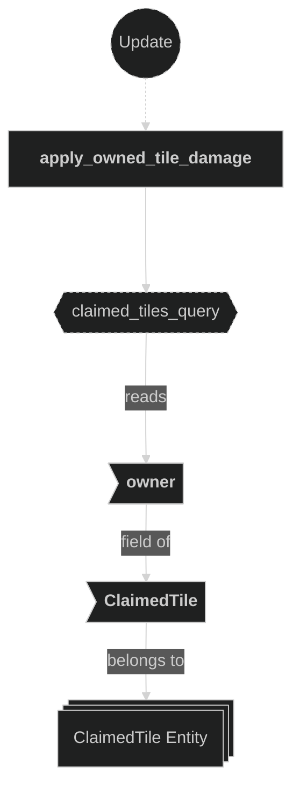
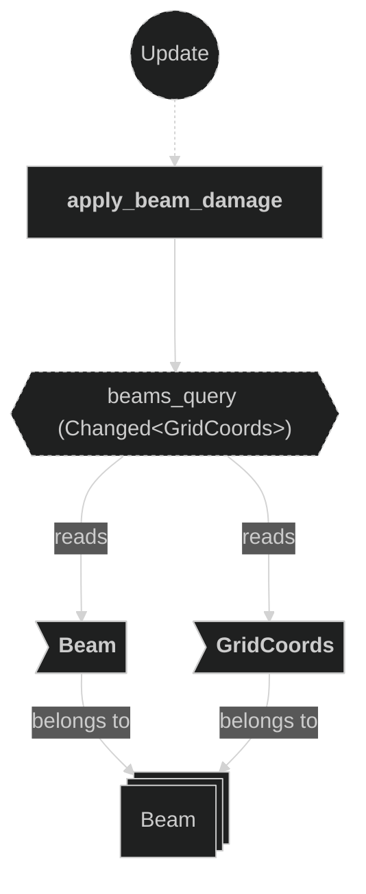
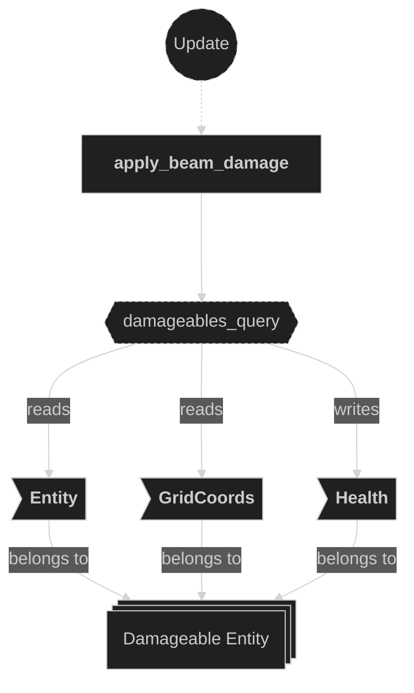
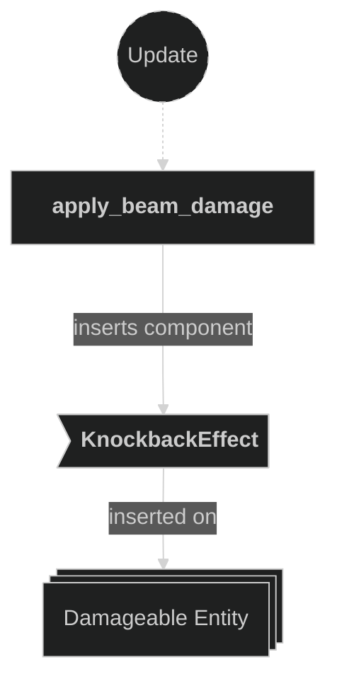
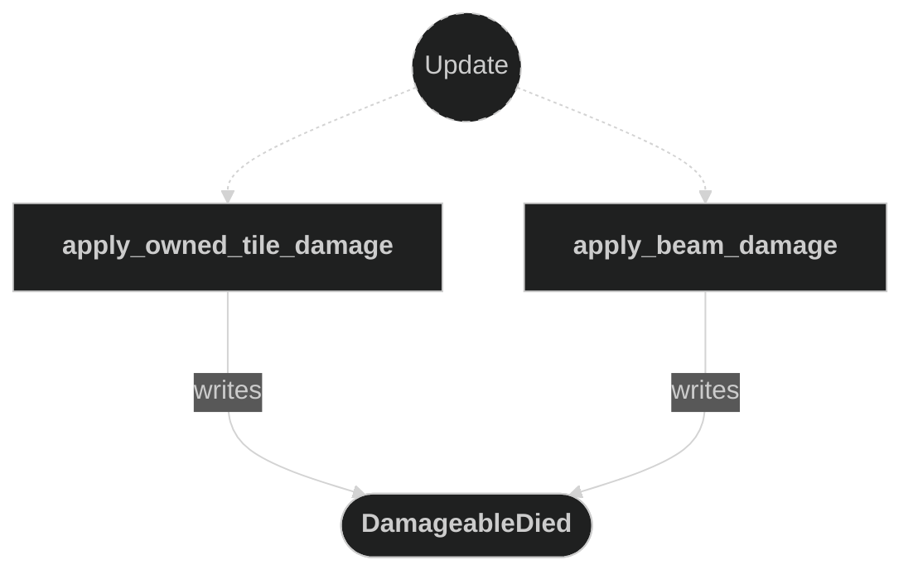

# Damage Plugin

Contains systems responsible for dealing damage to entities and emitting `DamageableDied` messages when an entity's HP reaches zero. Two sources of damage are handled: periodic tile damage for characters standing on an opponent-owned tile, and per-step beam damage for any entity sharing a grid position with a moving beam. A private `deal_damage` helper centralises the decrement-and-emit logic used by both sources.

## Plugin workflow

- Startup phase
    - `setup_timer` inserts the `DamageTimer` resource (500 ms repeating).
- Update phase
    - Apply Owned Tile Damage:
        - Runs every `DamageTimer` tick (500 ms)
            - Reads:
                - `DamageTimer` resource (for tick gating)
                - `GridCoords` and `Health` on `Character` entities
                - `ClaimedTile` component on ground tile entities (to identify the owner)
                - `MapInfo` resource (to resolve a `GridCoords` → claimed tile entity)
            - Writes:
                - Decrements `Health::current` on characters standing on an opponent-owned tile
                - Writes a `DamageableDied` message if `Health::current` drops to zero
    - Apply Beam Damage:
        - Triggers when any `Beam` entity's `GridCoords` changes (i.e. each beam step)
            - Reads:
                - `Beam.owner`, `Beam.direction`, and `GridCoords` on beam entities (filtered by `Changed<GridCoords>`)
                - `Entity`, `GridCoords`, and `Health` on all damageable entities
            - Writes:
                - Decrements `Health::current` on any entity whose `GridCoords` matches the beam head, excluding the beam's owner
                - Writes a `DamageableDied` message if `Health::current` drops to zero
                - Inserts a `KnockbackEffect` (direction = opposite of beam direction) on the hit entity

## Plugin Systems

### Setup Timer

Runs once at startup. Inserts the `DamageTimer` resource — a repeating `Timer` with a 500 ms period — that gates how frequently tile damage is applied.

### Apply Owned Tile Damage

Runs every `DamageTimer` tick. Iterates over all `Character` entities with `Health` and checks whether their current `GridCoords` maps to a `ClaimedTile` owned by a different entity. If so, calls `deal_damage` to decrement `Health::current` by 1 and emit `DamageableDied` if the entity is now dead. Entities with `Health::current <= 0` are skipped up front so already-dead entities do not generate duplicate death messages.

### Apply Beam Damage

Triggered by Bevy's `Changed<GridCoords>` filter — runs only for beam entities whose position changed this frame (i.e. each beam step). For every such beam, iterates all entities with `Health`, skipping dead entities and the beam's own owner, and calls `deal_damage` for any whose `GridCoords` matches the beam head position. On a hit, also inserts a `KnockbackEffect` component on the damaged entity (direction = `-beam.direction`) so the effects plugin can push the entity one tile back and play the slide+bounce animation.

### deal_damage (helper)

Private helper, not a system. Decrements `Health::current` by the given `amount` and, if the result is ≤ 0, writes a `DamageableDied` message via the provided `MessageWriter`. Both `apply_owned_tile_damage` and `apply_beam_damage` delegate to this function to avoid duplicating the decrement-and-emit pattern.

## Components, Resources and Messages CRUD

### Insert DamageTimer resource

Used in the following systems:
- **setup_timer**: inserts the `DamageTimer` resource at startup

### Read/Write DamageTimer resource

Used in the following systems:
- **apply_owned_tile_damage**: ticks the timer and gates damage application to every 500 ms

### Query Character entities (tile damage)

Used in the following systems:
- **apply_owned_tile_damage**: reads `GridCoords` to locate the tile, writes `Health::current` to apply damage

### Read MapInfo resource

Used in the following systems:
- **apply_owned_tile_damage**: resolves a `GridCoords` to the claimed tile entity via `get_claimed_entity_by_position`

### Query ClaimedTile (tile damage)

Used in the following systems:
- **apply_owned_tile_damage**: reads `ClaimedTile::owner` to determine whether the standing tile belongs to a different entity

### Query Beam entities (beam damage)

Used in the following systems:
- **apply_beam_damage**: reads `Beam.owner` and `GridCoords` on beam entities whose position changed this frame

### Query damageable entities (beam damage)

Used in the following systems:
- **apply_beam_damage**: reads `GridCoords` to compare with beam head; writes `Health::current` to apply damage

### Write KnockbackEffect (beam damage)

Used in the following systems:
- **apply_beam_damage**: inserts `KnockbackEffect` on the hit entity so the effects plugin slides and bounces it one tile opposite to the beam direction

### Write DamageableDied messages

Used in the following systems:
- **apply_owned_tile_damage**: emits `DamageableDied` when a character's HP reaches zero on an opponent-owned tile
- **apply_beam_damage**: emits `DamageableDied` when an entity's HP reaches zero after a beam hit

