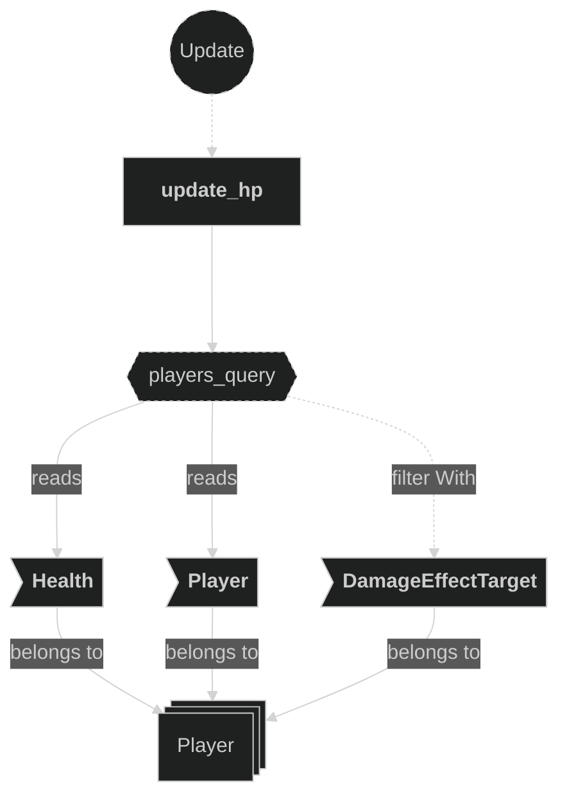
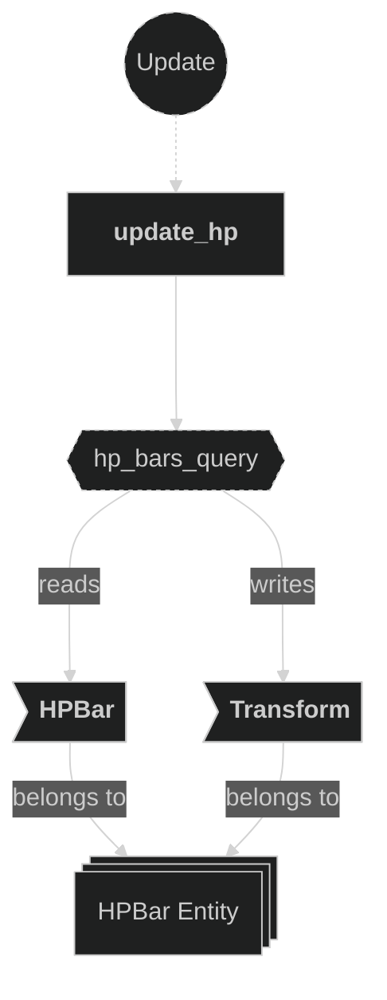
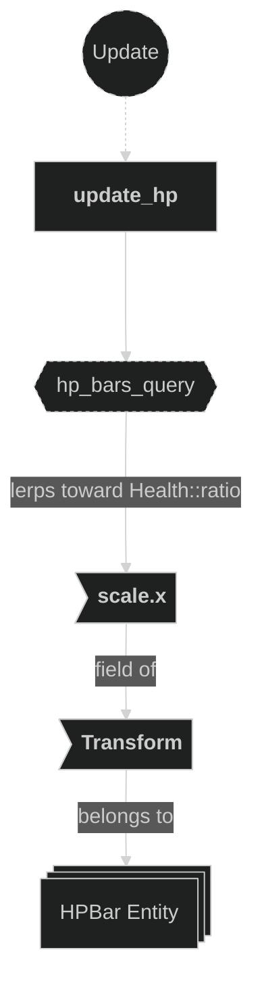

# HUD Plugin

Contains the system responsible for keeping the heads-up display in sync with player health. Each frame, the plugin reads each player's current `Health` and lerps the corresponding `HPBar` entity's `Transform::scale.x` toward `Health::ratio()`, providing a smooth animated HP bar that shrinks as the player takes damage.

## Plugin workflow

- Update phase
    - `update_hp`:
        - Runs every frame
            - Reads:
                - All `Player`-marked `DamageEffectTarget` entities with their `Health` and `Player` components
                - All `HPBar` entities with their `HPBar` and `Transform` components
            - Writes:
                - Lerps `Transform::scale.x` on each matching `HPBar` entity toward `Health::ratio()` for the corresponding player

## Plugin Systems

### Update HP

Runs every frame. Queries all player entities that carry `DamageEffectTarget`, reading their `Health` and `Player` components. For each player, it finds the matching `HPBar` entity by `player_id` and lerps the bar's `Transform::scale.x` toward `Health::ratio()` (a value in the range `[0.0, 1.0]` representing remaining health as a fraction of maximum). The lerp is applied each frame, giving the bar a smooth animated transition rather than an instant snap.

## Components, Resources and Messages CRUD

### Query Player entities (health)

Used in the following systems:
- **update_hp**: reads `Health` and `Player` components on `DamageEffectTarget`-marked entities to determine the current health ratio for each player

### Query HPBar entities

Used in the following systems:
- **update_hp**: reads the `HPBar` component (to match against player id) and writes `Transform::scale.x` to reflect the current health ratio

### Write HPBar Transform (scale)

Used in the following systems:
- **update_hp**: lerps `Transform::scale.x` on the matching `HPBar` entity toward the player's `Health::ratio()` each frame

