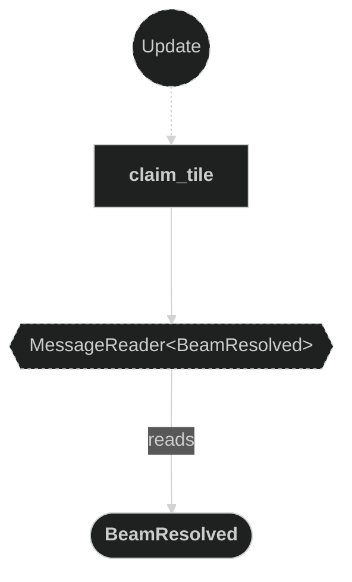
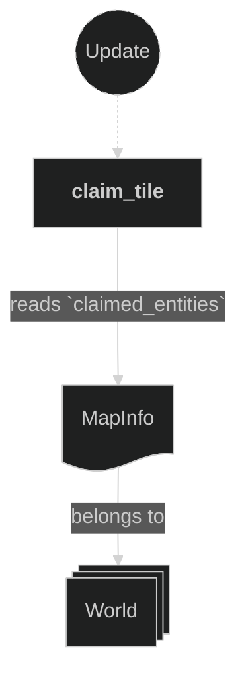
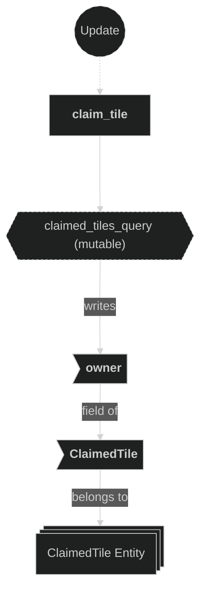
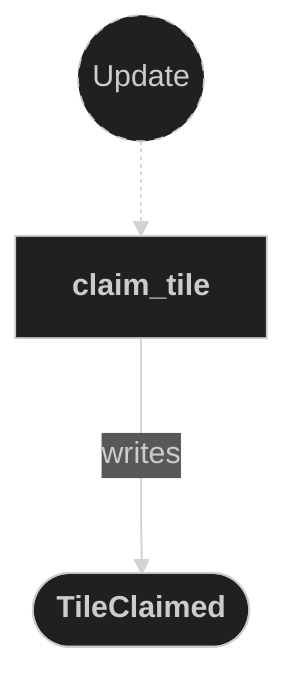

# Claim Plugin

Owns the authoritative tile-ownership write. When a beam stops, the Beam plugin emits a `BeamResolved` message with the landing position and firing player; this plugin reads that message, mutates the matching `ClaimedTile::owner`, and emits `TileClaimed` to record the flip. Splitting this out of the Beam plugin turns `BeamResolved` into a genuine inter-plugin message (beam writes it, claim reads it) rather than an intra-plugin self-loop, and gives the `ClaimedTile::owner` mutation a single home — the chokepoint that future claim-side ability resolvers (`on_resolve` / `on_claim`) attach to.

The only coupling to the Beam plugin is the `BeamResolved` message: this plugin never queries `Beam` entities. It is registered immediately after the Beam plugin in `AppPlugin`.

## Plugin workflow

- Update phase
    - Claim Tile:
        - Reacts to `BeamResolved` message
            - Reads:
                - `BeamResolved` message fields (`position`, `owner`)
                - `MapInfo` resource (to resolve `GridCoords` → claimed tile `Entity` via `claimed_entities`)
            - Writes:
                - Mutates `ClaimedTile::owner` on the matched entity in `MapInfo::claimed_entities`
                - Emits a `TileClaimed` message (`position`, `old_owner`, `new_owner`) recording the ownership flip

## Plugin Systems

### Claim Tile

Reads `BeamResolved` messages. For each message, looks up the corresponding claimed tile entity from `MapInfo::claimed_entities` using the message's `GridCoords` position, then mutates `ClaimedTile::owner` on that entity to record the new owning player and emits a `TileClaimed` message capturing the `old_owner` (before the write) and `new_owner`. This is the authoritative write that marks a tile as belonging to a player, and is subsequently read by the Animations plugin to switch the tile's visual appearance; `TileClaimed` is the ability-system hook that distinguishes a real ownership flip from a no-op resolve (no consumers yet).

## Components, Resources and Messages CRUD

### Read BeamResolved messages

Used in the following systems:
- **claim_tile**: used to trigger tile ownership mutation when a beam stops

### Read MapInfo resource (claim tile)

Used in the following systems:
- **claim_tile**: used to look up the claimed tile entity via `MapInfo::claimed_entities` for the resolved `GridCoords`

### Write ClaimedTile (claim tile)

Used in the following systems:
- **claim_tile**: mutates `ClaimedTile::owner` on the matched claimed tile entity to record the new owning player

### Write TileClaimed messages

Used in the following systems:
- **claim_tile**: emits a `TileClaimed` message (`position`, `old_owner`, `new_owner`) whenever a tile's ownership is set, recording the flip for ability resolvers (no consumers yet)

