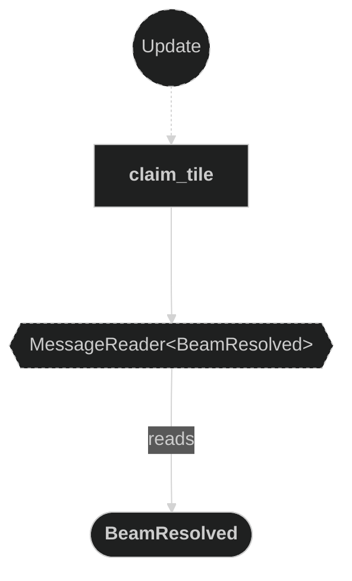
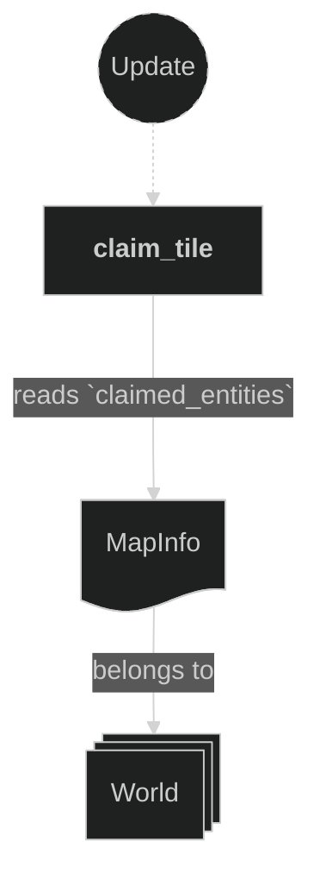
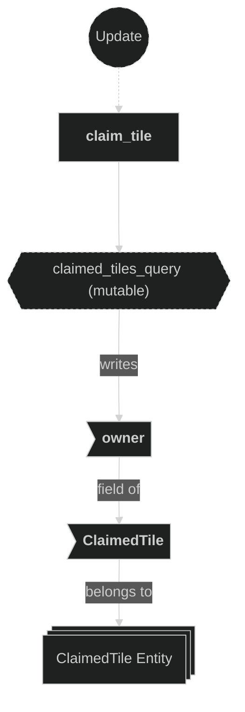
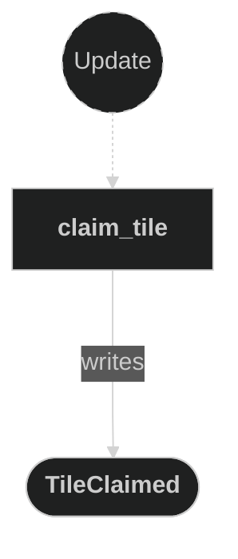
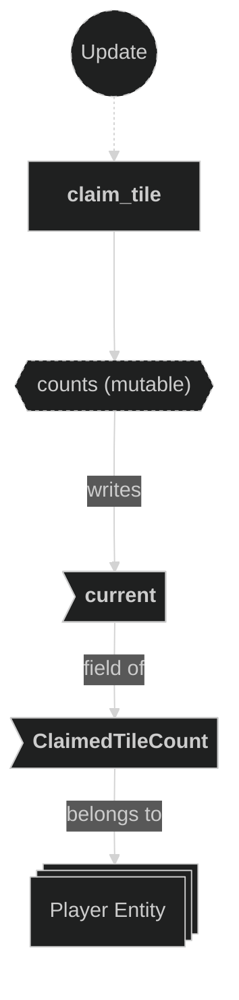

# Claim Plugin

Owns the authoritative tile-ownership write. When a beam stops, the Beam plugin emits `BeamResolved` (landing position, firing player); this plugin reads it, mutates the matching `ClaimedTile::owner`, and emits `TileClaimed` to record the flip. Splitting this from the Beam plugin gives `ClaimedTile::owner` a single write site — the chokepoint future claim-side ability resolvers (`on_resolve`/`on_claim`) will attach to.

The only coupling to the Beam plugin is the `BeamResolved` message: this plugin never queries `Beam` entities. It is registered immediately after the Beam plugin in `AppPlugin`, and `claim_tile` runs in `GameplaySet::Claim`, which the shared `GameplaySet` chain (`schedule.rs`) orders after `GameplaySet::Beam` — so a `BeamResolved` written this frame is folded into `ClaimedTile::owner`/`ClaimedTileCount` before anything reading them later that same frame (the Charge plugin's regen/cap pair, the HUD's territory and charges bars).

## Plugin workflow

- Update phase
    - Claim Tile (`in_set(GameplaySet::Claim)`):
        - Reacts to `BeamResolved` message
            - Reads:
                - `BeamResolved` message fields (`position`, `owner`)
                - `MapInfo` resource (to resolve `GridCoords` → claimed tile `Entity` via `claimed_entities`)
            - Writes:
                - Mutates `ClaimedTile::owner` on the matched entity in `MapInfo::claimed_entities`
                - On a real flip (owner actually changes), increments the new owner's `ClaimedTileCount` and decrements the previous owner's (if any)
                - Emits a `TileClaimed` message (`position`, `old_owner`, `new_owner`) recording the ownership flip

## Plugin Systems

### Claim Tile

Reads `BeamResolved` messages. For each, looks up the claimed tile entity from `MapInfo::claimed_entities` by the message's `GridCoords`, mutates `ClaimedTile::owner` to the new owner, and emits `TileClaimed` (`old_owner`, `new_owner`). The Animations plugin reads the ownership change to switch the tile's sprite; `TileClaimed` is the ability-system hook for a real flip vs. a no-op resolve (no consumers yet).

The same system keeps each player's `ClaimedTileCount` in sync: on a real ownership flip it increments the new owner's count and decrements the previous owner's (saturating at zero); a no-op reclaim leaves counts untouched. The HUD plugin reads this count to render each player's claimed-tile percentage.

## Components, Resources and Messages CRUD

### Read BeamResolved messages

Used in the following systems:
- **claim_tile**: used to trigger tile ownership mutation when a beam stops

```mermaid
---
config:
  theme: dark
---

flowchart TD
classDef system-group stroke-dasharray: 5 5
classDef reader stroke-dasharray: 3 3

update(("`Update`")):::system-group
claim_tile["`**claim_tile**`"]

update -.-> claim_tile

message_reader{{"MessageReader#60;BeamResolved#62;"}}:::reader
claim_tile ---> message_reader

beam_resolved_message(["`**BeamResolved**`"])

message_reader ---> |reads| beam_resolved_message
```

### Read MapInfo resource (claim tile)

Used in the following systems:
- **claim_tile**: used to look up the claimed tile entity via `MapInfo::claimed_entities` for the resolved `GridCoords`

```mermaid
---
config:
  theme: dark
---

flowchart TD
classDef system-group stroke-dasharray: 5 5

update(("`Update`")):::system-group
claim_tile["`**claim_tile**`"]

update -.-> claim_tile

world@{ shape: st-rect, label: "World" }
map_info_res@{ shape: doc, label: "MapInfo" }

map_info_res --> |belongs to| world

claim_tile ---> |reads `claimed_entities`| map_info_res
```

### Write ClaimedTile (claim tile)

Used in the following systems:
- **claim_tile**: mutates `ClaimedTile::owner` on the matched claimed tile entity to record the new owning player

```mermaid
---
config:
  theme: dark
---

flowchart TD
classDef system-group stroke-dasharray: 5 5
classDef query stroke-dasharray: 3 3

update(("`Update`")):::system-group
claim_tile["`**claim_tile**`"]

update -.-> claim_tile

claimed_tiles_query{{"`claimed_tiles_query (mutable)`"}}:::query
claim_tile ---> claimed_tiles_query

claimed_tile_entity@{ shape: st-rect, label: "ClaimedTile Entity" }

ct_claimed>"`**ClaimedTile**`"] --> |belongs to| claimed_tile_entity
ct_owner>"`**owner**`"] --> |field of| ct_claimed

claimed_tiles_query ---> |writes| ct_owner
```

### Write TileClaimed messages

Used in the following systems:
- **claim_tile**: emits a `TileClaimed` message (`position`, `old_owner`, `new_owner`) whenever a tile's ownership is set, recording the flip for ability resolvers (no consumers yet)

```mermaid
---
config:
  theme: dark
---

flowchart TD
classDef system-group stroke-dasharray: 5 5

update(("`Update`")):::system-group
claim_tile["`**claim_tile**`"]

update -.-> claim_tile

tile_claimed_message(["`**TileClaimed**`"])

claim_tile ---> |writes| tile_claimed_message
```

### Write ClaimedTileCount (claim tile)

Used in the following systems:
- **claim_tile**: on a real ownership flip, increments the new owner's `ClaimedTileCount::current` and decrements the previous owner's (saturating at zero)

```mermaid
---
config:
  theme: dark
---

flowchart TD
classDef system-group stroke-dasharray: 5 5
classDef query stroke-dasharray: 3 3

update(("`Update`")):::system-group
claim_tile["`**claim_tile**`"]

update -.-> claim_tile

counts_query{{"`counts (mutable)`"}}:::query
claim_tile ---> counts_query

player_entity@{ shape: st-rect, label: "Player Entity" }

ctc_count>"`**ClaimedTileCount**`"] --> |belongs to| player_entity
ctc_current>"`**current**`"] --> |field of| ctc_count

counts_query ---> |writes| ctc_current
```
