# HUD Plugin

Owns all HUD animations rendered on the HUD camera (render layer 1): the HP-bar fill (`animate_hp`) and the numeric counters rendered as rolling-odometer digit sprites. For the counters it holds the generic digit-animation machinery (the `DigitAnimations` resource and `initialize_digit_animations` system) plus one `animate_*` system per counter. Every value the HUD displays is maintained by its own domain plugin — player health by the Damage plugin, beam charges by the Beam plugin, claimed-tile count by the Claim plugin — so this plugin never computes or mutates those values; it only reads them and drives the HUD sprites, lerping the HP bar's `Transform` toward the current health ratio and switching each `Digit` entity's `SpritesheetAnimation` to the correct from→to transition clip when the underlying value changes.

It is registered immediately after the Animations plugin in `AppPlugin`.

## Plugin workflow

- Update phase
    - Animate HP:
        - Runs every frame
            - Reads:
                - All `Player`-marked `DamageEffectTarget` entities with their `Health` and `Player` components
                - All `HPBar` entities with their `Player` and `Transform` components
            - Writes:
                - Lerps `Transform::scale.x` on each matching `HPBar` entity toward `Health::ratio()` for the corresponding player (snapping to `0.0` once it drops below `0.001`)
    - Initialize Digit Animations:
        - Reacts to `TiledEvent<ObjectCreated>` message
            - Reads:
                - All `Digit`-marked `TiledObject` entities and their `Entity` components
                - The `Sprite` component on each digit's child sprite entity (to get the image handle)
            - Writes:
                - Builds all 90 from→to transition animation handles (for all `from != to` in `0..10`) using a single `make_anim` closure
                - Inserts `DigitAnimations` resource into the world
                - Inserts `SpritesheetAnimation` on the child sprite entity
    - Animate Beam Charges:
        - Reacts to `Changed<BeamCharges>` on player entities
            - Reads:
                - `Player` and `BeamCharges` components on changed player entities
                - All `BeamChargesDigit`-marked entities with `Player` and `Digit` components
                - `DigitAnimations` resource (optional/`If`)
            - Writes:
                - Computes per-digit target value from `BeamCharges::current` by position (`(current / 10^position) % 10`)
                - Switches `SpritesheetAnimation` on the child sprite entity to the matching from→to transition clip
                - Updates `Digit::value` to the new digit
    - Animate Claimed Tiles:
        - Reacts to `Changed<ClaimedTileCount>` on player entities
            - Reads:
                - `Player` and `ClaimedTileCount` components on changed player entities
                - All `ClaimedTilesDigit`-marked entities with `Player` and `Digit` components
                - `MapInfo` resource (to read `ground_entities` for the total tile count)
                - `DigitAnimations` resource (optional/`If`)
            - Writes:
                - Computes the owned-tile count as a rounded percentage of the whole board (`(current * 100 + total/2) / total`, guarded when `total == 0`)
                - Computes per-digit target value from that percentage by position (`(percent / 10^position) % 10`)
                - Switches `SpritesheetAnimation` on the child sprite entity to the matching from→to transition clip
                - Updates `Digit::value` to the new digit

## Plugin Systems

### Animate HP

Runs every frame. Queries all player entities that carry `DamageEffectTarget`, reading their `Health` and `Player` components. For each player, it finds the matching `HPBar` entity by `player_id` and lerps the bar's `Transform::scale.x` toward `Health::ratio()` (a value in `[0.0, 1.0]`, snapped to `0.0` once it drops below `0.001`), giving the bar a smooth animated transition rather than an instant snap.

### Initialize Digit Animations

Reacts to the `TiledEvent<ObjectCreated>` message for entities carrying a `Digit` component. For each matching entity, walks the hierarchy to find the child sprite entity, reads its image handle to build a `Spritesheet`, then creates all 90 directional transition animation handles (every `from != to` combination in `0..10`) via a single `make_anim` closure. The special 9→0 and 0→9 wrap transitions use non-contiguous frame sequences (`add_cell(39, 2)` + `add_partial_row(2, 0..=3)` played forwards or backwards). All handles are stored in the `DigitAnimations` resource. A `SpritesheetAnimation` is inserted on the child sprite entity.

### Animate Beam Charges

Runs every frame, filtered by `Changed<BeamCharges>`. For each player entity whose `BeamCharges` component changed, iterates all `BeamChargesDigit`-marked entities whose `Player::player_id` matches. For each digit, computes the target value as `(BeamCharges::current / 10^digit.position) % 10`, looks up the from→to transition handle in `DigitAnimations`, then walks the entity's children to find the `SpritesheetAnimation` and switches it to the new clip. Updates `Digit::value` to the new digit value.

### Animate Claimed Tiles

Runs every frame, filtered by `Changed<ClaimedTileCount>`. Reads `MapInfo::ground_entities` to obtain the total number of ground tiles (returning early if that total is zero). For each player entity whose `ClaimedTileCount` changed, computes the owned-tile count as a rounded percentage of the whole board (`(count.current * 100 + total / 2) / total`, giving a value in `0..=100`). It then iterates all `ClaimedTilesDigit`-marked entities whose `Player::player_id` matches, computes each digit's target value as `(percent / 10^digit.position) % 10`, looks up the from→to transition handle in `DigitAnimations`, walks the entity's children to find the `SpritesheetAnimation` and switches it to the new clip, and updates `Digit::value`. It is the digit-display counterpart of `animate_beam_charges`, but renders each player's owned-tile count as a rounded percentage rather than a raw charge count.

## Components, Resources and Messages CRUD

### Read TiledEvent ObjectCreated messages (digits)

Used in the following systems:
- **initialize_digit_animations**: used to trigger animation setup when a digit Tiled object is created

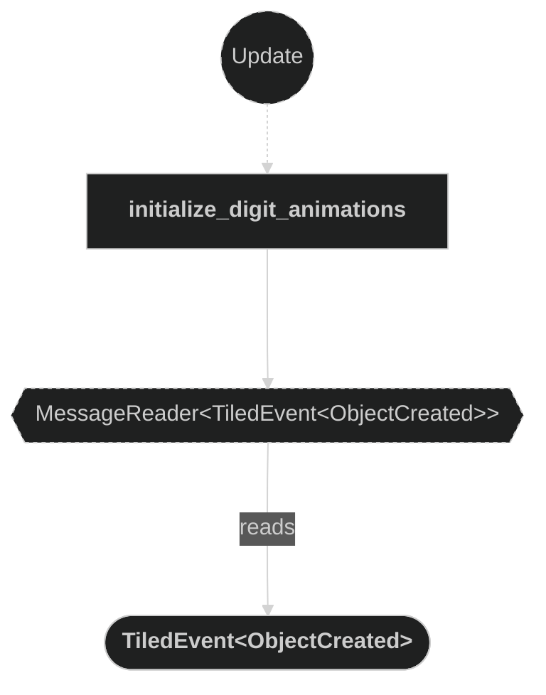

### Query Digit entities (attach)

Used in the following systems:
- **initialize_digit_animations**: detects newly created `Digit`-marked `TiledObject` entities and initializes their animation components

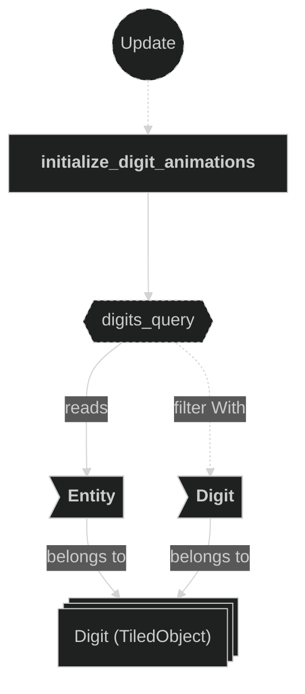

### Query Children hierarchy

Used in the following systems:
- **initialize_digit_animations**: walks descendants via `iter_descendants` to find the child sprite entity
- **animate_beam_charges**: walks descendants via `iter_descendants` to find the child `SpritesheetAnimation`
- **animate_claimed_tiles**: walks descendants via `iter_descendants` to find the child `SpritesheetAnimation`

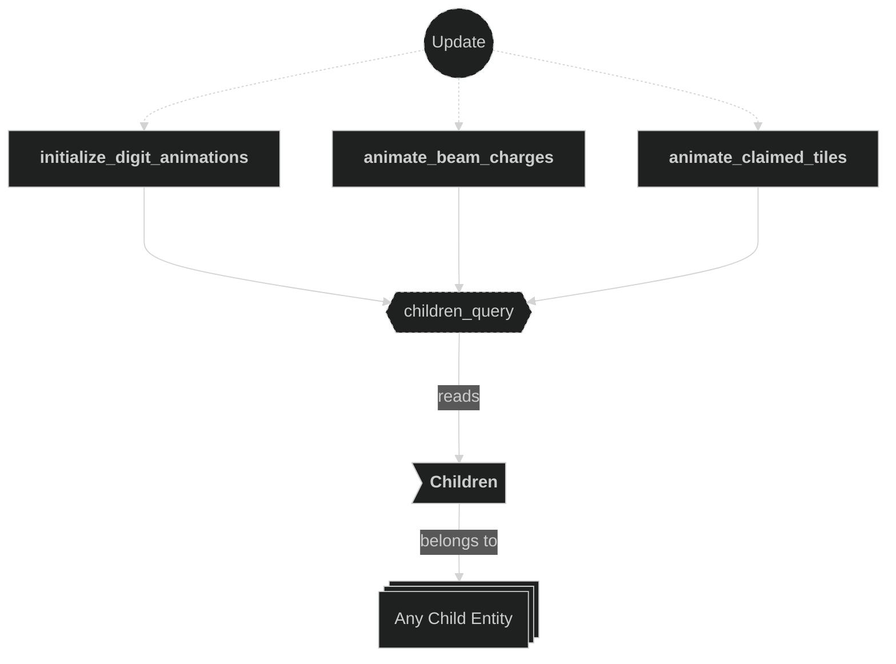

### Query Player entities with Changed\<BeamCharges\>

Used in the following systems:
- **animate_beam_charges**: detects players whose `BeamCharges` component changed this frame to drive digit flip-counter animations

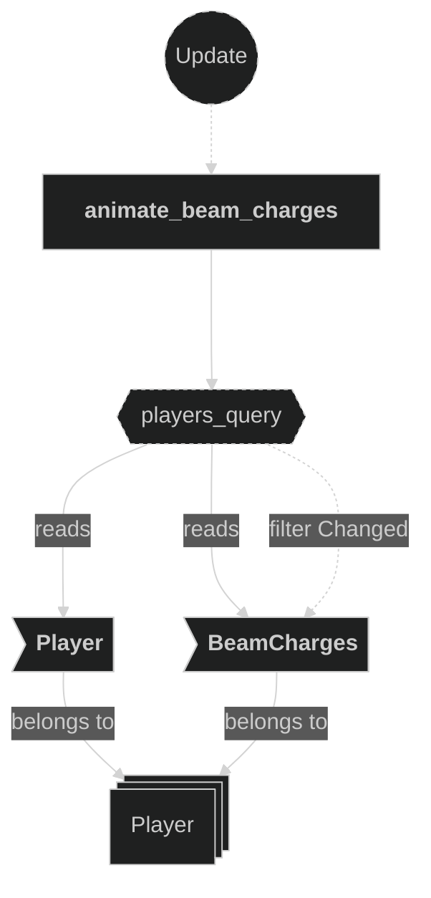

### Query BeamChargesDigit entities (update)

Used in the following systems:
- **animate_beam_charges**: reads `Player::player_id`, `Digit::position`, and mutably updates `Digit::value` for all `BeamChargesDigit`-marked entities matching the changed player

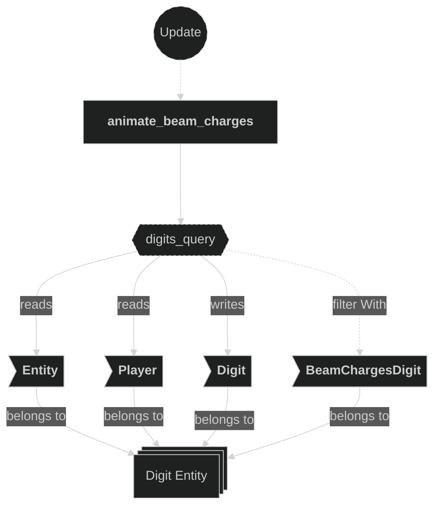

### Query Player entities with Changed\<ClaimedTileCount\>

Used in the following systems:
- **animate_claimed_tiles**: detects players whose `ClaimedTileCount` component changed this frame to drive claimed-tile percentage digit animations

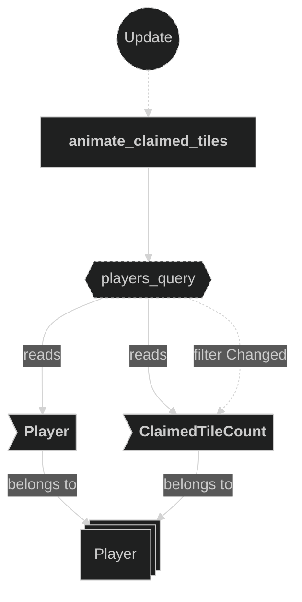

### Query ClaimedTilesDigit entities (update)

Used in the following systems:
- **animate_claimed_tiles**: reads `Player::player_id`, `Digit::position`, and mutably updates `Digit::value` for all `ClaimedTilesDigit`-marked entities matching the changed player

### Read MapInfo resource (claimed tiles)

Used in the following systems:
- **animate_claimed_tiles**: reads `MapInfo::ground_entities` to obtain the total number of ground tiles used to compute the owned-tile percentage

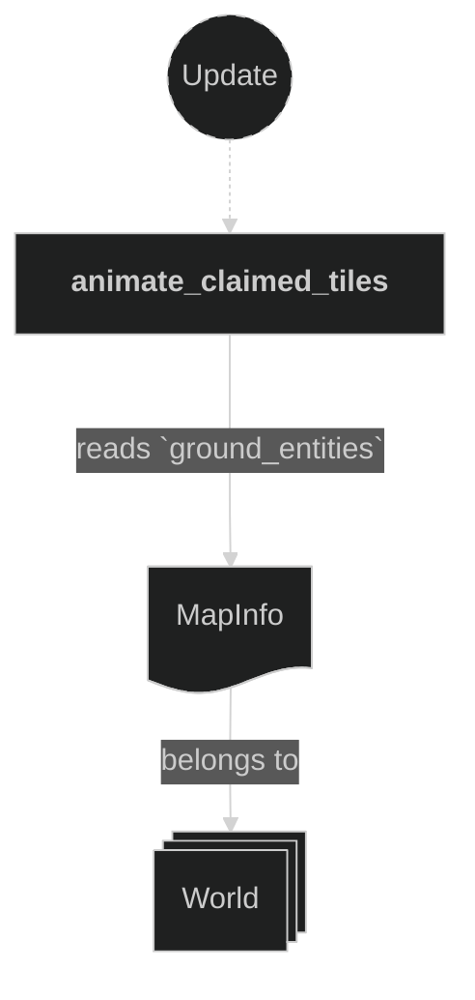

### Read DigitAnimations resource

Used in the following systems:
- **animate_beam_charges**: used to retrieve the from→to transition animation handle for each digit; accessed via `If<Res<...>>` (optional — skipped if not yet inserted)
- **animate_claimed_tiles**: used to retrieve the from→to transition animation handle for each digit; accessed via `If<Res<...>>` (optional — skipped if not yet inserted)

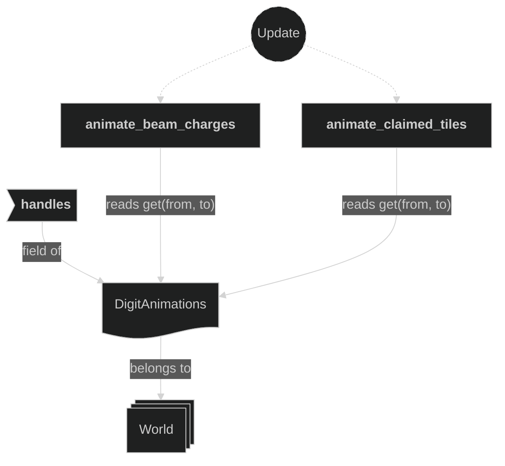

### Write DigitAnimations resource

Used in the following systems:
- **initialize_digit_animations**: builds all 90 from→to transition animation handles and inserts the `DigitAnimations` resource into the world

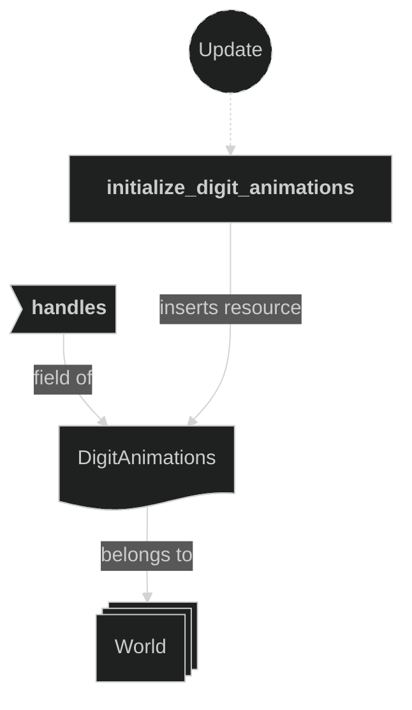

### Write commands (attach digit animations)

Used in the following systems:
- **initialize_digit_animations**: inserts `SpritesheetAnimation` on the child sprite entity of each `Digit` entity

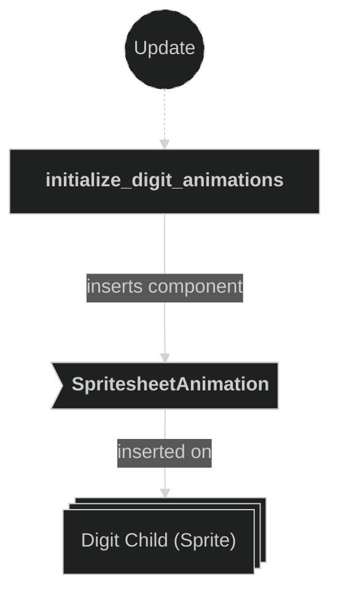

### Write SpritesheetAnimation (update digit)

Used in the following systems:
- **animate_beam_charges**: switches the `SpritesheetAnimation` clip on the digit child sprite entity to the from→to transition clip
- **animate_claimed_tiles**: switches the `SpritesheetAnimation` clip on the digit child sprite entity to the from→to transition clip

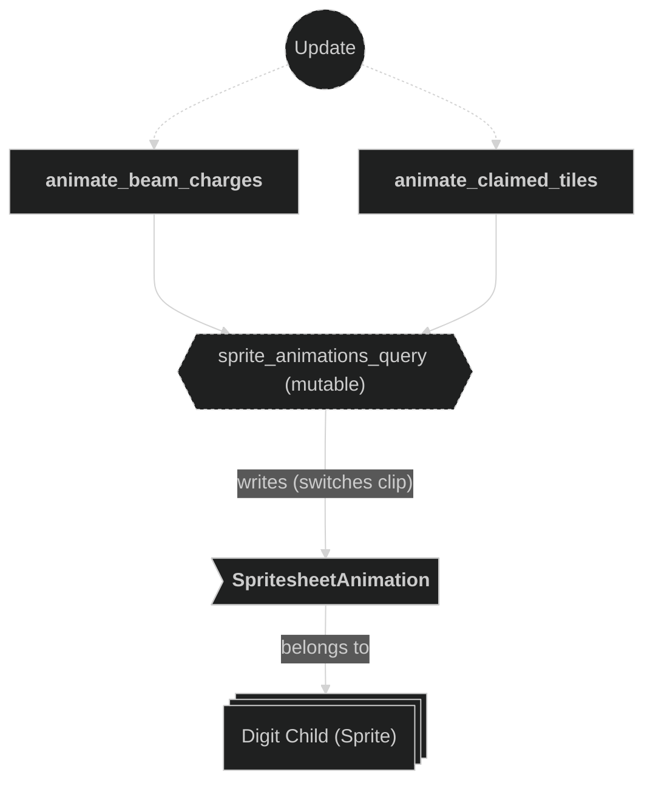

### Query Player entities (health)

Used in the following systems:
- **animate_hp**: reads `Health` and `Player` components on `DamageEffectTarget`-marked entities to determine the current health ratio for each player

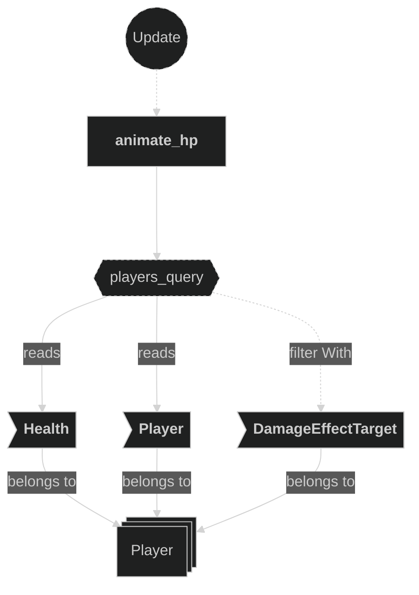

### Query HPBar entities

Used in the following systems:
- **animate_hp**: reads the `Player` component (to match against player id) and writes `Transform::scale.x` to reflect the current health ratio

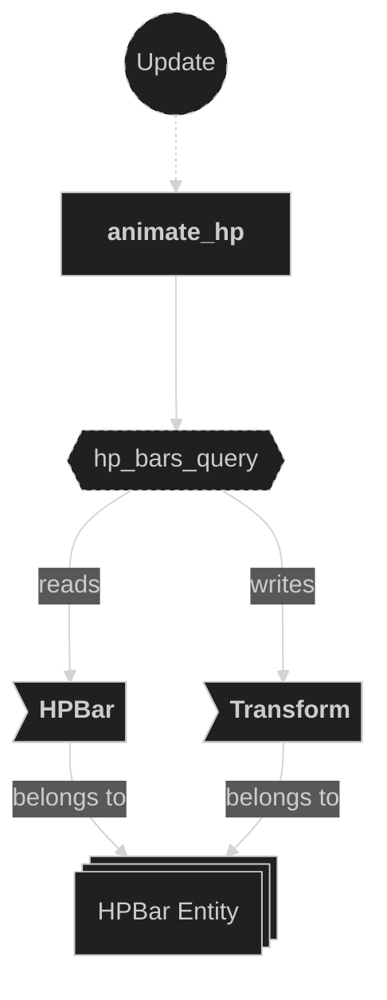
