# HUD Plugin

Owns all HUD animations rendered on the HUD camera (render layer 1): the HP bar (`animate_hp`), its slower-trailing "damage echo" counterpart (`animate_damage_bar`), the territory and charges bars (`animate_territory_bar`, `animate_charges_bar`), and the numeric counters rendered as rolling-odometer digit sprites.

HP/damage bars are independent per-player containers. Territory and charges bars instead share one 432px-wide span per pair (see the Maps plugin doc): P1 grows rightward from its left anchor, P2 grows leftward from its right anchor, together representing 100% of the board. The damage-echo bar holds still for a beat after each hit before resuming, via the `DamageEchoDelay` component (armed by `arm_damage_echo_delay`, ticked down by `tick_damage_echo_delay`). For counters, this plugin holds the generic digit-animation machinery (the `DigitAnimations` resource and `initialize_digit_animations` system) plus one `animate_*` system per counter.

Every value the HUD displays is owned by its own domain plugin — health by Damage, beam charges by Beam, claimed-tile count by Claim, the round countdown by Round — so this plugin only reads them and drives the sprites: nudging each bar's `Transform::scale.x` toward a target ratio via the shared `nudge_bar_for_player` helper (which pixel-snaps the result so the bar edge doesn't shimmer under nearest-neighbor filtering), and switching each `Digit` entity's `SpritesheetAnimation` to the correct from→to transition clip when the underlying value changes.

Registered immediately after the Animations plugin in `AppPlugin`. `animate_territory_bar` and `animate_charges_bar` are registered separately from the rest of this plugin's systems, each carrying an explicit `.after(super::claim::claim_tile)` (and `animate_charges_bar` additionally `.after(super::charge::cap_charges_to_unclaimed_tiles)`), so both bars read this frame's up-to-date `ClaimedTileCount`/`BeamCharges` rather than a value lagging behind the Claim and Charge plugins.

## Plugin workflow

- Update phase (systems run unordered relative to each other — animation systems write `Transform`, delay systems only touch `DamageEchoDelay`, so no races. `animate_territory_bar` and `animate_charges_bar` are the exception, each carrying an explicit cross-plugin `.after(...)` — see below)
    - Animate HP:
        - Runs every frame
            - Reads:
                - All `Player`-marked `DamageEffectTarget` entities with their `Health` and `Player` components
                - All `HPBar` entities with their `Player` and `Transform` components
                - `GameConfig` (`config.animation.hp_bar_decay_rate`) and `Time`
            - Writes:
                - For each player, delegates to the shared `nudge_bar_for_player` helper with that player's `Health::ratio()`, which nudges `Transform::scale.x` on each matching `HPBar` entity toward that ratio via `smooth_nudge` at `hp_bar_decay_rate`, pixel-snaps the result, and snaps to `0.0` once both the ratio and the bar are near zero
    - Animate Damage Bar:
        - Runs every frame
            - Reads:
                - All `Player`-marked `DamageEffectTarget` entities with their `Health` and `Player` components
                - All `DamageBar` entities *not* currently carrying `DamageEchoDelay` (`(With<DamageBar>, Without<DamageEchoDelay>)`), with their `Player` and `Transform` components
                - `GameConfig` (`config.animation.damage_bar_decay_rate`) and `Time`
            - Writes:
                - Identically to Animate HP but at `damage_bar_decay_rate` — a `DamageBar` currently holding `DamageEchoDelay` is excluded by the query filter and does not move at all this frame
    - Animate Territory Bar (registered `.after(claim_tile)` — see below):
        - Runs every frame (not `Changed`-gated — a bar is a continuous tween and must keep moving on unchanged frames or it freezes mid-travel)
            - Reads:
                - All player entities with their `Player` and `ClaimedTileCount` components
                - All `TerritoryBar` entities with their `Player` and `Transform` components
                - `MapInfo` (`ground_entities` for the total tile count; skips entirely if `0`)
                - `GameConfig` (`config.animation.territory_bar_decay_rate`) and `Time`
            - Writes:
                - For each player, computes `ratio = claimed / total` and delegates to `nudge_bar_for_player` to drive that player's `TerritoryBar` toward it
    - Animate Charges Bar (registered `.after(claim_tile)` and `.after(cap_charges_to_unclaimed_tiles)` — see below):
        - Runs every frame (same not-`Changed`-gated reasoning as Animate Territory Bar)
            - Reads:
                - All player entities with their `Player`, `ClaimedTileCount`, `BeamCharges`, and `InFlightBeamCount` components
                - All `ChargesBar` entities with their `Player` and `Transform` components
                - `MapInfo` (`ground_entities` for the total tile count; skips entirely if `0`)
                - `GameConfig` (`config.animation.charges_bar_decay_rate`) and `Time`
            - Writes:
                - For each player, computes `ratio = min(1.0, (claimed + charges + in_flight) / total)` and delegates to `nudge_bar_for_player` to drive that player's `ChargesBar` toward it — `in_flight` comes from `InFlightBeamCount` (synchronously maintained by the Beam plugin) so the bar doesn't dip on every shot and pop back on a hit
    - Arm Damage Echo Delay:
        - Reacts to `Changed<Health>` on `DamageEffectTarget`-marked player entities (this also fires on the initial `Health` insertion at round start, not only on subsequent damage)
            - Reads:
                - `Player` on each changed player entity
                - `Player` on every `DamageBar` entity
                - `GameConfig` (`config.animation.damage_bar_delay_ms`)
            - Writes:
                - For every `DamageBar` whose `Player::player_id` matches a changed player, inserts (or restarts, if already present) a `DamageEchoDelay(Timer)` in `TimerMode::Once` for `damage_bar_delay_ms`
    - Tick Damage Echo Delay:
        - Runs every frame
            - Reads:
                - `Time`
            - Writes:
                - Ticks every entity's `DamageEchoDelay` timer down by `Time::delta()`; once a timer finishes, removes `DamageEchoDelay` from that entity, letting Animate Damage Bar resume moving it next frame
    - Initialize Digit Animations:
        - Reacts to `TiledEvent<ObjectCreated>` message
            - Reads:
                - All `Digit`-marked `TiledObject` entities and their `Entity` components
                - The `Sprite` component on each digit's child sprite entity (to get the image handle)
                - The `GameConfig` resource for the per-frame roll duration (`config.animation.digit_roll_frame_ms`, default `100`)
            - Writes:
                - Builds all 90 from→to transition animation handles (for all `from != to` in `0..10`) using a single `make_anim` closure
                - Inserts `DigitAnimations` resource into the world
                - Inserts `SpritesheetAnimation` on the child sprite entity
    - Animate Beam Charges:
        - Reacts to `Changed<BeamCharges>` on player entities
            - Reads:
                - `Player` and `BeamCharges` components on changed player entities
                - All `BeamChargesDigit`-marked entities with `Player` and `Digit` components
                - `DigitAnimations` resource (optional/`If`)
            - Writes:
                - Computes per-digit target value from `BeamCharges::current` by position (`(current / 10^position) % 10`)
                - Switches `SpritesheetAnimation` on the child sprite entity to the matching from→to transition clip
                - Updates `Digit::value` to the new digit
    - Animate Claimed Tiles:
        - Reacts to `Changed<ClaimedTileCount>` on player entities
            - Reads:
                - `Player` and `ClaimedTileCount` components on changed player entities
                - All `ClaimedTilesDigit`-marked entities with `Player` and `Digit` components
                - `MapInfo` resource (to read `ground_entities` for the total tile count)
                - `DigitAnimations` resource (optional/`If`)
            - Writes:
                - Computes the owned-tile count as a rounded percentage of the whole board (`(current * 100 + total/2) / total`, guarded when `total == 0`)
                - Computes per-digit target value from that percentage by position (`(percent / 10^position) % 10`)
                - Switches `SpritesheetAnimation` on the child sprite entity to the matching from→to transition clip
                - Updates `Digit::value` to the new digit
    - Animate Countdown:
        - Runs every frame
            - Reads:
                - `Countdown` resource (optional; skipped until it exists)
                - All `CountdownDigit`-marked entities with `Entity` and `Digit` components
                - `DigitAnimations` resource (optional/`If`)
            - Writes:
                - Computes per-digit target value from `Countdown::remaining` by position (`(remaining / 10^position) % 10`)
                - Switches `SpritesheetAnimation` on the child sprite entity to the matching from→to transition clip
                - Updates `Digit::value` to the new digit

## Plugin Systems

### Nudge Bar For Player (shared helper)

`nudge_bar_for_player<F: QueryFilter>` is a private generic helper backing all four bar animations. Given a `player_id`, target `ratio`, a mutable bar query filtered by `F`, a decay rate, `delta_secs`, and the bar kind's pixel width, it nudges each `F`-filtered bar belonging to `player_id` toward `ratio` via `f32::smooth_nudge(&ratio, decay_rate, delta_secs)`, then pixel-snaps the result — rounding `scale.x` so the rendered width (`scale.x * bar_pixel_width`) lands on a whole pixel, preventing edge shimmer under nearest-neighbor filtering — and snaps to `0.0` once both `ratio` and the snapped `scale.x` are near zero. `Animate HP`/`Animate Damage Bar` call it with the Maps plugin's `HP_BAR_PIXEL_WIDTH`; `Animate Territory Bar`/`Animate Charges Bar` call it with `TERRITORY_BAR_PIXEL_WIDTH`, once per player.

### Animate HP

Runs every frame. For each player carrying `DamageEffectTarget` (reading `Health` and `Player`), delegates to `nudge_bar_for_player` with that player's `Health::ratio()`, the `HPBar` query, and `config.animation.hp_bar_decay_rate`.

### Animate Damage Bar

Runs every frame. Same shape as `Animate HP`, but its bar query is filtered to `(With<DamageBar>, Without<DamageEchoDelay>)` and it delegates at `config.animation.damage_bar_decay_rate`. The `Without<DamageEchoDelay>` filter means a `DamageBar` currently holding that component is excluded from the match entirely and does not move this frame — this is how the damage-echo bar holds still after a hit.

### Animate Territory Bar

Runs every frame, not gated on `Changed<ClaimedTileCount>` — like the other bars, it's a continuous tween that must keep running on unchanged frames or it freezes mid-travel. Registered `.after(super::claim::claim_tile)`, so it always reads this frame's up-to-date `ClaimedTileCount` rather than a value that could otherwise lag a frame behind the Claim plugin. Reads `MapInfo::ground_entities` for the total tile count (returns early if `0`). For each player, computes `ratio = ClaimedTileCount::current / total` and delegates to `nudge_bar_for_player` with the `TerritoryBar` query and `config.animation.territory_bar_decay_rate`.

### Animate Charges Bar

Runs every frame, same not-`Changed`-gated reasoning as `Animate Territory Bar`. Registered `.after(claim_tile)` and `.after(cap_charges_to_unclaimed_tiles)`, so it reads this frame's up-to-date `ClaimedTileCount` and capped `BeamCharges`, never a stale pre-claim/pre-cap value. Reads `MapInfo::ground_entities` for the total tile count (returns early if `0`). For each player, reads `InFlightBeamCount::current` directly (synchronously maintained by the Beam plugin), computes `ratio = min(1.0, (ClaimedTileCount::current + BeamCharges::current + InFlightBeamCount::current) / total)`, and delegates to `nudge_bar_for_player` with the `ChargesBar` query and `config.animation.charges_bar_decay_rate`. Reading the synchronous counter, rather than scanning `Query<&Beam>`, keeps the bar in sync with the territory bar instead of dipping for a frame whenever a beam fires or resolves — a live scan would lag behind the `Commands::spawn`/`despawn` that create/destroy those entities.

### Arm Damage Echo Delay

Reacts to `Changed<Health>` on `DamageEffectTarget` player entities (reading only `Player`; filter `(With<DamageEffectTarget>, Changed<Health>)`, which also fires on `Health`'s initial insertion at round start). For each, finds every `DamageBar` whose `Player::player_id` matches and inserts `DamageEchoDelay(Timer::new(Duration::from_millis(config.animation.damage_bar_delay_ms), TimerMode::Once))` via `Commands` — inserting again on an entity that already carries it restarts the timer.

### Tick Damage Echo Delay

Runs every frame. Ticks every entity's `DamageEchoDelay` timer by `Time::delta()`; when a timer finishes, removes `DamageEchoDelay` from that entity via `Commands`. Once removed, `Animate Damage Bar`'s `Without<DamageEchoDelay>` filter matches that bar again the next time it runs.

### Initialize Digit Animations

Reacts to the `TiledEvent<ObjectCreated>` message for entities carrying a `Digit` component. Reads a `Res<GameConfig>` so each transition frame plays for `config.animation.digit_roll_frame_ms` (default `100`). For each matching entity, walks the hierarchy to find the child sprite entity, reads its image handle to build a `Spritesheet`, then creates all 90 directional transition animation handles (every `from != to` combination in `0..10`) via a single `make_anim` closure. The special 9→0 and 0→9 wrap transitions use non-contiguous frame sequences (`add_cell(39, 2)` + `add_partial_row(2, 0..=3)` played forwards or backwards). All handles are stored in the `DigitAnimations` resource. A `SpritesheetAnimation` is inserted on the child sprite entity.

### Animate Digit (shared helper)

`animate_digit` is a private helper (not a system) that drives one `Digit` entity to display the decimal place selected by its `Digit::position`. Given the entity, its `Digit`, and a target `value`, it computes the target as `(value / 10^digit.position) % 10`, looks up the from→to transition handle in `DigitAnimations`, walks the entity's children to find the `SpritesheetAnimation` and switches it to the new clip, and updates `Digit::value`. It is idempotent: when the digit already shows the target value, `from == to`, `DigitAnimations` returns no handle, and it is a no-op — so systems may call it every frame without spurious switches.

### Animate Digits For Player (shared helper)

`animate_digits_for_player<M: Component>` is a private helper (not a system) that drives all `M`-marked, player-scoped digits. Given a `player_id`, a target `value`, and the digit query filtered by marker `M`, it iterates all `M`-marked entities whose `Player::player_id` matches and delegates each to `animate_digit`. The per-player `animate_*` systems own only their domain-specific value derivation and delegate the rest to this helper; the player-agnostic `animate_countdown` calls `animate_digit` directly.

### Animate Beam Charges

Runs every frame, filtered by `Changed<BeamCharges>`. For each player entity whose `BeamCharges` component changed, calls `animate_digits_for_player::<BeamChargesDigit>` with the target value `BeamCharges::current` to drive that player's digit sprites.

### Animate Claimed Tiles

Runs every frame, filtered by `Changed<ClaimedTileCount>`. Reads `MapInfo::ground_entities` to obtain the total number of ground tiles (returning early if that total is zero). For each player entity whose `ClaimedTileCount` changed, computes the owned-tile count as a rounded percentage of the whole board (`(count.current * 100 + total / 2) / total`, giving a value in `0..=100`), then calls `animate_digits_for_player::<ClaimedTilesDigit>` with that percentage. It is the digit-display counterpart of `animate_beam_charges`, but renders each player's owned-tile count as a rounded percentage rather than a raw charge count.

### Animate Countdown

Runs every frame. Reads the optional `Countdown` resource (returning early until it exists) and drives every `CountdownDigit`-marked digit to display `Countdown::remaining`. Unlike the per-player counters, the countdown is global, so this reads a resource rather than a per-`Player` value and calls `animate_digit` directly with no `Player` filter. It carries no change-detection gate: the `Countdown` resource is mutated every frame by the Round plugin's tick system (so it always reads as changed), and correctness instead comes from `animate_digit` being idempotent — the animation switches only on the second the value actually changes.

## Components, Resources and Messages CRUD

### Read TiledEvent ObjectCreated messages (digits)

Used in the following systems:
- **initialize_digit_animations**: used to trigger animation setup when a digit Tiled object is created

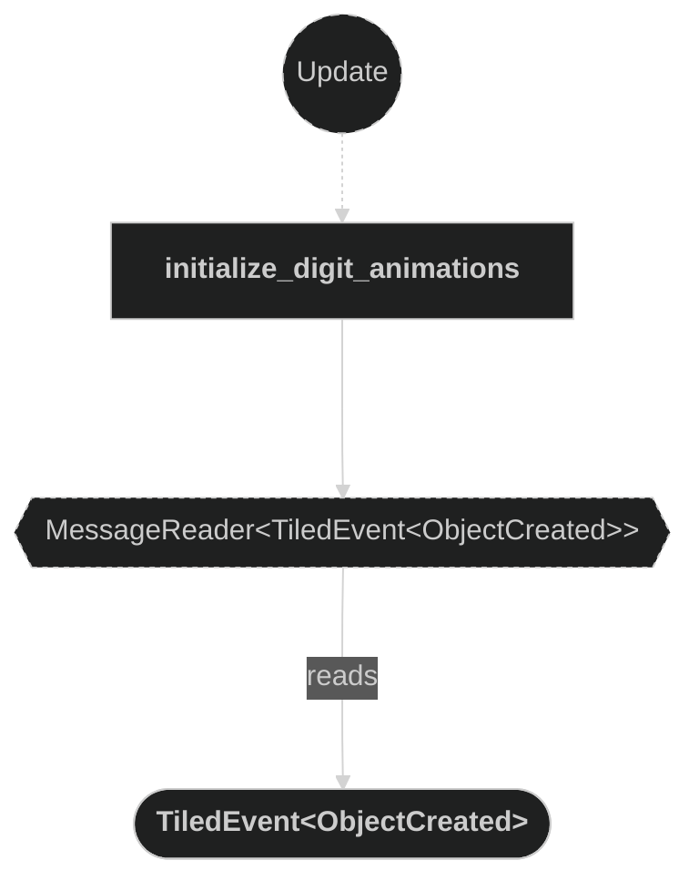
```mermaid
---
config:
  theme: dark
---

flowchart TD
classDef system-group stroke-dasharray: 5 5
classDef reader stroke-dasharray: 3 3

update(("`Update`")):::system-group
initialize_digit_animations["`**initialize_digit_animations**`"]

update -.-> initialize_digit_animations

message_reader{{"MessageReader#60;TiledEvent#60;ObjectCreated#62;#62;"}}:::reader
initialize_digit_animations ---> message_reader

object_created_message(["`**TiledEvent#60;ObjectCreated#62;**`"])

message_reader ---> |reads| object_created_message
```

### Query Digit entities (attach)

Used in the following systems:
- **initialize_digit_animations**: detects newly created `Digit`-marked `TiledObject` entities and initializes their animation components

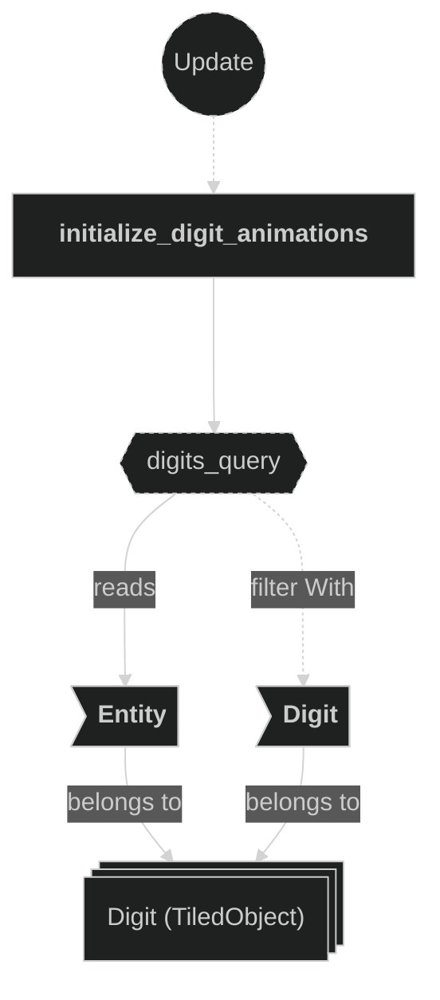
```mermaid
---
config:
  theme: dark
---

flowchart TD
classDef system-group stroke-dasharray: 5 5
classDef query stroke-dasharray: 3 3

update(("`Update`")):::system-group
initialize_digit_animations["`**initialize_digit_animations**`"]

update -.-> initialize_digit_animations

digits_query{{"`digits_query`"}}:::query
initialize_digit_animations ---> digits_query

digit_entity@{ shape: st-rect, label: "Digit (TiledObject)" }

de_entity>"`**Entity**`"] --> |belongs to| digit_entity
de_digit>"`**Digit**`"] --> |belongs to| digit_entity

digits_query ---> |reads| de_entity
digits_query -..-> |filter With| de_digit
```

### Query Children hierarchy

Used in the following systems:
- **initialize_digit_animations**: walks descendants via `iter_descendants` to find the child sprite entity
- **animate_beam_charges**: walks descendants via `iter_descendants` to find the child `SpritesheetAnimation`
- **animate_claimed_tiles**: walks descendants via `iter_descendants` to find the child `SpritesheetAnimation`

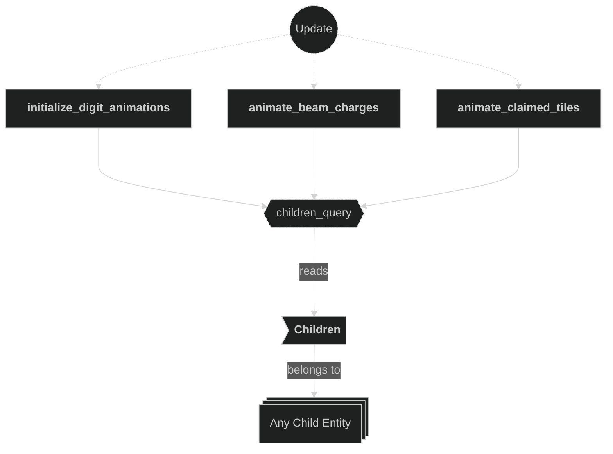
```mermaid
---
config:
  theme: dark
---

flowchart TD
classDef system-group stroke-dasharray: 5 5
classDef query stroke-dasharray: 3 3

update(("`Update`")):::system-group
initialize_digit_animations["`**initialize_digit_animations**`"]
animate_beam_charges["`**animate_beam_charges**`"]
animate_claimed_tiles["`**animate_claimed_tiles**`"]

update -.-> initialize_digit_animations
update -.-> animate_beam_charges
update -.-> animate_claimed_tiles

children_query{{"`children_query`"}}:::query
initialize_digit_animations ---> children_query
animate_beam_charges ---> children_query
animate_claimed_tiles ---> children_query

child_entity@{ shape: st-rect, label: "Any Child Entity" }

ch_children>"`**Children**`"] --> |belongs to| child_entity

children_query ---> |reads| ch_children
```

### Query Player entities with Changed\<BeamCharges\>

Used in the following systems:
- **animate_beam_charges**: detects players whose `BeamCharges` component changed this frame to drive digit flip-counter animations

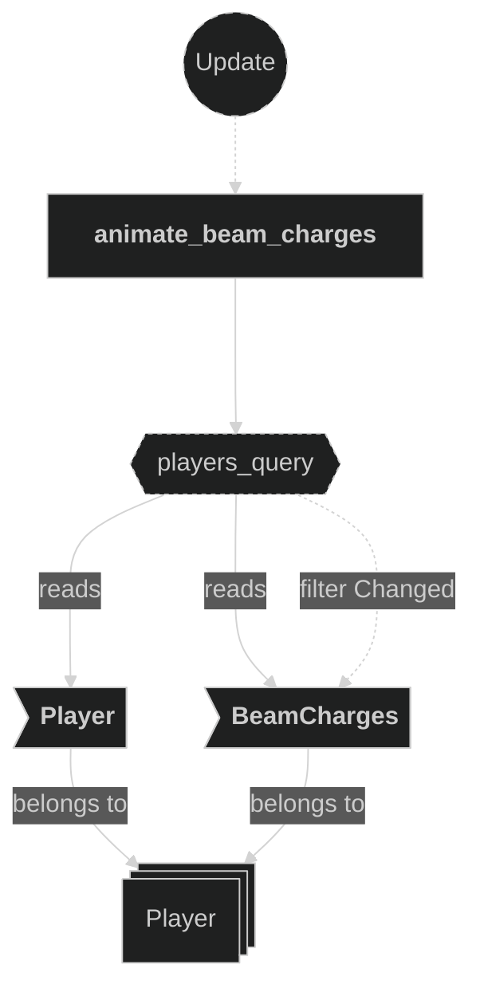
```mermaid
---
config:
  theme: dark
---

flowchart TD
classDef system-group stroke-dasharray: 5 5
classDef query stroke-dasharray: 3 3

update(("`Update`")):::system-group
animate_beam_charges["`**animate_beam_charges**`"]

update -.-> animate_beam_charges

players_query{{"`players_query`"}}:::query
animate_beam_charges ---> players_query

player_entity@{ shape: st-rect, label: "Player" }

pe_player>"`**Player**`"] --> |belongs to| player_entity
pe_charges>"`**BeamCharges**`"] --> |belongs to| player_entity

players_query ---> |reads| pe_player
players_query ---> |reads| pe_charges
players_query -..-> |filter Changed| pe_charges
```

### Query BeamChargesDigit entities (update)

Used in the following systems:
- **animate_beam_charges**: reads `Player::player_id`, `Digit::position`, and mutably updates `Digit::value` for all `BeamChargesDigit`-marked entities matching the changed player

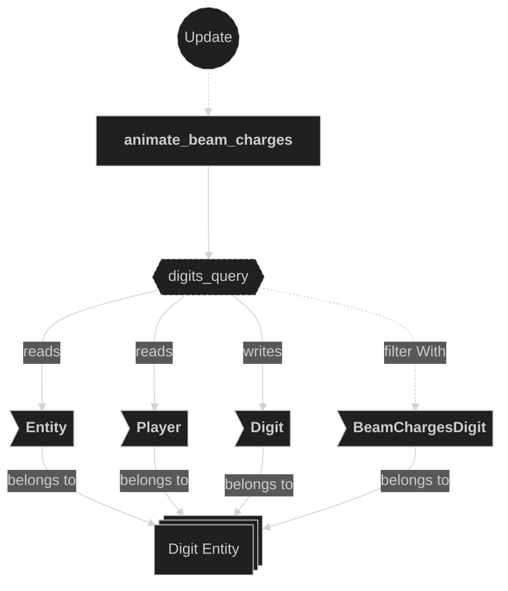
```mermaid
---
config:
  theme: dark
---

flowchart TD
classDef system-group stroke-dasharray: 5 5
classDef query stroke-dasharray: 3 3

update(("`Update`")):::system-group
animate_beam_charges["`**animate_beam_charges**`"]

update -.-> animate_beam_charges

digits_query{{"`digits_query`"}}:::query
animate_beam_charges ---> digits_query

digit_entity@{ shape: st-rect, label: "Digit Entity" }

de_entity>"`**Entity**`"] --> |belongs to| digit_entity
de_player>"`**Player**`"] --> |belongs to| digit_entity
de_digit>"`**Digit**`"] --> |belongs to| digit_entity
de_marker>"`**BeamChargesDigit**`"] --> |belongs to| digit_entity

digits_query ---> |reads| de_entity
digits_query ---> |reads| de_player
digits_query ---> |writes| de_digit
digits_query -..-> |filter With| de_marker
```

### Query Player entities with Changed\<ClaimedTileCount\>

Used in the following systems:
- **animate_claimed_tiles**: detects players whose `ClaimedTileCount` component changed this frame to drive claimed-tile percentage digit animations

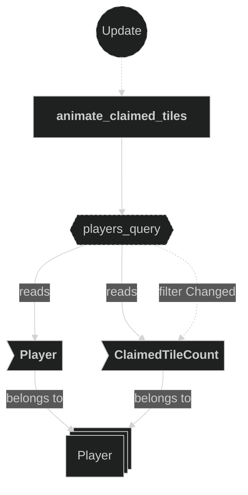
```mermaid
---
config:
  theme: dark
---

flowchart TD
classDef system-group stroke-dasharray: 5 5
classDef query stroke-dasharray: 3 3

update(("`Update`")):::system-group
animate_claimed_tiles["`**animate_claimed_tiles**`"]

update -.-> animate_claimed_tiles

players_query{{"`players_query`"}}:::query
animate_claimed_tiles ---> players_query

player_entity@{ shape: st-rect, label: "Player" }

pe_player>"`**Player**`"] --> |belongs to| player_entity
pe_count>"`**ClaimedTileCount**`"] --> |belongs to| player_entity

players_query ---> |reads| pe_player
players_query ---> |reads| pe_count
players_query -..-> |filter Changed| pe_count
```

### Query ClaimedTilesDigit entities (update)

Used in the following systems:
- **animate_claimed_tiles**: reads `Player::player_id`, `Digit::position`, and mutably updates `Digit::value` for all `ClaimedTilesDigit`-marked entities matching the changed player

```mermaid
---
config:
  theme: dark
---

flowchart TD
classDef system-group stroke-dasharray: 5 5
classDef query stroke-dasharray: 3 3

update(("`Update`")):::system-group
animate_claimed_tiles["`**animate_claimed_tiles**`"]

update -.-> animate_claimed_tiles

digits_query{{"`digits_query`"}}:::query
animate_claimed_tiles ---> digits_query

digit_entity@{ shape: st-rect, label: "Digit Entity" }

de_entity>"`**Entity**`"] --> |belongs to| digit_entity
de_player>"`**Player**`"] --> |belongs to| digit_entity
de_digit>"`**Digit**`"] --> |belongs to| digit_entity
de_marker>"`**ClaimedTilesDigit**`"] --> |belongs to| digit_entity

digits_query ---> |reads| de_entity
digits_query ---> |reads| de_player
digits_query ---> |writes| de_digit
digits_query -..-> |filter With| de_marker
```

### Read MapInfo resource (claimed tiles)

Used in the following systems:
- **animate_claimed_tiles**: reads `MapInfo::ground_entities` to obtain the total number of ground tiles used to compute the owned-tile percentage
- **animate_territory_bar**: reads `MapInfo::ground_entities` for the total tile count used to compute the claimed-tile ratio (returns early if `0`)
- **animate_charges_bar**: same, for the claimed-tiles-plus-charges-plus-in-flight ratio (returns early if `0`)

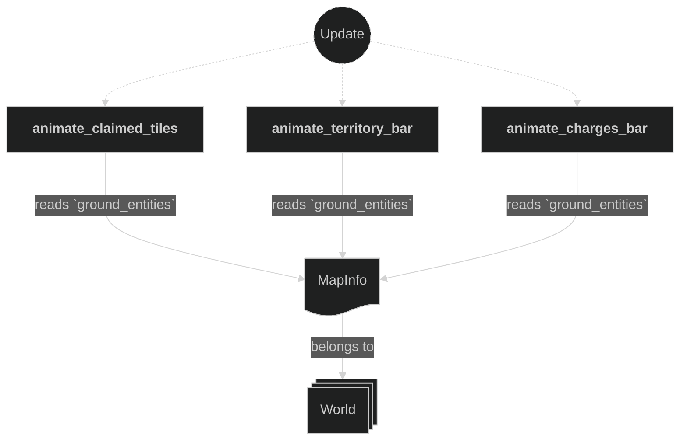
```mermaid
---
config:
  theme: dark
---

flowchart TD
classDef system-group stroke-dasharray: 5 5

update(("`Update`")):::system-group
animate_claimed_tiles["`**animate_claimed_tiles**`"]
animate_territory_bar["`**animate_territory_bar**`"]
animate_charges_bar["`**animate_charges_bar**`"]

update -.-> animate_claimed_tiles
update -.-> animate_territory_bar
update -.-> animate_charges_bar

world@{ shape: st-rect, label: "World" }
map_info_res@{ shape: doc, label: "MapInfo" }

map_info_res --> |belongs to| world

animate_claimed_tiles ---> |reads `ground_entities`| map_info_res
animate_territory_bar ---> |reads `ground_entities`| map_info_res
animate_charges_bar ---> |reads `ground_entities`| map_info_res
```

### Read DigitAnimations resource

Used in the following systems:
- **animate_beam_charges**: used to retrieve the from→to transition animation handle for each digit; accessed via `If<Res<...>>` (optional — skipped if not yet inserted)
- **animate_claimed_tiles**: used to retrieve the from→to transition animation handle for each digit; accessed via `If<Res<...>>` (optional — skipped if not yet inserted)

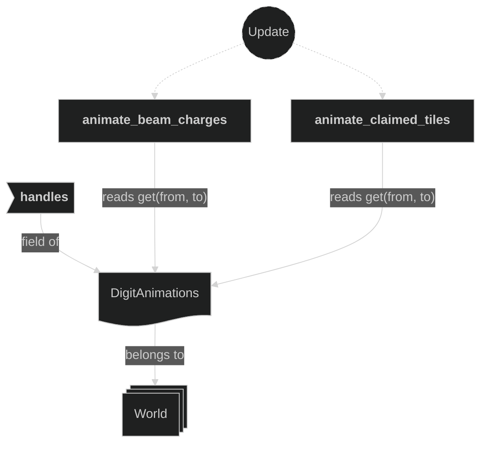
```mermaid
---
config:
  theme: dark
---

flowchart TD
classDef system-group stroke-dasharray: 5 5

update(("`Update`")):::system-group
animate_beam_charges["`**animate_beam_charges**`"]
animate_claimed_tiles["`**animate_claimed_tiles**`"]

update -.-> animate_beam_charges
update -.-> animate_claimed_tiles

world@{ shape: st-rect, label: "World" }
digit_anims_res@{ shape: doc, label: "DigitAnimations" }

da_handles>"`**handles**`"]

digit_anims_res --> |belongs to| world
da_handles --> |field of| digit_anims_res

animate_beam_charges ---> |"reads get(from, to)"| digit_anims_res
animate_claimed_tiles ---> |"reads get(from, to)"| digit_anims_res
```

### Write DigitAnimations resource

Used in the following systems:
- **initialize_digit_animations**: builds all 90 from→to transition animation handles and inserts the `DigitAnimations` resource into the world

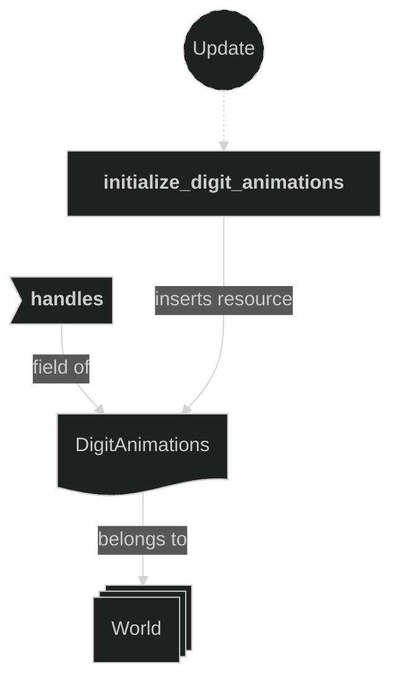
```mermaid
---
config:
  theme: dark
---

flowchart TD
classDef system-group stroke-dasharray: 5 5

update(("`Update`")):::system-group
initialize_digit_animations["`**initialize_digit_animations**`"]

update -.-> initialize_digit_animations

world@{ shape: st-rect, label: "World" }
digit_anims_res@{ shape: doc, label: "DigitAnimations" }

da_handles>"`**handles**`"]

digit_anims_res --> |belongs to| world
da_handles --> |field of| digit_anims_res

initialize_digit_animations ---> |inserts resource| digit_anims_res
```

### Write commands (attach digit animations)

Used in the following systems:
- **initialize_digit_animations**: inserts `SpritesheetAnimation` on the child sprite entity of each `Digit` entity

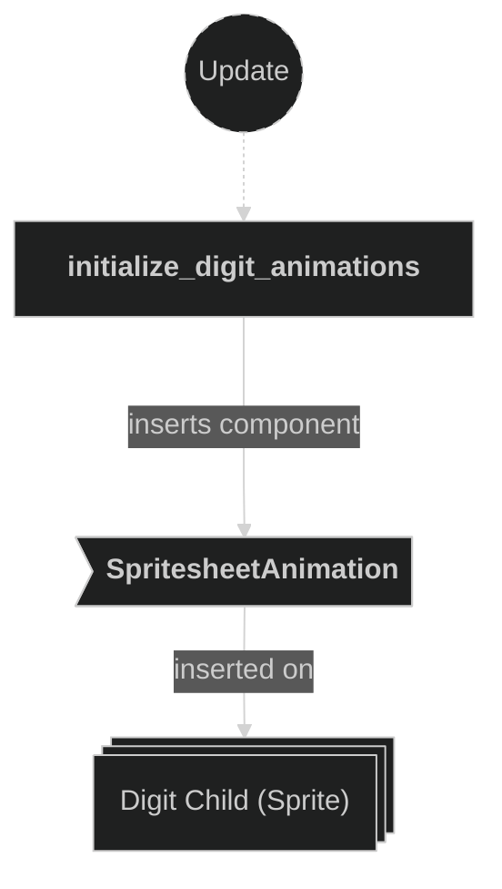
```mermaid
---
config:
  theme: dark
---

flowchart TD
classDef system-group stroke-dasharray: 5 5

update(("`Update`")):::system-group
initialize_digit_animations["`**initialize_digit_animations**`"]

update -.-> initialize_digit_animations

digit_child_entity@{ shape: st-rect, label: "Digit Child (Sprite)" }

dc_anim>"`**SpritesheetAnimation**`"]

dc_anim --> |inserted on| digit_child_entity

initialize_digit_animations ---> |inserts component| dc_anim
```

### Write SpritesheetAnimation (update digit)

Used in the following systems:
- **animate_beam_charges**: switches the `SpritesheetAnimation` clip on the digit child sprite entity to the from→to transition clip
- **animate_claimed_tiles**: switches the `SpritesheetAnimation` clip on the digit child sprite entity to the from→to transition clip

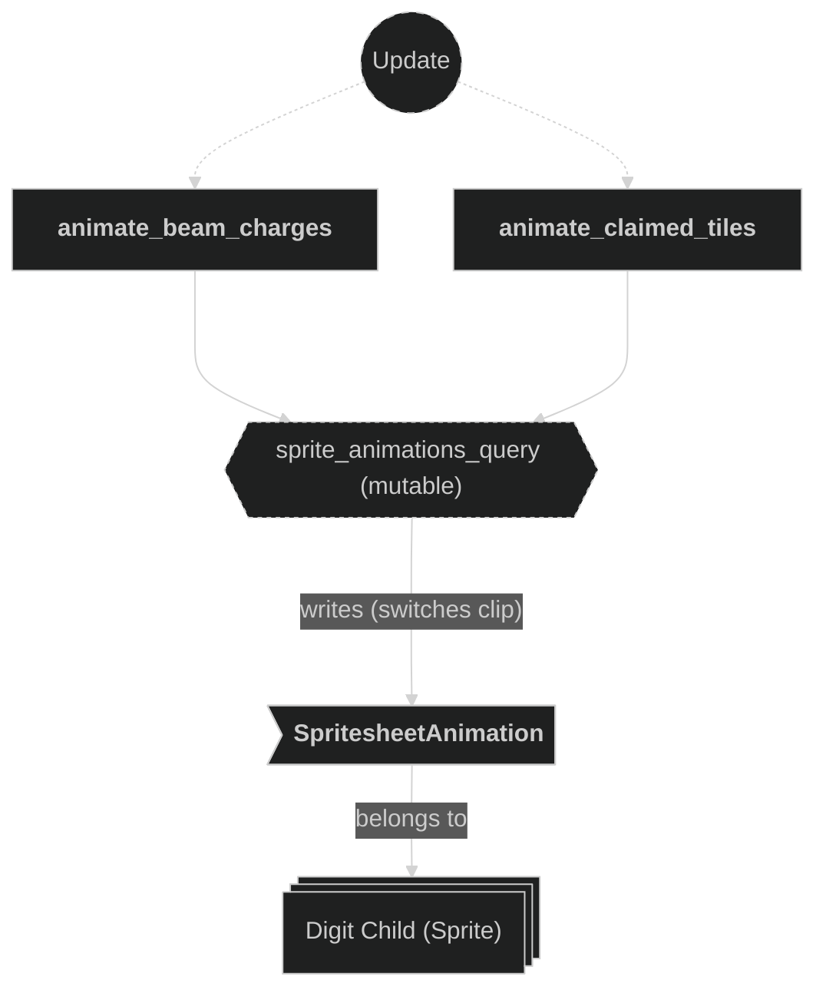
```mermaid
---
config:
  theme: dark
---

flowchart TD
classDef system-group stroke-dasharray: 5 5
classDef query stroke-dasharray: 3 3

update(("`Update`")):::system-group
animate_beam_charges["`**animate_beam_charges**`"]
animate_claimed_tiles["`**animate_claimed_tiles**`"]

update -.-> animate_beam_charges
update -.-> animate_claimed_tiles

sprite_animations_query{{"`sprite_animations_query (mutable)`"}}:::query
animate_beam_charges ---> sprite_animations_query
animate_claimed_tiles ---> sprite_animations_query

digit_child_entity@{ shape: st-rect, label: "Digit Child (Sprite)" }

dc_anim>"`**SpritesheetAnimation**`"] --> |belongs to| digit_child_entity

sprite_animations_query ---> |"writes (switches clip)"| dc_anim
```

### Query Player entities (health)

Used in the following systems:
- **animate_hp**: reads `Health` and `Player` components on `DamageEffectTarget`-marked entities to determine the current health ratio for each player, via `nudge_bar_for_player`
- **animate_damage_bar**: same query shape, feeding `nudge_bar_for_player` for the damage-echo bar

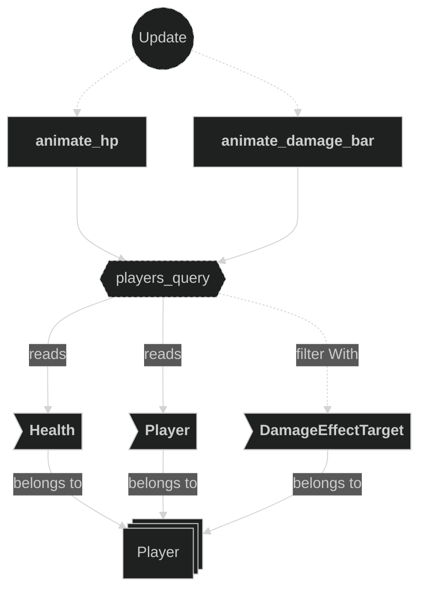
```mermaid
---
config:
  theme: dark
---

flowchart TD
classDef system-group stroke-dasharray: 5 5
classDef query stroke-dasharray: 3 3

update(("`Update`")):::system-group
animate_hp["`**animate_hp**`"]
animate_damage_bar["`**animate_damage_bar**`"]

update -.-> animate_hp
update -.-> animate_damage_bar

players_query{{"`players_query`"}}:::query
animate_hp ---> players_query
animate_damage_bar ---> players_query

player_entity@{ shape: st-rect, label: "Player" }

pe_health>"`**Health**`"] --> |belongs to| player_entity
pe_player>"`**Player**`"] --> |belongs to| player_entity
pe_marker>"`**DamageEffectTarget**`"] --> |belongs to| player_entity

players_query ---> |reads| pe_health
players_query ---> |reads| pe_player
players_query -..-> |filter With| pe_marker
```

### Query HPBar entities

Used in the following systems:
- **animate_hp**: reads the `Player` component (to match against player id) and writes `Transform::scale.x` to reflect the current health ratio, via `nudge_bar_for_player`

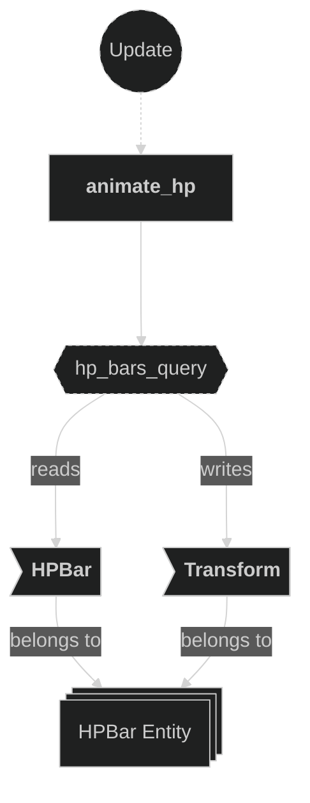
```mermaid
---
config:
  theme: dark
---

flowchart TD
classDef system-group stroke-dasharray: 5 5
classDef query stroke-dasharray: 3 3

update(("`Update`")):::system-group
animate_hp["`**animate_hp**`"]

update -.-> animate_hp

hp_bars_query{{"`hp_bars_query`"}}:::query
animate_hp ---> hp_bars_query

hp_bar_entity@{ shape: st-rect, label: "HPBar Entity" }

hb_hp_bar>"`**HPBar**`"] --> |belongs to| hp_bar_entity
hb_transform>"`**Transform**`"] --> |belongs to| hp_bar_entity

hp_bars_query ---> |reads| hb_hp_bar
hp_bars_query ---> |writes| hb_transform
```

### Query DamageBar entities

Used in the following systems:
- **animate_damage_bar**: reads the `Player` component (to match against player id) and writes `Transform::scale.x` to reflect the current health ratio, via `nudge_bar_for_player`; filtered to `(With<DamageBar>, Without<DamageEchoDelay>)` so a bar currently holding `DamageEchoDelay` is skipped entirely
- **arm_damage_echo_delay**: reads the `Player` component on every `DamageBar` entity (no `Without` filter) to find the bars belonging to a player whose `Health` just changed

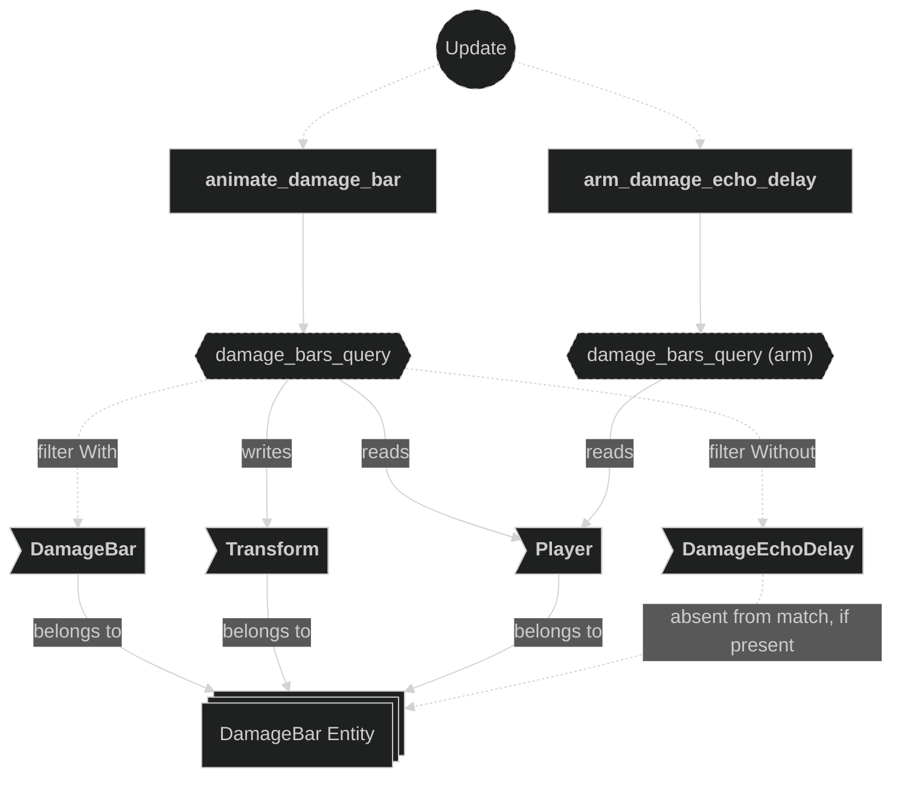
```mermaid
---
config:
  theme: dark
---

flowchart TD
classDef system-group stroke-dasharray: 5 5
classDef query stroke-dasharray: 3 3

update(("`Update`")):::system-group
animate_damage_bar["`**animate_damage_bar**`"]
arm_damage_echo_delay["`**arm_damage_echo_delay**`"]

update -.-> animate_damage_bar
update -.-> arm_damage_echo_delay

damage_bars_query{{"`damage_bars_query`"}}:::query
animate_damage_bar ---> damage_bars_query

damage_bars_query_arm{{"`damage_bars_query (arm)`"}}:::query
arm_damage_echo_delay ---> damage_bars_query_arm

damage_bar_entity@{ shape: st-rect, label: "DamageBar Entity" }

db_damage_bar>"`**DamageBar**`"] --> |belongs to| damage_bar_entity
db_transform>"`**Transform**`"] --> |belongs to| damage_bar_entity
db_player>"`**Player**`"] --> |belongs to| damage_bar_entity
db_delay>"`**DamageEchoDelay**`"] -.-> |absent from match, if present| damage_bar_entity

damage_bars_query ---> |reads| db_player
damage_bars_query ---> |writes| db_transform
damage_bars_query -..-> |filter With| db_damage_bar
damage_bars_query -..-> |filter Without| db_delay

damage_bars_query_arm ---> |reads| db_player
```

### Query Player entities (territory/charges ratio)

Used in the following systems:
- **animate_territory_bar**: reads `Player` and `ClaimedTileCount` on every player to compute each player's claimed-tile ratio
- **animate_charges_bar**: reads `Player`, `ClaimedTileCount`, `BeamCharges`, and `InFlightBeamCount` on every player to compute the claimed-tiles-plus-charges-plus-in-flight ratio; `InFlightBeamCount` is synchronously maintained by the Beam plugin, so a fired-but-unresolved beam counts toward the ratio with no per-frame lag

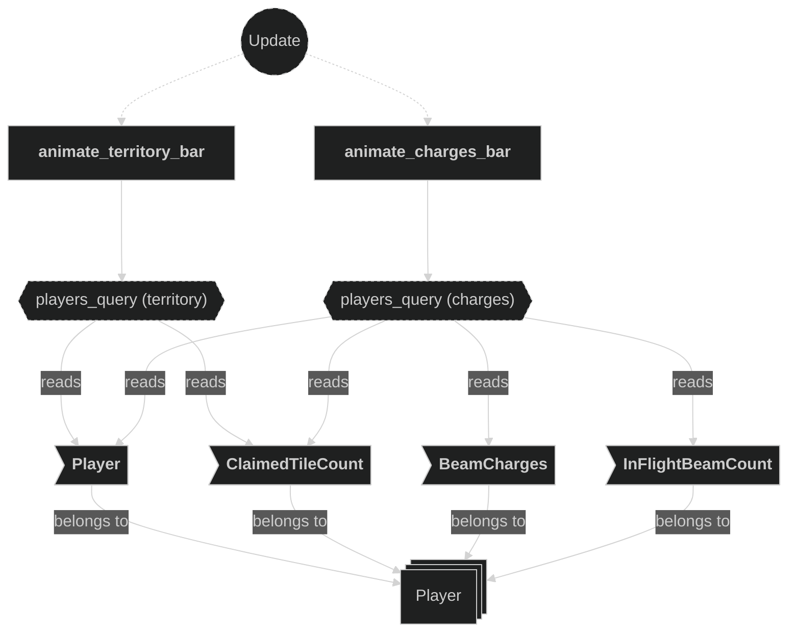
```mermaid
---
config:
  theme: dark
---

flowchart TD
classDef system-group stroke-dasharray: 5 5
classDef query stroke-dasharray: 3 3

update(("`Update`")):::system-group
animate_territory_bar["`**animate_territory_bar**`"]
animate_charges_bar["`**animate_charges_bar**`"]

update -.-> animate_territory_bar
update -.-> animate_charges_bar

territory_players_query{{"`players_query (territory)`"}}:::query
animate_territory_bar ---> territory_players_query

charges_players_query{{"`players_query (charges)`"}}:::query
animate_charges_bar ---> charges_players_query

player_entity@{ shape: st-rect, label: "Player" }

pe_player>"`**Player**`"] --> |belongs to| player_entity
pe_count>"`**ClaimedTileCount**`"] --> |belongs to| player_entity
pe_charges>"`**BeamCharges**`"] --> |belongs to| player_entity
pe_in_flight>"`**InFlightBeamCount**`"] --> |belongs to| player_entity

territory_players_query ---> |reads| pe_player
territory_players_query ---> |reads| pe_count

charges_players_query ---> |reads| pe_player
charges_players_query ---> |reads| pe_count
charges_players_query ---> |reads| pe_charges
charges_players_query ---> |reads| pe_in_flight
```

### Query TerritoryBar entities

Used in the following systems:
- **animate_territory_bar**: reads the `Player` component (to match against player id) and writes `Transform::scale.x` to reflect the player's claimed-tile ratio, via `nudge_bar_for_player`

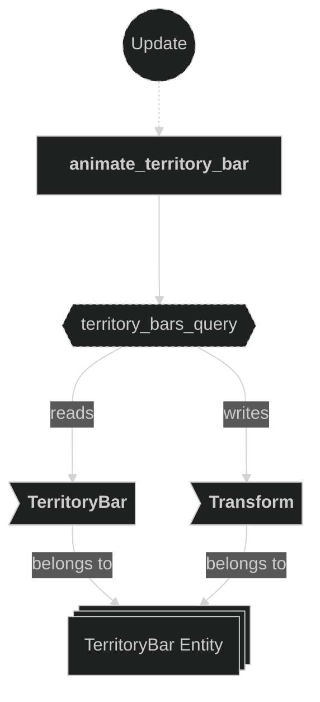
```mermaid
---
config:
  theme: dark
---

flowchart TD
classDef system-group stroke-dasharray: 5 5
classDef query stroke-dasharray: 3 3

update(("`Update`")):::system-group
animate_territory_bar["`**animate_territory_bar**`"]

update -.-> animate_territory_bar

territory_bars_query{{"`territory_bars_query`"}}:::query
animate_territory_bar ---> territory_bars_query

territory_bar_entity@{ shape: st-rect, label: "TerritoryBar Entity" }

tb_bar>"`**TerritoryBar**`"] --> |belongs to| territory_bar_entity
tb_transform>"`**Transform**`"] --> |belongs to| territory_bar_entity

territory_bars_query ---> |reads| tb_bar
territory_bars_query ---> |writes| tb_transform
```

### Query ChargesBar entities

Used in the following systems:
- **animate_charges_bar**: reads the `Player` component (to match against player id) and writes `Transform::scale.x` to reflect the player's claimed-tiles-plus-charges-plus-in-flight ratio, via `nudge_bar_for_player`

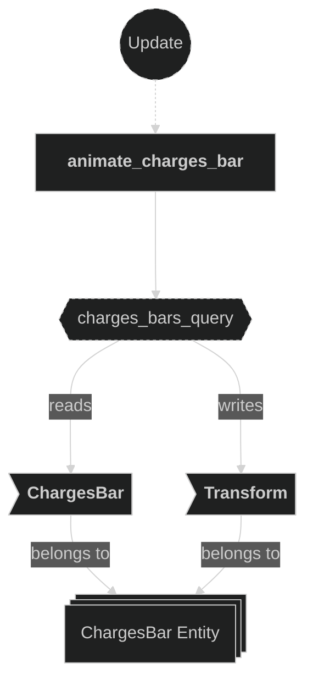
```mermaid
---
config:
  theme: dark
---

flowchart TD
classDef system-group stroke-dasharray: 5 5
classDef query stroke-dasharray: 3 3

update(("`Update`")):::system-group
animate_charges_bar["`**animate_charges_bar**`"]

update -.-> animate_charges_bar

charges_bars_query{{"`charges_bars_query`"}}:::query
animate_charges_bar ---> charges_bars_query

charges_bar_entity@{ shape: st-rect, label: "ChargesBar Entity" }

cb_bar>"`**ChargesBar**`"] --> |belongs to| charges_bar_entity
cb_transform>"`**Transform**`"] --> |belongs to| charges_bar_entity

charges_bars_query ---> |reads| cb_bar
charges_bars_query ---> |writes| cb_transform
```

### DamageEchoDelay component lifecycle

`DamageEchoDelay(Timer)` is a private component (declared in `hud.rs`) marking a `DamageBar` as holding still before it resumes catching up to its target ratio. Its full lifecycle:
- **Inserted / restarted** by `arm_damage_echo_delay`, on every `DamageBar` belonging to a player whose `Health` just changed (`Changed<Health>`) — a fresh `Timer::new(Duration::from_millis(config.animation.damage_bar_delay_ms), TimerMode::Once)`. Inserting on an entity that already carries the component overwrites it, effectively restarting the countdown.
- **Ticked** by `tick_damage_echo_delay`, every frame, by `Time::delta()`.
- **Removed** by `tick_damage_echo_delay`, the frame its timer finishes.
- **Consumed** by `animate_damage_bar` as a `Without<DamageEchoDelay>` query filter — while present, the owning `DamageBar` is excluded from the match and its `Transform` is not touched that frame; once removed, the bar is matched again and resumes moving toward the current health ratio.

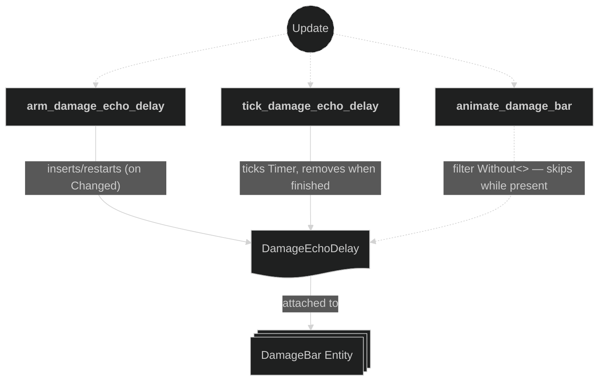
```mermaid
---
config:
  theme: dark
---

flowchart TD
classDef system-group stroke-dasharray: 5 5

update(("`Update`")):::system-group
arm["`**arm_damage_echo_delay**`"]
tick["`**tick_damage_echo_delay**`"]
animate["`**animate_damage_bar**`"]

update -.-> arm
update -.-> tick
update -.-> animate

damage_bar_entity@{ shape: st-rect, label: "DamageBar Entity" }
delay_component@{ shape: doc, label: "DamageEchoDelay" }

arm ---> |"inserts/restarts (on Changed<Health>)"| delay_component
tick ---> |ticks Timer, removes when finished| delay_component
delay_component --> |attached to| damage_bar_entity
animate -..-> |"filter Without<> — skips while present"| delay_component
```

### Read GameConfig and Time (bar/delay tuning)

Used in the following systems:
- **animate_hp**: reads `config.animation.hp_bar_decay_rate` and `Time` (via `Time::delta_secs()`) to drive `nudge_bar_for_player`
- **animate_damage_bar**: reads `config.animation.damage_bar_decay_rate` and `Time` the same way
- **animate_territory_bar**: reads `config.animation.territory_bar_decay_rate` and `Time` the same way
- **animate_charges_bar**: reads `config.animation.charges_bar_decay_rate` and `Time` the same way
- **arm_damage_echo_delay**: reads `config.animation.damage_bar_delay_ms` to size the delay timer
- **tick_damage_echo_delay**: reads `Time` to tick the delay timer

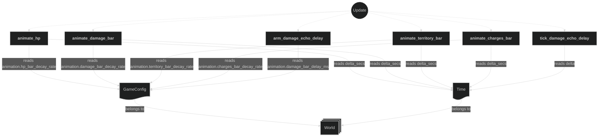
```mermaid
---
config:
  theme: dark
---

flowchart TD
classDef system-group stroke-dasharray: 5 5

update(("`Update`")):::system-group
animate_hp["`**animate_hp**`"]
animate_damage_bar["`**animate_damage_bar**`"]
animate_territory_bar["`**animate_territory_bar**`"]
animate_charges_bar["`**animate_charges_bar**`"]
arm["`**arm_damage_echo_delay**`"]
tick["`**tick_damage_echo_delay**`"]

update -.-> animate_hp
update -.-> animate_damage_bar
update -.-> animate_territory_bar
update -.-> animate_charges_bar
update -.-> arm
update -.-> tick

world@{ shape: st-rect, label: "World" }
config_res@{ shape: doc, label: "GameConfig" }
time_res@{ shape: doc, label: "Time" }

config_res --> |belongs to| world
time_res --> |belongs to| world

animate_hp ---> |"reads animation.hp_bar_decay_rate"| config_res
animate_hp ---> |reads delta_secs| time_res
animate_damage_bar ---> |"reads animation.damage_bar_decay_rate"| config_res
animate_damage_bar ---> |reads delta_secs| time_res
animate_territory_bar ---> |"reads animation.territory_bar_decay_rate"| config_res
animate_territory_bar ---> |reads delta_secs| time_res
animate_charges_bar ---> |"reads animation.charges_bar_decay_rate"| config_res
animate_charges_bar ---> |reads delta_secs| time_res
arm ---> |"reads animation.damage_bar_delay_ms"| config_res
tick ---> |reads delta| time_res
```
