# HUD Plugin

This plugin animates the HUD: the bars and the numbers at the top of the screen. It only reads game values. Other plugins own them.

## Key ideas

- The HUD is drawn by the HUD camera, on render layer 1.
- **Bars**: each bar moves toward a target ratio a little each frame. The bars run every frame, so a bar never stops halfway.
    - **HP bar**: the player's health ratio.
    - **Damage bar**: the same ratio, but slower. After a hit, it waits a short time, then catches up. So the lost health stays visible for a moment.
    - **Territory bar**: the tiles the player owns, divided by all ground tiles.
    - **Charges bar**: owned tiles + charges + beams in flight, divided by all ground tiles, at most 1.
- The territory and charges bars of the two players share one 432 px line. Player 1 grows to the right and player 2 grows to the left (see the [Maps plugin](/documentation/3/001-maps-plugin)).
- `BarFill` holds the exact fill ratio of a bar. The `Transform` scale is this ratio rounded to whole pixels, so the bar edge does not flicker.
- **Numbers**: each number is a group of `Digit` sprites, one per decimal place. A digit changes with a short rolling animation, like a car odometer.
    - Beam charges, per player (`BeamChargesDigit`).
    - Owned tiles, per player (`ClaimedTilesDigit`). It shows the tile count.
    - Round countdown, global (`CountdownDigit`).

## Ordering

An arrow means "runs before". Systems with no arrow between them have no fixed order.

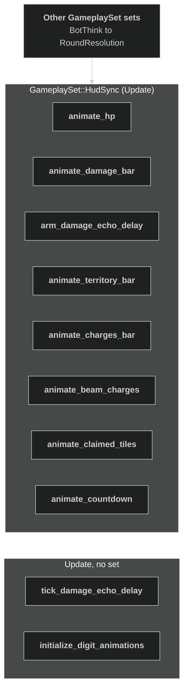
```mermaid
---
config:
  theme: dark
---

flowchart TD

gameplay["`**Other GameplaySet sets**
BotThink to RoundResolution`"]

subgraph hud_sync ["GameplaySet::HudSync (Update)"]
  animate_hp["`**animate_hp**`"]
  animate_damage_bar["`**animate_damage_bar**`"]
  arm_damage_echo_delay["`**arm_damage_echo_delay**`"]
  animate_territory_bar["`**animate_territory_bar**`"]
  animate_charges_bar["`**animate_charges_bar**`"]
  animate_beam_charges["`**animate_beam_charges**`"]
  animate_claimed_tiles["`**animate_claimed_tiles**`"]
  animate_countdown["`**animate_countdown**`"]
end

gameplay --> hud_sync

subgraph no_set ["Update, no set"]
  tick_damage_echo_delay["`**tick_damage_echo_delay**`"]
  initialize_digit_animations["`**initialize_digit_animations**`"]
end

hud_sync ~~~ no_set
```

- `HudSync` is the last gameplay set, so the HUD reads the values of the current frame.
- No system here is gated on `RoundPhase`.

## Plugin Systems

### Animate HP

- Moves each player's `HPBar` toward `Health::ratio()`, at `animation.hp_bar_decay_rate` (20).

### Animate Damage Bar

- Moves each player's `DamageBar` toward `Health::ratio()`, at `animation.damage_bar_decay_rate` (0.6).
- Skips a bar that has `DamageEchoDelay`. This makes the bar wait after a hit.

### Arm Damage Echo Delay

- When a player's `Health` changes, puts a new `DamageEchoDelay` on that player's `DamageBar`. Its timer is `animation.damage_bar_delay_ms` (300 ms).
- If the bar already has one, the timer starts again.
- It also runs when `Health` is first added at round start.

### Tick Damage Echo Delay

- Ticks each `DamageEchoDelay`. Removes it when the timer ends, so the damage bar moves again.

### Animate Territory Bar

- Moves each player's `TerritoryBar` toward owned tiles / ground tiles, at `animation.territory_bar_decay_rate` (100).
- Does nothing while the map has no ground tiles.

### Animate Charges Bar

- Moves each player's `ChargesBar` toward (owned tiles + `BeamCharges` + `InFlightBeamCount`) / ground tiles, at most 1. The speed is `animation.charges_bar_decay_rate` (100).
- The beams in flight are counted, so the bar does not drop when a beam is fired and grow back when it claims a tile.

### Initialize Digit Animations

- Reads `TiledEvent<ObjectCreated>`. Runs for each new `Digit` object.
- Adds a `SpritesheetAnimation` to the digit's sprite child.
- Builds the 90 roll animations (from each digit to each other digit) once, for the first digit, and inserts them as `DigitAnimations`. Each frame lasts `animation.digit_roll_frame_ms` (150 ms).
- `build_digit_animations` builds the 90 animations.

### Animate Beam Charges

- When a player's `BeamCharges` changes, shows `BeamCharges::current` on that player's `BeamChargesDigit` digits.

### Animate Claimed Tiles

- When a player's `ClaimedTileCount` changes, shows `ClaimedTileCount::current` on that player's `ClaimedTilesDigit` digits.

### Animate Countdown

- Runs every frame. Shows `Countdown::remaining` on all `CountdownDigit` digits.
- Does nothing until the `Countdown` resource exists.

### Helpers

- `nudge_bar_for_player` moves the bars of one player toward a ratio, then rounds the scale to whole pixels. All four bar systems use it.
- `animate_digit` shows one decimal place of a value on one digit. It does nothing when the digit already shows the right value, so it is safe to call every frame.
- `animate_digits_for_player` calls `animate_digit` for each digit of one player.

## Components, Resources and Messages CRUD

### Read TiledEvent ObjectCreated messages (digits)

Used in the following systems:
- **initialize_digit_animations**: a new `Digit` object starts its setup.

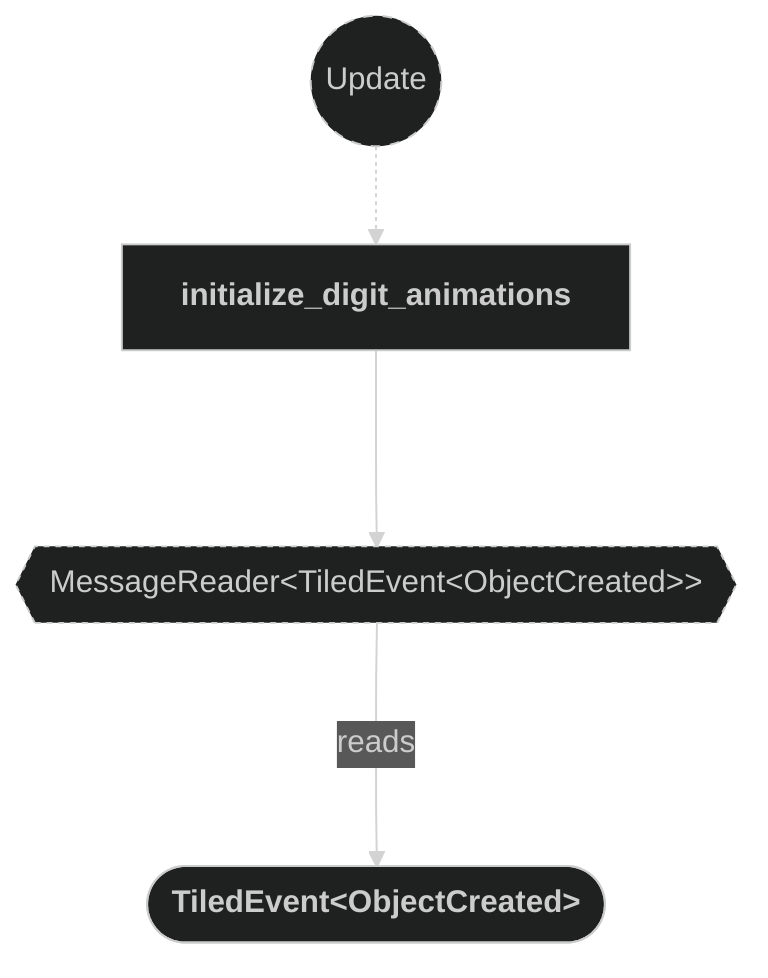
```mermaid
---
config:
  theme: dark
---

flowchart TD
classDef system-group stroke-dasharray: 5 5
classDef reader stroke-dasharray: 3 3

update(("`Update`")):::system-group
initialize_digit_animations["`**initialize_digit_animations**`"]

update -.-> initialize_digit_animations

message_reader{{"MessageReader#60;TiledEvent#60;ObjectCreated#62;#62;"}}:::reader
initialize_digit_animations ---> message_reader

object_created_message(["`**TiledEvent#60;ObjectCreated#62;**`"])

message_reader ---> |reads| object_created_message
```

### Query Digit entities (attach)

Used in the following systems:
- **initialize_digit_animations**: checks that the created object is a `Digit`.

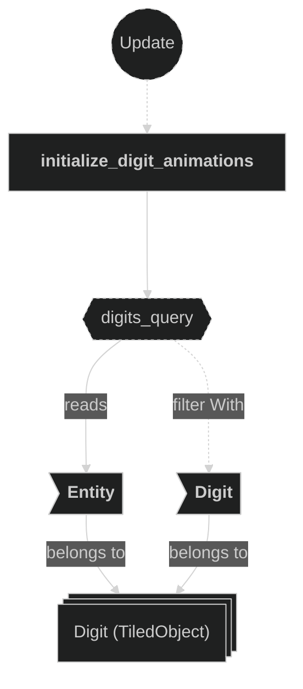
```mermaid
---
config:
  theme: dark
---

flowchart TD
classDef system-group stroke-dasharray: 5 5
classDef query stroke-dasharray: 3 3

update(("`Update`")):::system-group
initialize_digit_animations["`**initialize_digit_animations**`"]

update -.-> initialize_digit_animations

digits_query{{"`digits_query`"}}:::query
initialize_digit_animations ---> digits_query

digit_entity@{ shape: st-rect, label: "Digit (TiledObject)" }

de_entity>"`**Entity**`"] --> |belongs to| digit_entity
de_digit>"`**Digit**`"] --> |belongs to| digit_entity

digits_query ---> |reads| de_entity
digits_query -..-> |filter With| de_digit
```

### Query Children hierarchy

Used in the following systems:
- **initialize_digit_animations**: finds the sprite child of a digit.
- **animate_beam_charges**, **animate_claimed_tiles**, **animate_countdown**: find the `SpritesheetAnimation` of a digit.

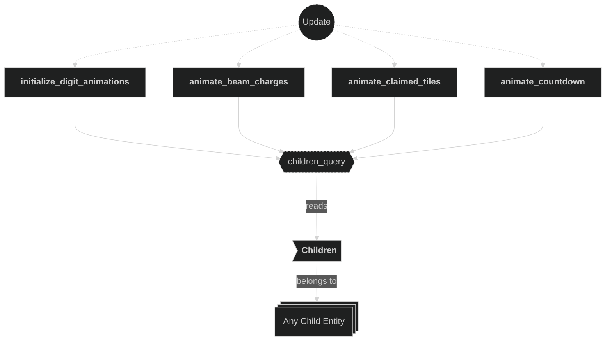
```mermaid
---
config:
  theme: dark
---

flowchart TD
classDef system-group stroke-dasharray: 5 5
classDef query stroke-dasharray: 3 3

update(("`Update`")):::system-group
initialize_digit_animations["`**initialize_digit_animations**`"]
animate_beam_charges["`**animate_beam_charges**`"]
animate_claimed_tiles["`**animate_claimed_tiles**`"]
animate_countdown["`**animate_countdown**`"]

update -.-> initialize_digit_animations
update -.-> animate_beam_charges
update -.-> animate_claimed_tiles
update -.-> animate_countdown

children_query{{"`children_query`"}}:::query
initialize_digit_animations ---> children_query
animate_beam_charges ---> children_query
animate_claimed_tiles ---> children_query
animate_countdown ---> children_query

child_entity@{ shape: st-rect, label: "Any Child Entity" }

ch_children>"`**Children**`"] --> |belongs to| child_entity

children_query ---> |reads| ch_children
```

### Query Player entities with Changed\<BeamCharges\>

Used in the following systems:
- **animate_beam_charges**: finds the players whose charges changed.

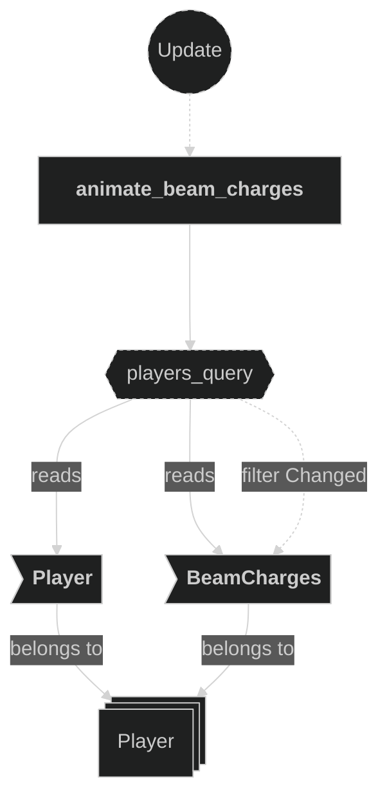
```mermaid
---
config:
  theme: dark
---

flowchart TD
classDef system-group stroke-dasharray: 5 5
classDef query stroke-dasharray: 3 3

update(("`Update`")):::system-group
animate_beam_charges["`**animate_beam_charges**`"]

update -.-> animate_beam_charges

players_query{{"`players_query`"}}:::query
animate_beam_charges ---> players_query

player_entity@{ shape: st-rect, label: "Player" }

pe_player>"`**Player**`"] --> |belongs to| player_entity
pe_charges>"`**BeamCharges**`"] --> |belongs to| player_entity

players_query ---> |reads| pe_player
players_query ---> |reads| pe_charges
players_query -..-> |filter Changed| pe_charges
```

### Query BeamChargesDigit entities (update)

Used in the following systems:
- **animate_beam_charges**: updates `Digit::value` on the charge digits of that player.

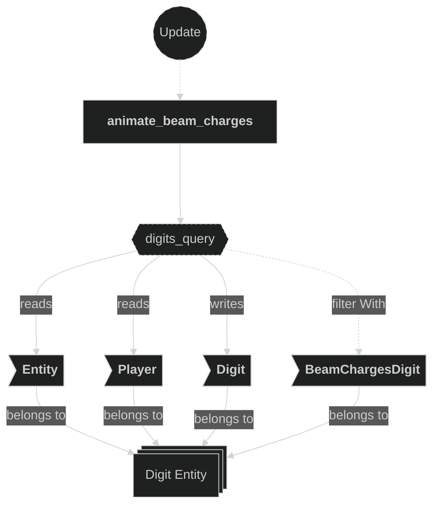
```mermaid
---
config:
  theme: dark
---

flowchart TD
classDef system-group stroke-dasharray: 5 5
classDef query stroke-dasharray: 3 3

update(("`Update`")):::system-group
animate_beam_charges["`**animate_beam_charges**`"]

update -.-> animate_beam_charges

digits_query{{"`digits_query`"}}:::query
animate_beam_charges ---> digits_query

digit_entity@{ shape: st-rect, label: "Digit Entity" }

de_entity>"`**Entity**`"] --> |belongs to| digit_entity
de_player>"`**Player**`"] --> |belongs to| digit_entity
de_digit>"`**Digit**`"] --> |belongs to| digit_entity
de_marker>"`**BeamChargesDigit**`"] --> |belongs to| digit_entity

digits_query ---> |reads| de_entity
digits_query ---> |reads| de_player
digits_query ---> |writes| de_digit
digits_query -..-> |filter With| de_marker
```

### Query Player entities with Changed\<ClaimedTileCount\>

Used in the following systems:
- **animate_claimed_tiles**: finds the players whose owned-tile count changed.

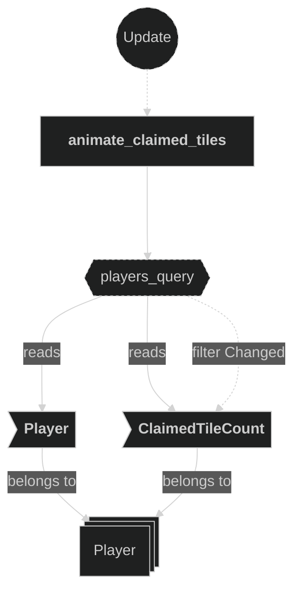
```mermaid
---
config:
  theme: dark
---

flowchart TD
classDef system-group stroke-dasharray: 5 5
classDef query stroke-dasharray: 3 3

update(("`Update`")):::system-group
animate_claimed_tiles["`**animate_claimed_tiles**`"]

update -.-> animate_claimed_tiles

players_query{{"`players_query`"}}:::query
animate_claimed_tiles ---> players_query

player_entity@{ shape: st-rect, label: "Player" }

pe_player>"`**Player**`"] --> |belongs to| player_entity
pe_count>"`**ClaimedTileCount**`"] --> |belongs to| player_entity

players_query ---> |reads| pe_player
players_query ---> |reads| pe_count
players_query -..-> |filter Changed| pe_count
```

### Query ClaimedTilesDigit entities (update)

Used in the following systems:
- **animate_claimed_tiles**: updates `Digit::value` on the owned-tile digits of that player.

```mermaid
---
config:
  theme: dark
---

flowchart TD
classDef system-group stroke-dasharray: 5 5
classDef query stroke-dasharray: 3 3

update(("`Update`")):::system-group
animate_claimed_tiles["`**animate_claimed_tiles**`"]

update -.-> animate_claimed_tiles

digits_query{{"`digits_query`"}}:::query
animate_claimed_tiles ---> digits_query

digit_entity@{ shape: st-rect, label: "Digit Entity" }

de_entity>"`**Entity**`"] --> |belongs to| digit_entity
de_player>"`**Player**`"] --> |belongs to| digit_entity
de_digit>"`**Digit**`"] --> |belongs to| digit_entity
de_marker>"`**ClaimedTilesDigit**`"] --> |belongs to| digit_entity

digits_query ---> |reads| de_entity
digits_query ---> |reads| de_player
digits_query ---> |writes| de_digit
digits_query -..-> |filter With| de_marker
```

### Read Countdown resource

Used in the following systems:
- **animate_countdown**: reads the seconds left. Does nothing until the resource exists.

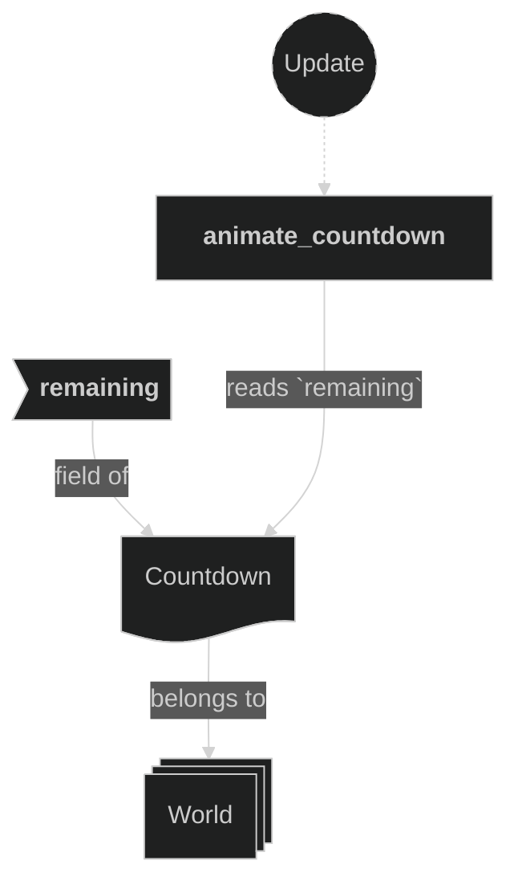
```mermaid
---
config:
  theme: dark
---

flowchart TD
classDef system-group stroke-dasharray: 5 5

update(("`Update`")):::system-group
animate_countdown["`**animate_countdown**`"]

update -.-> animate_countdown

world@{ shape: st-rect, label: "World" }
countdown_res@{ shape: doc, label: "Countdown" }

cd_remaining>"`**remaining**`"]

countdown_res --> |belongs to| world
cd_remaining --> |field of| countdown_res

animate_countdown ---> |reads `remaining`| countdown_res
```

### Query CountdownDigit entities (update)

Used in the following systems:
- **animate_countdown**: updates `Digit::value` on all countdown digits.

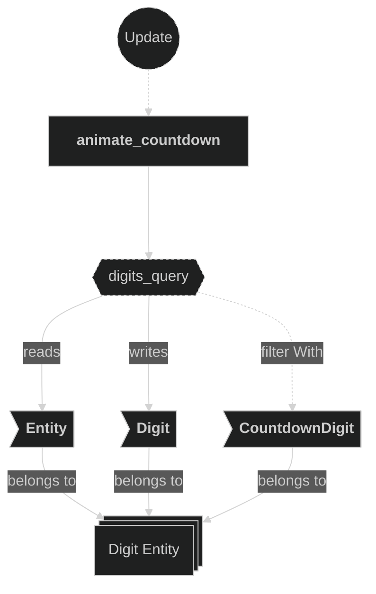
```mermaid
---
config:
  theme: dark
---

flowchart TD
classDef system-group stroke-dasharray: 5 5
classDef query stroke-dasharray: 3 3

update(("`Update`")):::system-group
animate_countdown["`**animate_countdown**`"]

update -.-> animate_countdown

digits_query{{"`digits_query`"}}:::query
animate_countdown ---> digits_query

digit_entity@{ shape: st-rect, label: "Digit Entity" }

de_entity>"`**Entity**`"] --> |belongs to| digit_entity
de_digit>"`**Digit**`"] --> |belongs to| digit_entity
de_marker>"`**CountdownDigit**`"] --> |belongs to| digit_entity

digits_query ---> |reads| de_entity
digits_query ---> |writes| de_digit
digits_query -..-> |filter With| de_marker
```

### Read MapInfo resource (bars)

Used in the following systems:
- **animate_territory_bar**, **animate_charges_bar**: read the number of ground tiles. They do nothing when it is 0.

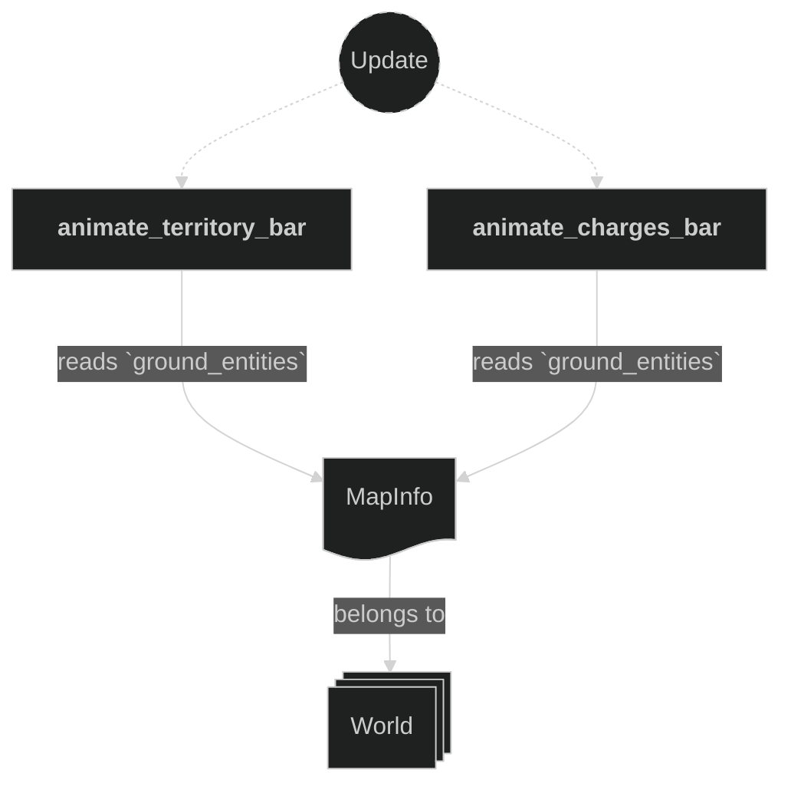
```mermaid
---
config:
  theme: dark
---

flowchart TD
classDef system-group stroke-dasharray: 5 5

update(("`Update`")):::system-group
animate_territory_bar["`**animate_territory_bar**`"]
animate_charges_bar["`**animate_charges_bar**`"]

update -.-> animate_territory_bar
update -.-> animate_charges_bar

world@{ shape: st-rect, label: "World" }
map_info_res@{ shape: doc, label: "MapInfo" }

map_info_res --> |belongs to| world

animate_territory_bar ---> |reads `ground_entities`| map_info_res
animate_charges_bar ---> |reads `ground_entities`| map_info_res
```

### Read DigitAnimations resource

Used in the following systems:
- **animate_beam_charges**, **animate_claimed_tiles**, **animate_countdown**: get the from→to roll animation. They do not run until the resource exists (`If<Res<...>>`).
- **initialize_digit_animations**: reuses the resource if it already exists.

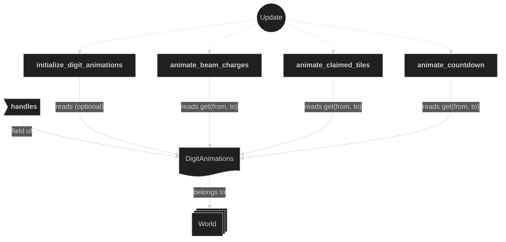
```mermaid
---
config:
  theme: dark
---

flowchart TD
classDef system-group stroke-dasharray: 5 5

update(("`Update`")):::system-group
initialize_digit_animations["`**initialize_digit_animations**`"]
animate_beam_charges["`**animate_beam_charges**`"]
animate_claimed_tiles["`**animate_claimed_tiles**`"]
animate_countdown["`**animate_countdown**`"]

update -.-> initialize_digit_animations
update -.-> animate_beam_charges
update -.-> animate_claimed_tiles
update -.-> animate_countdown

world@{ shape: st-rect, label: "World" }
digit_anims_res@{ shape: doc, label: "DigitAnimations" }

da_handles>"`**handles**`"]

digit_anims_res --> |belongs to| world
da_handles --> |field of| digit_anims_res

initialize_digit_animations ---> |"reads (optional)"| digit_anims_res
animate_beam_charges ---> |"reads get(from, to)"| digit_anims_res
animate_claimed_tiles ---> |"reads get(from, to)"| digit_anims_res
animate_countdown ---> |"reads get(from, to)"| digit_anims_res
```

### Write DigitAnimations resource

Used in the following systems:
- **initialize_digit_animations**: builds the 90 roll animations once and inserts the resource.

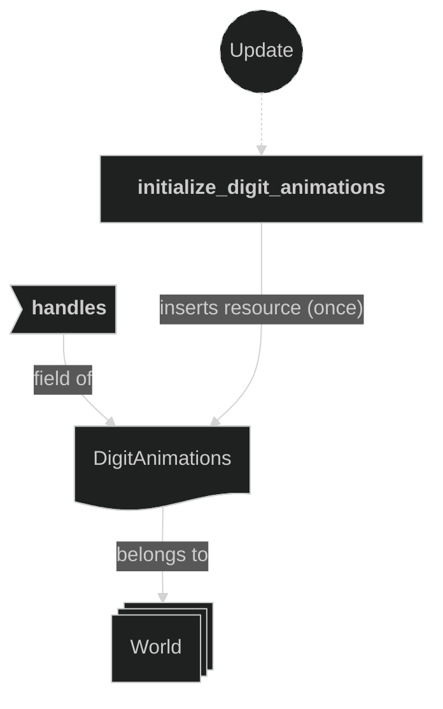
```mermaid
---
config:
  theme: dark
---

flowchart TD
classDef system-group stroke-dasharray: 5 5

update(("`Update`")):::system-group
initialize_digit_animations["`**initialize_digit_animations**`"]

update -.-> initialize_digit_animations

world@{ shape: st-rect, label: "World" }
digit_anims_res@{ shape: doc, label: "DigitAnimations" }

da_handles>"`**handles**`"]

digit_anims_res --> |belongs to| world
da_handles --> |field of| digit_anims_res

initialize_digit_animations ---> |"inserts resource (once)"| digit_anims_res
```

### Write commands (attach digit animations)

Used in the following systems:
- **initialize_digit_animations**: inserts a `SpritesheetAnimation` on the sprite child of each digit.

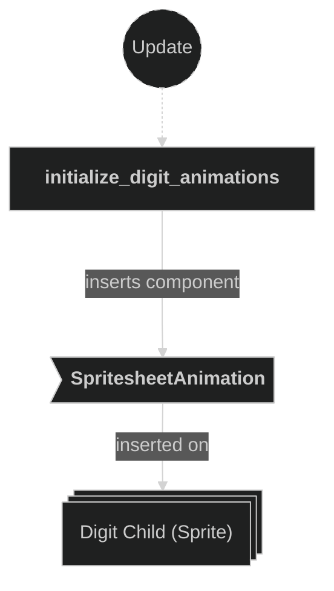
```mermaid
---
config:
  theme: dark
---

flowchart TD
classDef system-group stroke-dasharray: 5 5

update(("`Update`")):::system-group
initialize_digit_animations["`**initialize_digit_animations**`"]

update -.-> initialize_digit_animations

digit_child_entity@{ shape: st-rect, label: "Digit Child (Sprite)" }

dc_anim>"`**SpritesheetAnimation**`"]

dc_anim --> |inserted on| digit_child_entity

initialize_digit_animations ---> |inserts component| dc_anim
```

### Write SpritesheetAnimation (update digit)

Used in the following systems:
- **animate_beam_charges**, **animate_claimed_tiles**, **animate_countdown**: switch the digit to the from→to roll animation.

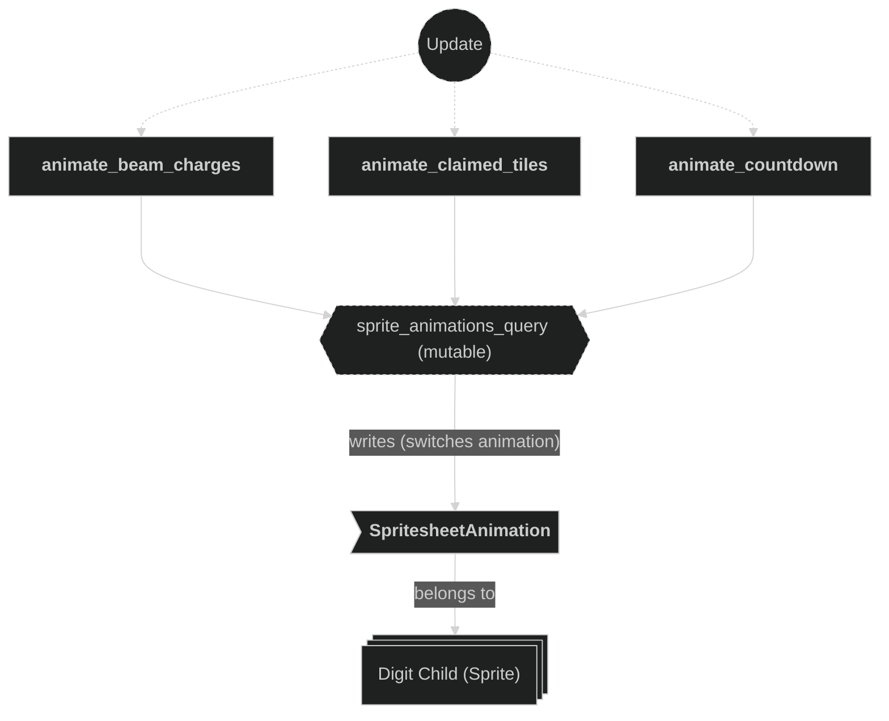
```mermaid
---
config:
  theme: dark
---

flowchart TD
classDef system-group stroke-dasharray: 5 5
classDef query stroke-dasharray: 3 3

update(("`Update`")):::system-group
animate_beam_charges["`**animate_beam_charges**`"]
animate_claimed_tiles["`**animate_claimed_tiles**`"]
animate_countdown["`**animate_countdown**`"]

update -.-> animate_beam_charges
update -.-> animate_claimed_tiles
update -.-> animate_countdown

sprite_animations_query{{"`sprite_animations_query (mutable)`"}}:::query
animate_beam_charges ---> sprite_animations_query
animate_claimed_tiles ---> sprite_animations_query
animate_countdown ---> sprite_animations_query

digit_child_entity@{ shape: st-rect, label: "Digit Child (Sprite)" }

dc_anim>"`**SpritesheetAnimation**`"] --> |belongs to| digit_child_entity

sprite_animations_query ---> |"writes (switches animation)"| dc_anim
```

### Query Player entities (health)

Used in the following systems:
- **animate_hp**, **animate_damage_bar**: read the health ratio of each player.

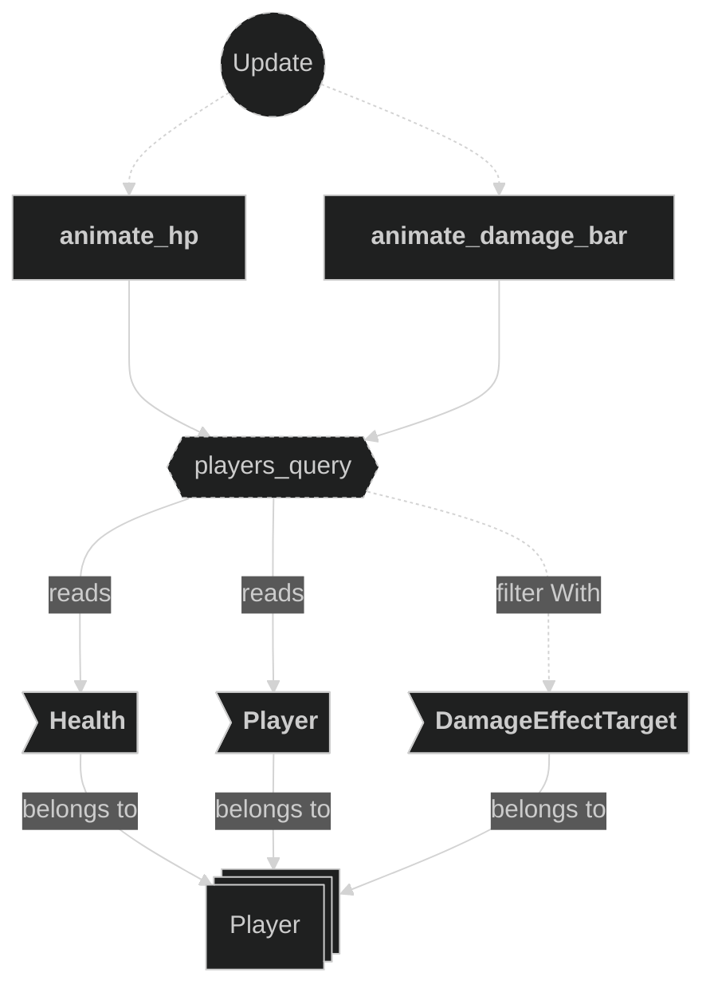
```mermaid
---
config:
  theme: dark
---

flowchart TD
classDef system-group stroke-dasharray: 5 5
classDef query stroke-dasharray: 3 3

update(("`Update`")):::system-group
animate_hp["`**animate_hp**`"]
animate_damage_bar["`**animate_damage_bar**`"]

update -.-> animate_hp
update -.-> animate_damage_bar

players_query{{"`players_query`"}}:::query
animate_hp ---> players_query
animate_damage_bar ---> players_query

player_entity@{ shape: st-rect, label: "Player" }

pe_health>"`**Health**`"] --> |belongs to| player_entity
pe_player>"`**Player**`"] --> |belongs to| player_entity
pe_marker>"`**DamageEffectTarget**`"] --> |belongs to| player_entity

players_query ---> |reads| pe_health
players_query ---> |reads| pe_player
players_query -..-> |filter With| pe_marker
```

### Query HPBar entities

Used in the following systems:
- **animate_hp**: moves the bar of each player toward its health ratio.

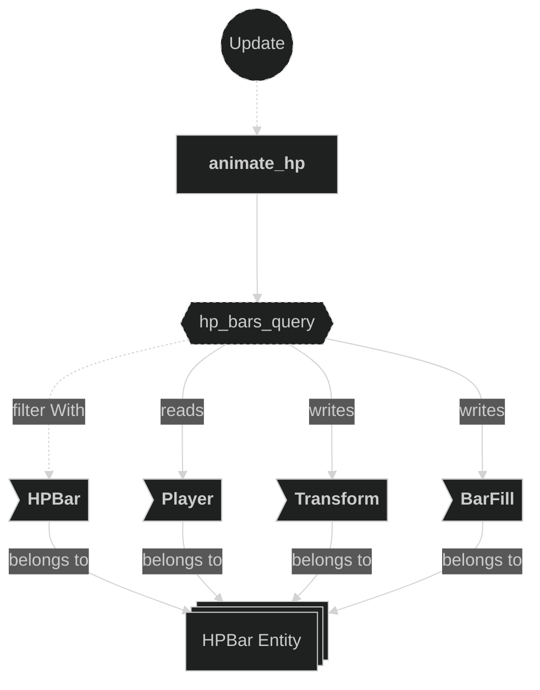
```mermaid
---
config:
  theme: dark
---

flowchart TD
classDef system-group stroke-dasharray: 5 5
classDef query stroke-dasharray: 3 3

update(("`Update`")):::system-group
animate_hp["`**animate_hp**`"]

update -.-> animate_hp

hp_bars_query{{"`hp_bars_query`"}}:::query
animate_hp ---> hp_bars_query

hp_bar_entity@{ shape: st-rect, label: "HPBar Entity" }

hb_hp_bar>"`**HPBar**`"] --> |belongs to| hp_bar_entity
hb_player>"`**Player**`"] --> |belongs to| hp_bar_entity
hb_transform>"`**Transform**`"] --> |belongs to| hp_bar_entity
hb_fill>"`**BarFill**`"] --> |belongs to| hp_bar_entity

hp_bars_query ---> |reads| hb_player
hp_bars_query ---> |writes| hb_transform
hp_bars_query ---> |writes| hb_fill
hp_bars_query -..-> |filter With| hb_hp_bar
```

### Query DamageBar entities

Used in the following systems:
- **animate_damage_bar**: moves the bar of each player toward its health ratio. Skips a bar that has `DamageEchoDelay`.
- **arm_damage_echo_delay**: finds the damage bars of a player whose health changed.

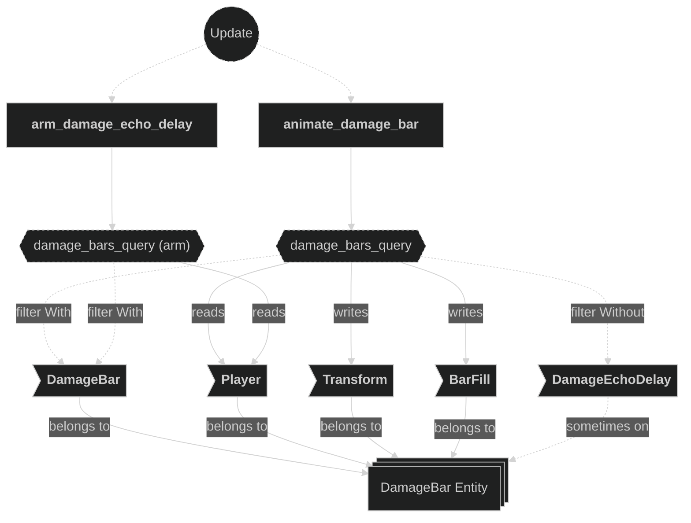
```mermaid
---
config:
  theme: dark
---

flowchart TD
classDef system-group stroke-dasharray: 5 5
classDef query stroke-dasharray: 3 3

update(("`Update`")):::system-group
animate_damage_bar["`**animate_damage_bar**`"]
arm_damage_echo_delay["`**arm_damage_echo_delay**`"]

update -.-> animate_damage_bar
update -.-> arm_damage_echo_delay

damage_bars_query{{"`damage_bars_query`"}}:::query
animate_damage_bar ---> damage_bars_query

damage_bars_query_arm{{"`damage_bars_query (arm)`"}}:::query
arm_damage_echo_delay ---> damage_bars_query_arm

damage_bar_entity@{ shape: st-rect, label: "DamageBar Entity" }

db_damage_bar>"`**DamageBar**`"] --> |belongs to| damage_bar_entity
db_player>"`**Player**`"] --> |belongs to| damage_bar_entity
db_transform>"`**Transform**`"] --> |belongs to| damage_bar_entity
db_fill>"`**BarFill**`"] --> |belongs to| damage_bar_entity
db_delay>"`**DamageEchoDelay**`"] -.-> |sometimes on| damage_bar_entity

damage_bars_query ---> |reads| db_player
damage_bars_query ---> |writes| db_transform
damage_bars_query ---> |writes| db_fill
damage_bars_query -..-> |filter With| db_damage_bar
damage_bars_query -..-> |filter Without| db_delay

damage_bars_query_arm ---> |reads| db_player
damage_bars_query_arm -..-> |filter With| db_damage_bar
```

### Query Player entities (territory/charges ratio)

Used in the following systems:
- **animate_territory_bar**: reads the owned-tile count of each player.
- **animate_charges_bar**: reads the owned-tile count, the charges and the beams in flight of each player.

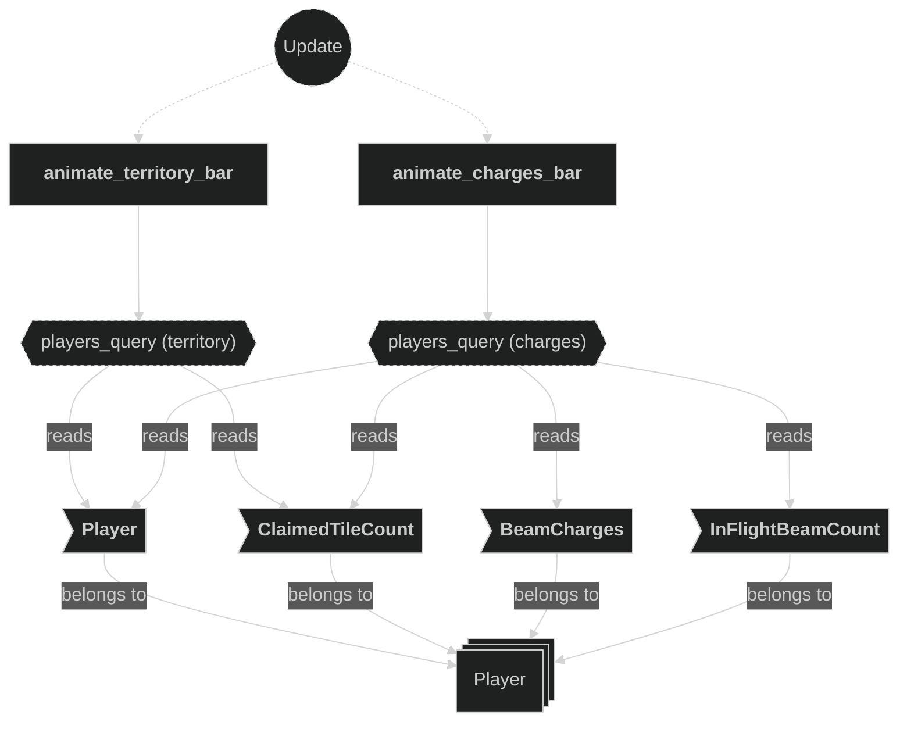
```mermaid
---
config:
  theme: dark
---

flowchart TD
classDef system-group stroke-dasharray: 5 5
classDef query stroke-dasharray: 3 3

update(("`Update`")):::system-group
animate_territory_bar["`**animate_territory_bar**`"]
animate_charges_bar["`**animate_charges_bar**`"]

update -.-> animate_territory_bar
update -.-> animate_charges_bar

territory_players_query{{"`players_query (territory)`"}}:::query
animate_territory_bar ---> territory_players_query

charges_players_query{{"`players_query (charges)`"}}:::query
animate_charges_bar ---> charges_players_query

player_entity@{ shape: st-rect, label: "Player" }

pe_player>"`**Player**`"] --> |belongs to| player_entity
pe_count>"`**ClaimedTileCount**`"] --> |belongs to| player_entity
pe_charges>"`**BeamCharges**`"] --> |belongs to| player_entity
pe_in_flight>"`**InFlightBeamCount**`"] --> |belongs to| player_entity

territory_players_query ---> |reads| pe_player
territory_players_query ---> |reads| pe_count

charges_players_query ---> |reads| pe_player
charges_players_query ---> |reads| pe_count
charges_players_query ---> |reads| pe_charges
charges_players_query ---> |reads| pe_in_flight
```

### Query TerritoryBar entities

Used in the following systems:
- **animate_territory_bar**: moves the bar of each player toward its owned-tile ratio.

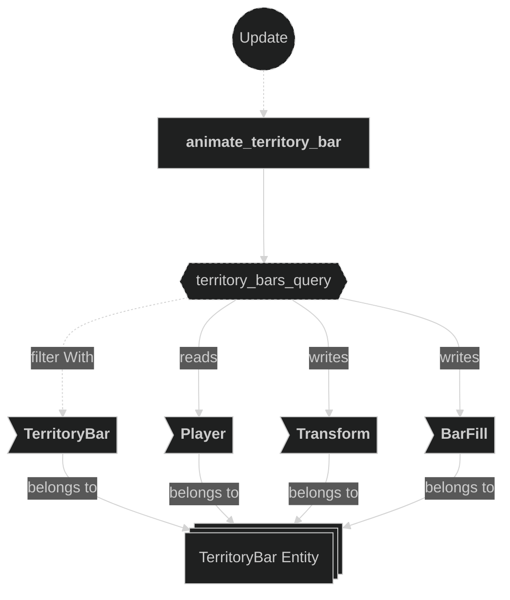
```mermaid
---
config:
  theme: dark
---

flowchart TD
classDef system-group stroke-dasharray: 5 5
classDef query stroke-dasharray: 3 3

update(("`Update`")):::system-group
animate_territory_bar["`**animate_territory_bar**`"]

update -.-> animate_territory_bar

territory_bars_query{{"`territory_bars_query`"}}:::query
animate_territory_bar ---> territory_bars_query

territory_bar_entity@{ shape: st-rect, label: "TerritoryBar Entity" }

tb_bar>"`**TerritoryBar**`"] --> |belongs to| territory_bar_entity
tb_player>"`**Player**`"] --> |belongs to| territory_bar_entity
tb_transform>"`**Transform**`"] --> |belongs to| territory_bar_entity
tb_fill>"`**BarFill**`"] --> |belongs to| territory_bar_entity

territory_bars_query ---> |reads| tb_player
territory_bars_query ---> |writes| tb_transform
territory_bars_query ---> |writes| tb_fill
territory_bars_query -..-> |filter With| tb_bar
```

### Query ChargesBar entities

Used in the following systems:
- **animate_charges_bar**: moves the bar of each player toward its charges ratio.

```mermaid
---
config:
  theme: dark
---

flowchart TD
classDef system-group stroke-dasharray: 5 5
classDef query stroke-dasharray: 3 3

update(("`Update`")):::system-group
animate_charges_bar["`**animate_charges_bar**`"]

update -.-> animate_charges_bar

charges_bars_query{{"`charges_bars_query`"}}:::query
animate_charges_bar ---> charges_bars_query

charges_bar_entity@{ shape: st-rect, label: "ChargesBar Entity" }

cb_bar>"`**ChargesBar**`"] --> |belongs to| charges_bar_entity
cb_player>"`**Player**`"] --> |belongs to| charges_bar_entity
cb_transform>"`**Transform**`"] --> |belongs to| charges_bar_entity
cb_fill>"`**BarFill**`"] --> |belongs to| charges_bar_entity

charges_bars_query ---> |reads| cb_player
charges_bars_query ---> |writes| cb_transform
charges_bars_query ---> |writes| cb_fill
charges_bars_query -..-> |filter With| cb_bar
```

### DamageEchoDelay component lifecycle

`DamageEchoDelay(Timer)` is a private component in `hud.rs`. While a `DamageBar` has it, the bar does not move.

- **Inserted or restarted** by `arm_damage_echo_delay`, when the player's `Health` changes. The timer is `animation.damage_bar_delay_ms`.
- **Ticked** by `tick_damage_echo_delay`, every frame.
- **Removed** by `tick_damage_echo_delay`, when the timer ends.
- **Used** by `animate_damage_bar` as a `Without` filter. The bar moves again after the component is removed.

```mermaid
---
config:
  theme: dark
---

flowchart TD
classDef system-group stroke-dasharray: 5 5

update(("`Update`")):::system-group
arm["`**arm_damage_echo_delay**`"]
tick["`**tick_damage_echo_delay**`"]
animate["`**animate_damage_bar**`"]

update -.-> arm
update -.-> tick
update -.-> animate

damage_bar_entity@{ shape: st-rect, label: "DamageBar Entity" }
delay_component@{ shape: doc, label: "DamageEchoDelay" }

arm ---> |"inserts or restarts (on Changed#60;Health#62;)"| delay_component
tick ---> |ticks timer, removes when it ends| delay_component
delay_component --> |attached to| damage_bar_entity
animate -..-> |"filter Without: skips while present"| delay_component
```

### Read GameConfig and Time

Used in the following systems:
- **animate_hp**, **animate_damage_bar**, **animate_territory_bar**, **animate_charges_bar**: read the bar speed and the frame time.
- **arm_damage_echo_delay**: reads the delay length.
- **tick_damage_echo_delay**: reads the frame time.
- **initialize_digit_animations**: reads the roll frame length.
