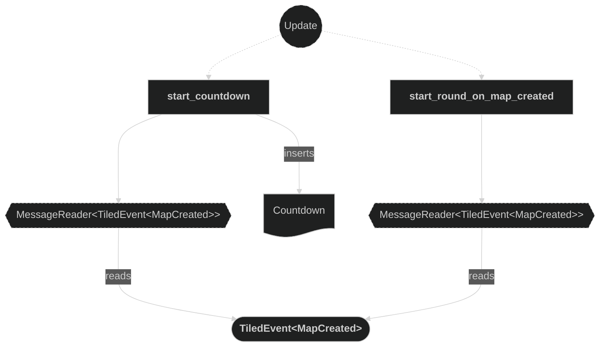
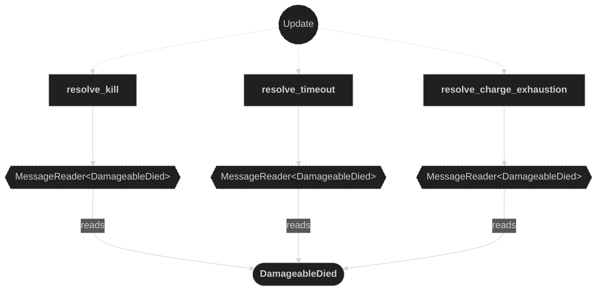
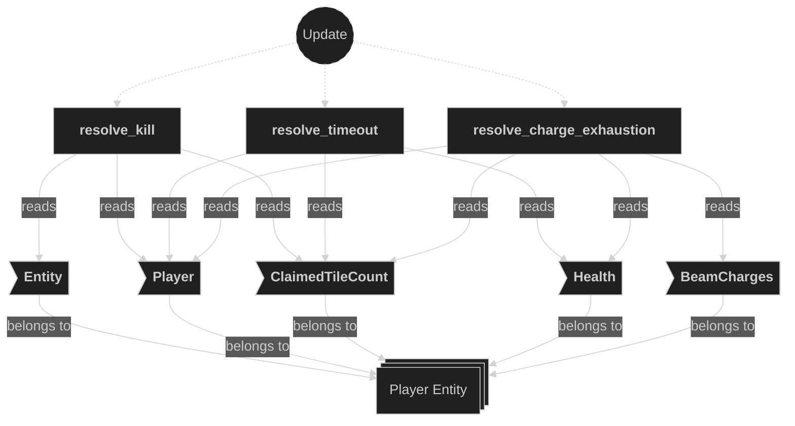
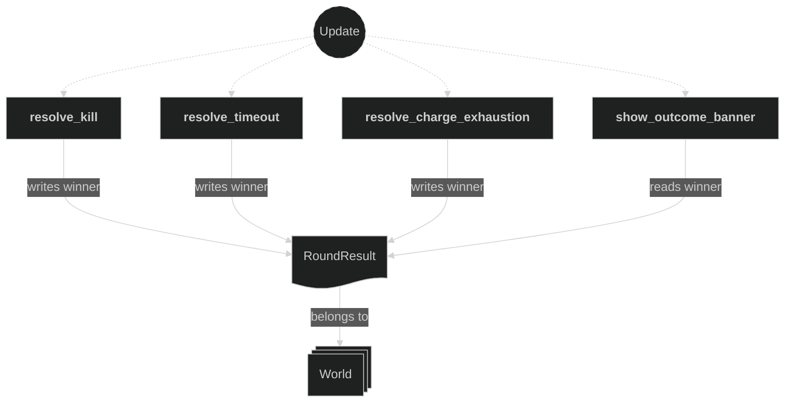
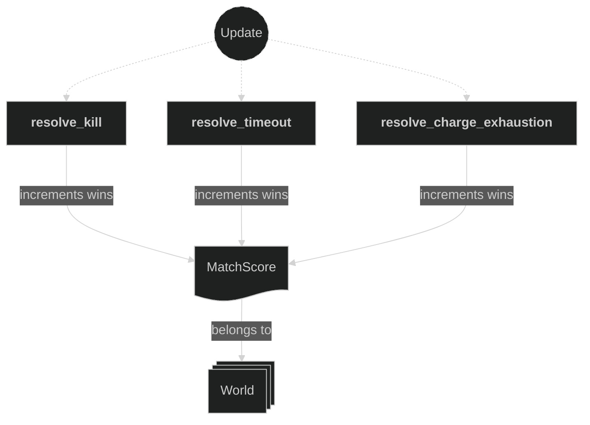
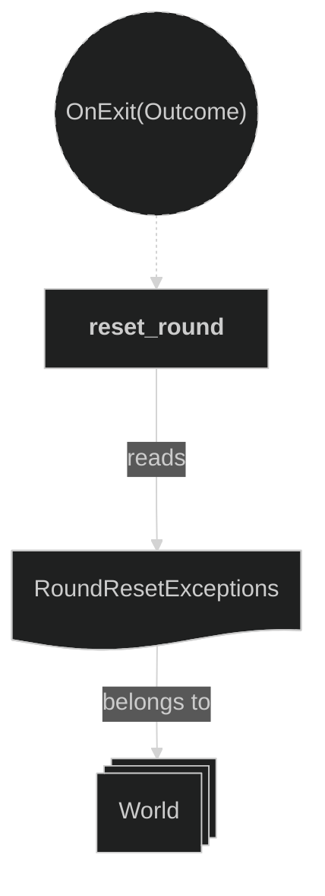
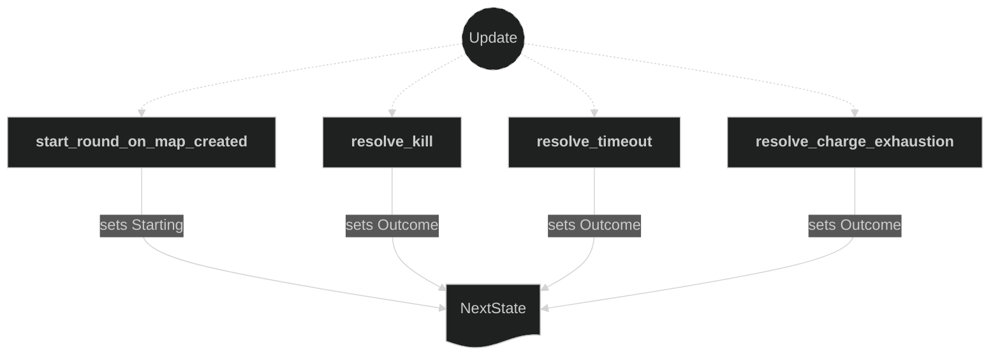
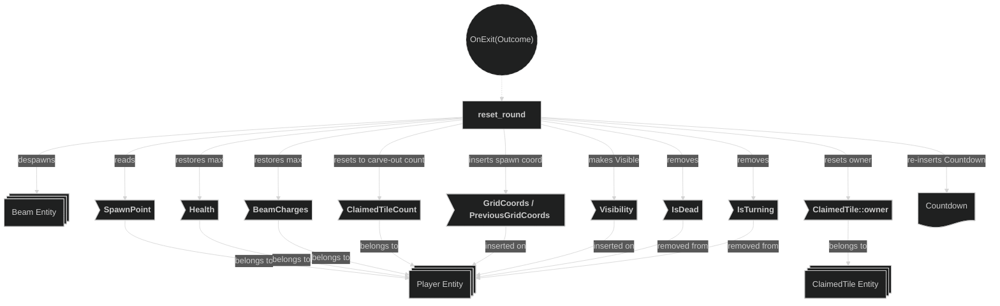

# Round Plugin

The `round` feature — everything scoped to a single round of the match. It is a folder module (`src/plugins/round/`) split by role into three submodules, wired by one `plugin()` entry (`round/mod.rs`):
- **`state`** (`round/state.rs`) — the `RoundPhase` state machine, the round countdown timer, round resolution (kill/timeout) and the full round reset. This document's main focus.
- **`intro`** (`round/intro.rs`) — the round-start "3 · 2 · 1 · GO!" banner presentation. See the Round intro doc.
- **`outcome`** (`round/outcome.rs`) — the win banner shown during `Outcome`, which loops the round back to `Starting` after the reset.

`round/mod.rs` also holds `spawn_round_label`, a small shared helper that centres a bitmap-font label (via the Text plugin's `spawn_label`) on the overlay camera — used by the presentation submodules.

`RoundPhase` is the game's lifecycle state for a single round — `Loading` (waiting for the level map), `Starting` (the on-screen intro countdown, gameplay frozen), `Playing` (live), `Outcome` (the round is over). It is the project's only Bevy `States` type. Live-gameplay systems across the input, movement, beam, and damage plugins run only `in_state(RoundPhase::Playing)`, so the non-play phases freeze the world without any per-system pausing logic. The intro-countdown visuals themselves live in the sibling `intro` submodule; the `state` submodule only owns the phase transitions.

The countdown timer is a global, player-agnostic count from `Countdown::START_SECONDS` down to 0. The plugin holds the `Countdown` resource — the authoritative remaining-seconds value — and the systems that (re)start and tick it. The HUD plugin only *reads* `Countdown::remaining` to drive the on-screen digits; this plugin never touches HUD sprites.

Round resolution implements the two-vector win model. **Kill** (`resolve_kill`) ends the round the instant a player's HP reaches zero — the surviving player wins; a same-frame mutual kill is broken by tile count, then seat. **Timeout** (`resolve_timeout`) ends the round when the countdown reaches zero, resolving by tile count → HP → seat; a same-frame kill preempts it. **Charge exhaustion** (`resolve_charge_exhaustion`) ends the round when every player has spent their last charge and no beam is still in flight — neither side can act, so it resolves immediately by the same tile count → HP → seat tiebreak rather than idling until the timeout; a same-frame kill preempts it, and it defers to the timeout branch on the countdown-zero frame so the score is never credited twice. The two backstops share the `winner_by_standing` ranking helper. Every path records the `RoundResult`, credits the `MatchScore`, and enters `Outcome`. The `outcome` submodule shows the win banner and, after a short linger, loops back to `Starting`; leaving `Outcome` runs `reset_round`, an in-place full wipe of board ownership + charges + health + positions that also revives the dead loser (players are hidden rather than despawned on death — see the Effects plugin doc). Tile ownership is wiped except for entries in `RoundResetExceptions`, the generic carve-out hook reserved for future burst-claim abilities; it is empty today.

It is registered immediately after the Maps plugin in `AppPlugin`, since it reacts to the map being created (both to enter `Starting` and to start the countdown).

## Concepts

- `RoundPhase` (`src/plugins/round/state.rs`) — a `#[derive(States)]` enum with variants `Loading` (default), `Starting`, `Playing`, `Outcome`. Registered with `init_state`. Gameplay systems in other plugins attach `.run_if(in_state(RoundPhase::Playing))`; `tick_countdown` in this plugin does the same, so the countdown only advances during live play.
- `Countdown` (`src/plugins/round/state.rs`) — a **resource**, not a component, because the value is global and not tied to any `Player`. It holds `remaining: u32` (whole seconds, starting at `Countdown::START_SECONDS`) and a private repeating one-second `Timer`. It is inserted at runtime when a map is created rather than at startup, so the display begins at the full value (visible during the intro countdown) once the HUD digits are ready; it is only decremented in `Playing`. It is also re-inserted by `reset_round`, since the map-creation trigger does not re-fire on an in-place round loop.
- `RoundResult` (`src/plugins/round/state.rs`) — a resource holding `winner: Option<u8>` (the winning `player_id`; `None` is a defensive draw fallback). Written by the resolution systems, read by the `outcome` submodule to label the banner.
- `MatchScore` (`src/plugins/round/state.rs`) — a resource holding `wins: [u32; 2]`, the per-player tally of rounds won. It persists across the round reset (a round boundary wipes the board but not the score); credited by the resolution systems via `conclude_round`.
- `RoundResetExceptions` (`src/plugins/round/state.rs`) — a resource wrapping `HashMap<GridCoords, Entity>`: tiles that keep their owner across the reset instead of reverting to unclaimed. The generic carve-out hook for future burst-claim abilities; empty in the current build but already applied by `reset_round`.

The digit *sprites* that render the countdown are per-entity `Digit` components carrying the `CountdownDigit` marker (`src/components/countdown.rs`); they are authored in the HUD Tiled map and driven by the HUD plugin's `animate_countdown` system, which reads this resource.

## Plugin workflow

- Startup phase
    - (none; `RoundPhase` is registered via `init_state`)
- Update phase
    - Start Round on Map Created (runs only `in_state(Loading)`):
        - Reacts to `TiledEvent<MapCreated>` message
            - Reads:
                - `TiledEvent<MapCreated>` messages, filtered to the `CurrentLevel` map (ignores the HUD map)
            - Writes:
                - Sets `NextState<RoundPhase>` to `Starting`
    - Start Countdown:
        - Reacts to `TiledEvent<MapCreated>` message
            - Reads:
                - `TiledEvent<MapCreated>` messages
            - Writes:
                - Inserts a fresh `Countdown` resource (`remaining = Countdown::START_SECONDS`, one-second repeating timer)
    - Tick Countdown (runs only `in_state(Playing)`):
        - Runs every frame while playing
            - Reads:
                - `Time` resource (for the frame delta)
                - `Countdown` resource (optional; skipped until it exists)
            - Writes:
                - Ticks the internal timer and decrements `Countdown::remaining` by one each time a second elapses, holding at zero
    - Resolve Kill (runs only `in_state(Playing)`):
        - Reacts to `DamageableDied` messages
            - Reads:
                - `DamageableDied` messages; `Player` + `ClaimedTileCount` of all players
            - Writes:
                - Sets `RoundResult::winner`, credits `MatchScore`, sets `NextState<RoundPhase>` to `Outcome`
    - Resolve Timeout (runs only `in_state(Playing)`):
        - Runs when `Countdown::remaining` is zero
            - Reads:
                - `DamageableDied` messages (to defer to Resolve Kill if any fired); `Countdown`; `Player` + `ClaimedTileCount` + `Health` of all players
            - Writes:
                - Sets `RoundResult::winner`, credits `MatchScore`, sets `NextState<RoundPhase>` to `Outcome`
    - Resolve Charge Exhaustion (runs only `in_state(Playing)`):
        - Runs when every player's `BeamCharges` is empty and no `Beam` is in flight
            - Reads:
                - `DamageableDied` messages (to defer to Resolve Kill if any fired); `Countdown` (to defer to Resolve Timeout on the countdown-zero frame); all `Beam` entities (to wait for the board to settle); `Player` + `ClaimedTileCount` + `Health` + `BeamCharges` of all players
            - Writes:
                - Sets `RoundResult::winner`, credits `MatchScore`, sets `NextState<RoundPhase>` to `Outcome`
- State-transition schedules
    - Reset Round (runs on `OnExit(RoundPhase::Outcome)`):
        - Reads:
            - `RoundResetExceptions`; each player's `SpawnPoint`; all `ClaimedTile` + `GridCoords`; all `Beam` entities
        - Writes:
            - Resets every `ClaimedTile::owner` (keeping carve-out tiles); restores each player's `Health`, `BeamCharges`, `ClaimedTileCount`, `GridCoords` and `PreviousGridCoords` (both to spawn) and `Visibility`, removing `IsDead` and any in-progress `IsTurning`; despawns in-flight beams; re-inserts the `Countdown` resource

## Plugin Systems

### Start Round on Map Created

Runs only `in_state(RoundPhase::Loading)`. Reads `TiledEvent<MapCreated>` messages, filtered to the `CurrentLevel` map (so the HUD map's own `MapCreated` is ignored), and sets `NextState<RoundPhase>` to `Starting`. The `Loading` run condition makes it fire exactly once per load — once the state leaves `Loading`, the system stops running, so a second `MapCreated` cannot re-trigger it. The state transition applies on the following frame, after the Maps plugin's same-frame init chain has populated `MapInfo` and the players, so `Starting` is always entered with the board ready.

### Start Countdown

Reads `TiledEvent<MapCreated>` messages and, for each, inserts a fresh `Countdown` resource. Inserting on map creation (rather than at `Startup` / via `init_resource`) guarantees the countdown begins at its full starting value at the same moment the board and HUD come up — so the value is visible on the HUD during the intro countdown, before it starts decrementing.

### Tick Countdown

Runs every frame **only while `in_state(RoundPhase::Playing)`**, so the timer holds during the intro countdown and any non-play phase. Takes the `Countdown` resource optionally (it does not exist until the map is created) and returns early if absent or already at zero. Otherwise it ticks the internal repeating one-second timer with `Time::delta()` and, once the timer finishes, decrements `remaining` by one. It follows the same timer-gated tick idiom as the Damage and Beam plugins. A one-second timer never finishes twice in a single frame, so exactly one second is subtracted per elapsed second; at zero it stops.

### Resolve Kill

Runs only `in_state(RoundPhase::Playing)`. Reads `DamageableDied` messages; if none fired this frame it returns. Otherwise it compares the set of dead entities against all players: a single survivor wins outright, while a same-frame mutual kill (no survivor) is broken by the higher `ClaimedTileCount`, then by seat (lower `player_id`). The chosen winner is passed to `conclude_round`, which records `RoundResult`, credits `MatchScore`, and sets `NextState` to `Outcome`. As the highest-priority ending, it fires the instant HP hits zero.

### Resolve Timeout

Runs only `in_state(RoundPhase::Playing)`. Returns early if any `DamageableDied` fired this frame (a kill preempts the timeout), or if the `Countdown` is absent or still above zero. When the countdown has reached zero it ranks players by `ClaimedTileCount`, then `Health`, then seat (lower `player_id`) via `winner_by_standing`, and passes the winner to `conclude_round`. This is the mandatory backstop so no round can stall forever.

### Resolve Charge Exhaustion

Runs only `in_state(RoundPhase::Playing)`. Charges are spent at fire time, and with no charge-regen source in the current build a round can otherwise idle until the timeout once both players run dry. This system ends the round as soon as that state is reached. It returns early if any `DamageableDied` fired this frame (a kill preempts it), if the `Countdown` is present and at zero (the timeout branch resolves that frame with the same result, so deferring avoids double-crediting the score), or if any `Beam` is still in flight — a shot spends its charge on fire but keeps travelling for several steps before it resolves and claims, so it waits for the board to settle so the winner is decided on a final tile count. Once no beam remains and every player's `BeamCharges` is empty (with at least one player present), it ranks players with the shared `winner_by_standing` helper — tile count, then `Health`, then seat — and passes the winner to `conclude_round`.

### Reset Round

Runs on `OnExit(RoundPhase::Outcome)` — so it fires only after a genuine round, never on the first `Loading → Starting`. It wipes tile ownership (each `ClaimedTile::owner` set to its `RoundResetExceptions` entry, or `None`), restores every player to full `Health`/`BeamCharges`, resets `ClaimedTileCount` to the retained carve-out count, moves each player back to its `SpawnPoint` (seeding `PreviousGridCoords` to the same tile so no stale death-tile origin survives into the next round), makes it `Visibility::Visible` and removes `IsDead` (reviving the loser hidden on death), despawns any in-flight `Beam`, and re-inserts a fresh `Countdown` (the map-creation trigger does not re-fire on an in-place loop). Bevy runs this `OnExit` before the following `OnEnter(Starting)`, so the intro countdown always begins on a clean board.

This system only touches the authoritative claim *data* (`ClaimedTile::owner`). Clearing an owner leaves the tile's sprite still showing its old player color, so the matching *visual* revert is owned by the Animations plugin: its Animate Unclaimed Tile system reacts to the ownership change and plays the claim flip in reverse back to the neutral sprite.

## Components, Resources and Messages CRUD

### Read TiledEvent MapCreated messages

Used in the following systems:
- **start_countdown**: used to (re)start the countdown when a map is created
- **start_round_on_map_created** (runs `in_state(Loading)`): filtered to the `CurrentLevel` map, enters `Starting` once the level map exists

### Countdown resource

Used in the following systems:
- **tick_countdown** (this plugin): ticks the timer and decrements `remaining`
- **animate_countdown** (HUD plugin): reads `remaining` to drive the `CountdownDigit` sprites

### Read DamageableDied messages

Used in the following systems:
- **resolve_kill**: reads deaths to end the round instantly, the surviving player winning
- **resolve_timeout**: reads deaths only to defer — if any fired this frame, the kill takes priority so timeout bails
- **resolve_charge_exhaustion**: reads deaths only to defer — if any fired this frame, the kill takes priority so charge exhaustion bails

### Query player entities (resolution)

Used in the following systems:
- **resolve_kill**: reads each player's `Entity`, `Player` and `ClaimedTileCount` to pick the winner (and break a mutual kill by tile count, then seat)
- **resolve_timeout**: reads each player's `Player`, `ClaimedTileCount` and `Health` to rank by tiles → HP → seat
- **resolve_charge_exhaustion**: reads each player's `Player`, `ClaimedTileCount`, `Health` and `BeamCharges` — the charges to detect universal exhaustion, the rest to rank by tiles → HP → seat

### RoundResult resource

Used in the following systems:
- **resolve_kill** / **resolve_timeout** / **resolve_charge_exhaustion** (via `conclude_round`): write `winner`
- **show_outcome_banner** (`outcome` submodule): reads `winner` to label the banner

### MatchScore resource

Used in the following systems:
- **resolve_kill** / **resolve_timeout** / **resolve_charge_exhaustion** (via `conclude_round`): increment the winner's `wins`; persists across the round reset

### RoundResetExceptions resource

Used in the following systems:
- **reset_round**: reads the carve-out set to decide which tiles keep their owner (and which players retain a tile count) through the wipe; empty today

### Set NextState RoundPhase

Used in the following systems:
- **start_round_on_map_created**: sets `Starting` once the level map is created
- **resolve_kill** / **resolve_timeout** / **resolve_charge_exhaustion** (via `conclude_round`): set `Outcome` when the round ends

(The `intro` and `outcome` submodules also drive later transitions — see their docs.)

### Reset Round world writes

Used in the following systems:
- **reset_round** (runs on `OnExit(RoundPhase::Outcome)`): performs the full in-place wipe

Definitions and where they are used:
- `Countdown` — `#[derive(Resource)]`, inserted by `start_countdown` and re-inserted by `reset_round` (this plugin), mutated by `tick_countdown` (this plugin), read by `animate_countdown` (HUD plugin).
- `CountdownDigit` — `#[derive(Component, Reflect, Default)]` marker (`src/components/countdown.rs`), authored on HUD Tiled digit objects, queried by `animate_countdown` (HUD plugin).
- `RoundResult` — `#[derive(Resource, Default)]` holding `winner: Option<u8>`, written by `resolve_kill`/`resolve_timeout` (via `conclude_round`), read by `show_outcome_banner` (`outcome` submodule).
- `MatchScore` — `#[derive(Resource, Default)]` holding `wins: [u32; 2]`, incremented by `conclude_round`; persists across the round reset.
- `RoundResetExceptions` — `#[derive(Resource, Default)]` wrapping `HashMap<GridCoords, Entity>`, read by `reset_round`; the burst-claim carve-out hook, empty today.
- `SpawnPoint` — `#[derive(Component)]` (`src/components/player.rs`), inserted on players by `initialize_players` (Maps plugin), read by `reset_round` to restore spawn positions.
