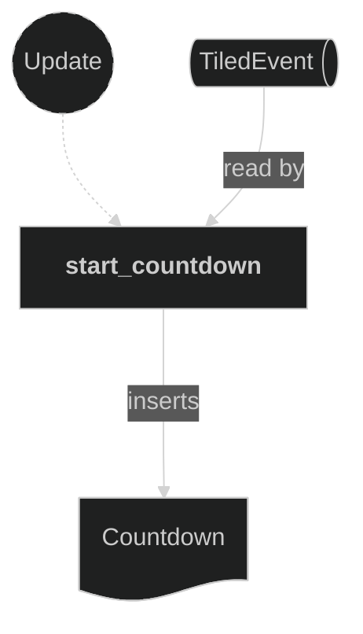

# Round Plugin

The `round` feature — everything scoped to a single round of the match. It is a folder module (`src/plugins/round/`) split by role into two submodules, wired by one `plugin()` entry (`round/mod.rs`):
- **`state`** (`round/state.rs`) — the `RoundPhase` state machine and the round countdown timer. This document's main focus.
- **`intro`** (`round/intro.rs`) — the round-start "3 · 2 · 1 · GO!" banner presentation. See `doc-16`.

`round/mod.rs` also holds `spawn_round_label`, a small shared helper that centres a bitmap-font label (via the Text plugin's `spawn_label`, `doc-17`) on the overlay camera (`doc-6`) — used by the presentation submodules.

`RoundPhase` is the game's lifecycle state for a single round — `Loading` (waiting for the level map), `Starting` (the on-screen intro countdown, gameplay frozen), `Playing` (live), `Outcome` (the round is over). It is the project's only Bevy `States` type. Live-gameplay systems across the input, movement, beam, and damage plugins run only `in_state(RoundPhase::Playing)`, so the non-play phases freeze the world without any per-system pausing logic. The intro-countdown visuals themselves live in the sibling `intro` submodule (`doc-16`); the `state` submodule only owns the phase transitions.

The countdown timer is a global, player-agnostic count from `Countdown::START_SECONDS` down to 0. The plugin holds the `Countdown` resource — the authoritative remaining-seconds value — and the systems that (re)start and tick it. The HUD plugin (`doc-14`) only *reads* `Countdown::remaining` to drive the on-screen digits; this plugin never touches HUD sprites.

Reaching 0 currently has no consumer: the countdown simply holds at 0. Round resolution (kill/timeout outcomes, board reset, win signal) and the `Outcome` phase are not driven yet.

It is registered immediately after the Maps plugin in `AppPlugin`, since it reacts to the map being created (both to enter `Starting` and to start the countdown).

## Concepts

- `RoundPhase` (`src/plugins/round/state.rs`) — a `#[derive(States)]` enum with variants `Loading` (default), `Starting`, `Playing`, `Outcome`. Registered with `init_state`. Gameplay systems in other plugins attach `.run_if(in_state(RoundPhase::Playing))`; `tick_countdown` in this plugin does the same, so the countdown only advances during live play.
- `Countdown` (`src/plugins/round/state.rs`) — a **resource**, not a component, because the value is global and not tied to any `Player`. It holds `remaining: u32` (whole seconds, starting at `Countdown::START_SECONDS`) and a private repeating one-second `Timer`. It is inserted at runtime when a map is created rather than at startup, so the display begins at the full value (visible during the intro countdown) once the HUD digits are ready; it is only decremented in `Playing`.

The digit *sprites* that render the countdown are per-entity `Digit` components carrying the `CountdownDigit` marker (`src/components/countdown.rs`); they are authored in the HUD Tiled map and driven by the HUD plugin's `animate_countdown` system, which reads this resource.

## Plugin workflow

- Startup phase
    - (none; `RoundPhase` is registered via `init_state`)
- Update phase
    - Start Round on Map Created (runs only `in_state(Loading)`):
        - Reacts to `TiledEvent<MapCreated>` message
            - Reads:
                - `TiledEvent<MapCreated>` messages, filtered to the `CurrentLevel` map (ignores the HUD map)
            - Writes:
                - Sets `NextState<RoundPhase>` to `Starting`
    - Start Countdown:
        - Reacts to `TiledEvent<MapCreated>` message
            - Reads:
                - `TiledEvent<MapCreated>` messages
            - Writes:
                - Inserts a fresh `Countdown` resource (`remaining = Countdown::START_SECONDS`, one-second repeating timer)
    - Tick Countdown (runs only `in_state(Playing)`):
        - Runs every frame while playing
            - Reads:
                - `Time` resource (for the frame delta)
                - `Countdown` resource (optional; skipped until it exists)
            - Writes:
                - Ticks the internal timer and decrements `Countdown::remaining` by one each time a second elapses, holding at zero

## Plugin Systems

### Start Round on Map Created

Runs only `in_state(RoundPhase::Loading)`. Reads `TiledEvent<MapCreated>` messages, filtered to the `CurrentLevel` map (so the HUD map's own `MapCreated` is ignored), and sets `NextState<RoundPhase>` to `Starting`. The `Loading` run condition makes it fire exactly once per load — once the state leaves `Loading`, the system stops running, so a second `MapCreated` cannot re-trigger it. The state transition applies on the following frame, after the Maps plugin's same-frame init chain has populated `MapInfo` and the players, so `Starting` is always entered with the board ready.

### Start Countdown

Reads `TiledEvent<MapCreated>` messages and, for each, inserts a fresh `Countdown` resource. Inserting on map creation (rather than at `Startup` / via `init_resource`) guarantees the countdown begins at its full starting value at the same moment the board and HUD come up — so the value is visible on the HUD during the intro countdown, before it starts decrementing.

### Tick Countdown

Runs every frame **only while `in_state(RoundPhase::Playing)`**, so the timer holds during the intro countdown and any non-play phase. Takes the `Countdown` resource optionally (it does not exist until the map is created) and returns early if absent or already at zero. Otherwise it ticks the internal repeating one-second timer with `Time::delta()` and, once the timer finishes, decrements `remaining` by one. It follows the same timer-gated tick idiom as the Damage and Beam plugins. A one-second timer never finishes twice in a single frame, so exactly one second is subtracted per elapsed second; at zero it stops.

## Components, Resources and Messages CRUD

### Read TiledEvent MapCreated messages

Used in the following systems:
- **start_countdown**: used to (re)start the countdown when a map is created

### Countdown resource

Used in the following systems:
- **tick_countdown** (this plugin): ticks the timer and decrements `remaining`
- **animate_countdown** (HUD plugin, `doc-14`): reads `remaining` to drive the `CountdownDigit` sprites

Definitions and where they are used:
- `Countdown` — `#[derive(Resource)]`, inserted by `start_countdown` (this plugin), mutated by `tick_countdown` (this plugin), read by `animate_countdown` (HUD plugin).
- `CountdownDigit` — `#[derive(Component, Reflect, Default)]` marker (`src/components/countdown.rs`), authored on HUD Tiled digit objects, queried by `animate_countdown` (HUD plugin).
