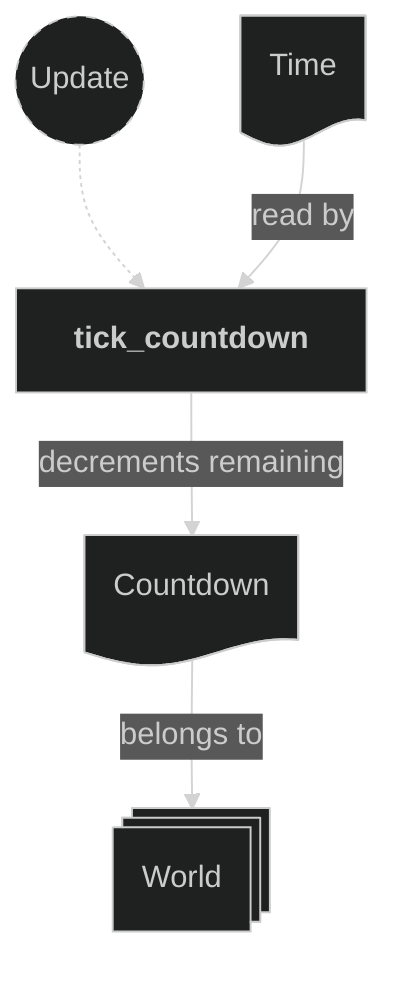

# Round Plugin

Owns round-level game state. Today that is the round countdown timer: a global, player-agnostic count from 120 seconds down to 0. The plugin holds the `Countdown` resource — the authoritative remaining-seconds value — and the systems that (re)start and tick it. The HUD plugin (`doc-14`) only *reads* `Countdown::remaining` to drive the on-screen digits; this plugin never touches HUD sprites.

Reaching 0 currently has no consumer: the countdown simply holds at 0. Round resolution (kill/timeout outcomes, board reset, win signal) is not implemented here yet.

It is registered immediately after the Maps plugin in `AppPlugin`, since it starts the countdown in response to the map being created.

## Concepts

- `Countdown` (`src/plugins/round.rs`) — a **resource**, not a component, because the value is global and not tied to any `Player`. It holds `remaining: u32` (whole seconds, starting at 120) and a private repeating one-second `Timer`. It is inserted at runtime when a map is created rather than at startup, so the display begins at the full value once the HUD digits are ready.

The digit *sprites* that render the countdown are per-entity `Digit` components carrying the `CountdownDigit` marker (`src/components/countdown.rs`); they are authored in the HUD Tiled map and driven by the HUD plugin's `animate_countdown` system, which reads this resource.

## Plugin workflow

- Startup phase
    - (none)
- Update phase
    - Start Countdown:
        - Reacts to `TiledEvent<MapCreated>` message
            - Reads:
                - `TiledEvent<MapCreated>` messages
            - Writes:
                - Inserts a fresh `Countdown` resource (`remaining = 120`, one-second repeating timer)
    - Tick Countdown:
        - Runs every frame
            - Reads:
                - `Time` resource (for the frame delta)
                - `Countdown` resource (optional; skipped until it exists)
            - Writes:
                - Ticks the internal timer and decrements `Countdown::remaining` by one each time a second elapses, holding at zero

## Plugin Systems

### Start Countdown

Reads `TiledEvent<MapCreated>` messages and, for each, inserts a fresh `Countdown` resource. Inserting on map creation (rather than at `Startup` / via `init_resource`) guarantees the countdown begins at its full starting value at the same moment the board and HUD come up.

### Tick Countdown

Runs every frame. Takes the `Countdown` resource optionally (it does not exist until the map is created) and returns early if absent or already at zero. Otherwise it ticks the internal repeating one-second timer with `Time::delta()` and, once the timer finishes, decrements `remaining` by one. It follows the same timer-gated tick idiom as the Damage and Beam plugins. A one-second timer never finishes twice in a single frame, so exactly one second is subtracted per elapsed second; at zero it stops.

## Components, Resources and Messages CRUD

### Read TiledEvent MapCreated messages

Used in the following systems:
- **start_countdown**: used to (re)start the countdown when a map is created

### Countdown resource

Used in the following systems:
- **tick_countdown** (this plugin): ticks the timer and decrements `remaining`
- **animate_countdown** (HUD plugin, `doc-14`): reads `remaining` to drive the `CountdownDigit` sprites

Definitions and where they are used:
- `Countdown` — `#[derive(Resource)]`, inserted by `start_countdown` (this plugin), mutated by `tick_countdown` (this plugin), read by `animate_countdown` (HUD plugin).
- `CountdownDigit` — `#[derive(Component, Reflect, Default)]` marker (`src/components/countdown.rs`), authored on HUD Tiled digit objects, queried by `animate_countdown` (HUD plugin).
