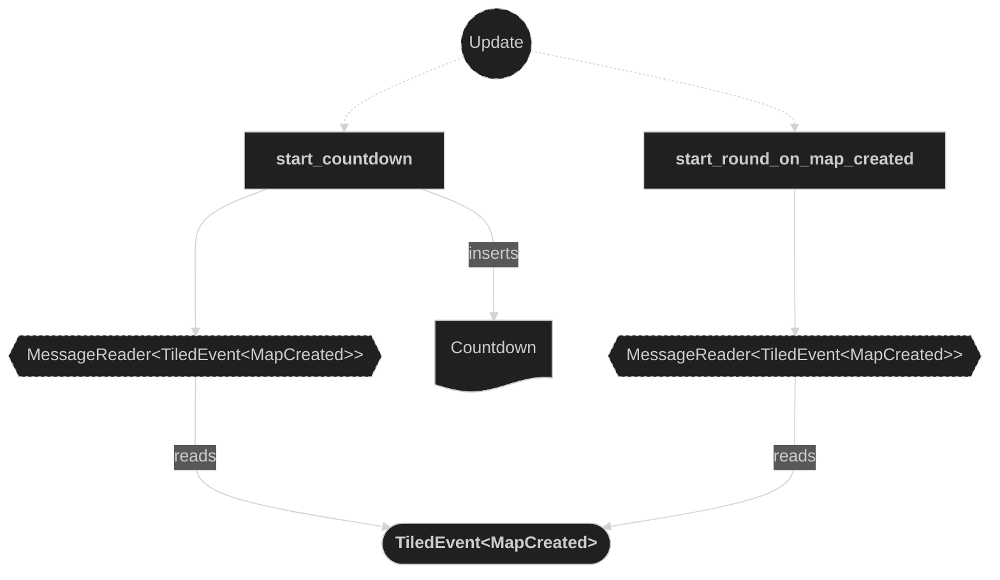
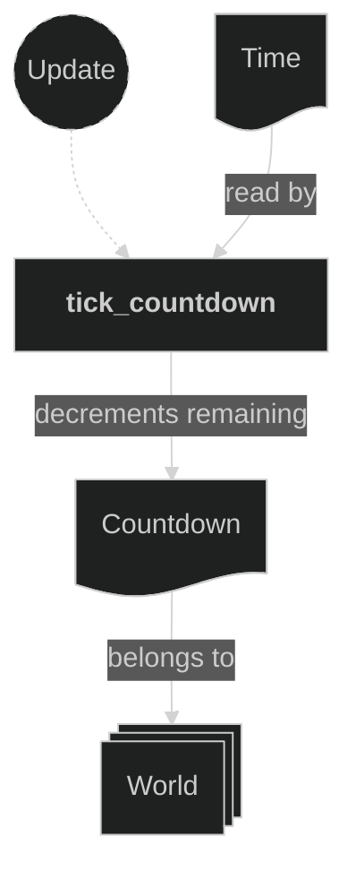
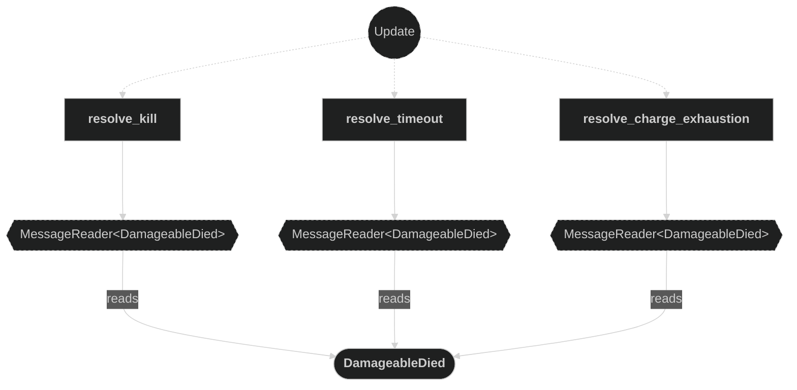
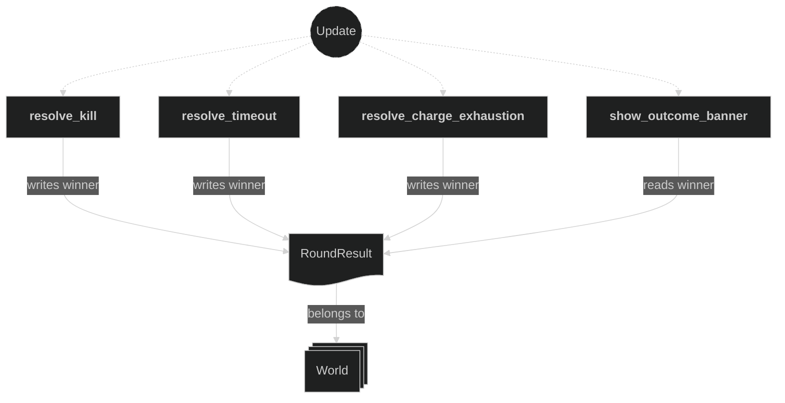
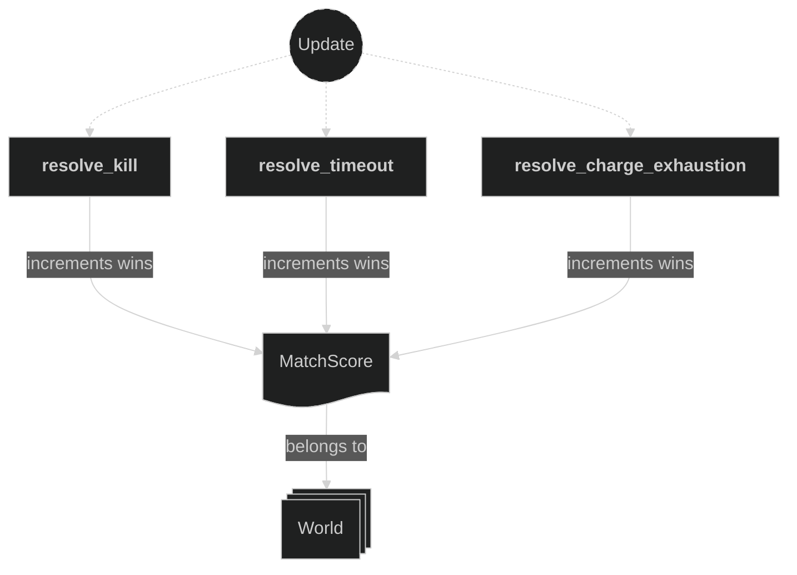
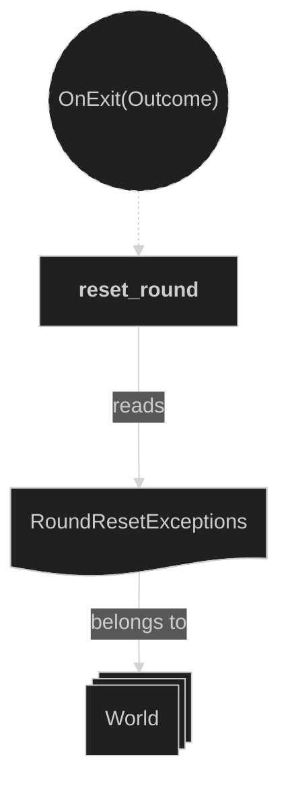
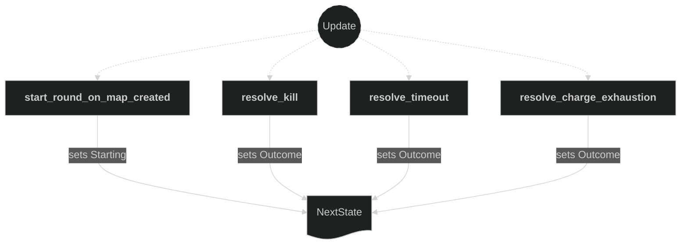
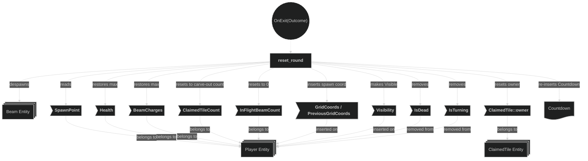

# Round Plugin

The `round` feature — everything scoped to a single round of the match. It is a folder module (`src/plugins/round/`) split by role into three submodules, wired by one `plugin()` entry (`round/mod.rs`):
- **`state`** (`round/state.rs`) — the `RoundPhase` state machine, the round countdown timer, round resolution (kill/timeout) and the full round reset. This document's main focus.
- **`intro`** (`round/intro.rs`) — the round-start "3 · 2 · 1 · GO!" banner presentation. See the Round intro doc.
- **`outcome`** (`round/outcome.rs`) — the win banner shown during `Outcome`, which loops the round back to `Starting` after the reset.

`round/mod.rs` also holds `spawn_round_label`, a small shared helper that centres a bitmap-font label (via the Text plugin's `spawn_label`) on the overlay camera — used by the presentation submodules.

`RoundPhase` is the game's lifecycle state for a round — `Loading` (waiting for the level map), `Starting` (intro countdown, gameplay frozen), `Playing` (live), `Outcome` (round over). It's the project's only Bevy `States` type; live-gameplay systems across input, movement, beam, and damage run only `in_state(RoundPhase::Playing)`, so non-play phases freeze the world without per-system pausing logic. The `state` submodule owns phase transitions; intro-countdown visuals live in the sibling `intro` submodule.

The countdown is a global, player-agnostic timer from `config.round.round_duration_secs` (default 180) to 0. This plugin owns the `Countdown` resource and the systems that (re)start and tick it; the HUD plugin only reads `Countdown::remaining` to drive the digits.

Round resolution ends via one of three paths. **Kill** (`resolve_kill`) ends the round the instant a player's HP reaches zero — the survivor wins; a same-frame mutual kill is broken by tile count, then seat. **Timeout** (`resolve_timeout`) ends the round when the countdown reaches zero, resolving by tile count → HP → seat; a same-frame kill preempts it. **Charge exhaustion** (`resolve_charge_exhaustion`) ends the round once every player's charges and `InFlightBeamCount` are both zero — neither side can act — resolving by the same tile → HP → seat tiebreak rather than waiting for the timeout; a same-frame kill preempts it, and it defers to the timeout branch on the countdown-zero frame so the score isn't credited twice. `InFlightBeamCount` (owned by the Beam plugin) is read directly rather than scanned via `Query<&Beam>`, since a live scan lags a frame behind a beam's spawn. The two backstops share the `winner_by_standing` ranking helper. Every path records `RoundResult`, credits `MatchScore`, and enters `Outcome`. The `outcome` submodule shows the win banner, then loops back to `Starting`; leaving `Outcome` runs `reset_round` — an in-place wipe of board ownership, charges, health, positions, and `InFlightBeamCount` that also revives the dead loser (players are hidden, not despawned, on death — see the Effects plugin doc). Tile ownership is wiped except for entries in `RoundResetExceptions`, the carve-out hook reserved for future burst-claim abilities; empty today.

It is registered immediately after the Maps plugin in `AppPlugin`, since it reacts to the map being created (both to enter `Starting` and to start the countdown).

## Concepts

- `RoundPhase` (`src/plugins/round/state.rs`) — a `#[derive(States)]` enum with variants `Loading` (default), `Starting`, `Playing`, `Outcome`. Registered with `init_state`. Gameplay systems in other plugins attach `.run_if(in_state(RoundPhase::Playing))`; `tick_countdown` in this plugin does the same, so the countdown only advances during live play.
- `Countdown` (`src/plugins/round/state.rs`) — a **resource**, not a component, since the value is global and not tied to any `Player`. Holds `remaining: u32` (starting at `config.round.round_duration_secs`, default 180) and a private repeating one-second `Timer`; `Countdown::new(start_secs)` is called by both `start_countdown` and `reset_round` with that config value. Inserted at map creation rather than `Startup`, so the display shows the full value once the HUD digits exist and is only decremented in `Playing`. Re-inserted by `reset_round`, since map creation doesn't re-fire on an in-place round loop.
- `RoundResult` (`src/plugins/round/state.rs`) — a resource holding `winner: Option<u8>` (the winning `player_id`; `None` is a defensive draw fallback). Written by the resolution systems, read by the `outcome` submodule to label the banner.
- `MatchScore` (`src/plugins/round/state.rs`) — a resource holding `wins: [u32; 2]`, the per-player tally of rounds won. It persists across the round reset (a round boundary wipes the board but not the score); credited by the resolution systems via `conclude_round`.
- `RoundResetExceptions` (`src/plugins/round/state.rs`) — a resource wrapping `HashMap<GridCoords, Entity>`: tiles that keep their owner across the reset instead of reverting to unclaimed. The generic carve-out hook for future burst-claim abilities; empty in the current build but already applied by `reset_round`.

The digit *sprites* that render the countdown are per-entity `Digit` components carrying the `CountdownDigit` marker (`src/components/countdown.rs`); they are authored in the HUD Tiled map and driven by the HUD plugin's `animate_countdown` system, which reads this resource.

## Plugin workflow

- Startup phase
    - (none; `RoundPhase` is registered via `init_state`)
- Update phase
    - Start Round on Map Created (runs only `in_state(Loading)`):
        - Reacts to `TiledEvent<MapCreated>` message
            - Reads:
                - `TiledEvent<MapCreated>` messages, filtered to the `CurrentLevel` map (ignores the HUD map)
            - Writes:
                - Sets `NextState<RoundPhase>` to `Starting`
    - Start Countdown:
        - Reacts to `TiledEvent<MapCreated>` message
            - Reads:
                - `TiledEvent<MapCreated>` messages
            - Writes:
                - Inserts a fresh `Countdown` resource (`remaining = config.round.round_duration_secs`, one-second repeating timer)
    - Tick Countdown (runs only `in_state(Playing)`):
        - Runs every frame while playing
            - Reads:
                - `Time` resource (for the frame delta)
                - `Countdown` resource (optional; skipped until it exists)
            - Writes:
                - Ticks the internal timer and decrements `Countdown::remaining` by one each time a second elapses, holding at zero
    - Resolve Kill (runs only `in_state(Playing)`):
        - Reacts to `DamageableDied` messages
            - Reads:
                - `DamageableDied` messages; `Player` + `ClaimedTileCount` of all players
            - Writes:
                - Sets `RoundResult::winner`, credits `MatchScore`, sets `NextState<RoundPhase>` to `Outcome`
    - Resolve Timeout (runs only `in_state(Playing)`):
        - Runs when `Countdown::remaining` is zero
            - Reads:
                - `DamageableDied` messages (to defer to Resolve Kill if any fired); `Countdown`; `Player` + `ClaimedTileCount` + `Health` of all players
            - Writes:
                - Sets `RoundResult::winner`, credits `MatchScore`, sets `NextState<RoundPhase>` to `Outcome`
    - Resolve Charge Exhaustion (runs only `in_state(Playing)`):
        - Runs when every player's `BeamCharges` is empty and every player's `InFlightBeamCount` is zero
            - Reads:
                - `DamageableDied` messages (to defer to Resolve Kill if any fired); `Countdown` (to defer to Resolve Timeout on the countdown-zero frame); every player's `InFlightBeamCount` (to wait for the board to settle); `Player` + `ClaimedTileCount` + `Health` + `BeamCharges` of all players
            - Writes:
                - Sets `RoundResult::winner`, credits `MatchScore`, sets `NextState<RoundPhase>` to `Outcome`
- State-transition schedules
    - Reset Round (runs on `OnExit(RoundPhase::Outcome)`):
        - Reads:
            - `RoundResetExceptions`; each player's `SpawnPoint`; all `ClaimedTile` + `GridCoords`; all `Beam` entities
        - Writes:
            - Resets every `ClaimedTile::owner` (keeping carve-out tiles); restores each player's `Health`, `BeamCharges`, `ClaimedTileCount`, `InFlightBeamCount`, `GridCoords` and `PreviousGridCoords` (both to spawn) and `Visibility`, removing `IsDead` and any in-progress `IsTurning`; despawns in-flight beams; re-inserts the `Countdown` resource

## Plugin Systems

### Start Round on Map Created

Runs only `in_state(RoundPhase::Loading)`. Reads `TiledEvent<MapCreated>`, filtered to `CurrentLevel` (ignoring the HUD map's own event), and sets `NextState<RoundPhase>` to `Starting`. The `Loading` run condition guarantees this fires exactly once per load — once state leaves `Loading`, a second `MapCreated` can't re-trigger it. The transition applies next frame, after the Maps plugin's init chain has populated `MapInfo` and players, so `Starting` always begins with the board ready.

### Start Countdown

Reads `TiledEvent<MapCreated>` and `GameConfig`, inserting a fresh `Countdown` seeded with `config.round.round_duration_secs` for each event. Inserting on map creation (rather than at `Startup`) guarantees the countdown starts at its full value the moment the board and HUD come up, visible during the intro countdown before it decrements.

### Tick Countdown

Runs every frame only while `in_state(RoundPhase::Playing)`, so the timer holds during the intro countdown and any non-play phase. Takes `Countdown` optionally (absent until map creation) and returns early if absent or at zero. Otherwise ticks the internal one-second timer with `Time::delta()` and decrements `remaining` by one each time it finishes — never twice in one frame, so exactly one second is subtracted per elapsed second. Follows the same timer-gated tick idiom as the Damage and Beam plugins.

### Resolve Kill

Runs only `in_state(RoundPhase::Playing)`. Reads `DamageableDied`; returns if none fired. Otherwise compares dead entities against all players: a single survivor wins outright; a same-frame mutual kill is broken by higher `ClaimedTileCount`, then seat (lower `player_id`). Passes the winner to `conclude_round`, which records `RoundResult`, credits `MatchScore`, and sets `NextState` to `Outcome`. Fires the instant HP hits zero, taking priority over the other endings.

### Resolve Timeout

Runs only `in_state(RoundPhase::Playing)`. Returns early if a kill fired this frame (which preempts it), or if `Countdown` is absent or still above zero. Once the countdown reaches zero, ranks players via `winner_by_standing` (tile count → `Health` → seat) and passes the winner to `conclude_round`. The mandatory backstop that keeps a round from stalling forever.

### Resolve Charge Exhaustion

Runs only `in_state(RoundPhase::Playing)`. Ends the round once both players are out of charges, rather than letting a round idle until the timeout. Returns early if a kill fired this frame, if `Countdown` is present and already at zero (the timeout branch resolves that frame, so deferring avoids double-crediting the score), or if any player's `InFlightBeamCount` is above zero — a shot spends its charge on fire but keeps travelling for several steps before resolving, so this waits for the board to settle before deciding a winner on final tile count. It reads `InFlightBeamCount` directly (synchronously maintained by the Beam plugin) rather than scanning `Query<With<Beam>>`, which would miss a beam whose spawn `Commands` haven't flushed yet. Once no player has a beam in flight and every player's `BeamCharges` is empty (with at least one player present), it ranks players via `winner_by_standing` — tile count → `Health` → seat — and passes the winner to `conclude_round`.

### Reset Round

Runs on `OnExit(RoundPhase::Outcome)`, so it fires only after a genuine round, never on the first `Loading → Starting`. Wipes tile ownership (`ClaimedTile::owner` set to its `RoundResetExceptions` entry or `None`), restores every player to full `Health`/`BeamCharges`, resets `ClaimedTileCount` to the retained carve-out count, zeroes `InFlightBeamCount` regardless of what was in flight, moves each player back to `SpawnPoint` (seeding `PreviousGridCoords` to the same tile so no stale death-tile origin carries over), sets `Visibility::Visible` and removes `IsDead` (reviving the hidden loser), despawns any remaining in-flight `Beam` entities directly (independent of the `InFlightBeamCount` zeroing, which only touches the player-side counter), and re-inserts a fresh `Countdown` from `config.round.round_duration_secs` (map creation doesn't re-fire on an in-place loop). Bevy runs this `OnExit` before the following `OnEnter(Starting)`, so the intro countdown always begins on a clean board.

This system only touches claim data (`ClaimedTile::owner`) — clearing an owner leaves the tile's sprite showing its old color, so the visual revert is owned by the Animations plugin's Animate Unclaimed Tile system, which reacts to the change and plays the claim flip in reverse back to neutral.

## Components, Resources and Messages CRUD

### Read TiledEvent MapCreated messages

Used in the following systems:
- **start_countdown**: used to (re)start the countdown when a map is created
- **start_round_on_map_created** (runs `in_state(Loading)`): filtered to the `CurrentLevel` map, enters `Starting` once the level map exists

```mermaid
---
config:
  theme: dark
---

flowchart TD
classDef system-group stroke-dasharray: 5 5
classDef reader stroke-dasharray: 3 3

update(("`Update`")):::system-group
start_countdown["`**start_countdown**`"]
start_round_on_map_created["`**start_round_on_map_created**`"]

update -.-> start_countdown
update -.-> start_round_on_map_created

start_countdown_reader{{"MessageReader#60;TiledEvent#60;MapCreated#62;#62;"}}:::reader
start_round_reader{{"MessageReader#60;TiledEvent#60;MapCreated#62;#62;"}}:::reader
start_countdown ---> start_countdown_reader
start_round_on_map_created ---> start_round_reader

map_created_message(["`**TiledEvent#60;MapCreated#62;**`"])
start_countdown_reader ---> |reads| map_created_message
start_round_reader ---> |reads| map_created_message

countdown_res@{ shape: doc, label: "Countdown" }
start_countdown ---> |inserts| countdown_res
```

### Countdown resource

Used in the following systems:
- **tick_countdown** (this plugin): ticks the timer and decrements `remaining`
- **animate_countdown** (HUD plugin): reads `remaining` to drive the `CountdownDigit` sprites

```mermaid
---
config:
  theme: dark
---

flowchart TD
classDef system-group stroke-dasharray: 5 5

update(("`Update`")):::system-group
tick_countdown["`**tick_countdown**`"]

update -.-> tick_countdown

world@{ shape: st-rect, label: "World" }
time_res@{ shape: doc, label: "Time" }
countdown_res@{ shape: doc, label: "Countdown" }

countdown_res --> |belongs to| world
time_res --> |read by| tick_countdown
tick_countdown --> |decrements remaining| countdown_res
```

### Read DamageableDied messages

Used in the following systems:
- **resolve_kill**: reads deaths to end the round instantly, the surviving player winning
- **resolve_timeout**: reads deaths only to defer — if any fired this frame, the kill takes priority so timeout bails
- **resolve_charge_exhaustion**: reads deaths only to defer — if any fired this frame, the kill takes priority so charge exhaustion bails

```mermaid
---
config:
  theme: dark
---

flowchart TD
classDef system-group stroke-dasharray: 5 5
classDef reader stroke-dasharray: 3 3

update(("`Update`")):::system-group
resolve_kill["`**resolve_kill**`"]
resolve_timeout["`**resolve_timeout**`"]
resolve_charge_exhaustion["`**resolve_charge_exhaustion**`"]

update -.-> resolve_kill
update -.-> resolve_timeout
update -.-> resolve_charge_exhaustion

resolve_kill_reader{{"MessageReader#60;DamageableDied#62;"}}:::reader
resolve_timeout_reader{{"MessageReader#60;DamageableDied#62;"}}:::reader
resolve_exhaustion_reader{{"MessageReader#60;DamageableDied#62;"}}:::reader
resolve_kill ---> resolve_kill_reader
resolve_timeout ---> resolve_timeout_reader
resolve_charge_exhaustion ---> resolve_exhaustion_reader

damageable_died_message(["`**DamageableDied**`"])
resolve_kill_reader ---> |reads| damageable_died_message
resolve_timeout_reader ---> |reads| damageable_died_message
resolve_exhaustion_reader ---> |reads| damageable_died_message
```

### Query player entities (resolution)

Used in the following systems:
- **resolve_kill**: reads each player's `Entity`, `Player` and `ClaimedTileCount` to pick the winner (and break a mutual kill by tile count, then seat)
- **resolve_timeout**: reads each player's `Player`, `ClaimedTileCount` and `Health` to rank by tiles → HP → seat
- **resolve_charge_exhaustion**: reads each player's `Player`, `ClaimedTileCount`, `Health` and `BeamCharges` — the charges to detect universal exhaustion, the rest to rank by tiles → HP → seat — plus a separate `Query<&InFlightBeamCount>` over all players, to confirm no beam is still in flight before resolving

```mermaid
---
config:
  theme: dark
---

flowchart TD
classDef system-group stroke-dasharray: 5 5

update(("`Update`")):::system-group
resolve_kill["`**resolve_kill**`"]
resolve_timeout["`**resolve_timeout**`"]
resolve_charge_exhaustion["`**resolve_charge_exhaustion**`"]

update -.-> resolve_kill
update -.-> resolve_timeout
update -.-> resolve_charge_exhaustion

player_entity@{ shape: st-rect, label: "Player Entity" }

pe_entity>"`**Entity**`"] --> |belongs to| player_entity
pe_player>"`**Player**`"] --> |belongs to| player_entity
pe_count>"`**ClaimedTileCount**`"] --> |belongs to| player_entity
pe_health>"`**Health**`"] --> |belongs to| player_entity
pe_charges>"`**BeamCharges**`"] --> |belongs to| player_entity
pe_in_flight>"`**InFlightBeamCount**`"] --> |belongs to| player_entity

resolve_kill ---> |reads| pe_entity
resolve_kill ---> |reads| pe_player
resolve_kill ---> |reads| pe_count
resolve_timeout ---> |reads| pe_player
resolve_timeout ---> |reads| pe_count
resolve_timeout ---> |reads| pe_health
resolve_charge_exhaustion ---> |reads| pe_player
resolve_charge_exhaustion ---> |reads| pe_count
resolve_charge_exhaustion ---> |reads| pe_health
resolve_charge_exhaustion ---> |reads| pe_charges
resolve_charge_exhaustion ---> |reads (separate query)| pe_in_flight
```

### RoundResult resource

Used in the following systems:
- **resolve_kill** / **resolve_timeout** / **resolve_charge_exhaustion** (via `conclude_round`): write `winner`
- **show_outcome_banner** (`outcome` submodule): reads `winner` to label the banner

```mermaid
---
config:
  theme: dark
---

flowchart TD
classDef system-group stroke-dasharray: 5 5

update(("`Update`")):::system-group
resolve_kill["`**resolve_kill**`"]
resolve_timeout["`**resolve_timeout**`"]
resolve_charge_exhaustion["`**resolve_charge_exhaustion**`"]
show_outcome_banner["`**show_outcome_banner**`"]

update -.-> resolve_kill
update -.-> resolve_timeout
update -.-> resolve_charge_exhaustion
update -.-> show_outcome_banner

world@{ shape: st-rect, label: "World" }
round_result_res@{ shape: doc, label: "RoundResult" }

round_result_res --> |belongs to| world
resolve_kill ---> |writes winner| round_result_res
resolve_timeout ---> |writes winner| round_result_res
resolve_charge_exhaustion ---> |writes winner| round_result_res
show_outcome_banner ---> |reads winner| round_result_res
```

### MatchScore resource

Used in the following systems:
- **resolve_kill** / **resolve_timeout** / **resolve_charge_exhaustion** (via `conclude_round`): increment the winner's `wins`; persists across the round reset

```mermaid
---
config:
  theme: dark
---

flowchart TD
classDef system-group stroke-dasharray: 5 5

update(("`Update`")):::system-group
resolve_kill["`**resolve_kill**`"]
resolve_timeout["`**resolve_timeout**`"]
resolve_charge_exhaustion["`**resolve_charge_exhaustion**`"]

update -.-> resolve_kill
update -.-> resolve_timeout
update -.-> resolve_charge_exhaustion

world@{ shape: st-rect, label: "World" }
match_score_res@{ shape: doc, label: "MatchScore" }

match_score_res --> |belongs to| world
resolve_kill ---> |increments wins| match_score_res
resolve_timeout ---> |increments wins| match_score_res
resolve_charge_exhaustion ---> |increments wins| match_score_res
```

### RoundResetExceptions resource

Used in the following systems:
- **reset_round**: reads the carve-out set to decide which tiles keep their owner (and which players retain a tile count) through the wipe; empty today

```mermaid
---
config:
  theme: dark
---

flowchart TD
classDef system-group stroke-dasharray: 5 5

state_transition(("`OnExit(Outcome)`")):::system-group
reset_round["`**reset_round**`"]

state_transition -.-> reset_round

world@{ shape: st-rect, label: "World" }
exceptions_res@{ shape: doc, label: "RoundResetExceptions" }

exceptions_res --> |belongs to| world
reset_round ---> |reads| exceptions_res
```

### Set NextState RoundPhase

Used in the following systems:
- **start_round_on_map_created**: sets `Starting` once the level map is created
- **resolve_kill** / **resolve_timeout** / **resolve_charge_exhaustion** (via `conclude_round`): set `Outcome` when the round ends

(The `intro` and `outcome` submodules also drive later transitions — see their docs.)

```mermaid
---
config:
  theme: dark
---

flowchart TD
classDef system-group stroke-dasharray: 5 5

update(("`Update`")):::system-group
start_round_on_map_created["`**start_round_on_map_created**`"]
resolve_kill["`**resolve_kill**`"]
resolve_timeout["`**resolve_timeout**`"]
resolve_charge_exhaustion["`**resolve_charge_exhaustion**`"]

update -.-> start_round_on_map_created
update -.-> resolve_kill
update -.-> resolve_timeout
update -.-> resolve_charge_exhaustion

next_state_res@{ shape: doc, label: "NextState<RoundPhase>" }

start_round_on_map_created ---> |sets Starting| next_state_res
resolve_kill ---> |sets Outcome| next_state_res
resolve_timeout ---> |sets Outcome| next_state_res
resolve_charge_exhaustion ---> |sets Outcome| next_state_res
```

### Reset Round world writes

Used in the following systems:
- **reset_round** (runs on `OnExit(RoundPhase::Outcome)`): performs the full in-place wipe

```mermaid
---
config:
  theme: dark
---

flowchart TD
classDef system-group stroke-dasharray: 5 5

state_transition(("`OnExit(Outcome)`")):::system-group
reset_round["`**reset_round**`"]

state_transition -.-> reset_round

player_entity@{ shape: st-rect, label: "Player Entity" }
tile_entity@{ shape: st-rect, label: "ClaimedTile Entity" }
beam_entity@{ shape: st-rect, label: "Beam Entity" }

pe_spawn>"`**SpawnPoint**`"] --> |belongs to| player_entity
pe_health>"`**Health**`"] --> |belongs to| player_entity
pe_charges>"`**BeamCharges**`"] --> |belongs to| player_entity
pe_count>"`**ClaimedTileCount**`"] --> |belongs to| player_entity
pe_in_flight>"`**InFlightBeamCount**`"] --> |belongs to| player_entity
pe_coords>"`**GridCoords / PreviousGridCoords**`"] --> |inserted on| player_entity
pe_vis>"`**Visibility**`"] --> |inserted on| player_entity
pe_dead>"`**IsDead**`"] --> |removed from| player_entity
pe_turning>"`**IsTurning**`"] --> |removed from| player_entity
te_owner>"`**ClaimedTile::owner**`"] --> |belongs to| tile_entity

reset_round ---> |reads| pe_spawn
reset_round ---> |restores max| pe_health
reset_round ---> |restores max| pe_charges
reset_round ---> |resets to carve-out count| pe_count
reset_round ---> |resets to 0| pe_in_flight
reset_round ---> |inserts spawn coord| pe_coords
reset_round ---> |makes Visible| pe_vis
reset_round ---> |removes| pe_dead
reset_round ---> |removes| pe_turning
reset_round ---> |resets owner| te_owner
reset_round ---> |despawns| beam_entity
reset_round ---> |re-inserts Countdown| world_res

world_res@{ shape: doc, label: "Countdown" }
```

Definitions and where they are used:
- `Countdown` — `#[derive(Resource)]`, inserted by `start_countdown` and re-inserted by `reset_round` (this plugin), mutated by `tick_countdown` (this plugin), read by `animate_countdown` (HUD plugin).
- `CountdownDigit` — `#[derive(Component, Reflect, Default)]` marker (`src/components/countdown.rs`), authored on HUD Tiled digit objects, queried by `animate_countdown` (HUD plugin).
- `RoundResult` — `#[derive(Resource, Default)]` holding `winner: Option<u8>`, written by `resolve_kill`/`resolve_timeout` (via `conclude_round`), read by `show_outcome_banner` (`outcome` submodule).
- `MatchScore` — `#[derive(Resource, Default)]` holding `wins: [u32; 2]`, incremented by `conclude_round`; persists across the round reset.
- `RoundResetExceptions` — `#[derive(Resource, Default)]` wrapping `HashMap<GridCoords, Entity>`, read by `reset_round`; the burst-claim carve-out hook, empty today.
- `SpawnPoint` — `#[derive(Component)]` (`src/components/player.rs`), inserted on players by `initialize_players` (Maps plugin), read by `reset_round` to restore spawn positions.
