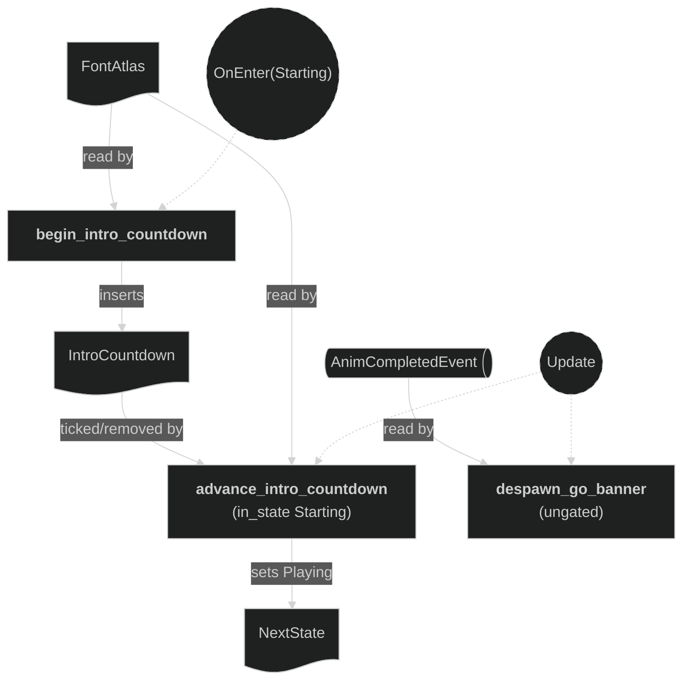

# Round Intro

The `intro` submodule of the `round` plugin (`src/plugins/round/intro.rs`; the round feature is `doc-15`). It renders the round-start "3 · 2 · 1 · GO!" banner shown while the round is in `RoundPhase::Starting`. More round-phase banners (e.g. a win banner for `Outcome`) will join as sibling submodules later.

It owns only the banner **content** (the countdown logic). Text is composed with `spawn_label` from the Text plugin (`doc-17`), and the banners render on the **overlay camera**, spawned by the Camera plugin (`doc-6`). This keeps the submodule free of both font loading and camera setup, mirroring the HUD split (HUD content in the HUD plugin, HUD camera in the Camera plugin). Its systems are wired into the app by `round/mod.rs`.

## Concepts

- **Overlay camera** — spawned and owned by the Camera plugin (`doc-6`), not here. It is a fixed, full-window fourth camera on `OVERLAY_RENDER_LAYER` (layer 3), order 4, `ClearColorConfig::None`, that composites banners on top of the world and HUD. The banners spawned here pass `RenderLayers::layer(OVERLAY_RENDER_LAYER)` to `spawn_label` so this camera sees them.

- **Text rendering** — `FontAtlas` (resource) and `spawn_label` come from the Text plugin (`doc-17`); this submodule is a consumer. The round's shared `spawn_round_label` helper (in `round/mod.rs`) wraps `spawn_label` with the fixed choices for round banners (centred at the origin, on `OVERLAY_RENDER_LAYER`).

- `CountdownNumber` — a marker **component** on the number label currently shown ("3"/"2"/"1"); the advance system swaps it out each step by querying `With<CountdownNumber>` and despawning.

- `GoBanner` — a marker **component** on the "GO!" label. It carries a `TweenAnim` (`bevy_tweening`, `TransformScaleLens` with `EaseFunction::ExponentialIn`) that accelerates the label's scale up to a screen-overflowing size, so it reads as rushing toward the players and flying off-screen; the label is despawned on completion.

- `IntroCountdown` — a **resource** driving the number sequence: a one-second repeating `Timer` plus the current number (`3 → 2 → 1`, then `0` meaning "fire GO!"). Inserted on entering `Starting`, removed when "GO!" fires.

## Plugin workflow

- `OnEnter(RoundPhase::Starting)`
    - Begin Intro Countdown:
        - Reads: `FontAtlas` (from the Text plugin)
        - Writes: spawns the "3" label (marked `CountdownNumber`); inserts the `IntroCountdown` resource
- Update phase
    - Advance Intro Countdown (runs only `in_state(Starting)`):
        - Reads: `Time`, `FontAtlas`, `IntroCountdown`, entities `With<CountdownNumber>`
        - Writes: on each timer step, despawns the current number and either spawns the next number, or (when numbers are exhausted) spawns the "GO!" label with a scale-up `TweenAnim`, removes `IntroCountdown`, and sets `NextState<RoundPhase>` to `Playing`
    - Despawn Go Banner (**ungated**):
        - Reads: `AnimCompletedEvent` messages, entities `With<GoBanner>`
        - Writes: despawns the "GO!" label once its tween completes

## Plugin Systems

### Begin Intro Countdown

Runs on `OnEnter(RoundPhase::Starting)`. Spawns the first number ("3") at the origin via `spawn_round_label` (the round's shared wrapper around the Text plugin's `spawn_label`), tags it `CountdownNumber`, and inserts a fresh `IntroCountdown` (one-second repeating timer, `remaining = 3`). Spawning "3" here — rather than waiting for the advance system's first tick — avoids a blank first second.

### Advance Intro Countdown

Runs every frame **only `in_state(RoundPhase::Starting)`**. Ticks the `IntroCountdown` timer; when a step elapses it despawns the current `CountdownNumber` and decrements the count. While numbers remain it spawns the next one ("2", then "1"). When the count reaches zero it instead spawns the "GO!" label with a `GoBanner` marker and a `TransformScaleLens` scale-up `TweenAnim`, removes the `IntroCountdown` resource, and sets `NextState<RoundPhase>` to `Playing` — so gameplay unfreezes in the same run while the "GO!" banner keeps animating.

### Despawn Go Banner

Runs every frame and is **deliberately ungated** — by the time the "GO!" tween finishes, the state is already `Playing`, so gating it on `Starting` would strand the banner on screen (`TweenAnim` auto-removes only its own component on completion, not the entity). Reads `AnimCompletedEvent` and, when the completed animation belongs to a `GoBanner` entity, despawns it (recursively removing its glyph children). Mirrors the Effects plugin's death-effect cleanup (`doc-10`).

## Components and Resources CRUD

Definitions and where they are used:
- `FontAtlas` — owned by the Text plugin (`doc-17`); read here by `begin_intro_countdown` and `advance_intro_countdown` via `spawn_round_label`.
- `CountdownNumber` — marker `#[derive(Component)]` (this plugin), attached in `begin_intro_countdown` / `advance_intro_countdown`, queried/despawned by `advance_intro_countdown`.
- `GoBanner` — marker `#[derive(Component)]` (this plugin), attached in `advance_intro_countdown`, queried/despawned by `despawn_go_banner`.
- `IntroCountdown` — `#[derive(Resource)]` (this plugin), inserted by `begin_intro_countdown`, mutated and removed by `advance_intro_countdown`.

