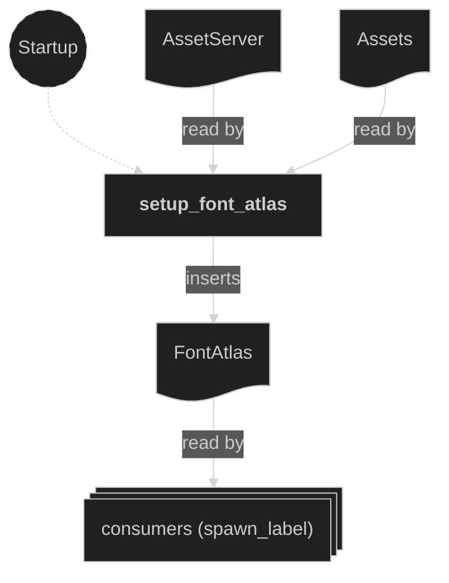

# Text Plugin

A small bitmap-font text-rendering service. It loads the shared font atlas (`assets/font.png`) into the `FontAtlas` resource at startup and exposes `spawn_label`, which composes a string into a horizontal row of per-glyph sprites. Any feature can render text with it without owning font loading itself — the round `intro` submodule's countdown and the `outcome` submodule's win banner both render through it.

It is not tied to any camera: the caller passes the `RenderLayers` the glyphs should render on, so the same helper serves the overlay layer, a HUD layer, or the world.

It is registered after the Camera plugin in `AppPlugin`. Registration order relative to consumers doesn't matter: a consumer only needs `FontAtlas` to exist, which it does from `Startup` (all `Startup` systems complete before any `Update` or state transition).

## Concepts

- `FontAtlas` (`src/plugins/text.rs`) — a **resource** holding the font's image handle and its `TextureAtlasLayout` handle. `assets/font.png` is a `FONT_COLS`×`FONT_ROWS` (16×3) grid of `FONT_CELL` (16×16) cells; the layout is built once with `TextureAtlasLayout::from_grid` at `Startup`.

- `glyph_index(char) -> Option<usize>` — maps a character to its atlas cell: `A`–`Z` → 0–25, `0`–`9` → 32–41, `! ? . :` → 42–45. Returns `None` for spaces and any unmapped character (including `¢`, absent from the current atlas), which advance the cursor but draw no sprite. Case-insensitive; the atlas is uppercase-only.

- `spawn_label(commands, &FontAtlas, text, transform, render_layers) -> Entity` — spawns a parent entity plus one child glyph `Sprite` (via `Sprite::from_atlas_image`) per mapped character, offset on x by `FONT_ADVANCE` and horizontally centred around the parent's transform. **Each glyph child carries the passed `render_layers` directly** — render layers do not propagate parent→child in this project without `Propagate`, so a layer set only on the parent would leave the glyphs on the default layer. Despawning the returned parent recursively removes its glyph children.

- `FONT_COLS` / `FONT_ROWS` / `FONT_CELL` / `FONT_ADVANCE` — atlas grid dimensions and the per-glyph horizontal advance. Change these (and the atlas art / `glyph_index`) together.

## Plugin workflow

- Startup phase
    - Setup Font Atlas:
        - Reads: `AssetServer` (loads `font.png`), `Assets<TextureAtlasLayout>`
        - Writes: inserts the `FontAtlas` resource

`spawn_label` and `glyph_index` are plain helper functions (not systems); callers invoke them from their own systems.

## Plugin Systems

### Setup Font Atlas

Runs once at `Startup`. Loads `assets/font.png`, builds the `TextureAtlasLayout` grid via `TextureAtlasLayout::from_grid(FONT_CELL, FONT_COLS, FONT_ROWS, …)`, and inserts the `FontAtlas` resource.

## Components, Resources and Messages CRUD

Definitions and where they are used:
- `FontAtlas` — `#[derive(Resource, Clone)]` (`src/plugins/text.rs`), inserted by `setup_font_atlas` (this plugin), read by consumers (e.g. the round `intro` submodule's countdown systems) as the argument to `spawn_label`.

