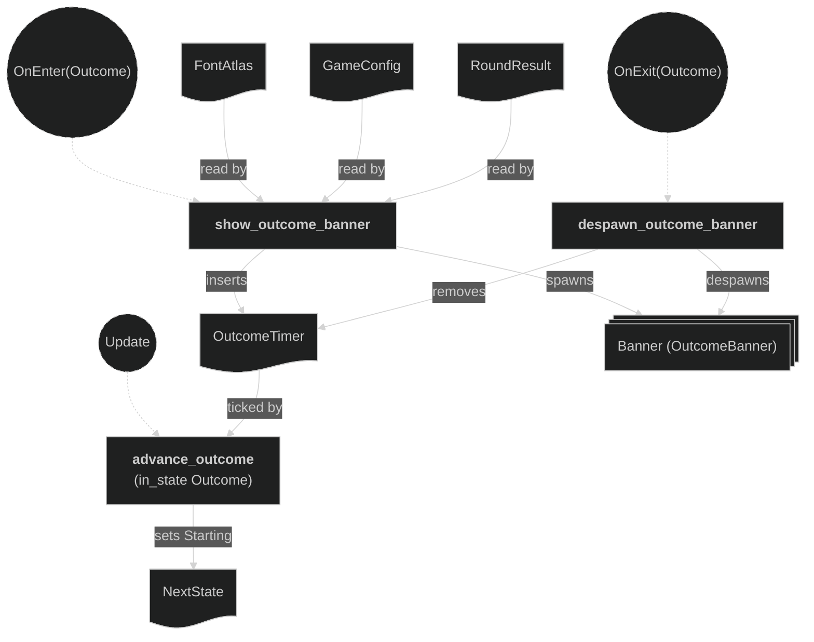

# Round Outcome

The `outcome` submodule of the `round` plugin (`src/plugins/round/outcome.rs`; the round feature is covered by the Round plugin doc). It renders the win banner shown while the round is in `RoundPhase::Outcome`, then loops the round back to `Starting`. It is the sibling of the `intro` submodule (see the Round intro doc) and reuses the same overlay + glyph machinery.

It owns only the banner **presentation**. Text is composed with `spawn_label` from the Text plugin, and the banner renders on the **overlay camera**, spawned by the Camera plugin — the same split the intro submodule uses. The round *resolution and reset* it reacts to live in the sibling `state` submodule: that submodule decides the winner (`resolve_kill` / `resolve_timeout`), records `RoundResult`, enters `Outcome`, and runs `reset_round` on the way out. This submodule only reads `RoundResult` to label the banner and, after a short linger, drives the transition back to `Starting`. Its systems are wired into the app by `round/mod.rs`.

## Concepts

- **Overlay camera** — spawned and owned by the Camera plugin, not here. The banner spawned here passes `RenderLayers::layer(OVERLAY_RENDER_LAYER)` to `spawn_label` (via the round's shared `spawn_round_label` helper) so this camera sees it, exactly as the intro banner does.

- **Text rendering** — `FontAtlas` (resource) and `spawn_label` come from the Text plugin; this submodule is a consumer. `spawn_round_label` (in `round/mod.rs`) wraps `spawn_label` with the fixed choices for round banners (centred at the origin, on `OVERLAY_RENDER_LAYER`).

- `OutcomeBanner` — a marker **component** on the win-banner label. It is spawned on entering `Outcome` and despawned when the round loops out of it.

- `OutcomeTimer` — a **resource** wrapping a one-shot `Timer` (`config.round.outcome_linger_secs`, default 2.5s) that counts down how long the banner stays on screen. The linger is long enough for the loser's death bounce (owned by the Effects plugin) to finish before the board resets. Inserted on entering `Outcome`, removed on leaving it.

- `RoundResult` — a **resource** owned by the `state` submodule (see the Round plugin doc). Read here to pick the banner text: `"P1 WINS"`, `"P2 WINS"`, or `"DRAW"` for `winner` `Some(0)` / `Some(_)` / `None`.

## Plugin workflow

- `OnEnter(RoundPhase::Outcome)`
    - Show Outcome Banner:
        - Reads: `FontAtlas` (from the Text plugin), `RoundResult` (the winner), `GameConfig`
        - Writes: spawns the win-banner label (marked `OutcomeBanner`); inserts the `OutcomeTimer` resource
- Update phase
    - Advance Outcome (runs only `in_state(Outcome)`):
        - Reads: `Time`, `OutcomeTimer`
        - Writes: ticks the timer and, once it elapses, sets `NextState<RoundPhase>` to `Starting`
- `OnExit(RoundPhase::Outcome)`
    - Despawn Outcome Banner:
        - Reads: entities `With<OutcomeBanner>`
        - Writes: despawns the banner (and its glyph children); removes the `OutcomeTimer` resource

## Plugin Systems

### Show Outcome Banner

Runs on `OnEnter(RoundPhase::Outcome)`. Reads `RoundResult::winner` to choose the banner text (`"P1 WINS"` / `"P2 WINS"` / `"DRAW"`), spawns it at the origin via `spawn_round_label` (the round's shared wrapper around the Text plugin's `spawn_label`), tags it `OutcomeBanner`, and inserts a fresh one-shot `OutcomeTimer` (`config.round.outcome_linger_secs`, default 2.5s) for the on-screen linger.

### Advance Outcome

Runs every frame **only `in_state(RoundPhase::Outcome)`**. Ticks the `OutcomeTimer`; once it finishes, sets `NextState<RoundPhase>` to `Starting`, looping the match into the next round. Leaving `Outcome` triggers the `state` submodule's `reset_round` (the full board/charge/position wipe) before `Starting` re-runs the intro countdown, so the next round always begins on a clean board.

### Despawn Outcome Banner

Runs on `OnExit(RoundPhase::Outcome)`. Despawns every `OutcomeBanner` entity (recursively removing its glyph children) and removes the `OutcomeTimer` resource, so no banner or timer leaks into the next round. Pairing the cleanup with `OnExit` means it runs exactly once per round, whichever way the state leaves `Outcome`.

## Components and Resources CRUD

Definitions and where they are used:
- `FontAtlas` — owned by the Text plugin; read here by `show_outcome_banner` via `spawn_round_label`.
- `GameConfig` — owned elsewhere; read here by `show_outcome_banner` for `outcome_linger_secs`.
- `RoundResult` — owned by the `state` submodule (see the Round plugin doc); read here by `show_outcome_banner` to label the banner.
- `OutcomeBanner` — marker `#[derive(Component)]` (this submodule), attached in `show_outcome_banner`, queried/despawned by `despawn_outcome_banner`.
- `OutcomeTimer` — `#[derive(Resource)]` (this submodule), inserted by `show_outcome_banner`, ticked by `advance_outcome`, removed by `despawn_outcome_banner`.

