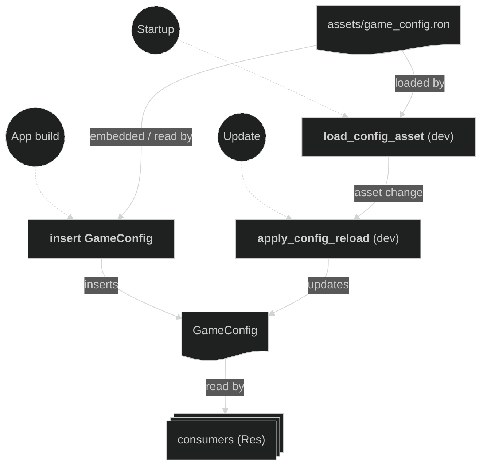

# Config Plugin

The game's single tuning surface. It loads every gameplay/timing/visual knob from `assets/game_config.ron` into the `GameConfig` resource, which the rest of the game reads through `Res<GameConfig>`. Editing the `.ron` file is how the game is rebalanced — no code changes needed to retune damage, tick rates, round length, camera feel, tween/animation timings, or the background colour.

It is registered **first** in `AppPlugin` (right after `defaults`) and inserts `GameConfig` at plugin-build time, so the resource exists before any `Startup` system runs and every consumer can rely on it.

Only gameplay/timing/visual values live here. Structural invariants stay in their own modules: render-layer/order allocations (`camera.rs`), z-indices, font-atlas and spritesheet grid layouts, and the player sprite scale (`PLAYER_SPRITE_SCALE` in `maps.rs`) are plain consts, not config fields.

## Build split (dev vs release)

`assets/game_config.ron` is the single source of truth for both builds.

- **Release** (`not(feature = "dev")`): the file is embedded at compile time with `include_str!` and parsed once at startup (`GameConfig::embedded`). Values are fixed and there is no file IO.
- **Dev** (`feature = "dev"`): the file is read from disk at runtime (falling back to the embedded copy if missing/malformed), then registered as a hot-reloadable asset. Saving the file re-applies its values live via the asset watcher.

## Concepts

- `GameConfig` (`src/plugins/config.rs`) — a `#[derive(Resource, Asset, Reflect, Clone, Deserialize)]` struct grouping the knobs by domain: `timing`, `damage`, `round`, `camera`, `player`, `animation`, `effects`. Each field carries a one-line doc; the `.ron` mirrors them and tags each with when an edit takes effect (`[live]`, `[next-round]`, `[restart]`). Deriving `Reflect` also surfaces it in the dev inspector.

- `assets/game_config.ron` — the authoritative, commented tuning file. A `#[test]` (`embedded_config_parses`) asserts it deserializes into `GameConfig`, so a malformed edit fails the build rather than the player. The test asserts no specific values, so retuning never breaks it.

- **Hot-reload (dev only)** — a small custom `AssetLoader` (`GameConfigLoader`) deserializes the `.ron` into a `GameConfig` asset. `load_config_asset` loads the handle at `Startup`; `apply_config_reload` mirrors each `AssetEvent::Modified`/`LoadedWithDependencies` back into the `GameConfig` resource. `Res<GameConfig>` change-detection then propagates the new values.

- **When edits take effect** — values read every frame in `Update` update instantly (camera rates, damage amounts, tween/flash durations). The three tick timers (`InputTimer`, `DamageTimer`, `BeamStepTimer`) are re-synced on config change by dev-only systems that call `Timer::set_duration`, so tick edits also apply live. Values consumed once at spawn/setup (player HP and charges, countdown length, animation frame timings) apply on the next round or next spawn.

## Plugin workflow

- Build phase (all builds)
    - Insert `GameConfig`: parses the embedded (release) or on-disk (dev) `.ron` and inserts the `GameConfig` resource before any `Startup` system runs.
- Startup phase (dev only)
    - Load Config Asset: loads `game_config.ron` through the asset server and stores its handle.
- Update phase (dev only)
    - Apply Config Reload: on an asset change, copies the reloaded asset into the `GameConfig` resource.

## Plugin Systems

### Load Config Asset (dev)

Runs once at `Startup`. Loads `game_config.ron` via the `AssetServer` and keeps the handle so the file watcher tracks it.

### Apply Config Reload (dev)

Runs every `Update`. Reads `AssetEvent<GameConfig>` messages and, on a modification, overwrites the `GameConfig` resource with the reloaded asset — the live-tuning entry point.

## Components, Resources and Messages CRUD

Definitions and where they are used:
- `GameConfig` — `#[derive(Resource, Asset, Reflect, Clone, Deserialize)]` (`src/plugins/config.rs`), inserted at plugin build and (in dev) refreshed by `apply_config_reload`. Read as `Res<GameConfig>` by consumers across the input, beam, damage, camera, maps, animations, hud, and round plugins.

