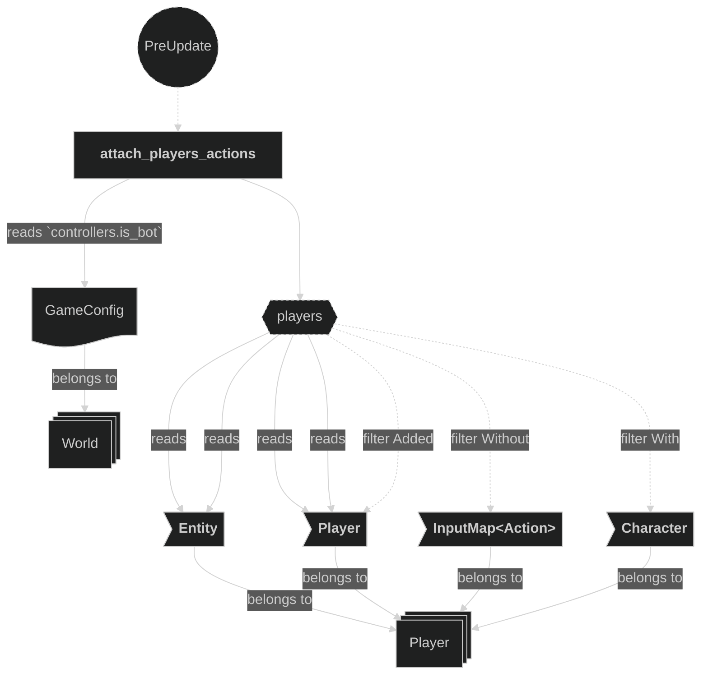
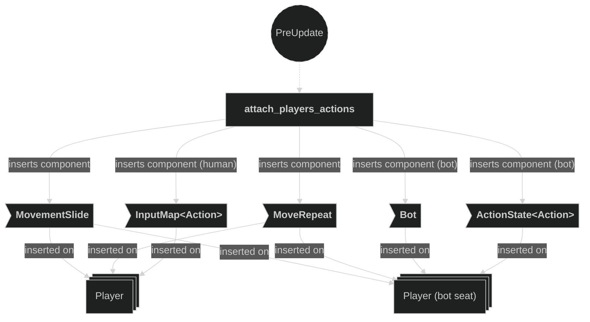
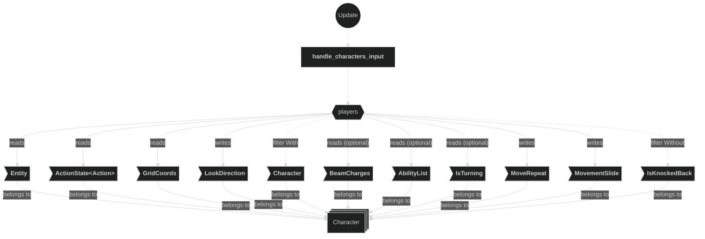
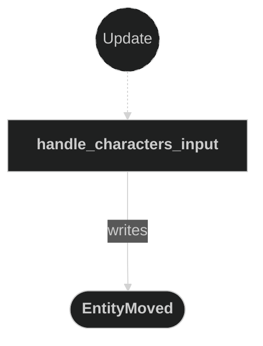
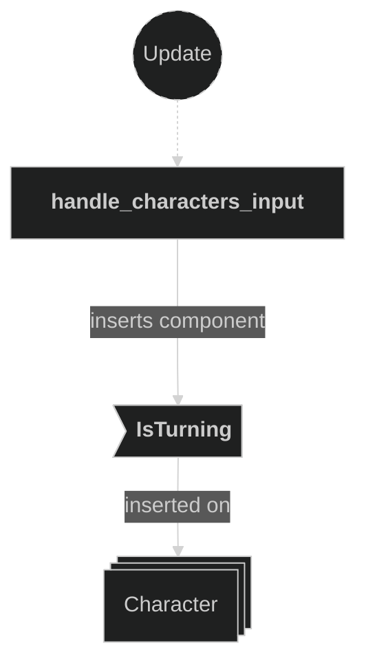
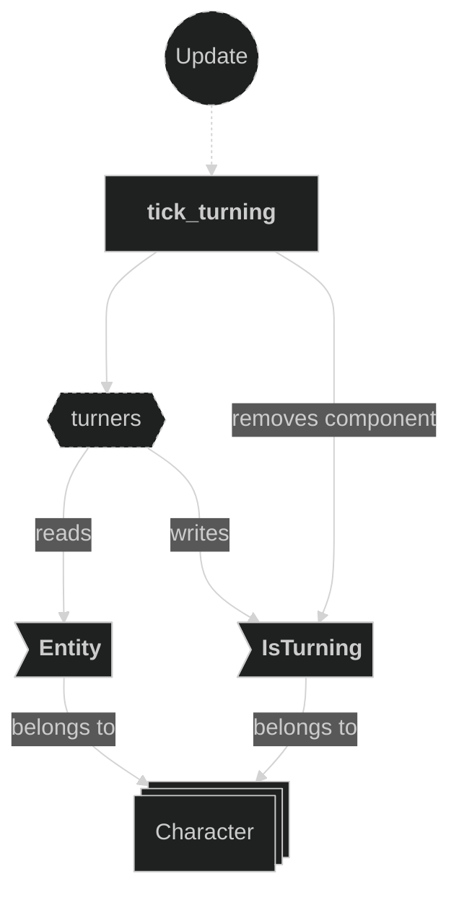

# Input Plugin

Contains systems related to player input handling. This plugin registers the `InputManagerPlugin` and the `TweeningPlugin`, attaches input maps and a per-character `MoveRepeat` auto-repeat state to player entities, and dispatches `EntityMoved` and `BeamFired` messages in reaction to player actions. A facing change while the direction is unlocked commits the new `LookDirection` immediately and starts a transient `IsTurning` state that rotates the character in place through an intermediate 3/4 pose alongside movement in the new direction. `handle_characters_input` is `pub(crate)`: a bot-controlled player carries no `InputMap`, so instead of a human's key presses it is the Bot plugin's `bot_think` that synthesizes the `ActionState<Action>` this system reads, ordered `.before` it so the synthesized state is in place the same frame (see the Bot plugin doc).

## Plugin workflow

- PreUpdate phase
    - Attach Players Actions reacts to newly added `Player` + `Character` entities (without `InputMap`) and branches on `config.controllers.is_bot(player.player_id)`: a bot seat gets a bare `ActionState<Action>` plus the `Bot` marker and **no** `InputMap`; a human seat gets the appropriate `InputMap<Action>` as before. Both branches also get `MoveRepeat` and `MovementSlide`.
- Update phase (gated on `RoundPhase::Playing`)
    - Handle Characters Input, for each character:
        - Handles `Action::Lock` (toggles look-direction lock)
        - Handles `Action::Shoot` (writes a `BeamFired` message only if the player has a charge **and** the shot is not blocked — firing from an already-claimed tile is refused unless the player has the `Backfill` ability, in which case no message is written, so no beam spawns and no charge is spent) — allowed even mid-turn
        - On release (`Action::Move` axis zero), eases a moving character to rest via `MovementSettle` and clears `MoveRepeat`'s held axis, so the next press steps immediately
        - On a `Action::Move` axis that implies a new facing (while unlocked), commits the new `LookDirection` immediately and inserts an `IsTurning` state; turning out of rest holds the step back (a quick tap just turns in place, holding continues into movement after the repeat delay), while a mid-run turn falls through to keep stepping the same frame
        - Otherwise, steps immediately if the character was at rest; while already moving, steps once `MoveRepeat`'s timer finishes — the first repeat spans `move_repeat_delay_ms`, later ones `move_repeat_rate_ms`, shortened by `1/√2` for a cardinal (non-diagonal) step to match the diagonal's apparent speed — writing an `EntityMoved` message and re-sizing `MovementSlide` to that interval
    - Tick Turning advances each `IsTurning` timer through its segments, updating `IsTurning.from` as each segment elapses, and removes `IsTurning` once the segment queue is empty; it never touches `LookDirection`, which was already committed to the new facing the instant the turn began

## Plugin Systems

### Attach Players Actions

Runs in `PreUpdate`. Detects newly spawned `Player` + `Character` entities that do not yet have an `InputMap<Action>`. For each, checks `config.controllers.is_bot(player.player_id)`: if the seat is bot-driven, inserts a bare `ActionState::<Action>::default()` plus the `Bot` marker — deliberately **no** `InputMap`, since the Bot plugin's `bot_think` drives the `ActionState` directly instead of translating device input into one; otherwise inserts the human `InputMap<Action>` derived from the player's data as before. Both branches also insert `MoveRepeat::default()` and a `MovementSlide` sized from `config.timing.move_repeat_rate_ms`.

### Handle Characters Input

Runs in `Update`, gated on `RoundPhase::Playing`, and iterates over all `Character` entities (excluding those with `IsKnockedBack`). Immediately handles `Action::Lock` (toggles direction lock) and `Action::Shoot` — emits a `BeamFired` message only when the character has a charge (`BeamCharges::current > 0`) **and** `resolve_fire` (Beam plugin) permits the shot: firing from an already-claimed tile is refused unless the player's `AbilityList` contains `Backfill`, and a refused shot writes no message (no beam, no charge). Both stay active during a turn. Reads the `Action::Move` axis: on release (axis zero), eases a moving character to rest via `MovementSettle` and resets the per-character `MoveRepeat` state, so the next press steps immediately. Otherwise it uses `LookDirection::would_look_at` to detect whether the pressed axis implies a new facing: while unlocked, a change from the current heading (or the active turn's target) commits the new `LookDirection` immediately and inserts an `IsTurning` state — turning out of rest holds the step back (a quick tap just turns in place, holding continues into movement after the repeat delay), while a mid-run turn falls through to keep stepping the same frame. Stepping is governed by `MoveRepeat`: the first step out of rest is immediate; every later step waits for `MoveRepeat`'s timer, spanning `config.timing.move_repeat_delay_ms` for the first repeat and `config.timing.move_repeat_rate_ms` after, shortened by `1/√2` for a cardinal (non-diagonal) step to match the diagonal's apparent speed. Each step emits an `EntityMoved` message with the new target `GridCoords` and re-sizes `MovementSlide` to that interval. Locked characters never turn (direction is frozen) and keep stepping along the pressed axis.

### Tick Turning

Runs in `Update` (gated on `RoundPhase::Playing`). Ticks each character's `IsTurning` timer; when a segment elapses it pops the next cardinal waypoint off `remaining` and advances `IsTurning.from` (which the 3/4 pose depends on) to that waypoint, then either resets the timer for the next segment or, once `remaining` is empty, removes `IsTurning`. It never writes `LookDirection`: `handle_characters_input` already commits `LookDirection.direction` to the new facing the instant the turn starts, so a shot fired mid-turn fires along the already-committed new facing, not the pre-turn heading. A 90° turn is one segment; a 180° turn is two, routed through a fixed middle cardinal.

## Components, Resources and Messages CRUD

### Query Player entities for action attachment

Used in the following systems:
- **attach_players_actions**: detects `Player` + `Character` entities that were just added and do not yet carry an `InputMap<Action>` (this holds for a bot seat too — it never gains one), then reads `config.controllers.is_bot(player.player_id)` to decide which branch (bot or human) attaches below

### Write commands — attach InputMap or bot ActionState

Used in the following systems:
- **attach_players_actions**: for each newly added `Player`, branches on `config.controllers.is_bot(player.player_id)` — a bot seat gets a bare `ActionState<Action>` plus the `Bot` marker and **no** `InputMap`; a human seat gets `InputMap<Action>` as before. Both branches also get `MoveRepeat` and `MovementSlide`.

### Query Character entities for input handling

Used in the following systems:
- **handle_characters_input**: reads action state, grid coords, and the optional `AbilityList` and `IsTurning` state; mutably updates look direction, `MoveRepeat`, and `MovementSlide`, for all `Character` entities (excluding those with `IsKnockedBack`); it also reads `MapInfo` + `ClaimedTile` to gate firing (see the separate section below)

### Read fire-gate inputs (MapInfo + ClaimedTile)

Used in the following systems:
- **handle_characters_input**: to decide whether a Shoot press may fire, reads `MapInfo.claimed_entities` + the `ClaimedTile.owner` at the character's origin (via `resolve_fire`, Beam plugin) — a shot from an already-claimed tile is refused unless the player has `Backfill`

### Write EntityMoved messages

Used in the following systems:
- **handle_characters_input**: emits an `EntityMoved` message whenever a step is due for the pressed `Action::Move` axis — immediately when stepping out of rest, otherwise once `MoveRepeat`'s timer finishes; a mid-run turn does not suppress this, so a turn can start and a step can fire the same frame

### Write BeamFired messages

Used in the following systems:
- **handle_characters_input**: emits a `BeamFired` message when `Action::Shoot` is just pressed, the player has a charge, and the shot is not blocked (see the fire-gate reads above)

### Write commands — insert IsTurning

Used in the following systems:
- **handle_characters_input**: inserts (or replaces) an `IsTurning` state on a character when an unlocked facing change is detected, starting or restarting the turn

### Query turning characters

Used in the following systems:
- **tick_turning**: advances each `IsTurning` timer, writes `IsTurning.from` as each segment elapses, and removes `IsTurning` once the segment queue is empty; it never touches `LookDirection`, which `handle_characters_input` already committed to the new facing when the turn began

