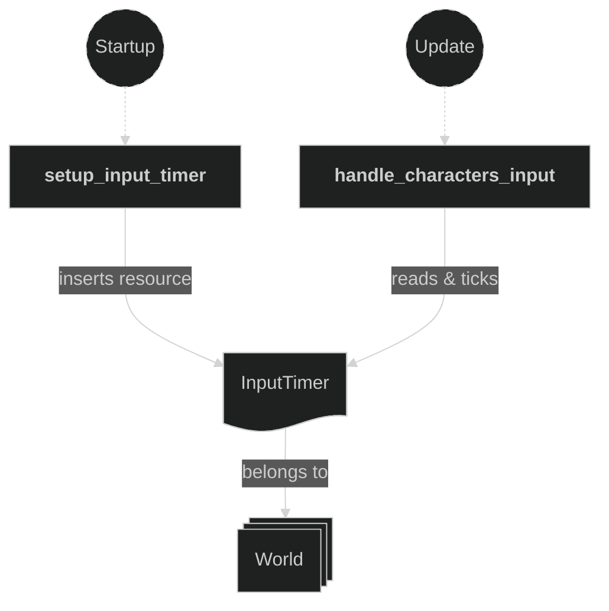
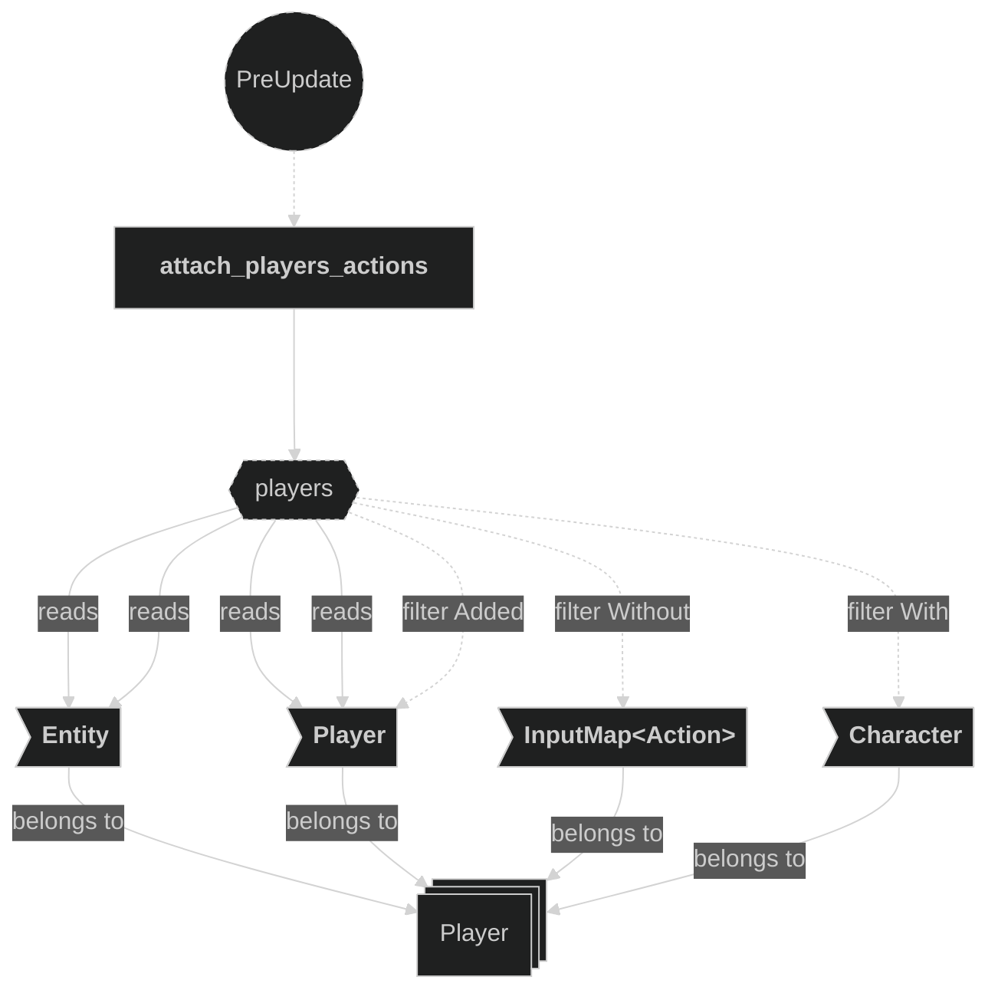
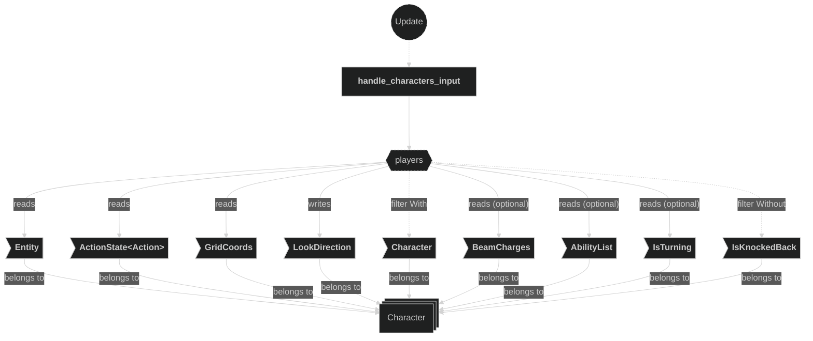
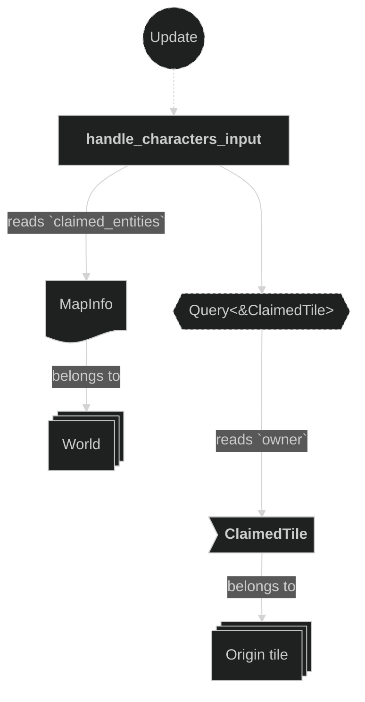
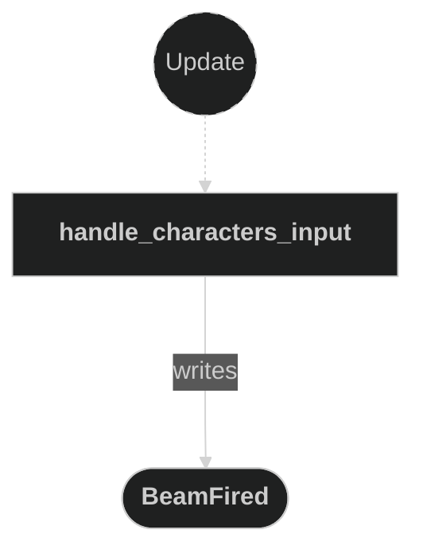
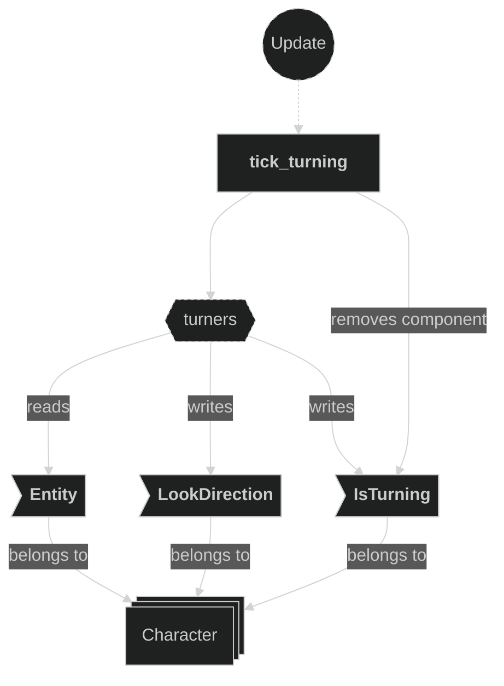

# Input Plugin

Contains systems related to player input handling. This plugin registers the `InputManagerPlugin` and the `TweeningPlugin`, sets up an input throttle timer resource, attaches input maps to player entities, and dispatches `EntityMoved` and `BeamFired` messages in reaction to player actions. A facing change while the direction is unlocked starts a transient `IsTurning` state that rotates the character in place through an intermediate 3/4 pose before movement in the new direction resumes.

## Plugin workflow

- Startup phase
    - Setup Input Timer creates the `InputTimer` repeating resource (throttle period `config.timing.input_tick_secs`, default 0.075 s).
- PreUpdate phase
    - Attach Players Actions reacts to newly added `Player` + `Character` entities (without `InputMap`) and inserts the appropriate `InputMap<Action>`.
- Update phase
    - Handle Characters Input ticks the timer and, for each character:
        - Handles `Action::Lock` (toggles look-direction lock)
        - Handles `Action::Shoot` (writes a `BeamFired` message only if the player has a charge **and** the shot is not blocked — firing from an already-claimed tile is refused unless the player has the `Backfill` ability, in which case no message is written, so no beam spawns and no charge is spent) — allowed even mid-turn
        - On a `Action::Move` axis that implies a new facing (while unlocked), inserts an `IsTurning` state and skips movement this frame; a fresh facing change mid-turn restarts the turn toward the new target
        - While an `IsTurning` state is present but the facing has not changed, movement stays suppressed
        - When no turn is active and the timer finishes, reads `Action::Move` axis and writes an `EntityMoved` message
    - Tick Turning advances each `IsTurning` timer through its segments and, only once the target facing is reached, commits `LookDirection` to the target and removes `IsTurning`; `LookDirection` is left untouched mid-turn so it keeps the original heading

## Plugin Systems

### Setup Input Timer

Inserts the `InputTimer` resource, a repeating `Timer` whose period is `config.timing.input_tick_secs` (default 0.075 s) that acts as a throttle on movement inputs.

### Attach Players Actions

Runs in `PreUpdate`. Detects newly spawned `Player` + `Character` entities that do not yet have an `InputMap<Action>` and inserts the appropriate `InputMap<Action>` derived from the player's data.

### Handle Characters Input

Runs in `Update`. Ticks the `InputTimer` and iterates over all `Character` entities (excluding those with `IsKnockedBack`). Immediately handles `Action::Lock` (toggles direction lock) and `Action::Shoot` — emits a `BeamFired` message only when the character has a charge (`BeamCharges::current > 0`) **and** `resolve_fire` (Beam plugin) permits the shot: firing from an already-claimed tile is refused unless the player's `AbilityList` contains `Backfill`, and a refused shot writes no message (no beam, no charge). Both stay active during a turn. For movement it uses `LookDirection::would_look_at` to detect whether the pressed axis implies a new facing: while unlocked, a change from the current heading (or the active turn's target) inserts an `IsTurning` state — starting or restarting the turn immediately, bypassing the throttle — and skips movement that frame. If a turn is already in progress toward the same target, movement stays suppressed. Otherwise, when the timer is finished, it updates `LookDirection` and emits an `EntityMoved` message with the new target `GridCoords`. Locked characters never turn (direction is frozen) and keep strafing along the pressed axis.

### Tick Turning

Runs in `Update` (gated on `RoundPhase::Playing`). Ticks each character's `IsTurning` timer; when a segment elapses it pops the next cardinal waypoint and advances the turn's internal `from` (which the 3/4 pose depends on), then either resets the timer for the next quarter or, once the final target is reached, commits `LookDirection` to the target and removes `IsTurning`. `LookDirection` is deliberately **not** changed mid-turn: it holds the character's original heading for the whole turn, so a shot fired mid-turn fires along the direction the player was facing before the turn began. A 90° turn is one segment; a 180° turn is two, routed through a fixed middle cardinal.

## Components, Resources and Messages CRUD

### Read InputTimer resource

Used in the following systems:
- **handle_characters_input**: ticks and checks the throttle timer each frame

### Query Player entities for action attachment

Used in the following systems:
- **attach_players_actions**: detects `Player` + `Character` entities that were just added and do not yet carry an `InputMap<Action>`

### Write commands — attach InputMap

Used in the following systems:
- **attach_players_actions**: inserts `InputMap<Action>` on each newly added `Player` entity

### Query Character entities for input handling

Used in the following systems:
- **handle_characters_input**: reads action state, grid coords, and the optional `AbilityList` and `IsTurning` state, mutably updates look direction, for all `Character` entities (excluding those with `IsKnockedBack`); it also reads `MapInfo` + `ClaimedTile` to gate firing (see the separate section below)

### Read fire-gate inputs (MapInfo + ClaimedTile)

Used in the following systems:
- **handle_characters_input**: to decide whether a Shoot press may fire, reads `MapInfo.claimed_entities` + the `ClaimedTile.owner` at the character's origin (via `resolve_fire`, Beam plugin) — a shot from an already-claimed tile is refused unless the player has `Backfill`

### Write EntityMoved messages

Used in the following systems:
- **handle_characters_input**: emits an `EntityMoved` message when the movement axis is non-zero, no turn is in progress, and the input timer has finished

### Write BeamFired messages

Used in the following systems:
- **handle_characters_input**: emits a `BeamFired` message when `Action::Shoot` is just pressed, the player has a charge, and the shot is not blocked (see the fire-gate reads above)

### Write commands — insert IsTurning

Used in the following systems:
- **handle_characters_input**: inserts (or replaces) an `IsTurning` state on a character when an unlocked facing change is detected, starting or restarting the turn

### Query turning characters

Used in the following systems:
- **tick_turning**: advances each `IsTurning` timer and, when the turn completes, commits `LookDirection` to the target facing and removes `IsTurning` (`LookDirection` is left unchanged mid-turn)

