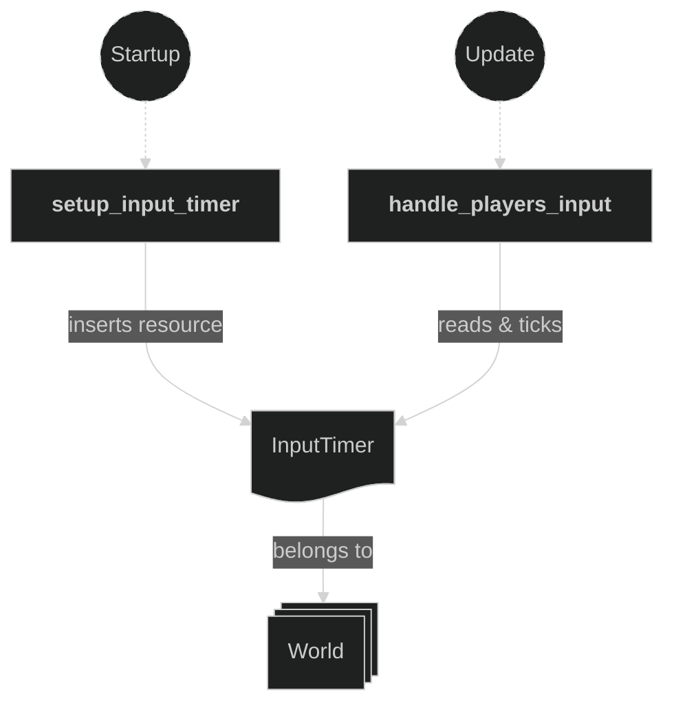
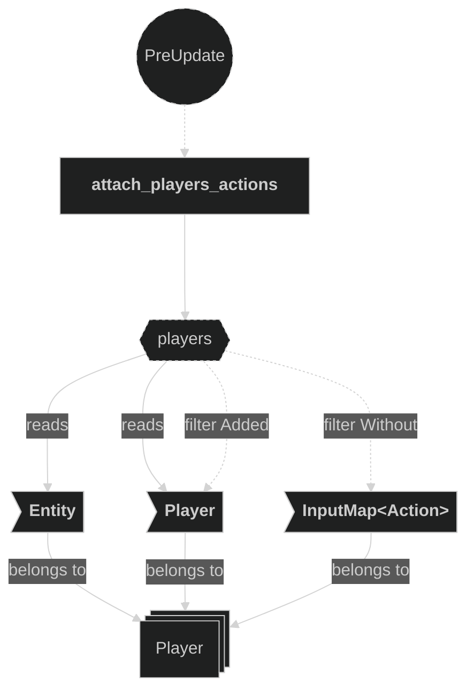
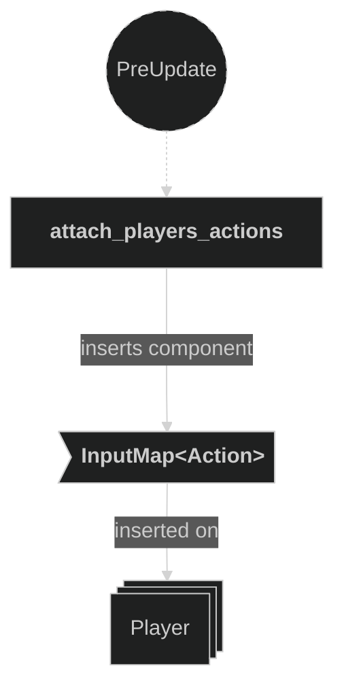
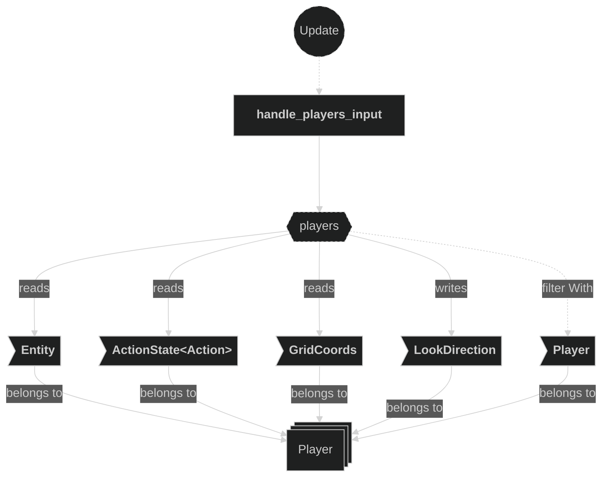
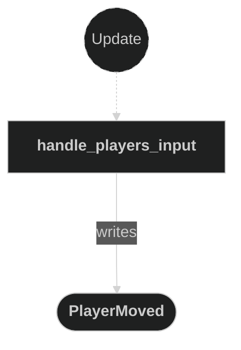
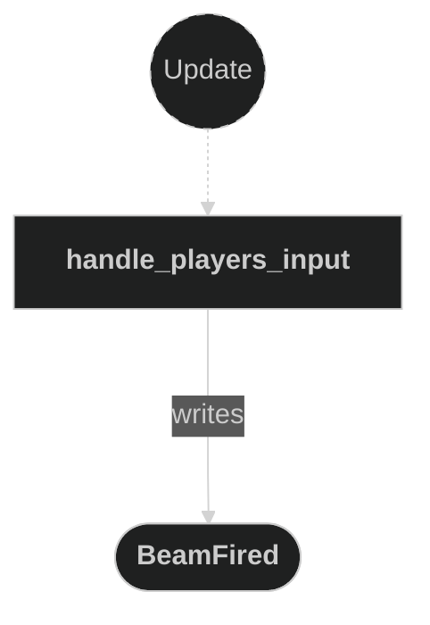

# Input Plugin

Contains systems related to player input handling. This plugin registers the `InputManagerPlugin` and the `TweeningPlugin`, sets up an input throttle timer resource, attaches input maps to player entities, and dispatches `PlayerMoved` and `BeamFired` messages in reaction to player actions.

## Plugin workflow

- Startup phase
    - Setup Input Timer creates the `InputTimer` repeating resource (16ms throttle).
- PreUpdate phase
    - Attach Players Actions reacts to newly added `Player` entities (without `InputMap`) and inserts the appropriate `InputMap<Action>`.
- Update phase
    - Handle Players Input ticks the timer and, for each player:
        - Handles `Action::Lock` (toggles look-direction lock)
        - Handles `Action::Shoot` (writes a `BeamFired` message)
        - When the timer finishes, reads `Action::Move` axis and writes a `PlayerMoved` message

## Plugin Systems

### Setup Input Timer

Inserts the `InputTimer` resource, a repeating `Timer` with a 62.5ms period that acts as a throttle on movement inputs.

### Attach Players Actions

Runs in `PreUpdate`. Detects newly spawned `Player` entities that do not yet have an `InputMap<Action>` and inserts the appropriate `InputMap<Action>` derived from the player's data.

### Handle Players Input

Runs in `Update`. Ticks the `InputTimer` and iterates over all players. Immediately handles `Action::Lock` (toggles direction lock) and `Action::Shoot` (emits a `BeamFired` message). When the timer is finished, reads the movement axis from `Action::Move`, updates `LookDirection`, and emits a `PlayerMoved` message with the new target `GridCoords`.

## Components, Resources and Messages CRUD

### Read InputTimer resource

Used in the following systems:
- **handle_players_input**: ticks and checks the throttle timer each frame

### Query Player entities for action attachment

Used in the following systems:
- **attach_players_actions**: detects `Player` entities that were just added and do not yet carry an `InputMap<Action>`

### Write commands — attach InputMap

Used in the following systems:
- **attach_players_actions**: inserts `InputMap<Action>` on each newly added `Player` entity

### Query Player entities for input handling

Used in the following systems:
- **handle_players_input**: reads action state and grid coords, mutably updates look direction for all `Player` entities

### Write PlayerMoved messages

Used in the following systems:
- **handle_players_input**: emits a `PlayerMoved` message when the movement axis is non-zero and the input timer has finished

### Write BeamFired messages

Used in the following systems:
- **handle_players_input**: emits a `BeamFired` message when `Action::Shoot` is just pressed

