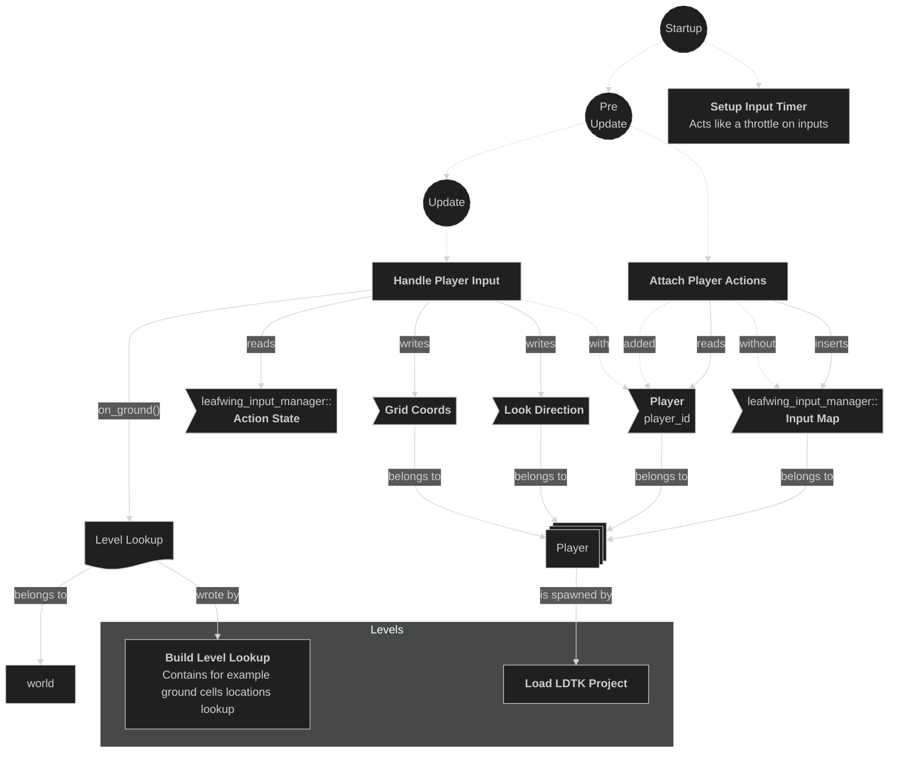

```mermaid
---
config:
  theme: dark
---

flowchart TD

%% dash for system groups
classDef system-group stroke-dasharray: 5 5

%%%%%%%%%%%%%%%%%%%%%%%
%%     Resources     %%
%%%%%%%%%%%%%%%%%%%%%%%

level_lookup_res@{ shape: doc, label: "Level Lookup" } --> |belongs to| world


%%%%%%%%%%%%%%%%%%%%%%%%%%%%
%%  Entities & Components %%
%%%%%%%%%%%%%%%%%%%%%%%%%%%%

action_state_component>"`leafwing_input_manager::<br>**Action State**`"]

player_entity@{ shape: st-rect, label: "Player" } 
pe_player_component>"`**Player**<br>player_id`"] ---> |belongs to| player_entity
pe_input_map_component>"`leafwing_input_manager::<br>**Input Map**`"] ---> |belongs to| player_entity
pe_grid_coords_component>"`**Grid Coords**`"] ---> |belongs to| player_entity
pe_look_direction_component>"`**Look Direction**`"] ---> |belongs to| player_entity
player_entity --> |is spawned by| load_ldtk_project


%%%%%%%%%%%%%%%%%%%%%%%
%%      Systems      %%
%%%%%%%%%%%%%%%%%%%%%%%

startup((Startup)):::system-group -.-> preupdate(("`Pre<br>Update`")):::system-group -.-> update(("`Update`")):::system-group

subgraph Levels
    load_ldtk_project["`**Load LDTK Project**`"]
    build_level_lookup["`**Build Level Lookup**<br>Contains for example ground cells locations lookup`"]
end

level_lookup_res --> |wrote by| build_level_lookup  

setup_input_timer["`**Setup Input Timer**<br>Acts like a throttle on inputs`"]
attach_players_actions["`**Attach Player Actions**`"]
handle_player_input["`**Handle Player Input**`"]

startup -.-> setup_input_timer
preupdate -.-> attach_players_actions
update -.-> handle_player_input

attach_players_actions -..-> |added| pe_player_component
attach_players_actions ---> |reads| pe_player_component
attach_players_actions -..-> |without| pe_input_map_component
attach_players_actions ---> |inserts| pe_input_map_component

handle_player_input --> |"`on_ground()`"| level_lookup_res
handle_player_input ---> |reads| action_state_component
handle_player_input ---> |writes| pe_grid_coords_component
handle_player_input ---> |writes| pe_look_direction_component
handle_player_input -..-> |with| pe_player_component


```
