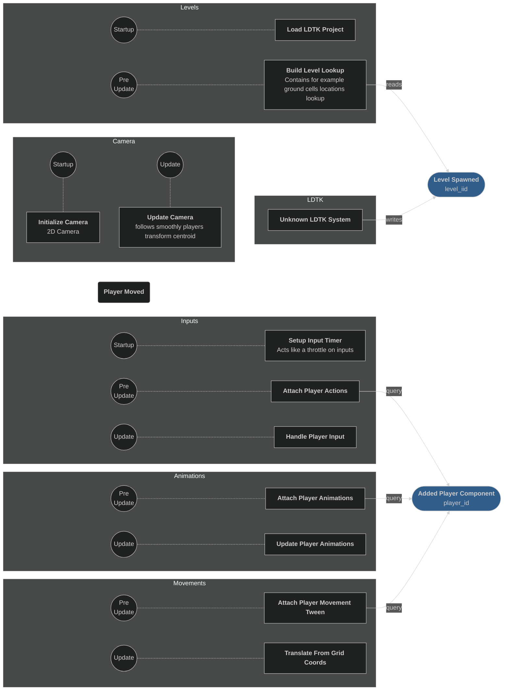

```mermaid
---
config:
  theme: dark
---

flowchart LR

classDef message fill:#305d8a


subgraph Levels
    startup_lvl((Startup)) -.- load_ldtk_project["`**Load LDTK Project**`"]
    preupdate_lvl(("`Pre<br>Update`")) -.- build_level_lookup["`**Build Level Lookup**<br>Contains for example ground cells locations lookup`"]
end

subgraph LDTK
    ldtk_unknown["`**Unknown LDTK System**`"]
end

subgraph Camera
    startup_cam((Startup)) -.- initialize_camera["`**Initialize Camera**<br>2D Camera`"]
    update_cam((Update)) -.- update_camera["`**Update Camera**<br>follows smoothly players transform centroid`"]
end

subgraph Animations
    preupdate_anim(("`Pre<br>Update`")) -.- attach_player_animations["`**Attach Player Animations**`"]
    update_anim((Update)) -.- update_player_animation["`**Update Player Animations**`"]
end

subgraph Inputs
    startup_input((Startup)) -.- setup_input_timer["`**Setup Input Timer**<br>Acts like a throttle on inputs`"]
    preupdate_input(("`Pre<br>Update`")) -.- attach_players_actions["`**Attach Player Actions**`"]
    update_input((Update)) -.- handle_player_input["`**Handle Player Input**`"]
end

subgraph Movements
    preupdate_mvmt(("`Pre<br>Update`")) -.- attach_player_movement_tween["`**Attach Player Movement Tween**`"]
    update_mvmt((Update)) -.- translate_from_grid_coordst["`**Translate From Grid Coords**`"]
end

%%%%%%%%%%%%%%%%%%%%%
%%      Events     %%
%%%%%%%%%%%%%%%%%%%%%

level_spawned(["`**Level Spawned**<br>level_iid`"]):::message
added_player(["`**Added Player Component**<br>player_id`"]):::message

build_level_lookup --> |reads| level_spawned 
ldtk_unknown  --> |writes| level_spawned   

attach_players_actions --> |query| added_player
attach_player_animations --> |query| added_player
attach_player_movement_tween --> |query| added_player


player_moved("`**Player Moved**`")

```
