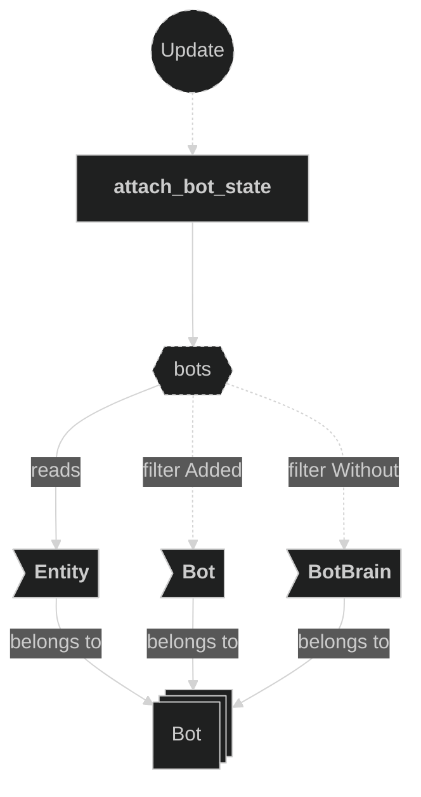
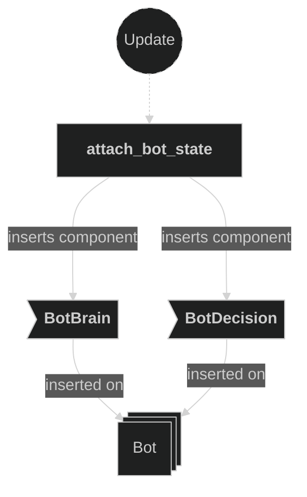
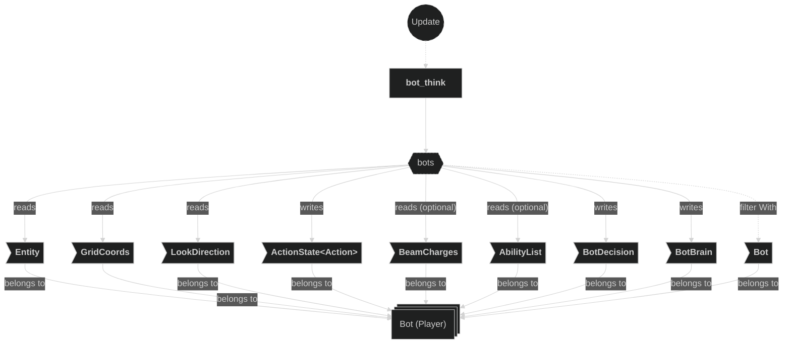
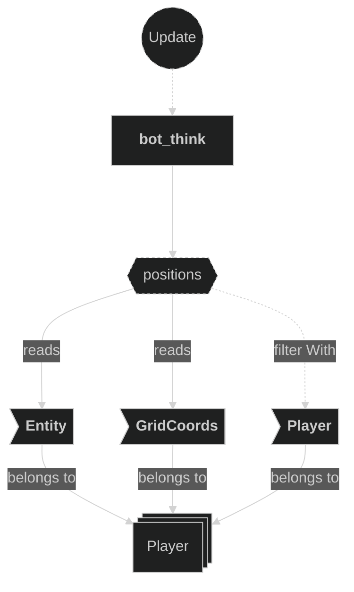
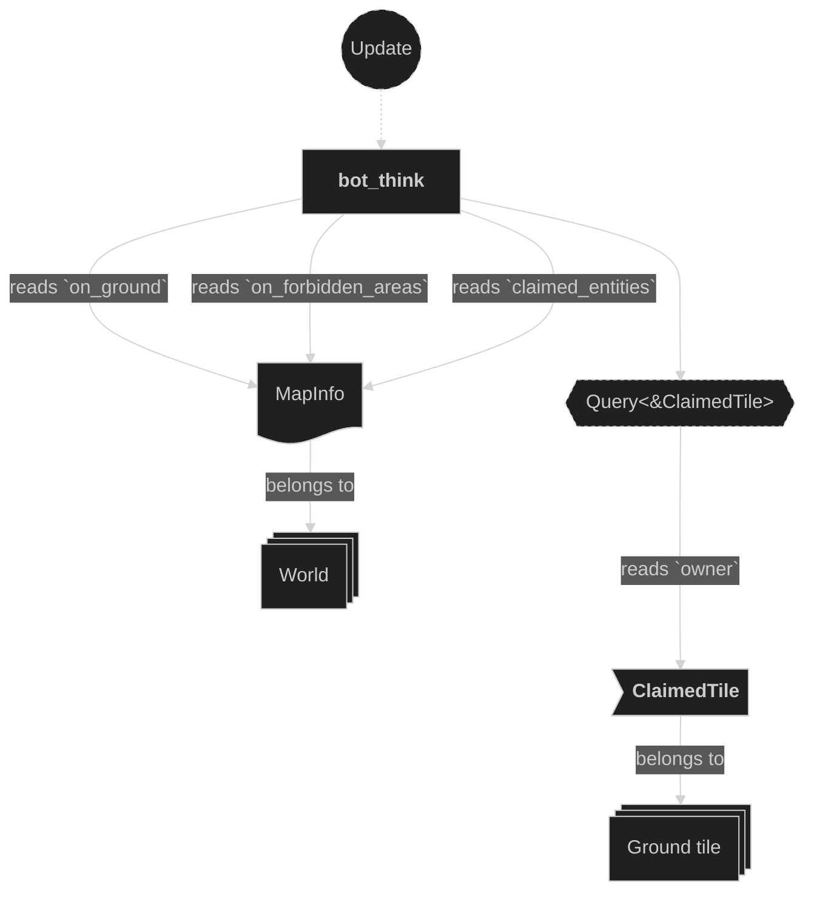
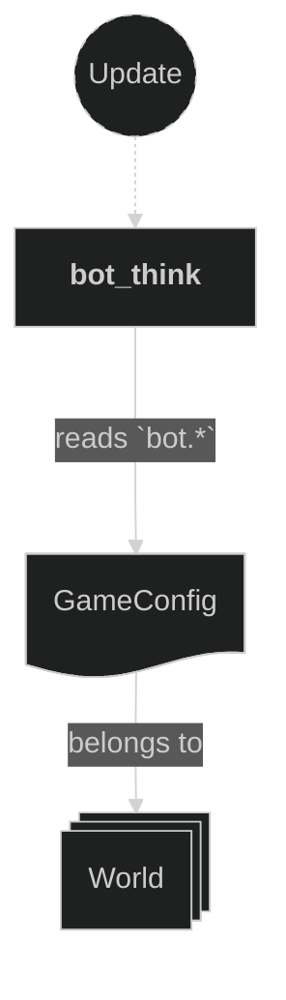
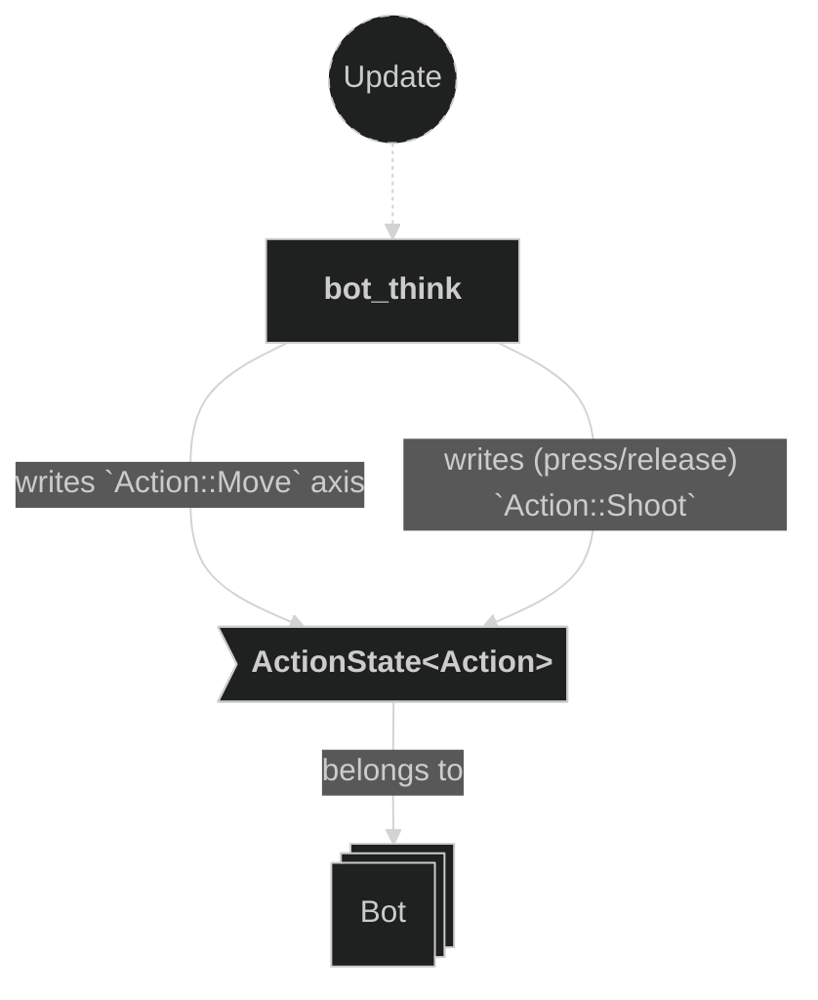
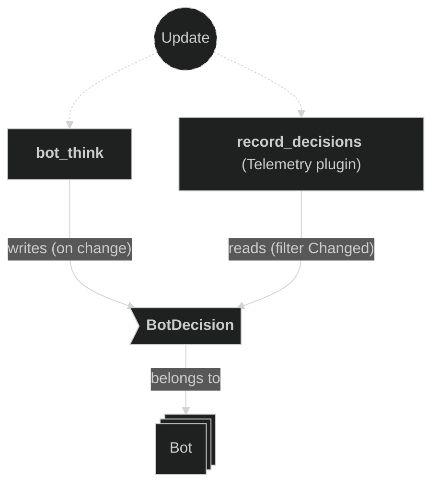

# Bot Plugin

Drives a bot-controlled player's synthetic `ActionState<Action>` through the same `handle_characters_input` system a human's `InputMap` drives, so the bot is bound by the identical fire and charge gates — it can never bypass `resolve_fire`'s claimed-tile refusal or fire without a `BeamCharges` charge. Each beat it deliberates in priority order — fire, aim, or path toward a target tile — and mirrors the chosen behaviour into `BotDecision` so the Telemetry plugin can log bot reasoning alongside human play.

## Concepts

- `Bot` — zero-sized marker component (`src/components/markers.rs`). Attached by the Input plugin's `attach_players_actions` to a bot-controlled player's entity in place of an `InputMap<Action>`; a bare `ActionState<Action>` is inserted alongside it instead. No standalone marker doc exists for it — it is documented here since this plugin is its primary consumer.
- `BotDecision` — public component mirroring the bot's most recently chosen behaviour: `behaviour` (a short tag such as `"claim"`, `"aggress"`, `"aim"`, `"reposition"`, `"idle"`), `why` (a human-readable reason string), `move_x`/`move_y` (the chosen move axis), and `shoot` (whether it fired this beat). Overwritten only when the value differs from the previous beat, so a cross-module reader — the Telemetry plugin's `record_decisions` — can log strictly on change via `Changed<BotDecision>`.
- `BotBrain` — private per-bot scratch state: `last_fire_secs` and `shooting` (fire-cooldown bookkeeping), `next_beat_secs` (the paced-deliberation gate), and `target` (a sticky `GridCoords` destination that persists across beats until it is claimed or claimed by the opponent).
- `config.controllers.player1_bot` / `player2_bot` — which seats are bot-driven; read by the Input plugin, not here.
- `config.bot.fire_cooldown_ms`, `aggression`, `think_interval_ms`, `hostile_cost` — the four tunables `bot_think` reads every beat (see the Config plugin doc for edit-timing tags).

## Plugin workflow

- Update phase
    - Attach Bot State reacts to newly added `Bot` entities that don't yet carry `BotBrain` and inserts default `BotBrain`/`BotDecision`.
    - Bot Think (`.after(attach_bot_state)`, `.before(handle_characters_input)`, gated `in_state(RoundPhase::Playing)`) paces itself to `think_interval_ms` and, once its beat elapses, decides whether to fire, turn to aim, or path toward a target tile, writing the result into the bot's `ActionState<Action>` and mirroring it into `BotDecision`.

## Plugin Systems

### Attach Bot State

Runs in `Update`. Query filters `Added<Bot>, Without<BotBrain>` — for every bot entity that was just added and doesn't yet carry brain state, inserts `BotBrain::default()` and `BotDecision::default()`.

### Bot Think

Runs in `Update`, ordered `.after(attach_bot_state)` and `.before(handle_characters_input)` (so its synthesized `ActionState` is in place before the input handler reads it that same frame), gated `in_state(RoundPhase::Playing)`.

**Beat gate**: if `time.elapsed_secs()` is still short of `brain.next_beat_secs`, the system zeroes the move axis, releases `Action::Shoot`, and continues to the next bot without deliberating — this paces movement/aim/fire choices to `config.bot.think_interval_ms` rather than re-deciding every frame. Otherwise it schedules the next beat and deliberates:

1. **Fire check** — computes whether firing from the current tile is legal at all (`fireable`, via `resolve_fire` with the bot's own `AbilityList`/`Backfill`), and `best_fire`: the current facing's `reach` if it is at least 1 tile, otherwise whichever of the four `CARDINALS` has the greatest `reach` (≥ 1). Committing to the current facing until its line is exhausted avoids swivelling between two directions of equal reach.
2. **Has charges and a shot is available** —
   - If not yet facing `best_fire`'s direction: releases `Action::Shoot`, turns to face it (moves the axis toward that direction) — behaviour `"aim"`.
   - Otherwise, once facing the runway: if `fire_cooldown_ms` has elapsed since the last shot and it isn't already mid-shot, presses `Action::Shoot` — behaviour `"aggress"` if the shot's line also crosses the opponent's tile (`fires_toward_opponent`), else `"claim"`. When no runway exists at all, firing into the blocked neighbour still claims the bot's own tile, so this same branch also covers that "claim current tile" case.
3. **No charges, or no shot available** — releases `Action::Shoot` and pathfinds via `dijkstra_first_steps` (4-connected from the bot's tile, cost 1 per normal tile and `config.bot.hostile_cost` to enter an opponent-owned tile). Keeps the sticky `brain.target` if it is still reachable and unclaimed; otherwise picks the reachable unclaimed tile that minimizes `reposition_score` (Dijkstra cost, biased toward the opponent's tile once `aggression ≥ 0.5`), breaking ties by Manhattan distance; if the whole board is already claimed, falls back to targeting the opponent's own tile when it is reachable, so the bot pressures rather than idles. Steps one tile toward the target — behaviour `"aggress"` if `aggression ≥ 0.5` else `"reposition"` — or reports `"idle"` if nothing is reachable.

The resulting move axis is written to `ActionState::<Action>::Move`, and a `BotDecision` built from the chosen behaviour/reason/axis/shoot flag replaces the component only if it differs from the previous beat's.

### reach (helper)

Private helper, not a system. Counts consecutive unclaimed, non-forbidden, on-ground tiles starting one step past `from` in direction `dir`, stopping at the first claimed tile, forbidden area, or off-ground position. Used by `bot_think` to score candidate firing directions.

### dijkstra_first_steps (helper)

Private helper, not a system. Runs Dijkstra's algorithm over walkable ground tiles from the bot's position, 4-connected via `CARDINALS`. Entering a tile owned by an opponent (`is_hostile_tile`) costs `hostile_cost`; any other ground tile costs 1. Returns, per reachable coordinate, the total cost and the first step taken from the start to reach it — the latter is what lets `bot_think` move one tile per beat toward a multi-tile-distant target without recomputing the full path.

## Components, Resources and Messages CRUD

### Query bots awaiting brain state

Used in the following systems:
- **attach_bot_state**: detects `Bot` entities that were just added and don't yet carry `BotBrain`, and inserts `BotBrain`/`BotDecision` on them

### Write commands — insert BotBrain and BotDecision

Used in the following systems:
- **attach_bot_state**: inserts default `BotBrain` and `BotDecision` on each newly attached bot entity

### Query bots for decision-making

Used in the following systems:
- **bot_think**: reads position and facing, mutably drives `ActionState#60;Action#62;`, and reads/writes its own `BotDecision`/`BotBrain` scratch state, for all `Bot` entities

### Query player positions

Used in the following systems:
- **bot_think**: collects every `Player` entity's `Entity` + `GridCoords` up front, to locate the opponent's current tile for aggression scoring and the opponent-pressure fallback

### Read MapInfo and ClaimedTile (bot pathfinding and fire check)

Used in the following systems:
- **bot_think**: reads `MapInfo.on_ground`/`on_forbidden_areas`/`claimed_entities` and `ClaimedTile.owner` (via `resolve_fire`, `reach`, `is_position_claimed`, `is_hostile_tile`, and `dijkstra_first_steps`) to decide whether a shot is legal, score candidate firing directions, and pathfind toward a reachable unclaimed tile

### Read GameConfig (bot tuning)

Used in the following systems:
- **bot_think**: reads `config.bot.fire_cooldown_ms`, `config.bot.aggression`, `config.bot.think_interval_ms`, and `config.bot.hostile_cost` every beat

### Write ActionState (bot)

Used in the following systems:
- **bot_think**: sets `Action::Move`'s axis pair each beat, and presses or releases `Action::Shoot` — the same component `handle_characters_input` reads for a human, so the bot obeys identical fire/charge gates

### Write BotDecision (cross-module read)

Used in the following systems:
- **bot_think**: replaces `BotDecision` with the beat's chosen behaviour, reason, move axis, and shoot flag, only when it differs from the previous value

