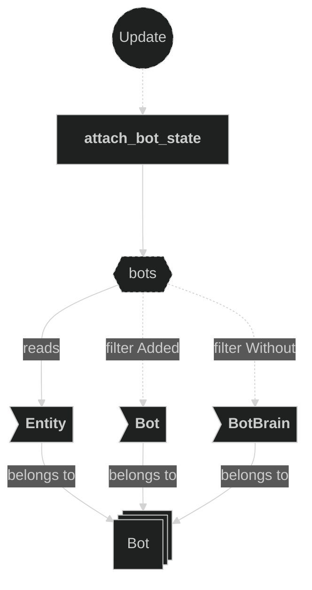
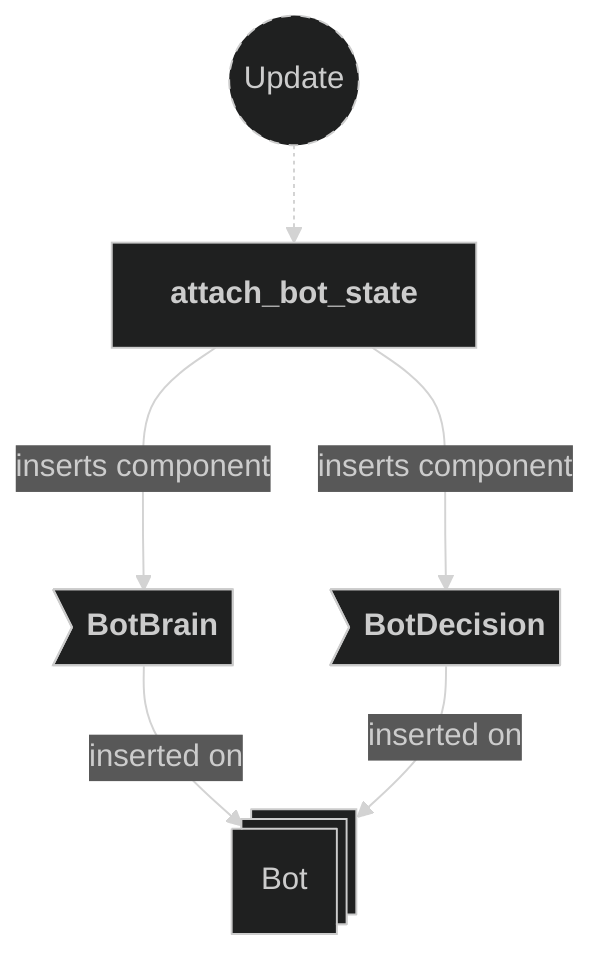
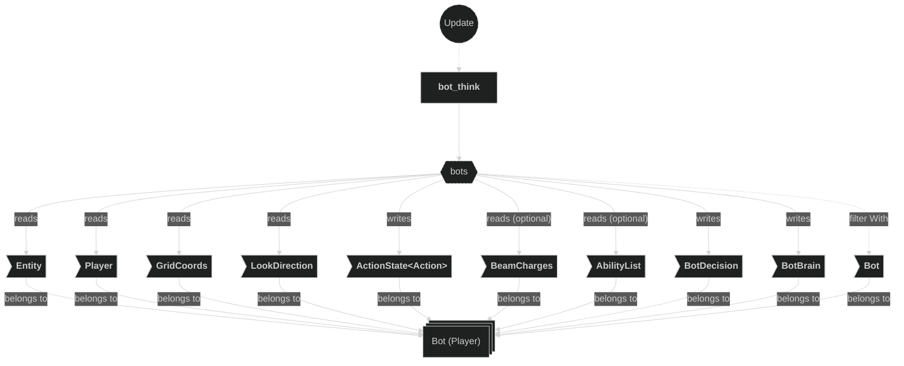
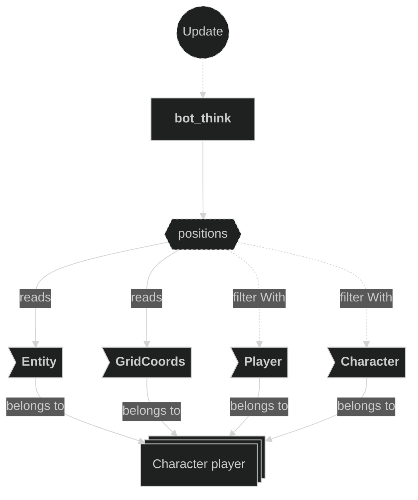
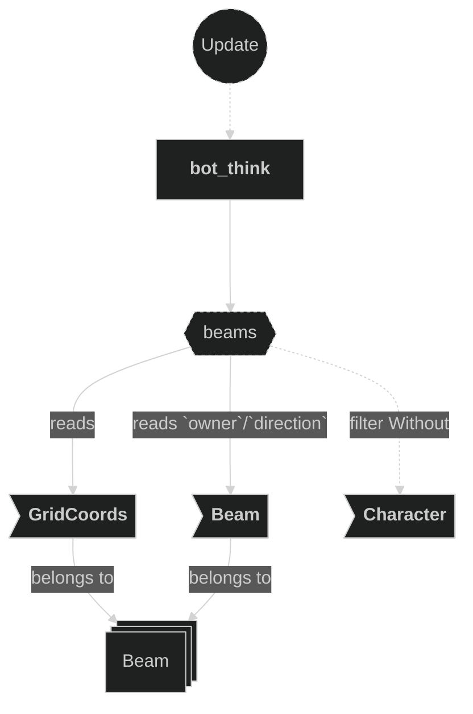
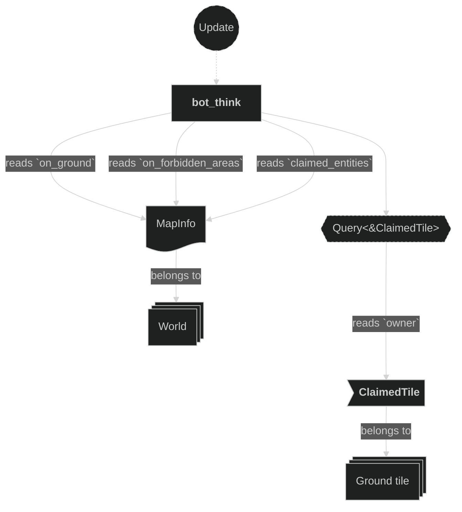
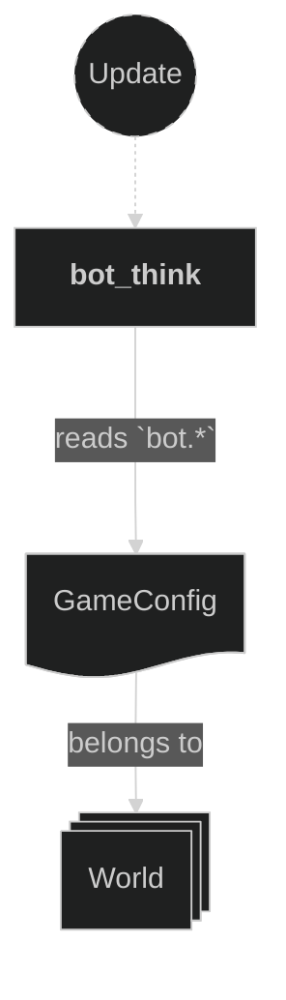
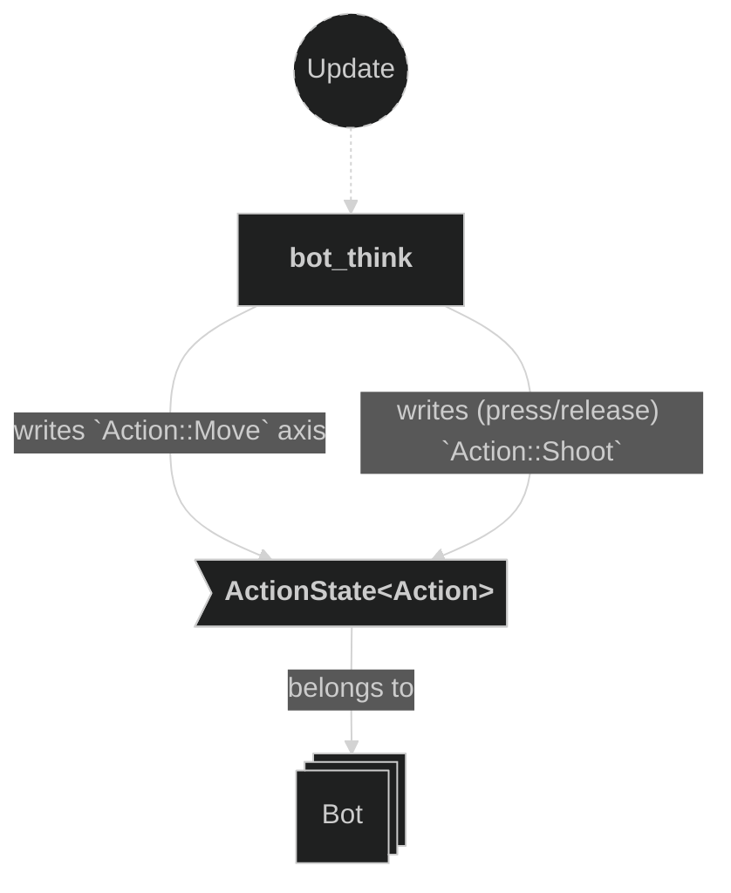
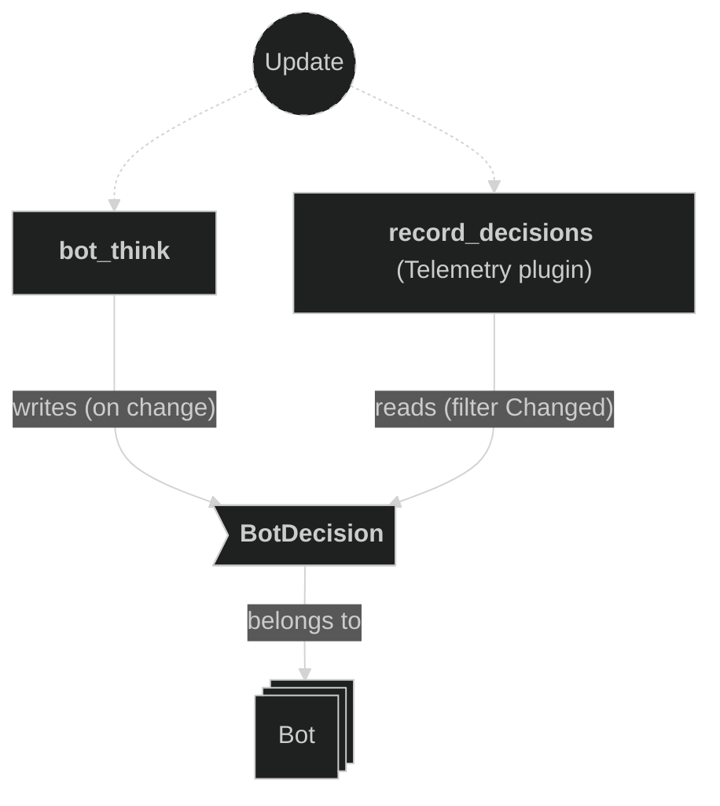

# Bot Plugin

Drives a bot-controlled player's synthetic `ActionState<Action>` through the same `handle_characters_input` system a human's `InputMap` drives, so the bot is bound by the identical fire and charge gates — it can never bypass `resolve_fire`'s claimed-tile refusal or fire without a `BeamCharges` charge. Each beat it deliberates and mirrors the chosen behaviour into `BotDecision` so the Telemetry plugin can log bot reasoning alongside human play.

Each seat runs one of two decision modes, selected per seat by `config.bot.strike_for(player.player_id)`:

- **Striking seat** (strike flag on) — offense-focused; ignores territory. It fires whenever it has a line of fire to the opponent, otherwise chases them via A*.
- **Territory seat** (strike flag off — the default) — first runs an always-on reactive dodge that steps off the line of an incoming hostile beam; otherwise it claims tiles by firing along runways, repositions via Dijkstra, and (with the Lance ability) strikes aligned opponents.

## Concepts

- `Bot` — zero-sized marker component (`src/components/markers.rs`). Attached by the Input plugin's `attach_players_actions` to a bot-controlled player's entity in place of an `InputMap<Action>`; a bare `ActionState<Action>` is inserted alongside it instead. No standalone marker doc exists for it — it is documented here since this plugin is its primary consumer.
- `BotDecision` — public component mirroring the bot's most recently chosen behaviour: `behaviour` (a short tag, one of `"claim"`, `"aggress"`, `"aim"`, `"reposition"`, `"idle"`, `"lance"`, `"lance_strike"`, `"hunt"`, `"strike_lance"`, `"strike_straight"`, `"dodge"`), `why` (a human-readable reason string), `move_x`/`move_y` (the chosen move axis), and `shoot` (whether it fired this beat). Overwritten only when the value differs from the previous beat, so a cross-module reader — the Telemetry plugin's `record_decisions` — can log strictly on change via `Changed<BotDecision>`.
- `BotBrain` — private per-bot scratch state: `last_fire_secs` and `shooting` (fire-cooldown bookkeeping), `next_beat_secs` (the paced-deliberation gate), and `target` (a sticky `GridCoords` destination that persists across beats until it is claimed or claimed by the opponent).
- `config.controllers.player1_bot` / `player2_bot` — which seats are bot-driven; read by the Input plugin, not here.
- `config.bot.fire_cooldown_ms`, `aggression`, `think_interval_ms`, `hostile_cost` — the four numeric tunables `bot_think` reads every beat (see the Config plugin doc for edit-timing tags).
- `config.bot.player1_strike` / `player2_strike` — per-seat mode flags, read via `strike_for(player.player_id)` to choose the striking vs. territory decision path. The dodge reflex and the territory Lance-strike are always-on, not config toggles.

## Plugin workflow

- Update phase
    - Attach Bot State reacts to newly added `Bot` entities that don't yet carry `BotBrain` and inserts default `BotBrain`/`BotDecision`.
    - Bot Think (`.after(attach_bot_state)`, `.before(handle_characters_input)`, gated `in_state(RoundPhase::Playing)`) paces itself to `think_interval_ms` and, once its beat elapses, runs the seat's decision mode (striking or territory) — fire/aim/hunt/claim/reposition/dodge — writing the result into the bot's `ActionState<Action>` and mirroring it into `BotDecision`.

## Plugin Systems

### Attach Bot State

Runs in `Update`. Query filters `Added<Bot>, Without<BotBrain>` — for every bot entity that was just added and doesn't yet carry brain state, inserts `BotBrain::default()` and `BotDecision::default()`.

### Bot Think

Runs in `Update`, ordered `.after(attach_bot_state)` and `.before(handle_characters_input)` (so its synthesized `ActionState` is in place before the input handler reads it that same frame), gated `in_state(RoundPhase::Playing)`.

**Beat gate**: if `time.elapsed_secs()` is still short of `brain.next_beat_secs`, the system zeroes the move axis, releases `Action::Shoot`, and continues to the next bot without deliberating — this paces movement/aim/fire choices to `config.bot.think_interval_ms` rather than re-deciding every frame. Otherwise it schedules the next beat, resolves the opponent's tile (first non-self `Character` player), computes the fireable `behavior` from the current tile (`resolve_fire` with the bot's own `AbilityList`/`Lance`), and picks a branch based on `config.bot.strike_for(player.player_id)`.

**Striking seat** (strike flag on, and an opponent exists) — offense-focused; territory is irrelevant.

- **Line of fire** — tests whether a shot in the current facing, then any of the four `CARDINALS`, geometrically reaches the opponent (`shot_hits_enemy`: a Straight shot is stopped by the first claimed tile, a Lance shot pierces claimed/forbidden tiles). If a firing direction exists but the bot isn't facing it yet, it turns in place — behaviour `"aim"`; once facing it, and if `fire_cooldown_ms` has elapsed since the last shot and it isn't mid-shot, it presses `Action::Shoot` — behaviour `"strike_lance"` (Lance beam) or `"strike_straight"` (Straight beam).
- **Hunt** — with no line of fire, it chases via `astar_first_step` toward the opponent's tile — behaviour `"hunt"`. A striker *with* Lance chases freely (it can pierce-strike from claimed tiles). A striker *without* Lance never steps onto or idles on an enemy tile (it can't fire from a claimed tile, so it would just soak damage waiting): it takes the chase step only if it lands on a safe (on-ground, non-hostile) tile, else the safe cardinal step nearest the foe. If no safe approach exists it reports `"idle"`.

**Territory seat** (strike flag off — the default) — deliberates in priority order:

1. **Dodge** — before any fire/path logic, `incoming_beam_dodge` scans the `beams` query: if a hostile beam is travelling along the bot's row or column toward it, the bot steps perpendicular off the line onto a safe (on-ground, non-hostile) tile — behaviour `"dodge"`.
2. **Fire** — `best_fire` is the current facing's `reach` if it is at least 1 tile, otherwise whichever `CARDINAL` has the greatest `reach` (≥ 1); for Lance it is instead the direction that lands on the opponent, else the first landing direction (`lance_hits_enemy` / `lance_landing`). Committing to the current facing until its line is exhausted avoids swivelling between two directions of equal reach. If the bot has charges and a shot is available: if it isn't facing the fire direction yet it turns in place — behaviour `"aim"`; once facing (or when no runway exists — firing into a blocked neighbour still claims the bot's own tile), and if the cooldown has elapsed and it isn't mid-shot, it presses `Action::Shoot` — behaviour `"lance_strike"` (Lance beam reaching an aligned opponent), `"lance"` (other Lance shot), `"aggress"` (Straight shot whose line crosses the opponent, `fires_toward_opponent`), or `"claim"`.
3. **Reposition** — with no charges or no shot, it pathfinds via `dijkstra_first_steps` (4-connected, cost 1 per normal tile and `config.bot.hostile_cost` to enter an opponent-owned tile). It keeps the sticky `brain.target` if still reachable and unclaimed; otherwise picks the reachable unclaimed tile minimizing `reposition_score` (Dijkstra cost, biased toward the opponent once `aggression ≥ 0.5`), ties broken by Manhattan distance; if the whole board is claimed it falls back to the opponent's tile when reachable, so it pressures rather than idles. It steps one tile toward the target — behaviour `"aggress"` if `aggression ≥ 0.5` else `"reposition"` — or reports `"idle"` if nothing is reachable.

The resulting move axis is written to `ActionState::<Action>::Move`, and a `BotDecision` built from the chosen behaviour/reason/axis/shoot flag replaces the component only if it differs from the previous beat's.

### reach (helper)

Private helper, not a system. Counts consecutive unclaimed, non-forbidden, on-ground tiles starting one step past `from` in direction `dir`, stopping at the first claimed tile, forbidden area, or off-ground position. Used by `bot_think` to score candidate firing directions.

### dijkstra_first_steps (helper)

Private helper, not a system. Runs Dijkstra's algorithm over walkable ground tiles from the bot's position, 4-connected via `CARDINALS`. Entering a tile owned by an opponent (`is_hostile_tile`) costs `hostile_cost`; any other ground tile costs 1. Returns, per reachable coordinate, the total cost and the first step taken from the start to reach it — the latter is what lets `bot_think` move one tile per beat toward a multi-tile-distant target without recomputing the full path.

### astar_first_step (helper)

Private helper, not a system. Goal-directed A* from the bot's tile toward a single target tile over walkable ground (4-connected via `CARDINALS`), entering an enemy-owned tile costing `hostile_cost`, with a Manhattan heuristic (admissible since every step costs ≥ 1). Returns the first step of a shortest path, or `None` if unreachable. It terminates when it reaches the goal *or* any tile cardinally adjacent to it — the goal itself may be a non-walkable tile (e.g. a player-start position outside `ground_entities`), and adjacency is where a strike lines up. Used by the striking seat's hunt behaviour.

### shot_hits_enemy (helper)

Private helper, not a system. Whether a shot of a given `BeamBehavior` fired from a tile in a direction geometrically reaches the opponent: a Straight shot is stopped by the first claimed tile (any owner), a Lance shot (delegating to `lance_hits_enemy`) pierces claimed/forbidden tiles. Used by the striking seat to detect a line of fire.

### lance_hits_enemy / lance_landing (helpers)

Private helpers, not systems. `lance_hits_enemy` reports whether a Lance shot from a tile in a direction reaches the opponent — landing on their tile or passing its head over them — before resolving elsewhere or leaving the map. `lance_landing` returns the tile a Lance shot resolves on (pierces claimed/forbidden tiles to the first unclaimed ground tile ahead), or `None` if it leaves the map first. Used by the territory seat's Lance branch (and `shot_hits_enemy`).

### incoming_beam_dodge (helper)

Private helper, not a system. Scans the `beams` query for a hostile beam (not owned by this bot) travelling along the bot's row or column toward it; if one is found, returns a perpendicular escape step onto a safe (on-ground, non-hostile) tile off the line, else `None`. Drives the territory seat's always-on `"dodge"` reflex.

## Components, Resources and Messages CRUD

### Query bots awaiting brain state

Used in the following systems:
- **attach_bot_state**: detects `Bot` entities that were just added and don't yet carry `BotBrain`, and inserts `BotBrain`/`BotDecision` on them

```mermaid
---
config:
  theme: dark
---

flowchart TD
classDef system-group stroke-dasharray: 5 5
classDef query stroke-dasharray: 3 3

update(("`Update`")):::system-group
attach_bot_state["`**attach_bot_state**`"]

update -.-> attach_bot_state

bots_query{{"`bots`"}}:::query
attach_bot_state ---> bots_query

bot_entity@{ shape: st-rect, label: "Bot" }

be_entity>"`**Entity**`"] --> |belongs to| bot_entity
be_bot>"`**Bot**`"] --> |belongs to| bot_entity
be_brain>"`**BotBrain**`"] --> |belongs to| bot_entity

bots_query ---> |reads| be_entity
bots_query -..-> |filter Added| be_bot
bots_query -..-> |filter Without| be_brain
```

### Write commands — insert BotBrain and BotDecision

Used in the following systems:
- **attach_bot_state**: inserts default `BotBrain` and `BotDecision` on each newly attached bot entity

```mermaid
---
config:
  theme: dark
---

flowchart TD
classDef system-group stroke-dasharray: 5 5

update(("`Update`")):::system-group
attach_bot_state["`**attach_bot_state**`"]

update -.-> attach_bot_state

bot_entity@{ shape: st-rect, label: "Bot" }

be_brain>"`**BotBrain**`"]
be_decision>"`**BotDecision**`"]

be_brain --> |inserted on| bot_entity
be_decision --> |inserted on| bot_entity

attach_bot_state ---> |inserts component| be_brain
attach_bot_state ---> |inserts component| be_decision
```

### Query bots for decision-making

Used in the following systems:
- **bot_think**: reads position, facing, and `Player` (for `player_id`, to select the seat's decision mode), mutably drives `ActionState#60;Action#62;`, and reads/writes its own `BotDecision`/`BotBrain` scratch state, for all `Bot` entities

```mermaid
---
config:
  theme: dark
---

flowchart TD
classDef system-group stroke-dasharray: 5 5
classDef query stroke-dasharray: 3 3

update(("`Update`")):::system-group
bot_think["`**bot_think**`"]

update -.-> bot_think

bots_query{{"`bots`"}}:::query
bot_think ---> bots_query

bot_entity@{ shape: st-rect, label: "Bot (Player)" }

be_entity>"`**Entity**`"] --> |belongs to| bot_entity
be_player>"`**Player**`"] --> |belongs to| bot_entity
be_grid_coords>"`**GridCoords**`"] --> |belongs to| bot_entity
be_look_direction>"`**LookDirection**`"] --> |belongs to| bot_entity
be_action_state>"`**ActionState#60;Action#62;**`"] --> |belongs to| bot_entity
be_beam_charges>"`**BeamCharges**`"] --> |belongs to| bot_entity
be_ability_list>"`**AbilityList**`"] --> |belongs to| bot_entity
be_decision>"`**BotDecision**`"] --> |belongs to| bot_entity
be_brain>"`**BotBrain**`"] --> |belongs to| bot_entity
be_bot>"`**Bot**`"] --> |belongs to| bot_entity

bots_query ---> |reads| be_entity
bots_query ---> |reads| be_player
bots_query ---> |reads| be_grid_coords
bots_query ---> |reads| be_look_direction
bots_query ---> |writes| be_action_state
bots_query ---> |"reads (optional)"| be_beam_charges
bots_query ---> |"reads (optional)"| be_ability_list
bots_query ---> |writes| be_decision
bots_query ---> |writes| be_brain
bots_query -..-> |filter With| be_bot
```

### Query player positions

Used in the following systems:
- **bot_think**: collects every character player's `Entity` + `GridCoords` up front, to locate the opponent's current tile for aggression scoring, hunting, and the opponent-pressure fallback. The `With<Character>` filter is required alongside `With<Player>`: HUD entities (HP bars) also carry a `Player` component plus a `GridCoords`, so without it the bot could pick a non-character HUD entity as its opponent

```mermaid
---
config:
  theme: dark
---

flowchart TD
classDef system-group stroke-dasharray: 5 5
classDef query stroke-dasharray: 3 3

update(("`Update`")):::system-group
bot_think["`**bot_think**`"]

update -.-> bot_think

positions_query{{"`positions`"}}:::query
bot_think ---> positions_query

player_entity@{ shape: st-rect, label: "Character player" }

pe_entity>"`**Entity**`"] --> |belongs to| player_entity
pe_grid_coords>"`**GridCoords**`"] --> |belongs to| player_entity
pe_player>"`**Player**`"] --> |belongs to| player_entity
pe_character>"`**Character**`"] --> |belongs to| player_entity

positions_query ---> |reads| pe_entity
positions_query ---> |reads| pe_grid_coords
positions_query -..-> |filter With| pe_player
positions_query -..-> |filter With| pe_character
```

### Query beams (dodge detection)

Used in the following systems:
- **bot_think**: iterates active `Beam` entities (via `incoming_beam_dodge`), reading each beam's `GridCoords` and its `Beam.owner`/`Beam.direction`, to detect a hostile beam bearing down the bot's row or column and pick a perpendicular escape step. The `Without<Character>` filter excludes player entities so only logical beam tracers are scanned

```mermaid
---
config:
  theme: dark
---

flowchart TD
classDef system-group stroke-dasharray: 5 5
classDef query stroke-dasharray: 3 3

update(("`Update`")):::system-group
bot_think["`**bot_think**`"]

update -.-> bot_think

beams_query{{"`beams`"}}:::query
bot_think ---> beams_query

beam_entity@{ shape: st-rect, label: "Beam" }

be_grid_coords>"`**GridCoords**`"] --> |belongs to| beam_entity
be_beam>"`**Beam**`"] --> |belongs to| beam_entity
be_character>"`**Character**`"]

beams_query ---> |reads| be_grid_coords
beams_query ---> |reads `owner`/`direction`| be_beam
beams_query -..-> |filter Without| be_character
```

### Read MapInfo and ClaimedTile (bot pathfinding and fire check)

Used in the following systems:
- **bot_think**: reads `MapInfo.on_ground`/`on_forbidden_areas`/`claimed_entities` and `ClaimedTile.owner` (via `resolve_fire`, `reach`, `is_position_claimed`, `is_hostile_tile`, `dijkstra_first_steps`, `astar_first_step`, `shot_hits_enemy`, `lance_hits_enemy`, `lance_landing`, and `incoming_beam_dodge`) to decide whether a shot is legal, score candidate firing directions, detect a line of fire to the opponent, and pathfind toward a reachable tile

```mermaid
---
config:
  theme: dark
---

flowchart TD
classDef system-group stroke-dasharray: 5 5
classDef query stroke-dasharray: 3 3

update(("`Update`")):::system-group
bot_think["`**bot_think**`"]

update -.-> bot_think

claimed_query{{"Query#60;#38;ClaimedTile#62;"}}:::query
bot_think ---> claimed_query

tile_entity@{ shape: st-rect, label: "Ground tile" }
te_claimed>"`**ClaimedTile**`"] --> |belongs to| tile_entity
claimed_query ---> |reads `owner`| te_claimed

world@{ shape: st-rect, label: "World" }
map_info_res@{ shape: doc, label: "MapInfo" }
map_info_res --> |belongs to| world

bot_think ---> |reads `on_ground`| map_info_res
bot_think ---> |reads `on_forbidden_areas`| map_info_res
bot_think ---> |reads `claimed_entities`| map_info_res
```

### Read GameConfig (bot tuning)

Used in the following systems:
- **bot_think**: every beat reads the numeric tunables `config.bot.fire_cooldown_ms`, `config.bot.aggression`, `config.bot.think_interval_ms`, and `config.bot.hostile_cost`, plus the per-seat mode flag `config.bot.player1_strike`/`player2_strike` (via `strike_for`) to choose the striking vs. territory decision path. The dodge reflex and the territory Lance-strike are always-on, not config toggles

```mermaid
---
config:
  theme: dark
---

flowchart TD
classDef system-group stroke-dasharray: 5 5

update(("`Update`")):::system-group
bot_think["`**bot_think**`"]

update -.-> bot_think

world@{ shape: st-rect, label: "World" }
config_res@{ shape: doc, label: "GameConfig" }
config_res --> |belongs to| world

bot_think ---> |reads `bot.*`| config_res
```

### Write ActionState (bot)

Used in the following systems:
- **bot_think**: sets `Action::Move`'s axis pair each beat, and presses or releases `Action::Shoot` — the same component `handle_characters_input` reads for a human, so the bot obeys identical fire/charge gates

```mermaid
---
config:
  theme: dark
---

flowchart TD
classDef system-group stroke-dasharray: 5 5

update(("`Update`")):::system-group
bot_think["`**bot_think**`"]

update -.-> bot_think

bot_entity@{ shape: st-rect, label: "Bot" }

be_action_state>"`**ActionState#60;Action#62;**`"] --> |belongs to| bot_entity

bot_think ---> |writes `Action::Move` axis| be_action_state
bot_think ---> |"writes (press/release) `Action::Shoot`"| be_action_state
```

### Write BotDecision (cross-module read)

Used in the following systems:
- **bot_think**: replaces `BotDecision` with the beat's chosen behaviour, reason, move axis, and shoot flag, only when it differs from the previous value

```mermaid
---
config:
  theme: dark
---

flowchart TD
classDef system-group stroke-dasharray: 5 5

update(("`Update`")):::system-group
bot_think["`**bot_think**`"]
record_decisions["`**record_decisions** (Telemetry plugin)`"]

update -.-> bot_think
update -.-> record_decisions

bot_entity@{ shape: st-rect, label: "Bot" }

be_decision>"`**BotDecision**`"] --> |belongs to| bot_entity

bot_think ---> |"writes (on change)"| be_decision
record_decisions ---> |"reads (filter Changed)"| be_decision
```
