# Telemetry Plugin

Records human and bot play to a single gitignored JSONL file, `play_trace.jsonl` (one JSON object per line), for balance analysis. Every record is tagged `controller` (`"human"` or `"bot"`) so human and bot play can be filtered and compared. All systems are gated behind the `config.telemetry.enabled` toggle and additionally no-op whenever the sink failed to open, so telemetry can be fully disabled with a single config flag and adds no behaviour when off.

## Concepts

- **Record kinds** — every line is one of four `#[derive(Serialize)]` structs, each carrying its own `kind` tag:
    - `SessionRecord` (`kind: "session"`) — `telemetry_enabled`, `bot_p1`, `bot_p2`, `loadout_p1: Vec<String>`, `loadout_p2: Vec<String>`. Written once, at sink open.
    - `ActionRecord` (`kind: "action"`) — `controller`, `player_id`, `t` (elapsed seconds), `x`, `y`, `facing: Option<String>`, `shoot`, `charges_current: Option<u32>`, `charges_max: Option<u32>`, `on_hostile`. Written on change, per player, while `Playing`.
    - `DecisionRecord` (`kind: "decision"`) — `controller` (always `"bot"`), `player_id`, `t`, `behaviour`, `why`, `move_x`, `move_y`, `shoot`. Written on change, per bot, while `Playing`.
    - `OutcomeRecord` (`kind: "outcome"`) — `winner: Option<u8>`, `reason` (`"kill"` | `"timeout"` | `"charge_exhaustion"`), `round_duration_secs`, `players: Vec<OutcomePlayer>`; each `OutcomePlayer` carries `player_id`, `controller`, `tile_pct`, `tile_count`, `hp`, `charges_spent`, `loadout: Vec<String>`. Written once per round, on entering `Outcome`.
- `config.telemetry.enabled` — master toggle; every system in this plugin is gated on it via the `telemetry_enabled` run condition.
- `config.telemetry.history` — total trace files kept: the live `play_trace.jsonl` plus `history - 1` rotated backups (`play_trace.1.jsonl`, `play_trace.2.jsonl`, …). `history <= 1` disables rotation entirely (no backups kept).
- `TelemetrySink` — the private `Resource` wrapping a `BufWriter<File>` open on `play_trace.jsonl`; only present after a successful `open_sink`, so every other system takes it as `Option<ResMut<TelemetrySink>>` and silently does nothing while absent.
- `ActionSnapshots` — a `Resource` mapping each player `Entity` to its last-written `ActionSnapshot` (`x`, `y`, `facing`, `shoot`, `charges_current`, `on_hostile`), so `record_actions` emits a record only when that state actually changed rather than every frame.
- `controller_tag` — shared helper mapping `Option<&Bot>` to `"bot"`/`"human"`, used by `ActionRecord` and `OutcomePlayer`. `DecisionRecord` only bots produce, so it hardcodes `"bot"` instead; `SessionRecord` has no per-entity `controller` field at all — its `bot_p1`/`bot_p2` booleans come straight from `config.controllers.is_bot()`.

## Plugin workflow

- Startup phase
    - Open Sink (gated `telemetry.enabled`) rotates the previous session's trace files, opens a fresh `play_trace.jsonl`, and writes the `session` header record.
- Update phase (gated `RoundPhase::Playing` and `telemetry.enabled`)
    - Record Actions writes an `action` record per player whenever its position, facing, shoot state, charges, or hostile-tile status changes.
    - Record Decisions writes a `decision` record per bot whenever its `BotDecision` changes.
- OnEnter(`RoundPhase::Outcome`) phase (gated `telemetry.enabled`)
    - Record Outcome writes one `outcome` record summarizing the round that just ended.

## Plugin Systems

### Open Sink

Runs once at `Startup`, gated on `config.telemetry.enabled`. Calls `rotate_traces(config.telemetry.history)` to shift the previous session's trace aside, then opens `play_trace.jsonl` with `create + truncate` (creating it fresh); on failure it logs a warning and returns without inserting `TelemetrySink`, leaving telemetry silently inert for the rest of the session. On success it writes the `session` header — `telemetry_enabled` from config, `bot_p1`/`bot_p2` from `config.controllers.is_bot(0/1)`, and `loadout_p1`/`loadout_p2` from the `PlayerLoadouts` resource (each descriptor rendered via its `Debug` impl) — flushes, and inserts the `TelemetrySink` resource.

### rotate_traces (helper)

Private helper, not a system. If `history <= 1`, does nothing (no rotation). Otherwise, with `backups = history - 1`: removes `play_trace.{backups}.jsonl` if present, renames `play_trace.{n}.jsonl` to `play_trace.{n+1}.jsonl` for `n` from `backups - 1` down to `1`, then renames the just-finished session's `play_trace.jsonl` to `play_trace.1.jsonl`. Net effect: `history` total files survive (the fresh current file plus `history - 1` numbered backups), and each run starts from a clean `play_trace.jsonl` without discarding recent sessions.

### Record Actions

Runs in `Update`, gated `in_state(RoundPhase::Playing)` and `config.telemetry.enabled`. Returns immediately if `TelemetrySink` is absent. For every player (`Entity`, `Player`, `GridCoords`, `LookDirection`, `ActionState<Action>`, optional `BeamCharges`, optional `Bot`), builds an `ActionSnapshot` (position, facing, whether `Action::Shoot` is pressed, current charges, and whether the tile under the player is hostile via `is_hostile_tile`). Compares it against `ActionSnapshots`' stored value for that entity; if unchanged, skips the player entirely. On any difference, updates the stored snapshot and writes an `ActionRecord` tagged with `controller_tag(bot)`, the player's `player_id`, the elapsed time, and the full snapshot plus `charges_max`.

### Record Decisions

Runs in `Update`, gated `in_state(RoundPhase::Playing)` and `config.telemetry.enabled`. Returns immediately if `TelemetrySink` is absent. Queries `(&Player, &BotDecision)` filtered by `With<Bot>, Changed<BotDecision>` — the Bot plugin already only overwrites `BotDecision` when it changes, so this filter alone gives on-change semantics. Writes one `DecisionRecord` per matching bot, tagged `controller: "bot"`, carrying the player's id, the elapsed time, and the decision's `behaviour`/`why`/`move_x`/`move_y`/`shoot` fields verbatim.

### Record Outcome

Runs on `OnEnter(RoundPhase::Outcome)`, gated `config.telemetry.enabled`. Returns immediately if `TelemetrySink` is absent. Reads `RoundResult.winner`, and `Countdown.remaining` (treated as `0` if the resource is absent) to derive `reason`: `"kill"` if any player's `Health.current <= 0`, else `"timeout"` if `remaining == 0`, else `"charge_exhaustion"`. Reads `MapInfo.ground_entities.len()` (floored to at least 1) as the tile-percentage denominator. For every player (`Player`, `ClaimedTileCount`, `Health`, `BeamCharges`, `AbilityList`, optional `Bot`) builds an `OutcomePlayer` — `tile_pct` (`count / total * 100`), `tile_count`, `hp`, `charges_spent` (`charges.max - charges.current`, saturating), and `loadout` (descriptor names) — sorted by `player_id`. Writes one `OutcomeRecord` with the winner, reason, `round_duration_secs` (`config.round.round_duration_secs - remaining`, saturating), and the sorted player list, then flushes the writer so the round's outcome is durable on disk immediately.

## Components, Resources and Messages CRUD

### Read GameConfig and PlayerLoadouts (sink open)

Used in the following systems:
- **open_sink**: reads `config.telemetry.history`/`enabled` and `config.controllers.is_bot(0/1)` to build the rotation and session header, and reads `PlayerLoadouts.player1`/`player2` for the session's starting loadouts

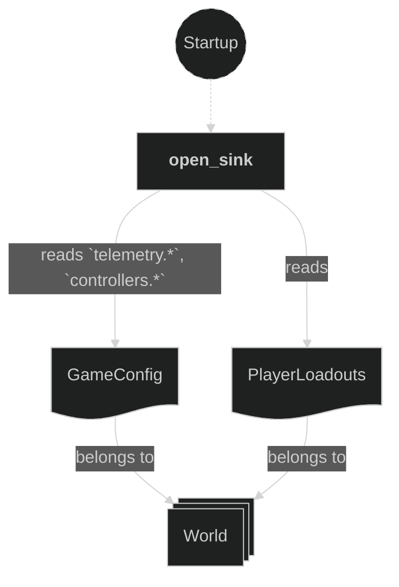

### Write commands — insert TelemetrySink

Used in the following systems:
- **open_sink**: opens `play_trace.jsonl`, writes the `session` header record, and inserts the `TelemetrySink` resource

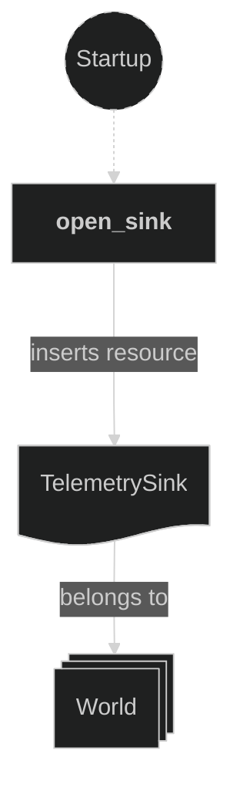

### Query players for action recording

Used in the following systems:
- **record_actions**: reads position, facing, shoot state, optional charges, and optional `Bot` for every player entity, plus `MapInfo`/`ClaimedTile` (below) to compute hostile-tile status

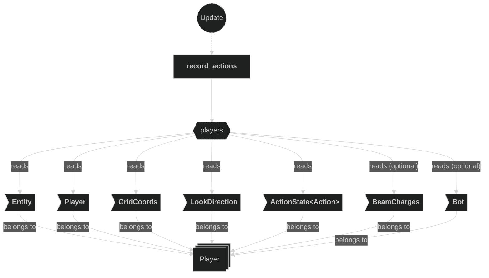

### Read MapInfo and ClaimedTile (hostile-tile check)

Used in the following systems:
- **record_actions**: via `is_hostile_tile`, resolves each player's `GridCoords` through `MapInfo.claimed_entities` and reads the resolved `ClaimedTile.owner` to fill `ActionSnapshot.on_hostile`

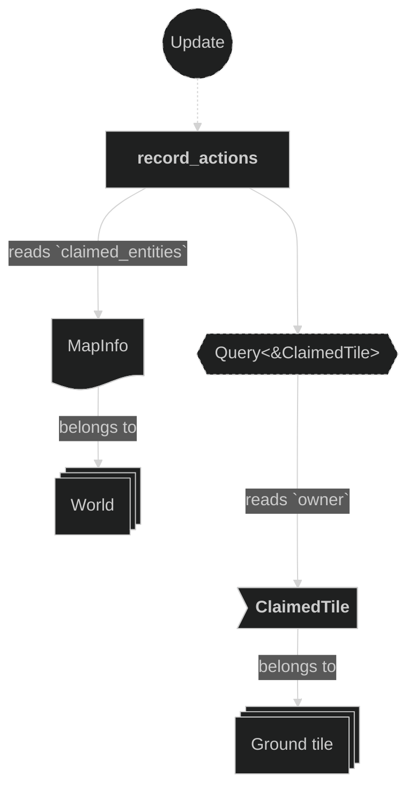

### Write and read ActionSnapshots resource

Used in the following systems:
- **record_actions**: compares the current frame's snapshot against the stored one per player entity, skipping the write when unchanged, and updates the stored snapshot on any difference

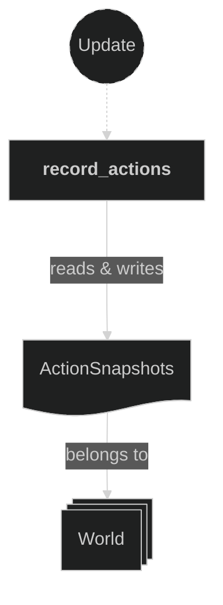

### Write ActionRecord lines

Used in the following systems:
- **record_actions**: appends one JSON line per player whose snapshot changed this frame

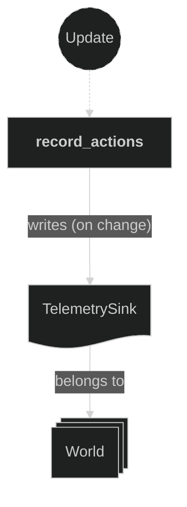

### Query bot decisions for decision recording

Used in the following systems:
- **record_decisions**: reads `Player` and `BotDecision` for `Bot` entities whose `BotDecision` changed this frame

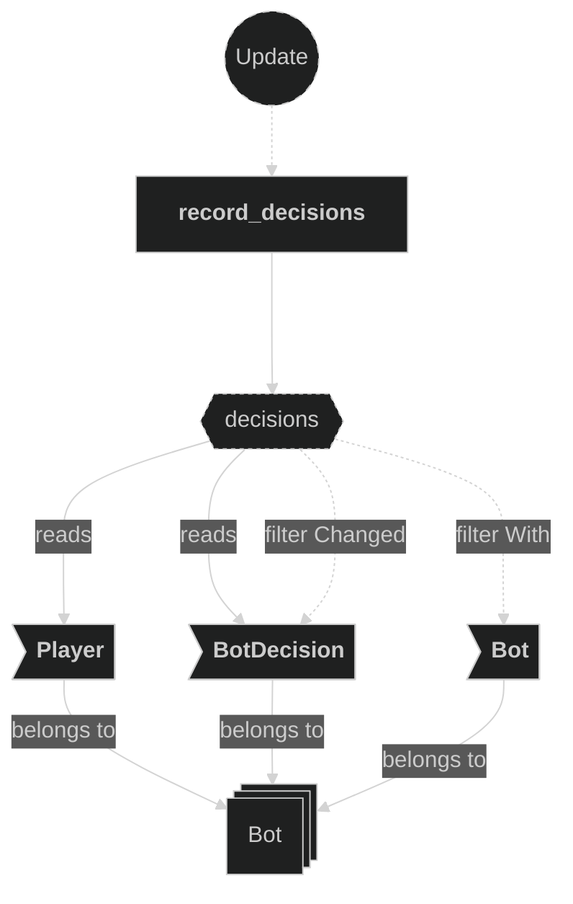

### Write DecisionRecord lines

Used in the following systems:
- **record_decisions**: appends one JSON line per bot whose decision changed this frame

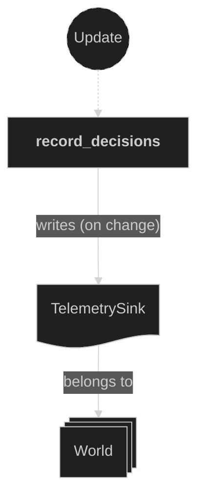

### Read round-outcome inputs (RoundResult, Countdown, MapInfo, GameConfig)

Used in the following systems:
- **record_outcome**: reads `RoundResult.winner`, optional `Countdown.remaining`, `MapInfo.ground_entities` (tile-percentage denominator), and `config.round.round_duration_secs`

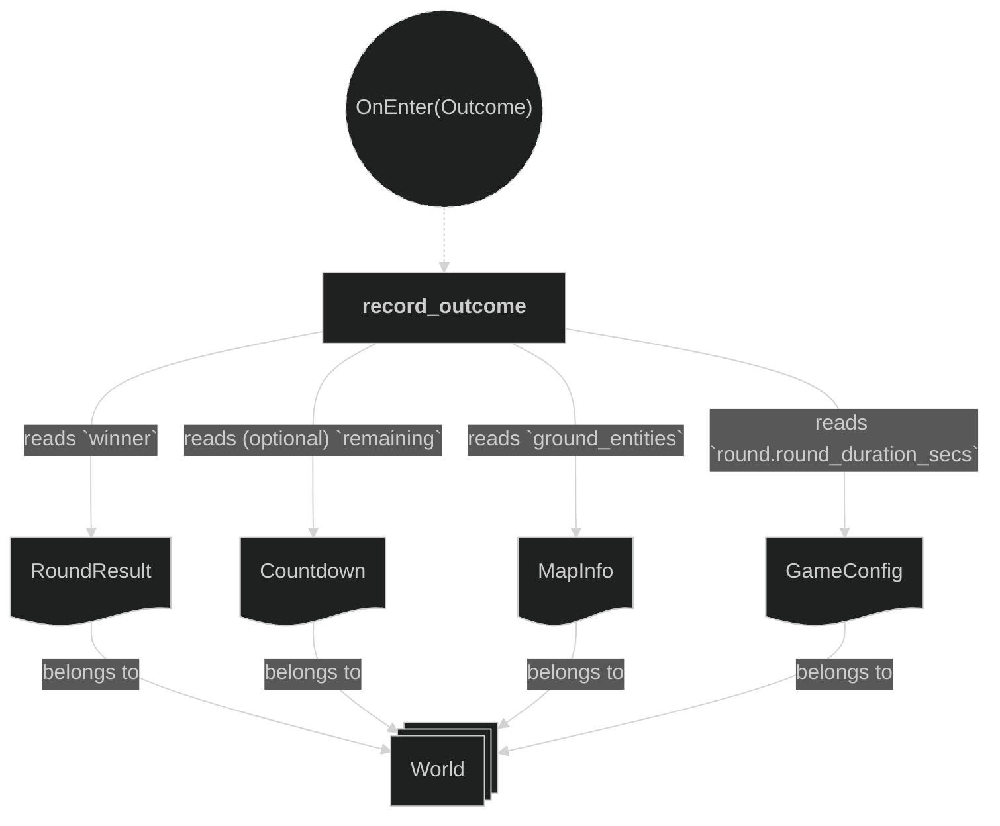

### Query players for outcome recording

Used in the following systems:
- **record_outcome**: reads each player's `Player`, `ClaimedTileCount`, `Health`, `BeamCharges`, `AbilityList`, and optional `Bot` to build the round's `OutcomePlayer` summaries

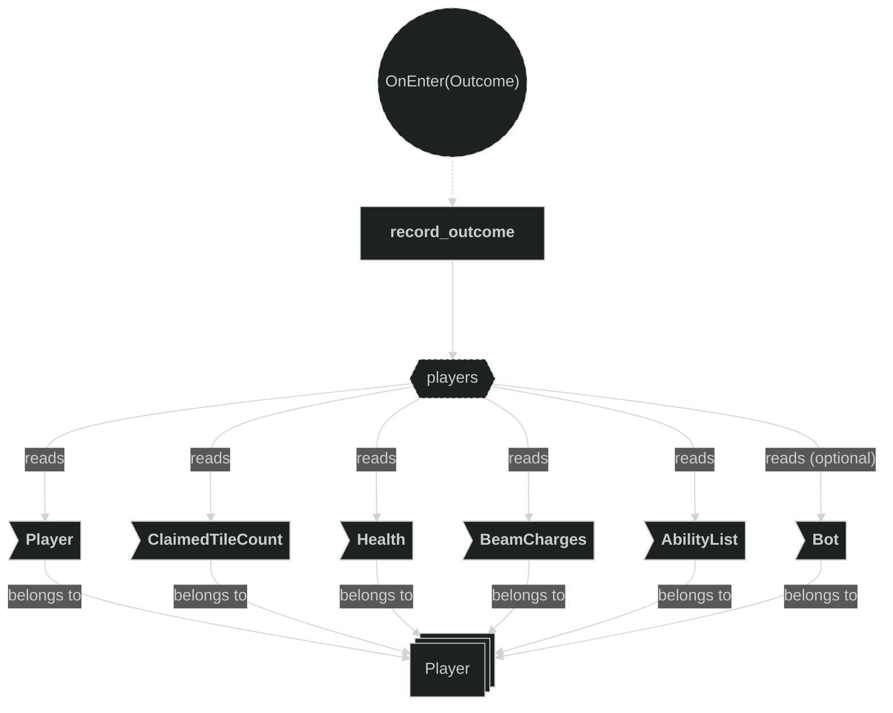

### Write OutcomeRecord line

Used in the following systems:
- **record_outcome**: appends one JSON line summarizing the round, then flushes the writer

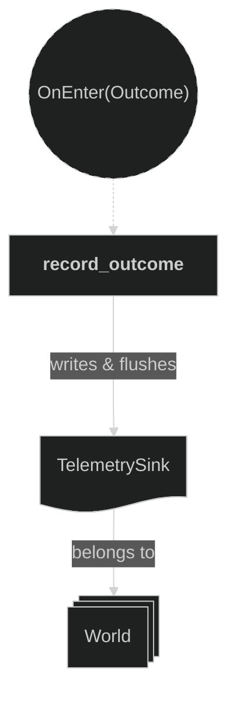
