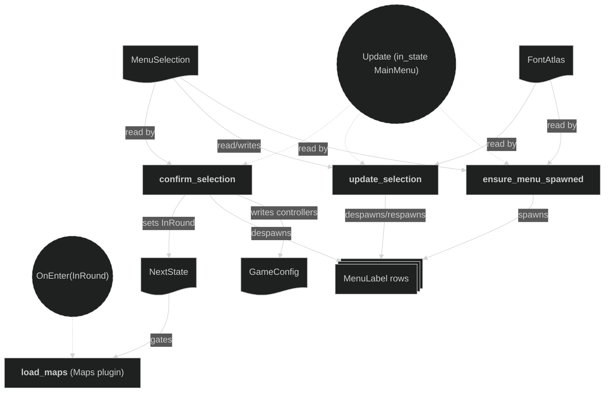

# Menu Plugin

The pre-round main menu. It lets players pick a matchup — which seats are bot-controlled — before any map loads, gating everything downstream of map creation (player/tile initialization, the round state machine) behind confirmation.

It owns `AppState`, the app's top-level lifecycle state, sitting above `RoundPhase` (owned by the Round plugin): `MainMenu` is the default; `InRound` is entered once a matchup is confirmed and never left. The Maps plugin's `load_maps` runs `OnEnter(AppState::InRound)` rather than at `Startup`, so the level and HUD maps — and everything that reacts to their `MapCreated` event — do not spawn until the menu confirms a matchup.

Menu rows are rendered with the Text plugin's `spawn_label` onto the overlay camera (owned by the Camera plugin), the same machinery the round intro/outcome banners use. It is registered after the Camera and Text plugins in `AppPlugin` (so `FontAtlas` and `OVERLAY_RENDER_LAYER` exist) and before the Input plugin (so a confirmed matchup is applied before player input is attached).

## Concepts

- `AppState` (`src/plugins/menu.rs`) — a `#[derive(States)]` enum with variants `MainMenu` (default) and `InRound`. Registered with `init_state`. All three menu systems are gated `run_if(in_state(AppState::MainMenu))`; the Maps plugin's `load_maps` is gated `OnEnter(AppState::InRound)`.
- `MatchupChoice` — one of the three selectable matchups: `PlayerVsPlayer`, `PlayerVsBot`, `BotVsPlayer`. `controllers()` maps each to a `(player1_bot, player2_bot)` pair.
- `MENU_ENTRIES` — the fixed, ordered `[(MatchupChoice, &str); 3]` list backing the menu rows and their display strings ("1P VS 2P", "1P VS BOT", "BOT VS 2P").
- `MenuSelection` — a **resource** wrapping the index (`usize`) of the currently-highlighted row, defaulting to 0.
- `MenuLabel` — a marker **component** tagging every spawned menu row entity, used to bulk-despawn the rows and detect whether they already exist.

## Plugin workflow

- Update phase (chained, `run_if(in_state(AppState::MainMenu))`)
    - Ensure Menu Spawned:
        - Reads: `FontAtlas` (optional — no-ops until the Text plugin's `Startup` system has run), `MenuSelection`, entities `With<MenuLabel>`
        - Writes: spawns the three menu row labels the first time none exist
    - Update Selection:
        - Reads: `ButtonInput<KeyCode>` (`KeyW`/`ArrowUp`, `KeyS`/`ArrowDown`), `FontAtlas`, `MenuSelection`, entities `With<MenuLabel>`
        - Writes: moves `MenuSelection` up/down (clamped to the entry range, no wraparound); on change, despawns and respawns the rows
    - Confirm Selection:
        - Reads: `ButtonInput<KeyCode>` (`KeyQ` or `Slash`), `MenuSelection`, entities `With<MenuLabel>`
        - Writes: applies the selected `MatchupChoice::controllers()` into `GameConfig.controllers` (`player1_bot`, `player2_bot`), despawns the menu rows, sets `NextState<AppState>` to `InRound`

## Plugin Systems

### Ensure Menu Spawned

Runs every frame while `in_state(AppState::MainMenu)`, but only does anything once. Takes `FontAtlas` as `Option` and returns early until the Text plugin's `Startup` system has loaded it — deliberately not an `OnEnter(AppState::MainMenu)` system, since that schedule fires before `Startup` completes and `FontAtlas` wouldn't exist yet. Once available, if no `MenuLabel` entities exist it spawns one label per `MENU_ENTRIES` row via `spawn_label`, stacked vertically at y-offsets `+24.0, 0.0, -24.0`, onto `RenderLayers::layer(OVERLAY_RENDER_LAYER)`. The currently-selected row is prefixed with `"!"`, every other row with a leading space, so the text stays aligned either way (the font atlas has no dedicated cursor glyph).

### Update Selection

Reads `KeyW`/`ArrowUp` (up) and `KeyS`/`ArrowDown` (down) — either key scheme moves the cursor. Clamps `MenuSelection` to the `MENU_ENTRIES` index range with no wraparound. On any change it despawns all `MenuLabel` entities and respawns the rows with the new selection highlighted.

### Confirm Selection

Reads `KeyQ` or `Slash` — either confirms. On press, looks up the selected `MatchupChoice`'s `controllers()` pair and writes it into `GameConfig.controllers.player1_bot`/`player2_bot`, despawns the menu rows, and sets `NextState<AppState>` to `InRound`, unblocking the Maps plugin's `load_maps` and the rest of the round-start chain.

## Components, Resources and Messages CRUD

Definitions and where they are used:
- `AppState` — `#[derive(States)]` (this plugin), registered via `init_state`; read by this plugin's `run_if` gates and by the Maps plugin's `load_maps`'s `OnEnter(InRound)` gate.
- `MenuSelection` — `#[derive(Resource, Default)]` (this plugin), read/written by `update_selection`, read by `ensure_menu_spawned` and `confirm_selection`.
- `MenuLabel` — `#[derive(Component)]` (this plugin), inserted by `ensure_menu_spawned`/`update_selection` on each spawned row, queried and despawned by `update_selection` and `confirm_selection`.
- `GameConfig.controllers` — owned by the Config plugin; `player1_bot`/`player2_bot` are overwritten by `confirm_selection` from the chosen `MatchupChoice`, then read by the Input plugin's `attach_players_actions` when players spawn.

