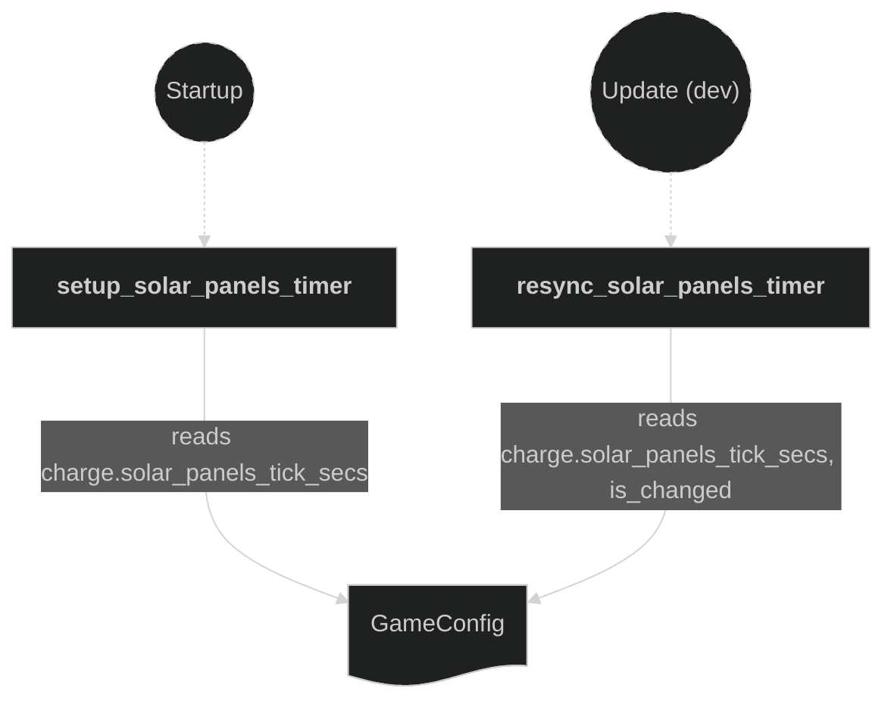
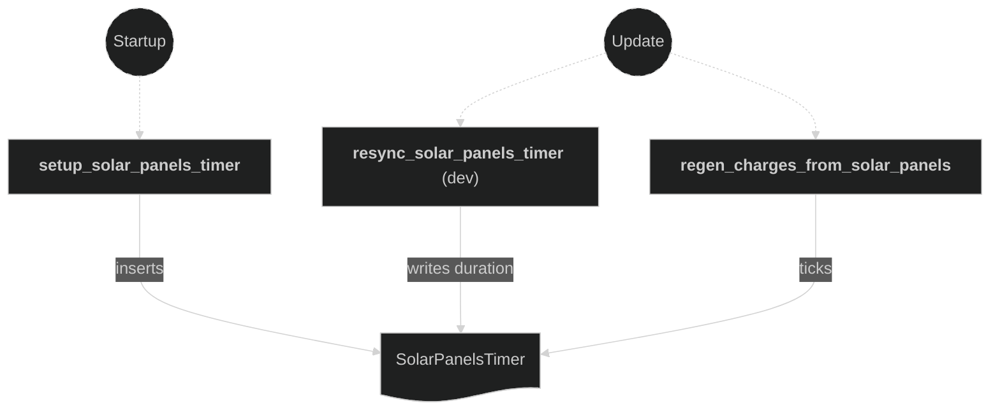
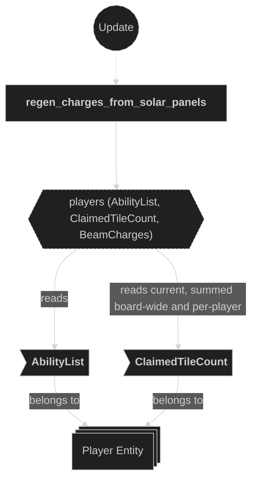
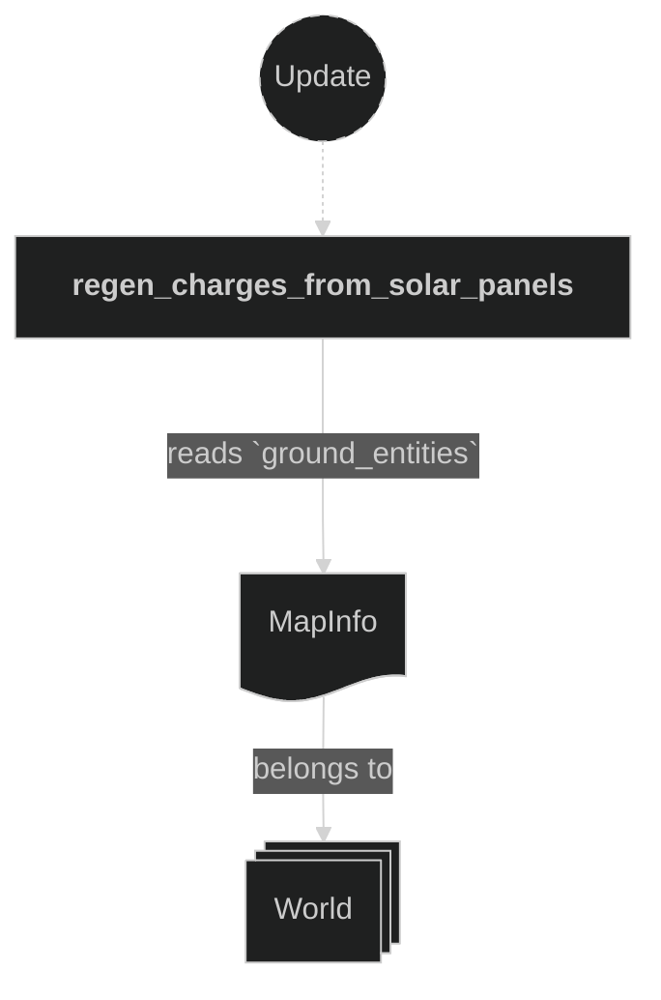
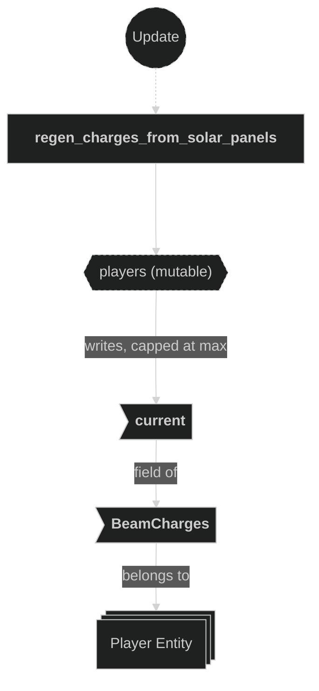

# Charge Plugin

Owns `BeamCharges` regen/refund/cost-policy resolvers — the home for any beam ability that modifies a player's charge pool without being a beam-behavior or tile-ownership effect. Today that's just Solar Panels' regen tick; the abilities plugin doc (`backlog/docs/doc-12 - 010-Abilities-plugin.md`) and DECKBUILDING.md's charge-economy roster (§3) queue several more (Salvage, Tithe, Frugal Frontier, Battery Cap) that will land here as their stages ship.

Registered in `AppPlugin` between the Claim and Damage plugins, so its regen tick reads each player's `ClaimedTileCount` after the Claim plugin has written it that frame.

## Plugin workflow

- Startup phase
    - Setup Solar Panels Timer:
        - Reads:
            - `GameConfig` resource (`config.charge.solar_panels_tick_secs`)
        - Writes:
            - Inserts the `SolarPanelsTimer` resource
- Update phase (dev builds only, `#[cfg(feature = "dev")]`)
    - Resync Solar Panels Timer:
        - Reads:
            - `GameConfig` resource, gated on `is_changed()` (hot-reload)
        - Writes:
            - `SolarPanelsTimer`'s duration
- Update phase (gated `run_if(in_state(RoundPhase::Playing))`)
    - Regen Charges From Solar Panels:
        - Reads:
            - `Time` resource (to tick `SolarPanelsTimer`)
            - `GameConfig` resource (`config.charge.solar_panels_tiles_per_charge`)
            - `MapInfo` (`ground_entities` for the total tile count)
            - Every player's `ClaimedTileCount` (to sum the board's total claimed tiles), and each player's `AbilityList` (gated on `AbilityDescriptor::SolarPanels`)
        - Writes:
            - Each qualifying player's `BeamCharges::current` (capped at `BeamCharges::max` **and** at the board's remaining unclaimed-tile count, so regen can't bank charges beyond what's left to claim)
            - Emits a `ChargeRegen` message (`owner`, `amount`) per player whose `current` actually moved — `amount` is the applied delta, which may be less than the raw computed gain once the unclaimed-tile cap bites

## Plugin Systems

### Setup Solar Panels Timer

Runs once at `Startup`. Inserts `SolarPanelsTimer`, a repeating `Timer` seeded from `config.charge.solar_panels_tick_secs`. Mirrors the Beam plugin's `setup_beam_step_timer` pattern.

### Resync Solar Panels Timer

Dev-only (`#[cfg(feature = "dev")]`), same hot-reload pattern as the Beam plugin's `resync_beam_step_timer`: when `GameConfig` changes (the asset watcher picks up an edit to `assets/game_config.ron`), rewrites `SolarPanelsTimer`'s duration to match the current `solar_panels_tick_secs` without resetting its elapsed progress.

### Regen Charges From Solar Panels

Ticks `SolarPanelsTimer`; no-ops until it finishes. On a finished tick, first sums `ClaimedTileCount::current` across every player (regardless of ability loadout) and subtracts that from `MapInfo::ground_entities.len()` to get the board's remaining unclaimed-tile count. It then iterates every player with an `AbilityList`, `ClaimedTileCount`, and `BeamCharges`, skipping any player whose `AbilityList` doesn't contain `AbilityDescriptor::SolarPanels`. For each remaining player, computes `gained = tile_count.current / config.charge.solar_panels_tiles_per_charge` (integer division — regen scales in whole-charge steps per tile-count bracket, not continuously), skips if `gained == 0`, otherwise sets `BeamCharges::current` to `(current + gained).min(max).min(unclaimed_tiles)` and, if that actually moved the value, emits a `ChargeRegen { owner, amount }` message where `amount` is the real applied delta (`new_current - old_current`), not the raw `gained` — the two only differ once the unclaimed-tile cap trims a regen tick. The unclaimed-tile cap exists so a wide-board Solar Panels stack can't keep banking charges it can never spend on a fresh claim once the board's mostly settled; without it, a late-game charge stat could exceed the number of tiles actually left to claim. `ChargeRegen` has no consumers yet — it's the ability-system hook for anything that reacts to a regen event (e.g. a future HUD pulse or an ability that piggybacks on regen ticks), same role `TileClaimed`/`ChargeSpent` play for their respective triggers.

## Components, Resources and Messages CRUD

### Read GameConfig (timer setup/resync)

Used in the following systems:
- **setup_solar_panels_timer**: seeds `SolarPanelsTimer`'s duration from `config.charge.solar_panels_tick_secs`
- **resync_solar_panels_timer** (dev-only): rewrites the duration on config hot-reload

### Write SolarPanelsTimer

Used in the following systems:
- **setup_solar_panels_timer**: inserts the resource at `Startup`
- **resync_solar_panels_timer** (dev-only): rewrites its duration on config hot-reload
- **regen_charges_from_solar_panels**: ticks it every frame

### Read AbilityList and ClaimedTileCount (regen)

Used in the following systems:
- **regen_charges_from_solar_panels**: sums every player's `ClaimedTileCount::current` (board-wide, not just qualifying players) to compute the unclaimed-tile cap; gates the regen on `AbilityDescriptor::SolarPanels`; scales `gained` by the qualifying player's own `ClaimedTileCount::current`

### Read MapInfo (regen cap)

Used in the following systems:
- **regen_charges_from_solar_panels**: reads `MapInfo::ground_entities` for the total tile count, combined with the board-wide claimed-tile sum above to derive the unclaimed-tile regen cap

### Write BeamCharges (regen)

Used in the following systems:
- **regen_charges_from_solar_panels**: increments `current`, capped at both `max` and the board's remaining unclaimed-tile count, for each qualifying player on a finished tick

### Write ChargeRegen messages

Used in the following systems:
- **regen_charges_from_solar_panels**: emits one message per player whose `BeamCharges::current` actually moved, `amount` set to the applied delta (post unclaimed-tile cap) (no consumers yet)

