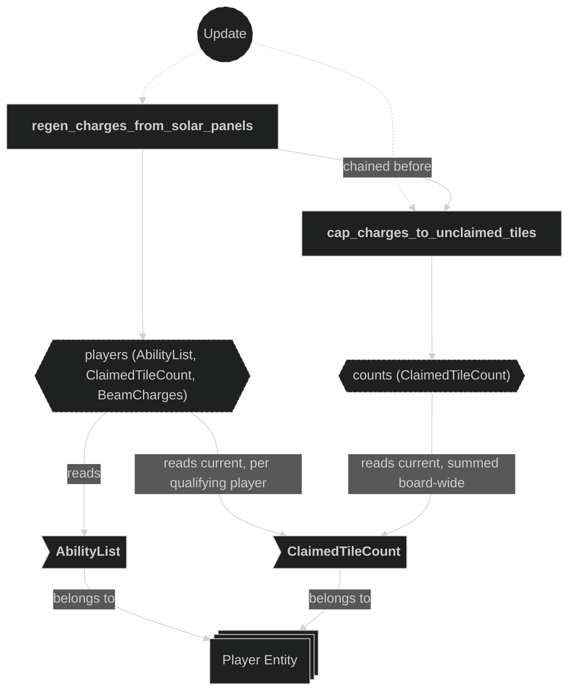
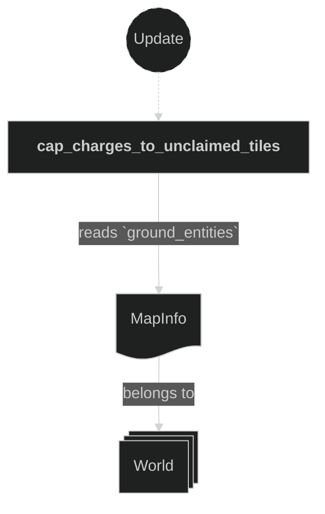
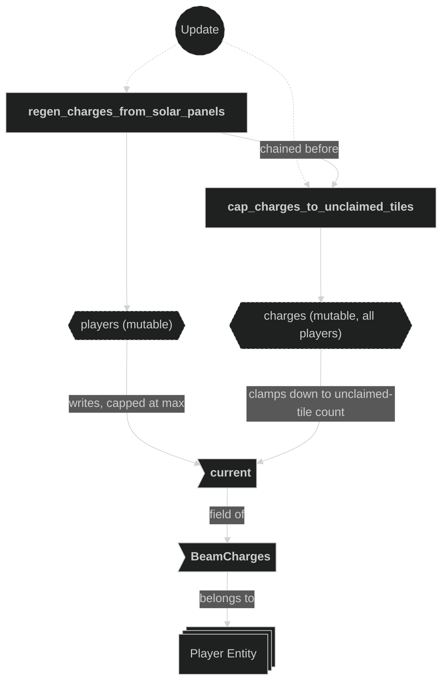
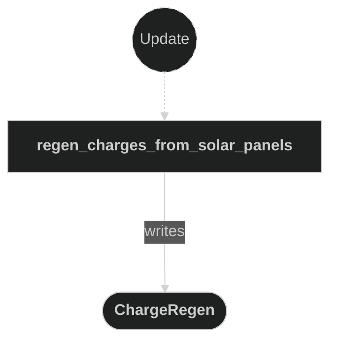

# Charge Plugin

Owns `BeamCharges` regen/refund/cost-policy resolvers — home for any beam ability that adjusts a player's charge pool without being a beam-behavior or tile-ownership effect. Today that's just Solar Panels' regen tick.

Registered in `AppPlugin` between Claim and Damage. The chained `(regen_charges_from_solar_panels, cap_charges_to_unclaimed_tiles)` pair runs in `GameplaySet::Economy`, which the shared `GameplaySet` chain (`schedule.rs`) orders after `GameplaySet::Claim`, guaranteeing both read each player's `ClaimedTileCount` after Claim has written it that frame — Bevy does not guarantee this from plugin declaration order alone when systems have a data-access conflict without explicit ordering.

## Plugin workflow

- Startup phase
    - Setup Solar Panels Timer:
        - Reads:
            - `GameConfig` resource (`config.charge.solar_panels_tick_secs`)
        - Writes:
            - Inserts the `SolarPanelsTimer` resource
- Update phase (dev builds only, `#[cfg(feature = "dev")]`)
    - Resync Solar Panels Timer:
        - Reads:
            - `GameConfig` resource, gated on `is_changed()` (hot-reload)
        - Writes:
            - `SolarPanelsTimer`'s duration
- Update phase (gated `run_if(in_state(RoundPhase::Playing))`, chained in this order)
    - Regen Charges From Solar Panels:
        - Reads:
            - `Time` resource (to tick `SolarPanelsTimer`)
            - `GameConfig` resource (`config.charge.solar_panels_tiles_per_charge`)
            - Every player's `ClaimedTileCount`, and each player's `AbilityList` (gated on `AbilityDescriptor::SolarPanels`)
        - Writes:
            - Each qualifying player's `BeamCharges::current` (capped at `BeamCharges::max`)
            - Emits a `ChargeRegen` message (`owner`, `amount`) per player whose `current` actually moved
    - Cap Charges To Unclaimed Tiles:
        - Reads:
            - `MapInfo` (`ground_entities` for the total tile count)
            - Every player's `ClaimedTileCount` (to sum the board's total claimed tiles, unfiltered by ability)
        - Writes:
            - Every player's `BeamCharges::current`, clamped down (never up) to the board's remaining unclaimed-tile count — this is a standing invariant enforced for all players every frame, not a regen-time detail for Solar Panels owners. No message emitted; HUD reactivity comes from `Changed<BeamCharges>`

## Plugin Systems

### Setup Solar Panels Timer

Runs once at `Startup`. Inserts `SolarPanelsTimer`, a repeating `Timer` seeded from `config.charge.solar_panels_tick_secs`. Mirrors the Beam plugin's `setup_beam_step_timer` pattern.

### Resync Solar Panels Timer

Dev-only (`#[cfg(feature = "dev")]`), same hot-reload pattern as the Beam plugin's `resync_beam_step_timer`: when `GameConfig` changes (the asset watcher picks up an edit to `assets/game_config.ron`), rewrites `SolarPanelsTimer`'s duration to match the current `solar_panels_tick_secs` without resetting its elapsed progress.

### Regen Charges From Solar Panels

Ticks `SolarPanelsTimer`; no-ops until it finishes. On a finished tick, iterates every player with `AbilityList`, `ClaimedTileCount`, and `BeamCharges`, skipping any without `AbilityDescriptor::SolarPanels`. For each remaining player, computes `gained = tile_count.current / config.charge.solar_panels_tiles_per_charge` (integer division — regen scales in whole-charge steps per tile-count bracket), skips if `gained == 0`, otherwise sets `BeamCharges::current` to `(current + gained).min(max)` and, if that moved the value, emits `ChargeRegen { owner, amount }` with the applied delta. `ChargeRegen` has no consumers yet — the ability-system hook for anything reacting to a regen event, same role `TileClaimed`/`ChargeSpent` play for their triggers. This system does not enforce the unclaimed-tile ceiling; that's Cap Charges To Unclaimed Tiles, chained immediately after — so a tick can emit a `ChargeRegen` whose gain the clamp erases moments later, though the message still reports a true regen event.

### Cap Charges To Unclaimed Tiles

Runs every frame (not timer-gated), for every player regardless of ability loadout. A charge is only useful up to a claim on a tile nobody owns yet, so the board's remaining unclaimed-tile count (`MapInfo::ground_entities.len()` minus the board-wide sum of `ClaimedTileCount::current`) is a hard ceiling on every player's `BeamCharges::current`: any player whose `current` exceeds it is clamped down; `current` is never raised here. Within a round, claimed tiles never revert (they only gain an owner — see the Claim plugin — until `reset_round`), so a down-only clamp is safe. No message is emitted — a cap isn't a regen event, and the HUD already reacts to `Changed<BeamCharges>`.

## Components, Resources and Messages CRUD

### Read GameConfig (timer setup/resync)

Used in the following systems:
- **setup_solar_panels_timer**: seeds `SolarPanelsTimer`'s duration from `config.charge.solar_panels_tick_secs`
- **resync_solar_panels_timer** (dev-only): rewrites the duration on config hot-reload

### Write SolarPanelsTimer

Used in the following systems:
- **setup_solar_panels_timer**: inserts the resource at `Startup`
- **resync_solar_panels_timer** (dev-only): rewrites its duration on config hot-reload
- **regen_charges_from_solar_panels**: ticks it every frame

### Read AbilityList and ClaimedTileCount (regen)

Used in the following systems:
- **regen_charges_from_solar_panels**: gates the regen on `AbilityDescriptor::SolarPanels`; scales `gained` by the qualifying player's own `ClaimedTileCount::current`
- **cap_charges_to_unclaimed_tiles**: sums every player's `ClaimedTileCount::current` board-wide (unfiltered by ability) to derive the unclaimed-tile count

### Read MapInfo (unclaimed-tile cap)

Used in the following systems:
- **cap_charges_to_unclaimed_tiles**: reads `MapInfo::ground_entities` for the total tile count, combined with the board-wide claimed-tile sum above to derive the unclaimed-tile count that every player's charges are clamped to

### Write BeamCharges (regen and cap)

Used in the following systems:
- **regen_charges_from_solar_panels**: increments `current`, capped at `max`, for each qualifying player on a finished tick
- **cap_charges_to_unclaimed_tiles**: clamps `current` down (never up) to the board's remaining unclaimed-tile count, for every player, every frame — the standing invariant that charges can never exceed what's left to claim

### Write ChargeRegen messages

Used in the following systems:
- **regen_charges_from_solar_panels**: emits one message per player whose `BeamCharges::current` actually moved, `amount` set to the applied delta (no consumers yet); `cap_charges_to_unclaimed_tiles` emits nothing — a clamp isn't a regen event

