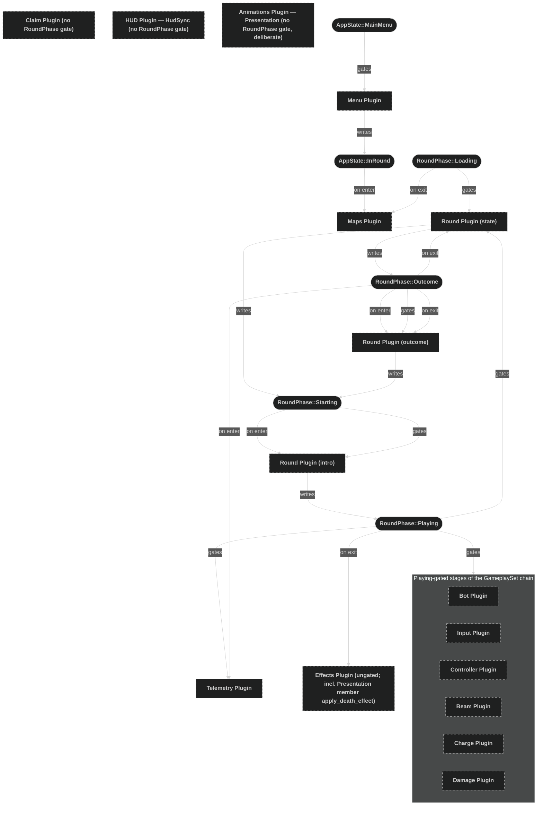

# Plugin State Relationships

This document summarises how the game's plugins are coupled through Bevy's state-machine gating, as distinct from the message-passing coupling described in `doc-9 - 000-Plugin-message-relationships.md`. Where messages are an explicit write/read contract between plugins, state gating is implicit: a system's `run_if(in_state(...))` or `OnEnter`/`OnExit` schedule attaches it to a state machine owned by a different plugin, and only a `NextState<T>::set` call actually drives a transition.

There are two state machines in this codebase, and three distinct relationship types to either of them:

- **Gated by** (`run_if(in_state(...))`) — the system is skipped entirely while the game is not in that state.
- **Hooked to enter/exit** (`OnEnter`/`OnExit`) — the system runs exactly once, at the instant of the transition.
- **Writes** (`NextState<T>::set`) — the system decides when the whole app moves to a different state. For either machine, only a small number of systems, spread across few files, are allowed to do this.

## AppState

`AppState` (`src/plugins/menu.rs`) is the app's top-level lifecycle: `MainMenu` (default) and `InRound`. It has exactly one directed edge, `MainMenu → InRound`, and nothing ever transitions back.

- **Gated by**: the Menu plugin's three chained systems (`ensure_menu_spawned`, `update_selection`, `confirm_selection`) all run `run_if(in_state(AppState::MainMenu))`.
- **Hooked to enter/exit**: the Maps plugin's `load_maps` runs `OnEnter(AppState::InRound)`.
- **Writes**: `confirm_selection` (Menu plugin) is the only system that calls `NextState<AppState>::set(AppState::InRound)`, when a matchup is confirmed with Q or `/`.

## RoundPhase

`RoundPhase` (`src/plugins/round/state.rs`) is the round lifecycle: `Loading` (default) → `Starting` → `Playing` → `Outcome` → back to `Starting`. Unlike `AppState`, its writers are spread across three files rather than one.

### The causal handoff between the two machines

The two machines are not independent: `RoundPhase`'s first transition is downstream of `AppState`'s only transition, relayed through a Tiled message rather than a direct state read.

1. `confirm_selection` (Menu plugin) sets `AppState::InRound`.
2. `OnEnter(AppState::InRound)` runs `load_maps` (Maps plugin), which spawns the level map (`CurrentLevel`) and the HUD map (`HudMap`).
3. Each map fires a `TiledEvent<MapCreated>` once loaded. `start_round_on_map_created` (Round plugin, gated `run_if(in_state(RoundPhase::Loading))`) reads both, latching `level_ready`/`hud_ready` in two `Local<bool>`s, and only calls `next_phase.set(RoundPhase::Starting)` once both maps have reported in.
4. `OnExit(RoundPhase::Loading)` then runs the Maps plugin's four bootstrap systems (`initialize_map_info`, then `initialize_players`/`initialize_claimed_tiles`/`initialize_hud_bars`, chained), which need `MapInfo` populated and both maps' entities present.

So `AppState` gates map loading; `RoundPhase::Loading`'s exit gates world bootstrap on top of that, and the dependency between the two machines is a message, not a shared state read.

### Writers (three files)

- `round/state.rs`: `start_round_on_map_created` writes `Loading → Starting` (see above). The shared `conclude_round` helper writes `→ Outcome`, called from three systems in the same file — `resolve_kill`, `resolve_timeout`, `resolve_charge_exhaustion` — each of which independently detects a round-ending condition (a death, the countdown reaching zero, or every player exhausting their charges with no beam in flight) and defers to `conclude_round` to record the result and transition.
- `round/intro.rs`: `advance_intro_countdown` writes `Starting → Playing`, once the "3·2·1·GO!" intro countdown reaches zero.
- `round/outcome.rs`: `advance_outcome` writes `Outcome → Starting`, once the win banner's linger timer elapses.

`start_round_on_map_created` is not in any `GameplaySet`; only the `(tick_countdown, resolve_kill, resolve_timeout, resolve_charge_exhaustion)` tuple in `round/state.rs` is tagged `GameplaySet::RoundResolution`. So the Round plugin's state-writing systems sit partly inside and partly outside the `schedule.rs` pipeline chain — the ones that fire before or between rounds (map-created latch, countdown start) are outside it, the ones that fire during live play (round resolution) are inside it.

### Gated by `run_if(in_state(RoundPhase::Playing))`

Every stage of the gameplay pipeline declared in `schedule.rs`'s `GameplaySet` chain gates on `Playing`, with three exceptions (see Gaps below):

- `GameplaySet::BotThink` — `bot.rs`'s `bot_think`
- `GameplaySet::Input` — `inputs.rs`'s `handle_characters_input`, `tick_turning`
- `GameplaySet::Movement` — `controller.rs`'s `move_characters`
- `GameplaySet::Beam` — `beam.rs`'s `spawn_beam`, `beam_step`
- `GameplaySet::Economy` — `charge.rs`'s `regen_charges_from_solar_panels`, `cap_charges_to_unclaimed_tiles`
- `GameplaySet::Damage` — `damage.rs`'s `apply_owned_tile_entry_damage`, `apply_owned_tile_damage`, `apply_beam_damage`, `apply_collision_damage`
- `GameplaySet::RoundResolution` — `round/state.rs`'s `tick_countdown`, `resolve_kill`, `resolve_timeout`, `resolve_charge_exhaustion`

Outside the `GameplaySet` chain, `telemetry.rs`'s `record_actions` and `record_decisions` also gate on `run_if(in_state(RoundPhase::Playing))`, stacked with a second `run_if(telemetry_enabled)` config-resource gate — the only place in the codebase a state gate and a config gate are stacked on the same systems, so these can be inactive even while `Playing`.

Three other systems gate on phases other than `Playing`:

- `round/state.rs`'s `start_round_on_map_created` gates on `run_if(in_state(RoundPhase::Loading))`.
- `round/intro.rs`'s `advance_intro_countdown` gates on `run_if(in_state(RoundPhase::Starting))`.
- `round/outcome.rs`'s `advance_outcome` gates on `run_if(in_state(RoundPhase::Outcome))`.

### Hooked to enter/exit

- `OnEnter(RoundPhase::Starting)`: `round/intro.rs`'s `begin_intro_countdown` spawns the first countdown number.
- `OnEnter(RoundPhase::Outcome)`: `round/outcome.rs`'s `show_outcome_banner` spawns the win banner; `telemetry.rs`'s `record_outcome` (also gated `telemetry_enabled`) writes the round's outcome record.
- `OnExit(RoundPhase::Outcome)`: `round/state.rs`'s `reset_round` wipes tile ownership, health, charges, and positions back to spawn; `round/outcome.rs`'s `despawn_outcome_banner` removes the win banner.
- `OnExit(RoundPhase::Loading)`: the Maps plugin's bootstrap chain (see above).
- `OnExit(RoundPhase::Playing)`: `effects.rs`'s `clear_illumination_drivers` clears any beam-illumination tint still applied to a tile.

## Gaps and asymmetries

- **`claim.rs`'s `claim_tile` has no `RoundPhase` gate at all**, while every other authoritative-state stage in the `GameplaySet` pipeline chain (`BotThink`, `Input`, `Movement`, `Beam`, `Economy`, `Damage`, `RoundResolution`) gates on `Playing` — `GameplaySet::Presentation` is a separate, deliberate exception, described below. Its only input is a `MessageReader<BeamResolved>`, so it drains and applies whatever is queued regardless of phase — meaning `ClaimedTile::owner` and `ClaimedTileCount` writes are not phase-synchronized with the `resolve_*` systems in `round/state.rs` that read tile counts to decide a round's winner.
- **`hud.rs`'s entire `GameplaySet::HudSync` stage has no `RoundPhase` gate either** — none of `animate_hp`, `animate_damage_bar`, `animate_beam_charges`, `animate_claimed_tiles`, `animate_countdown`, `animate_territory_bar`, or `animate_charges_bar` check the phase, so HUD bars and digit counters keep animating through `Loading`, `Starting`, and `Outcome`, not just `Playing`.
- **`GameplaySet::Presentation`** (`animations.rs`'s `animate_claimed_tile`, `animate_unclaimed_tile`, `tick_unclaim_reverts`, tagged together; `effects.rs`'s `apply_death_effect`, tagged separately) **also has no `RoundPhase` gate**, but unlike the two gaps above this is deliberate, not an oversight. The discriminator: `claim_tile` writes gameplay-authoritative state (`ClaimedTile::owner`, `ClaimedTileCount`) that feeds the win-condition calculus `Playing`-gated round resolvers depend on; `resolve_kill` instead reads the `DamageableDied` message directly rather than querying `apply_death_effect`'s `IsDead` write, so no `Presentation` member's output ever crosses back into round-resolution logic the way `claim_tile`'s does. Two of the four have a load-bearing reason to stay ungated: `round/state.rs`'s `reset_round` runs on `OnExit(Outcome)` — i.e. mid-transition into `Starting` — and mutates `ClaimedTile::owner` on every tile at once; it is `animate_unclaimed_tile` and `tick_unclaim_reverts` continuing to run during `Starting` that plays that mass write out as the staggered radial revert-to-neutral cascade while the intro countdown runs. Gated to `Playing`, the `UnclaimRevert` timers would simply sit un-ticked through `Starting` — not lose the change, since `Changed<ClaimedTile>` would still be detected the moment `Playing` resumed, but delay the cascade so the board kept showing the previous round's colors through the whole intro instead of clearing during it. The other two lean on the same continuity reasoning as `effects.rs` below: `apply_death_effect` and `animate_claimed_tile` react to `DamageableDied`/`BeamResolved` messages that can be written on the very last `Playing` frame before a kill or a final claim ends the round, and staying ungated lets them still catch and animate that trailing message the frame after the phase has already flipped to `Outcome`.
- The `claim_tile` and `HudSync` gaps are not the same kind of thing as the deliberately-ungated systems elsewhere:
  - `round/state.rs`'s `start_countdown` is ungated by design: it (re)inserts the `Countdown` resource on every `MapCreated` message so the HUD shows the starting value during the intro, while the separate `tick_countdown` system — the one that actually decrements it — is the one gated on `Playing`.
  - `effects.rs` is almost entirely ungated (only `clear_illumination_drivers` is hooked, to `OnExit(Playing)`) — consistent with tweens (bounce, knockback, death animation) needing to keep playing across the `Playing → Outcome` boundary, most visibly the death bounce that plays out after a kill ends the round. `apply_death_effect` is additionally tagged `GameplaySet::Presentation`, but only for its position relative to `Damage`/`RoundResolution` in the chain — the tag carries no phase gate, so it remains as ungated as the rest of this file.
  - `round/intro.rs`'s `despawn_go_banner` is ungated by explicit design: it belongs to the `Starting`-phase intro banner, but `advance_intro_countdown` sets `Playing` in the same frame the "GO!" banner's scale-up tween starts, so the banner must keep animating (and this system must keep running) after the phase has already changed to `Playing`.
- `maps.rs` is the only plugin coupled to both state machines from opposite layers: `load_maps` hooks `OnEnter(AppState::InRound)`, while its bootstrap chain hooks `OnExit(RoundPhase::Loading)`.
- `round/state.rs` both owns `RoundPhase` (defines it, writes 2 of its 4 transitions) and gates its own systems on it — expected for the owning file. But its two sibling submodules, `round/intro.rs` and `round/outcome.rs`, each also both gate their own presentation systems on, and write, one of the remaining transitions — so no single file in the `round` feature folder is purely "the reader" or purely "the writer" of `RoundPhase`; that responsibility is split three ways across the same feature.

