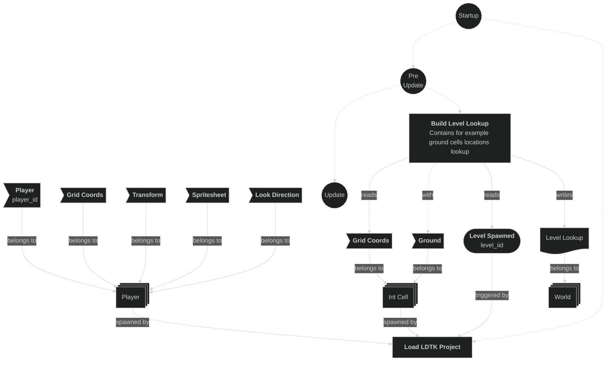

```mermaid
---
config:
  theme: dark
---

flowchart TD

%% dash for system groups
classDef system-group stroke-dasharray: 5 5

%%%%%%%%%%%%%%%%%%%%%%%
%%     Resources     %%
%%%%%%%%%%%%%%%%%%%%%%%

level_lookup_res@{ shape: doc, label: "Level Lookup" } --> |belongs to| world


%%%%%%%%%%%%%%%%%%%%%%%
%%      Messages     %%
%%%%%%%%%%%%%%%%%%%%%%%

level_spawned_message(["`**Level Spawned**<br>level_iid`"])  ---> |triggered by| load_ldtk_project

%%%%%%%%%%%%%%%%%%%%%%%%%%%%
%%  Entities & Components %%
%%%%%%%%%%%%%%%%%%%%%%%%%%%%

world@{ shape: st-rect, label: "World" }

player_entity@{ shape: st-rect, label: "Player" } 
pe_player_component>"`**Player**<br>player_id`"] ---> |belongs to| player_entity
pe_grid_coords_component>"`**Grid Coords**`"] ---> |belongs to| player_entity
pe_transform_component>"`**Transform**`"] ---> |belongs to| player_entity
pe_sprite_component>"`**Spritesheet**`"] ---> |belongs to| player_entity
pe_look_direction_component>"`**Look Direction**`"] ---> |belongs to| player_entity
player_entity --> |spawned by| load_ldtk_project


%% Int Cell Entity
ground_cell_entity@{ shape: st-rect, label: "Int Cell" }
gce_ground_component>"`**Ground**`"] --> |belongs to| ground_cell_entity
gce_grid_coords_component>"`**Grid Coords**`"] --> |belongs to| ground_cell_entity 
ground_cell_entity --> |spawned by| load_ldtk_project 


%%%%%%%%%%%%%%%%%%%%%%%
%%      Systems      %%
%%%%%%%%%%%%%%%%%%%%%%%


startup((Startup)):::system-group -..-> preupdate(("`Pre<br>Update`")):::system-group -..-> update(("`Update`")):::system-group

load_ldtk_project["`**Load LDTK Project**`"]
build_level_lookup["`**Build Level Lookup**<br>Contains for example ground cells locations lookup`"]

startup -.-> load_ldtk_project
preupdate -.-> build_level_lookup

build_level_lookup ---> |reads| gce_grid_coords_component
build_level_lookup -..-> |with| gce_ground_component
build_level_lookup ---> |reads| level_spawned_message 
build_level_lookup ---> |writes| level_lookup_res
```
