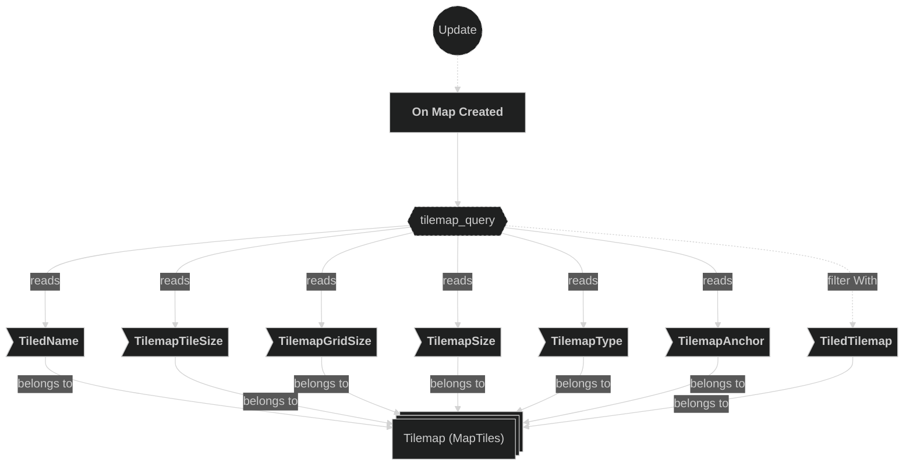
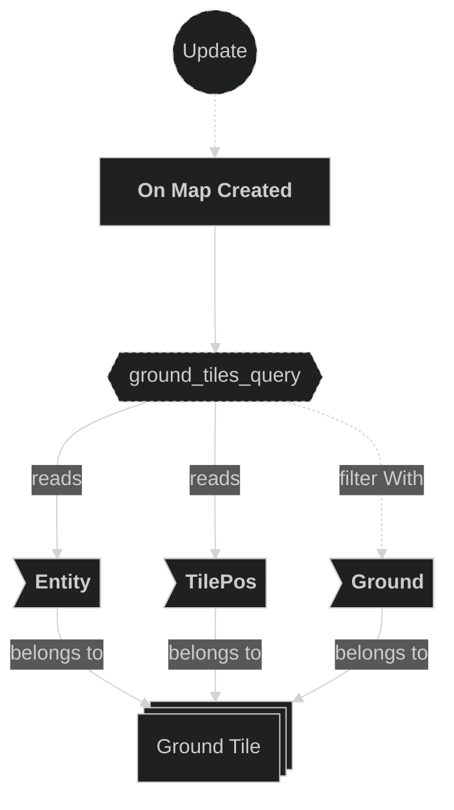
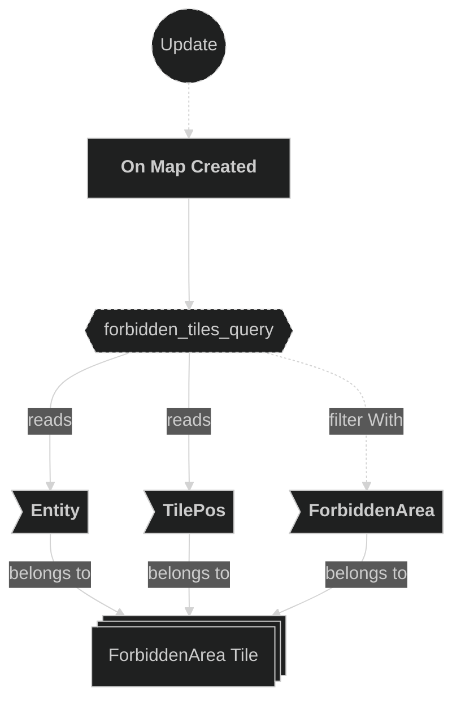
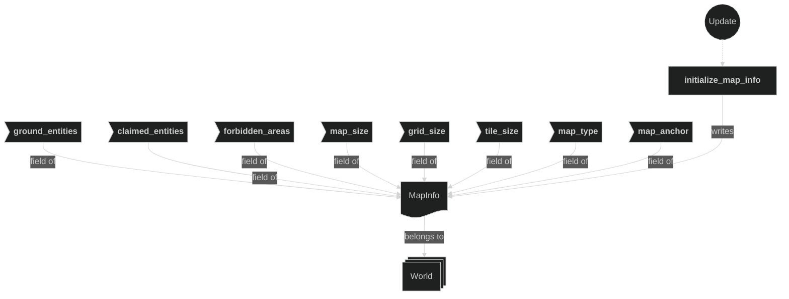
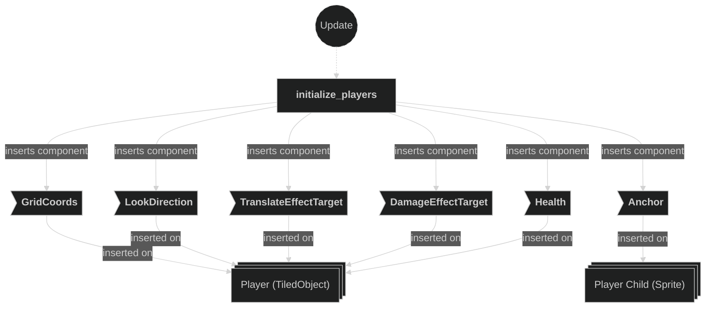
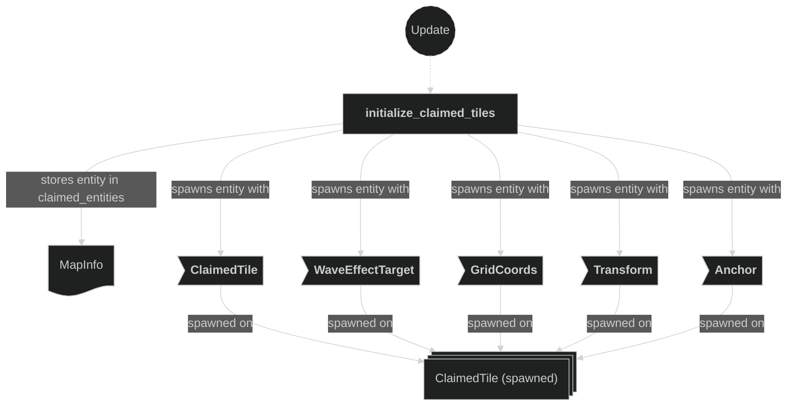
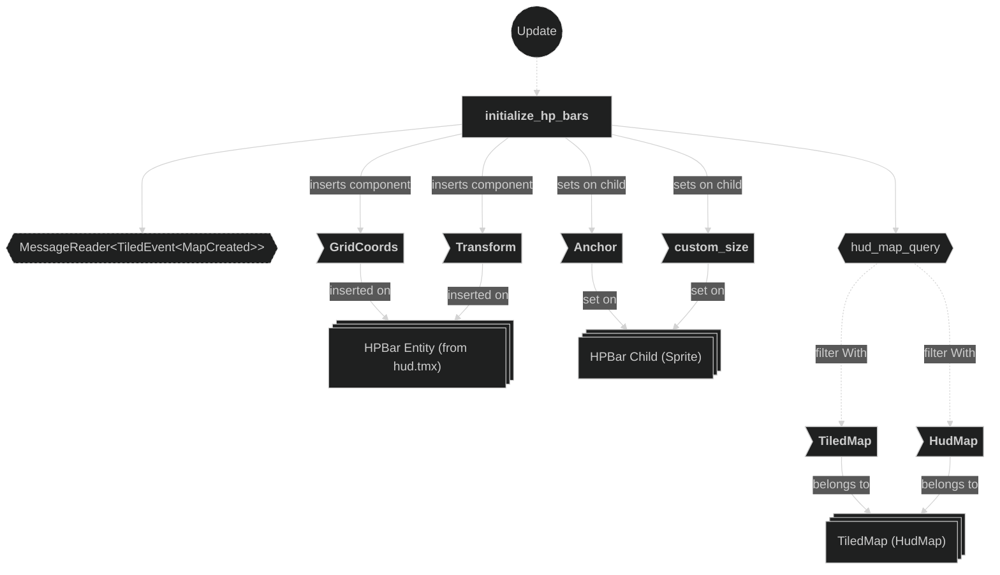

# Maps Plugin

Contains systems related to map loading and entity-related initializations. This plugin also initializes the `MapInfo` resource to give world-wide access to specific tile lookups and map-related information.

## Plugin workflow

- Startup phase
    - `load_maps` spawns two `TiledMap` entities: one for `level0.tmx` (tagged `CurrentLevel`) and one for `hud.tmx` (tagged `HudMap`).
    - The `TiledPlugin` later emits `TiledEvent<MapCreated>` for each loaded map.
- Update phase (chained)
    - `initialize_map_info`:
        - Reacts to `TiledEvent<MapCreated>` for `CurrentLevel` maps only
            - Reads tilemap metadata components, all `Ground` tiles (`Entity`, `TilePos`), and all `ForbiddenArea` tiles
            - Writes the `MapInfo` resource, including `ground_entities`, `claimed_entities`, `forbidden_areas` HashMaps and all map geometry fields
    - Then in parallel (after `initialize_map_info`):
        - `initialize_players`:
            - Reacts to `TiledEvent<MapCreated>` for `CurrentLevel` maps only
            - For each `Player` TiledObject: computes `GridCoords` from `Transform`, inserts `GridCoords`, `LookDirection`, `TranslateEffectTarget`, `DamageEffectTarget`, `Health{current:100,max:100}`
            - Inserts `Anchor` on the first child sprite entity of each player
        - `initialize_claimed_tiles`:
            - Reacts to `TiledEvent<MapCreated>` for `CurrentLevel` maps only
            - For each ground tile, spawns a `ClaimedTile{owner:None}` entity with `WaveEffectTarget`, `GridCoords`, `Transform`, `Anchor`
            - Stores each spawned entity in `MapInfo::claimed_entities`
        - `initialize_hp_bars`:
            - Reacts to `TiledEvent<MapCreated>` for `HudMap` maps only
            - Initializes `HPBar` entities with `GridCoords` and `Transform`
            - Sets `Anchor` and `custom_size` on the child sprite entity of each HP bar

## Plugin Systems

### Load Maps

Spawns two `TiledMap` entities at startup:
- `level0.tmx` — the current game level, tagged with the `CurrentLevel` marker component.
- `hud.tmx` — the heads-up display overlay map, tagged with the `HudMap` marker component.

### Initialize Map Info

Reacts to `TiledEvent<MapCreated>` filtered to `CurrentLevel` maps only. Reads tilemap metadata components, iterates all `Ground`-marked tile entities (storing them in `ground_entities`) and all `ForbiddenArea`-marked tile entities (storing them in `forbidden_areas`). Also allocates the `claimed_entities` HashMap keyed by `GridCoords`. Writes all collected data into the `MapInfo` resource so it is available world-wide.

### Initialize Players

Reacts to `TiledEvent<MapCreated>` filtered to `CurrentLevel` maps only. For each `Player`-marked `TiledObject` entity it:
1. Computes the initial `GridCoords` from the entity world-space `Transform` using the `MapInfo` resource.
2. Derives the starting `LookDirection` from the player id.
3. Inserts `GridCoords`, `LookDirection`, `TranslateEffectTarget`, `DamageEffectTarget`, and `Health{current:20, max:100}` on the player entity.
4. Inserts an `Anchor` component on the first child entity (the sprite entity) to properly anchor the sprite.

### Initialize Claimed Tiles

Reacts to `TiledEvent<MapCreated>` filtered to `CurrentLevel` maps only. For each ground tile in `MapInfo::ground_entities` it spawns a new entity with `ClaimedTile{owner:None}`, `WaveEffectTarget`, `GridCoords`, `Transform`, and `Anchor`. Each spawned entity is stored in `MapInfo::claimed_entities` keyed by its `GridCoords`, making it available for later lookup by the beam and animation systems.

### Initialize HP Bars

Reacts to `TiledEvent<MapCreated>` filtered to `HudMap` maps only. For each `HPBar` entity already spawned by the Tiled loader, computes its `GridCoords` from its world-space `Transform`, and inserts `GridCoords` and `Transform` on the entity. Also sets the `Anchor` and `custom_size` on the child sprite entity of each HP bar so the bar scales correctly from the correct pivot point.

## Components, Resources and Messages CRUD

### Read TiledEvent MapCreated messages

Used in the following systems:
- **initialize_map_info**: used to trigger map metadata initialization
- **initialize_players**: used to trigger player entity initialization
- **initialize_claimed_tiles**: used to trigger claimed tile entity spawning
- **initialize_hp_bars**: used to trigger HP bar initialization — filtered to `HudMap` maps only

### Query Tilemap metadata

Used in the following systems:
- **initialize_map_info**: used to get various map informations (e.g. map size, tile size, etc.)

### Query TilePos of Ground tiles

Used in the following systems:
- **initialize_map_info**: used to get all `Entity` and `TilePos` of `Ground`-marked tile entities spawned after loading the map

### Query TilePos of ForbiddenArea tiles

Used in the following systems:
- **initialize_map_info**: used to get all `Entity` and `TilePos` of `ForbiddenArea`-marked tile entities spawned after loading the map

### Query All Player tiled objects

Used in the following systems:
- **initialize_players**: used to get all `Entity`, `Player::player_id` and `Transform` of `Player`-marked entities spawned after loading the map

### Write MapInfo resource

Used in systems:
- **initialize_map_info**: writes the `MapInfo` resource, including `ground_entities`, `claimed_entities`, `forbidden_areas` HashMaps and all map geometry fields

### Write commands — initialize_players

Used in systems:
- **initialize_players**: inserts `GridCoords`, `LookDirection`, `TranslateEffectTarget`, `DamageEffectTarget`, `Health{current:20,max:100}` on each `Player` entity, and inserts `Anchor` on the first child sprite entity

### Write commands — initialize_claimed_tiles

Used in systems:
- **initialize_claimed_tiles**: spawns one `ClaimedTile` entity per ground tile and stores each entity in `MapInfo::claimed_entities`

### Write commands — initialize_hp_bars

Used in systems:
- **initialize_hp_bars**: initializes existing `HPBar` entities (spawned by the Tiled loader from `hud.tmx`) with `GridCoords` and `Transform`, and sets `Anchor` and `custom_size` on the child sprite entity; triggered by `TiledEvent<MapCreated>` for the `HudMap`

