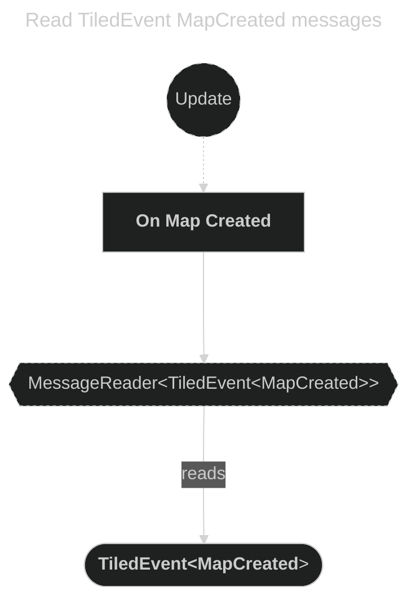
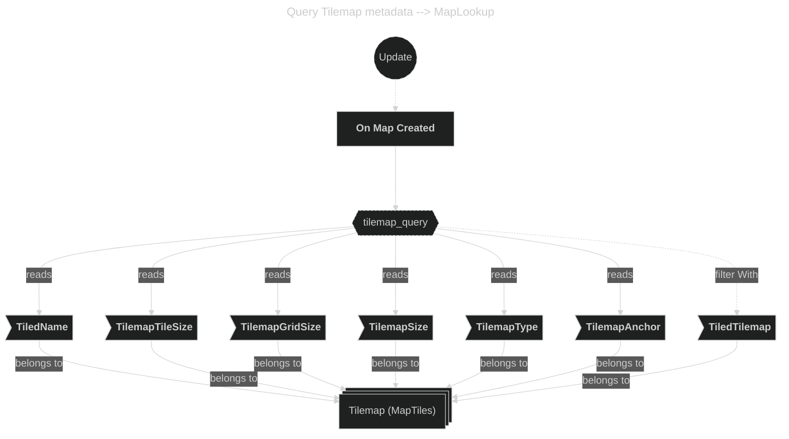
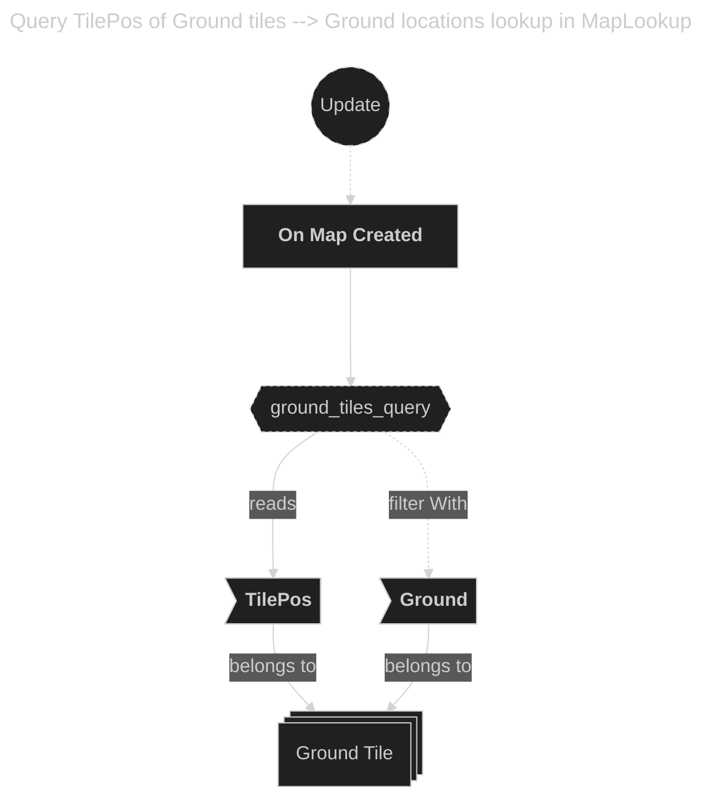
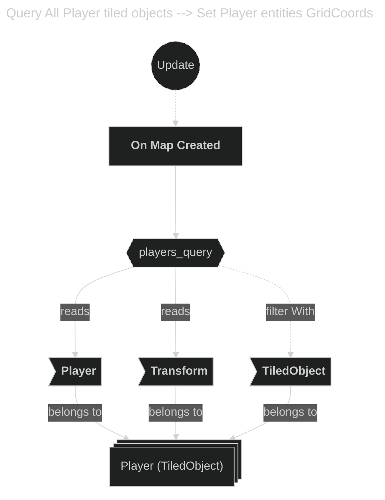
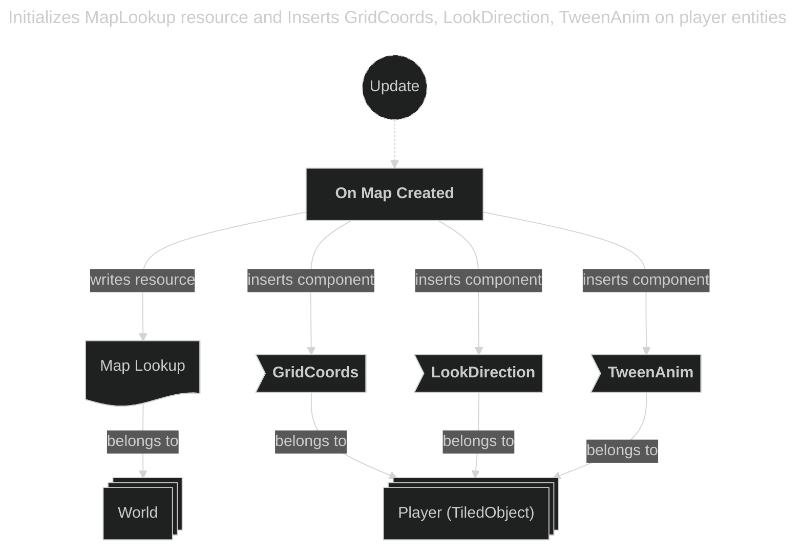

- Startup phase
    - Load Map spawns the Tilemap entity with TiledMap + TilemapAnchor.
    - The TiledPlugin later emits TiledEvent<MapCreated>.
- Update phase
    - On Map Created System:
        - Reacts to MapCreated message
            - Reads:
                - Tilemap metadata components
                - All Ground tiles (TilePos)
                - All Player tiled objects
            - Writes:
                - Initializes MapLookup resource
                - Inserts GridCoords, LookDirection, TweenAnim on player entities

---

---

---

---

---

