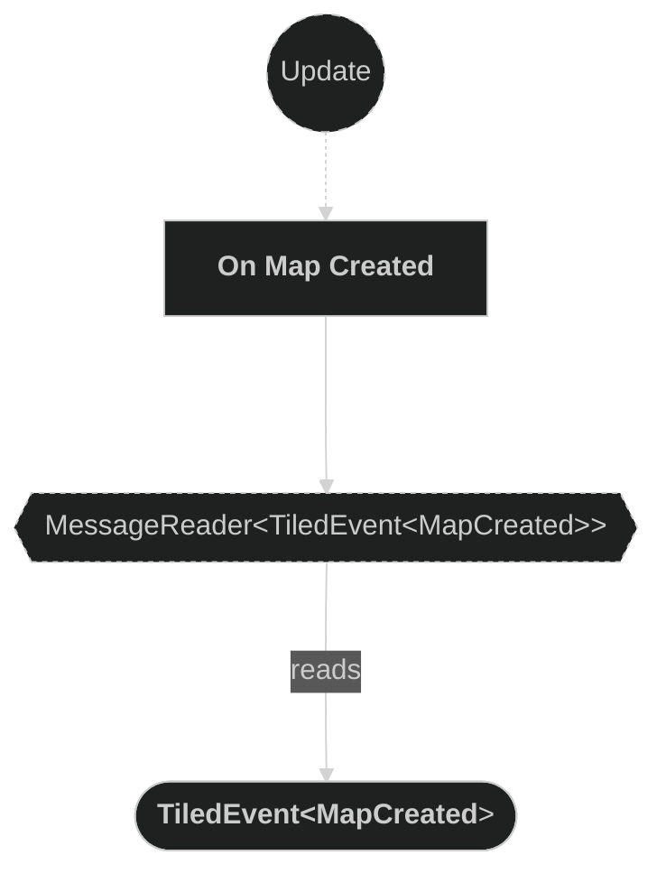
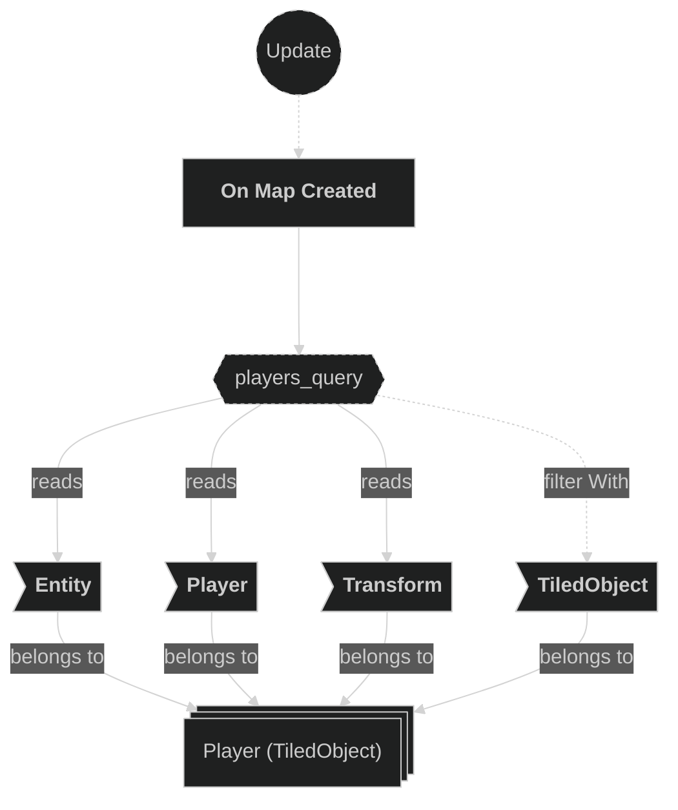
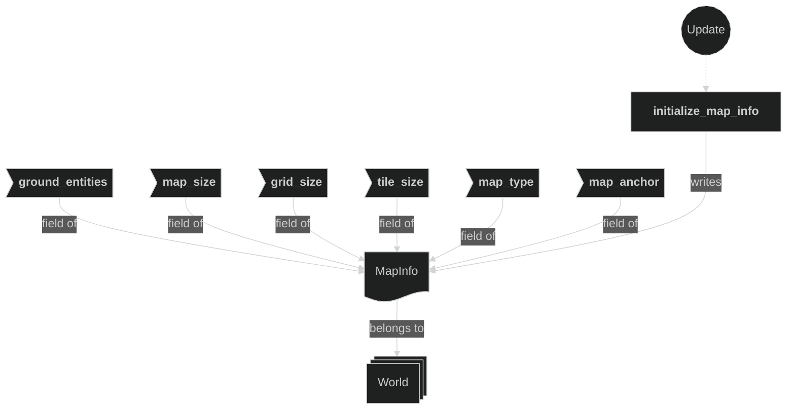
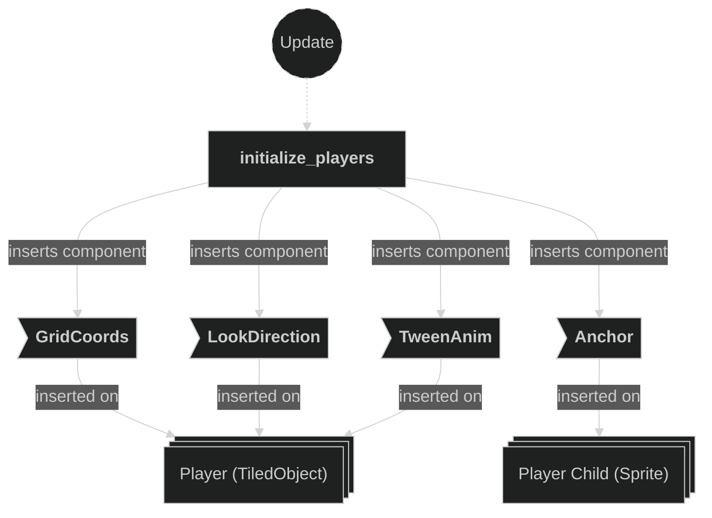

# Maps Plugin

Contains system related to map loading and entity-related initializations. This plugin also initialize the MapInfo resource to give worldwide access to specific tiles lookup or map related information.

## Plugin workflow

- Startup phase
    - Load Map spawns the Tilemap entity with TiledMap + TilemapAnchor.
    - The TiledPlugin later emits TiledEvent<MapCreated>.
- Update phase
    - On Map Created System:
        - Reacts to MapCreated message
            - Reads:
                - Tilemap metadata components
                - All Ground tiles (Entity, TilePos)
                - All Player tiled objects
            - Writes:
                - Initializes MapInfo resource
                - Inserts GridCoords, LookDirection, TweenAnim on player entities
                - Inserts Anchor on player child sprite entities

## Plugin Systems

### Load Map

Loads the `level0.tmx` Tile Project File that represents a temporary test level.

### Initialize Map Info

Store map informations to be used accros all systems. Initialize several tile lookups, in particular the `ground_entities` HashMap that links `TilePos` to `Ground` tile entities, as well as map geometry fields (`map_size`, `grid_size`, `tile_size`, `map_type`, `map_anchor`) read from the Tilemap entity.

### Initialize Players

Reacts to the `MapCreated` event and initializes all player entities spawned by the Tiled loader. For each `Player`-marked entity, it computes the initial `GridCoords` from the entity world-space `Transform` using the `MapInfo` resource, derives the starting `LookDirection` from the player id, and inserts a `TweenAnim` for movement interpolation. It also inserts an `Anchor` component on the first child entity of each player (the sprite entity) to properly anchor the sprite.

## Components, Resources and Messages CRUD

### Read TiledEvent MapCreated messages

Used in the folowing systems:
- **initialize_map_info**: used to trigger the system
- **initialize_players**: used to trigger the system

### Query Tilemap metadata

Used in the folowing systems:
- **initialize_map_info** : used to get various map informations (e.g. map size, tile size, etc.)

### Query TilePos of Ground tiles

Used in the following systems:
- **initialize_map_info** : used to get all `Entity` and `TilePos` of `Ground`-marked tile entities spawned after loading the map

### Query All Player tiled objects

Used in the following systems:
- **initialize_players**: used to get all `Entity`, `Player::player_id` and `Transform` of `Player`-marked entities spawned after loading the map

### Write MapInfo resource

Used in systems:
- **initialize_map_info**: writes the `MapInfo` resource, including the `ground_entities` HashMap that links `TilePos` to `Ground` tile entities, and all map geometry fields

### Write commands

Used in systems:
- **initialize_players**: inserts `GridCoords`, `LookDirection` and `TweenAnim` on each `Player` entity, and inserts `Anchor` on the first child sprite entity

