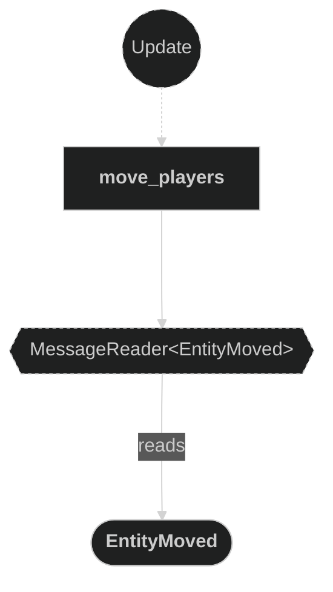
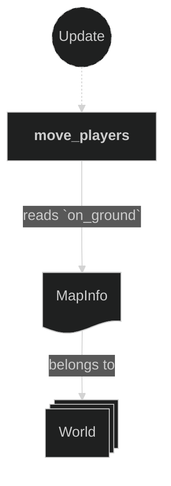
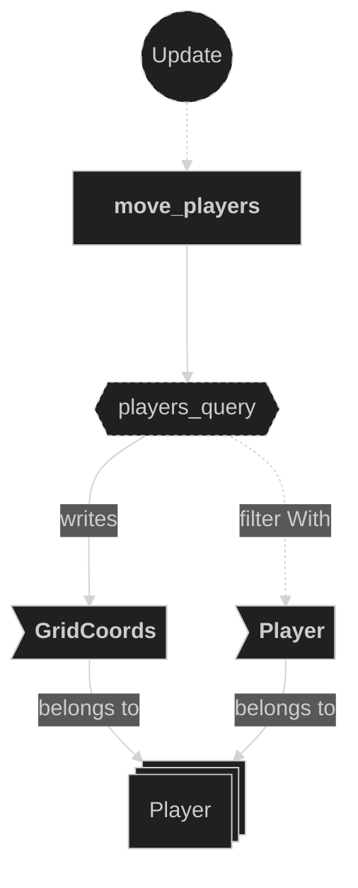

# Controller Plugin

Contains the system responsible for reacting to movement messages and updating player grid positions. When an `EntityMoved` message is received, the controller validates the target position against walkable ground tiles and overwrites the player's `GridCoords` if the move is legal.

## Plugin workflow

- Update phase
    - Move Players:
        - Reacts to `EntityMoved` message
            - Reads:
                - `MapInfo` resource (for ground validation via `on_ground()`)
                - `EntityMoved` message fields (`entity`, target `position`)
            - Writes:
                - Updates `GridCoords` on the player entity if the target tile is walkable ground

## Plugin Systems

### Move Players

Reads `EntityMoved` messages written by the input system. For each message, checks whether the target `GridCoords` position is a valid ground tile via `MapInfo::on_ground()`. If valid, overwrites the player entity's `GridCoords` with the new position.

## Components, Resources and Messages CRUD

### Read EntityMoved messages

Used in the following systems:
- **move_players**: used to trigger a player grid position update

### Read MapInfo resource

Used in the following systems:
- **move_players**: used to validate that the target position is walkable ground via `on_ground()`

### Write GridCoords

Used in the following systems:
- **move_players**: overwrites the player's `GridCoords` with the validated target position (the new value comes entirely from `EntityMoved::position`, the existing component value is never read)

