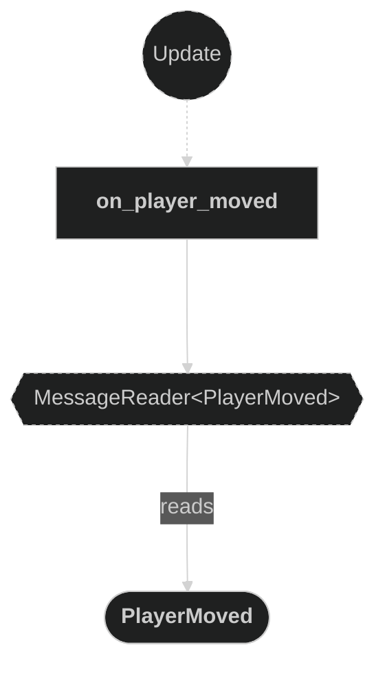
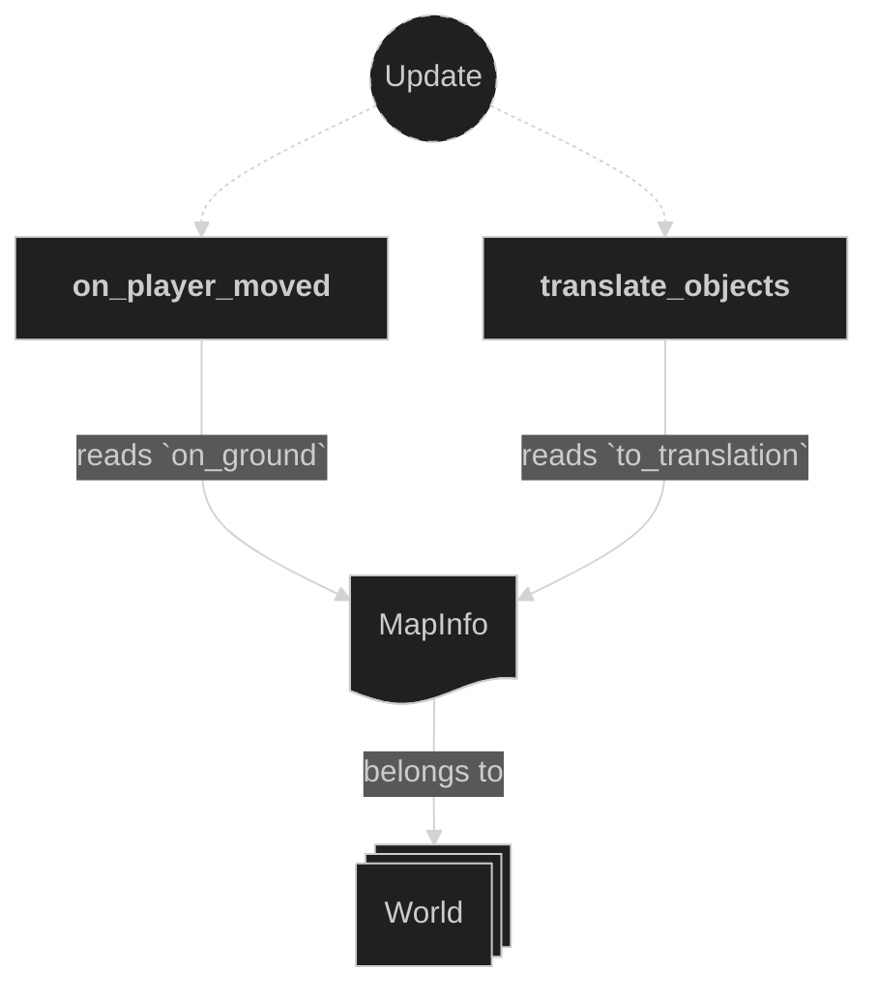
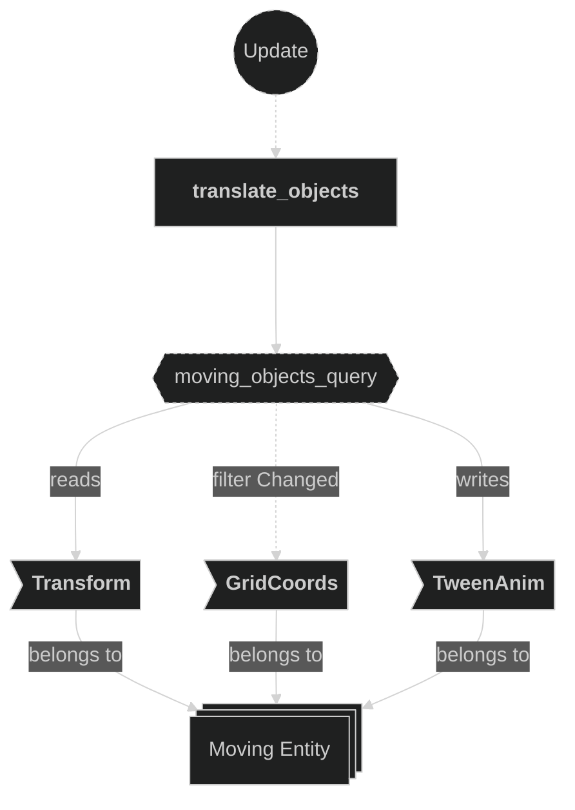
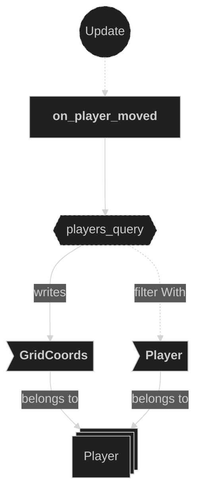
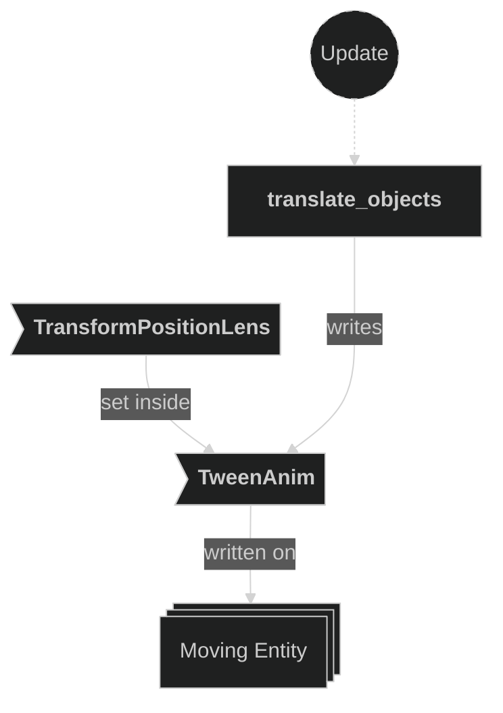

# Movements Plugin

Contains systems responsible for translating game-logic grid positions into actual world-space transforms, and for reacting to movement messages to update player positions. Movement is smoothly interpolated using tweening.

## Plugin workflow

- Update phase
    - On Player Moved:
        - Reacts to `PlayerMoved` message
            - Reads:
                - `MapInfo` resource (for ground validation via `on_ground()`)
                - `PlayerMoved` message fields (`player` entity, target `position`)
            - Writes:
                - Updates `GridCoords` on the player entity if the target tile is walkable ground
    - Translate Objects:
        - Reacts to changed `GridCoords`
            - Reads:
                - Current `Transform` and `GridCoords` of moving entities
                - `MapInfo` resource (for world-space coordinate conversion)
            - Writes:
                - Updates `TweenAnim` with a new `TransformPositionLens` tween toward the destination

## Plugin Systems

### On Player Moved

Reads `PlayerMoved` messages written by the input system. For each message, checks whether the target `GridCoords` position is a valid ground tile via `MapInfo::on_ground()`. If valid, overwrites the player entity's `GridCoords` with the new position.

### Translate Objects

Reacts to any entity whose `GridCoords` component has changed. Computes the world-space destination using `GridCoords::to_translation()` with the `MapInfo` resource, then sets a new `TransformPositionLens` tween on the entity's `TweenAnim` component to smoothly interpolate the transform from its current position to the destination.

## Components, Resources and Messages CRUD

### Read PlayerMoved messages

Used in the following systems:
- **on_player_moved**: used to trigger a player grid position update

### Read MapInfo resource

Used in the following systems:
- **on_player_moved**: used to validate that the target position is walkable ground via `on_ground()`
- **translate_objects**: used to convert `GridCoords` to world-space translation via `to_translation()`

### Query moving objects

Used in the following systems:
- **translate_objects**: reads `Transform` and `GridCoords` and writes `TweenAnim` on any entity whose `GridCoords` changed

### Write GridCoords

Used in the following systems:
- **on_player_moved**: overwrites the player's `GridCoords` with the validated target position (the new value comes entirely from `PlayerMoved::position`, the existing component value is never read)

### Write TweenAnim

Used in the following systems:
- **translate_objects**: sets a new `TransformPositionLens` tween on the entity to smoothly move it toward the grid-aligned world position

