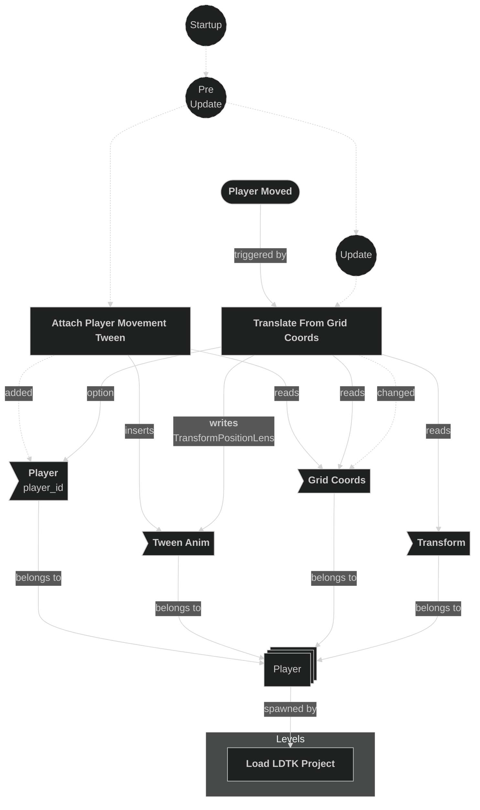

```mermaid
---
config:
  theme: dark
---

flowchart TD

%% dash for system groups
classDef system-group stroke-dasharray: 5 5

%%%%%%%%%%%%%%%%%%%%%%%
%%      Messages     %%
%%%%%%%%%%%%%%%%%%%%%%%

player_moved_message(["`**Player Moved**`"])
player_moved_message ---> |triggered by| translate_from_grid_coords   

%%%%%%%%%%%%%%%%%%%%%%%%%%%%
%%  Entities & Components %%
%%%%%%%%%%%%%%%%%%%%%%%%%%%%

%% Player entity
player_entity@{ shape: st-rect, label: "Player" } 
pe_player_component>"`**Player**<br>player_id`"] ---> |belongs to| player_entity
pe_tween_anim_component>"`**Tween Anim**`"] ---> |belongs to| player_entity
pe_grid_coords_component>"`**Grid Coords**`"] ---> |belongs to| player_entity
pe_transform_component>"`**Transform**`"] ---> |belongs to| player_entity
player_entity --> |spawned by| load_ldtk_project

%%%%%%%%%%%%%%%%%%%%%%%
%%      Systems      %%
%%%%%%%%%%%%%%%%%%%%%%%

startup((Startup)):::system-group -.-> preupdate(("`Pre<br>Update`")):::system-group -...-> update(("`Update`")):::system-group

subgraph Levels
    load_ldtk_project["`**Load LDTK Project**`"]
end

%%startup -.-> load_ldtk_project

attach_player_movement_tween["`**Attach Player Movement Tween**`"]
translate_from_grid_coords["`**Translate From Grid Coords**`"]

preupdate -.-> attach_player_movement_tween
update -.-> translate_from_grid_coords

attach_player_movement_tween -.-> |added| pe_player_component
attach_player_movement_tween ---> |reads| pe_grid_coords_component
attach_player_movement_tween ----> |inserts| pe_tween_anim_component


translate_from_grid_coords ---> |reads| pe_transform_component
translate_from_grid_coords ---> |reads| pe_grid_coords_component
translate_from_grid_coords -.-> |changed| pe_grid_coords_component
translate_from_grid_coords ---> |option| pe_player_component
translate_from_grid_coords ----> |"`**writes**<br>TransformPositionLens`"| pe_tween_anim_component
```
