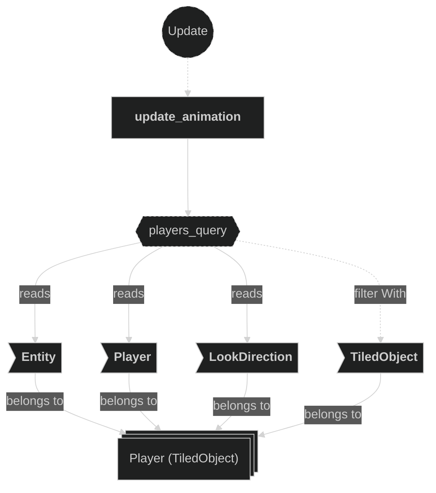
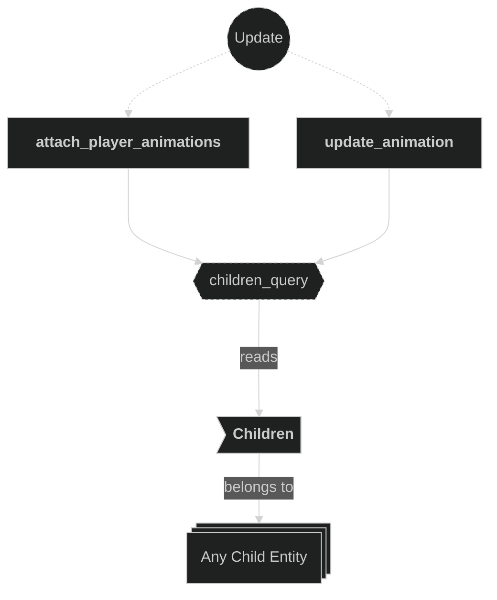
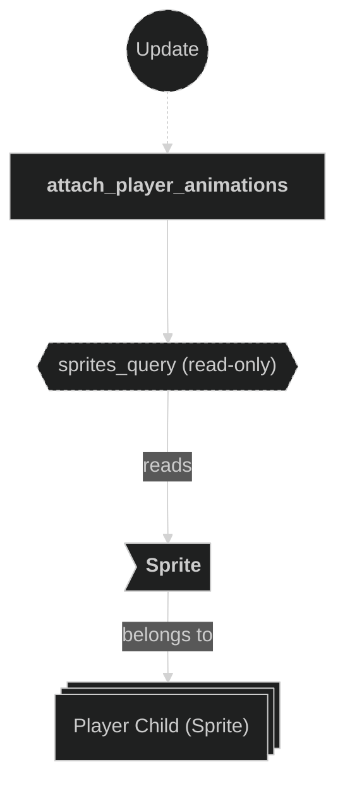
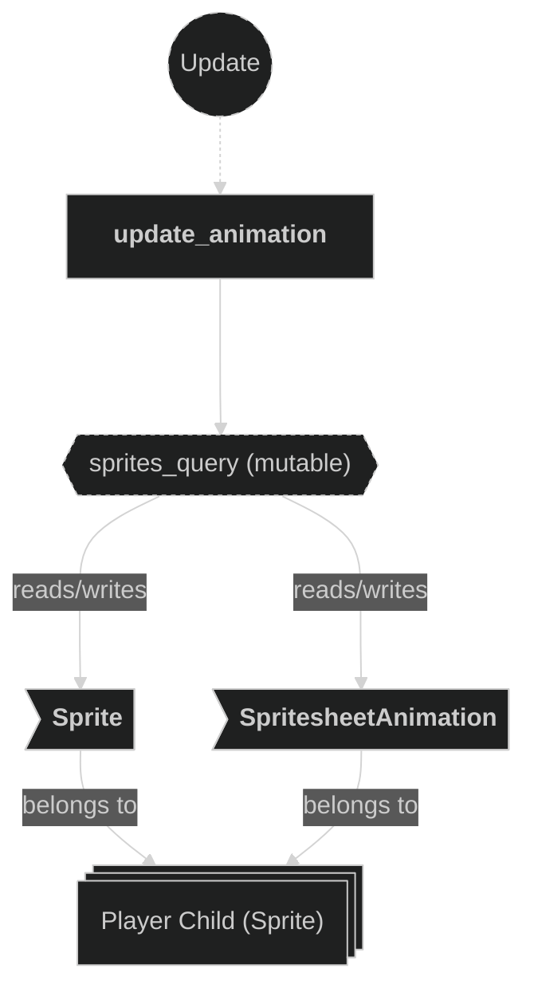
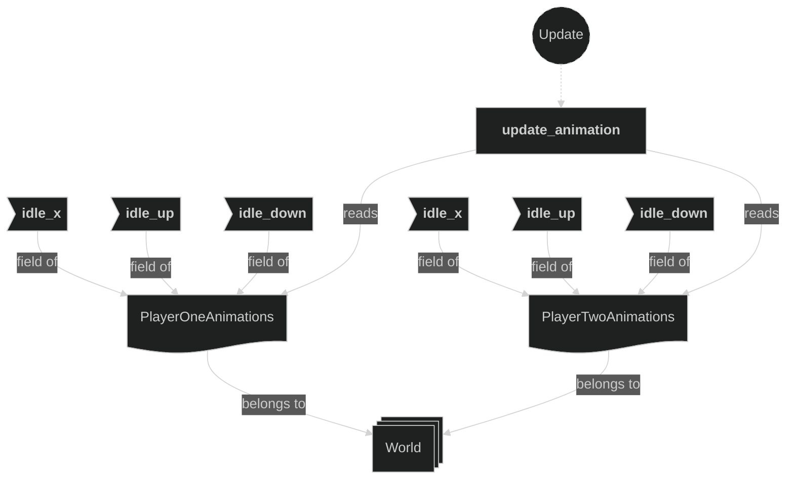
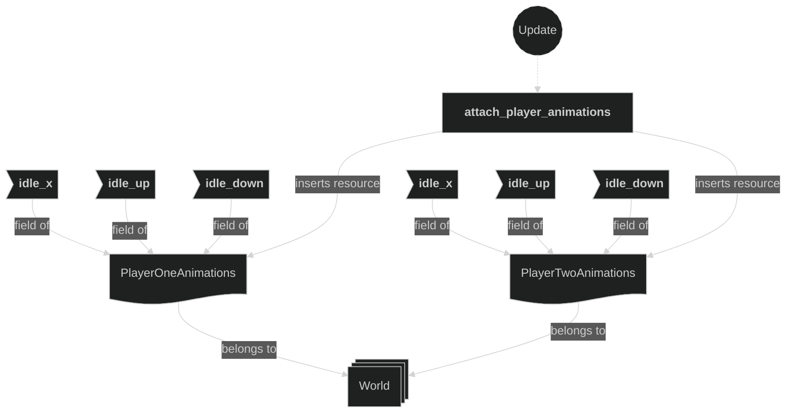
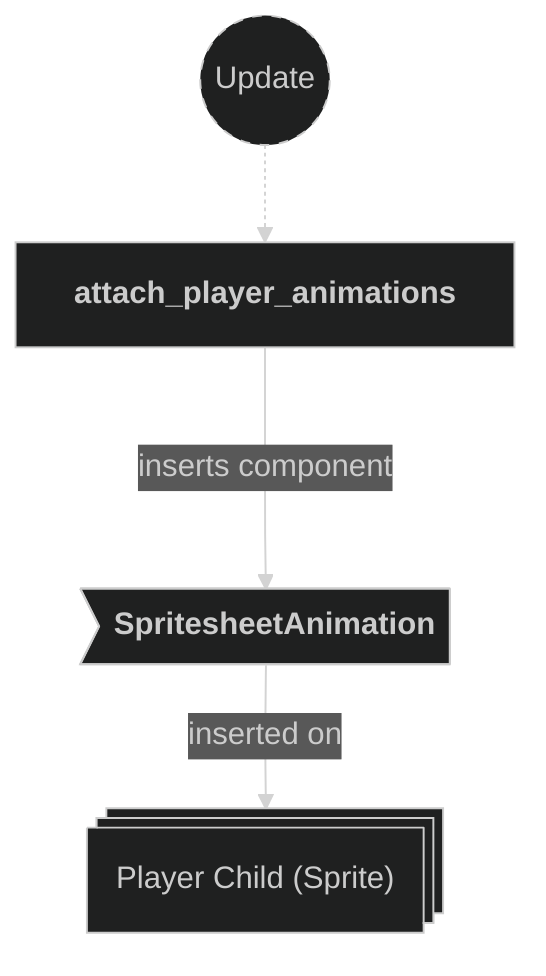

# Animations Plugin

Contains systems responsible for attaching and updating spritesheet animations on player entities. This plugin reacts to the `ObjectCreated` Tiled event to initialize per-player animation handle resources, then drives the active animation each frame based on the player's current `LookDirection`.

## Plugin workflow

- Update phase
    - Attach Player Animations:
        - Reacts to `TiledEvent<ObjectCreated>` message
            - Reads:
                - All `Player`-marked `TiledObject` entities and their `Entity` + `Player` components
                - The `Sprite` component on each player's child sprite entity (to get the image handle)
            - Writes:
                - Inserts `PlayerOneAnimations` or `PlayerTwoAnimations` resource into the world
                - Inserts `SpritesheetAnimation` on the child sprite entity
    - Update Animation:
        - Runs every frame
            - Reads:
                - All `Player`-marked entities with `LookDirection`
                - `PlayerOneAnimations` and `PlayerTwoAnimations` resources (optional/`If`)
                - `Sprite` and `SpritesheetAnimation` on descendant sprite entities
            - Writes:
                - Updates `SpritesheetAnimation` (switches active clip)
                - Updates `Sprite::flip_x` for left/right facing directions

## Plugin Systems

### Attach Player Animations

Reacts to the `TiledEvent<ObjectCreated>` message emitted by the Tiled loader when a player object is created. For each matching `Player`-marked `TiledObject` entity, it walks the entity hierarchy to find the child entity carrying a `Sprite`, reads its image handle to build a `Spritesheet`, then creates idle animation handles for the three directional variants (`idle_x`, `idle_down`, `idle_up`). It stores these handles in a per-player resource (`PlayerOneAnimations` or `PlayerTwoAnimations`) and inserts a `SpritesheetAnimation` on the child sprite entity with the initial idle clip.

### Update Animation

Runs every frame. For each `Player`-marked `TiledObject` entity, it walks the entity hierarchy to find the descendant with a `Sprite` and `SpritesheetAnimation`, then switches the active animation clip based on the player's current `LookDirection`. It also sets `Sprite::flip_x` to mirror the horizontal idle sprite when the player faces left.

## Components, Resources and Messages CRUD

### Read TiledEvent ObjectCreated messages

Used in the following systems:
- **attach_player_animations**: used to trigger animation setup when a player Tiled object is created

### Query Player entities (attach)

Used in the following systems:
- **attach_player_animations**: used to get the `Entity` and `Player` of each `TiledObject`-marked player entity to look up the correct sprite child and build per-player animation handles

### Query Player entities (update)

Used in the following systems:
- **update_animation**: used to get `Entity`, `Player::player_id` and `LookDirection` of each `TiledObject`-marked player entity to decide which animation clip to activate

### Query Children hierarchy

Used in the following systems:
- **attach_player_animations**: used to walk descendants via `iter_descendants` to find the child sprite entity
- **update_animation**: used to walk descendants via `iter_descendants` to find the child sprite entity

### Query child Sprite (attach)

Used in the following systems:
- **attach_player_animations**: used to find the descendant entity carrying a `Sprite` and retrieve its `image` handle to build the `Spritesheet`

### Query child Sprite and SpritesheetAnimation (update)

Used in the following systems:
- **update_animation**: used to mutably access `Sprite::flip_x` and switch the active `SpritesheetAnimation` clip on the child sprite entity

### Read PlayerOneAnimations and PlayerTwoAnimations resources

Used in the following systems:
- **update_animation**: used to retrieve the animation clip handles for each player; accessed via `If<Res<...>>` (optional — skipped if not yet inserted)

### Write PlayerOneAnimations and PlayerTwoAnimations resources

Used in the following systems:
- **attach_player_animations**: inserts `PlayerOneAnimations` or `PlayerTwoAnimations` resource into the world after building animation handles from the player's spritesheet

### Write commands (attach animations)

Used in the following systems:
- **attach_player_animations**: inserts `SpritesheetAnimation` on the child sprite entity after building the animation handles

