# Animations Plugin

Contains systems responsible for attaching and updating spritesheet animations on player entities and claimed tile entities. This plugin reacts to the `ObjectCreated` Tiled event to initialize per-player animation handle resources, drives the active player animation each frame based on the player's current `LookDirection`, and manages animations for claimed tiles in reaction to `BeamResolved` messages.

HUD animation more broadly — both the HP bars and the numeric rolling-odometer counters — now lives in the HUD plugin.

## Plugin workflow

- Update phase
    - Initialize Player Animations:
        - Reacts to `TiledEvent<ObjectCreated>` message
            - Reads:
                - All `Player`-marked `TiledObject` entities and their `Entity` + `Player` components
                - The `Sprite` component on each player's child sprite entity (to get the image handle)
            - Writes:
                - Inserts `PlayerOneAnimations` or `PlayerTwoAnimations` resource into the world
                - Inserts `SpritesheetAnimation` on the child sprite entity
    - Animate Player:
        - Runs every frame
            - Reads:
                - All `Player`-marked entities with `LookDirection`
                - `PlayerOneAnimations` and `PlayerTwoAnimations` resources (optional/`If`)
                - `Sprite` and `SpritesheetAnimation` on descendant sprite entities
            - Writes:
                - Updates `SpritesheetAnimation` (switches active clip)
                - Updates `Sprite::flip_x` for left/right facing directions
    - Initialize Claimed Tile Animations:
        - Reacts to `Added<ClaimedTile>` on newly spawned claimed tile entities
            - Reads:
                - `ClaimedTile` entity and its components
            - Writes:
                - Builds `ClaimedTileAnimations` resource
                - Inserts `SpritesheetAnimation`, `Sprite`, and `BounceEffect` on the claimed tile entity
    - Animate Claimed Tile:
        - Reacts to `BeamResolved` messages
            - Reads:
                - `BeamResolved` message fields (`position`, `owner`)
                - `MapInfo` resource (to resolve `GridCoords` → claimed tile `Entity` via `claimed_entities`)
                - `ClaimedTileAnimations` resource
            - Writes:
                - Switches `SpritesheetAnimation` clip on the claimed tile entity to the player-color animation
                - Inserts `BounceEffectTarget` on the claimed tile entity
    - Animate Unclaimed Tile:
        - Runs on `Changed<ClaimedTile>` (fires when the round reset clears a tile's `owner` back to `None`)
            - Reads:
                - `ClaimedTile` entities whose ownership changed, with their `GridCoords` and `SpritesheetAnimation`
                - `ClaimedTileAnimations` resource; `MapInfo` (for the board center)
            - Writes:
                - For a tile now owned by nobody and still showing a player color, inserts an `UnclaimRevert` timer whose delay is the tile's distance from the board center scaled over the cascade window — staggering the revert into a radial wave rather than reverting instantly
    - Tick Unclaim Reverts:
        - Runs every frame
            - Reads:
                - `Time`; `ClaimedTile` + `SpritesheetAnimation` + `UnclaimRevert` on scheduled tiles; `ClaimedTileAnimations` resource
            - Writes:
                - Ticks each `UnclaimRevert` timer; when it elapses, if the tile is still unowned, switches its `SpritesheetAnimation` to the reverse of the player-color flip it is showing (returning it to the neutral sprite), then removes `UnclaimRevert` (a tile re-claimed during the cascade is left colored)

## Plugin Systems

### Initialize Player Animations

Reacts to the `TiledEvent<ObjectCreated>` message emitted by the Tiled loader when a player object is created. For each matching `Player`-marked `TiledObject` entity, it walks the entity hierarchy to find the child entity carrying a `Sprite`, reads its image handle to build a `Spritesheet`, then creates idle animation handles for the three directional variants (`idle_x`, `idle_down`, `idle_up`). It stores these handles in a per-player resource (`PlayerOneAnimations` or `PlayerTwoAnimations`) and inserts a `SpritesheetAnimation` on the child sprite entity with the initial idle clip.

### Animate Player

Runs every frame. For each `Player`-marked `TiledObject` entity, it walks the entity hierarchy to find the descendant with a `Sprite` and `SpritesheetAnimation`, then switches the active animation clip based on the player's current `LookDirection`. It also sets `Sprite::flip_x` to mirror the horizontal idle sprite when the player faces left.

### Initialize Claimed Tile Animations

Reacts to `Added<ClaimedTile>` — fires once for each newly spawned claimed tile entity. Builds the `ClaimedTileAnimations` resource (if not already present) containing animation clip handles for each player color variant. Inserts `SpritesheetAnimation` (with the neutral/default clip), `Sprite`, and `BounceEffect` on the claimed tile entity so it is ready to display ownership animations.

### Animate Claimed Tile

Reads `BeamResolved` messages. For each message, resolves the claimed tile entity from `MapInfo::claimed_entities` using the message's `GridCoords` position. Reads the `ClaimedTileAnimations` resource to select the correct player-color clip based on the owning player id, then switches the `SpritesheetAnimation` clip on the claimed tile entity. Also inserts `BounceEffectTarget` on the claimed tile entity to trigger the bounce visual effect.

### Animate Unclaimed Tile

The counterpart to Animate Claimed Tile, keeping tile visuals in sync when ownership is *cleared* rather than gained — the round reset (see the Round plugin doc) sets every reverted tile's `owner` back to `None`, which the authoritative claim data reflects but the sprite would not. It does **not** revert the sprite directly: because the reset clears every tile in the same frame, an immediate switch would revert the whole board at once. Instead, runs on `Changed<ClaimedTile>` and, for each tile now owned by nobody and still showing a player color, inserts an `UnclaimRevert` timer whose delay grows with the tile's distance from the board center (`MapInfo::map_size`), scaled across a fixed cascade window (`UNCLAIM_CASCADE_SECS`). This spreads the reverts into a radial wave from the center outward. It reads the currently-shown clip to confirm the tile is colored, so an already-unclaimed tile is skipped, and it never fights Animate Claimed Tile (which only handles ownership *gained*).

### Tick Unclaim Reverts

Drives the staggered revert scheduled by Animate Unclaimed Tile. Each frame it ticks every `UnclaimRevert` timer; when one elapses it switches that tile's `SpritesheetAnimation` to the reverse of the player-color flip it is displaying (`from_player_one`/`from_player_two`), animating it back to the neutral sprite, then removes `UnclaimRevert`. It first rechecks `ClaimedTile::owner`: a tile re-claimed while its delay ran down (once play resumes) is left colored rather than wrongly un-colored.

## Components, Resources and Messages CRUD

### Read TiledEvent ObjectCreated messages

Used in the following systems:
- **initialize_player_animations**: used to trigger animation setup when a player Tiled object is created

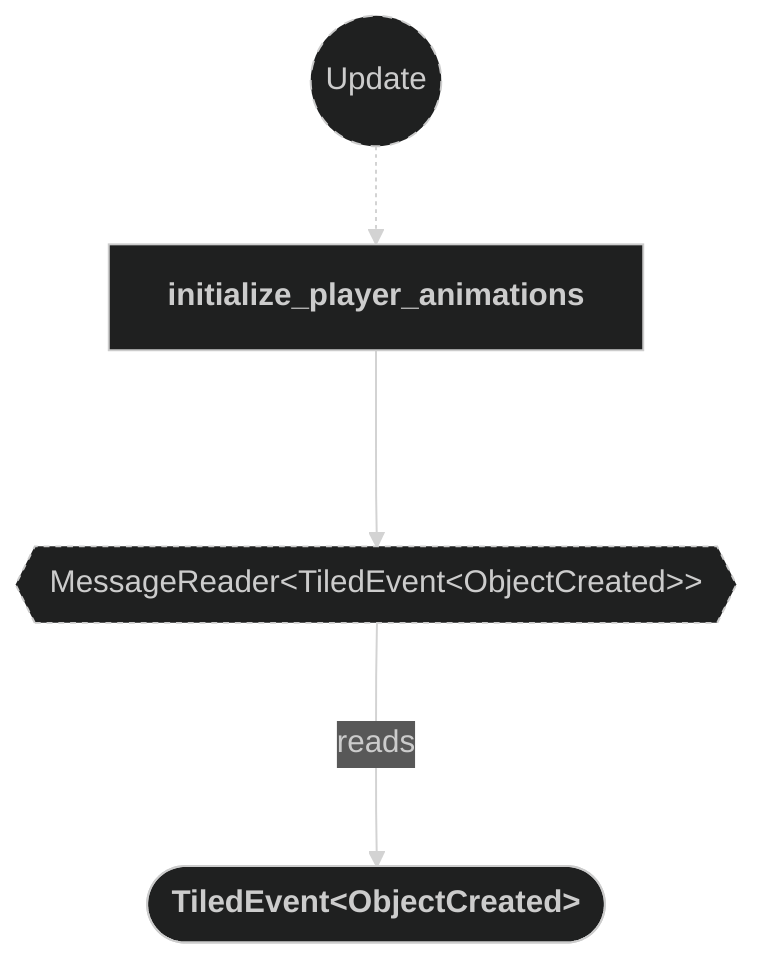
```mermaid
---
config:
  theme: dark
---

flowchart TD
classDef system-group stroke-dasharray: 5 5
classDef reader stroke-dasharray: 3 3

update(("`Update`")):::system-group
initialize_player_animations["`**initialize_player_animations**`"]

update -.-> initialize_player_animations

message_reader{{"MessageReader#60;TiledEvent#60;ObjectCreated#62;#62;"}}:::reader
initialize_player_animations ---> message_reader

object_created_message(["`**TiledEvent#60;ObjectCreated#62;**`"])

message_reader ---> |reads| object_created_message
```

### Read BeamResolved messages

Used in the following systems:
- **animate_claimed_tile**: used to trigger claimed tile animation switching when a beam resolves

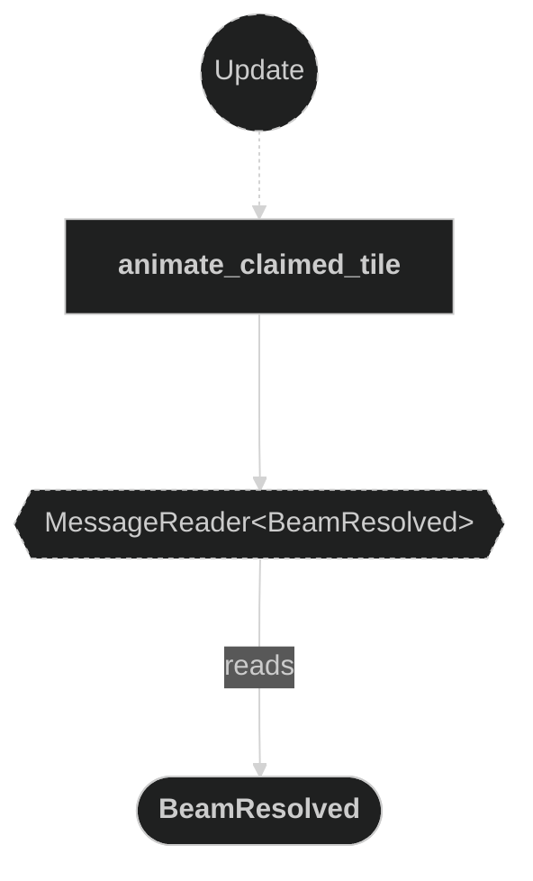
```mermaid
---
config:
  theme: dark
---

flowchart TD
classDef system-group stroke-dasharray: 5 5
classDef reader stroke-dasharray: 3 3

update(("`Update`")):::system-group
animate_claimed_tile["`**animate_claimed_tile**`"]

update -.-> animate_claimed_tile

message_reader{{"MessageReader#60;BeamResolved#62;"}}:::reader
animate_claimed_tile ---> message_reader

beam_resolved_message(["`**BeamResolved**`"])

message_reader ---> |reads| beam_resolved_message
```

### Query Player entities (attach)

Used in the following systems:
- **initialize_player_animations**: used to get the `Entity` and `Player` of each `TiledObject`-marked player entity to look up the correct sprite child and build per-player animation handles

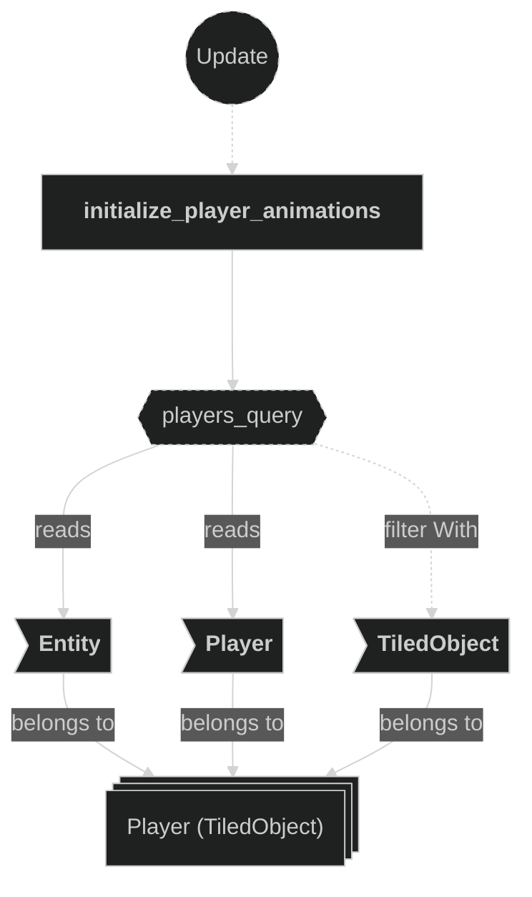
```mermaid
---
config:
  theme: dark
---

flowchart TD
classDef system-group stroke-dasharray: 5 5
classDef query stroke-dasharray: 3 3

update(("`Update`")):::system-group
initialize_player_animations["`**initialize_player_animations**`"]

update -.-> initialize_player_animations

players_query{{"`players_query`"}}:::query
initialize_player_animations ---> players_query

player_entity@{ shape: st-rect, label: "Player (TiledObject)" }

pe_entity>"`**Entity**`"] --> |belongs to| player_entity
pe_player>"`**Player**`"] --> |belongs to| player_entity
pe_tiled_object>"`**TiledObject**`"] --> |belongs to| player_entity

players_query ---> |reads| pe_entity
players_query ---> |reads| pe_player
players_query -..-> |filter With| pe_tiled_object
```

### Query Player entities (update)

Used in the following systems:
- **animate_player**: used to get `Entity`, `Player::player_id` and `LookDirection` of each `TiledObject`-marked player entity to decide which animation clip to activate

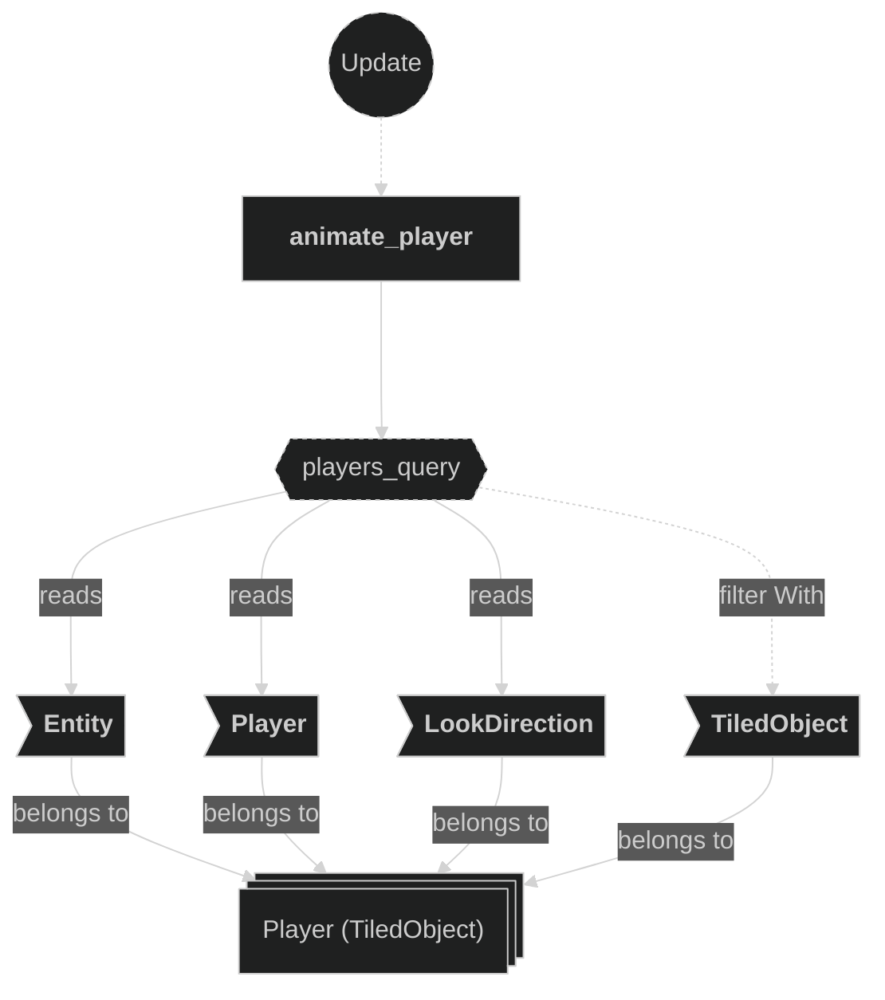
```mermaid
---
config:
  theme: dark
---

flowchart TD
classDef system-group stroke-dasharray: 5 5
classDef query stroke-dasharray: 3 3

update(("`Update`")):::system-group
animate_player["`**animate_player**`"]

update -.-> animate_player

players_query{{"`players_query`"}}:::query
animate_player ---> players_query

player_entity@{ shape: st-rect, label: "Player (TiledObject)" }

pe_entity>"`**Entity**`"] --> |belongs to| player_entity
pe_player>"`**Player**`"] --> |belongs to| player_entity
pe_look_direction>"`**LookDirection**`"] --> |belongs to| player_entity
pe_tiled_object>"`**TiledObject**`"] --> |belongs to| player_entity

players_query ---> |reads| pe_entity
players_query ---> |reads| pe_player
players_query ---> |reads| pe_look_direction
players_query -..-> |filter With| pe_tiled_object
```

### Query ClaimedTile entities (attach)

Used in the following systems:
- **initialize_claimed_tile_animations**: detects newly added `ClaimedTile` entities and initializes their animation components

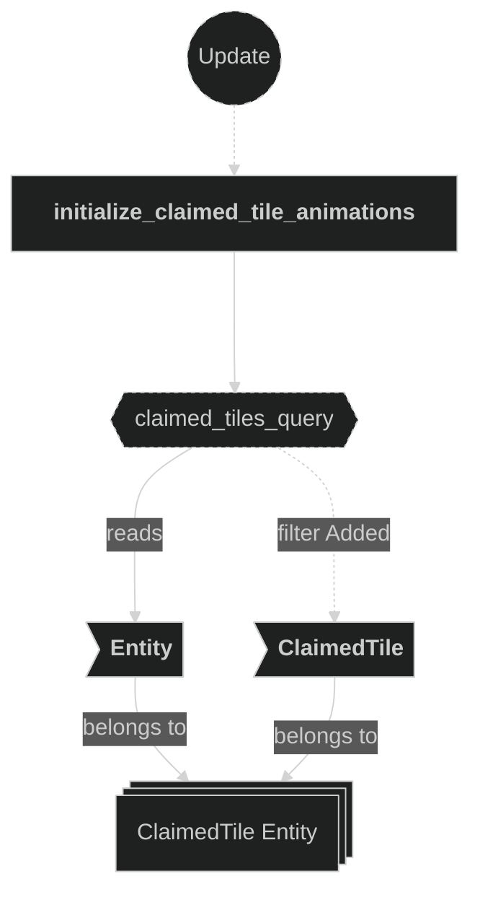
```mermaid
---
config:
  theme: dark
---

flowchart TD
classDef system-group stroke-dasharray: 5 5
classDef query stroke-dasharray: 3 3

update(("`Update`")):::system-group
initialize_claimed_tile_animations["`**initialize_claimed_tile_animations**`"]

update -.-> initialize_claimed_tile_animations

claimed_tiles_query{{"`claimed_tiles_query`"}}:::query
initialize_claimed_tile_animations ---> claimed_tiles_query

claimed_tile_entity@{ shape: st-rect, label: "ClaimedTile Entity" }

ct_entity>"`**Entity**`"] --> |belongs to| claimed_tile_entity
ct_claimed>"`**ClaimedTile**`"] --> |belongs to| claimed_tile_entity

claimed_tiles_query ---> |reads| ct_entity
claimed_tiles_query -..-> |filter Added| ct_claimed
```

### Query Children hierarchy

Used in the following systems:
- **initialize_player_animations**: walks descendants via `iter_descendants` to find the child sprite entity
- **animate_player**: walks descendants via `iter_descendants` to find the child sprite entity

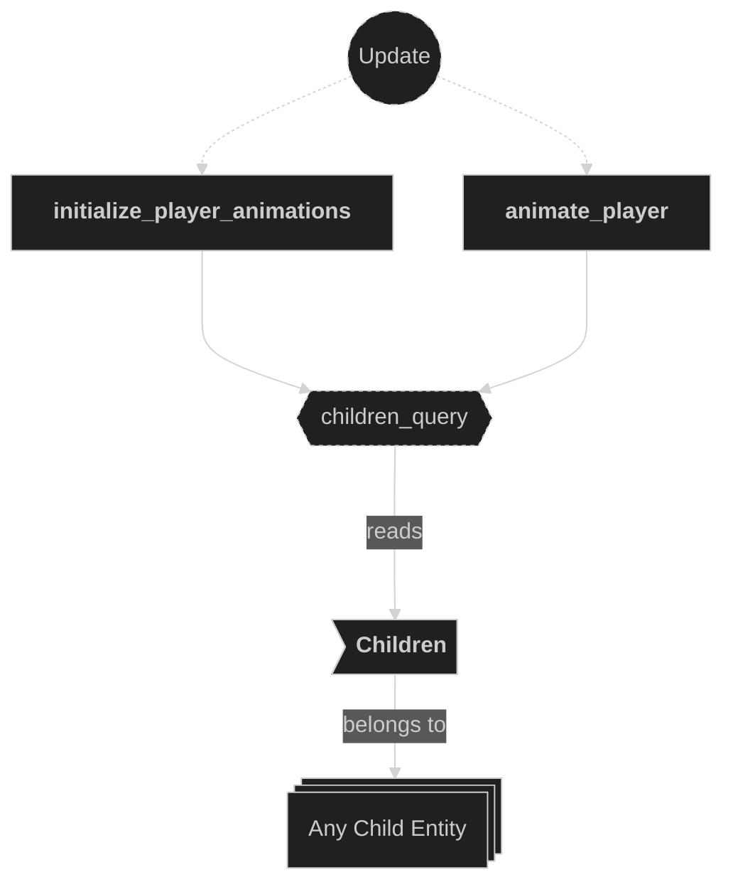
```mermaid
---
config:
  theme: dark
---

flowchart TD
classDef system-group stroke-dasharray: 5 5
classDef query stroke-dasharray: 3 3

update(("`Update`")):::system-group
initialize_player_animations["`**initialize_player_animations**`"]
animate_player["`**animate_player**`"]

update -.-> initialize_player_animations
update -.-> animate_player

children_query{{"`children_query`"}}:::query
initialize_player_animations ---> children_query
animate_player ---> children_query

child_entity@{ shape: st-rect, label: "Any Child Entity" }

ch_children>"`**Children**`"] --> |belongs to| child_entity

children_query ---> |reads| ch_children
```

### Query child Sprite (attach)

Used in the following systems:
- **initialize_player_animations**: used to find the descendant entity carrying a `Sprite` and retrieve its `image` handle to build the `Spritesheet`

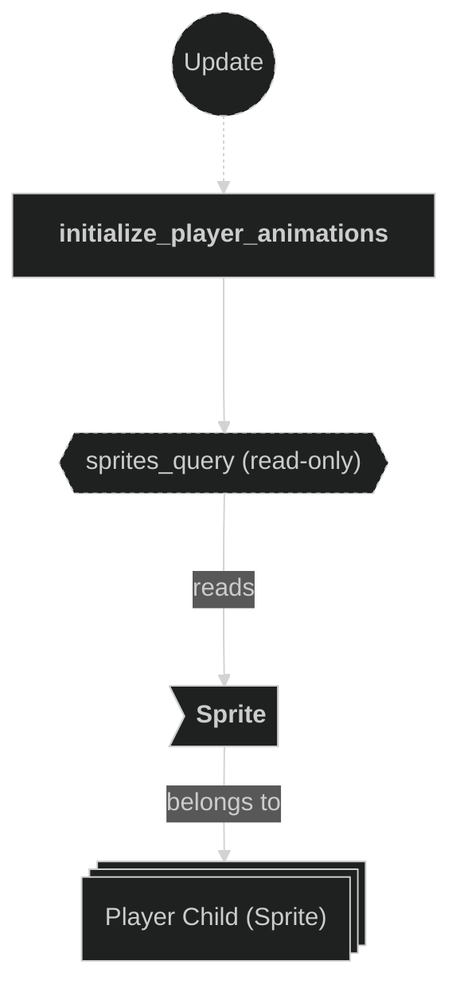
```mermaid
---
config:
  theme: dark
---

flowchart TD
classDef system-group stroke-dasharray: 5 5
classDef query stroke-dasharray: 3 3

update(("`Update`")):::system-group
initialize_player_animations["`**initialize_player_animations**`"]

update -.-> initialize_player_animations

sprites_query{{"`sprites_query (read-only)`"}}:::query
initialize_player_animations ---> sprites_query

child_entity@{ shape: st-rect, label: "Player Child (Sprite)" }

ce_sprite>"`**Sprite**`"] --> |belongs to| child_entity

sprites_query ---> |reads| ce_sprite
```

### Query child Sprite and SpritesheetAnimation (update)

Used in the following systems:
- **animate_player**: used to mutably access `Sprite::flip_x` and switch the active `SpritesheetAnimation` clip on the child sprite entity

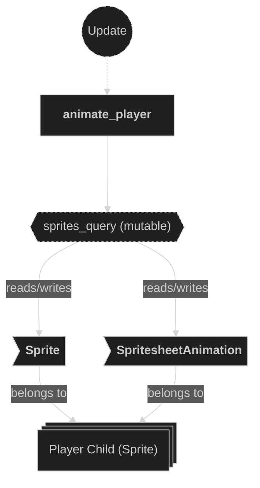
```mermaid
---
config:
  theme: dark
---

flowchart TD
classDef system-group stroke-dasharray: 5 5
classDef query stroke-dasharray: 3 3

update(("`Update`")):::system-group
animate_player["`**animate_player**`"]

update -.-> animate_player

sprites_query{{"`sprites_query (mutable)`"}}:::query
animate_player ---> sprites_query

child_entity@{ shape: st-rect, label: "Player Child (Sprite)" }

ce_sprite>"`**Sprite**`"] --> |belongs to| child_entity
ce_anim>"`**SpritesheetAnimation**`"] --> |belongs to| child_entity

sprites_query ---> |reads/writes| ce_sprite
sprites_query ---> |reads/writes| ce_anim
```

### Read MapInfo resource

Used in the following systems:
- **animate_claimed_tile**: used to resolve the `GridCoords` in the `BeamResolved` message to a claimed tile entity via `MapInfo::claimed_entities`
- **animate_unclaimed_tile**: reads `MapInfo::map_size` to find the board center when computing each tile's radial revert delay

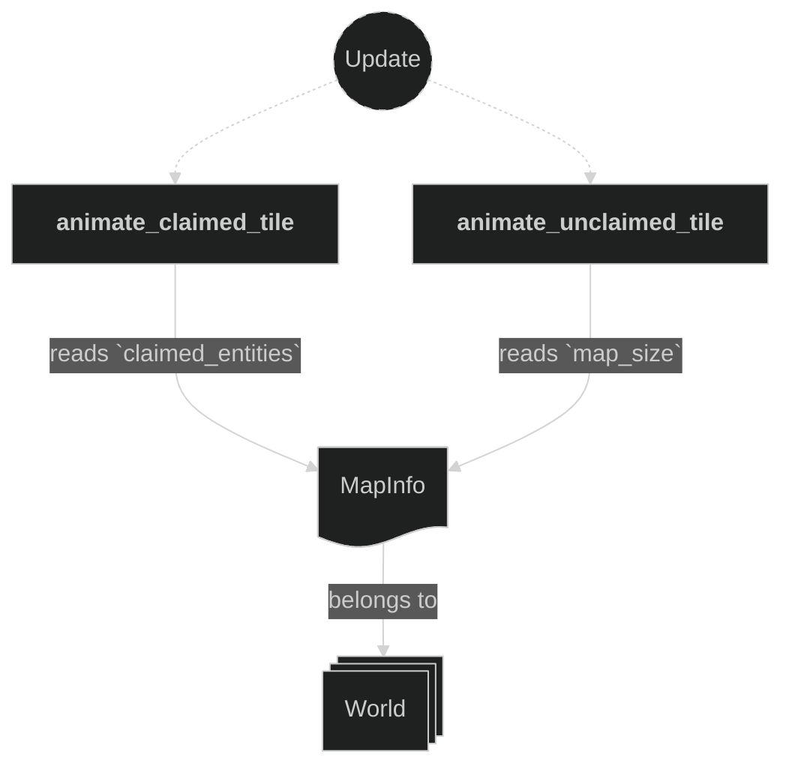
```mermaid
---
config:
  theme: dark
---

flowchart TD
classDef system-group stroke-dasharray: 5 5

update(("`Update`")):::system-group
animate_claimed_tile["`**animate_claimed_tile**`"]
animate_unclaimed_tile["`**animate_unclaimed_tile**`"]

update -.-> animate_claimed_tile
update -.-> animate_unclaimed_tile

world@{ shape: st-rect, label: "World" }
map_info_res@{ shape: doc, label: "MapInfo" }

map_info_res --> |belongs to| world

animate_claimed_tile ---> |reads `claimed_entities`| map_info_res
animate_unclaimed_tile ---> |reads `map_size`| map_info_res
```

### Read PlayerOneAnimations and PlayerTwoAnimations resources

Used in the following systems:
- **animate_player**: used to retrieve the animation clip handles for each player; accessed via `If<Res<...>>` (optional — skipped if not yet inserted)

```mermaid
---
config:
  theme: dark
---

flowchart TD
classDef system-group stroke-dasharray: 5 5

update(("`Update`")):::system-group
animate_player["`**animate_player**`"]

update -.-> animate_player

world@{ shape: st-rect, label: "World" }

p1_res@{ shape: doc, label: "PlayerOneAnimations" }
p2_res@{ shape: doc, label: "PlayerTwoAnimations" }

p1_idle_x>"`**idle_x**`"]
p1_idle_up>"`**idle_up**`"]
p1_idle_down>"`**idle_down**`"]

p2_idle_x>"`**idle_x**`"]
p2_idle_up>"`**idle_up**`"]
p2_idle_down>"`**idle_down**`"]

p1_res --> |belongs to| world
p2_res --> |belongs to| world
p1_idle_x --> |field of| p1_res
p1_idle_up --> |field of| p1_res
p1_idle_down --> |field of| p1_res
p2_idle_x --> |field of| p2_res
p2_idle_up --> |field of| p2_res
p2_idle_down --> |field of| p2_res

animate_player ---> |reads| p1_res
animate_player ---> |reads| p2_res
```

### Read ClaimedTileAnimations resource

Used in the following systems:
- **animate_claimed_tile**: used to retrieve the correct player-color animation clip handle when switching a claimed tile's animation
- **animate_unclaimed_tile**: reads the `to_player_one`/`to_player_two` handles to confirm a tile is currently showing a player color before scheduling its revert
- **tick_unclaim_reverts**: reads the `from_player_one`/`from_player_two` reverse handles to switch a tile back to the neutral sprite when its delay elapses

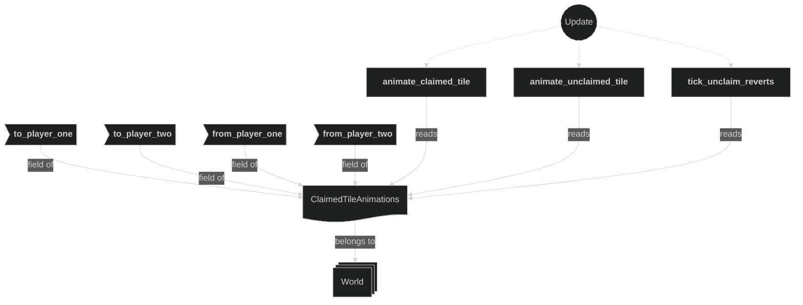
```mermaid
---
config:
  theme: dark
---

flowchart TD
classDef system-group stroke-dasharray: 5 5

update(("`Update`")):::system-group
animate_claimed_tile["`**animate_claimed_tile**`"]
animate_unclaimed_tile["`**animate_unclaimed_tile**`"]
tick_unclaim_reverts["`**tick_unclaim_reverts**`"]

update -.-> animate_claimed_tile
update -.-> animate_unclaimed_tile
update -.-> tick_unclaim_reverts

world@{ shape: st-rect, label: "World" }
ct_anims_res@{ shape: doc, label: "ClaimedTileAnimations" }

ct_anims_to1>"`**to_player_one**`"]
ct_anims_to2>"`**to_player_two**`"]
ct_anims_from1>"`**from_player_one**`"]
ct_anims_from2>"`**from_player_two**`"]

ct_anims_res --> |belongs to| world
ct_anims_to1 --> |field of| ct_anims_res
ct_anims_to2 --> |field of| ct_anims_res
ct_anims_from1 --> |field of| ct_anims_res
ct_anims_from2 --> |field of| ct_anims_res

animate_claimed_tile ---> |reads| ct_anims_res
animate_unclaimed_tile ---> |reads| ct_anims_res
tick_unclaim_reverts ---> |reads| ct_anims_res
```

### Write PlayerOneAnimations and PlayerTwoAnimations resources

Used in the following systems:
- **initialize_player_animations**: inserts `PlayerOneAnimations` or `PlayerTwoAnimations` resource into the world after building animation handles from the player's spritesheet

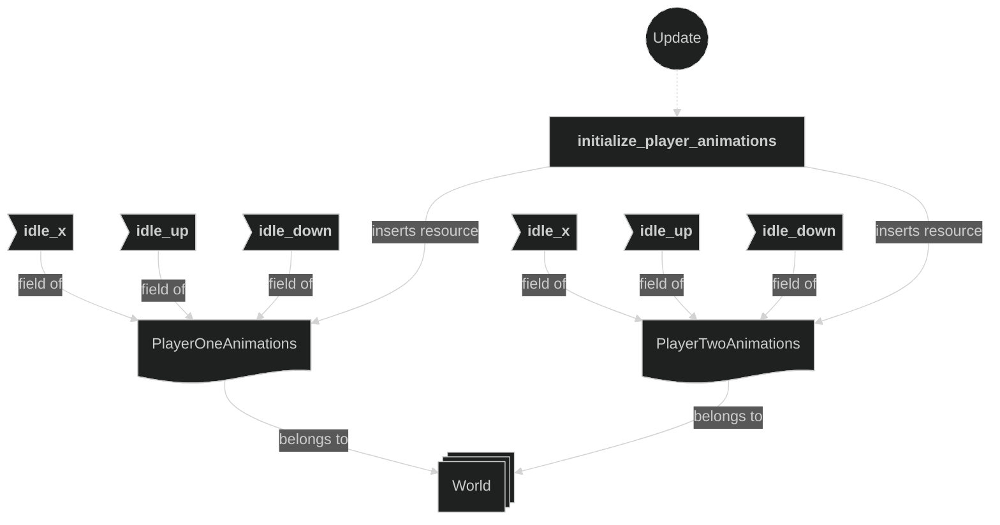
```mermaid
---
config:
  theme: dark
---

flowchart TD
classDef system-group stroke-dasharray: 5 5

update(("`Update`")):::system-group
initialize_player_animations["`**initialize_player_animations**`"]

update -.-> initialize_player_animations

world@{ shape: st-rect, label: "World" }

p1_res@{ shape: doc, label: "PlayerOneAnimations" }
p2_res@{ shape: doc, label: "PlayerTwoAnimations" }

p1_idle_x>"`**idle_x**`"]
p1_idle_up>"`**idle_up**`"]
p1_idle_down>"`**idle_down**`"]

p2_idle_x>"`**idle_x**`"]
p2_idle_up>"`**idle_up**`"]
p2_idle_down>"`**idle_down**`"]

p1_res --> |belongs to| world
p2_res --> |belongs to| world
p1_idle_x --> |field of| p1_res
p1_idle_up --> |field of| p1_res
p1_idle_down --> |field of| p1_res
p2_idle_x --> |field of| p2_res
p2_idle_up --> |field of| p2_res
p2_idle_down --> |field of| p2_res

initialize_player_animations ---> |inserts resource| p1_res
initialize_player_animations ---> |inserts resource| p2_res
```

### Write ClaimedTileAnimations resource

Used in the following systems:
- **initialize_claimed_tile_animations**: builds and inserts the `ClaimedTileAnimations` resource into the world with clip handles for each player color

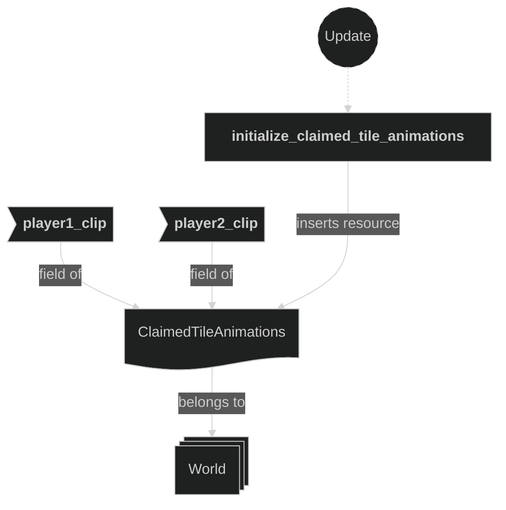
```mermaid
---
config:
  theme: dark
---

flowchart TD
classDef system-group stroke-dasharray: 5 5

update(("`Update`")):::system-group
initialize_claimed_tile_animations["`**initialize_claimed_tile_animations**`"]

update -.-> initialize_claimed_tile_animations

world@{ shape: st-rect, label: "World" }
ct_anims_res@{ shape: doc, label: "ClaimedTileAnimations" }

ct_anims_player1>"`**player1_clip**`"]
ct_anims_player2>"`**player2_clip**`"]

ct_anims_res --> |belongs to| world
ct_anims_player1 --> |field of| ct_anims_res
ct_anims_player2 --> |field of| ct_anims_res

initialize_claimed_tile_animations ---> |inserts resource| ct_anims_res
```

### Write commands (attach player animations)

Used in the following systems:
- **initialize_player_animations**: inserts `SpritesheetAnimation` on the child sprite entity after building the animation handles

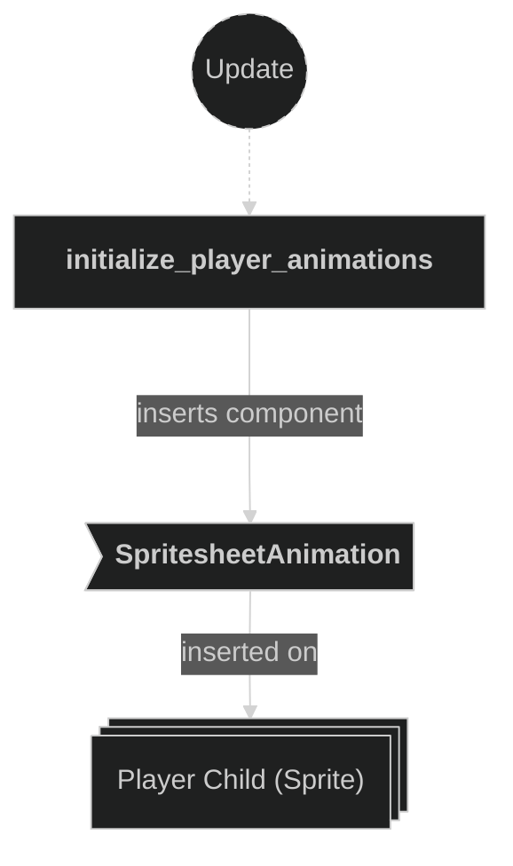
```mermaid
---
config:
  theme: dark
---

flowchart TD
classDef system-group stroke-dasharray: 5 5

update(("`Update`")):::system-group
initialize_player_animations["`**initialize_player_animations**`"]

update -.-> initialize_player_animations

child_entity@{ shape: st-rect, label: "Player Child (Sprite)" }

ce_anim>"`**SpritesheetAnimation**`"]

ce_anim --> |inserted on| child_entity

initialize_player_animations ---> |inserts component| ce_anim
```

### Write commands (attach claimed tile animations)

Used in the following systems:
- **initialize_claimed_tile_animations**: inserts `SpritesheetAnimation`, `Sprite`, and `BounceEffect` on each newly added `ClaimedTile` entity

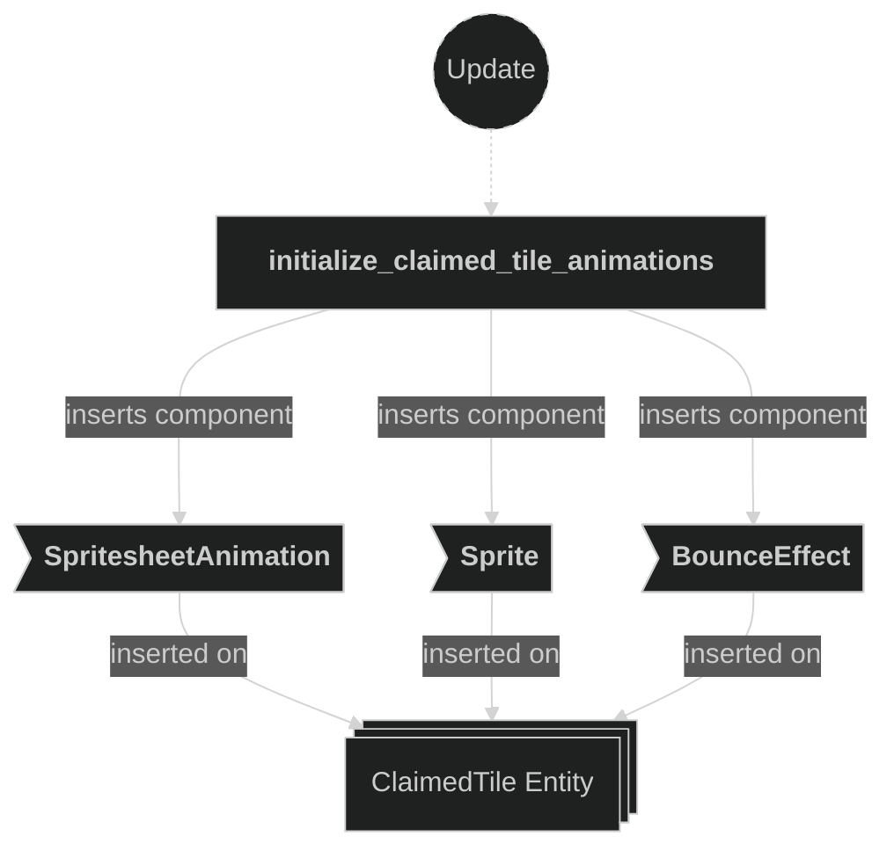
```mermaid
---
config:
  theme: dark
---

flowchart TD
classDef system-group stroke-dasharray: 5 5

update(("`Update`")):::system-group
initialize_claimed_tile_animations["`**initialize_claimed_tile_animations**`"]

update -.-> initialize_claimed_tile_animations

claimed_tile_entity@{ shape: st-rect, label: "ClaimedTile Entity" }

ct_anim>"`**SpritesheetAnimation**`"]
ct_sprite>"`**Sprite**`"]
ct_bounce>"`**BounceEffect**`"]

ct_anim --> |inserted on| claimed_tile_entity
ct_sprite --> |inserted on| claimed_tile_entity
ct_bounce --> |inserted on| claimed_tile_entity

initialize_claimed_tile_animations ---> |inserts component| ct_anim
initialize_claimed_tile_animations ---> |inserts component| ct_sprite
initialize_claimed_tile_animations ---> |inserts component| ct_bounce
```

### Write commands (update claimed tile animation)

Used in the following systems:
- **animate_claimed_tile**: switches the `SpritesheetAnimation` clip and inserts `BounceEffectTarget` on the resolved claimed tile entity when a `BeamResolved` message is received

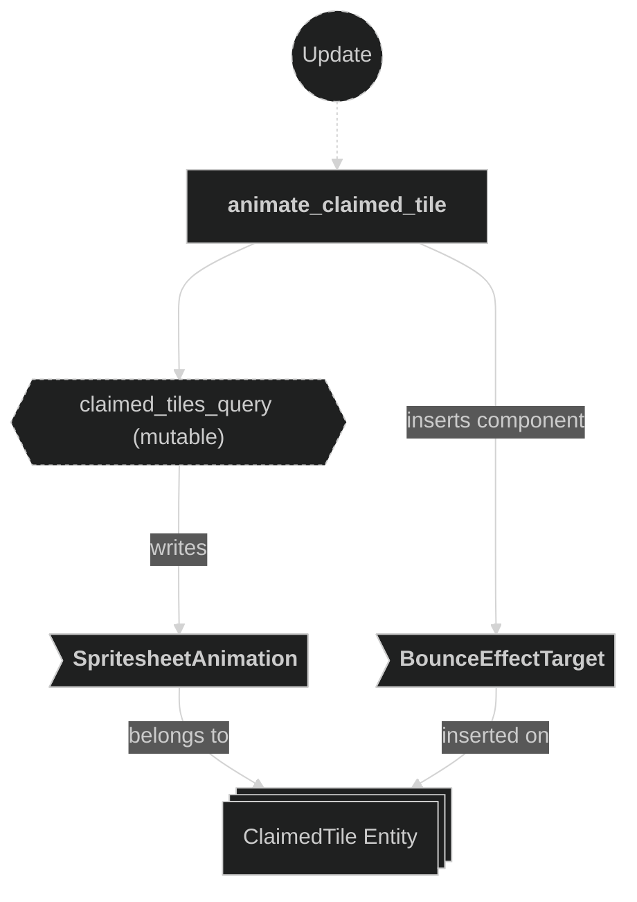
```mermaid
---
config:
  theme: dark
---

flowchart TD
classDef system-group stroke-dasharray: 5 5
classDef query stroke-dasharray: 3 3

update(("`Update`")):::system-group
animate_claimed_tile["`**animate_claimed_tile**`"]

update -.-> animate_claimed_tile

claimed_tiles_query{{"`claimed_tiles_query (mutable)`"}}:::query
animate_claimed_tile ---> claimed_tiles_query

claimed_tile_entity@{ shape: st-rect, label: "ClaimedTile Entity" }

ct_anim>"`**SpritesheetAnimation**`"]
ct_bounce_target>"`**BounceEffectTarget**`"]

ct_anim --> |belongs to| claimed_tile_entity
ct_bounce_target --> |inserted on| claimed_tile_entity

claimed_tiles_query ---> |writes| ct_anim
animate_claimed_tile ---> |inserts component| ct_bounce_target
```

### Query ClaimedTile entities (schedule revert)

Used in the following systems:
- **animate_unclaimed_tile**: reacts to `Changed<ClaimedTile>` to find tiles whose ownership was just cleared, reading their `GridCoords` and `SpritesheetAnimation` to compute the radial delay and confirm the tile is still colored

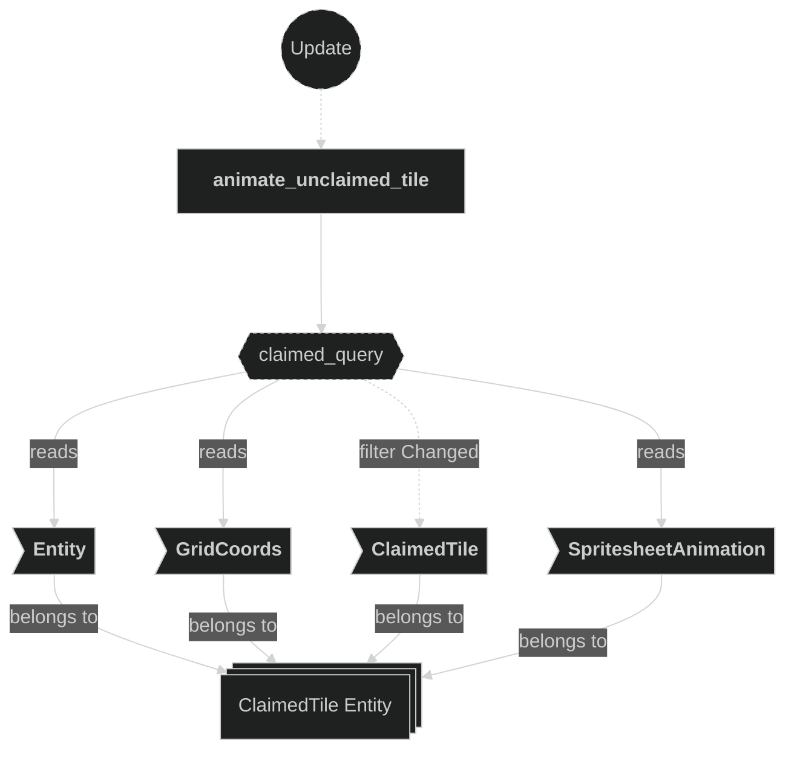
```mermaid
---
config:
  theme: dark
---

flowchart TD
classDef system-group stroke-dasharray: 5 5
classDef query stroke-dasharray: 3 3

update(("`Update`")):::system-group
animate_unclaimed_tile["`**animate_unclaimed_tile**`"]

update -.-> animate_unclaimed_tile

claimed_tiles_query{{"`claimed_query`"}}:::query
animate_unclaimed_tile ---> claimed_tiles_query

claimed_tile_entity@{ shape: st-rect, label: "ClaimedTile Entity" }

ct_entity>"`**Entity**`"] --> |belongs to| claimed_tile_entity
ct_coords>"`**GridCoords**`"] --> |belongs to| claimed_tile_entity
ct_claimed>"`**ClaimedTile**`"] --> |belongs to| claimed_tile_entity
ct_anim>"`**SpritesheetAnimation**`"] --> |belongs to| claimed_tile_entity

claimed_tiles_query ---> |reads| ct_entity
claimed_tiles_query ---> |reads| ct_coords
claimed_tiles_query ---> |reads| ct_anim
claimed_tiles_query -..-> |filter Changed| ct_claimed
```

### Query UnclaimRevert entities

Used in the following systems:
- **tick_unclaim_reverts**: iterates tiles carrying a scheduled `UnclaimRevert` timer, mutating the timer and (when it elapses) the `SpritesheetAnimation`, and reading `ClaimedTile` to confirm the tile is still unowned

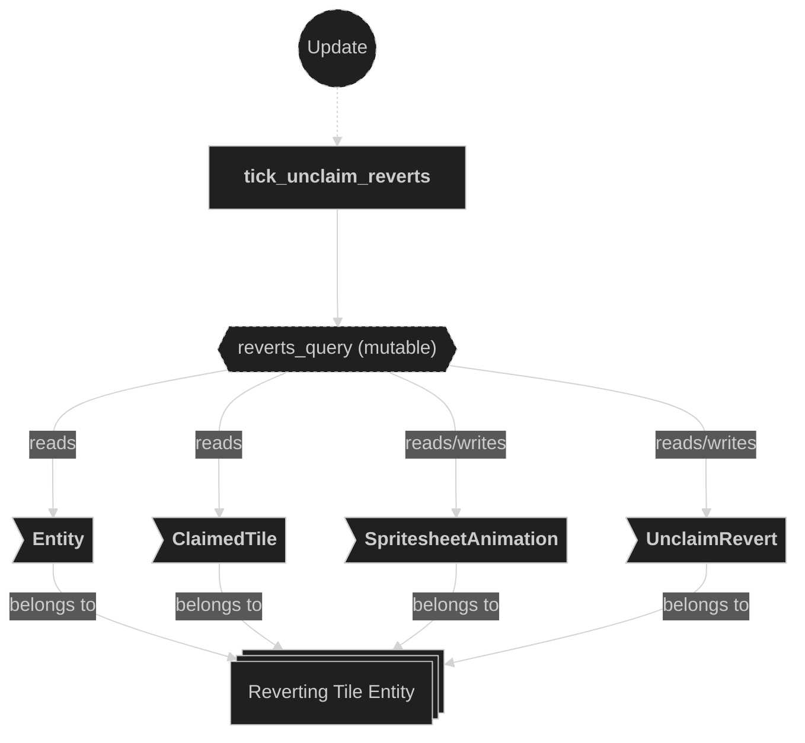
```mermaid
---
config:
  theme: dark
---

flowchart TD
classDef system-group stroke-dasharray: 5 5
classDef query stroke-dasharray: 3 3

update(("`Update`")):::system-group
tick_unclaim_reverts["`**tick_unclaim_reverts**`"]

update -.-> tick_unclaim_reverts

reverts_query{{"`reverts_query (mutable)`"}}:::query
tick_unclaim_reverts ---> reverts_query

revert_tile_entity@{ shape: st-rect, label: "Reverting Tile Entity" }

rt_entity>"`**Entity**`"] --> |belongs to| revert_tile_entity
rt_claimed>"`**ClaimedTile**`"] --> |belongs to| revert_tile_entity
rt_anim>"`**SpritesheetAnimation**`"] --> |belongs to| revert_tile_entity
rt_revert>"`**UnclaimRevert**`"] --> |belongs to| revert_tile_entity

reverts_query ---> |reads| rt_entity
reverts_query ---> |reads| rt_claimed
reverts_query ---> |reads/writes| rt_anim
reverts_query ---> |reads/writes| rt_revert
```

### Write commands (schedule unclaim revert)

Used in the following systems:
- **animate_unclaimed_tile**: inserts an `UnclaimRevert` timer component on each just-unclaimed, still-colored tile, its duration set by the tile's distance from the board center

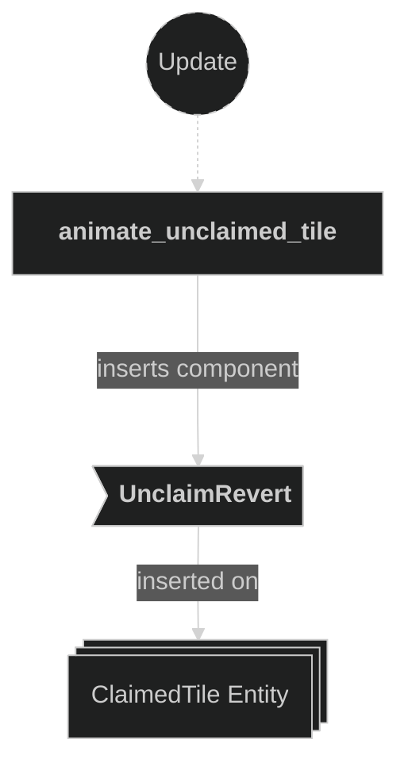
```mermaid
---
config:
  theme: dark
---

flowchart TD
classDef system-group stroke-dasharray: 5 5

update(("`Update`")):::system-group
animate_unclaimed_tile["`**animate_unclaimed_tile**`"]

update -.-> animate_unclaimed_tile

claimed_tile_entity@{ shape: st-rect, label: "ClaimedTile Entity" }

ct_revert>"`**UnclaimRevert**`"]

ct_revert --> |inserted on| claimed_tile_entity

animate_unclaimed_tile ---> |inserts component| ct_revert
```

### Write commands (revert unclaimed tile)

Used in the following systems:
- **tick_unclaim_reverts**: when a tile's `UnclaimRevert` timer elapses, switches its `SpritesheetAnimation` to the reverse clip (only if still unowned) and removes the `UnclaimRevert` component

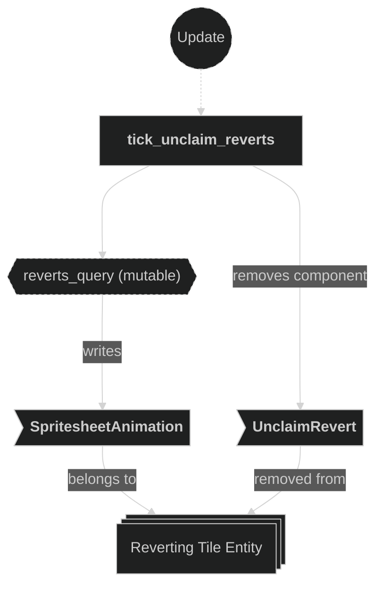
```mermaid
---
config:
  theme: dark
---

flowchart TD
classDef system-group stroke-dasharray: 5 5
classDef query stroke-dasharray: 3 3

update(("`Update`")):::system-group
tick_unclaim_reverts["`**tick_unclaim_reverts**`"]

update -.-> tick_unclaim_reverts

reverts_query{{"`reverts_query (mutable)`"}}:::query
tick_unclaim_reverts ---> reverts_query

revert_tile_entity@{ shape: st-rect, label: "Reverting Tile Entity" }

rt_anim>"`**SpritesheetAnimation**`"]
rt_revert>"`**UnclaimRevert**`"]

rt_anim --> |belongs to| revert_tile_entity
rt_revert --> |removed from| revert_tile_entity

reverts_query ---> |writes| rt_anim
tick_unclaim_reverts ---> |removes component| rt_revert
```
