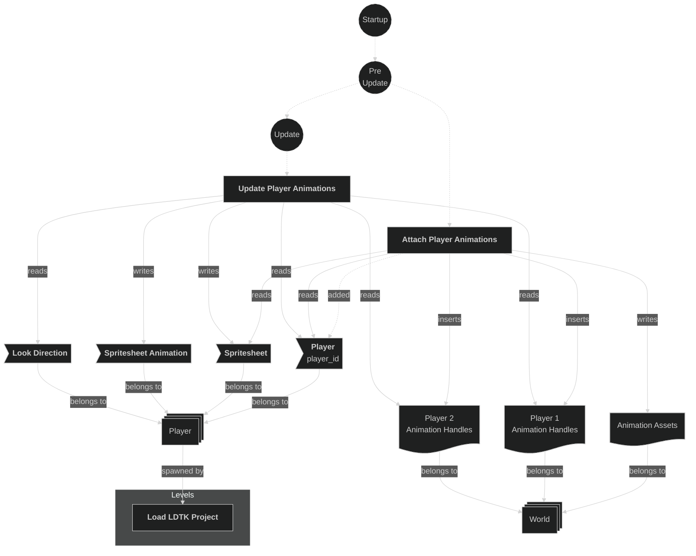

```mermaid
---
config:
  theme: dark
---

flowchart TD

%% dash for system groups
classDef system-group stroke-dasharray: 5 5

%%%%%%%%%%%%%%%%%%%%%%%
%%     Resources     %%
%%%%%%%%%%%%%%%%%%%%%%%

animation_assets@{ shape: doc, label: "Animation Assets" } --> |belongs to| world
player_1_animations@{ shape: doc, label: "Player 1<br> Animation Handles" } --> |belongs to| world
player_2_animations@{ shape: doc, label: "Player 2<br> Animation Handles" } --> |belongs to| world


%%%%%%%%%%%%%%%%%%%%%%%%%%%%
%%  Entities & Components %%
%%%%%%%%%%%%%%%%%%%%%%%%%%%%

world@{ shape: st-rect, label: "World" }

%% Player entity
player_entity@{ shape: st-rect, label: "Player" } 
pe_player_component>"`**Player**<br>player_id`"] --> |belongs to| player_entity
pe_sprite_component>"`**Spritesheet**`"] --> |belongs to| player_entity
pe_spritesheet_animation_component>"`**Spritesheet Animation**`"] --> |belongs to| player_entity
pe_look_direction_component>"`**Look Direction**`"] --> |belongs to| player_entity
player_entity --> |spawned by| load_ldtk_project

%%%%%%%%%%%%%%%%%%%%%%%
%%      Systems      %%
%%%%%%%%%%%%%%%%%%%%%%%

startup((Startup)):::system-group -.-> preupdate(("`Pre<br>Update`")):::system-group -.-> update(("`Update`")):::system-group

attach_player_animations["`**Attach Player Animations**`"]
update_player_animation["`**Update Player Animations**`"]

preupdate -.-> attach_player_animations
update -.-> update_player_animation

attach_player_animations -..-> |added| pe_player_component
attach_player_animations ---> |writes| animation_assets
attach_player_animations ---> |reads| pe_player_component
attach_player_animations ---> |reads| pe_sprite_component
attach_player_animations ---> |inserts| player_1_animations &  player_2_animations

update_player_animation ----> |reads| pe_player_component
update_player_animation ----> |writes| pe_sprite_component
update_player_animation -----> |reads| player_1_animations & player_2_animations
update_player_animation ----> |reads| pe_look_direction_component
update_player_animation ----> |writes| pe_spritesheet_animation_component

subgraph Levels
    load_ldtk_project["`**Load LDTK Project**`"]
end

%%startup -.-> load_ldtk_project
```
