# Animations Plugin

Contains systems responsible for attaching and updating spritesheet animations on player entities and claimed tile entities. This plugin reacts to the `ObjectCreated` Tiled event to initialize per-player animation handle resources, drives the active player animation each frame based on the player's current `LookDirection`, and manages animations for claimed tiles in reaction to `BeamResolved` messages.

## Plugin workflow

- Update phase
    - Attach Player Animations:
        - Reacts to `TiledEvent<ObjectCreated>` message
            - Reads:
                - All `Player`-marked `TiledObject` entities and their `Entity` + `Player` components
                - The `Sprite` component on each player's child sprite entity (to get the image handle)
            - Writes:
                - Inserts `PlayerOneAnimations` or `PlayerTwoAnimations` resource into the world
                - Inserts `SpritesheetAnimation` on the child sprite entity
    - Update Players Animation:
        - Runs every frame
            - Reads:
                - All `Player`-marked entities with `LookDirection`
                - `PlayerOneAnimations` and `PlayerTwoAnimations` resources (optional/`If`)
                - `Sprite` and `SpritesheetAnimation` on descendant sprite entities
            - Writes:
                - Updates `SpritesheetAnimation` (switches active clip)
                - Updates `Sprite::flip_x` for left/right facing directions
    - Attach Claimed Tile Animations:
        - Reacts to `Added<ClaimedTile>` on newly spawned claimed tile entities
            - Reads:
                - `ClaimedTile` entity and its components
            - Writes:
                - Builds `ClaimedTileAnimations` resource
                - Inserts `SpritesheetAnimation`, `Sprite`, and `BounceEffect` on the claimed tile entity
    - Update Claimed Tile Animation:
        - Reacts to `BeamResolved` messages
            - Reads:
                - `BeamResolved` message fields (`position`, `owner`)
                - `MapInfo` resource (to resolve `GridCoords` → claimed tile `Entity` via `claimed_entities`)
                - `ClaimedTileAnimations` resource
            - Writes:
                - Switches `SpritesheetAnimation` clip on the claimed tile entity to the player-color animation
                - Inserts `BounceEffectTarget` on the claimed tile entity

## Plugin Systems

### Attach Player Animations

Reacts to the `TiledEvent<ObjectCreated>` message emitted by the Tiled loader when a player object is created. For each matching `Player`-marked `TiledObject` entity, it walks the entity hierarchy to find the child entity carrying a `Sprite`, reads its image handle to build a `Spritesheet`, then creates idle animation handles for the three directional variants (`idle_x`, `idle_down`, `idle_up`). It stores these handles in a per-player resource (`PlayerOneAnimations` or `PlayerTwoAnimations`) and inserts a `SpritesheetAnimation` on the child sprite entity with the initial idle clip.

### Update Players Animation

Runs every frame. For each `Player`-marked `TiledObject` entity, it walks the entity hierarchy to find the descendant with a `Sprite` and `SpritesheetAnimation`, then switches the active animation clip based on the player's current `LookDirection`. It also sets `Sprite::flip_x` to mirror the horizontal idle sprite when the player faces left.

### Attach Claimed Tile Animations

Reacts to `Added<ClaimedTile>` — fires once for each newly spawned claimed tile entity. Builds the `ClaimedTileAnimations` resource (if not already present) containing animation clip handles for each player color variant. Inserts `SpritesheetAnimation` (with the neutral/default clip), `Sprite`, and `BounceEffect` on the claimed tile entity so it is ready to display ownership animations.

### Update Claimed Tile Animation

Reads `BeamResolved` messages. For each message, resolves the claimed tile entity from `MapInfo::claimed_entities` using the message's `GridCoords` position. Reads the `ClaimedTileAnimations` resource to select the correct player-color clip based on the owning player id, then switches the `SpritesheetAnimation` clip on the claimed tile entity. Also inserts `BounceEffectTarget` on the claimed tile entity to trigger the bounce visual effect.

## Components, Resources and Messages CRUD

### Read TiledEvent ObjectCreated messages

Used in the following systems:
- **attach_player_animations**: used to trigger animation setup when a player Tiled object is created

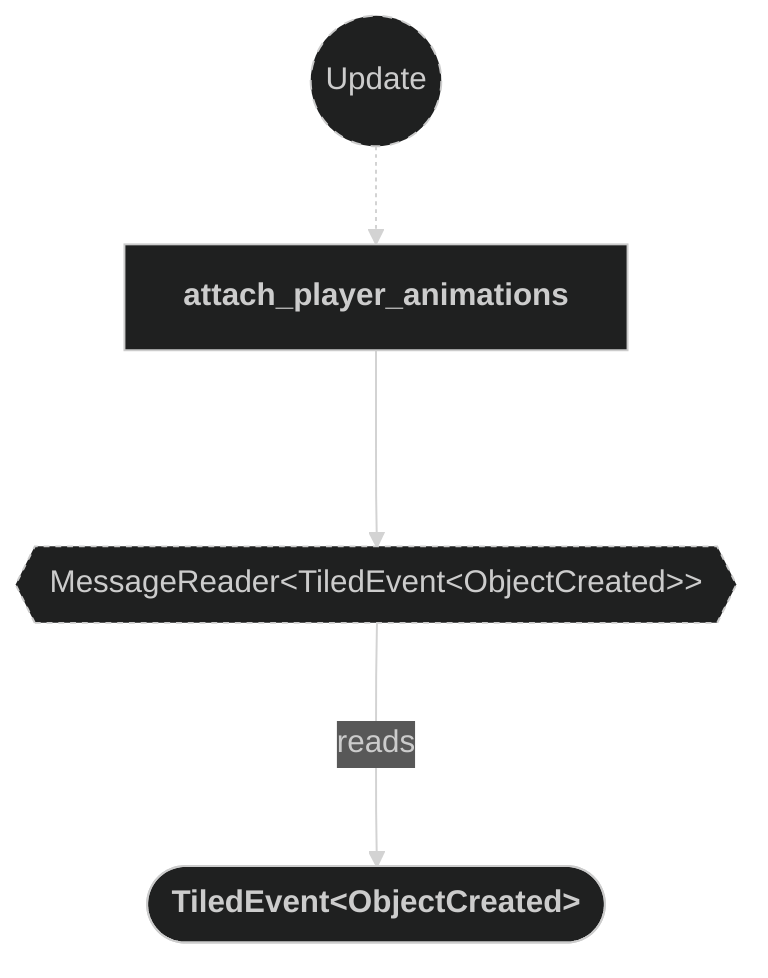

### Read BeamResolved messages

Used in the following systems:
- **update_claimed_tile_animation**: used to trigger claimed tile animation switching when a beam resolves

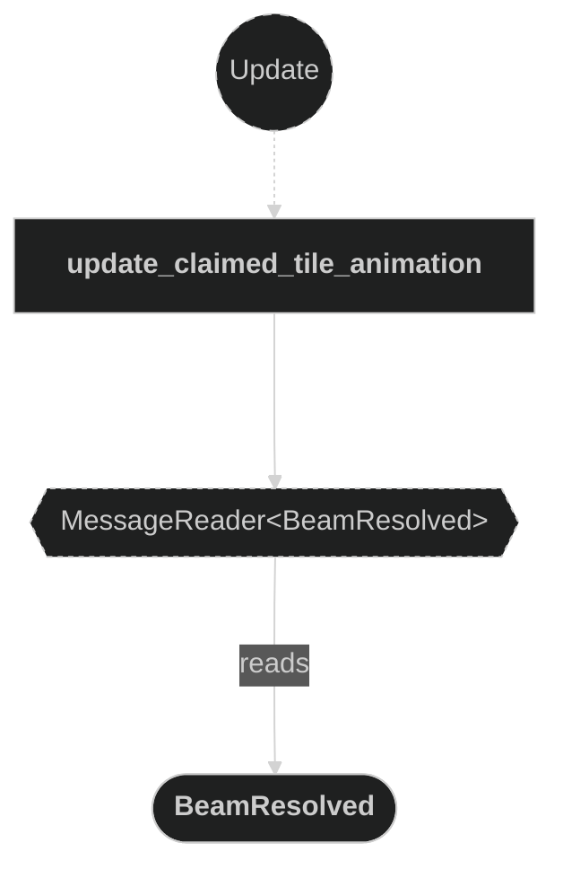

### Query Player entities (attach)

Used in the following systems:
- **attach_player_animations**: used to get the `Entity` and `Player` of each `TiledObject`-marked player entity to look up the correct sprite child and build per-player animation handles

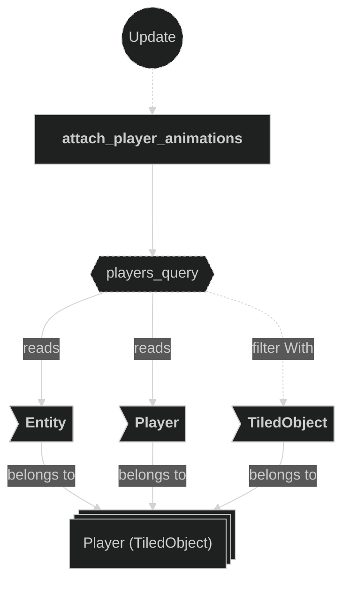

### Query Player entities (update)

Used in the following systems:
- **update_players_animation**: used to get `Entity`, `Player::player_id` and `LookDirection` of each `TiledObject`-marked player entity to decide which animation clip to activate

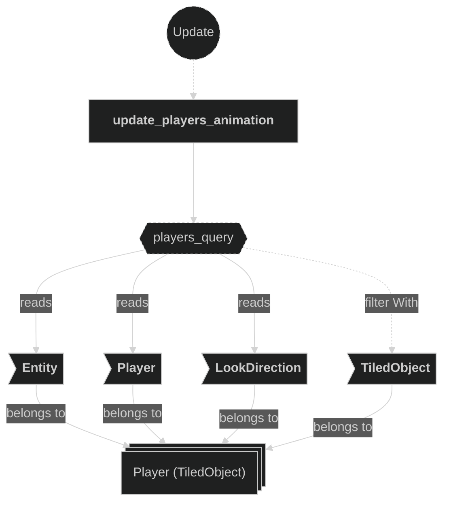

### Query ClaimedTile entities (attach)

Used in the following systems:
- **attach_claimed_tile_animations**: detects newly added `ClaimedTile` entities and initializes their animation components

### Query Children hierarchy

Used in the following systems:
- **attach_player_animations**: used to walk descendants via `iter_descendants` to find the child sprite entity
- **update_players_animation**: used to walk descendants via `iter_descendants` to find the child sprite entity

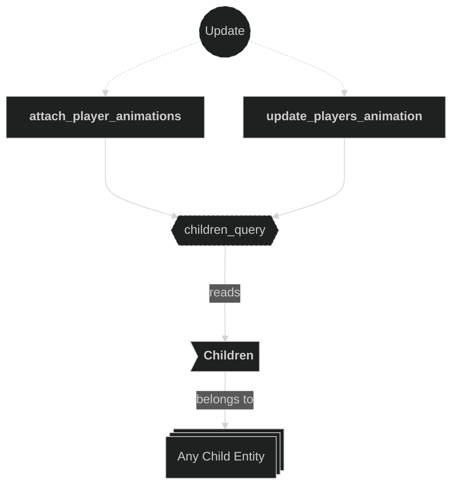

### Query child Sprite (attach)

Used in the following systems:
- **attach_player_animations**: used to find the descendant entity carrying a `Sprite` and retrieve its `image` handle to build the `Spritesheet`

### Query child Sprite and SpritesheetAnimation (update)

Used in the following systems:
- **update_players_animation**: used to mutably access `Sprite::flip_x` and switch the active `SpritesheetAnimation` clip on the child sprite entity

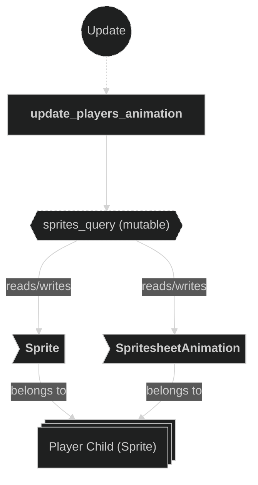

### Read MapInfo resource

Used in the following systems:
- **update_claimed_tile_animation**: used to resolve the `GridCoords` in the `BeamResolved` message to a claimed tile entity via `MapInfo::claimed_entities`

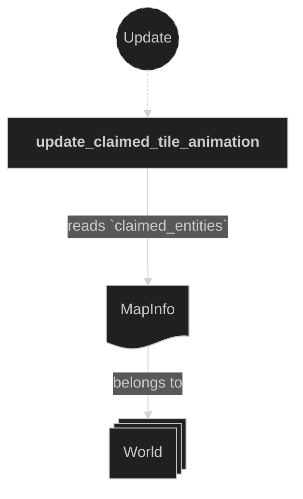

### Read PlayerOneAnimations and PlayerTwoAnimations resources

Used in the following systems:
- **update_players_animation**: used to retrieve the animation clip handles for each player; accessed via `If<Res<...>>` (optional — skipped if not yet inserted)

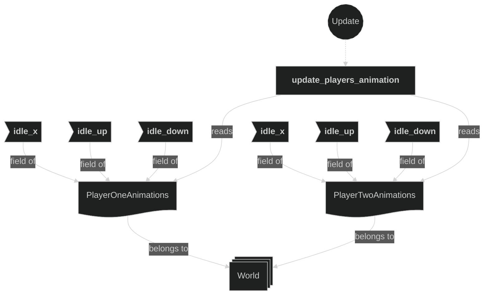

### Read ClaimedTileAnimations resource

Used in the following systems:
- **update_claimed_tile_animation**: used to retrieve the correct player-color animation clip handle when switching a claimed tile's animation

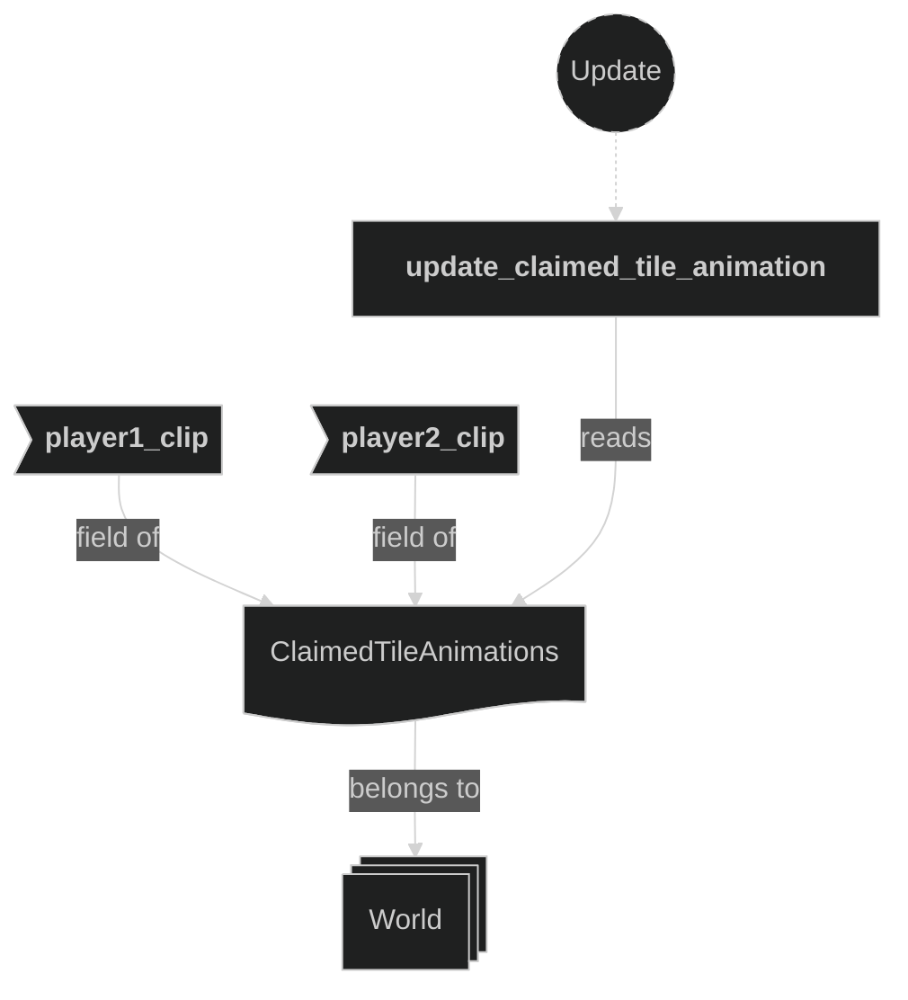

### Write PlayerOneAnimations and PlayerTwoAnimations resources

Used in the following systems:
- **attach_player_animations**: inserts `PlayerOneAnimations` or `PlayerTwoAnimations` resource into the world after building animation handles from the player's spritesheet

### Write ClaimedTileAnimations resource

Used in the following systems:
- **attach_claimed_tile_animations**: builds and inserts the `ClaimedTileAnimations` resource into the world with clip handles for each player color

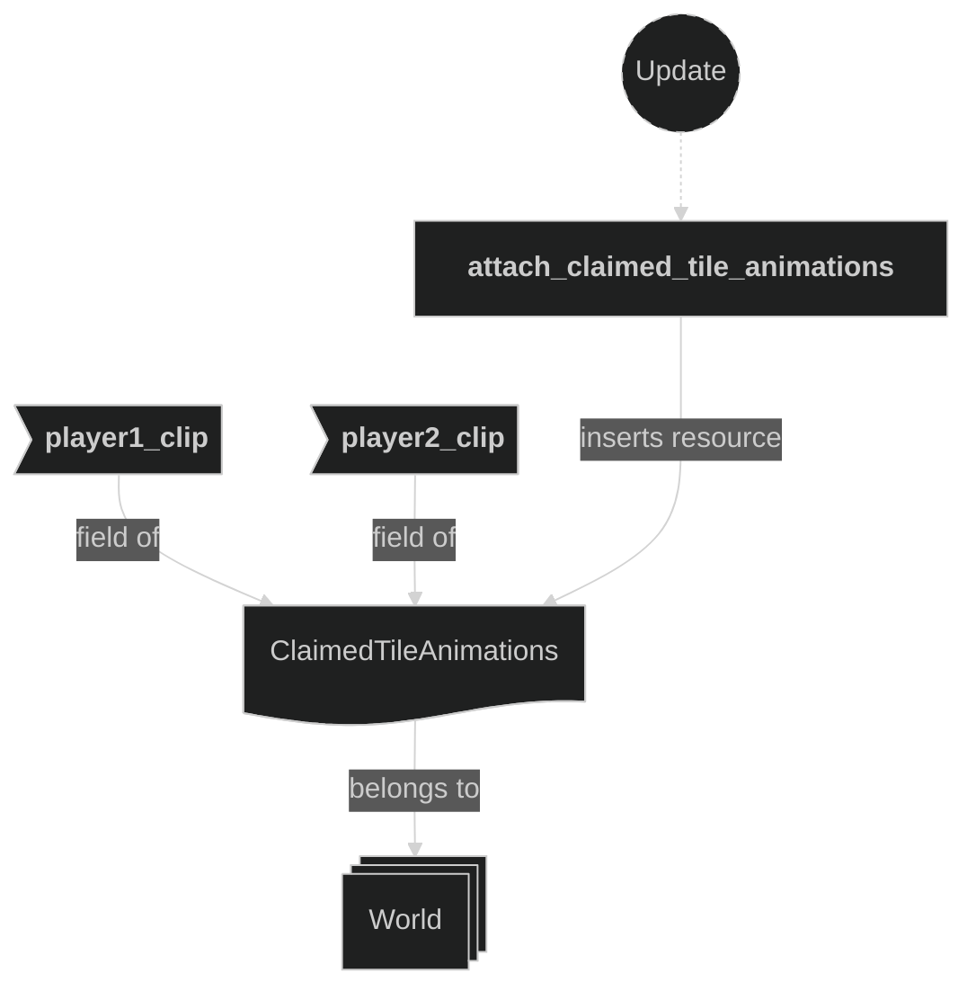

### Write commands (attach player animations)

Used in the following systems:
- **attach_player_animations**: inserts `SpritesheetAnimation` on the child sprite entity after building the animation handles

### Write commands (attach claimed tile animations)

Used in the following systems:
- **attach_claimed_tile_animations**: inserts `SpritesheetAnimation`, `Sprite`, and `BounceEffect` on each newly added `ClaimedTile` entity

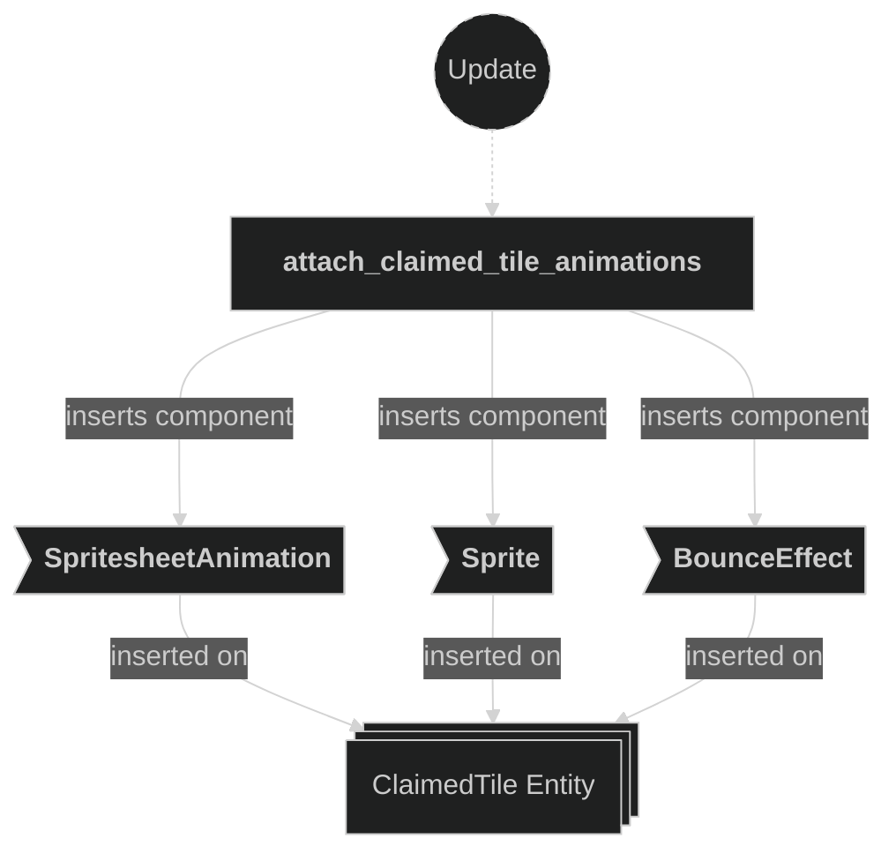

### Write commands (update claimed tile animation)

Used in the following systems:
- **update_claimed_tile_animation**: switches the `SpritesheetAnimation` clip and inserts `BounceEffectTarget` on the resolved claimed tile entity when a `BeamResolved` message is received

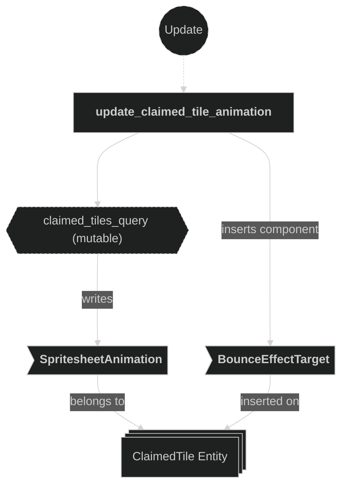
