# Animations Plugin

This plugin plays the spritesheet animations of the players and the tiles. A player shows the clip for its facing, or a 3/4 pose while it turns. A tile flips to its owner's color when claimed, and flips back in a wave from the center when the round resets.

HUD animations (bars and number counters) live in the HUD plugin.

## Ordering

- The three tile systems that react to claims run in `GameplaySet::Presentation`, after the Beam and Claim stages.
- So `animate_claimed_tile` sees a beam result in the same frame.
- And `tick_unclaim_reverts` (it turns tiles back to neutral after a reset) sees a tile claimed again in the same frame.
- `animate_unclaimed_tile` is in the same set only to keep the three together.
- The player systems and the tile setup are not in a set. Their order does not matter.

## Plugin Systems

### Initialize Player Animations

- Runs when Tiled creates a player object. Finds the player's child sprite.
- Builds three idle clips (`idle_x`, `idle_down`, `idle_up`) and two 3/4 turn poses (`diag_front`, `diag_back`).
- The turn poses are drawn facing left and mirrored for the right side.
- Stores the clips in `PlayerOneAnimations` or `PlayerTwoAnimations`, and starts the idle clip.

### Animate Player

- Runs every frame. While turning, shows the 3/4 pose. Otherwise, shows the idle clip for the facing.
- Mirrors the sprite (`flip_x`) when the player faces left.
- A turn with no step left counts as finished, so the idle clip shows on the frame the turn ends.

### Initialize Claimed Tile Animations

- Runs once for each new tile. Builds `ClaimedTileAnimations` the first time.
- Gives the tile its neutral clip, a `Sprite` and a `BounceEffect`.

### Animate Claimed Tile

- Runs for each beam result. Finds the tile in `MapInfo` and switches it to the owner's color clip.
- Adds `BounceEffectTarget`. The Effects plugin then plays the bounce directly, with no effect driver.

### Animate Unclaimed Tile

- Runs when a tile loses its owner and still shows a color. Only the round reset does this.
- It adds an `UnclaimRevert` timer. Its delay grows with the distance from the board center.
- The reset clears all tiles in the same frame. The timers spread the flips over time.
- The delays are spread over `unclaim_cascade_secs`, so the tiles revert in a wave from the center.

### Tick Unclaim Reverts

After a round reset, each colored tile waits a short time, then turns back to neutral. This system does the waiting and the turning back.

- Runs every frame. When a timer ends, plays the reverse color clip and removes `UnclaimRevert`.
- If the tile was claimed again during the wait, it stays colored.

### Lit overlay frames

- This plugin animates only the tile's own sprite.
- The Effects plugin copies the tile frame onto the overlay later, in `PostUpdate`.

## Components, Resources and Messages CRUD

### Read TiledEvent ObjectCreated messages

Used in the following systems:
- **initialize_player_animations**: starts the setup when a player object is created.

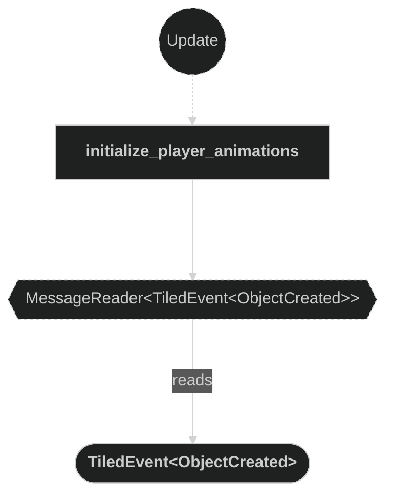
```mermaid
---
config:
  theme: dark
---

flowchart TD
classDef system-group stroke-dasharray: 5 5
classDef reader stroke-dasharray: 3 3

update(("`Update`")):::system-group
initialize_player_animations["`**initialize_player_animations**`"]

update -.-> initialize_player_animations

message_reader{{"MessageReader#60;TiledEvent#60;ObjectCreated#62;#62;"}}:::reader
initialize_player_animations ---> message_reader

object_created_message(["`**TiledEvent#60;ObjectCreated#62;**`"])

message_reader ---> |reads| object_created_message
```

### Read BeamResolved messages

Used in the following systems:
- **animate_claimed_tile**: one color switch for each beam result.

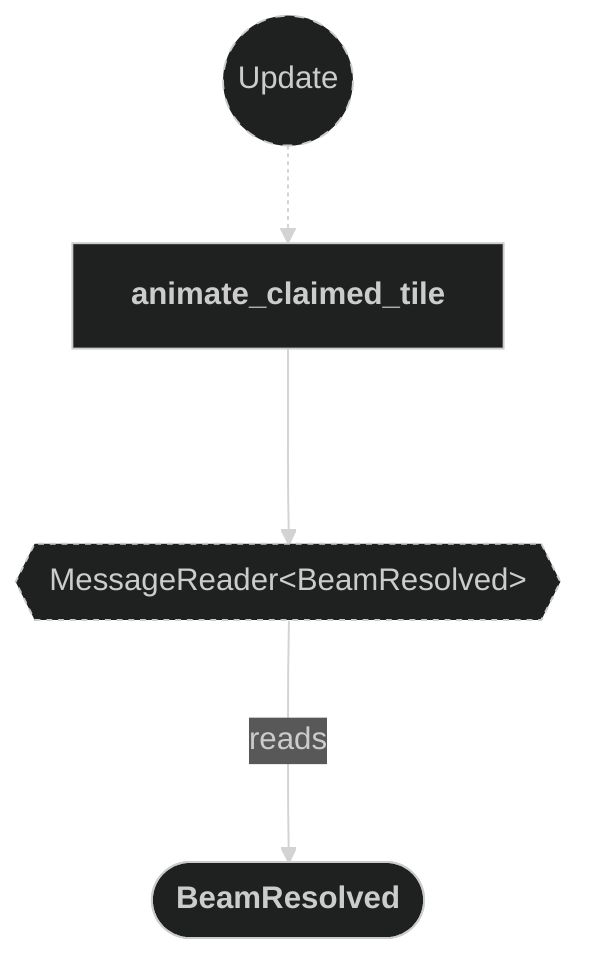
```mermaid
---
config:
  theme: dark
---

flowchart TD
classDef system-group stroke-dasharray: 5 5
classDef reader stroke-dasharray: 3 3

update(("`Update`")):::system-group
animate_claimed_tile["`**animate_claimed_tile**`"]

update -.-> animate_claimed_tile

message_reader{{"MessageReader#60;BeamResolved#62;"}}:::reader
animate_claimed_tile ---> message_reader

beam_resolved_message(["`**BeamResolved**`"])

message_reader ---> |reads| beam_resolved_message
```

### Query Player entities (attach)

Used in the following systems:
- **initialize_player_animations**: all player objects.

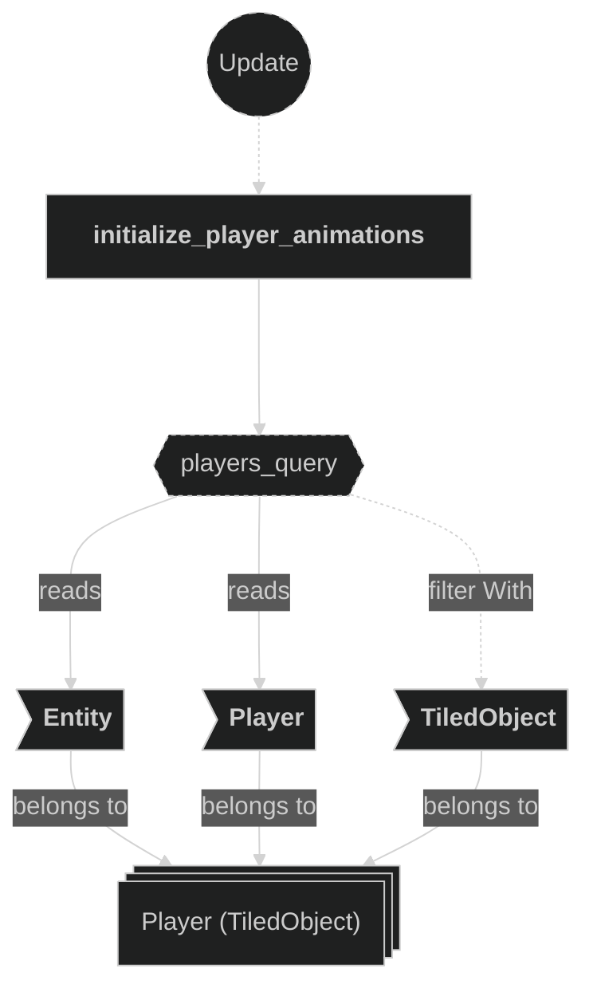
```mermaid
---
config:
  theme: dark
---

flowchart TD
classDef system-group stroke-dasharray: 5 5
classDef query stroke-dasharray: 3 3

update(("`Update`")):::system-group
initialize_player_animations["`**initialize_player_animations**`"]

update -.-> initialize_player_animations

players_query{{"`players_query`"}}:::query
initialize_player_animations ---> players_query

player_entity@{ shape: st-rect, label: "Player (TiledObject)" }

pe_entity>"`**Entity**`"] --> |belongs to| player_entity
pe_player>"`**Player**`"] --> |belongs to| player_entity
pe_tiled_object>"`**TiledObject**`"] --> |belongs to| player_entity

players_query ---> |reads| pe_entity
players_query ---> |reads| pe_player
players_query -..-> |filter With| pe_tiled_object
```

### Query Player entities (update)

Used in the following systems:
- **animate_player**: all player objects, with their facing and turn state.

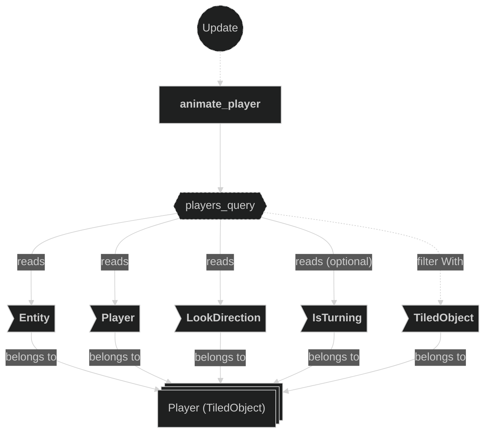
```mermaid
---
config:
  theme: dark
---

flowchart TD
classDef system-group stroke-dasharray: 5 5
classDef query stroke-dasharray: 3 3

update(("`Update`")):::system-group
animate_player["`**animate_player**`"]

update -.-> animate_player

players_query{{"`players_query`"}}:::query
animate_player ---> players_query

player_entity@{ shape: st-rect, label: "Player (TiledObject)" }

pe_entity>"`**Entity**`"] --> |belongs to| player_entity
pe_player>"`**Player**`"] --> |belongs to| player_entity
pe_look_direction>"`**LookDirection**`"] --> |belongs to| player_entity
pe_is_turning>"`**IsTurning**`"] --> |belongs to| player_entity
pe_tiled_object>"`**TiledObject**`"] --> |belongs to| player_entity

players_query ---> |reads| pe_entity
players_query ---> |reads| pe_player
players_query ---> |reads| pe_look_direction
players_query ---> |"reads (optional)"| pe_is_turning
players_query -..-> |filter With| pe_tiled_object
```

### Query ClaimedTile entities (attach)

Used in the following systems:
- **initialize_claimed_tile_animations**: tiles added this frame.

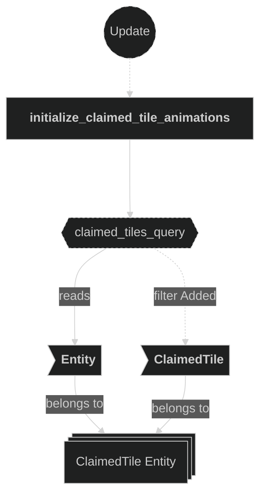
```mermaid
---
config:
  theme: dark
---

flowchart TD
classDef system-group stroke-dasharray: 5 5
classDef query stroke-dasharray: 3 3

update(("`Update`")):::system-group
initialize_claimed_tile_animations["`**initialize_claimed_tile_animations**`"]

update -.-> initialize_claimed_tile_animations

claimed_tiles_query{{"`claimed_tiles_query`"}}:::query
initialize_claimed_tile_animations ---> claimed_tiles_query

claimed_tile_entity@{ shape: st-rect, label: "ClaimedTile Entity" }

ct_entity>"`**Entity**`"] --> |belongs to| claimed_tile_entity
ct_claimed>"`**ClaimedTile**`"] --> |belongs to| claimed_tile_entity

claimed_tiles_query ---> |reads| ct_entity
claimed_tiles_query -..-> |filter Added| ct_claimed
```

### Query Children hierarchy

Used in the following systems:
- **initialize_player_animations**: finds the child sprite.
- **animate_player**: finds the child sprite.

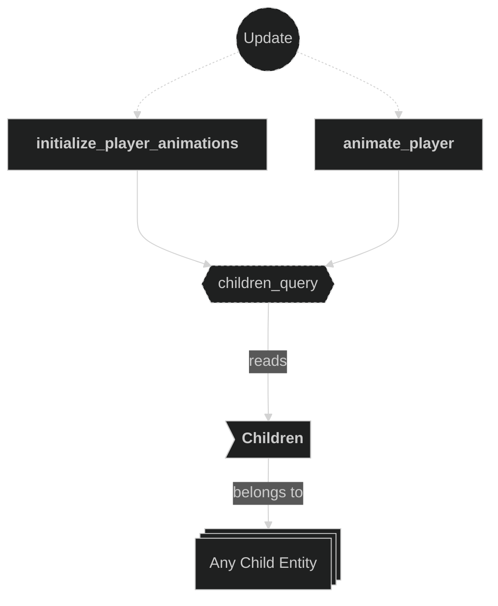
```mermaid
---
config:
  theme: dark
---

flowchart TD
classDef system-group stroke-dasharray: 5 5
classDef query stroke-dasharray: 3 3

update(("`Update`")):::system-group
initialize_player_animations["`**initialize_player_animations**`"]
animate_player["`**animate_player**`"]

update -.-> initialize_player_animations
update -.-> animate_player

children_query{{"`children_query`"}}:::query
initialize_player_animations ---> children_query
animate_player ---> children_query

child_entity@{ shape: st-rect, label: "Any Child Entity" }

ch_children>"`**Children**`"] --> |belongs to| child_entity

children_query ---> |reads| ch_children
```

### Query child Sprite (attach)

Used in the following systems:
- **initialize_player_animations**: reads the sprite image to build the spritesheet.

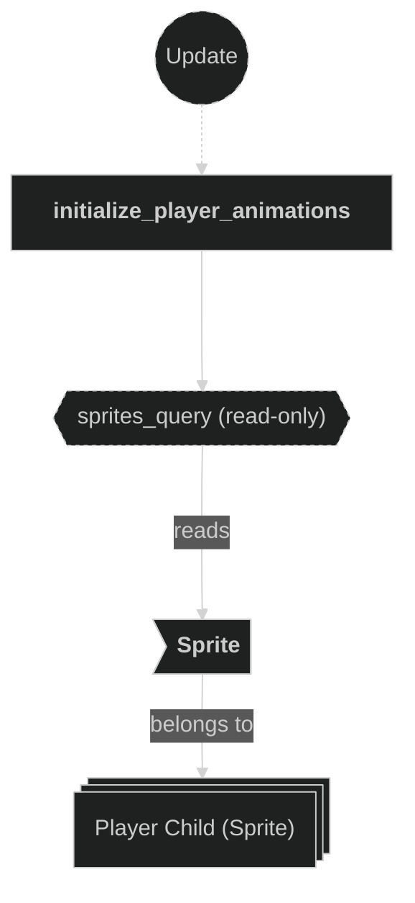
```mermaid
---
config:
  theme: dark
---

flowchart TD
classDef system-group stroke-dasharray: 5 5
classDef query stroke-dasharray: 3 3

update(("`Update`")):::system-group
initialize_player_animations["`**initialize_player_animations**`"]

update -.-> initialize_player_animations

sprites_query{{"`sprites_query (read-only)`"}}:::query
initialize_player_animations ---> sprites_query

child_entity@{ shape: st-rect, label: "Player Child (Sprite)" }

ce_sprite>"`**Sprite**`"] --> |belongs to| child_entity

sprites_query ---> |reads| ce_sprite
```

### Query child Sprite and SpritesheetAnimation (update)

Used in the following systems:
- **animate_player**: sets the clip and the mirroring.

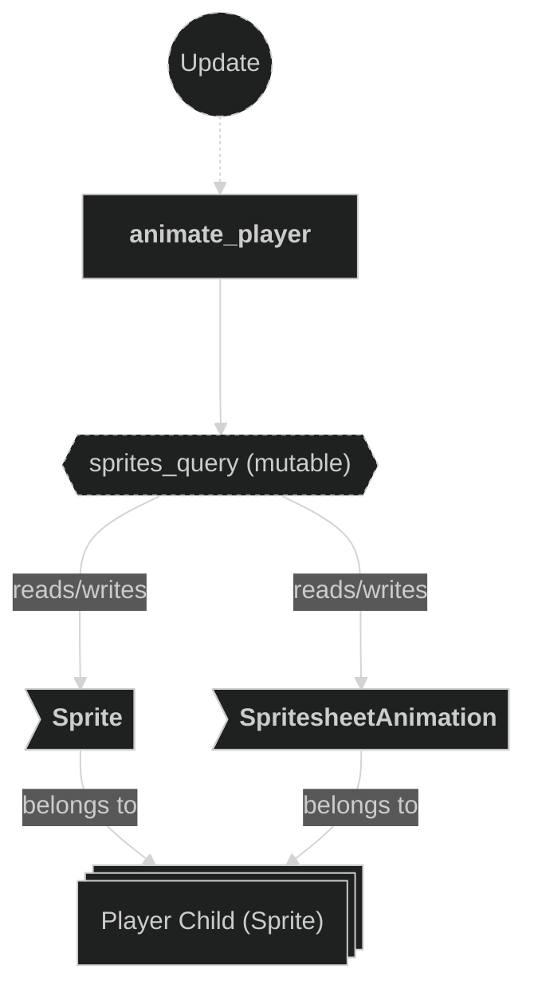
```mermaid
---
config:
  theme: dark
---

flowchart TD
classDef system-group stroke-dasharray: 5 5
classDef query stroke-dasharray: 3 3

update(("`Update`")):::system-group
animate_player["`**animate_player**`"]

update -.-> animate_player

sprites_query{{"`sprites_query (mutable)`"}}:::query
animate_player ---> sprites_query

child_entity@{ shape: st-rect, label: "Player Child (Sprite)" }

ce_sprite>"`**Sprite**`"] --> |belongs to| child_entity
ce_anim>"`**SpritesheetAnimation**`"] --> |belongs to| child_entity

sprites_query ---> |reads/writes| ce_sprite
sprites_query ---> |reads/writes| ce_anim
```

### Read MapInfo resource

Used in the following systems:
- **animate_claimed_tile**: finds the tile entity at the beam result position.
- **animate_unclaimed_tile**: finds the board center.

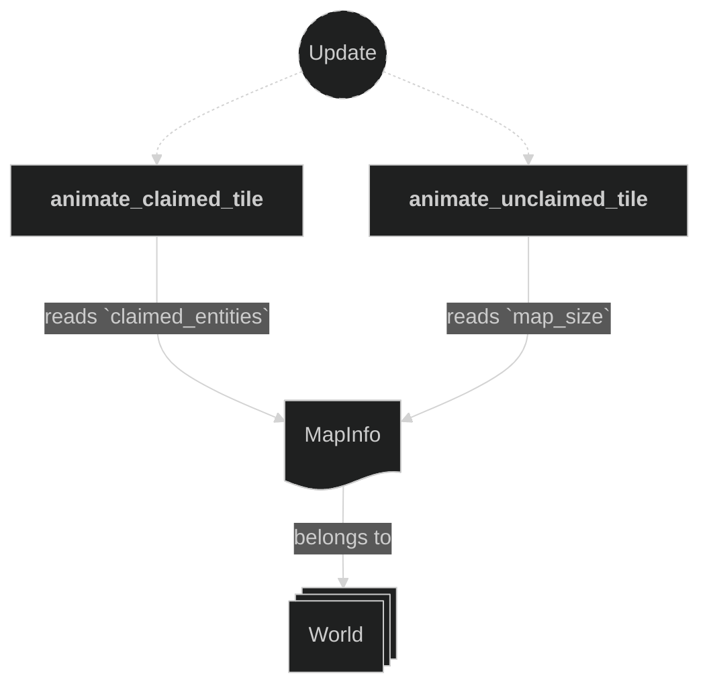
```mermaid
---
config:
  theme: dark
---

flowchart TD
classDef system-group stroke-dasharray: 5 5

update(("`Update`")):::system-group
animate_claimed_tile["`**animate_claimed_tile**`"]
animate_unclaimed_tile["`**animate_unclaimed_tile**`"]

update -.-> animate_claimed_tile
update -.-> animate_unclaimed_tile

world@{ shape: st-rect, label: "World" }
map_info_res@{ shape: doc, label: "MapInfo" }

map_info_res --> |belongs to| world

animate_claimed_tile ---> |reads `claimed_entities`| map_info_res
animate_unclaimed_tile ---> |reads `map_size`| map_info_res
```

### Read PlayerOneAnimations and PlayerTwoAnimations resources

Used in the following systems:
- **animate_player**: reads the clips. Skipped while they do not exist yet.

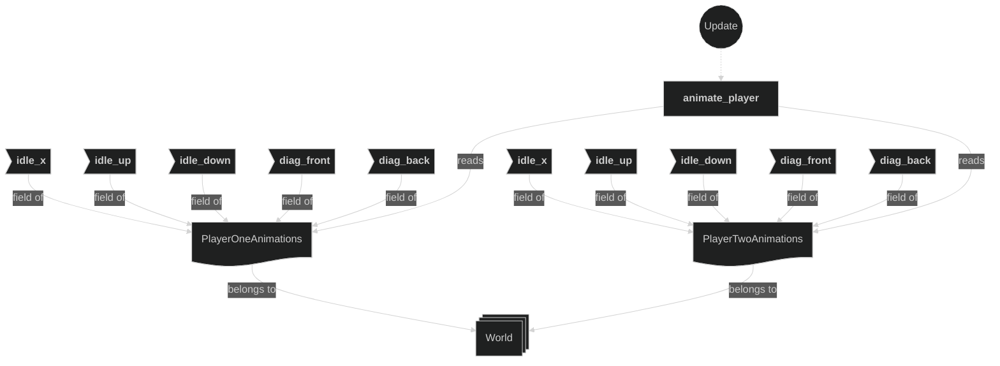
```mermaid
---
config:
  theme: dark
---

flowchart TD
classDef system-group stroke-dasharray: 5 5

update(("`Update`")):::system-group
animate_player["`**animate_player**`"]

update -.-> animate_player

world@{ shape: st-rect, label: "World" }

p1_res@{ shape: doc, label: "PlayerOneAnimations" }
p2_res@{ shape: doc, label: "PlayerTwoAnimations" }

p1_idle_x>"`**idle_x**`"]
p1_idle_up>"`**idle_up**`"]
p1_idle_down>"`**idle_down**`"]
p1_diag_front>"`**diag_front**`"]
p1_diag_back>"`**diag_back**`"]

p2_idle_x>"`**idle_x**`"]
p2_idle_up>"`**idle_up**`"]
p2_idle_down>"`**idle_down**`"]
p2_diag_front>"`**diag_front**`"]
p2_diag_back>"`**diag_back**`"]

p1_res --> |belongs to| world
p2_res --> |belongs to| world
p1_idle_x --> |field of| p1_res
p1_idle_up --> |field of| p1_res
p1_idle_down --> |field of| p1_res
p1_diag_front --> |field of| p1_res
p1_diag_back --> |field of| p1_res
p2_idle_x --> |field of| p2_res
p2_idle_up --> |field of| p2_res
p2_idle_down --> |field of| p2_res
p2_diag_front --> |field of| p2_res
p2_diag_back --> |field of| p2_res

animate_player ---> |reads| p1_res
animate_player ---> |reads| p2_res
```

### Read ClaimedTileAnimations resource

Used in the following systems:
- **animate_claimed_tile**: picks the owner's color clip.
- **animate_unclaimed_tile**: checks that the tile still shows a color.
- **tick_unclaim_reverts**: picks the reverse clip.

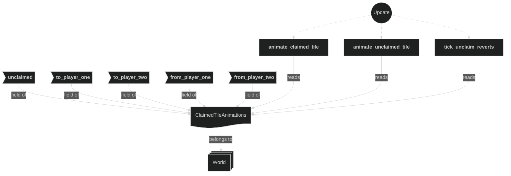
```mermaid
---
config:
  theme: dark
---

flowchart TD
classDef system-group stroke-dasharray: 5 5

update(("`Update`")):::system-group
animate_claimed_tile["`**animate_claimed_tile**`"]
animate_unclaimed_tile["`**animate_unclaimed_tile**`"]
tick_unclaim_reverts["`**tick_unclaim_reverts**`"]

update -.-> animate_claimed_tile
update -.-> animate_unclaimed_tile
update -.-> tick_unclaim_reverts

world@{ shape: st-rect, label: "World" }
ct_anims_res@{ shape: doc, label: "ClaimedTileAnimations" }

ct_anims_unclaimed>"`**unclaimed**`"]
ct_anims_to1>"`**to_player_one**`"]
ct_anims_to2>"`**to_player_two**`"]
ct_anims_from1>"`**from_player_one**`"]
ct_anims_from2>"`**from_player_two**`"]

ct_anims_res --> |belongs to| world
ct_anims_unclaimed --> |field of| ct_anims_res
ct_anims_to1 --> |field of| ct_anims_res
ct_anims_to2 --> |field of| ct_anims_res
ct_anims_from1 --> |field of| ct_anims_res
ct_anims_from2 --> |field of| ct_anims_res

animate_claimed_tile ---> |reads| ct_anims_res
animate_unclaimed_tile ---> |reads| ct_anims_res
tick_unclaim_reverts ---> |reads| ct_anims_res
```

### Write PlayerOneAnimations and PlayerTwoAnimations resources

Used in the following systems:
- **initialize_player_animations**: one resource for each player.

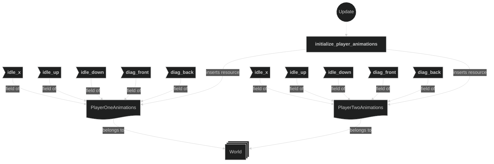
```mermaid
---
config:
  theme: dark
---

flowchart TD
classDef system-group stroke-dasharray: 5 5

update(("`Update`")):::system-group
initialize_player_animations["`**initialize_player_animations**`"]

update -.-> initialize_player_animations

world@{ shape: st-rect, label: "World" }

p1_res@{ shape: doc, label: "PlayerOneAnimations" }
p2_res@{ shape: doc, label: "PlayerTwoAnimations" }

p1_idle_x>"`**idle_x**`"]
p1_idle_up>"`**idle_up**`"]
p1_idle_down>"`**idle_down**`"]
p1_diag_front>"`**diag_front**`"]
p1_diag_back>"`**diag_back**`"]

p2_idle_x>"`**idle_x**`"]
p2_idle_up>"`**idle_up**`"]
p2_idle_down>"`**idle_down**`"]
p2_diag_front>"`**diag_front**`"]
p2_diag_back>"`**diag_back**`"]

p1_res --> |belongs to| world
p2_res --> |belongs to| world
p1_idle_x --> |field of| p1_res
p1_idle_up --> |field of| p1_res
p1_idle_down --> |field of| p1_res
p1_diag_front --> |field of| p1_res
p1_diag_back --> |field of| p1_res
p2_idle_x --> |field of| p2_res
p2_idle_up --> |field of| p2_res
p2_idle_down --> |field of| p2_res
p2_diag_front --> |field of| p2_res
p2_diag_back --> |field of| p2_res

initialize_player_animations ---> |inserts resource| p1_res
initialize_player_animations ---> |inserts resource| p2_res
```

### Write ClaimedTileAnimations resource

Used in the following systems:
- **initialize_claimed_tile_animations**: built once, for all tiles.

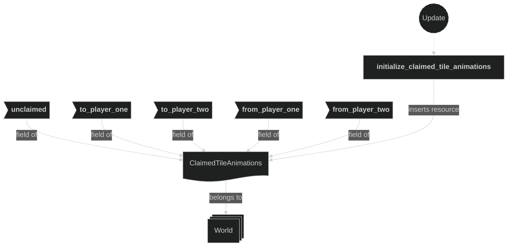
```mermaid
---
config:
  theme: dark
---

flowchart TD
classDef system-group stroke-dasharray: 5 5

update(("`Update`")):::system-group
initialize_claimed_tile_animations["`**initialize_claimed_tile_animations**`"]

update -.-> initialize_claimed_tile_animations

world@{ shape: st-rect, label: "World" }
ct_anims_res@{ shape: doc, label: "ClaimedTileAnimations" }

ct_anims_unclaimed>"`**unclaimed**`"]
ct_anims_to1>"`**to_player_one**`"]
ct_anims_to2>"`**to_player_two**`"]
ct_anims_from1>"`**from_player_one**`"]
ct_anims_from2>"`**from_player_two**`"]

ct_anims_res --> |belongs to| world
ct_anims_unclaimed --> |field of| ct_anims_res
ct_anims_to1 --> |field of| ct_anims_res
ct_anims_to2 --> |field of| ct_anims_res
ct_anims_from1 --> |field of| ct_anims_res
ct_anims_from2 --> |field of| ct_anims_res

initialize_claimed_tile_animations ---> |inserts resource| ct_anims_res
```

### Write commands (attach player animations)

Used in the following systems:
- **initialize_player_animations**: starts the idle clip on the child sprite.

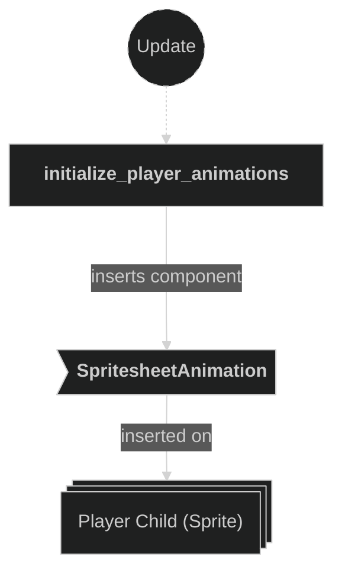
```mermaid
---
config:
  theme: dark
---

flowchart TD
classDef system-group stroke-dasharray: 5 5

update(("`Update`")):::system-group
initialize_player_animations["`**initialize_player_animations**`"]

update -.-> initialize_player_animations

child_entity@{ shape: st-rect, label: "Player Child (Sprite)" }

ce_anim>"`**SpritesheetAnimation**`"]

ce_anim --> |inserted on| child_entity

initialize_player_animations ---> |inserts component| ce_anim
```

### Write commands (attach claimed tile animations)

Used in the following systems:
- **initialize_claimed_tile_animations**: sets up each new tile.

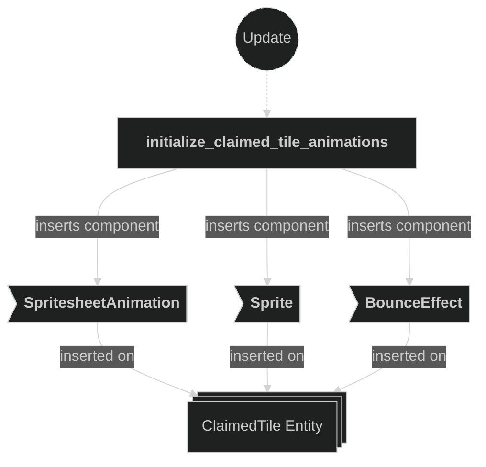
```mermaid
---
config:
  theme: dark
---

flowchart TD
classDef system-group stroke-dasharray: 5 5

update(("`Update`")):::system-group
initialize_claimed_tile_animations["`**initialize_claimed_tile_animations**`"]

update -.-> initialize_claimed_tile_animations

claimed_tile_entity@{ shape: st-rect, label: "ClaimedTile Entity" }

ct_anim>"`**SpritesheetAnimation**`"]
ct_sprite>"`**Sprite**`"]
ct_bounce>"`**BounceEffect**`"]

ct_anim --> |inserted on| claimed_tile_entity
ct_sprite --> |inserted on| claimed_tile_entity
ct_bounce --> |inserted on| claimed_tile_entity

initialize_claimed_tile_animations ---> |inserts component| ct_anim
initialize_claimed_tile_animations ---> |inserts component| ct_sprite
initialize_claimed_tile_animations ---> |inserts component| ct_bounce
```

### Write commands (update claimed tile animation)

Used in the following systems:
- **animate_claimed_tile**: switches the clip and asks for a bounce.

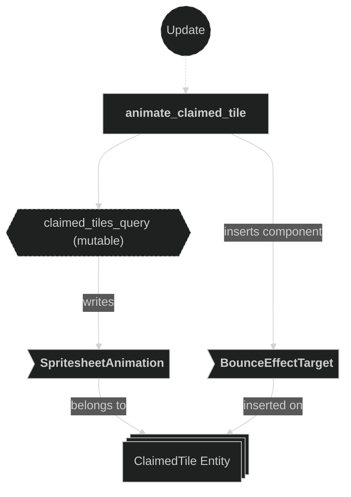
```mermaid
---
config:
  theme: dark
---

flowchart TD
classDef system-group stroke-dasharray: 5 5
classDef query stroke-dasharray: 3 3

update(("`Update`")):::system-group
animate_claimed_tile["`**animate_claimed_tile**`"]

update -.-> animate_claimed_tile

claimed_tiles_query{{"`claimed_tiles_query (mutable)`"}}:::query
animate_claimed_tile ---> claimed_tiles_query

claimed_tile_entity@{ shape: st-rect, label: "ClaimedTile Entity" }

ct_anim>"`**SpritesheetAnimation**`"]
ct_bounce_target>"`**BounceEffectTarget**`"]

ct_anim --> |belongs to| claimed_tile_entity
ct_bounce_target --> |inserted on| claimed_tile_entity

claimed_tiles_query ---> |writes| ct_anim
animate_claimed_tile ---> |inserts component| ct_bounce_target
```

### Query ClaimedTile entities (schedule revert)

Used in the following systems:
- **animate_unclaimed_tile**: tiles whose owner changed this frame.

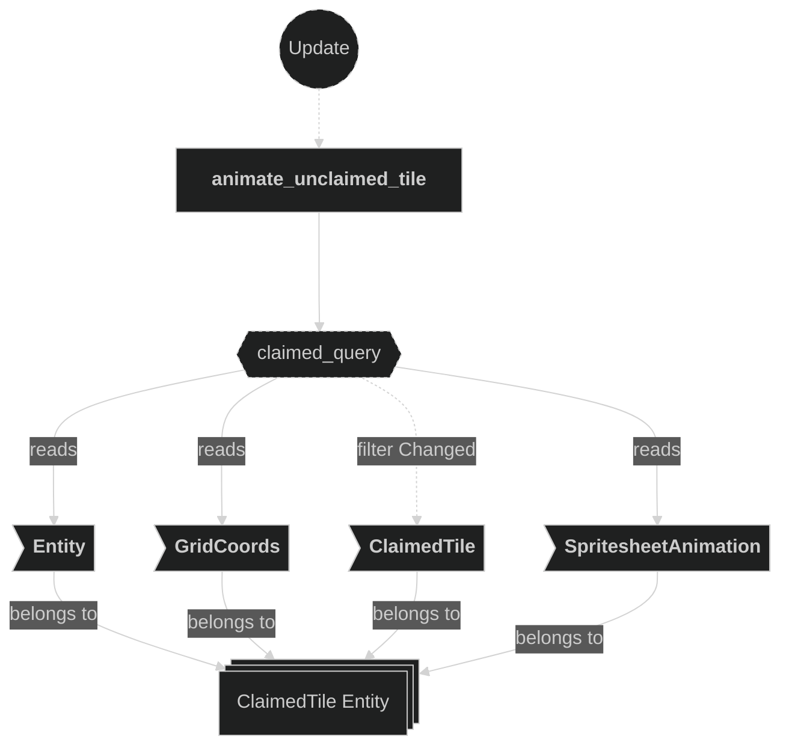
```mermaid
---
config:
  theme: dark
---

flowchart TD
classDef system-group stroke-dasharray: 5 5
classDef query stroke-dasharray: 3 3

update(("`Update`")):::system-group
animate_unclaimed_tile["`**animate_unclaimed_tile**`"]

update -.-> animate_unclaimed_tile

claimed_tiles_query{{"`claimed_query`"}}:::query
animate_unclaimed_tile ---> claimed_tiles_query

claimed_tile_entity@{ shape: st-rect, label: "ClaimedTile Entity" }

ct_entity>"`**Entity**`"] --> |belongs to| claimed_tile_entity
ct_coords>"`**GridCoords**`"] --> |belongs to| claimed_tile_entity
ct_claimed>"`**ClaimedTile**`"] --> |belongs to| claimed_tile_entity
ct_anim>"`**SpritesheetAnimation**`"] --> |belongs to| claimed_tile_entity

claimed_tiles_query ---> |reads| ct_entity
claimed_tiles_query ---> |reads| ct_coords
claimed_tiles_query ---> |reads| ct_anim
claimed_tiles_query -..-> |filter Changed| ct_claimed
```

### Query UnclaimRevert entities

Used in the following systems:
- **tick_unclaim_reverts**: tiles waiting to revert.

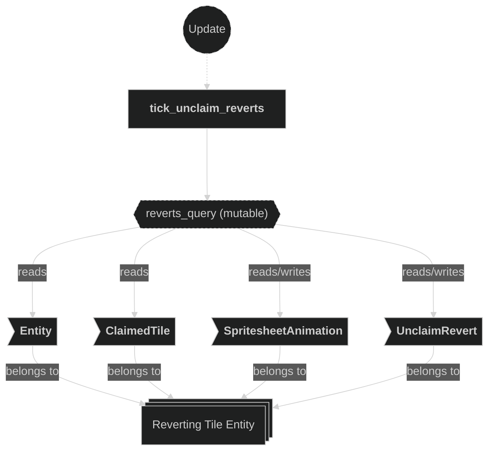
```mermaid
---
config:
  theme: dark
---

flowchart TD
classDef system-group stroke-dasharray: 5 5
classDef query stroke-dasharray: 3 3

update(("`Update`")):::system-group
tick_unclaim_reverts["`**tick_unclaim_reverts**`"]

update -.-> tick_unclaim_reverts

reverts_query{{"`reverts_query (mutable)`"}}:::query
tick_unclaim_reverts ---> reverts_query

revert_tile_entity@{ shape: st-rect, label: "Reverting Tile Entity" }

rt_entity>"`**Entity**`"] --> |belongs to| revert_tile_entity
rt_claimed>"`**ClaimedTile**`"] --> |belongs to| revert_tile_entity
rt_anim>"`**SpritesheetAnimation**`"] --> |belongs to| revert_tile_entity
rt_revert>"`**UnclaimRevert**`"] --> |belongs to| revert_tile_entity

reverts_query ---> |reads| rt_entity
reverts_query ---> |reads| rt_claimed
reverts_query ---> |reads/writes| rt_anim
reverts_query ---> |reads/writes| rt_revert
```

### Write commands (schedule unclaim revert)

Used in the following systems:
- **animate_unclaimed_tile**: one timer for each tile to revert.

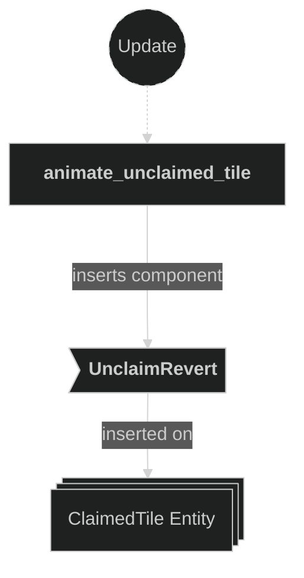
```mermaid
---
config:
  theme: dark
---

flowchart TD
classDef system-group stroke-dasharray: 5 5

update(("`Update`")):::system-group
animate_unclaimed_tile["`**animate_unclaimed_tile**`"]

update -.-> animate_unclaimed_tile

claimed_tile_entity@{ shape: st-rect, label: "ClaimedTile Entity" }

ct_revert>"`**UnclaimRevert**`"]

ct_revert --> |inserted on| claimed_tile_entity

animate_unclaimed_tile ---> |inserts component| ct_revert
```

### Write commands (revert unclaimed tile)

Used in the following systems:
- **tick_unclaim_reverts**: reverts the tile, then removes the timer.

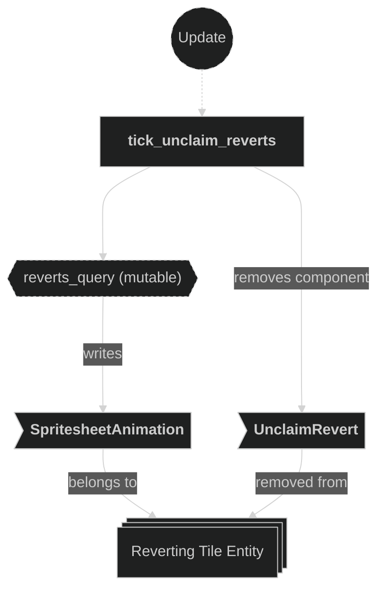
```mermaid
---
config:
  theme: dark
---

flowchart TD
classDef system-group stroke-dasharray: 5 5
classDef query stroke-dasharray: 3 3

update(("`Update`")):::system-group
tick_unclaim_reverts["`**tick_unclaim_reverts**`"]

update -.-> tick_unclaim_reverts

reverts_query{{"`reverts_query (mutable)`"}}:::query
tick_unclaim_reverts ---> reverts_query

revert_tile_entity@{ shape: st-rect, label: "Reverting Tile Entity" }

rt_anim>"`**SpritesheetAnimation**`"]
rt_revert>"`**UnclaimRevert**`"]

rt_anim --> |belongs to| revert_tile_entity
rt_revert --> |removed from| revert_tile_entity

reverts_query ---> |writes| rt_anim
tick_unclaim_reverts ---> |removes component| rt_revert
```
