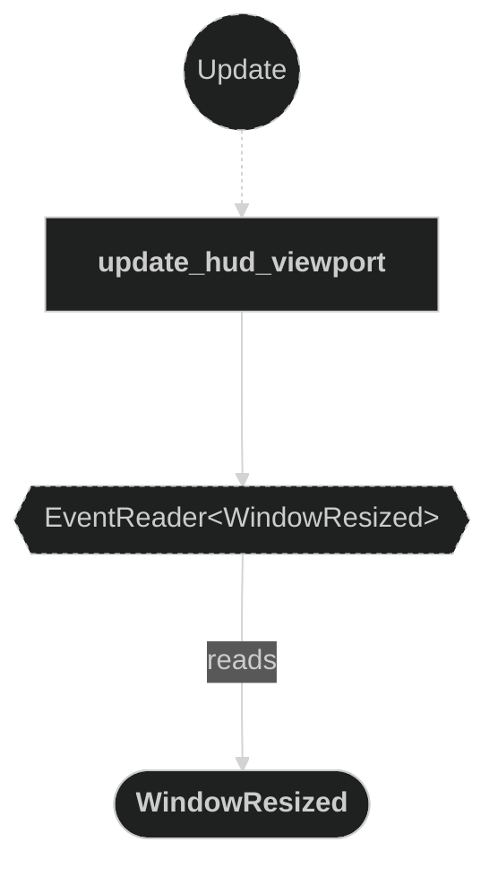
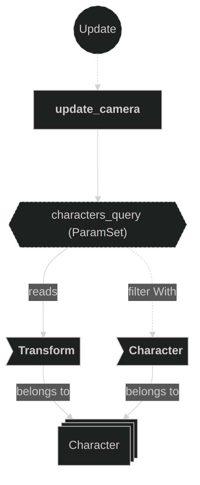
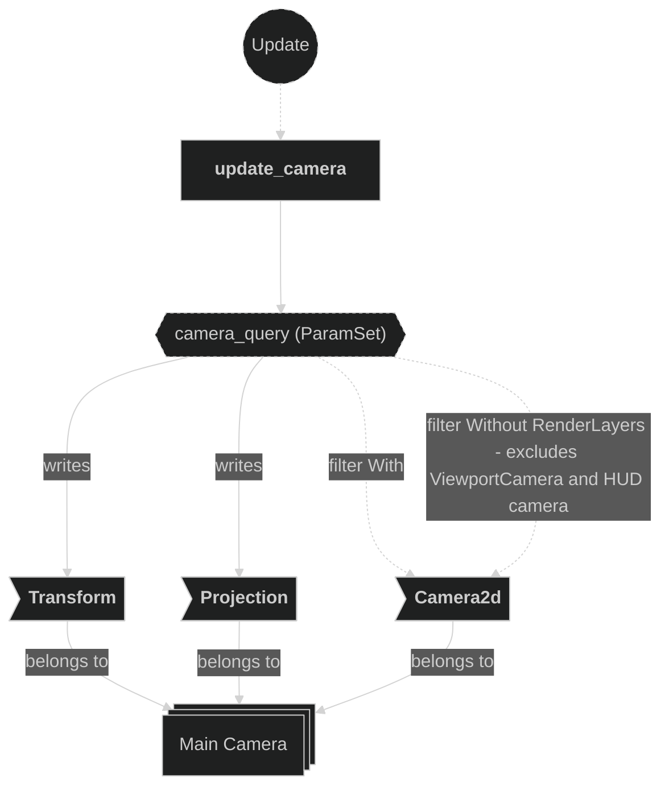
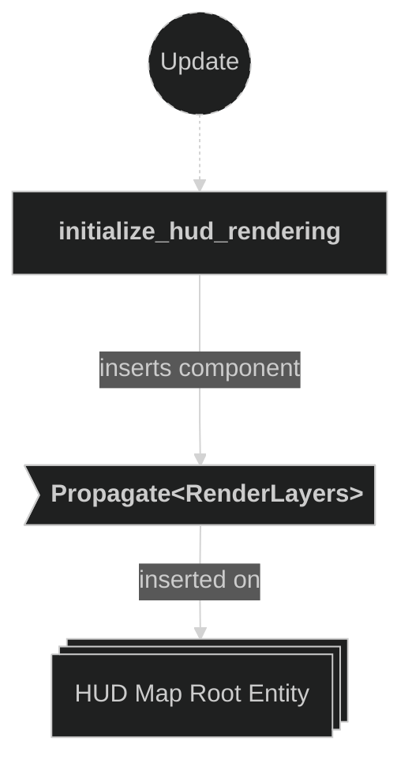
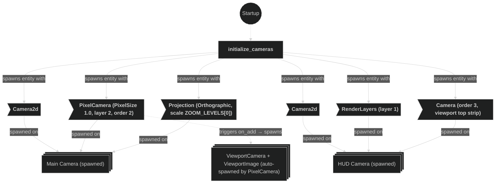

# Camera Plugin

Contains systems related to camera initialization and runtime updates. The plugin uses `bevy_smooth_pixel_camera` for pixel-perfect sub-pixel smoothing on the main camera. Three cameras are active at runtime:

| Camera | Render layer | Order | Purpose |
|--------|-------------|-------|---------|
| Main (`PixelCamera`) | default (no `RenderLayers`) | 0 | Renders the game world to an off-screen texture |
| ViewportCamera | layer 2 | 2 | Spawned automatically by `PixelCamera`; composites the off-screen texture onto the window |
| HUD camera | layer 1 | 3 | Renders the HUD map in a fixed viewport strip at the top of the window |

The `PixelCamera` component (from `bevy_smooth_pixel_camera`) also spawns a `ViewportImage` sprite child. Its `snap_camera_position` system (PostUpdate) snaps the main camera's `GlobalTransform` to the nearest integer world unit and offsets the `ViewportImage` by the subpixel remainder to produce smooth motion without pixel crawl.

## Plugin workflow

- Startup phase
    - `initialize_cameras` spawns two camera entities:
        - A main `Camera2d` with `PixelCamera` (`ViewportScalingMode::PixelSize(1.0)`) and an `OrthographicProjection` starting at `ZOOM_LEVELS[0]` (1/4). `PixelCamera` automatically spawns a `ViewportCamera` child on layer 2 with render order 2.
        - A HUD `Camera2d` assigned to `RenderLayers` layer 1, render order 3, with a fixed viewport occupying the top strip of the window.
    - `randomize_clear_color` randomizes the background hue each run (fixed saturation and lightness).
- Update phase
    - `initialize_hud_rendering`:
        - Reacts to `TiledEvent<MapCreated>` for the `HudMap` entity only
        - Inserts `Propagate(RenderLayers)` on the HUD map root entity so all its children are rendered exclusively in the HUD camera layer
    - `update_camera`:
        - Reads all `Character` transforms, computes the barycenter and max inter-player distance
        - Smoothly nudges the main camera `Transform` toward the barycenter (`CAMERA_DECAY_RATE`)
        - Lerps the orthographic scale toward the nearest pixel-perfect zoom level (`ZOOM_DECAY_RATE`), then snaps exactly once within 0.001 to guarantee a clean 1/n value
    - `update_hud_viewport`:
        - Reacts to `WindowResized` events
        - Recalculates the HUD camera viewport rect and orthographic scale to keep the HUD correctly sized regardless of window dimensions

## Plugin Systems

### Initialize Cameras

Spawns two camera entities at startup, resulting in three active cameras at runtime:

1. **Main camera** — carries `Camera2d` and `PixelCamera` (`PixelSize(1.0)`, render layer 2, order 2). `PixelCamera::on_add` automatically spawns a `ViewportCamera` (layer 2, order 2) and a `ViewportImage` sprite child. The `OrthographicProjection` starts at `ZOOM_LEVELS[0]` (0.25 — most zoomed out). The main camera has no `RenderLayers` component; the `update_camera` query uses `Without<RenderLayers>` to isolate it from the ViewportCamera and HUD camera.
2. **HUD camera** — carries `Camera2d`, `RenderLayers` layer 1, and `Camera { order: 3 }`. Its viewport is set to a fixed top strip of the window. Render order 3 ensures it composites on top of the ViewportCamera (order 2).

### Randomize Clear Color

Runs once at startup. Picks a random hue (0–360°) while keeping a fixed saturation and lightness, then writes it into the `ClearColor` resource to give each game session a unique background tint.

### Initialize HUD Rendering

Reacts to `TiledEvent<MapCreated>` filtered to the `HudMap` entity only. Inserts a `Propagate(RenderLayers)` component on the HUD map root entity, propagating `RenderLayers` layer 1 down the entire entity hierarchy via `HierarchyPropagatePlugin`. This ensures the HUD tilemap and all its child sprites are rendered only in the HUD camera and never appear in the main game camera.

### Update Camera

Runs every frame. Reads the `Transform` of every `Character` entity to compute:
- The **barycenter** (average position) — the camera target.
- The **max inter-player distance** — used to derive the desired zoom scale.

The camera `Transform` is smoothly nudged toward the barycenter using `smooth_nudge` (decay rate `CAMERA_DECAY_RATE`).

Zoom is pixel-perfect: only the four levels in `ZOOM_LEVELS` (`[1/4, 1/3, 1/2, 1]`) are valid target values, since with `PixelSize(1.0)` these are the only scales where 1 world unit = an integer number of screen pixels. The nearest level is selected by mapping `max_distance` through `BASE_ZOOM_DISTANCE` to a continuous scale, then picking the closest entry in `ZOOM_LEVELS`. The `OrthographicProjection` scale lerps toward the target at `ZOOM_DECAY_RATE` and snaps exactly once within 0.001 to guarantee the final value is a clean 1/n fraction.

### Update HUD Viewport

Runs whenever a `WindowResized` event is received. Recomputes the HUD camera's `Viewport` rect — position and size — to keep the HUD strip anchored to the top of the window at the correct pixel dimensions. Also updates the HUD camera's `OrthographicProjection` scale so the HUD tiles remain at their intended size regardless of the window resolution.

## Components, Resources and Messages CRUD

### Write ClearColor resource

Used in the following systems:
- **randomize_clear_color**: writes a randomized hue into the global background color at startup

### Read TiledEvent MapCreated messages (HUD)

Used in the following systems:
- **initialize_hud_rendering**: used to detect when the HudMap has finished loading so `Propagate(RenderLayers)` can be inserted

### Read WindowResized events

Used in the following systems:
- **update_hud_viewport**: reacts to window resize events to recalculate the HUD camera viewport and orthographic scale

### Query Character transforms

Used in the following systems:
- **update_camera**: reads all `Transform` components on `Character`-marked entities to compute the camera target position and zoom level

### Write Camera components (main)

Used in the following systems:
- **update_camera**: smoothly updates the main camera `Transform` (position) and `OrthographicProjection` (zoom scale) every frame

### Write HUD Camera components (viewport)

Used in the following systems:
- **update_hud_viewport**: updates the HUD camera `Camera::viewport` rect and `OrthographicProjection` scale on window resize

### Write commands — initialize_hud_rendering

Used in the following systems:
- **initialize_hud_rendering**: inserts `Propagate(RenderLayers)` on the HUD map root entity so the render layer propagates to all children

### Write commands — initialize_cameras (Startup)

Used in the following systems:
- **initialize_cameras**: spawns the main camera and the HUD camera entities with their initial components. `PixelCamera::on_add` automatically spawns additional child entities (`ViewportCamera` on layer 2 / order 2, and `ViewportImage`).

