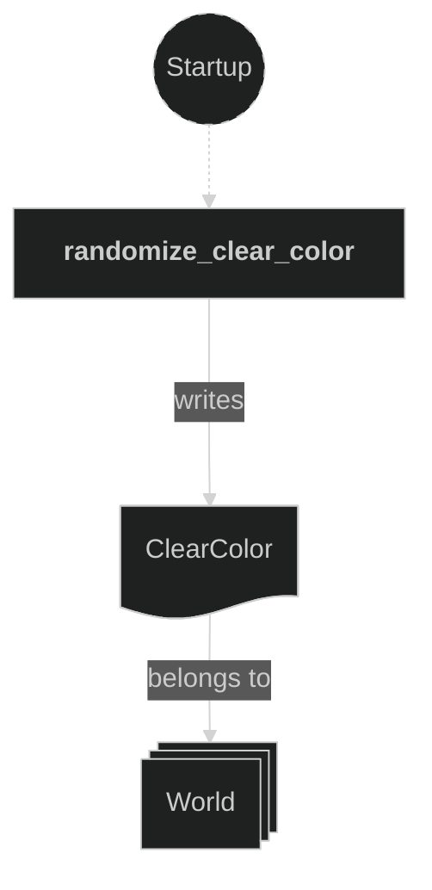
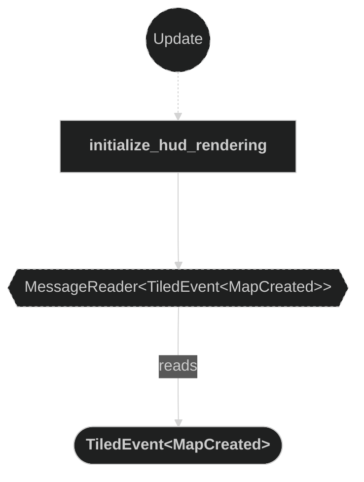
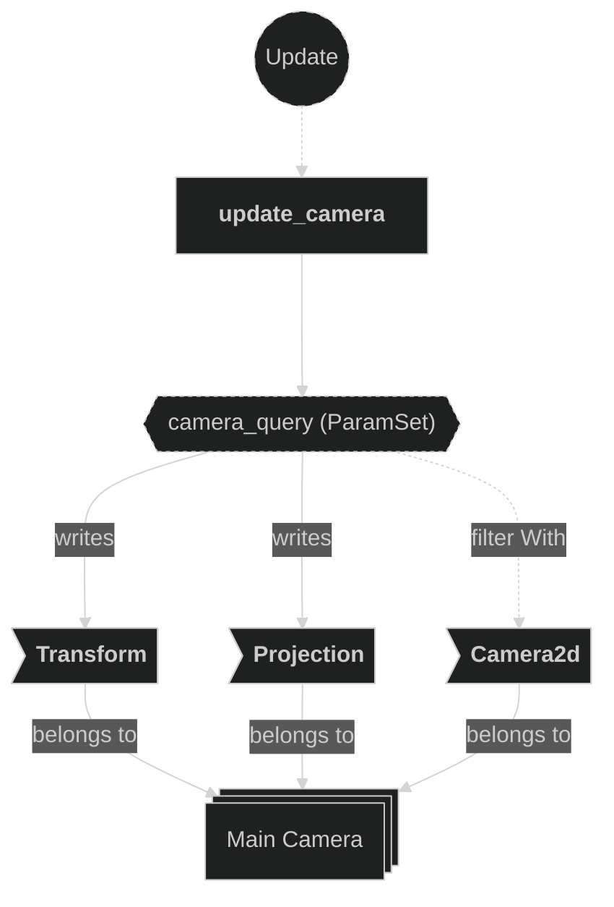
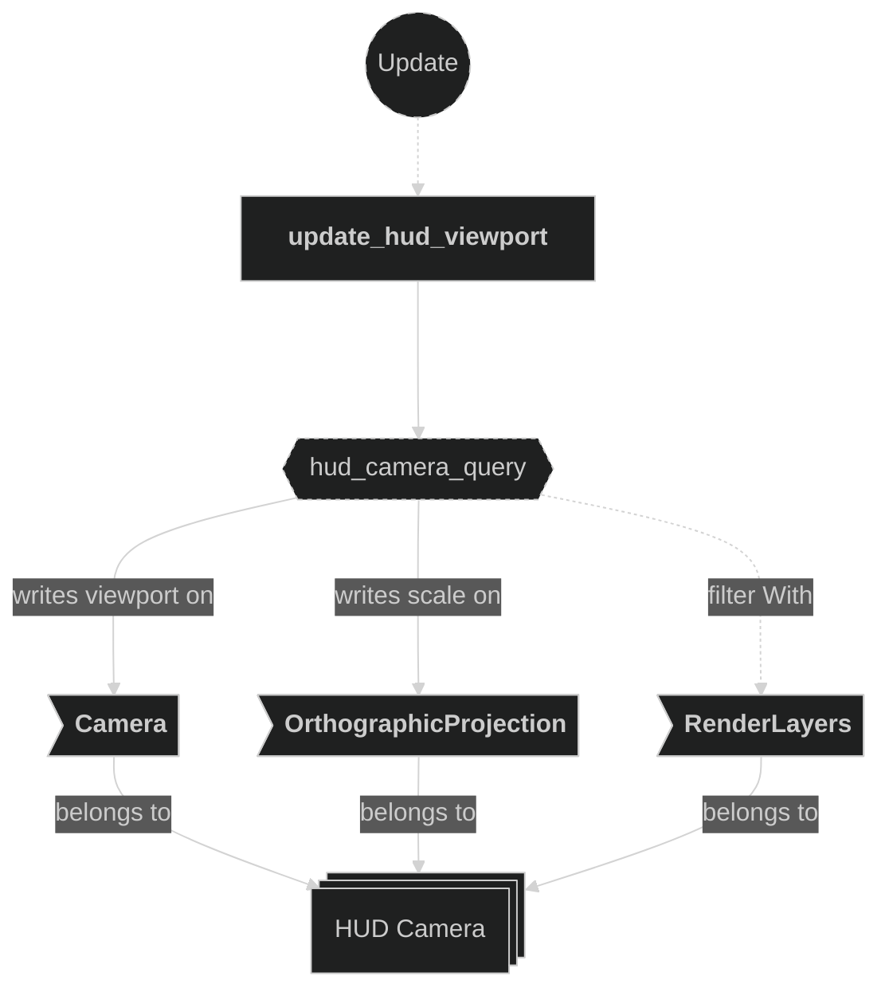
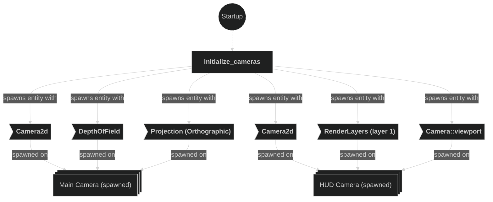

# Camera Plugin

Contains systems related to camera initialization and runtime updates. The plugin spawns two cameras: a main gameplay camera that smoothly follows the barycenter of all player positions and dynamically adjusts its orthographic zoom, and a HUD camera that renders the HUD map in a fixed viewport strip at the top of the window.

## Plugin workflow

- Startup phase
    - `initialize_cameras` spawns two camera entities:
        - A main `Camera2d` with `DepthOfField` and an `OrthographicProjection` set to `MIN_ZOOM_SCALE`.
        - A HUD `Camera2d` assigned to `RenderLayers` layer 1, with a fixed viewport occupying the top strip of the window.
    - `randomize_clear_color` randomizes the background hue each run (fixed saturation and lightness).
- Update phase
    - `initialize_hud_rendering`:
        - Reacts to `TiledEvent<MapCreated>` for the `HudMap` entity only
        - Inserts `Propagate(RenderLayers)` on the HUD map root entity so all its children are rendered exclusively in the HUD camera layer
    - `update_camera`:
        - Reads all `Player` transforms, computes the barycenter and max inter-player distance
        - Smoothly nudges the main camera `Transform` toward the barycenter and lerps the orthographic zoom scale
    - `update_hud_viewport`:
        - Reacts to `WindowResized` events
        - Recalculates the HUD camera viewport rect and orthographic scale to keep the HUD correctly sized regardless of window dimensions

## Plugin Systems

### Initialize Cameras

Spawns two camera entities at startup:

1. **Main camera** — carries `Camera2d`, `DepthOfField` post-process effect, and an `OrthographicProjection` starting at `MIN_ZOOM_SCALE` (0.33 — zoomed out). This camera renders the game world on the default render layer.
2. **HUD camera** — carries `Camera2d` and is assigned to `RenderLayers` layer 1. Its viewport is set to a fixed top strip of the window. `order` is set higher than the main camera so it composites on top.

### Randomize Clear Color

Runs once at startup. Picks a random hue (0–360°) while keeping a fixed saturation and lightness, then writes it into the `ClearColor` resource to give each game session a unique background tint.

### Initialize HUD Rendering

Reacts to `TiledEvent<MapCreated>` filtered to the `HudMap` entity only. Inserts a `Propagate(RenderLayers)` component on the HUD map root entity, propagating `RenderLayers` layer 1 down the entire entity hierarchy via `HierarchyPropagatePlugin`. This ensures the HUD tilemap and all its child sprites are rendered only in the HUD camera and never appear in the main game camera.

### Update Camera

Runs every frame. Reads the `Transform` of every `Player` entity to compute:
- The **barycenter** (average position) — the camera target.
- The **max inter-player distance** — used to derive the desired zoom scale.

The camera `Transform` is smoothly nudged toward the barycenter using `smooth_nudge` (decay rate `0.5`), and the `OrthographicProjection` scale is lerped toward the target zoom, clamped between `MIN_ZOOM_SCALE` (0.33) and `MAX_ZOOM_SCALE` (2.0).

### Update HUD Viewport

Runs whenever a `WindowResized` event is received. Recomputes the HUD camera's `Viewport` rect — position and size — to keep the HUD strip anchored to the top of the window at the correct pixel dimensions. Also updates the HUD camera's `OrthographicProjection` scale so the HUD tiles remain at their intended size regardless of the window resolution.

## Components, Resources and Messages CRUD

### Write ClearColor resource

Used in the following systems:
- **randomize_clear_color**: writes a randomized hue into the global background color at startup

### Read TiledEvent MapCreated messages (HUD)

Used in the following systems:
- **initialize_hud_rendering**: used to detect when the HudMap has finished loading so `Propagate(RenderLayers)` can be inserted

### Read WindowResized events

Used in the following systems:
- **update_hud_viewport**: reacts to window resize events to recalculate the HUD camera viewport and orthographic scale

### Query Player transforms

Used in the following systems:
- **update_camera**: reads all `Transform` components on `Player`-marked entities to compute the camera target position and zoom level

### Write Camera components (main)

Used in the following systems:
- **update_camera**: smoothly updates the main camera `Transform` (position) and `OrthographicProjection` (zoom scale) every frame

### Write HUD Camera components (viewport)

Used in the following systems:
- **update_hud_viewport**: updates the HUD camera `Camera::viewport` rect and `OrthographicProjection` scale on window resize

### Write commands — initialize_hud_rendering

Used in the following systems:
- **initialize_hud_rendering**: inserts `Propagate(RenderLayers)` on the HUD map root entity so the render layer propagates to all children

### Write commands — initialize_cameras (Startup)

Used in the following systems:
- **initialize_cameras**: spawns the main camera and the HUD camera entities with their initial components

