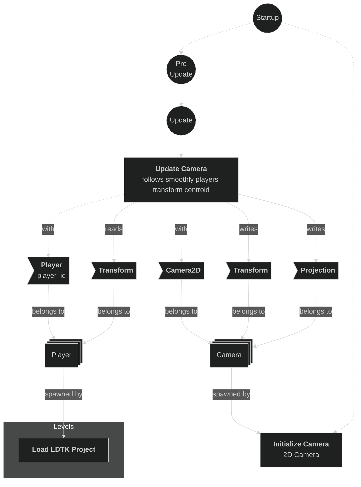

```mermaid
---
config:
  theme: dark
---

flowchart TD

%% dash for system groups
classDef system-group stroke-dasharray: 5 5

%%%%%%%%%%%%%%%%%%%%%%%%%%%%
%%  Entities & Components %%
%%%%%%%%%%%%%%%%%%%%%%%%%%%%

%% Player entity
player_entity@{ shape: st-rect, label: "Player" } 
pe_player_component>"`**Player**<br>player_id`"] ---> |belongs to| player_entity
pe_transform_component>"`**Transform**`"] ---> |belongs to| player_entity
player_entity ---> |spawned by| load_ldtk_project

%% Camera Entity
camera_entity@{ shape: st-rect, label: "Camera" } 
ce_camera2d_component>"`**Camera2D**`"] ---> |belongs to| camera_entity
ce_transform_component>"`**Transform**`"] ---> |belongs to| camera_entity
ce_projection_component>"`**Projection**`"] ---> |belongs to| camera_entity
camera_entity ---> |spawned by| initialize_camera 

%%%%%%%%%%%%%%%%%%%%%%%
%%      Systems      %%
%%%%%%%%%%%%%%%%%%%%%%%

startup((Startup)):::system-group -.-> preupdate(("`Pre<br>Update`")):::system-group -.-> update(("`Update`")):::system-group

initialize_camera["`**Initialize Camera**<br>2D Camera`"]
update_camera["`**Update Camera**<br>follows smoothly players transform centroid`"]

startup -.-> initialize_camera
update -.-> update_camera

update_camera ---> |writes| ce_transform_component & ce_projection_component
update_camera -..-> |with| ce_camera2d_component
update_camera ---> |reads| pe_transform_component
update_camera -..-> |with| pe_player_component

subgraph Levels
    load_ldtk_project["`**Load LDTK Project**`"]
end
```
