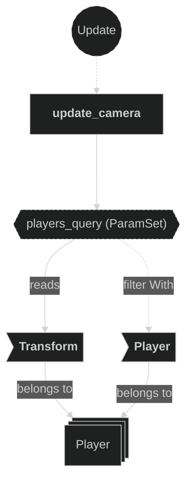
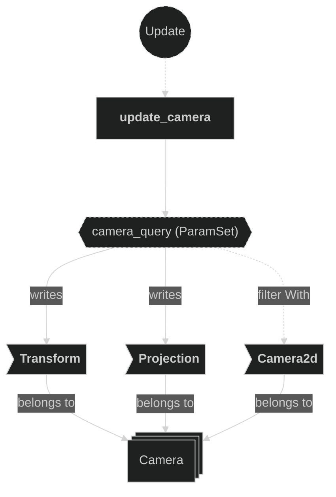
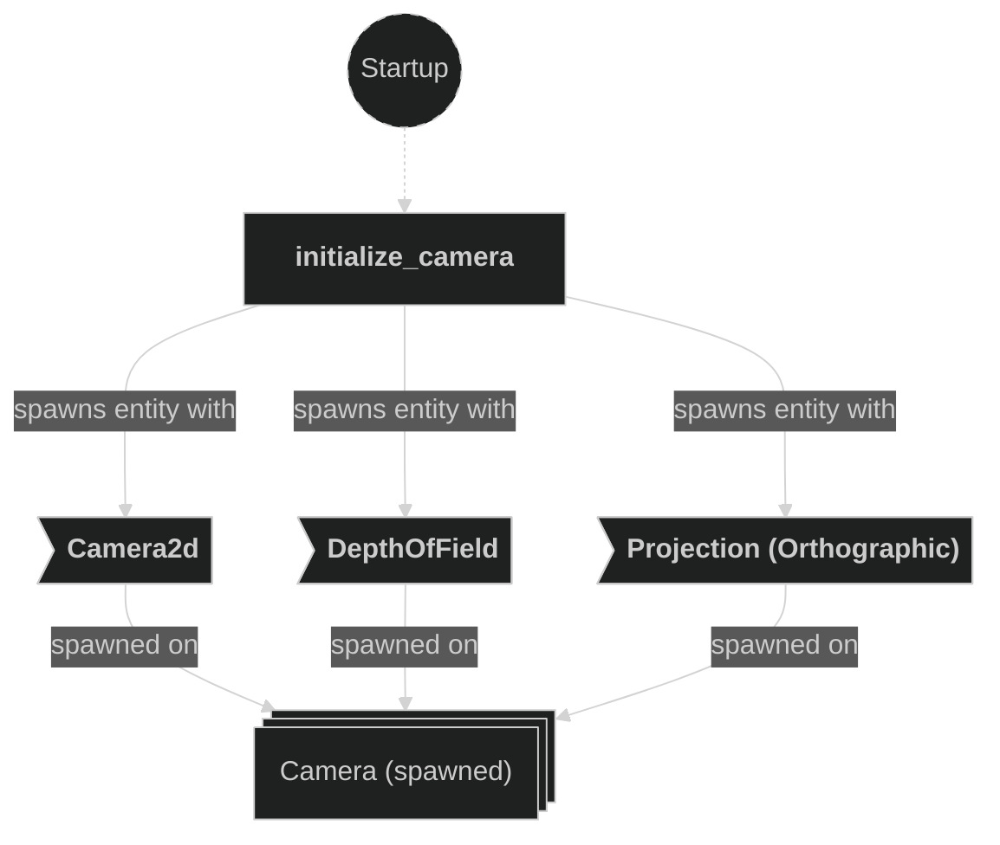

# Camera Plugin

Contains systems related to camera initialization and runtime updates. The camera smoothly follows the barycenter (centroid) of all player positions and dynamically adjusts its orthographic zoom scale based on the spread between players.

## Plugin workflow

- Startup phase
    - `initialize_camera` spawns the Camera entity with `Camera2d`, `DepthOfField` and an `OrthographicProjection` set to `MIN_ZOOM_SCALE`.
    - `randomize_clear_color` randomizes the background hue each run (fixed saturation and lightness).
- Update phase
    - `update_camera` reads all `Player` transforms, computes the barycenter and max inter-player distance, then smoothly nudges the camera `Transform` toward the barycenter and lerps the orthographic zoom scale.

## Plugin Systems

### Initialize Camera

Spawns the 2D camera entity with `Camera2d`, `DepthOfField` post-process effect, and an `OrthographicProjection` starting at `MIN_ZOOM_SCALE` (0.33 — zoomed out).

### Randomize Clear Color

Runs once at startup. Picks a random hue (0–360°) while keeping a fixed saturation and lightness, then writes it into the `ClearColor` resource to give each game session a unique background tint.

### Update Camera

Runs every frame. Reads the `Transform` of every `Player` entity to compute:
- The **barycenter** (average position) — the camera target.
- The **max inter-player distance** — used to derive the desired zoom scale.

The camera `Transform` is smoothly nudged toward the barycenter using `smooth_nudge` (decay rate `0.5`), and the `OrthographicProjection` scale is lerped toward the target zoom, clamped between `MIN_ZOOM_SCALE` (0.33) and `MAX_ZOOM_SCALE` (2.0).

## Components, Resources and Messages CRUD

### Write ClearColor resource

Used in the following systems:
- **randomize_clear_color**: writes a randomized hue into the global background color at startup

### Query Player transforms

Used in the following systems:
- **update_camera**: reads all `Transform` components on `Player`-marked entities to compute the camera target position and zoom level

### Write Camera components

Used in the following systems:
- **update_camera**: smoothly updates the camera `Transform` (position) and `OrthographicProjection` (zoom scale) every frame

### Write commands (Startup)

Used in the following systems:
- **initialize_camera**: spawns the camera entity with its initial components

