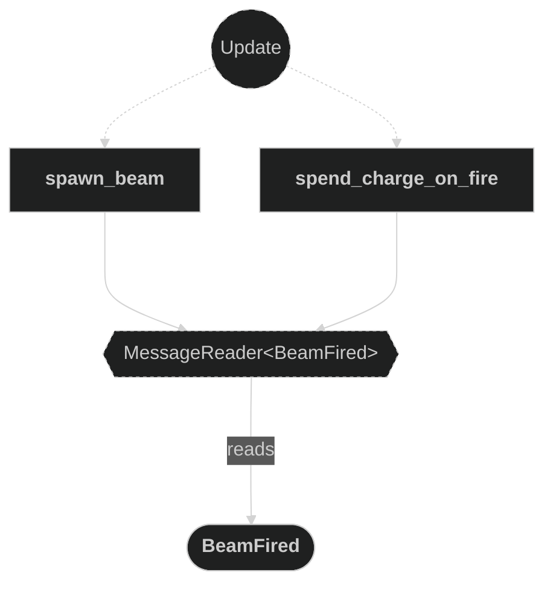
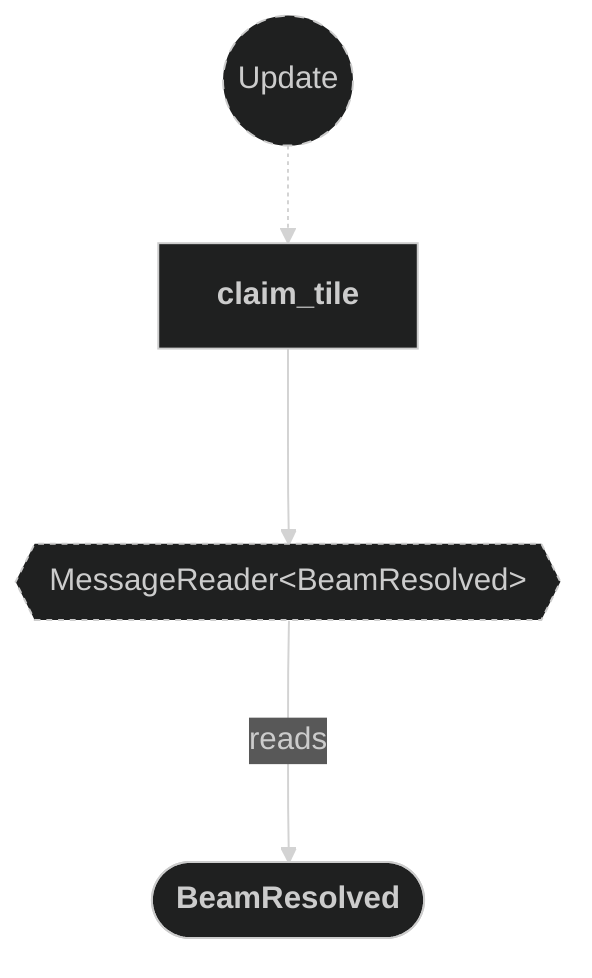
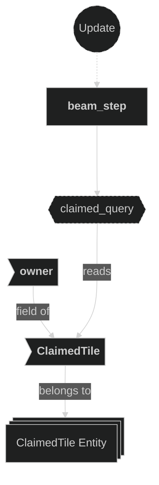
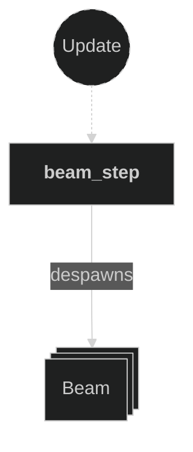
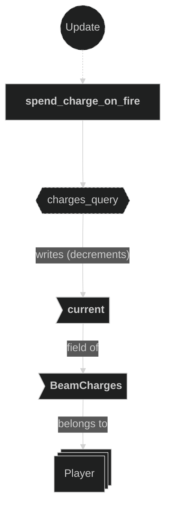
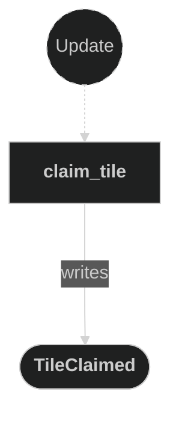

# Beam Plugin

Contains systems responsible for spawning and stepping beam projectiles fired by players, for claiming tiles when a beam stops, and for spending the firing player's beam charges. When a player shoots, a `Beam` entity is created at the player's current grid position and advances one tile per beam-step timer tick in the firing direction. Each beam carries a resolved execution mode, `Beam::behavior` (`BeamBehavior`), which replaced the former `Beam::inverted` bool as part of the Stage F1 beam-ability substrate. In Stage F1 `spawn_beam` always selects `BeamBehavior::Straight`:

- **Straight** (the baseline): advances until it leaves the map bounds or the next tile is already claimed. Resolves at the last unclaimed position. Fired from the player's own claimed territory with nothing new to claim ahead, it backs up onto its already-claimed origin and despawns silently **without** emitting `BeamResolved` — a fizzle.
- **Backfill** (staged, not selected in F1): advances through claimed and forbidden tiles until the next tile would be unclaimed, resolving on that unclaimed tile; despawns silently if none is found before the edge. This is the ex-"inverted" logic, preserved verbatim and turned on in Stage F2 when the firing player has drafted the Backfill ability.

Charges are spent **on fire**, not on resolve: `spend_charge_on_fire` reacts to `BeamFired` and decrements the owner's `BeamCharges::current` once per shot (emitting `ChargeSpent`), so even a fizzle costs a charge. When a beam resolves, `BeamResolved` is emitted, `claim_tile` updates tile ownership and emits `TileClaimed` (recording the old/new owner of a real flip), and the beam entity is despawned.

## Plugin workflow

- Startup phase
    - `setup_beam_step_timer` inserts the `BeamStepTimer` resource (62.5 ms repeating).
- Update phase
    - Spawn Beam:
        - Reacts to `BeamFired` message
            - Reads:
                - `BeamFired` message fields (`owner`, `origin`, `direction`)
                - `Beam` and `GridCoords` components on active beams (to detect lane overlap)
            - Writes:
                - Always spawns a `Beam` entity with `GridCoords` and `Beam{owner,direction,speed,behavior}`
                - `behavior` is always `BeamBehavior::Straight` in Stage F1 (descriptor-gated `Backfill` selection lands in Stage F2)
                - Also inserts `BounceEffect` unless the owner already has an active beam on the same row (horizontal fire) or same column (vertical fire)
    - Beam Step:
        - Runs on every `BeamStepTimer` tick (62.5 ms)
            - Reads:
                - `Beam` component (`owner`, `direction`, `behavior`)
                - `MapInfo` resource (for bounds check and tile entity lookup)
                - `ClaimedTile` component on ground tile entities (for claimed-tile check)
            - Writes:
                - Advances `GridCoords` of the beam if the next tile is valid and unclaimed
                - Writes a `BeamResolved` message and despawns the beam when it must stop (Straight only emits `BeamResolved` if it lands on an unclaimed tile — a fizzle despawns silently)
    - Claim Tile:
        - Reacts to `BeamResolved` message
            - Reads:
                - `BeamResolved` message fields (`position`, `owner`)
                - `MapInfo` resource (to resolve `GridCoords` → claimed tile `Entity` via `claimed_entities`)
            - Writes:
                - Mutates `ClaimedTile::owner` on the matched entity in `MapInfo::claimed_entities`
                - Emits a `TileClaimed` message (`position`, `old_owner`, `new_owner`) recording the ownership flip
    - Spend Charge On Fire:
        - Reacts to `BeamFired` message
            - Reads:
                - `BeamFired` message fields (`owner`)
                - `BeamCharges` component on the firing player entity
            - Writes:
                - Decrements `BeamCharges::current` on the firing player (saturating at zero), once per shot — so a fizzle also costs a charge
                - Emits a `ChargeSpent` message (`owner`, `amount`)

## Plugin Systems

### Setup Beam Step Timer

Runs once at startup. Inserts the `BeamStepTimer` resource — a repeating `Timer` with a 62.5 ms period — that gates how frequently each beam advances by one tile.

### Spawn Beam

Reacts to `BeamFired` messages emitted by the input system. Always spawns a new `Beam` entity carrying `GridCoords` (set to `origin`) and `Beam{owner, direction, speed, behavior}`, with `behavior` fixed to `BeamBehavior::Straight` in Stage F1 (descriptor-gated `Backfill` selection arrives in Stage F2). Additionally inserts `BounceEffect` on the spawned entity only when the owner has no existing beam traveling on the same lane — a horizontal beam suppresses `BounceEffect` if another of the owner's beams shares the same row (Y coordinate) and is also horizontal; a vertical beam suppresses it if another shares the same column (X coordinate) and is also vertical. This prevents overlapping visual effects when beams travel the same path. No sprite or transform is set up here — visual representation is handled by the effects and animations plugins reacting to the `BounceEffect` component.

### Beam Step

Runs every `BeamStepTimer` tick. For each `Beam` entity it computes the next grid position (`current + direction`) and `match`es on `Beam::behavior` for the stopping rules:

**Straight** (`BeamBehavior::Straight` — the only mode selected in Stage F1):
1. **Out of bounds** — if the next position is not on ground, back up through any forbidden areas; if the current position is unclaimed emit `BeamResolved` for it, then despawn.
2. **Already claimed** — if the `ClaimedTile` entity at the next position already has an owner, back up through forbidden areas; if the current position is unclaimed emit `BeamResolved` for it, then despawn.
3. Otherwise — advance: `GridCoords` is overwritten with the next position (which triggers `apply_translate_effect` in the Effects plugin to tween the sprite).

   A shot fired from the player's own claimed territory with nothing new to claim ahead backs up onto its already-claimed origin, emits no `BeamResolved`, and despawns — a silent fizzle (the charge is still spent, at fire time).

**Backfill** (`BeamBehavior::Backfill` — ported ex-inverted logic, staged; never selected in Stage F1, turned on in Stage F2):
1. **Out of bounds** — if the next position is neither on ground nor in forbidden areas, despawn silently (no `BeamResolved` emitted, no tile claimed).
2. **Next tile is unclaimed ground** — emit `BeamResolved` for `next_position` (the unclaimed tile itself), and despawn.
3. Otherwise (claimed or forbidden tile ahead) — advance.

### Claim Tile

Reads `BeamResolved` messages. For each message, looks up the corresponding claimed tile entity from `MapInfo::claimed_entities` using the message's `GridCoords` position, then mutates `ClaimedTile::owner` on that entity to record the new owning player and emits a `TileClaimed` message capturing the `old_owner` (before the write) and `new_owner`. This is the authoritative write that marks a tile as belonging to a player, and is subsequently read by the Animations plugin to switch the tile's visual appearance; `TileClaimed` is the ability-system hook that distinguishes a real ownership flip from a no-op resolve (consumed starting Stage F2).

### Spend Charge On Fire

Reads `BeamFired` messages. For each message, decrements `BeamCharges::current` (saturating at zero) on the firing player entity identified by `message.owner`, and emits a `ChargeSpent` message. Spending on fire (rather than on resolve) means every committed shot — including a fizzle that claims nothing — costs exactly one charge. The resulting `Changed<BeamCharges>` detection drives the digit flip-counter animation in the Animations plugin.

## Components, Resources and Messages CRUD

### Read BeamFired messages

Used in the following systems:
- **spawn_beam**: used to trigger beam entity creation
- **spend_charge_on_fire**: used to trigger the per-shot charge decrement at fire time

### Read BeamResolved messages

Used in the following systems:
- **claim_tile**: used to trigger tile ownership mutation when a beam stops

### Query Beam entities (spawn)

Used in the following systems:
- **spawn_beam**: reads `Beam.owner`, `Beam.direction`, and `GridCoords` of all active beams to detect lane overlap before deciding whether to insert `BounceEffect`

### Read MapInfo resource (beam step)

Used in the following systems:
- **beam_step**: checks `on_ground()` and `on_forbidden_areas()` for the next position and resolves tile entities via `claimed_entities`

### Read MapInfo resource (claim tile)

Used in the following systems:
- **claim_tile**: used to look up the claimed tile entity via `MapInfo::claimed_entities` for the resolved `GridCoords`

### Write commands — spawn Beam entity

Used in the following systems:
- **spawn_beam**: spawns a new `Beam` entity with grid position, beam data, and bounce effect

### Query Beam entities

Used in the following systems:
- **beam_step**: reads `Beam` (owner + direction) and writes `GridCoords` on all active beam entities each timer tick

### Query ClaimedTile (beam step)

Used in the following systems:
- **beam_step**: checks whether the next ground tile's `ClaimedTile` already has an owner to decide if the beam must stop (Straight mode) or is unclaimed and should trigger resolution (Backfill mode)

### Write BeamResolved messages

Used in the following systems:
- **beam_step**: emits a `BeamResolved` message with the beam's current position and owner when the beam stops (out of bounds or claimed tile hit)

### Write ClaimedTile (claim tile)

Used in the following systems:
- **claim_tile**: mutates `ClaimedTile::owner` on the matched claimed tile entity to record the new owning player

### Write commands — despawn Beam entity

Used in the following systems:
- **beam_step**: despawns the beam entity after emitting `BeamResolved` when a stopping condition is met

### Query BeamCharges (spend_charge_on_fire)

Used in the following systems:
- **spend_charge_on_fire**: reads and mutably decrements the `BeamCharges` component on the firing player entity at fire time (per `BeamFired`), once per shot

### Write TileClaimed messages

Used in the following systems:
- **claim_tile**: emits a `TileClaimed` message (`position`, `old_owner`, `new_owner`) whenever a tile's ownership is set, recording the flip for ability resolvers (consumed starting Stage F2)

### Write ChargeSpent messages

Used in the following systems:
- **spend_charge_on_fire**: emits a `ChargeSpent` message (`owner`, `amount`) each time a charge is spent on fire (consumed by economy-ability resolvers starting Stage F2)

