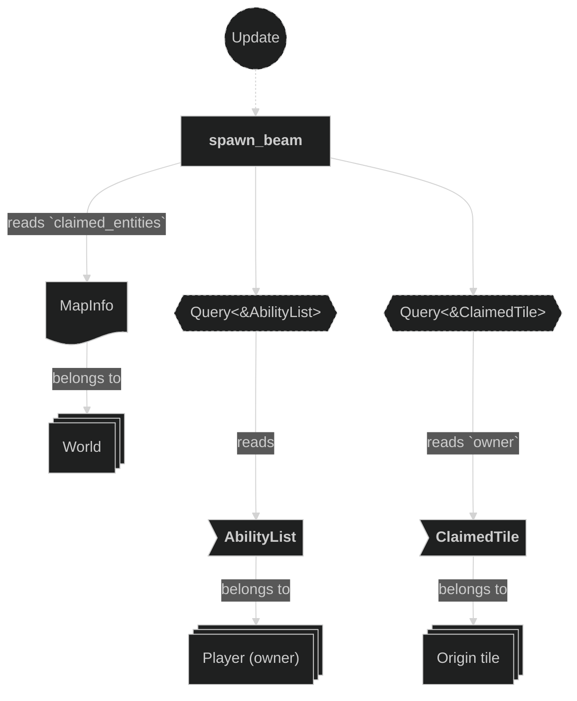
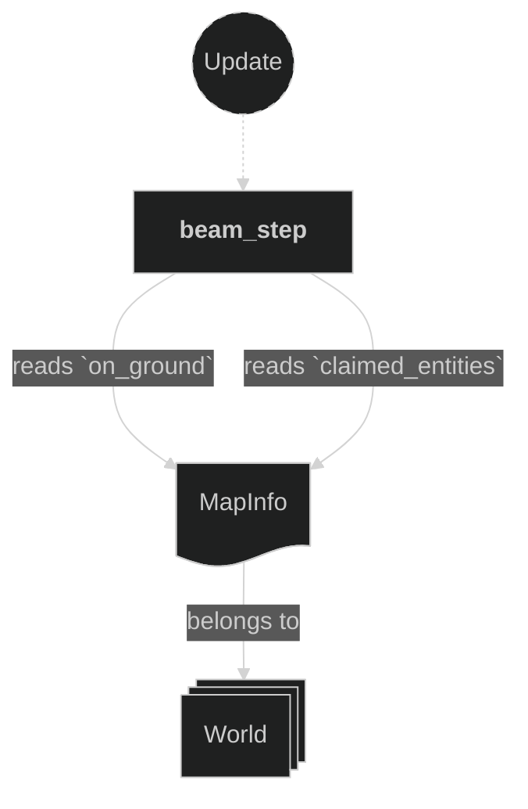
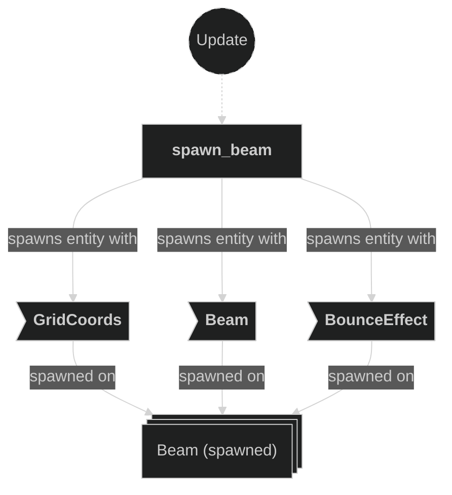
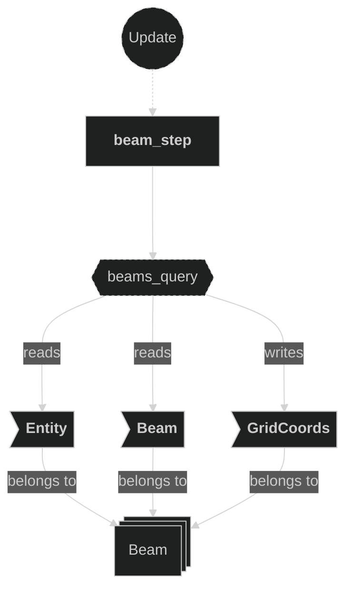
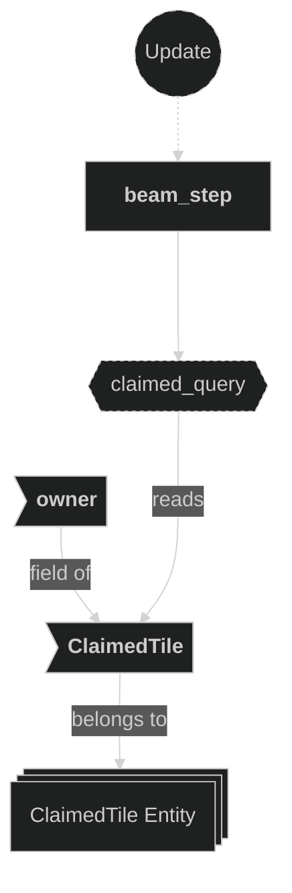
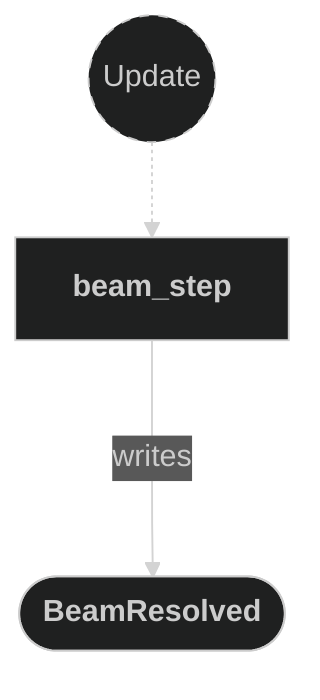
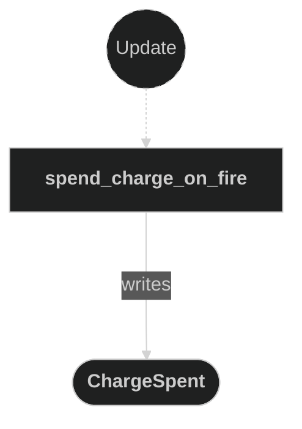

# Beam Plugin

Contains systems responsible for spawning and stepping beam projectiles fired by players, and for spending the firing player's beam charges. Tile ownership is handled separately by the Claim plugin, which reacts to the `BeamResolved` messages this plugin emits. When a player shoots, a `Beam` entity is created at the player's current grid position and advances one tile per beam-step timer tick in the firing direction. Each beam carries a resolved execution mode, `Beam::behavior` (`BeamBehavior`). `spawn_beam` resolves the shot with `resolve_fire`, which yields one of three outcomes based on firing context and the player's drafted abilities:

- **No beam** — firing from an already-claimed tile is refused: `resolve_fire` returns nothing and `spawn_beam` skips the spawn. The Input plugin applies the same check before writing `BeamFired`, so a refused shot also spends no charge. The `Backfill` ability is the sole exception (below).
- **Straight** (the baseline): the mode for any shot fired from unclaimed ground. It advances until it leaves the map bounds or the next tile is already claimed, resolving at the last unclaimed position (at minimum its own origin).
- **Backfill** (a drafted ability): advances through claimed and forbidden tiles until the next tile would be unclaimed, resolving on that unclaimed tile; despawns silently if none is found before the edge. `spawn_beam` selects it only when the beam is fired from already-claimed ground **and** the firing player's `AbilityList` contains `AbilityDescriptor::Backfill` (see the Abilities plugin doc) — it is what lets a player fire from their own territory at all.

Charges are spent **on fire**, not on resolve: `spend_charge_on_fire` reacts to `BeamFired` and decrements the owner's `BeamCharges::current` once per shot (emitting `ChargeSpent`). Because a refused shot writes no `BeamFired`, it costs nothing; the only shot that spends a charge yet claims nothing is a `Backfill` that reaches the map edge without finding an unclaimed tile. When a beam resolves, `BeamResolved` is emitted and the beam entity is despawned; the Claim plugin reads that message to update tile ownership and emit `TileClaimed`.

## Plugin workflow

- Startup phase
    - `setup_beam_step_timer` inserts the `BeamStepTimer` resource (repeating, period `config.timing.beam_step_secs`, default 0.0625 s).
- Update phase
    - Spawn Beam:
        - Reacts to `BeamFired` message
            - Reads:
                - `BeamFired` message fields (`owner`, `origin`, `direction`)
                - `Beam` and `GridCoords` components on active beams (to detect lane overlap)
                - `AbilityList` on the firing player (to check for the `Backfill` descriptor)
                - `MapInfo` resource and `ClaimedTile` components (to check whether the origin tile is already claimed)
            - Writes:
                - Calls `resolve_fire`; when it returns no behavior (origin already claimed and no `Backfill`), skips the message — no `Beam` is spawned
                - Otherwise spawns a `Beam` entity with `GridCoords` and `Beam{owner,direction,speed,behavior}`, where `behavior` is `BeamBehavior::Backfill` when the origin is claimed **and** the owner has drafted `Backfill`, otherwise `BeamBehavior::Straight`
                - Also inserts `BounceEffect` unless the owner already has an active beam on the same row (horizontal fire) or same column (vertical fire)
    - Beam Step:
        - Runs on every `BeamStepTimer` tick (62.5 ms)
            - Reads:
                - `Beam` component (`owner`, `direction`, `behavior`)
                - `MapInfo` resource (for bounds check and tile entity lookup)
                - `ClaimedTile` component on ground tile entities (for claimed-tile check)
            - Writes:
                - Advances `GridCoords` of the beam if the next tile is valid and unclaimed
                - Writes a `BeamResolved` message and despawns the beam when it must stop (a `Straight` beam is only ever fired from unclaimed ground, so it always resolves on an unclaimed tile; a `Backfill` beam that finds no unclaimed tile before the edge despawns silently)
    - Spend Charge On Fire:
        - Reacts to `BeamFired` message
            - Reads:
                - `BeamFired` message fields (`owner`)
                - `BeamCharges` component on the firing player entity
            - Writes:
                - Decrements `BeamCharges::current` on the firing player (saturating at zero), once per `BeamFired` — a shot refused at fire time writes no `BeamFired` and costs nothing, while a `Backfill` that claims nothing still costs its charge
                - Emits a `ChargeSpent` message (`owner`, `amount`)

## Plugin Systems

### Setup Beam Step Timer

Runs once at startup. Inserts the `BeamStepTimer` resource — a repeating `Timer` whose period is `config.timing.beam_step_secs` (default 0.0625 s) — that gates how frequently each beam advances by one tile.

### Spawn Beam

Reacts to `BeamFired` messages emitted by the input system. The `behavior` is resolved by `resolve_fire`, which reads whether the origin tile is already claimed (via `MapInfo` + `ClaimedTile`) and whether the firing player's `AbilityList` contains `AbilityDescriptor::Backfill`: a claimed origin without `Backfill` returns no behavior and `spawn_beam` skips the spawn entirely; a claimed origin with `Backfill` gives `BeamBehavior::Backfill`; an unclaimed origin gives `BeamBehavior::Straight`. When a beam is spawned it carries `GridCoords` (set to `origin`) and `Beam{owner, direction, speed, behavior}`. Additionally inserts `BounceEffect` on the spawned entity only when the owner has no existing beam traveling on the same lane — a horizontal beam suppresses `BounceEffect` if another of the owner's beams shares the same row (Y coordinate) and is also horizontal; a vertical beam suppresses it if another shares the same column (X coordinate) and is also vertical. This prevents overlapping visual effects when beams travel the same path. No sprite or transform is set up here — visual representation is handled by the effects and animations plugins reacting to the `BounceEffect` component.

### Beam Step

Runs every `BeamStepTimer` tick. For each `Beam` entity it computes the next grid position (`current + direction`) and `match`es on `Beam::behavior` for the stopping rules:

**Straight** (`BeamBehavior::Straight` — the default mode):
1. **Out of bounds** — if the next position is not on ground, back up through any forbidden areas; if the current position is unclaimed emit `BeamResolved` for it, then despawn.
2. **Already claimed** — if the `ClaimedTile` entity at the next position already has an owner, back up through forbidden areas; if the current position is unclaimed emit `BeamResolved` for it, then despawn.
3. Otherwise — advance: `GridCoords` is overwritten with the next position (which triggers `apply_translate_effect` in the Effects plugin to tween the sprite).

   A `Straight` beam is only ever fired from unclaimed ground (firing from a claimed tile is refused unless the player has `Backfill`, which fires a `Backfill` beam instead), so its resolve position is always unclaimed and it always emits `BeamResolved`.

**Backfill** (`BeamBehavior::Backfill` — selected contextually; see Spawn Beam above):
1. **Out of bounds** — if the next position is neither on ground nor in forbidden areas, despawn silently (no `BeamResolved` emitted, no tile claimed).
2. **Next tile is unclaimed ground** — emit `BeamResolved` for `next_position` (the unclaimed tile itself), and despawn.
3. Otherwise (claimed or forbidden tile ahead) — advance.

### Spend Charge On Fire

Reads `BeamFired` messages. For each message, decrements `BeamCharges::current` (saturating at zero) on the firing player entity identified by `message.owner`, and emits a `ChargeSpent` message. Spending on fire (rather than on resolve) means every committed shot costs exactly one charge. A shot refused before `BeamFired` is written (firing from a claimed tile without `Backfill`) costs nothing; the only shot that spends a charge without claiming a tile is a `Backfill` that reaches the map edge unclaimed. The resulting `Changed<BeamCharges>` detection drives the digit flip-counter animation in the Animations plugin.

## Components, Resources and Messages CRUD

### Read BeamFired messages

Used in the following systems:
- **spawn_beam**: used to trigger beam entity creation
- **spend_charge_on_fire**: used to trigger the per-shot charge decrement at fire time

### Query Beam entities (spawn)

Used in the following systems:
- **spawn_beam**: reads `Beam.owner`, `Beam.direction`, and `GridCoords` of all active beams to detect lane overlap before deciding whether to insert `BounceEffect`

### Read behavior-selection inputs (spawn)

Used in the following systems:
- **spawn_beam**: to resolve the shot via `resolve_fire`, reads the firing player's `AbilityList` (for the `Backfill` descriptor) and `MapInfo.claimed_entities` + the `ClaimedTile.owner` at the origin (to test whether the origin tile is already claimed). A claimed origin without `Backfill` yields no beam; a claimed origin with `Backfill` yields `Backfill`; an unclaimed origin yields `Straight`.

### Read MapInfo resource (beam step)

Used in the following systems:
- **beam_step**: checks `on_ground()` and `on_forbidden_areas()` for the next position and resolves tile entities via `claimed_entities`

### Write commands — spawn Beam entity

Used in the following systems:
- **spawn_beam**: spawns a new `Beam` entity with grid position, beam data, and bounce effect

### Query Beam entities

Used in the following systems:
- **beam_step**: reads `Beam` (owner + direction) and writes `GridCoords` on all active beam entities each timer tick

### Query ClaimedTile (beam step)

Used in the following systems:
- **beam_step**: checks whether the next ground tile's `ClaimedTile` already has an owner to decide if the beam must stop (Straight mode) or is unclaimed and should trigger resolution (Backfill mode)

### Write BeamResolved messages

Used in the following systems:
- **beam_step**: emits a `BeamResolved` message with the beam's current position and owner when the beam stops (out of bounds or claimed tile hit)

### Write commands — despawn Beam entity

Used in the following systems:
- **beam_step**: despawns the beam entity after emitting `BeamResolved` when a stopping condition is met

### Query BeamCharges (spend_charge_on_fire)

Used in the following systems:
- **spend_charge_on_fire**: reads and mutably decrements the `BeamCharges` component on the firing player entity at fire time (per `BeamFired`), once per shot

### Write ChargeSpent messages

Used in the following systems:
- **spend_charge_on_fire**: emits a `ChargeSpent` message (`owner`, `amount`) each time a charge is spent on fire (no consumers yet)

