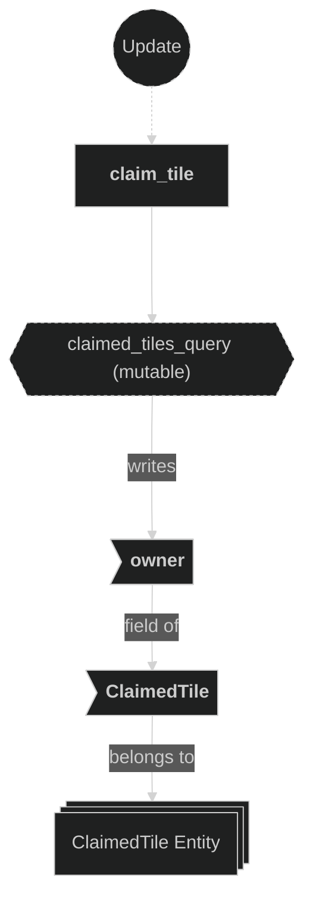

# Beam Plugin

Contains systems responsible for spawning and stepping beam projectiles fired by players, and for claiming tiles when a beam stops. When a player shoots, a `Beam` entity is created at the player's current grid position and advances one tile per beam-step timer tick in the firing direction until it either leaves the map bounds or hits an already-claimed tile. At that point a `BeamResolved` message is emitted, the tile ownership is updated via `claim_tile`, and the beam entity is despawned.

## Plugin workflow

- Startup phase
    - `setup_beam_step_timer` inserts the `BeamStepTimer` resource (62.5 ms repeating).
- Update phase
    - Spawn Beam:
        - Reacts to `BeamFired` message
            - Reads:
                - `BeamFired` message fields (`owner`, `origin`, `direction`)
                - `Player` component of the firing player (for beam metadata)
            - Writes:
                - Spawns a new `Beam` entity with `GridCoords`, `Beam{owner,direction,speed}`, and `BounceEffect`
    - Beam Step:
        - Runs on every `BeamStepTimer` tick (62.5 ms)
            - Reads:
                - `Beam` component (`owner`, `direction`)
                - `MapInfo` resource (for bounds check and tile entity lookup)
                - `ClaimedTile` component on ground tile entities (for claimed-tile check)
            - Writes:
                - Advances `GridCoords` of the beam if the next tile is valid and unclaimed
                - Writes a `BeamResolved` message and despawns the beam when it must stop
    - Claim Tile:
        - Reacts to `BeamResolved` message
            - Reads:
                - `BeamResolved` message fields (`position`, `owner`)
                - `MapInfo` resource (to resolve `GridCoords` → claimed tile `Entity` via `claimed_entities`)
            - Writes:
                - Mutates `ClaimedTile::owner` on the matched entity in `MapInfo::claimed_entities`

## Plugin Systems

### Setup Beam Step Timer

Runs once at startup. Inserts the `BeamStepTimer` resource — a repeating `Timer` with a 62.5 ms period — that gates how frequently each beam advances by one tile.

### Spawn Beam

Reacts to `BeamFired` messages emitted by the input system. For each message, checks that the firing player does not already have an active `Beam` entity. If none exists, spawns a new `Beam` entity carrying `GridCoords` (set to `origin`), `Beam{owner, direction, speed}`, and `BounceEffect` (to trigger the visual bounce when the beam moves). No sprite or transform is set up here — visual representation is handled by the effects and animations plugins reacting to the `BounceEffect` component.

### Beam Step

Runs every `BeamStepTimer` tick. For each `Beam` entity it computes the next grid position (`current + direction`) and applies two stopping rules in order:

1. **Out of bounds** — if the next position is not on ground (`MapInfo::on_ground()`), emit `BeamResolved` for the *current* position and despawn.
2. **Already claimed** — if the `ClaimedTile` entity at the next position already has an owner, emit `BeamResolved` for the *current* position and despawn.

If neither rule fires, the beam advances: `GridCoords` is overwritten with the next position (which triggers `apply_translate_effect` in the Effects plugin to tween the sprite).

### Claim Tile

Reads `BeamResolved` messages. For each message, looks up the corresponding claimed tile entity from `MapInfo::claimed_entities` using the message's `GridCoords` position, then mutates `ClaimedTile::owner` on that entity to record the new owning player. This is the authoritative write that marks a tile as belonging to a player, and is subsequently read by the Animations plugin to switch the tile's visual appearance.

## Components, Resources and Messages CRUD

### Read BeamFired messages

Used in the following systems:
- **spawn_beam**: used to trigger beam entity creation

### Read BeamResolved messages

Used in the following systems:
- **claim_tile**: used to trigger tile ownership mutation when a beam stops

### Query Player (spawn)

Used in the following systems:
- **spawn_beam**: reads the `Player` component of the firing entity to validate ownership and set beam metadata

### Read MapInfo resource (beam step)

Used in the following systems:
- **beam_step**: used to check `on_ground()` for the next position and to resolve the ground tile entity via `claimed_entities` HashMap

### Read MapInfo resource (claim tile)

Used in the following systems:
- **claim_tile**: used to look up the claimed tile entity via `MapInfo::claimed_entities` for the resolved `GridCoords`

### Write commands — spawn Beam entity

Used in the following systems:
- **spawn_beam**: spawns a new `Beam` entity with grid position, beam data, and bounce effect

### Query Beam entities

Used in the following systems:
- **beam_step**: reads `Beam` (owner + direction) and writes `GridCoords` on all active beam entities each timer tick

### Query ClaimedTile (beam step)

Used in the following systems:
- **beam_step**: checks whether the next ground tile's `ClaimedTile` already has an owner to decide if the beam must stop

### Write BeamResolved messages

Used in the following systems:
- **beam_step**: emits a `BeamResolved` message with the beam's current position and owner when the beam stops (out of bounds or claimed tile hit)

### Write ClaimedTile (claim tile)

Used in the following systems:
- **claim_tile**: mutates `ClaimedTile::owner` on the matched claimed tile entity to record the new owning player

### Write commands — despawn Beam entity

Used in the following systems:
- **beam_step**: despawns the beam entity after emitting `BeamResolved` when a stopping condition is met

